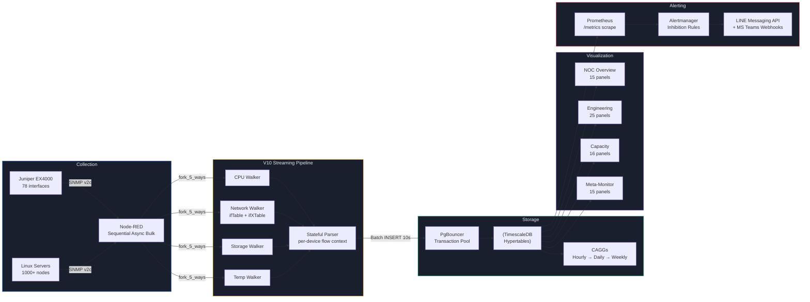

<div align="center">
  <br/>
  <a href="https://github.com/PATTANAKORN025/IMS">
    
  </a>
  <br/>
   &nbsp;&nbsp;&nbsp;&nbsp;
   &nbsp;&nbsp;&nbsp;&nbsp;
   &nbsp;&nbsp;&nbsp;&nbsp;
   &nbsp;&nbsp;&nbsp;&nbsp;
   &nbsp;&nbsp;&nbsp;&nbsp;
   &nbsp;&nbsp;&nbsp;&nbsp;
  
  <br/>
  <br/>
</div>

<h1 align="center">Industrial Monitoring System (IMS)</h1>

<div align="center">
 <p>
  <a href="README.md"> <b>English</b></a> |
  <a href="README-th.md"> <b>ไทย</b></a> |
  <a href="README-zh-CN.md"> <b>中文</b></a>
 </p>
</div>

<div align="center">
 <strong>High-Precision Manufacturing Telemetry & Statistical Process Control</strong>
</div>

<br/>

> **กลุ่มเป้าหมาย:** Open-Source Community, System Evaluators, Deployment Engineers.
> **วัตถุประสงค์:** จุดเริ่มต้นหลักสำหรับเข้าถึงโค้ด IMS อธิบายความสามารถ สถาปัตยกรรม และขั้นตอนการติดตั้ง
> **แหล่งที่มา:** สถาปัตยกรรมและความสามารถได้รับการอัปเดตและยืนยันกับระบบจริงเมื่อ 2026-08-10.

<div align="center">
  
  <br/>
  <br/>
  >  **APEX Circuit IMS | Advanced Manufacturing Intelligence & NOC**
</div>

<div align="center">
  <a href="#quick-start"> <b>Release v1.0</b></a> &nbsp;•&nbsp;
  <a href="LICENSE"> <b>MIT License</b></a> &nbsp;•&nbsp;
  <a href="https://www.docker.com/"> <b>Docker Ready</b></a> &nbsp;•&nbsp;
  <a href="https://grafana.com/"> <b>Grafana v11+</b></a> &nbsp;•&nbsp;
  <a href="https://nodered.org/"> <b>Node-RED v4+</b></a> &nbsp;•&nbsp;
  <a href="https://www.timescale.com/"> <b>TimescaleDB 2.x</b></a>
  <br/><br/>
  <a href="#quick-start"> <b>Status:</b> Tests Passing</a> &nbsp;•&nbsp;
  <a href="#quick-start"> <b>K6:</b> Stress-Tested</a> &nbsp;•&nbsp;
  <a href="data-generators/"> <b>Data:</b> Digital Twin</a>
</div>

<br/>

<div align="center">
  <table>
    <tr>
      <td align="center" width="250">
        <a href="docs/architecture/IMS_PLATFORM_BOOK.md" style="text-decoration:none;">
          <br/>
          <b>PLATFORM BOOK</b><br/>
          <sub>ENTER</sub>
        </a>
      </td>
      <td align="center" width="250">
        <a href="docs/architecture/ARCHITECTURE.md" style="text-decoration:none;">
          <br/>
          <b>ARCHITECTURE</b><br/>
          <sub>READ</sub>
        </a>
      </td>
    </tr>
  </table>
</div>

<br/>

## ภาพรวมของระบบ (System Overview)

**IMS (Industrial Monitoring System)** เป็นแพลตฟอร์มที่เชื่อมโยงช่องว่างระหว่างการผลิตที่มีความแม่นยำสูง (High-Precision Manufacturing) และระบบไอทีระดับองค์กร แพลตฟอร์มนี้สร้างขึ้นบน Node-RED, TimescaleDB และ Grafana เพื่อบูรณาการข้อมูลเมทริกซ์ด้านไอที (เช่น เซิร์ฟเวอร์, สวิตช์เครือข่าย) เข้ากับข้อมูล OT (Operational Technology) แบบรวมศูนย์ลงใน PostgreSQL ฐานข้อมูลเดียว

**สถานการณ์จริงหน้างาน (The Factory Floor Reality - OT):** ในการผลิตแผ่นวงจรพิมพ์ (PCB) ขั้นสูง เครื่องจักร Laser Direct Imaging (LDI) ต้องการการตัดสินใจแบบไร้ความหน่วง (Zero-Latency) การเปลี่ยนแปลงเพียงเล็กน้อยของอุณหภูมิเลเซอร์หรือแรงดันสุญญากาศอาจทำให้เกิดข้อผิดพลาดในการจัดตำแหน่ง (Registration Error) ซึ่งส่งผลให้เกิดของเสียที่มีมูลค่าสูง พนักงานควบคุมเครื่องจึงต้องการระบบป้ายแจ้งเตือน (Andon Board) แบบรหัสสีที่ตอบสนองทันที เพื่อสั่งหยุดสายการผลิตเมื่อขีดจำกัดการควบคุมกระบวนการเชิงสถิติ (SPC) เช่น ค่า Cpk ลดลงต่ำกว่าเกณฑ์ที่ยอมรับได้

**การรวมศูนย์ข้อมูล (The Convergence - IT/OT):** IMS มอบความสามารถในการมองเห็นนี้โดยการผสานความเข้มงวดทางไอทีเข้ากับความเป็นจริงของ OT ระบบจะตรวจสอบสถานะของโหนดโครงสร้างพื้นฐานกว่า 1,000 โหนด (เซิร์ฟเวอร์, สวิตช์เครือข่าย, ความหน่วงในการนำเข้าข้อมูล) ควบคู่ไปกับโทรมาตรของเครื่องจักร LDI เมื่อเกิดความล้มเหลวในการจัดตำแหน่ง (Alignment) ของ LDI วิศวกรสามารถหาความสัมพันธ์กับปัญหาเครือข่ายตกหล่นหรือ CPU ของเซิร์ฟเวอร์ทำงานหนักได้ทันทีผ่านหน้าจอแสดงผลเดียวกัน

**สถาปัตยกรรมเชิงลึก (The Architecture - IT):** ภายใต้ระบบ ประสิทธิภาพถูกขับเคลื่อนโดยไปป์ไลน์ Node-RED แบบ stateful ที่จัดการการนำเข้าข้อมูลแบบอะซิงโครนัส (Async) และ PgBouncer ที่ดูแลการเชื่อมต่อ (Connection Pooling) โดยมี TimescaleDB รับหน้าที่ประมวลผลหนัก—คำนวณค่าพื้นฐาน 3&sigma; แบบหมุนเวียน (Z-Scores) และ Continuous Aggregates แบบเรียลไทม์ ทำให้ Grafana สามารถเรนเดอร์แดชบอร์ดได้ในระดับเสี้ยววินาที แม้ในขณะที่คิวรีข้อมูลโทรมาตรในอดีตหลายล้านแถว

<table style="border:none; border-collapse:collapse; width:100%;">

<tr>
<td align="center" style="border:none; padding:8px; width:33%;">
 <br/>
 <sub><b>NOC Overview</b> — Fleet Health Envelope</sub>
</td>
<td align="center" style="border:none; padding:8px; width:33%;">
 <br/>
 <sub><b>Engineering Drill-Down</b> — Per-Machine Diagnostics</sub>
</td>
<td align="center" style="border:none; padding:8px; width:33%;">
 <br/>
 <sub><b>Capacity Planning</b> — Predictive Forecasting</sub>
</td>
</tr>
<tr>
<td align="center" style="border:none; padding:8px; width:33%;">
 <br/>
 <sub><b>LDI Manufacturing</b> — Command Center</sub>
</td>
<td align="center" style="border:none; padding:8px; width:33%;">
 <br/>
 <sub><b>LDI Andon Board</b> — Operator Floor View</sub>
</td>
<td align="center" style="border:none; padding:8px; width:33%;">
 <br/>
 <sub><b>LDI Engineering</b> — Yield & SPC Analytics</sub>
</td>
</tr>
</table>

>  **สำรวจระบบนิเวศแดชบอร์ด:** ดูรายละเอียดเพิ่มเติมใน [15-Dashboard Macro-to-Micro Architecture Guide](docs/product/DASHBOARD_ECOSYSTEM-th.md) เพื่อเจาะลึกว่า IMS ย่อขนาดจากการติดตามตัวชี้วัดธุรกิจระดับ C-Level ลงไปจนถึงข้อมูลการวินิจฉัยในระดับเซ็นเซอร์ได้อย่างไร

<br/>

---

## ความสามารถหลัก (Core Capabilities)

<table>
<tr>
<td align="center" width="33%">
 <h3>การนำเข้าโทรมาตร (Telemetry Ingestion)</h3>
 ระบบ Node-RED walkers แบบขนาน ซึ่งใช้การดึงข้อมูล SNMP ปริมาณมากแบบตามลำดับ (sequential bulk SNMP polling) และ HTTP endpoints และทำการบันทึกข้อมูลแบบถาวรลงใน TimescaleDB ผ่านการรวมกลุ่มทรานแซกชัน (transaction pooling) ด้วย PgBouncer<br/><br/>
 **ตรวจสอบแล้ว:** [nodered-ingestion-20260813.txt](docs/evidence/runtime/nodered-ingestion-20260813.txt)
</td>
<td align="center" width="33%">
 <h3>การควบคุมกระบวนการเชิงสถิติ (Statistical Process Control)</h3>
 เมทริกซ์ SPC แบบเรียลไทม์ (Cpk) และค่าพื้นฐาน 3&sigma; แบบหมุนเวียน (การตรวจจับความผิดปกติด้วย Z-Score) ซึ่งประเมินในระดับฐานข้อมูล เพื่อการแจ้งเตือนล่วงหน้า
</td>
<td align="center" width="33%">
 <h3>Continuous Aggregation</h3>
 การสรุปผลรายชั่วโมง, รายวัน, และรายสัปดาห์ จะถูกคำนวณอัตโนมัติโดย TimescaleDB เพื่อรักษาเวลาในการเรนเดอร์ Grafana ให้อยู่ในระดับต่ำกว่าวินาทีสำหรับช่วงเวลาที่กว้าง<br/><br/>
 **ตรวจสอบแล้ว:** [cagg-policies-20260813.txt](docs/evidence/runtime/cagg-policies-20260813.txt)
</td>
</tr>
</table>

<br/>

---

## เริ่มต้นใช้งานอย่างรวดเร็ว (Quick Start: ทางแยก 2 เส้นทาง)

> [!NOTE]
> **ขอบเขตของระบบจำลอง (Simulator Boundary):** ทั้งสองเส้นทางนี้จะรันสแต็ก IMS ในเครื่องแบบโลคัลโดยใช้ตัวจำลองข้อมูล SNMP/HTTP ในตัว (`ims-snmpsim`) ระบบนี้ **ไม่ได้** เชื่อมต่อกับอุปกรณ์ในโรงงานจริงหรืออุปกรณ์เครือข่ายภายนอก ตัวจำลองนี้จะสร้างข้อมูลโทรมาตรและลำดับเหตุการณ์การเตือนที่สมจริงเพื่อการตรวจสอบ (Validation)

เลือกเส้นทางตามบทบาทและสิ่งที่คุณต้องการบรรลุผล:

### เส้นทาง A: สำหรับผู้ประเมินระบบ (The Evaluator Tour)

_ออกแบบมาสำหรับผู้จัดการ, ผู้รีวิว UI/UX และผู้ประเมินระบบที่ต้องการเห็นการทำงานของแดชบอร์ดและเวิร์กโฟลว์_

```bash
git clone https://github.com/PATTANAKORN025/IMS.git
cd IMS
cp .env.example .env
make up      # docker compose up -d (เริ่มการทำงานสแต็กพร้อมตัวจำลอง)
sleep 40 && make verify
open http://localhost:3000
```

> **สิ่งที่จะได้พบ:** ระบบจำลองข้อมูลแบบเบาบาง (~10-15 แถว/นาที) ช่วยให้คุณคลิกดูศูนย์บัญชาการผลิต LDI, แดชบอร์ด Andon Board ของ Operator และดูแผนภูมิสมรรถนะ Cpk แบบเรียลไทม์ได้อย่างลื่นไหล
> **ตรวจสอบแล้ว:** รัน `docker compose ps` เมื่อ 2026-08-13, เก็บถาวรไว้ที่ [`docs/evidence/runtime/compose-ps-20260813.txt`](docs/evidence/runtime/compose-ps-20260813.txt)

### เส้นทาง B: สำหรับวิศวกรผู้ทดสอบสมรรถนะ (The Performance Proving Ground)

_ออกแบบมาสำหรับ SREs, DBAs และ System Architects ที่ต้องการตรวจสอบ "สมรรถนะจริง" (Actual Performance) ของระบบภายใต้ภาระงาน IT/OT ที่หนาแน่น_

```bash
git clone https://github.com/PATTANAKORN025/IMS.git
cd IMS
cp .env.example .env
make up-prod   # เปิดตัวสแต็กด้วยการจัดสรรทรัพยากรระดับโปรดักชัน
make test-load # เริ่มการทำงานเฟรมเวิร์กโหลดเทสต์ K6
```

> **สิ่งที่จะได้พบ:** เฟรมเวิร์ก K6 จะจำลองสภาวะการทำงานของโหนดโครงสร้างพื้นฐานกว่า 1,000 โหนด ซึ่งจะอัดข้อมูลเข้าสู่จุดรับข้อมูล Node-RED อย่างหนัก และทดสอบขีดจำกัด Continuous Aggregation ของ TimescaleDB คุณสามารถตรวจสอบความหน่วง (Latency) และคิวการเชื่อมต่อ (Queue Depths) ของ PgBouncer ได้แบบสดๆ บนแดชบอร์ด `IMS Meta-Monitoring`

<details>
<summary><b>ข้อจำกัดที่ทราบแล้วและการตั้งค่าเพิ่มเติม</b></summary>

- Nginx reverse-proxy ถูกตั้งค่าไว้สำหรับ `localhost` และต้องมีการปรับใช้ใบรับรอง (certificate) แบบแมนนวลสำหรับสภาพแวดล้อมโปรดักชัน
- การบูรณาการ Grafana Alertmanager (LINE/Teams) จะล้มเหลวแบบเงียบๆ จนกว่าจะมีการระบุโทเค็นอย่างชัดเจนในไฟล์ `.env`

</details>

### การตรวจสอบและหลักฐาน

คำกล่าวอ้างทางสถาปัตยกรรมทุกประการได้รับการสนับสนุนโดย continuous integration หรือสคริปต์ทดสอบที่ชัดเจน สำหรับผลการทดสอบโหลด, หลักฐานการถดถอยเชิงภาพ (visual regression), และการตรวจสอบการกู้คืนระบบจากภัยพิบัติ โปรดอ้างอิง **[ดัชนีหลักฐาน (Evidence Index)](docs/evidence/INDEX.md)**

<details>
<summary><b>คำสั่งที่ใช้งานได้</b></summary>

| คำสั่ง                     | คำอธิบาย                                                                          |
| -------------------------- | --------------------------------------------------------------------------------- |
| `make up`                  | เริ่มบริการทั้งหมด (โหมดผู้พัฒนาพร้อมตัวจำลอง SNMP)                               |
| `make down`                | หยุดบริการทั้งหมด                                                                 |
| `make verify`              | ตรวจสอบความสมบูรณ์ของระบบทั้งหมด (คอนเทนเนอร์, ฐานข้อมูล, ไปป์ไลน์, การแจ้งเตือน) |
| `make test-unit`           | รัน unit tests (18 การทดสอบพาร์สเซอร์และตัวนับ)                                   |
| `make test-load`           | รันการทดสอบความเครียด K6 บนไปป์ไลน์ (50→200 VUs)                                  |
| `make test-visual`         | จับภาพหน้าจอแดชบอร์ดผ่าน Playwright                                               |
| `make validate-dashboards` | Lint JSON แดชบอร์ดเพื่อตรวจสอบกริดทับซ้อนและความเสียหายของฐานสิบหก                |
| `make backup`              | สำรองข้อมูลฐานข้อมูล                                                              |

</details>

---

## สถาปัตยกรรม (Architecture)



<details>
<summary><b>การไหลของข้อมูล — ทีละขั้นตอน (Data Flow — Step by Step)</b></summary>

1. **Collection** — Node-RED แตก 4 walkers สำหรับสวิตช์เครือข่าย (CPU, Storage, Network, Temp) และ 5 walkers สำหรับเซิร์ฟเวอร์ (+LDI) ทุกๆ 10 วินาที รีจิสทรีของอุปกรณ์จะถูกโหลดจาก `public.devices` ทุกๆ 5 นาที
2. **Walking** — รัน async bulk walks ตามลำดับ (`session.subtree` ด้วย `maxRepetitions: 50`) ซ็อกเก็ต UDP เดียวช่วยลดการทิ้งแพ็กเก็ตที่ระดับสวิตช์ เซอร์กิตเบรกเกอร์จะทริปหลังจากล้มเหลว 2 ครั้ง พร้อมด้วยโพรบ HALF_OPEN แบบอัตโนมัติ
3. **Parsing** — `sre_parser` จะรักษาสถานะแบบรายอุปกรณ์ไว้ใน flow context (`dev_state_<deviceId>`), และบัฟเฟอร์แถวข้อมูลใน `batch_buf_<deviceId>` สัญญาณชีพแบบออฟไลน์ (`_walker: "offline"`) จะลบเมทริกซ์ทั้งหมดเป็นศูนย์ทันทีเมื่ออุปกรณ์ล้มเหลว
4. **Storage** — การฟลัชอิสระที่ควบคุมด้วยตัวจับเวลา: แต่ละประเภทตาราง (sys/net/ldi) จะ insert ก็ต่อเมื่อบัฟเฟอร์มีแถวข้อมูล ความล้มเหลวบางส่วนของ walker จะไม่บล็อกการเขียนข้อมูลที่ไม่เกี่ยวข้องกัน
5. **Continuous Aggregation** — CAGGs รายชั่วโมงจะรีเฟรชทุกๆ 30 นาที การสรุปผลรายวัน/รายสัปดาห์จะรวมข้อมูลจากรายชั่วโมง ระยะเวลาการเก็บรักษาข้อมูลจริง (ถูกตรวจสอบกับฐานข้อมูลที่รันอยู่ ไม่ใช่ประวัติการย้ายข้อมูล -- ดู `docs/architecture/DATA_RETENTION.md` สำหรับเอกสารระบุความแตกต่างระหว่างสองสิ่งนี้): ข้อมูลดิบ `sys_metrics`/`net_metrics`/`ldi_metrics` 30 วัน, `ldi_data` 180 วัน, และข้อมูลสรุปรายชั่วโมง 2 ปี
6. **Visualization** — 15 แดชบอร์ดแบ่งตาม 2 โดเมน: 5 โครงสร้างพื้นฐาน (NOC Overview, Engineering Drill-Down, AIOps & Capacity, Meta-Monitoring, Ingestion Latency) + 10 การผลิต (Easy Overview, LDI Manufacturing, Operator Andon, Alarm Console, Alarm Dictionary, Alarm Response (MTTA/MTTR), Engineering Analytics & SPC, Machine Snapshot, Data Readiness, Factory Digital Twin)
7. **Alerting** — Prometheus สแครป `/metrics`, Alertmanager ทำการกำหนดเส้นทางไปยัง LINE Messaging API + MS Teams พร้อมลิงก์ runbook (การส่งจริงต้องการการกำหนดค่า credentials จากโอเปอเรเตอร์ ซึ่งออกแบบมาให้ไม่มีให้แต่เริ่มต้น) ความผิดปกติด้วย Z-Score ทำการแจ้งเตือนผ่าน Grafana SQL บน TimescaleDB

</details>

<details>
<summary><b>สถาปัตยกรรมแดชบอร์ด (Dashboard Architecture)</b></summary>

15 แดชบอร์ด — 5 โครงสร้างพื้นฐาน, 10 การผลิต (`monitoring/grafana/dashboards/{infrastructure,manufacturing}/`, จัดเตรียมไว้ในโฟลเดอร์ Grafana ที่แยกจากกัน — ดู **[Ownership](docs/architecture/OWNERSHIP.md)** สำหรับขอบเขตโดเมน) ตารางฉบับเต็มพร้อมจำนวนพาเนลและคำอธิบาย: **[Dashboard Inventory](docs/architecture/DASHBOARD_INVENTORY.md)** — ถูกสร้างอัตโนมัติจากไฟล์ JSON ของแดชบอร์ดเอง (`node scripts/generate-dashboard-inventory.js`), มีการตรวจสอบโดย CI เพื่อไม่ให้ข้อมูลคลาดเคลื่อนจากแดชบอร์ดจริงในแบบที่การพิมพ์ตารางด้วยมืออาจเกิดขึ้นได้

**ระบบการออกแบบ (Design System):** Cyberpunk HUD — พื้นหลัง `#030407`, พาเล็ตสีแบบ Tailwind (`#10B981` Healthy, `#F59E0B` Warning, `#EF4444` Critical, `#3B82F6` Accent), ฟอนต์ Roboto Mono สำหรับค่าสถิติ, พาเนลแบบ glassmorphism, โครงร่างแบบ Grid-24 ป้องกันการทับซ้อน

</details>

---

## หน้าจอแสดงผลผนัง NOC (NOC Wall-Display)

```bash
export GRAFANA_API_KEY="your-admin-api-key"
./scripts/create-playlist.sh http://localhost:3000 "$GRAFANA_API_KEY" 30
open "http://localhost:3000/playlists/play/1?kiosk=tv&autofitpanels"
```

| โหมด         | URL                       | กรณีใช้งาน                                                                   |
| ------------ | ------------------------- | ---------------------------------------------------------------------------- |
| **TV Kiosk** | `?kiosk=tv&autofitpanels` | หน้าจอแสดงผลผนัง NOC — ซ่อนองค์ประกอบ chrome ทั้งหมด, ปรับขนาดพาเนลอัตโนมัติ |
| **Clean**    | `?kiosk`                  | โหมดการนำเสนอ — ซ่อนแถบด้านข้าง + แถบนำทางด้านบน                             |
| **Embedded** | `?kiosk=1`                | การฝังด้วย iframe — ซ่อนทุกสิ่ง                                              |

---

<details>
<summary><b>เทคโนโลยีที่ใช้ (Tech Stack)</b></summary>

| เลเยอร์           | เทคโนโลยี                 | วัตถุประสงค์                                                                                     |
| ----------------- | ------------------------- | ------------------------------------------------------------------------------------------------ |
| **Orchestration** | Docker Compose            | คอนเทนเนอร์สแต็ก 7 บริการ พร้อมโอเวอร์เลย์สำหรับ dev/prod                                        |
| **Collection**    | Node-RED + net-snmp       | การดึงข้อมูล SNMP ปริมาณมากแบบตามลำดับ (Sequential async bulk SNMP walks), walker แบบขนาน 5-เธรด |
| **Database**      | TimescaleDB (PostgreSQL)  | Hypertables พร้อมด้วย Continuous Aggregates, การบีบอัดข้อมูล 90% หลัง 7 วัน                      |
| **Visualization** | Grafana 13.1.1            | 15 แดชบอร์ด (5 โครงสร้างพื้นฐาน + 10 การผลิต), ระบบเตือนความผิดปกติด้วย state-timeline           |
| **Alerting**      | Prometheus + Alertmanager | การสแครปเมทริกซ์, inhibition rules, LINE Messaging API + MS Teams webhooks                       |
| **Load Testing**  | K6                        | การทดสอบความเครียดไปป์ไลน์ (50→200 VUs), ขีดจำกัด p95<500ms                                      |
| **SLA Probing**   | Blackbox Exporter         | การตรวจสอบ endpoint ผ่าน HTTP/TCP/ICMP                                                           |

</details>

<details>
<summary><b>สคีมาฐานข้อมูล (Database Schema)</b></summary>

- `devices` — รีจิสทรีอุปกรณ์, แหล่งข้อมูลหลักสำหรับโครงสร้างพื้นฐานที่ถูก poll ด้วย SNMP และเครื่องจักร LDI (`device_type`)
- `sys_metrics` / `net_metrics` — โทรมาตรของโครงสร้างพื้นฐาน (CPU/RAM/disk/temp, RX/TX ต่ออินเทอร์เฟซ), hypertables
- `ldi_metrics` — โทรมาตรดั้งเดิมของการผลิต throughput/PE/JE/humidity/power/vibration, hypertable
- `ldi_data` / `ldi_alarm_log` — โทรมาตร V2 normalized LDI + alarms, การเชื่อมโยงเหตุการณ์แบบแม่นยำสำหรับการวิเคราะห์ RCA (Root Cause Analysis) ผ่าน `related_log_id`, hypertables
- `sys_hourly` / `net_hourly` / `ldi_hourly` / `ldi_data_1m` / `ldi_data_15m` / `ldi_data_1h` / `ldi_data_hourly` — continuous aggregates
- `v_machine_spc_fleet` / `v_ldi_rca_recent_window` / `v_ldi_rca_truth_test` — materialized views, รีเฟรชทุกๆ 60 วินาที

จำนวนคอลัมน์ที่แม่นยำ, รายการมุมมอง/CAGG ทั้งหมด, และจำนวนไมเกรชันที่ถูกประยุกต์ใช้: **[Database Schema Inventory](docs/architecture/DATABASE_SCHEMA.md)** — ถูกสร้างอัตโนมัติจาก `information_schema` + `timescaledb_information.*` (`node scripts/generate-schema-inventory.js`), ตรวจสอบด้วย CI เทียบกับฐานข้อมูลที่ทำงานจริง

</details>

<details>
<summary><b>โครงสร้างโปรเจกต์ (Project Structure)</b></summary>

```text
IMS/
├── monitoring/grafana/        # Grafana dashboards + provisioning
│  ├── dashboards/          #  10 ไฟล์ JSON แดชบอร์ด (source of truth)
│  └── library-panels/        #  พาเนลไลบรารีส่วนกลาง (Fleet Health Score)
├── nodered_data/           # Node-RED pipeline engine
│  ├── flows/             #  ingestion.json + alerting.json (source)
│  ├── lib/              #  circuit-breaker.js, parser, units.js
│  └── settings.js          #  functionGlobalContext, การตั้งค่าการพิสูจน์ตัวตน (auth)
├── postgres/             # การกำหนดค่าฐานข้อมูลเริ่มต้น
│  └── init/             #  001-init-timescaledb.sql (schema + views)
├── database/migrations/        #  56 ไฟล์ไมเกรชันตามลำดับ (013-081, บางตัวเลขถูกข้าม/เก็บถาวร), ประยุกต์ใช้โดย db-migrate
├── tests/               # ชุดทดสอบ
│  ├── k6/              #  ทดสอบความเครียดไปป์ไลน์ด้วย K6
│  ├── unit/             #  Unit tests สำหรับ Parser และ counter
│  └── playwright/          #  ทดสอบ Visual regression + ถ่ายภาพหน้าจอ
├── scripts/              # สคริปต์ปฏิบัติการ
│  ├── create-playlist.sh       #  เครื่องมือสร้างเพลย์ลิสต์หน้าจอแสดงผลผนัง NOC
│  ├── generate-showcase.sh      #  ตัวสร้างภาพหน้าจอแดชบอร์ด
│  ├── snmp-discover.js        #  การค้นหาองค์กรระดับ Enterprise SNMP OID
│  └── build-flows.js         #  ผสาน nodered_data/flows/*.json → flows.json (ใช้โดย CI ด้วย)
├── assets/              # ภาพหน้าจอแดชบอร์ด (สร้างโดยอัตโนมัติ)
├── docs/               # เอกสารด้านสถาปัตยกรรม, ระบบการออกแบบ, การแก้ไขปัญหา
│  ├── architecture/         #  ARCHITECTURE.md, GRAFANA_DESIGN_SYSTEM.md
│  ├── operations/          #  TROUBLESHOOTING.md, SCALING_PLAN.md
│  ├── audits/            #  รายงานการตรวจสอบและสรุปผลทางเทคนิค
│  └── product/            #  PRODUCT.md, ONBOARDING_SCRIPT.md
└── .mimocode/skills/         # 24 ทักษะแบบกำหนดเองสำหรับ DevOps automation
```

</details>

---

## เอกสารประกอบและชุมชน (Documentation & Community)

<div align="center">

###  กลยุทธ์ระดับบริหารและคุณค่าทางธุรกิจ (Executive & Business Strategy)

|                                  เอกสาร                                   | คำอธิบาย                                                            |
| :-----------------------------------------------------------------------: | ------------------------------------------------------------------- |
|      [**Business Value & ROI**](docs/business/BUSINESS_VALUE_ROI.md)      | บทสรุปผู้บริหาร, การลดต้นทุน, การลดเวลา MTTR, และผลกระทบเชิงกลยุทธ์ |
| [**Platform Book (เริ่มที่นี่)**](docs/architecture/IMS_PLATFORM_BOOK.md) | ศูนย์รวมระบบนำทางสำหรับชุดเอกสารทั้งหมด, อภิธานศัพท์                |
|              [**Product Context**](docs/product/PRODUCT.md)               | จุดประสงค์ของผลิตภัณฑ์, กลุ่มผู้ใช้งานเป้าหมาย, และจุดยืนของระบบ    |

###  ระบบอัจฉริยะในสายการผลิต (Manufacturing & LDI Intelligence)

|                                        เอกสาร                                         | คำอธิบาย                                                                              |
| :-----------------------------------------------------------------------------------: | ------------------------------------------------------------------------------------- |
| [**Manufacturing Platform Plan**](docs/architecture/IMS_MANUFACTURING_PLATFORM_V2.md) | การแยกโดเมน Infra/manufacturing, แผนการทดสอบ/Go-Live และแผนสำรอง                      |
|         [**Manufacturing Domain**](docs/architecture/MANUFACTURING_DOMAIN.md)         | รูปแบบสคีมา/แดชบอร์ด LDI และกระบวนการ Onboarding                                      |
|                [**LDI SPC Guide**](docs/architecture/LDI_SPC_GUIDE.md)                | ระเบียบวิธีและสูตรของ Process capability (Cpk)                                        |
|                [**LDI RCA Guide**](docs/architecture/LDI_RCA_GUIDE.md)                | ระเบียบวิธีความสัมพันธ์ระดับรากฐานของสาเหตุ (Root-cause correlation: Lift/Confidence) |
|       [**LDI Validation Protocol**](docs/operations/LDI_VALIDATION_PROTOCOL.md)       | ขั้นตอนการอนุมัติขั้นโปรดักชัน 4 เฟส                                                  |

###  สถาปัตยกรรมหลักและความปลอดภัย (Core Architecture & Security)

|                                  เอกสาร                                  | คำอธิบาย                                                        |
| :----------------------------------------------------------------------: | --------------------------------------------------------------- |
|          [**Architecture**](docs/architecture/ARCHITECTURE.md)           | บริบทของระบบ, ADRs, สถาปัตยกรรมสตรีมมิ่ง, กลยุทธ์ CAGG          |
|   [**Visual Architecture**](docs/architecture/ARCHITECTURE_DIAGRAM.md)   | ไดอะแกรม Mermaid C4 Model และ sequence flows                    |
|             [**Data Flow**](docs/architecture/DATA_FLOW.md)              | ไดอะแกรมไปป์ไลน์แบบ end-to-end, ลำดับการรวมข้อมูลของ CAGG จริง  |
|       [**Database Schema**](docs/architecture/DATABASE_SCHEMA.md)        | การอ้างอิงตาราง/คอลัมน์/มุมมองที่สร้างอัตโนมัติ (ตรวจสอบโดย CI) |
|        [**Security Model**](docs/architecture/SECURITY_MODEL.md)         | ขอบเขตความเชื่อถือ, การพิสูจน์ตัวตนแบบรายอะแดปเตอร์, และ RBAC   |
| [**Equipment Integration (EAP)**](docs/architecture/EAP_ARCHITECTURE.md) | สัญญาของอะแดปเตอร์ SNMP, HTTP/JSON, และ SECS/GEM                |
|             [**Ownership**](docs/architecture/OWNERSHIP.md)              | ขอบเขตโดเมนที่ถูกบังคับใช้ผ่าน `CODEOWNERS`                     |
|     [**Design System**](docs/architecture/GRAFANA_DESIGN_SYSTEM.md)      | พาเล็ตสีเพื่อสื่อความหมาย, รูปแบบตัวอักษร, เงื่อนไขขีดจำกัด     |
|   [**Dashboard Inventory**](docs/architecture/DASHBOARD_INVENTORY.md)    | ตารางจำนวนแดชบอร์ด/พาเนลที่ถูกสร้างอัตโนมัติ (ตรวจสอบโดย CI)    |

### ปฏิบัติการและคู่มือการดูแลระบบ (Operations & SRE Playbooks)

|                                เอกสาร                                 | คำอธิบาย                                                               |
| :-------------------------------------------------------------------: | ---------------------------------------------------------------------- |
|              [**User Manual**](docs/user/USER_MANUAL.md)              | คู่มือแดชบอร์ด, การอ้างอิงเมทริกซ์, เพลย์บุ๊กการตอบสนองต่อการแจ้งเตือน |
|            [**Admin Manual**](docs/admin/ADMIN_MANUAL.md)             | การปฏิบัติงานของคอนเทนเนอร์, ไมเกรชัน, สำรอง/กู้คืนระบบ                |
|          [**Operator SOP**](docs/operations/SOP_OPERATOR.md)          | ขั้นตอนการปฏิบัติงานมาตรฐาน (SOP) สำหรับพื้นโรงงาน / ระดับ L1 NOC      |
|   [**Troubleshooting & Alarms**](docs/operations/ALARM_PLAYBOOK.md)   | เพลย์บุ๊กการระบุแก้ไขโค้ดแจ้งเตือนและการแก้ไขปัญหา                     |
|     [**Incident Response**](docs/operations/INCIDENT_RESPONSE.md)     | กรอบงานความรุนแรง + ตัวอย่างเหตุการณ์จริงที่แก้ไขแล้ว                  |
| [**Alarm Severity Guide**](docs/architecture/ALARM_SEVERITY_GUIDE.md) | อนุกรมวิธานความรุนแรง 4 ระดับ, ขอบเขต ISA-18.2                         |
|       [**Backup & Restore**](docs/operations/BACKUP_RESTORE.md)       | หลักฐานจริงจาก dr-test.sh, ขั้นตอน, และข้อควรระวัง                     |
|          [**DR Test Plan**](docs/operations/DR_TEST_PLAN.md)          | แผนการทดสอบการกู้คืนระบบจากภัยพิบัติ 3 การจำลองซ้อมรับมือ              |
|       [**Data Retention**](docs/architecture/DATA_RETENTION.md)       | นโยบายการเก็บรักษาข้อมูลสด/การบีบอัดข้อมูล                             |
|     [**Release Checklist**](docs/operations/RELEASE_CHECKLIST.md)     | สิ่งที่ต้องตรวจสอบก่อนทำแท็ก (tag) release                             |
|       [**Troubleshooting**](docs/operations/TROUBLESHOOTING.md)       | ปัญหาที่พบบ่อย, คำสั่งดีบัก, ขั้นตอนการกู้คืน                          |

###  ชุมชนและส่วนอ้างอิง (Community & Reference)

|                              เอกสาร                              | คำอธิบาย                                               |
| :--------------------------------------------------------------: | ------------------------------------------------------ |
| [**Video Onboarding Script**](docs/product/ONBOARDING_SCRIPT.md) | สตอรี่บอร์ดและคำแนะนำสำหรับการบันทึกวิดีโอสอนการใช้งาน |
|               [**Contributing**](CONTRIBUTING.md)                | เวิร์กโฟลว์การพัฒนา, การตั้งชื่อสาขา, กฎเกณฑ์การคอมมิต |
|            [**Code of Conduct**](CODE_OF_CONDUCT.md)             | มาตรฐานชุมชนและการบังคับใช้                            |
|                [**Security Policy**](SECURITY.md)                | การรายงานช่องโหว่ความปลอดภัย                           |
|      [**Bug Report**](.github/ISSUE_TEMPLATE/bug_report.md)      | รายงานข้อบกพร่องหรือการถดถอย                           |
| [**Feature Request**](.github/ISSUE_TEMPLATE/feature_request.md) | แนะนำคุณสมบัติใหม่                                     |

</div>

---

<div align="center">

**สร้างด้วยความแม่นยำ ออกแบบมาเพื่อประสิทธิภาพและเวลาทำงานสูงสุด (uptime)**

[MIT License](LICENSE) — 2026 ผู้ร่วมพัฒนา IMS

</div>
