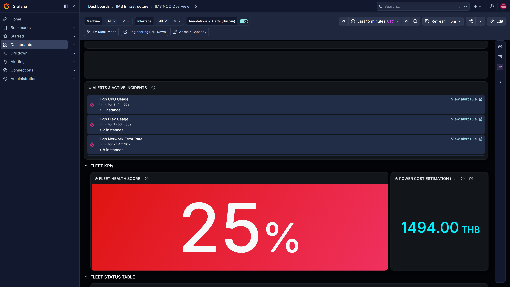
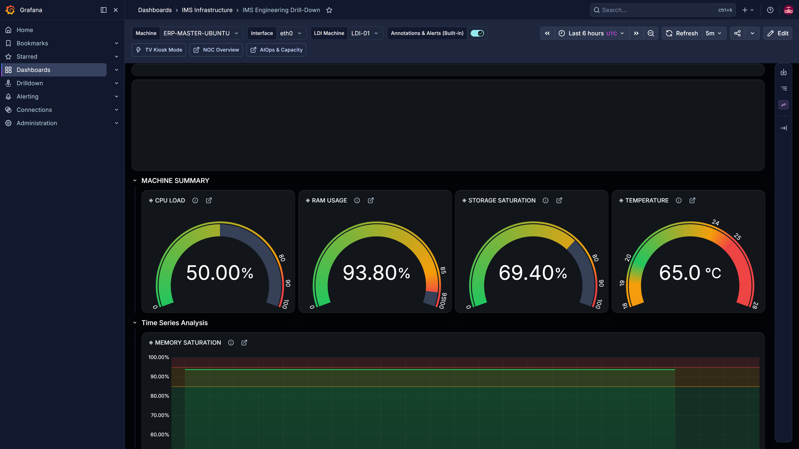
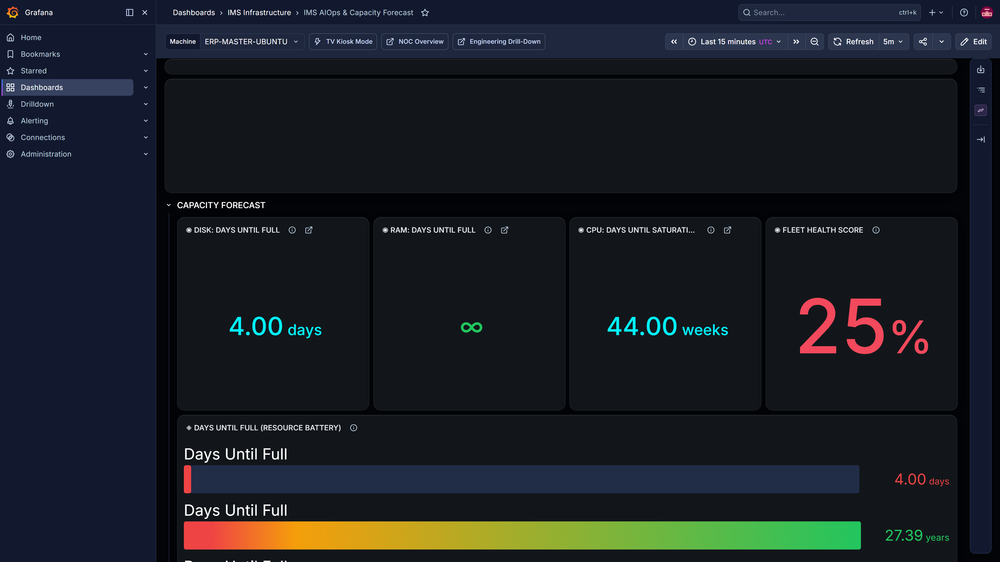
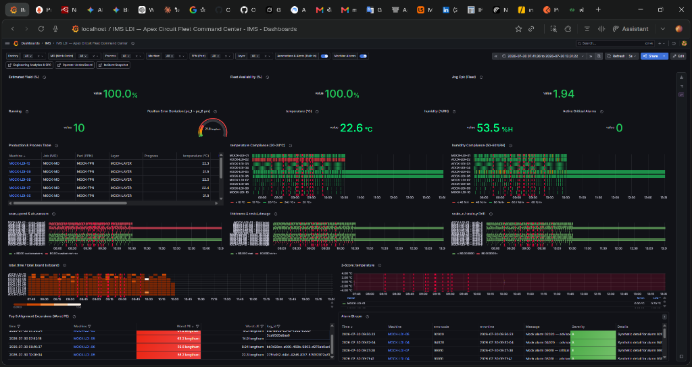
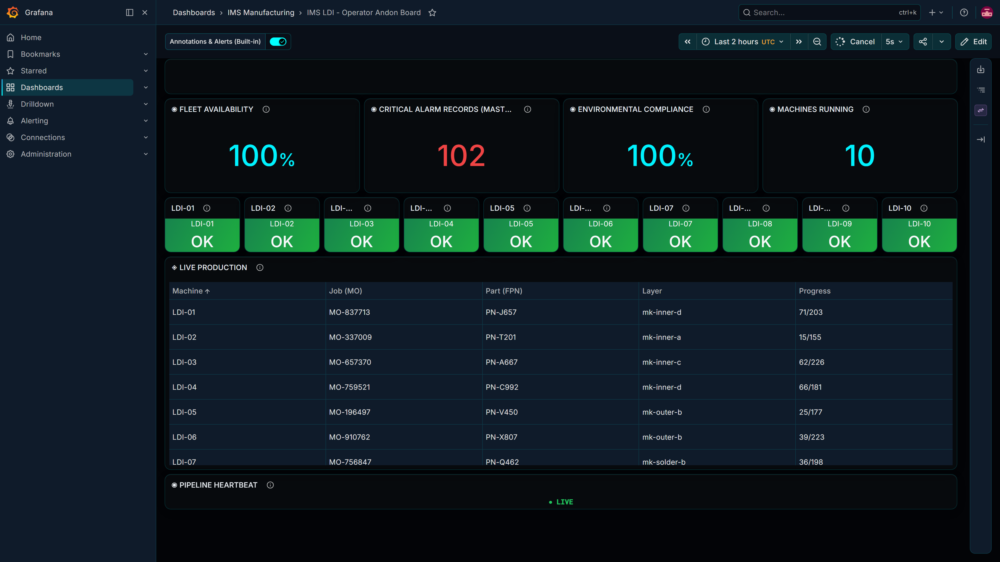
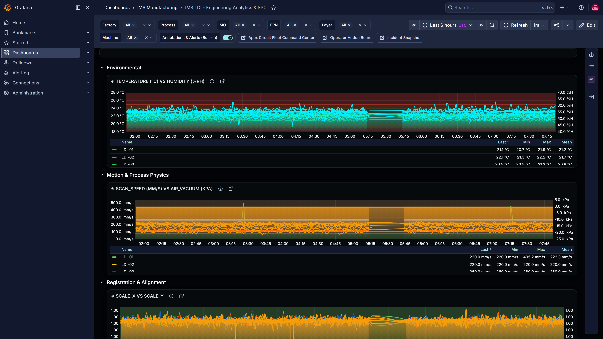
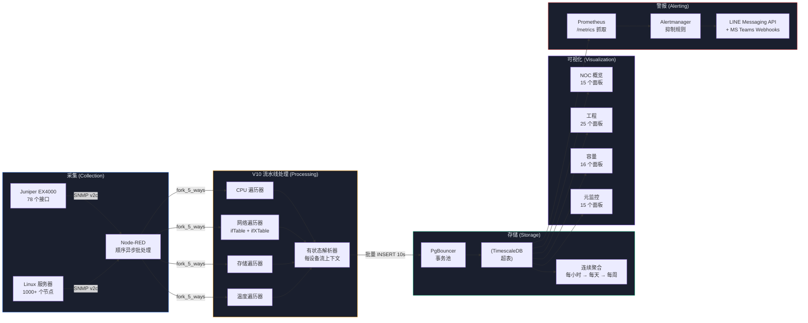

<div align="center">
  <br/>
  <a href="https://github.com/PATTANAKORN025/IMS">
    
    
  </a>
  <br/>
   &nbsp;&nbsp;&nbsp;&nbsp;
   &nbsp;&nbsp;&nbsp;&nbsp;
   &nbsp;&nbsp;&nbsp;&nbsp;
   &nbsp;&nbsp;&nbsp;&nbsp;
   &nbsp;&nbsp;&nbsp;&nbsp;
   &nbsp;&nbsp;&nbsp;&nbsp;
  
  <br/>
  <br/>
</div>

<h1 align="center">Industrial Monitoring System (IMS)</h1>

<div align="center">
 <p>
  <a href="README.md"> <b>English</b></a> |
  <a href="README-th.md"> <b>ไทย</b></a> |
  <a href="README-zh-CN.md"> <b>中文</b></a>
 </p>
</div>

<div align="center">
 <strong>High-Precision Manufacturing Telemetry & Statistical Process Control</strong>
</div>

<br/>

> **受众:** 开源社区、系统评估人员、部署工程师。
> **目标:** IMS 代码库的主要入口点，概述功能、架构和部署步骤。
> **出处:** 架构和功能于 2026-08-10 针对实时系统进行了更新和验证。

<div align="center">
  
  <br/>
  <br/>
  <a href="https://git.io/typing-svg"></a>
</div>

<div align="center">
  <a href="#quick-start"></a>
  <a href="LICENSE"></a>
  <a href="https://www.docker.com/"></a>
  <a href="https://grafana.com/"></a>
  <a href="https://nodered.org/"></a>
  <a href="https://www.timescale.com/"></a>
  <br>
  <a href="#quick-start"></a>
  <a href="#quick-start"></a>
  <a href="data-generators/"></a>
</div>

<br/>

<div align="center" justify-content="space-between">
  <a href="./docs/architecture/IMS_PLATFORM_BOOK.md"></a>
  <a href="./docs/architecture/ARCHITECTURE.md"></a>
</div>

<br/>

## 系统概述

**IMS（工业监控系统，Industrial Monitoring System）** 弥合了高精度制造与企业 IT 之间的鸿沟。它是一个基于 Node-RED、TimescaleDB 和 Grafana 构建的遥测监控平台，将 IT 基础设施指标（如服务器、网络交换机）与 OT（操作技术）数据集成到一个由 PostgreSQL 支持的统一存储库中。

**工厂车间现实 (OT)：** 在先进的 PCB 制造中，激光直接成像 (LDI) 机器需要零延迟决策。激光温度或真空压力的微小变化都可能立即导致对准错误 (Registration Error)，从而产生昂贵的废品。操作员需要即时的颜色编码安灯看板 (Andon Board)，以便在统计过程控制 (SPC) 限制（如 Cpk）降至可接受阈值以下时停止生产线。

**IT/OT 融合 (The Convergence)：** IMS 通过将传统的 IT 严谨性与 OT 现实相结合来提供这种可见性。它在监控 1000 多个基础设施节点（服务器、网络交换机、摄取延迟）的健康状况的同时，并排监控 LDI 机器遥测数据。当 LDI 对准失败时，工程师可以使用相同的单一管理平台 (Single Pane of Glass) 立即将其与网络中断或服务器 CPU 峰值相关联。

**架构设计 (IT)：** 在底层，性能由管理异步数据摄取的基于状态的 Node-RED 管道和处理连接池的 PgBouncer 驱动。TimescaleDB 承担繁重的工作——实时计算滚动 3&sigma; 基线（Z-Scores）和连续聚合 (Continuous Aggregates)，确保 Grafana 即使在查询数百万行历史遥测数据时也能在亚秒级渲染仪表板。

<table style="border:none; border-collapse:collapse; width:100%;">

<tr>
<td align="center" style="border:none; padding:8px; width:33%;">
 <br/>
 <sub><b>NOC 概览</b> — 舰队健康包络</sub>
</td>
<td align="center" style="border:none; padding:8px; width:33%;">
 <br/>
 <sub><b>工程向下钻取</b> — 单机诊断</sub>
</td>
<td align="center" style="border:none; padding:8px; width:33%;">
 <br/>
 <sub><b>容量规划</b> — 预测性预测</sub>
</td>
</tr>
<tr>
<td align="center" style="border:none; padding:8px; width:33%;">
 <br/>
 <sub><b>LDI 制造</b> — 指挥中心</sub>
</td>
<td align="center" style="border:none; padding:8px; width:33%;">
 <br/>
 <sub><b>LDI 安灯看板</b> — 操作员车间视图</sub>
</td>
<td align="center" style="border:none; padding:8px; width:33%;">
 <br/>
 <sub><b>LDI 工程</b> — 良率与 SPC 分析</sub>
</td>
</tr>
</table>

>  **探索生态系统：** 查看完整的 [15-Dashboard Macro-to-Micro Architecture Guide](docs/product/DASHBOARD_ECOSYSTEM-zh-CN.md)（15 仪表板宏观到微观架构指南），深入了解 IMS 如何从 C 级业务指标一直缩放到传感器级诊断数据。

<br/>

---

## 核心能力

<table>
<tr>
<td align="center" width="33%">
 <h3>遥测摄取</h3>
 并行的 Node-RED 遍历器 (walkers) 利用顺序批量 SNMP 轮询和 HTTP 端点，通过 PgBouncer 事务池将数据持久化到 TimescaleDB。<br/><br/>
 **已验证：** [nodered-ingestion-20260813.txt](docs/evidence/runtime/nodered-ingestion-20260813.txt)
</td>
<td align="center" width="33%">
 <h3>统计过程控制 (SPC)</h3>
 实时 SPC 指标 (Cpk) 和滚动 3&sigma; 基线（Z-Score 异常检测）在数据库层面进行评估，用于早期预警。
</td>
<td align="center" width="33%">
 <h3>连续聚合 (Continuous Aggregates)</h3>
 由 TimescaleDB 自动计算每小时、每天和每周的汇总数据，以在跨越大时间范围时维持亚秒级的 Grafana 渲染时间。<br/><br/>
 **已验证：** [cagg-policies-20260813.txt](docs/evidence/runtime/cagg-policies-20260813.txt)
</td>
</tr>
</table>

<br/>

---

## 快速入门（快速启动：两条路径）

> [!NOTE]
> **模拟器边界 (Simulator Boundary)：** 这两条路径都使用内置的 SNMP/HTTP 数据模拟器 (`ims-snmpsim`) 在本地运行 IMS 堆栈。它们 **不会** 连接到真实的工厂设备或外部网络设备。该模拟器生成逼真的、有界限的遥测和警报序列以进行验证。

请根据您的角色和您想要实现的目标选择您的路径：

### 路径 A：系统评估之旅 (The Evaluator Tour)

_专为希望查看仪表板和工作流程的经理、UI/UX 审阅者和系统评估者而设计。_

```bash
git clone https://github.com/PATTANAKORN025/IMS.git
cd IMS
cp .env.example .env
make up      # docker compose up -d (启动包含模拟器的堆栈)
sleep 40 && make verify
open http://localhost:3000
```

> **您将看到什么：** 温和的模拟（~10-15 行/分钟），让您点击查看 LDI 制造指挥中心、操作员安灯看板，并查看实时的 Cpk 能力图表。
> **已验证：** `docker compose ps` 于 2026-08-13 运行，已存档于 [`docs/evidence/runtime/compose-ps-20260813.txt`](docs/evidence/runtime/compose-ps-20260813.txt)。

### 路径 B：性能试验场 (The Performance Proving Ground)

_专为希望在极端 IT/OT 负载下验证系统“实际性能”的 SRE、DBA 和系统架构师设计。_

```bash
git clone https://github.com/PATTANAKORN025/IMS.git
cd IMS
cp .env.example .env
make up-prod   # 以生产级资源分配启动堆栈
make test-load # 启动 K6 压力测试框架
```

> **您将看到什么：** K6 框架将模拟 1000 个节点的基础设施环境，猛烈冲击 Node-RED 摄取端点，并测试 TimescaleDB 的连续聚合极限。您可以在 `IMS Meta-Monitoring` 仪表板上实时监控摄取延迟和 PgBouncer 队列深度。

<details>
<summary><b>已知限制和手动配置</b></summary>

- Nginx 反向代理配置为 `localhost`，在生产环境中需要手动部署证书。
- 除非在 `.env` 文件中提供显式令牌，否则 Grafana Alertmanager 集成 (LINE/Teams) 将静默失败。

</details>

### 验证与证据

每一项架构声明都由持续集成或显式测试脚本支持。有关负载测试结果、视觉回归证据和灾难恢复验证，请参阅 **[证据索引](docs/evidence/INDEX.md)**。

<details>
<summary><b>可用命令</b></summary>

| 命令                       | 描述                                             |
| -------------------------- | ------------------------------------------------ |
| `make up`                  | 启动所有服务（带 SNMP 模拟器的开发模式）         |
| `make down`                | 停止所有服务                                     |
| `make verify`              | 完整的系统健康检查（容器、数据库、管道、警报）   |
| `make test-unit`           | 运行单元测试（18 个解析器 + 计数器测试）         |
| `make test-load`           | 运行 K6 管道压力测试（50→200 个虚拟用户）        |
| `make test-visual`         | 通过 Playwright 捕获仪表板屏幕截图               |
| `make validate-dashboards` | 检查仪表板 JSON 以防止网格重叠和十六进制颜色损坏 |
| `make backup`              | 数据库备份                                       |

</details>

---

## 架构



<details>
<summary><b>数据流 — 分步说明</b></summary>

1. **采集 (Collection)** — Node-RED 每 10 秒 fork 出 4 个用于网络交换机（CPU、存储、网络、温度）的遍历器和 5 个用于服务器（及 LDI）的遍历器。设备注册表每 5 分钟从 `public.devices` 加载一次。
2. **遍历 (Walking)** — 顺序异步批量遍历（`session.subtree` 配置 `maxRepetitions: 50`）。单个 UDP 套接字消除了交换机级别的丢包现象。在 2 次失败后熔断器跳闸，并自动进行 HALF_OPEN 探测。
3. **解析 (Parsing)** — `sre_parser` 在流上下文 (`dev_state_<deviceId>`) 中维护每个设备的状态，并在 `batch_buf_<deviceId>` 中缓冲数据行。离线心跳（`_walker: "offline"`）在设备发生故障时立即将所有指标归零。
4. **存储 (Storage)** — 定时控制的独立刷新：只有在各自缓冲区有数据行时，每种表类型 (sys/net/ldi) 才会执行插入操作。部分遍历器故障不会阻塞不相关的数据写入。
5. **连续聚合 (Continuous Aggregates)** — 每小时聚合每 30 分钟刷新一次。每天/每周聚合由每小时数据汇总而来。实时保留（已针对运行中的数据库进行验证，而非迁移历史记录——有关两者之间的偏差记录，请参阅 `docs/architecture/DATA_RETENTION.md`）：原始的 `sys_metrics`/`net_metrics`/`ldi_metrics` 保留 30 天，`ldi_data` 保留 180 天，每小时汇总数据保留 2 年。
6. **可视化 (Visualization)** — 跨越 2 个领域的 15 个仪表板：5 个基础设施域（NOC 概览、工程向下钻取、AIOps 与容量、元监控、摄取延迟） + 10 个制造域（简易概览、LDI 制造、操作员安灯看板、警报控制台、警报字典、警报响应 (MTTA/MTTR)、工程分析与 SPC、机器快照、数据就绪度、工厂数字孪生）。
7. **警报 (Alerting)** — Prometheus 抓取 `/metrics`，Alertmanager 路由至 LINE Messaging API + 带有运行手册链接的 MS Teams（实际交付需要操作员配置的凭据，设计上默认缺失）。通过基于 TimescaleDB 的 Grafana SQL 实现 Z-Score 异常检测。

</details>

<details>
<summary><b>仪表板架构</b></summary>

15 个仪表板 — 5 个基础设施域，10 个制造域（`monitoring/grafana/dashboards/{infrastructure,manufacturing}/`，配置到单独的 Grafana 文件夹中——有关领域边界请参阅 **[所有权](docs/architecture/OWNERSHIP.md)**）。包含面板计数和描述的完整表格：**[仪表板清单](docs/architecture/DASHBOARD_INVENTORY.md)** — 由仪表板 JSON 本身自动生成 (`node scripts/generate-dashboard-inventory.js`)，并经过 CI 检查，因此它不会像手动输入的表格那样与真实的仪表板发生静默偏差。

**设计系统：** 赛博朋克 HUD（Cyberpunk HUD） — `#030407` 背景，Tailwind 调色板（`#10B981` 健康，`#F59E0B` 警告，`#EF4444` 严重，`#3B82F6` 强调），统计值使用 Roboto Mono 字体，玻璃拟态面板，Grid-24 无重叠布局。

</details>

---

## NOC 大屏显示

```bash
export GRAFANA_API_KEY="your-admin-api-key"
./scripts/create-playlist.sh http://localhost:3000 "$GRAFANA_API_KEY" 30
open "http://localhost:3000/playlists/play/1?kiosk=tv&autofitpanels"
```

| 模式         | URL                       | 用例                                              |
| ------------ | ------------------------- | ------------------------------------------------- |
| **TV 模式**  | `?kiosk=tv&autofitpanels` | NOC 大屏显示 — 隐藏所有 UI 框架，自动适应面板大小 |
| **纯净模式** | `?kiosk`                  | 演示模式 — 隐藏侧边栏 + 顶部导航                  |
| **嵌入模式** | `?kiosk=1`                | iframe 嵌入 — 隐藏所有内容                        |

---

<details>
<summary><b>技术栈</b></summary>

| 层级         | 技术                      | 目的                                                               |
| ------------ | ------------------------- | ------------------------------------------------------------------ |
| **编排**     | Docker Compose            | 具有开发/生产覆盖配置的 7 服务容器堆栈                             |
| **采集**     | Node-RED + net-snmp       | 顺序异步批量 SNMP 遍历，5 线程并行遍历器                           |
| **数据库**   | TimescaleDB (PostgreSQL)  | 具有连续聚合 (Continuous Aggregates) 的超表，7 天后达到 90% 压缩率 |
| **可视化**   | Grafana 13.1.1            | 15 个仪表板（5 个基础设施 + 10 个制造），状态时间线异常            |
| **警报**     | Prometheus + Alertmanager | 指标抓取，抑制规则，LINE Messaging API + MS Teams webhooks         |
| **负载测试** | K6                        | 管道压力测试（50→200 虚拟用户），阈值 p95<500ms                    |
| **SLA 探测** | Blackbox Exporter         | HTTP/TCP/ICMP 端点监控                                             |

</details>

<details>
<summary><b>数据库模式</b></summary>

- `devices` — 设备注册表，SNMP 轮询基础设施和 LDI 机器 (`device_type`) 的单一真实数据源
- `sys_metrics` / `net_metrics` — 基础设施遥测（CPU/内存/磁盘/温度，各接口 RX/TX），超表
- `ldi_metrics` — 传统制造产量/PE/JE/湿度/功率/振动，超表
- `ldi_data` / `ldi_alarm_log` — V2 规范化 LDI 遥测 + 警报，通过 `related_log_id` 进行确切事件 RCA 关联，超表
- `sys_hourly` / `net_hourly` / `ldi_hourly` / `ldi_data_1m` / `ldi_data_15m` / `ldi_data_1h` / `ldi_data_hourly` — 连续聚合 (Continuous Aggregates)
- `v_machine_spc_fleet` / `v_ldi_rca_recent_window` / `v_ldi_rca_truth_test` — 物化视图，每 60 秒刷新一次

确切的列数、完整的视图/连续聚合 (Continuous Aggregates) 列表以及应用的迁移计数：**[数据库模式清单](docs/architecture/DATABASE_SCHEMA.md)** — 从 `information_schema` + `timescaledb_information.*` 自动生成 (`node scripts/generate-schema-inventory.js`)，并根据实时数据库进行 CI 检查。

</details>

<details>
<summary><b>项目结构</b></summary>

```text
IMS/
├── monitoring/grafana/        # Grafana 仪表板 + 预配
│  ├── dashboards/          #  10 个 JSON 仪表板文件（事实来源）
│  └── library-panels/        #  共享库面板（舰队健康评分）
├── nodered_data/           # Node-RED 管道引擎
│  ├── flows/             #  ingestion.json + alerting.json（源代码）
│  ├── lib/              #  circuit-breaker.js, parser, units.js
│  └── settings.js          #  functionGlobalContext，认证配置
├── postgres/             # 数据库初始化
│  └── init/             #  001-init-timescaledb.sql（模式 + 视图）
├── database/migrations/        #  57 个排序的迁移文件 (013-082，部分编号跳过/存档)，由 db-migrate 应用
├── tests/               # 测试套件
│  ├── k6/              #  K6 管道压力测试
│  ├── unit/             #  解析器与计数器单元测试
│  └── playwright/          #  视觉回归 + 屏幕截图捕获
├── scripts/              # 运维脚本
│  ├── create-playlist.sh       #  NOC 大屏显示播放列表创建器
│  ├── generate-showcase.sh      #  仪表板屏幕截图生成器
│  ├── snmp-discover.js        #  企业 SNMP OID 发现
│  └── build-flows.js         #  合并 nodered_data/flows/*.json → flows.json（也被 CI 使用）
├── assets/              # 仪表板屏幕截图（自动生成）
├── docs/               # 架构、设计系统、故障排除文档
│  ├── architecture/         #  ARCHITECTURE.md, GRAFANA_DESIGN_SYSTEM.md
│  ├── operations/          #  TROUBLESHOOTING.md, SCALING_PLAN.md
│  ├── audits/            #  审计报告与技术简报
│  └── product/            #  PRODUCT.md, ONBOARDING_SCRIPT.md
└── .mimocode/skills/         # 24 个用于 DevOps 自动化的自定义技能
```

</details>

---

## 文档与社区

## 文档与社区 (Documentation & Community)

<div align="center">

###  高管与业务战略 (Executive & Business Strategy)

|                                 文档                                 | 描述                                                   |
| :------------------------------------------------------------------: | ------------------------------------------------------ |
|   [**Business Value & ROI**](docs/business/BUSINESS_VALUE_ROI.md)    | 高管摘要、成本节约、缩短故障恢复时间 (MTTR) 及战略影响 |
| [**平台手册（从这里开始）**](docs/architecture/IMS_PLATFORM_BOOK.md) | 整个文档集的导航中心，术语词汇表                       |
|               [**产品背景**](docs/product/PRODUCT.md)                | 产品目的、目标受众和定位                               |

###  制造与 LDI 智能 (Manufacturing & LDI Intelligence)

|                                  文档                                  | 描述                                          |
| :--------------------------------------------------------------------: | --------------------------------------------- |
| [**制造平台计划**](docs/architecture/IMS_MANUFACTURING_PLATFORM_V2.md) | 基础设施/制造领域分离，验证/浸泡/灾备演练计划 |
|        [**制造域**](docs/architecture/MANUFACTURING_DOMAIN.md)         | LDI 模式/仪表板模式及接入流程                 |
|         [**LDI SPC 指南**](docs/architecture/LDI_SPC_GUIDE.md)         | 过程能力 (Cpk) 方法论与公式                   |
|         [**LDI RCA 指南**](docs/architecture/LDI_RCA_GUIDE.md)         | 根本原因关联（提升度/置信度）方法论           |
|     [**LDI 验证协议**](docs/operations/LDI_VALIDATION_PROTOCOL.md)     | 4 阶段生产签字验收程序                        |

### ️ 核心架构与安全 (Core Architecture & Security)

|                            文档                             | 描述                                       |
| :---------------------------------------------------------: | ------------------------------------------ |
|        [**架构**](docs/architecture/ARCHITECTURE.md)        | 系统上下文、ADRs、流媒体架构、CAGG 策略    |
| [**可视化架构**](docs/architecture/ARCHITECTURE_DIAGRAM.md) | Mermaid C4 模型图和顺序流                  |
|        [**数据流**](docs/architecture/DATA_FLOW.md)         | 端到端管道图，真实的 CAGG 汇总链           |
|   [**数据库模式**](docs/architecture/DATABASE_SCHEMA.md)    | 自动生成的表/列/视图参考（CI 检查验证）    |
|     [**安全模型**](docs/architecture/SECURITY_MODEL.md)     | 信任边界、各适配器身份验证及 RBAC          |
| [**设备集成 (EAP)**](docs/architecture/EAP_ARCHITECTURE.md) | SNMP、HTTP/JSON 以及 SECS/GEM 适配器契约   |
|        [**所有权**](docs/architecture/OWNERSHIP.md)         | 通过 `CODEOWNERS` 强制执行的领域边界       |
| [**设计系统**](docs/architecture/GRAFANA_DESIGN_SYSTEM.md)  | 语义调色板、排版、阈值契约                 |
| [**仪表板清单**](docs/architecture/DASHBOARD_INVENTORY.md)  | 自动生成的仪表板/面板计数表（CI 检查验证） |

### ️ 运维与 SRE 手册 (Operations & SRE Playbooks)

|                              文档                               | 描述                                   |
| :-------------------------------------------------------------: | -------------------------------------- |
|            [**用户手册**](docs/user/USER_MANUAL.md)             | 仪表板指南、指标参考、警报响应手册     |
|          [**管理员手册**](docs/admin/ADMIN_MANUAL.md)           | 容器运维、迁移、备份与恢复             |
|        [**操作员 SOP**](docs/operations/SOP_OPERATOR.md)        | 工厂车间 / 一级 NOC 标准操作程序       |
|     [**故障排除与警报**](docs/operations/ALARM_PLAYBOOK.md)     | 警报代码解决和故障排除手册             |
|      [**事件响应**](docs/operations/INCIDENT_RESPONSE.md)       | 严重性框架 + 真实的已解决事件示例      |
| [**警报严重性指南**](docs/architecture/ALARM_SEVERITY_GUIDE.md) | 4 层严重性分类，ISA-18.2 范围          |
|       [**备份与恢复**](docs/operations/BACKUP_RESTORE.md)       | 真实的 dr-test.sh 证据、程序及注意事项 |
|       [**灾备演练计划**](docs/operations/DR_TEST_PLAN.md)       | 3 项演练灾难恢复测试计划               |
|       [**数据保留**](docs/architecture/DATA_RETENTION.md)       | 实时保留/压缩策略                      |
|      [**发布清单**](docs/operations/RELEASE_CHECKLIST.md)       | 标记发布版本前需要验证的内容           |
|       [**故障排除**](docs/operations/TROUBLESHOOTING.md)        | 常见问题、调试命令、恢复程序           |

###  社区与参考 (Community & Reference)

|                           文档                            | 描述                           |
| :-------------------------------------------------------: | ------------------------------ |
|   [**视频入职脚本**](docs/product/ONBOARDING_SCRIPT.md)   | 录制入职教学视频的故事板和指南 |
|                [**贡献**](CONTRIBUTING.md)                | 开发工作流、分支命名、提交约定 |
|            [**行为准则**](CODE_OF_CONDUCT.md)             | 社区标准及其执行               |
|                [**安全政策**](SECURITY.md)                | 漏洞安全报告                   |
|   [**漏洞报告**](.github/ISSUE_TEMPLATE/bug_report.md)    | 报告错误或回归                 |
| [**功能请求**](.github/ISSUE_TEMPLATE/feature_request.md) | 建议新功能                     |

</div>

---

<div align="center">

**以精密构建，为可用性而生。**

[MIT License](LICENSE) — 2026 IMS Contributors

</div>
