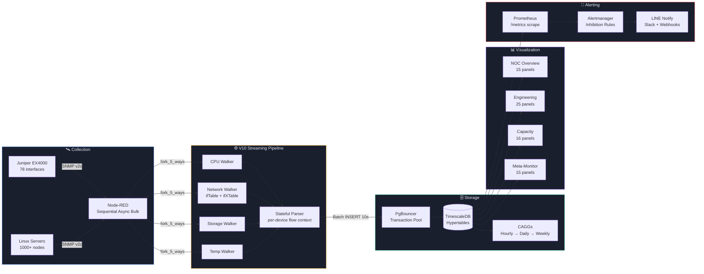

<div align="center">

# IMS

### Industrial Monitoring System

**Enterprise-grade NOC infrastructure monitoring — 1000+ nodes, real-time streaming, cyberpunk HUD.**

[](LICENSE)
[](https://www.docker.com/)
[](https://grafana.com/)
[](https://nodered.org/)
[](https://www.timescale.com/)
[](#quick-start)
[](#quick-start)

</div>

<br/>

<table style="border:none; border-collapse:collapse; width:100%;">
<tr>
<td align="center" style="border:none; padding:8px; width:33%;">
  <br/>
  <sub><b>NOC Overview</b> — Fleet Health Envelope</sub>
</td>
<td align="center" style="border:none; padding:8px; width:33%;">
  <br/>
  <sub><b>Engineering Drill-Down</b> — Per-Machine Diagnostics</sub>
</td>
<td align="center" style="border:none; padding:8px; width:33%;">
  <br/>
  <sub><b>Capacity Planning</b> — Predictive Forecasting</sub>
</td>
</tr>
</table>

<br/>

---

## Why IMS?

<table>
<tr>
<td align="center" width="33%">
  <h3>⚡ Hyper-Parallel Ingestion</h3>
  Sequential async bulk SNMP walks with <code>maxRepetitions: 50</code>. 78-port Juniper switches polled in &lt;2s per cycle. Circuit breaker trips after 2 consecutive failures — zero log spam, zero stale data.
</td>
<td align="center" width="33%">
  <h3>🧠 Predictive AIOps</h3>
  Z-Score anomaly detection (3&sigma; from 24h rolling baseline), linear regression capacity forecasting (days until disk/RAM full), continuous fleet health scoring (0–100).
</td>
<td align="center" width="33%">
  <h3>🛡️ Zero-Downtime Architecture</h3>
  Circuit breaker with HALF_OPEN probe, PgBouncer transaction pooling, retry queue with age-based eviction, offline heartbeat — the database ALWAYS records the exact moment of outage.
</td>
</tr>
</table>

<br/>

---

## Quick Start

```bash
git clone https://github.com/PATTANAKORN025/IMS.git
cd IMS
cp .env.example .env
make up            # docker compose up -d
sleep 40 && make verify
open http://localhost:3000
```

<details>
<summary><b>Available Commands</b></summary>

| Command | Description |
|---------|-------------|
| `make up` | Start all services (dev mode with SNMP simulator) |
| `make down` | Stop all services |
| `make verify` | Full system health check (containers, DB, pipeline, alerts) |
| `make test-unit` | Run unit tests (18 parser + counter tests) |
| `make test-load` | Run K6 pipeline stress test (50→200 VUs) |
| `make test-visual` | Capture dashboard screenshots via Playwright |
| `make validate-dashboards` | Lint dashboard JSON for grid overlap + hex corruption |
| `make backup` | Database backup |

</details>

---

## Architecture



<details>
<summary><b>Data Flow — Step by Step</b></summary>

1. **Collection** — Node-RED forks 4 walkers for network switches (CPU, Storage, Network, Temp) and 5 for servers (+LDI) every 10 seconds. Device registry loaded from `public.devices` every 5 minutes.
2. **Walking** — Sequential async bulk walks (`session.subtree` with `maxRepetitions: 50`). Single UDP socket eliminates switch-level packet drops. Circuit breaker trips after 2 failures with automatic HALF_OPEN probe.
3. **Parsing** — `sre_parser` maintains per-device state in flow context (`dev_state_<deviceId>`), buffers rows in `batch_buf_<deviceId>`. Offline heartbeat (`_walker: "offline"`) immediately zeros all metrics on device failure.
4. **Storage** — Timer-gated independent flushing: each table type (sys/net/ldi) inserts only if its buffer has rows. Partial walker failures don't block unrelated data writes.
5. **Continuous Aggregation** — Hourly CAGGs refresh every 30min. Daily/Weekly CAGGs aggregate from hourly. Retention: raw 14d, hourly 90d, daily 2yr, weekly forever.
6. **Visualization** — 5 dashboards: NOC Overview (fleet envelope), Engineering Drill-Down (per-machine), AIOps & Capacity (forecasting), Meta-Monitoring (pipeline health), LDI Manufacturing (PCB fleet).
7. **Alerting** — Prometheus scrapes `/metrics`, Alertmanager routes to LINE Notify + Slack with runbook links. Z-Score anomalies via Grafana SQL over TimescaleDB.

</details>

<details>
<summary><b>Dashboard Architecture</b></summary>

| Dashboard | Panels | Purpose |
|-----------|--------|---------|
| **NOC Overview** | 15 | Fleet envelope (AVG+MAX), Fleet Health Score, Top-10 Critical Nodes, Network Bandwidth, LDI Yield Risk |
| **Engineering Drill-Down** | 25 | Per-machine gauges, RAM/CPU/Temp timeseries, LDI manufacturing, Power analytics, Z-Score anomalies |
| **Capacity Planning** | 16 | Disk/CPU/RAM forecast with linear regression, Days Until Full, Z-Score anomaly detection |
| **Meta-Monitoring** | 15 | Pipeline throughput, deadman alerts, circuit breaker state, device poll rates |

**Design System:** Cyberpunk HUD — `#030407` background, Tailwind palette (`#10B981` Healthy, `#F59E0B` Warning, `#EF4444` Critical, `#3B82F6` Accent), Roboto Mono for stat values, glassmorphism panels, Grid-24 overlap-free layout.

</details>

---

## NOC Wall-Display

```bash
export GRAFANA_API_KEY="your-admin-api-key"
./scripts/create-playlist.sh http://localhost:3000 "$GRAFANA_API_KEY" 30
open "http://localhost:3000/playlists/play/1?kiosk=tv&autofitpanels"
```

| Mode | URL | Use Case |
|------|-----|----------|
| **TV Kiosk** | `?kiosk=tv&autofitpanels` | NOC wall-display — hides all chrome, auto-fits panels |
| **Clean** | `?kiosk` | Presentation mode — hides sidebar + topnav |
| **Embedded** | `?kiosk=1` | iframe embedding — hides everything |

---

<details>
<summary><b>Tech Stack</b></summary>

| Layer | Technology | Purpose |
|-------|-----------|---------|
| **Orchestration** | Docker Compose | 7-service container stack with dev/prod overlays |
| **Collection** | Node-RED + net-snmp | Sequential async bulk SNMP walks, 5-thread parallel walker |
| **Database** | TimescaleDB (PostgreSQL) | Hypertables with CAGGs, 90% compression after 7d |
| **Visualization** | Grafana 11 | 4 cyberpunk HUD dashboards, state-timeline anomalies |
| **Alerting** | Prometheus + Alertmanager | Metric scraping, inhibition rules, LINE/Slack webhooks |
| **Load Testing** | K6 | Pipeline stress (50→200 VUs), threshold p95<500ms |
| **SLA Probing** | Blackbox Exporter | HTTP/TCP/ICMP endpoint monitoring |

</details>

<details>
<summary><b>Database Schema</b></summary>

| Table | Columns | Description |
|-------|---------|-------------|
| `devices` | 11 | Device registry (device_id, hostname, snmp_community, device_type, enabled) |
| `sys_metrics` | 12 | CPU, RAM, Disk, Temperature per poll cycle (hypertable) |
| `net_metrics` | 10 | Per-interface RX/TX Mbps, errors, drops, status (hypertable) |
| `ldi_metrics` | 9 | Manufacturing throughput, PE, JE, humidity, power, vibration (hypertable) |
| `sys_hourly` | — | Continuous Aggregate: hourly CPU/RAM/Disk/Temp rollup |
| `net_hourly` | — | Continuous Aggregate: hourly network throughput rollup |
| `ldi_hourly` | — | Continuous Aggregate: hourly LDI metrics rollup |

</details>

<details>
<summary><b>Project Structure</b></summary>

```
IMS/
├── monitoring/grafana/                # Grafana dashboards + provisioning
│   ├── dashboards/                    #   4 JSON dashboard files (source of truth)
│   └── library-panels/               #   Shared library panels (Fleet Health Score)
├── nodered_data/                      # Node-RED pipeline engine
│   ├── flows/                         #   ingestion.json + alerting.json (source)
│   ├── lib/                           #   circuit-breaker.js, parser, units.js
│   └── settings.js                    #   functionGlobalContext, auth config
├── postgres/                          # Database initialization
│   └── init/                          #   001-init-timescaledb.sql (schema + views)
├── database/migrations/               #   5 sequenced migration files (013-017)
├── tests/                             # Test suites
│   ├── k6/                            #   K6 pipeline stress test
│   ├── unit/                          #   Parser & counter unit tests
│   └── playwright/                    #   Visual regression + screenshot capture
├── scripts/                           # Operational scripts
│   ├── create-playlist.sh             #   NOC wall-display playlist creator
│   ├── generate-showcase.sh           #   Dashboard screenshot generator
│   ├── snmp-discover.js               #   Enterprise SNMP OID discovery
│   └── build-flows.sh                 #   Merge ingestion + alerting → flows.json
├── assets/                            # Dashboard screenshots (auto-generated)
├── docs/                              # Architecture, Design System, Troubleshooting
└── .mimocode/skills/                  # 24 custom skills for DevOps automation
```

</details>

---

## Documentation & Community

<div align="center">

| Document | Description |
|:---:|---|
| [**Architecture**](docs/ARCHITECTURE.md) | System context, ADRs, V10 streaming architecture, CAGG strategy |
| [**Contributing**](CONTRIBUTING.md) | Development workflow, branch naming, commit conventions |
| [**Security**](SECURITY.md) | Vulnerability reporting, threat model, RBAC |
| [**Design System**](docs/GRAFANA_DESIGN_SYSTEM.md) | Color palette, typography, panel type decisions, threshold contracts |
| [**Troubleshooting**](docs/TROUBLESHOOTING.md) | Common issues, debugging commands, recovery procedures |
| [**Bug Report**](.github/ISSUE_TEMPLATE/bug_report.md) | Report a bug or regression |
| [**Feature Request**](.github/ISSUE_TEMPLATE/feature_request.md) | Suggest a new feature |

</div>

---

<div align="center">

**Built with precision. Designed for uptime.**

[MIT License](LICENSE) — © 2026 IMS Contributors

</div>
