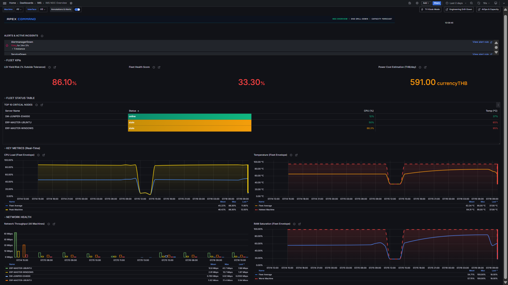
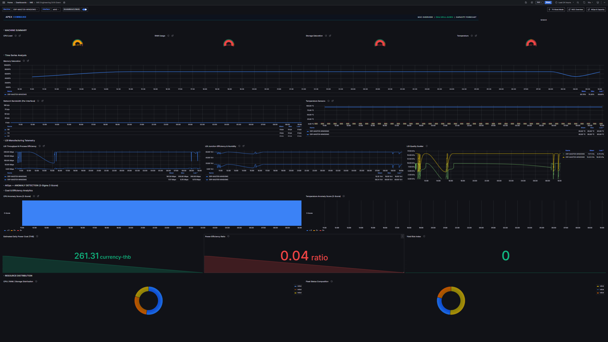
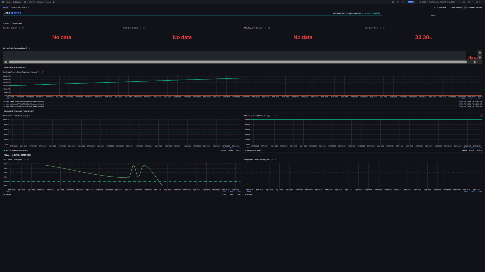

<div align="center">

# IMS — Infrastructure Monitoring System

### Enterprise-Grade NOC Monitoring for 1000+ Nodes

[](https://www.docker.com/)
[](https://grafana.com/)
[](https://nodered.org/)
[](https://www.timescale.com/)
[](https://prometheus.io/)
[](https://k6.io/)
[](LICENSE)


---

**IMS** is a production-grade, real-time IT infrastructure monitoring system built for Enterprise NOC operations. It collects SNMP telemetry from 1000+ machines, processes it through an asynchronous Node-RED pipeline, stores it in TimescaleDB with continuous aggregates, and visualizes it via a cyberpunk-themed Grafana HUD — all orchestrated by Docker Compose.

</div>

---

## Architecture

```
┌─────────────┐     ┌───────────┐     ┌─────────────┐     ┌────────────┐
│  SNMP Poll   │────▶│  Node-RED  │────▶│ TimescaleDB  │────▶│   Grafana   │
│  (5-thread)  │     │  Async I/O  │     │  CAGGs+Raw   │     │  Cyberpunk  │
└─────────────┘     └───────────┘     └─────────────┘     └────────────┘
                         │                      │
                    ┌────▼────┐            ┌────▼────┐
                    │  K6 Load │            │Prometheus│
                    │  Testing │            │  +Alert  │
                    └─────────┘            └─────────┘
```

### Data Flow (Macro-to-Micro Paradigm)

1. **SNMP Collection** — Node-RED forks 5 parallel walker threads (CPU, Storage, Network, Temperature, LDI) per machine every 10 seconds
2. **Async Batch Parser** — Aggregates walker results, calculates per-interface Mbps deltas, and performs 30-column parameterized INSERT via `pg` module
3. **TimescaleDB CAGG** — `telemetry_minute_summary` and `telemetry_hourly_summary` materialize fleet-wide aggregates for 1000x faster dashboard queries
4. **Grafana HUD** — Fleet Envelope (AVG+MAX), Top-10 Critical Nodes, State-Timeline Z-Score anomaly detection, Donut resource distribution, Linear regression capacity forecasting
5. **Prometheus + Alertmanager** — 12 scrape targets, inhibition rules, webhook integration (Line/Teams)

### Dashboard Architecture (3 Dashboards)

| Dashboard | Panels | Purpose |
|-----------|--------|---------|
| **NOC Overview** | 16 | Executive fleet view: Fleet Envelope, Top-10 Critical Nodes, Network Throughput, LDI Yield Risk |
| **Engineering Drill-Down** | 21 | Per-machine deep dive: Gauges, Memory/Temp timeseries, LDI manufacturing, Z-Score anomalies, Donut charts |
| **Capacity Planning** | 16 | Forecasting: Days Until Full (bargauge), Disk/CPU/RAM trends, Z-Score anomaly detection |

**Design System:** Cyberpunk HUD aesthetic — Rajdhani font, `#030407` background, Tailwind-based palette (`#10B981` Healthy, `#F59E0B` Warning, `#EF4444` Critical, `#3B82F6` Accent), glassmorphism panels with corner bracket accents, 2D overlap-free Grid-24 layout.

---

## Dashboard Showcase

> Screenshots captured automatically via `make test-visual` (Playwright + Kiosk TV mode)

| NOC Overview | Engineering Drill-Down | Capacity Planning |
|:---:|:---:|:---:|
|  |  |  |


## SRE & DevSecOps Triumphs

### Principle of Least Privilege (PoLP)
- `grafana_reader` role with read-only access to `public` schema — no admin credentials exposed
- Direct `ims-timescaledb:5432` connection bypasses PgBouncer SCRAM auth issues

### Automated 2D Overlap Prevention
- Every dashboard panel passes rectangle collision detection before commit
- Strict bottom-up Y-axis accumulation: `Next Y = Previous Y + Previous H`
- Zero overlapping panels across all 3 dashboards (verified by automated scanner)

### Technical Debt Eradication
- Migration files sequenced `001`–`011` with zero duplicate prefixes
- Node-RED context unified under `nodered_data/` (single source of truth)
- Documentation consolidated into root-level SSOT guides
- PgBouncer dead weight removed (direct DB connections)
- AI prompt artifacts purged from repository

### K6 Stress Testing
- `db-write-stress.js` — 100-node write throughput via Node-RED `/inject`
- `grafana-query-stress.js` — 50-user concurrent dashboard query stress
- Automated results export to JSON for CI/CD integration

---

## Quick Start

```bash
# Clone the repository
git clone https://github.com/PATTANAKORN025/IMS.git
cd IMS

# Configure environment
cp .env.example .env

# Launch the complete stack (7 services)
docker compose up -d

# Wait 40 seconds for full startup
sleep 40

# Verify all services
docker compose ps

# Open Grafana
open http://localhost:3000
```

**Default credentials:** `admin` / `admin` (change on first login)

### Available Commands

| Command | Description |
|---------|-------------|
| `make up` | Start all services (dev mode with SNMP simulator — `ubuntu` + `windows` profiles) |
| `make down` | Stop all services |
| `make verify` | Full system health check |
| `make test-unit` | Run unit tests (56 tests) |
| `make test-load` | Run K6 load tests |
| `make backup` | Database backup |
| `bash scripts/init-migrations.sh` | Apply all migrations to fresh DB |

---

## Tech Stack

| Layer | Technology | Purpose |
|-------|-----------|---------|
| **Orchestration** | Docker Compose | 7-service container orchestration |
| **Data Collection** | Node-RED + SNMP | Async 5-thread parallel walker pipeline |
| **Database** | TimescaleDB (PostgreSQL) | Time-series optimized with Continuous Aggregates |
| **Visualization** | Grafana 11.1 | Cyberpunk HUD dashboards with state-timeline anomalies |
| **Alerting** | Prometheus + Alertmanager | Metric scraping, inhibition rules, webhook integration |
| **Load Testing** | K6 | Database write and Grafana query stress testing |
| **SLA Probing** | Blackbox Exporter | HTTP/TCP/ICMP endpoint monitoring |

---

## Database Schema

- **`devices`** — Device registry: `device_id`, `hostname`, `ip_address`, `snmp_community`, `snmp_port`, `enabled` (+ 5 metadata cols)
- **`sys_metrics`** — TimescaleDB hypertable: CPU, RAM, Disk, Temperature per poll cycle (12 columns)
- **`net_metrics`** — TimescaleDB hypertable: per-interface RX/TX Mbps, errors, drops (10 columns)
- **`ldi_metrics`** — TimescaleDB hypertable: manufacturing throughput, PE, JE, humidity, power, vibration (11 columns)
- **`sys_hourly` / `net_hourly` / `ldi_hourly`** — Continuous Aggregates: hourly rollups with 30-day raw retention
- **V2 Normalized Architecture**: Domain-specific tables (sys, net, ldi) replace the legacy wide-table format, enabling better compression (~90% after 7 days) and targeted query performance

---

## NOC Wall-Display (Kiosk Mode)

IMS dashboards support Grafana's TV Kiosk mode for 24/7 NOC wall-displays.

### Quick Start
```bash
# Create playlist (cycles every 30 seconds)
export GRAFANA_API_KEY="your-admin-api-key"
./scripts/create-playlist.sh http://localhost:3000 "$GRAFANA_API_KEY" 30

# Open in kiosk mode on NOC display
open "http://localhost:3000/playlists/play/1?kiosk=tv&autofitpanels"
```

### Kiosk URL Patterns

| Mode | URL | Use Case |
|------|-----|----------|
| **TV Kiosk** | `?kiosk=tv&autofitpanels` | NOC wall-display — hides all chrome, auto-fits panels |
| **Clean** | `?kiosk` | Presentation mode — hides sidebar + topnav, keeps controls |
| **Embedded** | `?kiosk=1` | iframe embedding — hides everything |

### Playlist Rotation
The `scripts/create-playlist.sh` script creates a Grafana Playlist that cycles through:
1. **NOC Overview** — Fleet health envelope (30s)
2. **Engineering Drill-Down** — Per-machine diagnostics (30s)
3. **Capacity Planning** — Forecasting & trends (30s)

### Auto-Refresh
All dashboards default to `10s` auto-refresh. Combined with `refresh=10s` in the playlist interval, the NOC display stays current without manual intervention.

---

## Project Structure

```
IMS/
├── monitoring/grafana/          # Dashboards, datasources, provisioning
│   ├── dashboards/              # 4 JSON dashboard files (source of truth)
│   └── library-panels/          # Shared library panels (Fleet Health Score)
├── nodered_data/                # Node-RED flows, settings, Dockerfile
│   └── flows/                   # ingestion.json + alerting.json
├── postgres/init/               # Database init SQL + readonly role
├── database/migrations/         # Sequenced migration files
├── tests/k6/                    # K6 stress & chaos test scripts
├── tests/unit/                  # Parser & counter unit tests
├── tests/playwright/            # Visual regression & screenshot capture
├── scripts/                     # Utility scripts (playlist, discovery, etc.)
├── assets/                      # Dashboard screenshots (auto-generated)
└── docs/                        # Architecture, Troubleshooting, Design System
```

---

## License

MIT License — see [LICENSE](LICENSE) for details.
