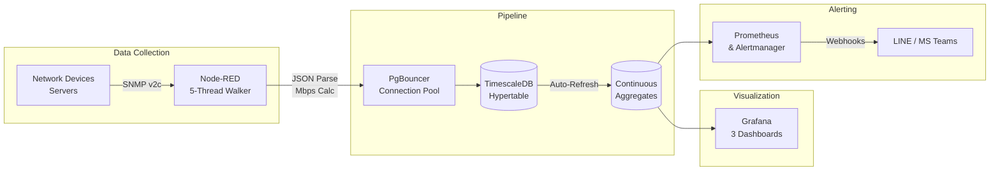

# IMS — Infrastructure Monitoring System

> Real-time IT Infrastructure Monitoring for Enterprise NOC Operations

---

<div align="center">


</div>

---

## Overview

IMS is a production-grade monitoring stack that collects SNMP telemetry from IT infrastructure, processes it through a real-time pipeline, and visualizes it via enterprise dashboards with automated alerting.

**Key capabilities:**
- Real-time CPU, RAM, Disk, Network (per-interface), and Temperature monitoring for 55+ machines
- LDI manufacturing telemetry: Throughput, Process Efficiency, Junction Efficiency, Power, Vibration
- Z-Score anomaly detection with 3-sigma thresholds
- Linear regression capacity forecasting (days until disk/RAM saturation)
- Smart alert inhibition — critical alerts suppress lower-severity alerts automatically
- SLA probing via HTTP/TCP/ICMP blackbox checks

---

## Quick Start

### Prerequisites
- Docker Desktop (v4.0+) with Docker Compose v2
- 4GB RAM minimum (8GB recommended)

### 1. Clone and configure
```bash
git clone https://github.com/PATTANAKORN025/IMS.git
cd IMS
cp .env.example .env
```

### 2. Start all services
```bash
docker compose up -d
```

### 3. Deploy Node-RED flows
```bash
make deploy-flows
```

### 4. Verify data is flowing
```bash
docker compose exec timescaledb psql -U ims_admin -d ims -c \
  "SELECT machine_id, COUNT(*) FROM public.machine_telemetry WHERE time > NOW() - INTERVAL '5 minutes' GROUP BY machine_id;"
```

### 5. Open dashboards
- **Grafana**: http://localhost:3000 (admin / change-me-please)
- **Node-RED**: http://localhost:1880

---

## Architecture



| Layer | Technology | Purpose |
|-------|-----------|---------|
| Collection | SNMP v2c, Node-RED | Poll 55 machines every 10s via 5 parallel walkers |
| Pipeline | Node-RED Function Nodes | Parse OIDs, calculate bandwidth, format for INSERT |
| Storage | TimescaleDB + PgBouncer | Time-series with compression, retention, connection pooling |
| Visualization | Grafana (3 dashboards) | NOC Overview, Engineering Drill-Down, Capacity Forecast |
| Alerting | Prometheus + Alertmanager | Health rules, SLA probes, webhook notifications |
| Infrastructure | Docker Compose | Dev and production container orchestration |

---

## Dashboards

| Dashboard | Description | Link |
|-----------|------------|------|
| **NOC Overview** | Fleet health score, CPU/RAM/Network timeseries, LDI Yield Risk, Power Cost | [Open](http://localhost:3000/d/ims-noc-overview?kiosk=tv) |
| **Engineering Drill-Down** | Per-machine gauges, CPU/RAM/Network/Temp with Z-Score anomaly detection | [Open](http://localhost:3000/d/ims-engineering?kiosk=tv) |
| **AIOps & Capacity** | Days-until-full regression, fleet Z-Score anomalies, disk/RAM/CPU trends | [Open](http://localhost:3000/d/ims-capacity?kiosk=tv) |

---

## Project Structure

```
IMS/
├── docker-compose.yaml          # Main orchestration (8 services)
├── docker-compose.override.yaml # Dev overrides (SNMP simulator)
├── docker-compose.prod.yaml     # Production overrides
├── node-red/
│   ├── flows/                   # Node-RED flows (source of truth)
│   │   ├── ingestion.json       # SNMP pipeline: walkers → parser → DB
│   │   └── alerting.json        # Alertmanager webhook → LINE/Teams
│   └── Dockerfile               # Custom build: installs npm dependencies
├── postgres/init/
│   └── 001-init-timescaledb.sql # Full schema + CAGGs + views
├── monitoring/
│   ├── grafana/dashboards/      # 3 Grafana dashboard JSON files
│   ├── prometheus/              # Scrape config + alert rules
│   └── snmpsim/                 # SNMP simulator config
├── tests/                       # Unit tests + K6 load tests
├── docs/                        # Architecture, troubleshooting, manuals
├── Makefile                     # Build/deploy shortcuts
└── .env.example                 # Environment variables template
```

---

## Documentation

| Document | Description |
|----------|------------|
| [Architecture](docs/ARCHITECTURE.md) | System context, ADRs, data flow |
| [Troubleshooting](docs/TROUBLESHOOTING.md) | SRE runbook — failure modes and diagnostics |
| [Admin Manual](docs/admin/ADMIN_MANUAL.md) | Docker management, device registry |
| [User Manual](docs/user/USER_MANUAL.md) | Dashboard guide, metrics interpretation |
| [Business Value](docs/business/BUSINESS_VALUE_ROI.md) | ROI analysis, executive summary |

---

## Contributing

See [CONTRIBUTING.md](CONTRIBUTING.md) for guidelines.

## License

MIT License — see [LICENSE](LICENSE).

---

<div align="center">

**Built by IMS Internship Team**

*Industrial NOC Monitoring System — Production-Ready Since 2026*

</div>
