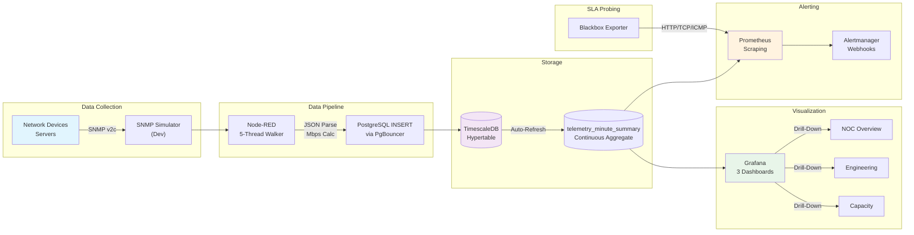

# 🏭 IMS — Infrastructure Monitoring System

> **ระบบ Real-time Monitoring สำหรับ IT Infrastructure ขององค์กร**
> ออกแบบและพัฒนาโดยทีมงาน internship เพื่อเรียนรู้เครื่องมือ monitoring ระดับ Enterprise

---

<div align="center">


</div>

---

## 📋 Executive Summary

**IMS (Infrastructure Monitoring System)** เป็นระบบ monitoring แบบ end-to-end ที่ออกแบบมาเพื่อติดตามสถานะของ IT Infrastructure ขององค์กรแบบ real-time ระบบนี้พัฒนาขึ้นภายใต้กรอบของ internship program เพื่อให้นักศึกษาได้เรียนรู้เครื่องมือ monitoring ที่ใช้จริงในอุตสาหกรรม รวมถึง SNMP protocol, data pipeline architecture, time-series database, และ dashboard visualization

### วัตถุประสงค์ของโครงการ

| # | วัตถุประสงค์ | สถานะ |
|---|---|---|
| 1 | **Real-time Monitoring** — ติดตามสถานะ IT Infrastructure ขององค์กรแบบเรียลไทม์ | ✅ สำเร็จ |
| 2 | **Health Monitoring** — ตรวจสอบ Server, Network Devices, Services และ Resource Usage อย่างต่อเนื่อง | ✅ สำเร็จ |
| 3 | **Downtime Reduction** — ลด downtime ด้วยระบบ Alerting ที่ตรวจจับ anomalies และ failures | ✅ สำเร็จ |
| 4 | **Visibility Dashboard** — สร้าง Dashboard ที่เข้าใจง่ายเพื่อให้ทีม IT เห็นภาพรวมของระบบ | ✅ สำเร็จ |
| 5 | **Internship Training** — ฝึกอบรมนักศึกษาฝึกงานบนเครื่องมือ monitoring สมัยใหม่ | ✅ สำเร็จ |

---

## Dashboard Screenshots

> Screenshots coming soon. Open each dashboard in kiosk mode for NOC wall display.

| Dashboard | Description | Kiosk Link |
|-----------|------------|------------|
| **NOC Overview** | Fleet health, CPU/RAM/Network timeseries, LDI Yield Risk, Power Cost | [Open Kiosk](http://localhost:3000/d/ims-noc-overview?kiosk=tv) |
| **Engineering Drill-Down** | Per-machine gauges, CPU/RAM/Network/Temp with Z-Score anomaly detection | [Open Kiosk](http://localhost:3000/d/ims-engineering?kiosk=tv) |
| **AIOps & Capacity** | Days-until-full regression, fleet Z-Score anomalies, disk/RAM/CPU trends | [Open Kiosk](http://localhost:3000/d/ims-capacity?kiosk=tv) |

---

## Architecture Overview



### Tech Stack ที่ใช้

| Layer | Technology | หน้าที่ |
|---|---|---|
| **Data Collection** | SNMP v2c, Node-RED | เก็บข้อมูลจาก Network Devices และ Servers |
| **Data Pipeline** | Node-RED Function Nodes | ประมวลผลข้อมูลดิบ, คำนวณ bandwidth, จัดรูปแบบ |
| **Storage** | TimescaleDB (PostgreSQL) | เก็บข้อมูล time-series พร้อม hypertable optimization |
| **Visualization** | Grafana | Dashboard แบบ real-time, drill-down, forecasting |
| **Alerting** | Prometheus + Alertmanager | ตรวจสอบ health status, SLA probing, ส่ง notification ผ่าน webhook |
| **Infrastructure** | Docker Compose | Container orchestration สำหรับ dev/prod |
| **Testing** | K6 Load Testing | ทดสอบ performance และ stress testing |

---

## 🚀 Key Features

### 📊 Real-time Monitoring
- ติดตาม **CPU, RAM, Disk, Network (per-interface), Temperature** แบบเรียลไทม์
- รองรับ **Multiple Machines** ผ่าน device registry pattern (database-driven)
- **LDI Manufacturing Telemetry**: Throughput, PE, JE, Humidity, Power, Vibration

### ⚡ Zero Downtime Alerting
- **Smart Inhibition Rules**: Critical alerts suppress lower-severity alerts อัตโนมัติ
- **SLA Probing**: HTTP/TCP/ICMP probes ผ่าน Blackbox Exporter
- **Webhook Integration**: Alertmanager → Node-RED → External notification

### 🎯 Enterprise Dashboard
- **NOC Overview**: Executive fleet view สำหรับผู้บริหาร
- **System Overview**: Server health, disk, network, temperature
- **Engineering Drilldown**: Per-machine deep dive พร้อม per-interface metrics
- **Capacity Planning**: Forecasting สำหรับ long-term resource planning

### 🛡️ Security & Reliability
- **SNMP v2c** support (v3 planned for production)
- **PgBouncer** connection pooling สำหรับ database scalability
- **Environment-based secrets** via `.env` file (gitignored)
- **CI/CD pipeline** พร้อม Gitleaks security scanning

---

## 📁 Project Structure

```
IMS/
├── docker-compose.yaml          # Main Docker orchestration
├── docker-compose.override.yaml # Dev overrides (snmpsim)
├── docker-compose.prod.yaml     # Production overrides
├── node-red/
│   ├── flows/                   # Node-RED flows (Source of Truth)
│   │   ├── ingestion.json       # SNMP pipeline: walkers → parser → DB
│   │   └── alerting.json        # Alertmanager webhook → LINE/Teams
│   ├── Dockerfile               # Custom build: installs npm dependencies
│   └── settings.js              # Node-RED runtime settings
├── .env.example                 # Environment variables template
├── secrets/                     # Docker secrets (gitignored)
├── postgres/
│   └── init/
│       └── 001-init-timescaledb.sql  # DB schema + hypertable
├── database/
│   └── migrations/              # TimescaleDB migration scripts
├── monitoring/
│   ├── grafana/
│   │   ├── dashboards/          # Grafana dashboard JSON files
│   │   └── provisioning/        # Grafana datasource provisioning
│   ├── prometheus/
│   │   ├── prometheus.yml       # Prometheus scrape config
│   │   └── rules/               # Alert rules
│   └── snmpsim/
│       └── Netk@.snmprec        # SNMP simulator config
├── node-red/
│   ├── flows/                   # Split flows (ingestion + alerting)
│   └── settings-prometheus.js   # Node-RED Prometheus metrics
├── scripts/
│   ├── backup-db.sh             # Database backup script
│   ├── restore-db.sh            # Database restore script
│   └── verify-deployment.sh     # Post-deploy verification
├── tests/
│   └── k6/                      # K6 load/stress tests
├── docs/                        # Documentation suite
├── Makefile                     # Build targets
├── SECURITY.md                  # Security considerations
├── CHANGELOG.md                 # Version history
├── CONTRIBUTING.md              # Contribution guidelines
└── LICENSE                      # MIT License
```

---

## ⚙️ Quick Start

### Prerequisites
- Docker Desktop (v4.0+)
- Docker Compose v2
- 4GB RAM minimum (8GB recommended)

### 1. Setup
```bash
# Clone repository
git clone [https://github.com/PATTANAKOORN/IMS.git](https://github.com/PATTANAKORN025/IMS.git)
cd IMS

# Create secrets
mkdir -p secrets
echo "your-secure-password" > secrets/postgres_password.txt
echo "your-grafana-password" > secrets/grafana_admin_password.txt

# Copy environment template
cp .env.example .env
```

### 2. Start Services
```bash
# Development mode (with SNMP simulator)
docker compose up -d

# Deploy Node-RED flows (required after first start)
make deploy-flows

# Production mode
docker compose -f docker-compose.yaml -f docker-compose.prod.yaml up -d
```

### 3. Verify
```bash
# Check all containers
docker compose ps

# Verify data flow (wait 30s after start)
docker compose exec timescaledb psql -U ims_admin -d ims -c \
  "SELECT machine_id, COUNT(*) FROM public.machine_telemetry GROUP BY machine_id;"
```

### 4. Access Dashboards
- **Grafana**: http://localhost:3000 (admin/admin)
- **Node-RED**: http://localhost:1880
- **Prometheus**: http://localhost:9090
- **Alertmanager**: http://localhost:9093

---

## 📚 Documentation

| Document | Description |
|---|---|
| [System Architecture](docs/architecture/SYSTEM_ARCHITECTURE.md) | Technical topology, data flow, alerting pipeline |
| [Admin Manual](docs/admin/ADMIN_MANUAL.md) | Docker management, device registry, troubleshooting guide |
| [User Manual](docs/user/USER_MANUAL.md) | Dashboard guide, metrics interpretation, incident response |
| [Business Value & ROI](docs/business/BUSINESS_VALUE_ROI.md) | ROI analysis, cost savings, executive summary |
| [Internship Report](docs/business/INTERNSHIP_REPORT_SUMMARY.md) | Learning outcomes, business value, academic review |
| [Deployment Readiness](docs/deployment-readiness.md) | Pre-deployment checklist, infrastructure requirements |
| [Scaling Plan](docs/scaling-plan.md) | Performance optimization, 1000+ machines roadmap |

---

## 🤝 Contributing

ดู [CONTRIBUTING.md](CONTRIBUTING.md) สำหรับ guidelines การร่วมพัฒนา

## 📄 License

MIT License — ดู [LICENSE](LICENSE) สำหรับรายละเอียด

---

<div align="center">

**Built with ❤️ by IMS Internship Team**

*Industrial NOC Monitoring System — Production-Ready Since 2026*

</div>
