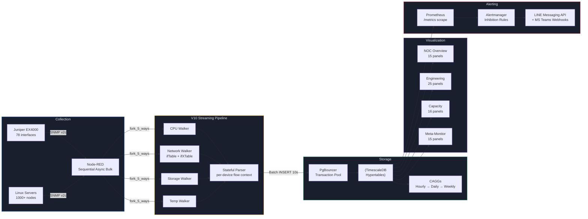

<div align="center">
  
</div>

<h1 align="center" style="font-family: -apple-system, BlinkMacSystemFont, 'Segoe UI', Helvetica, Arial, sans-serif; letter-spacing: -0.5px;">Industrial Monitoring System (IMS)</h1>

<div align="center">
  <p style="font-size: 15px; color: #6B7280;">
    <a href="README.md" style="text-decoration: none;">🇬🇧 <b>English</b></a> &nbsp;&nbsp;|&nbsp;&nbsp;
    <a href="README-th.md" style="text-decoration: none;">🇹🇭 <b>ไทย</b></a> &nbsp;&nbsp;|&nbsp;&nbsp;
    <a href="README-zh-CN.md" style="text-decoration: none;">🇨🇳 <b>中文</b></a>
  </p>
</div>

<div align="center" style="margin: 24px 0;">
  <strong style="font-size: 18px; font-weight: 500;">High-Precision Manufacturing Telemetry & Statistical Process Control</strong>
</div>

<div align="center">
  <a href="https://git.io/typing-svg"></a>
</div>

<br/>

<div align="center">
  <!-- Status Badges -->
  <a href="https://github.com/PATTANAKORN025/IMS/releases"></a>
  <a href="LICENSE"></a>
  <a href="#quick-start"></a>
  <a href="#quick-start"></a>
  <br/><br/>
  <!-- Tech Badges -->
  <a href="https://www.docker.com/"></a>
  <a href="https://grafana.com/"></a>
  <a href="https://nodered.org/"></a>
  <a href="https://www.timescale.com/"></a>
</div>

<br/>

<div align="center">
  <table style="border:none; border-collapse:collapse; width:100%;">
<tr>
<td align="center" style="border:none; padding:16px; width:50%; vertical-align: top;">
 <br/><br/>
 <b style="font-size: 15px;">Global NOC Overview</b><br/><sub style="color: #6B7280;">Real-time Fleet Health Envelope</sub>
</td>
<td align="center" style="border:none; padding:16px; width:50%; vertical-align: top;">
 <br/><br/>
 <b style="font-size: 15px;">LDI Manufacturing</b><br/><sub style="color: #6B7280;">Production Command Center</sub>
</td>
</tr>
</table>
</div>

<br/>
<hr style="height: 1px; border: none; background: #E5E7EB;" />
<br/>
## System Overview

**IMS (Industrial Monitoring System)** is a telemetry monitoring platform spanning infrastructure and manufacturing domains. Built on Node-RED, TimescaleDB, and Grafana, it integrates IT metrics (servers, network switches) and OT data (LDI manufacturing machines) into a single PostgreSQL-backed repository.

**Scale and Scope:** Designed to monitor 1000+ infrastructure nodes alongside high-precision LDI (Laser Direct Imaging) manufacturing equipment. It implements Statistical Process Control (SPC) methodologies and Z-Score anomaly detection for proactive alerting.

Performance relies on TimescaleDB continuous aggregates for dashboard rendering and a stateful Node-RED pipeline for data ingestion.


<table style="border:none; border-collapse:collapse; width:100%;">

<tr>
<td align="center" style="border:none; padding:8px; width:33%;">
 <br/>
 <sub><b>NOC Overview</b> — Fleet Health Envelope</sub>
</td>
<td align="center" style="border:none; padding:8px; width:33%;">
 <br/>
 <sub><b>Engineering Drill-Down</b> — Per-Machine Diagnostics</sub>
</td>
<td align="center" style="border:none; padding:8px; width:33%;">
 <br/>
 <sub><b>Capacity Planning</b> — Predictive Forecasting</sub>
</td>
</tr>
<tr>
<td align="center" style="border:none; padding:8px; width:33%;">
 <br/>
 <sub><b>LDI Manufacturing</b> — Command Center</sub>
</td>
<td align="center" style="border:none; padding:8px; width:33%;">
 <br/>
 <sub><b>LDI Andon Board</b> — Operator Floor View</sub>
</td>
<td align="center" style="border:none; padding:8px; width:33%;">
 <br/>
 <sub><b>LDI Engineering</b> — Yield & SPC Analytics</sub>
</td>
</tr>
</table>

<br/>

---

## Core Capabilities

<table>
<tr>
<td align="center" width="33%">
 <h3>Telemetry Ingestion</h3>
 Parallel Node-RED walkers utilizing sequential bulk SNMP polling and HTTP endpoints, persisting data to TimescaleDB via PgBouncer transaction pooling.<br/><br/>
 **Verified:** [nodered-ingestion-20260813.txt](docs/evidence/runtime/nodered-ingestion-20260813.txt)
</td>
<td align="center" width="33%">
 <h3>Statistical Process Control</h3>
 Real-time SPC metrics (Cpk) and rolling 3&sigma; baselines (Z-Score anomaly detection) evaluated at the database level for early warning alerts.
</td>
<td align="center" width="33%">
 <h3>Continuous Aggregation</h3>
 Hourly, daily, and weekly rollups automatically calculated by TimescaleDB to maintain sub-second Grafana rendering times over large time ranges.<br/><br/>
 **Verified:** [cagg-policies-20260813.txt](docs/evidence/runtime/cagg-policies-20260813.txt)
</td>
</tr>
</table>

<br/>

---

## Quick Start (Local Simulator Environment)

> [!NOTE]
> **Simulator Boundary:** The following quick start runs the IMS stack locally using a builtin SNMP/HTTP data simulator (`ims-snmpsim`). It **does not** connect to real factory equipment or external network devices. The simulator generates realistic, bounded telemetry and alarm sequences for development and validation purposes.

```bash
git clone https://github.com/PATTANAKORN025/IMS.git
cd IMS
cp .env.example .env
make up      # docker compose up -d (starts stack with simulator)
sleep 40 && make verify
open http://localhost:3000
```
> **Verified:** `docker compose ps` on 2026-08-13, archived in [`docs/evidence/runtime/compose-ps-20260813.txt`](docs/evidence/runtime/compose-ps-20260813.txt).

### Known Limitations
- The simulated LDI workload generates ~10-15 rows per minute; load testing requires running the explicit K6 stress test framework to simulate production 1000-node scale.
- Nginx reverse-proxy is configured for `localhost` and requires manual certificate deployment for production environments.
- Grafana Alertmanager integrations (LINE/Teams) will fail silently until explicit tokens are provided in the `.env` file.

### Verification & Evidence
Every architectural claim is backed by continuous integration or explicit test scripts. For load test results, visual regression evidence, and disaster recovery validations, refer to the **[Evidence Index](docs/evidence/INDEX.md)**.


<details>
<summary><b>Available Commands</b></summary>

| Command | Description |
|---------|-------------|
| `make up` | Start all services (dev mode with SNMP simulator) |
| `make down` | Stop all services |
| `make verify` | Full system health check (containers, DB, pipeline, alerts) |
| `make test-unit` | Run unit tests (18 parser + counter tests) |
| `make test-load` | Run K6 pipeline stress test (50→200 VUs) |
| `make test-visual` | Capture dashboard screenshots via Playwright |
| `make validate-dashboards` | Lint dashboard JSON for grid overlap + hex corruption |
| `make backup` | Database backup |

</details>

---

## Architecture


```mermaid
flowchart LR
  subgraph Collection ["Collection"]
    J["Juniper EX4000\n78 interfaces"] -->|SNMP v2c| W["Node-RED\nSequential Async Bulk"]
    S["Linux Servers\n1000+ nodes"] -->|SNMP v2c| W
  end

  subgraph Processing ["V10 Streaming Pipeline"]
    W -->|fork_5_ways| CPU[CPU Walker]
    W -->|fork_5_ways| NET["Network Walker\nifTable + ifXTable"]
    W -->|fork_5_ways| STO[Storage Walker]
    W -->|fork_5_ways| TMP[Temp Walker]
    CPU --> P["Stateful Parser\nper-device flow context"]
    NET --> P
    STO --> P
    TMP --> P
  end

  subgraph Storage ["Storage"]
    P -->|Batch INSERT 10s| B["PgBouncer\nTransaction Pool"]
    B --> T["(TimescaleDB\nHypertables)"]
    T --> CAGG["CAGGs\nHourly → Daily → Weekly"]
  end

  subgraph Visualization ["Visualization"]
    T --> G1["NOC Overview\n15 panels"]
    T --> G2["Engineering\n25 panels"]
    T --> G3["Capacity\n16 panels"]
    T --> G4["Meta-Monitor\n15 panels"]
  end

  subgraph Alerting ["Alerting"]
    T --> PR["Prometheus\n/metrics scrape"]
    PR --> AM["Alertmanager\nInhibition Rules"]
    AM --> WEB["LINE Messaging API\n+ MS Teams Webhooks"]
  end

  style Collection fill:#1a1f2e,stroke:#3B82F6,color:#e2e8f0
  style Processing fill:#1a1f2e,stroke:#F59E0B,color:#e2e8f0
  style Storage fill:#1a1f2e,stroke:#10B981,color:#e2e8f0
  style Visualization fill:#1a1f2e,stroke:#8B5CF6,color:#e2e8f0
  style Alerting fill:#1a1f2e,stroke:#EF4444,color:#e2e8f0
```

<details>
<summary><b>Data Flow — Step by Step</b></summary>

1. **Collection** — Node-RED forks 4 walkers for network switches (CPU, Storage, Network, Temp) and 5 for servers (+LDI) every 10 seconds. Device registry loaded from `public.devices` every 5 minutes.
2. **Walking** — Sequential async bulk walks (`session.subtree` with `maxRepetitions: 50`). Single UDP socket eliminates switch-level packet drops. Circuit breaker trips after 2 failures with automatic HALF_OPEN probe.
3. **Parsing** — `sre_parser` maintains per-device state in flow context (`dev_state_<deviceId>`), buffers rows in `batch_buf_<deviceId>`. Offline heartbeat (`_walker: "offline"`) immediately zeros all metrics on device failure.
4. **Storage** — Timer-gated independent flushing: each table type (sys/net/ldi) inserts only if its buffer has rows. Partial walker failures don't block unrelated data writes.
5. **Continuous Aggregation** — Hourly CAGGs refresh every 30min. Daily/Weekly CAGGs aggregate from hourly. Live retention (verified against the running database, not migration history -- see `docs/architecture/DATA_RETENTION.md` for a documented drift between the two): raw `sys_metrics`/`net_metrics`/`ldi_metrics` 30d, `ldi_data` 180d, hourly rollups 2yr.
6. **Visualization** — 12 dashboards across 2 domains: 4 infrastructure (NOC Overview, Engineering Drill-Down, AIOps & Capacity, Meta-Monitoring) + 8 manufacturing (Easy Overview, LDI Manufacturing, Operator Andon, Alarm Console, Alarm Dictionary, Engineering Analytics & SPC, Machine Snapshot, Data Readiness).
7. **Alerting** — Prometheus scrapes `/metrics`, Alertmanager routes to LINE Messaging API + MS Teams with runbook links (real delivery requires operator-configured credentials, absent by design). Z-Score anomalies via Grafana SQL over TimescaleDB.

</details>

<details>
<summary><b>Dashboard Architecture</b></summary>

12 dashboards — 4 infrastructure, 8 manufacturing (`monitoring/grafana/dashboards/{infrastructure,manufacturing}/`, provisioned into separate Grafana folders — see **[Ownership](docs/architecture/OWNERSHIP.md)** for the domain boundary). Full table with panel counts and descriptions: **[Dashboard Inventory](docs/architecture/DASHBOARD_INVENTORY.md)** — auto-generated from the dashboard JSON itself (`node scripts/generate-dashboard-inventory.js`), CI-checked so it can't silently drift from the real dashboards the way a hand-typed table can.

**Design System:** Cyberpunk HUD — `#030407` background, Tailwind palette (`#10B981` Healthy, `#F59E0B` Warning, `#EF4444` Critical, `#3B82F6` Accent), Roboto Mono for stat values, glassmorphism panels, Grid-24 overlap-free layout.

</details>

---

## NOC Wall-Display

```bash
export GRAFANA_API_KEY="your-admin-api-key"
./scripts/create-playlist.sh http://localhost:3000 "$GRAFANA_API_KEY" 30
open "http://localhost:3000/playlists/play/1?kiosk=tv&autofitpanels"
```

| Mode | URL | Use Case |
|------|-----|----------|
| **TV Kiosk** | `?kiosk=tv&autofitpanels` | NOC wall-display — hides all chrome, auto-fits panels |
| **Clean** | `?kiosk` | Presentation mode — hides sidebar + topnav |
| **Embedded** | `?kiosk=1` | iframe embedding — hides everything |

---

<details>
<summary><b>Tech Stack</b></summary>

| Layer | Technology | Purpose |
|-------|-----------|---------|
| **Orchestration** | Docker Compose | 7-service container stack with dev/prod overlays |
| **Collection** | Node-RED + net-snmp | Sequential async bulk SNMP walks, 5-thread parallel walker |
| **Database** | TimescaleDB (PostgreSQL) | Hypertables with CAGGs, 90% compression after 7d |
| **Visualization** | Grafana 13.1.1 | 12 dashboards (4 infrastructure + 8 manufacturing), state-timeline anomalies |
| **Alerting** | Prometheus + Alertmanager | Metric scraping, inhibition rules, LINE Messaging API + MS Teams webhooks |
| **Load Testing** | K6 | Pipeline stress (50→200 VUs), threshold p95<500ms |
| **SLA Probing** | Blackbox Exporter | HTTP/TCP/ICMP endpoint monitoring |

</details>

<details>
<summary><b>Database Schema</b></summary>

- `devices` — device registry, single source of truth for both SNMP-polled infra and LDI machines (`device_type`)
- `sys_metrics` / `net_metrics` — infra telemetry (CPU/RAM/disk/temp, per-interface RX/TX), hypertables
- `ldi_metrics` — legacy manufacturing throughput/PE/JE/humidity/power/vibration, hypertable
- `ldi_data` / `ldi_alarm_log` — V2 normalized LDI telemetry + alarms, exact-event RCA join via `related_log_id`, hypertables
- `sys_hourly` / `net_hourly` / `ldi_hourly` / `ldi_data_1m` / `ldi_data_15m` / `ldi_data_1h` / `ldi_data_hourly` — continuous aggregates
- `v_machine_spc_fleet` / `v_ldi_rca_recent_window` / `v_ldi_rca_truth_test` — materialized views, refreshed every 60s

Exact column counts, the full view/CAGG list, and applied-migration count: **[Database Schema Inventory](docs/architecture/DATABASE_SCHEMA.md)** — auto-generated from `information_schema` + `timescaledb_information.*` (`node scripts/generate-schema-inventory.js`), CI-checked against the live database.

</details>

<details>
<summary><b>Project Structure</b></summary>

```
IMS/
├── monitoring/grafana/        # Grafana dashboards + provisioning
│  ├── dashboards/          #  10 JSON dashboard files (source of truth)
│  └── library-panels/        #  Shared library panels (Fleet Health Score)
├── nodered_data/           # Node-RED pipeline engine
│  ├── flows/             #  ingestion.json + alerting.json (source)
│  ├── lib/              #  circuit-breaker.js, parser, units.js
│  └── settings.js          #  functionGlobalContext, auth config
├── postgres/             # Database initialization
│  └── init/             #  001-init-timescaledb.sql (schema + views)
├── database/migrations/        #  55 sequenced migration files (013-080, some numbers skipped/archived), applied by db-migrate
├── tests/               # Test suites
│  ├── k6/              #  K6 pipeline stress test
│  ├── unit/             #  Parser & counter unit tests
│  └── playwright/          #  Visual regression + screenshot capture
├── scripts/              # Operational scripts
│  ├── create-playlist.sh       #  NOC wall-display playlist creator
│  ├── generate-showcase.sh      #  Dashboard screenshot generator
│  ├── snmp-discover.js        #  Enterprise SNMP OID discovery
│  └── build-flows.js         #  Merge nodered_data/flows/*.json → flows.json (also used by CI)
├── assets/              # Dashboard screenshots (auto-generated)
├── docs/               # Architecture, Design System, Troubleshooting
│  ├── architecture/         #  ARCHITECTURE.md, GRAFANA_DESIGN_SYSTEM.md
│  ├── operations/          #  TROUBLESHOOTING.md, SCALING_PLAN.md
│  ├── audits/            #  Audit reports and technical debriefs
│  └── product/            #  PRODUCT.md, CONTEXT.md
└── .mimocode/skills/         # 24 custom skills for DevOps automation
```

</details>

---

## Documentation & Community

<div align="center">

###  Executive & Business Strategy

| Document | Description |
|:---:|---|
| [**Business Value & ROI**](docs/business/BUSINESS_VALUE_ROI.md) | Executive summary, cost savings, MTTR reduction, and strategic impact |
| [**Platform Book (start here)**](docs/architecture/IMS_PLATFORM_BOOK.md) | Navigational hub for the entire documentation set, terminology glossary |
| [**Product Context**](docs/product/PRODUCT.md) | Product purpose, target audience, and positioning |

###  Manufacturing & LDI Intelligence

| Document | Description |
|:---:|---|
| [**Manufacturing Platform Plan**](docs/architecture/IMS_MANUFACTURING_PLATFORM_V2.md) | Infra/manufacturing domain separation, validation/soak/DR rollout plan |
| [**Manufacturing Domain**](docs/architecture/MANUFACTURING_DOMAIN.md) | The LDI schema/dashboard pattern and onboarding flow |
| [**LDI SPC Guide**](docs/architecture/LDI_SPC_GUIDE.md) | Process capability (Cpk) methodology and formula |
| [**LDI RCA Guide**](docs/architecture/LDI_RCA_GUIDE.md) | Root-cause correlation (Lift/Confidence) methodology |
| [**LDI Validation Protocol**](docs/operations/LDI_VALIDATION_PROTOCOL.md) | 4-phase production sign-off procedure |

### ️ Core Architecture & Security

| Document | Description |
|:---:|---|
| [**Architecture**](docs/architecture/ARCHITECTURE.md) | System context, ADRs, streaming architecture, CAGG strategy |
| [**Visual Architecture**](docs/architecture/ARCHITECTURE_DIAGRAM.md) | Mermaid C4 Model diagrams and sequence flows |
| [**Data Flow**](docs/architecture/DATA_FLOW.md) | End-to-end pipeline diagrams, the real CAGG rollup chain |
| [**Database Schema**](docs/architecture/DATABASE_SCHEMA.md) | Auto-generated table/column/view reference (CI-checked) |
| [**Security Model**](docs/architecture/SECURITY_MODEL.md) | Trust boundaries, per-adapter authentication, and RBAC |
| [**Equipment Integration (EAP)**](docs/architecture/EAP_ARCHITECTURE.md) | SNMP, HTTP/JSON, and SECS/GEM adapter contracts |
| [**Ownership**](docs/architecture/OWNERSHIP.md) | Domain boundaries enforced via `CODEOWNERS` |
| [**Design System**](docs/architecture/GRAFANA_DESIGN_SYSTEM.md) | Semantic color palette, typography, threshold contracts |
| [**Dashboard Inventory**](docs/architecture/DASHBOARD_INVENTORY.md) | Auto-generated dashboard/panel-count table (CI-checked) |

### ️ Operations & SRE Playbooks

| Document | Description |
|:---:|---|
| [**User Manual**](docs/user/USER_MANUAL.md) | Dashboard guide, metric reference, alert response playbooks |
| [**Admin Manual**](docs/admin/ADMIN_MANUAL.md) | Container ops, device registration, migrations, backup/recovery |
| [**Operator SOP**](docs/operations/SOP_OPERATOR.md) | Standard Operating Procedures for factory floor / Level 1 NOC |
| [**Troubleshooting & Alarms**](docs/operations/ALARM_PLAYBOOK.md) | Alarm code resolution and troubleshooting playbook |
| [**Incident Response**](docs/operations/INCIDENT_RESPONSE.md) | Severity framework + real worked incident examples |
| [**Alarm Severity Guide**](docs/architecture/ALARM_SEVERITY_GUIDE.md) | The 4-tier severity taxonomy, ISA-18.2 scope |
| [**Backup & Restore**](docs/operations/BACKUP_RESTORE.md) | Real dr-test.sh evidence, procedure, and caveats |
| [**DR Test Plan**](docs/operations/DR_TEST_PLAN.md) | 3-drill disaster-recovery test plan |
| [**Data Retention**](docs/architecture/DATA_RETENTION.md) | Live retention/compression policy |
| [**Release Checklist**](docs/operations/RELEASE_CHECKLIST.md) | What to verify before tagging a release |
| [**Troubleshooting**](docs/operations/TROUBLESHOOTING.md) | Common issues, debugging commands, recovery procedures |

###  Community & Reference

| Document | Description |
|:---:|---|
| [**Video Onboarding Script**](docs/product/ONBOARDING_SCRIPT.md) | Storyboard and guide for recording onboarding GIFs/Videos |
| [**Contributing**](CONTRIBUTING.md) | Development workflow, branch naming, commit conventions |
| [**Code of Conduct**](CODE_OF_CONDUCT.md) | Community standards and enforcement |
| [**Security Policy**](SECURITY.md) | Vulnerability reporting |
| [**Bug Report**](.github/ISSUE_TEMPLATE/bug_report.md) | Report a bug or regression |
| [**Feature Request**](.github/ISSUE_TEMPLATE/feature_request.md) | Suggest a new feature |

</div>

---

<div align="center">

**Built with precision. Designed for uptime.**

[MIT License](LICENSE) — 2026 IMS Contributors

</div>
