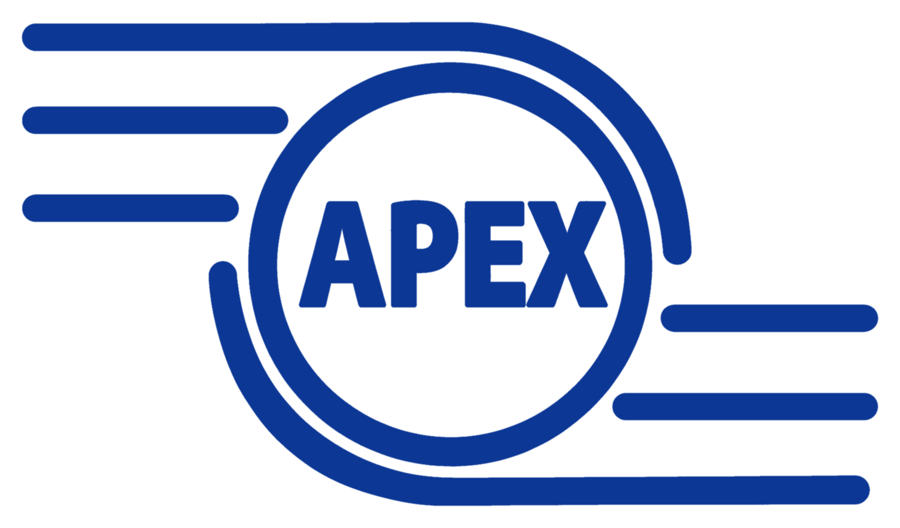
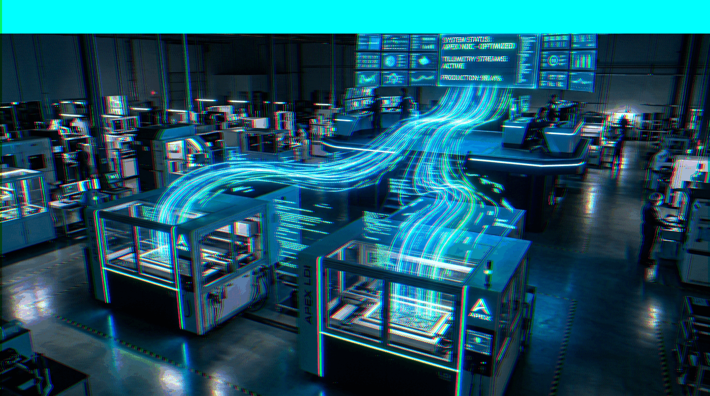
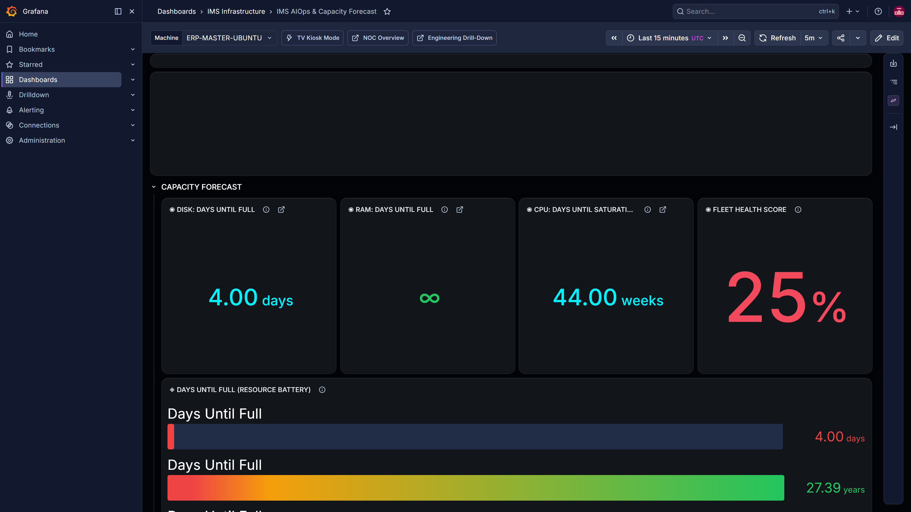
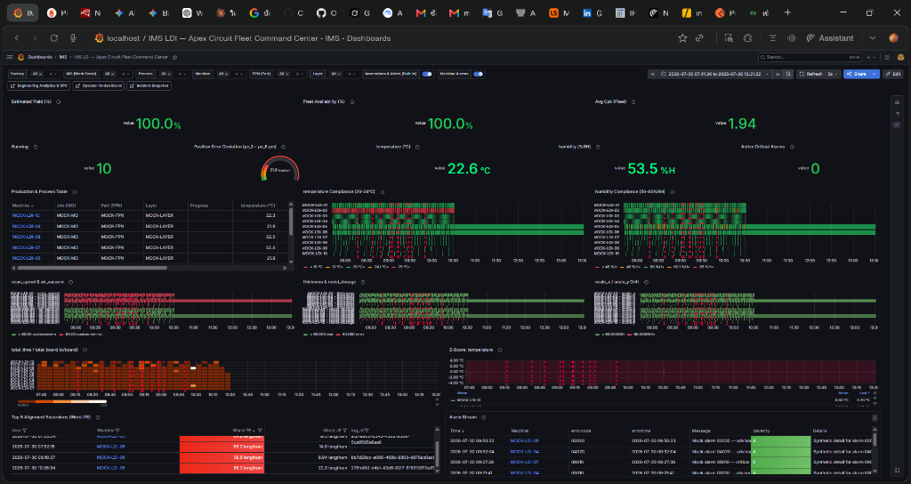
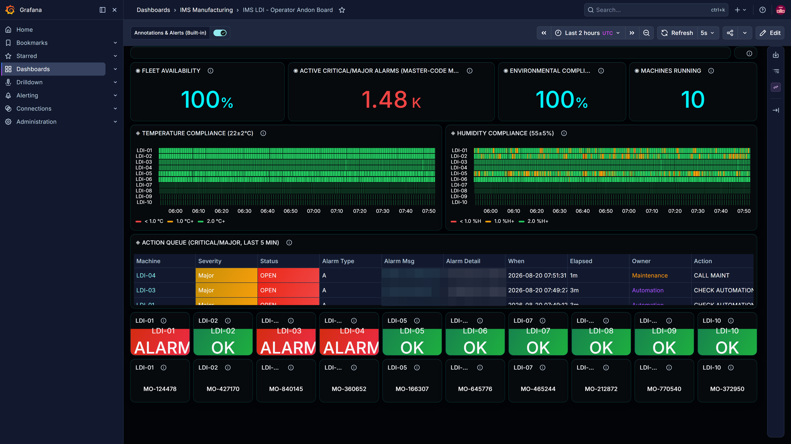
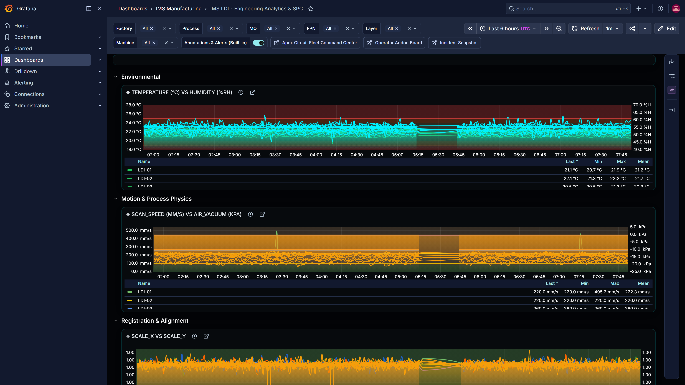
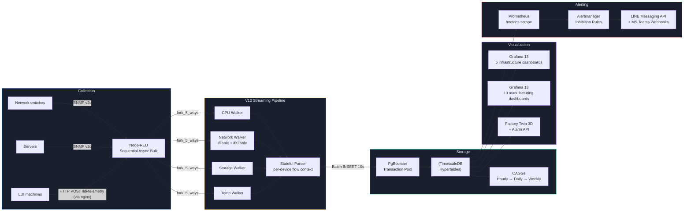

<!-- GLOBAL_NAV -->
<div align="right">
  <a href="README.md"> <b>Home</b></a> &nbsp;|&nbsp;
  <a href="docs/README.md"> <b>Docs Index</b></a>
</div>
<br/>

<div align="center">
  <br/>
  <a href="https://github.com/PATTANAKORN025/IMS">
    
  </a>
  <br/><br/>
   &nbsp;&nbsp;&nbsp;&nbsp;
   &nbsp;&nbsp;&nbsp;&nbsp;
   &nbsp;&nbsp;&nbsp;&nbsp;
   &nbsp;&nbsp;&nbsp;&nbsp;
   &nbsp;&nbsp;&nbsp;&nbsp;
   &nbsp;&nbsp;&nbsp;&nbsp;
  
  <br/>
  <br/>
</div>

<h1 align="center">Industrial Monitoring System (IMS)</h1>

<div align="center">
 <p>
  <a href="README.md"> <b>English</b></a> |
  <a href="th/README.md"> <b>ไทย</b></a> |
  <a href="zh-CN/README.md"> <b>简体中文</b></a>
 </p>
</div>

<div align="center">
 <strong>High-Precision Manufacturing Telemetry & Statistical Process Control</strong>
</div>

<br/>

> **Audience:** Open-Source Community, System Evaluators, Deployment Engineers.
> **Objective:** The primary entry point to the IMS codebase, outlining capabilities, architecture, and deployment steps.
> **Provenance:** Architecture, versions and commands re-verified against the repository (`main`, after PR #22/#23) on 2026-09-26. Runtime evidence links carry their own capture dates.

<div align="center">
  
  <br/>
  <br/>
  <a href="https://git.io/typing-svg"></a>
</div>

<div align="center">
  <a href="#quick-start"></a>
  <a href="LICENSE"></a>
  <a href="https://www.docker.com/"></a>
  <a href="https://grafana.com/"></a>
  <a href="https://nodered.org/"></a>
  <a href="https://www.timescale.com/"></a>
  <br>
  <a href="#verification--evidence"></a>
  <a href="#quick-start"></a>
  <a href="data-generators"></a>
</div>

<br/>

<div align="center" justify-content="space-between">
  <a href="docs/architecture/IMS_PLATFORM_BOOK.md"></a>
  <a href="docs/architecture/ARCHITECTURE.md"></a>
</div>

<br/>

## System Overview

**IMS (Industrial Monitoring System)** bridges the gap between high-precision manufacturing and enterprise IT. It is a telemetry monitoring platform built on Node-RED, TimescaleDB, and Grafana, integrating IT infrastructure metrics with OT (Operational Technology) data into a single, unified PostgreSQL-backed repository.

**The Factory Floor Reality (OT):** In advanced PCB manufacturing, Laser Direct Imaging (LDI) machines require zero-latency decision making. A shift in laser temperature or vacuum pressure can instantly cause registration errors, producing expensive scrap. Operators need immediate, color-coded Andon boards to stop the line when Statistical Process Control (SPC) limits (like Cpk) drop below acceptable thresholds.

**The Convergence (IT/OT):** IMS provides this visibility by blending traditional IT rigor with OT realities. It monitors infrastructure health (servers, network switches, ingestion latency) side-by-side with LDI machine telemetry, and its ingestion path is load-tested with K6 against a simulated fleet (100 servers by default, configurable). When an LDI alignment fails, engineers can instantly correlate it against network drops or server CPU spikes using the same single pane of glass.

**The Architecture (IT):** Under the hood, performance is driven by a stateful Node-RED pipeline managing async data ingestion and PgBouncer handling connection pooling. TimescaleDB performs the heavy lifting—computing rolling 3&sigma; baselines (Z-Scores) and continuous aggregates on the fly, ensuring Grafana renders sub-second dashboards even when querying millions of historical telemetry rows.


<table style="border:none; border-collapse:collapse; width:100%;">

<tr>
<td align="center" style="border:none; padding:8px; width:33%;">
 <br/>
 <sub><b>NOC Overview</b> — Fleet Health Envelope</sub>
</td>
<td align="center" style="border:none; padding:8px; width:33%;">
 <br/>
 <sub><b>Engineering Drill-Down</b> — Per-Machine Diagnostics</sub>
</td>
<td align="center" style="border:none; padding:8px; width:33%;">
 <br/>
 <sub><b>Capacity Planning</b> — Predictive Forecasting</sub>
</td>
</tr>
<tr>
<td align="center" style="border:none; padding:8px; width:33%;">
 <br/>
 <sub><b>LDI Manufacturing</b> — Command Center</sub>
</td>
<td align="center" style="border:none; padding:8px; width:33%;">
 <br/>
 <sub><b>LDI Andon Board</b> — Operator Floor View</sub>
</td>
<td align="center" style="border:none; padding:8px; width:33%;">
 <br/>
 <sub><b>LDI Engineering</b> — Yield & SPC Analytics</sub>
</td>
</tr>
</table>

>  **Explore the Ecosystem:** View the full [15-Dashboard Macro-to-Micro Architecture Guide](docs/product/DASHBOARD_ECOSYSTEM.md) for a deep dive into how IMS scales from C-Level business metrics down to sensor-level diagnostic data.

<br/>

---

## Core Capabilities

<table>
<tr>
<td align="center" width="33%">
 <h3>Telemetry Ingestion</h3>
 Parallel Node-RED walkers utilizing sequential bulk SNMP polling and HTTP endpoints, persisting data to TimescaleDB via PgBouncer transaction pooling.<br/><br/>
 **Verified:** [nodered-ingestion-20260813.txt](docs/evidence/runtime/nodered-ingestion-20260813.txt)
</td>
<td align="center" width="33%">
 <h3>Statistical Process Control</h3>
 Real-time SPC metrics (Cpk) and rolling 3&sigma; baselines (Z-Score anomaly detection) evaluated at the database level for early warning alerts.
</td>
<td align="center" width="33%">
 <h3>Continuous Aggregation</h3>
 Hourly, daily, and weekly rollups automatically calculated by TimescaleDB to maintain sub-second Grafana rendering times over large time ranges.<br/><br/>
 **Verified:** [cagg-policies-20260813.txt](docs/evidence/runtime/cagg-policies-20260813.txt)
</td>
</tr>
</table>

<br/>

---

## Quick Start (Two Paths)

> [!NOTE]
> **Simulator Boundary:** Both paths run the IMS stack locally using a built-in SNMP/HTTP data simulator (`ims-snmpsim`). They **do not** connect to real factory equipment or external network devices. The simulator generates realistic, bounded telemetry and alarm sequences for validation.

Choose your path based on your role and what you want to achieve:

### Path A: The Evaluator Tour (UI & Workflow)

_Designed for Managers, UI/UX Reviewers, and System Evaluators wanting to see the dashboards in action._

```bash
git clone https://github.com/PATTANAKORN025/IMS.git
cd IMS
cp .env.example .env   # then replace EVERY secret value before first start (see below)
make up                # build-flows + docker compose up -d (all 15 services, simulator included)
sleep 40 && make verify
# browse to http://localhost:3000 (nginx front door; Grafana has no published port)
```

> [!WARNING]
> `.env.example` values are public. Before any start outside a throw-away laptop, generate new values for every password, token and key in `.env` (`POSTGRES_PASSWORD`, `GRAFANA_ADMIN_PASSWORD`, `GRAFANA_DB_PASSWORD`, `ALARM_API_DB_PASSWORD`, `INGEST_API_KEY`, `ALERT_WEBHOOK_TOKEN`, `NODE_RED_CREDENTIAL_SECRET`, `NODE_RED_ADMIN_PASSWORD_HASH`, `PGADMIN_DEFAULT_PASSWORD`, `GRAFANA_RENDERER_TOKEN`). `postgres/init/003-grafana-password.sh` also carries a fallback password that is only safe when `GRAFANA_DB_PASSWORD` is set. See [SECURITY.md](SECURITY.md).

> **What to expect:** A gentle simulation (~10-15 rows/min) allowing you to click through the LDI Manufacturing Command Center, view the Operator Andon Board, and see real-time Cpk capability charts.
> **Verified:** `docker compose ps` on 2026-08-13, archived in [`docs/evidence/runtime/compose-ps-20260813.txt`](docs/evidence/runtime/compose-ps-20260813.txt).

### Path B: The Performance Proving Ground (Stress Test)

_Designed for SREs, DBAs, and Architects who want to verify the system's actual performance under extreme IT/OT loads._

```bash
git clone https://github.com/PATTANAKORN025/IMS.git
cd IMS
cp .env.example .env   # replace every secret value first
make up-prod           # base compose file + docker-compose.prod.yaml resource limits
make test-load         # k6 run tests/k6/pipeline-stress.js (needs k6 on PATH)
```

> **What to expect:** K6 ramps simulated servers (default `TARGET_SERVERS=100`; set the environment variable to scale up) against the Node-RED ingestion endpoints, with thresholds `pipeline_success` rate > 95 % and `e2e_duration` p95 < 10 s. You can monitor ingestion latency and PgBouncer queue depths live on the `IMS Meta-Monitoring` dashboard.

<details>
<summary><b>Known Limitations & Manual Configuration</b></summary>

- The nginx front door listens on plain HTTP (`${GRAFANA_PORT:-3000}` on the host, port 80 in the container); add TLS termination for production.
- Alertmanager delivery to LINE/Teams stays silent until `LINE_CHANNEL_ACCESS_TOKEN`, `LINE_USER_ID` and `TEAMS_WEBHOOK_URL` are set in `.env`.
- `pgadmin` publishes port `5050` on **all** interfaces, unlike every other published port; restrict it with a host firewall or bind it to `127.0.0.1` outside a lab.
- The Makefile is mixed-shell: `backup`, `restore`, `test-load`, `snapshot-flows` and `deploy-flows` need a POSIX shell (Git Bash on Windows); `doctor` uses cmd-style redirection.

</details>

### Verification & Evidence

Architectural claims are backed by test scripts and dated evidence files. `.github/workflows/ci.yml` runs the same checks as `node scripts/pre-commit.js` plus gitleaks, compose validation and Prometheus linting whenever GitHub Actions is available for the repository. For load test results, visual regression evidence, and disaster recovery validations, refer to the **[Evidence Index](docs/evidence/INDEX.md)**.

<details>
<summary><b>Available Commands</b></summary>

| Command                    | Description                                                 |
| -------------------------- | ----------------------------------------------------------- |
| `make doctor`              | Check prerequisites (docker, compose, node)                 |
| `make up`                  | Build flows, then start all 15 services (simulator included) |
| `make up-prod`             | Same, with the `docker-compose.prod.yaml` resource overlay  |
| `make down` / `make restart` | Stop the stack / restart node-red, grafana, alertmanager, prometheus |
| `make logs`                | Tail Node-RED logs                                          |
| `make verify`              | Full system health check (containers, DB, pipeline, alerts) |
| `make build-flows` / `make validate-flows` | Merge `nodered_data/flows/*.json` into `flows.json` / assert it is valid |
| `make snapshot-flows` / `make deploy-flows` | Back up `flows.json` / POST the split flows to Node-RED |
| `make test-unit`           | The 4 core parser/boundary unit test files                  |
| `make test-load`           | K6 pipeline stress test (`TARGET_SERVERS`, default 100)     |
| `make test-visual` / `make test-visual-ldi` | Playwright dashboard screenshot regression   |
| `make validate-dashboards` | Grep dashboard JSON for corrupted hex codes                 |
| `make backup` / `make restore FILE=<path>` | Database dump / restore                     |

The full pre-commit suite (all unit tests, the `tests/lint/` linters, dashboard and flow JSON validation) runs with `node scripts/pre-commit.js`.

</details>

---

## Architecture


```mermaid
flowchart LR
  subgraph Collection ["Collection"]
    J["Network switches"] -->|SNMP v2c| W["Node-RED\nSequential Async Bulk"]
    S["Servers"] -->|SNMP v2c| W
    L["LDI machines"] -->|"HTTP POST /ldi-telemetry (via nginx)"| W
  end

  subgraph Processing ["V10 Streaming Pipeline"]
    W -->|fork_5_ways| CPU[CPU Walker]
    W -->|fork_5_ways| NET["Network Walker\nifTable + ifXTable"]
    W -->|fork_5_ways| STO[Storage Walker]
    W -->|fork_5_ways| TMP[Temp Walker]
    CPU --> P["Stateful Parser\nper-device flow context"]
    NET --> P
    STO --> P
    TMP --> P
  end

  subgraph Storage ["Storage"]
    P -->|Batch INSERT 10s| B["PgBouncer\nTransaction Pool"]
    B --> T["(TimescaleDB\nHypertables)"]
    T --> CAGG["CAGGs\nHourly → Daily → Weekly"]
  end

  subgraph Visualization ["Visualization"]
    T --> G1["Grafana 13\n5 infrastructure dashboards"]
    T --> G2["Grafana 13\n10 manufacturing dashboards"]
    T --> FT["Factory Twin 3D\n+ Alarm API"]
  end

  subgraph Alerting ["Alerting"]
    T --> PR["Prometheus\n/metrics scrape"]
    PR --> AM["Alertmanager\nInhibition Rules"]
    AM --> WEB["LINE Messaging API\n+ MS Teams Webhooks"]
  end

  style Collection fill:#1a1f2e,stroke:#3B82F6,color:#e2e8f0
  style Processing fill:#1a1f2e,stroke:#F59E0B,color:#e2e8f0
  style Storage fill:#1a1f2e,stroke:#10B981,color:#e2e8f0
  style Visualization fill:#1a1f2e,stroke:#8B5CF6,color:#e2e8f0
  style Alerting fill:#1a1f2e,stroke:#EF4444,color:#e2e8f0
```

<details>
<summary><b>Data Flow — Step by Step</b></summary>

1. **Collection** — Every 30 seconds (`Poll Fleet (30s)`), Node-RED forks 4 walkers for network switches (CPU, Storage, Network, Temp) and 5 for servers (+LDI). The device registry is reloaded from `public.devices` every 5 minutes. LDI machines also push JSON to `POST /ldi-telemetry` through nginx, authenticated with `INGEST_API_KEY`.
2. **Walking** — Sequential async bulk walks (`session.subtree` with `maxRepetitions: 50`). Single UDP socket eliminates switch-level packet drops. Circuit breaker trips after 2 failures with automatic HALF_OPEN probe.
3. **Parsing** — `sre_parser` maintains per-device state in flow context (`dev_state_<deviceId>`), buffers rows in `batch_buf_<deviceId>`. Offline heartbeat (`_walker: "offline"`) immediately zeros all metrics on device failure.
4. **Storage** — Timer-gated independent flushing: each table type (sys/net/ldi) inserts only if its buffer has rows. Partial walker failures don't block unrelated data writes.
5. **Continuous Aggregation** — TimescaleDB refresh policies run from every minute (`ldi_data_1m`, `ldi_oee_1m`) to every 6 hours (weekly rollups); daily and weekly infrastructure CAGGs aggregate from the hourly ones (see [Data Flow](docs/architecture/DATA_FLOW.md)). Live retention (verified against the running database, not migration history -- see `docs/architecture/DATA_RETENTION.md` for a documented drift between the two): raw `sys_metrics`/`net_metrics`/`ldi_metrics` 30d, `ldi_data` 180d, hourly rollups 2yr.
6. **Visualization** — 15 dashboards across 2 domains: 5 infrastructure (NOC Overview, Engineering Drill-Down, AIOps & Capacity, Meta-Monitoring, Ingestion Latency) + 10 manufacturing (Easy Overview, LDI Manufacturing, Operator Andon, Alarm Console, Alarm Dictionary, Alarm Response (MTTA/MTTR), Engineering Analytics & SPC, Machine Snapshot, Data Readiness, Factory Digital Twin).
7. **Alerting** — Prometheus scrapes `/metrics`, Alertmanager routes to LINE Messaging API + MS Teams with runbook links (real delivery requires operator-configured credentials, absent by design). Z-Score anomalies via Grafana SQL over TimescaleDB.

</details>

<details>
<summary><b>Dashboard Architecture</b></summary>

15 dashboards — 5 infrastructure, 10 manufacturing (`monitoring/grafana/dashboards/{infrastructure,manufacturing}/`, provisioned into separate Grafana folders — see **[Ownership](docs/architecture/OWNERSHIP.md)** for the domain boundary). Full table with panel counts and descriptions: **[Dashboard Inventory](docs/architecture/DASHBOARD_INVENTORY.md)** — auto-generated from the dashboard JSON itself (`node scripts/generate-dashboard-inventory.js`), CI-checked so it can't silently drift from the real dashboards the way a hand-typed table can.

**Design System:** Cyberpunk HUD — `#030407` background, Tailwind palette (`#10B981` Healthy, `#F59E0B` Warning, `#EF4444` Critical, `#3B82F6` Accent), Roboto Mono for stat values, glassmorphism panels, Grid-24 overlap-free layout.

</details>

---

## NOC Wall-Display

Create a playlist in **Dashboards → Playlists** and start it from the playlist page; Grafana 13 plays every dashboard in kiosk mode. `scripts/create-playlist.sh` automates this but still calls Grafana's legacy id-based playlist API, so re-check it after each Grafana upgrade.

| Mode | URL parameters | Use case |
| --- | --- | --- |
| **Kiosk** | `?kiosk` | Wall display — hides the navigation chrome |
| **Kiosk + fit** | `?kiosk&autofitpanels` | Wall display — also scales panels to the screen height |
| **Operator Andon** | `/d/ims-ldi-operator-andon?kiosk` | Read-only floor board; interactive work belongs on the Alarm Console |

Use `kiosk`: the older `kiosk=tv` TV mode is not one of Grafana 13's kiosk options (some dashboard links in this repo still carry it).

---

<details>
<summary><b>Tech Stack</b></summary>

| Layer             | Technology                | Purpose                                                                       |
| ----------------- | ------------------------- | ----------------------------------------------------------------------------- |
| **Orchestration** | Docker Compose            | 15-service stack (`docker-compose.yaml`) + production resource overlay       |
| **Collection**    | Node-RED + net-snmp       | Sequential async bulk SNMP walks, 5-thread parallel walker                    |
| **Database**      | TimescaleDB 2.29 (PostgreSQL 16) + PgBouncer 1.25 | Hypertables, CAGG rollups, native compression, retention policies |
| **Visualization** | Grafana 13.1.2 + image renderer | 15 dashboards (5 infrastructure + 10 manufacturing)                    |
| **Alerting**      | Prometheus + Alertmanager | Metric scraping, inhibition rules, LINE Messaging API + MS Teams webhooks     |
| **Load Testing**  | K6                        | Pipeline stress, thresholds success > 95 %, e2e p95 < 10 s                    |
| **Services**      | Node.js 22 (Express)      | `alarm-api` (acknowledge/resolve write path), `factory-twin-3d` (Floor 1 twin) |
| **Front door**    | nginx 1.27                | Single published UI port; same-origin routing to Grafana, alarm-api, twin, Node-RED ingest |
| **SLA Probing**   | Blackbox Exporter         | HTTP/TCP/ICMP endpoint monitoring                                             |

</details>

<details>
<summary><b>Database Schema</b></summary>

- `devices` — device registry, single source of truth for both SNMP-polled infra and LDI machines (`device_type`)
- `sys_metrics` / `net_metrics` — infra telemetry (CPU/RAM/disk/temp, per-interface RX/TX), hypertables
- `ldi_metrics` — legacy manufacturing throughput/PE/JE/humidity/power/vibration, hypertable
- `ldi_data` / `ldi_alarm_log` — V2 normalized LDI telemetry + alarms, exact-event RCA join via `related_log_id`, hypertables
- `sys_hourly` / `net_hourly` / `ldi_hourly` / `ldi_data_1m` / `ldi_data_15m` / `ldi_data_1h` / `ldi_data_hourly` — continuous aggregates
- `v_machine_spc_fleet` / `v_ldi_rca_recent_window` / `v_ldi_rca_truth_test` — materialized views, refreshed every 60s

Exact column counts, the full view/CAGG list, and applied-migration count: **[Database Schema Inventory](docs/architecture/DATABASE_SCHEMA.md)** — auto-generated from `information_schema` + `timescaledb_information.*` (`node scripts/generate-schema-inventory.js`), CI-checked against the live database.

</details>

<details>
<summary><b>Project Structure</b></summary>

```text
IMS/
├── docker-compose.yaml         # 15 services; docker-compose.prod.yaml adds resource limits
├── proxy/nginx.conf            # the single front door (Grafana, alarm-api, twin, LDI ingest)
├── monitoring/
│  ├── grafana/
│  │  ├── dashboards/{infrastructure,manufacturing}/  # 5 + 10 provisioned dashboards (source of truth)
│  │  ├── library-panels/        # shared library panel (Fleet Health Score)
│  │  └── provisioning/, grafana.ini
│  ├── prometheus/, alertmanager/, blackbox/, snmpsim/
├── nodered_data/
│  ├── flows/                  # 5 split flow files (source); flows.json is a build artifact
│  ├── lib/                    # circuit-breaker.js, parser.js, snmp-normalize.js, units.js
│  └── settings.js
├── postgres/init/              # first-boot bootstrap SQL + grafana password script
├── database/migrations/        # numbered forward-only migrations (max 082), applied by db-migrate
├── services/
│  ├── alarm-api/              # acknowledge/resolve write path (Express + pg)
│  └── factory-twin-3d/        # Floor 1 digital twin (Express, lib/*.js + typed domain/)
├── tests/                      # unit/ + lint/ (no infrastructure), e2e/, smoke/, playwright/, k6/, ...
├── scripts/                    # build-flows.js, migrate-entrypoint.sh, verify-deployment.*, backup/restore, generators
├── assets/                     # README screenshots and banner
├── docs/                       # English docs: architecture/, operations/, user/, admin/, audit/, evidence/, ...
├── th/, zh-CN/                 # Thai and Simplified Chinese mirrors of the docs
└── .agents/skills/             # agent skills used by AI tooling
```

</details>

---

## Documentation & Community

<div align="center">

###  Executive & Business Strategy

|                                 Document                                 | Description                                                             |
| :----------------------------------------------------------------------: | ----------------------------------------------------------------------- |
|     [**Business Value & ROI**](docs/business/BUSINESS_VALUE_ROI.md)      | Executive summary, cost savings, MTTR reduction, and strategic impact   |
| [**Platform Book (start here)**](docs/architecture/IMS_PLATFORM_BOOK.md) | Navigational hub for the entire documentation set, terminology glossary |
|              [**Product Context**](docs/product/PRODUCT.md)              | Product purpose, target audience, and positioning                       |

###  Manufacturing & LDI Intelligence

|                                       Document                                        | Description                                                            |
| :-----------------------------------------------------------------------------------: | ---------------------------------------------------------------------- |
| [**Manufacturing Platform Plan**](docs/architecture/IMS_MANUFACTURING_PLATFORM_V2.md) | Infra/manufacturing domain separation, validation/soak/DR rollout plan |
|         [**Manufacturing Domain**](docs/architecture/MANUFACTURING_DOMAIN.md)         | The LDI schema/dashboard pattern and onboarding flow                   |
|                [**LDI SPC Guide**](docs/architecture/LDI_SPC_GUIDE.md)                | Process capability (Cpk) methodology and formula                       |
|                [**LDI RCA Guide**](docs/architecture/LDI_RCA_GUIDE.md)                | Root-cause correlation (Lift/Confidence) methodology                   |
|       [**LDI Validation Protocol**](docs/operations/LDI_VALIDATION_PROTOCOL.md)       | 4-phase production sign-off procedure                                  |

###  Core Architecture & Security

|                                 Document                                 | Description                                                 |
| :----------------------------------------------------------------------: | ----------------------------------------------------------- |
|          [**Architecture**](docs/architecture/ARCHITECTURE.md)           | System context, ADRs, streaming architecture, CAGG strategy |
|   [**Visual Architecture**](docs/architecture/ARCHITECTURE_DIAGRAM.md)   | Mermaid C4 Model diagrams and sequence flows                |
|             [**Data Flow**](docs/architecture/DATA_FLOW.md)              | End-to-end pipeline diagrams, the real CAGG rollup chain    |
|       [**Database Schema**](docs/architecture/DATABASE_SCHEMA.md)        | Auto-generated table/column/view reference (CI-checked)     |
|        [**Security Model**](docs/architecture/SECURITY_MODEL.md)         | Trust boundaries, per-adapter authentication, and RBAC      |
| [**Equipment Integration (EAP)**](docs/architecture/EAP_ARCHITECTURE.md) | SNMP, HTTP/JSON, and SECS/GEM adapter contracts             |
|             [**Ownership**](docs/architecture/OWNERSHIP.md)              | Domain boundaries enforced via `CODEOWNERS`                 |
|     [**Design System**](docs/architecture/GRAFANA_DESIGN_SYSTEM.md)      | Semantic color palette, typography, threshold contracts     |
|   [**Dashboard Inventory**](docs/architecture/DASHBOARD_INVENTORY.md)    | Auto-generated dashboard/panel-count table (CI-checked)     |

### Operations & SRE Playbooks

|                               Document                                | Description                                                     |
| :-------------------------------------------------------------------: | --------------------------------------------------------------- |
|              [**User Manual**](docs/user/USER_MANUAL.md)              | Dashboard guide, metric reference, alert response playbooks     |
|            [**Admin Manual**](docs/admin/ADMIN_MANUAL.md)             | Container ops, device registration, migrations, backup/recovery |
|          [**Operator SOP**](docs/operations/SOP_OPERATOR.md)          | Standard Operating Procedures for factory floor / Level 1 NOC   |
|   [**Troubleshooting & Alarms**](docs/operations/ALARM_PLAYBOOK.md)   | Alarm code resolution and troubleshooting playbook              |
|     [**Incident Response**](docs/operations/INCIDENT_RESPONSE.md)     | Severity framework + real worked incident examples              |
| [**Alarm Severity Guide**](docs/architecture/ALARM_SEVERITY_GUIDE.md) | The 4-tier severity taxonomy, ISA-18.2 scope                    |
|       [**Backup & Restore**](docs/operations/BACKUP_RESTORE.md)       | Real dr-test.sh evidence, procedure, and caveats                |
|          [**DR Test Plan**](docs/operations/DR_TEST_PLAN.md)          | 3-drill disaster-recovery test plan                             |
|       [**Data Retention**](docs/architecture/DATA_RETENTION.md)       | Live retention/compression policy                               |
|     [**Release Checklist**](docs/operations/RELEASE_CHECKLIST.md)     | What to verify before tagging a release                         |
|       [**Troubleshooting**](docs/operations/TROUBLESHOOTING.md)       | Common issues, debugging commands, recovery procedures          |
|        [**Operations Runbook**](docs/operations-runbook.md)           | Day-to-day stack operations and recovery commands               |
| [**Factory Twin Operator Guide**](docs/architecture/FACTORY_TWIN_OPERATOR_GUIDE.md) | How to read the Floor 1 twin and its evidence states |
|      [**Production Readiness**](PRODUCTION-READINESS.md)              | Release gate status and open risks                              |

###  Community & Reference

|                             Document                             | Description                                               |
| :--------------------------------------------------------------: | --------------------------------------------------------- |
| [**Video Onboarding Script**](docs/product/ONBOARDING_SCRIPT.md) | Storyboard and guide for recording onboarding GIFs/Videos |
|               [**Contributing**](CONTRIBUTING.md)                | Development workflow, branch naming, commit conventions   |
|            [**Code of Conduct**](CODE_OF_CONDUCT.md)             | Community standards and enforcement                       |
|                [**Security Policy**](SECURITY.md)                | Vulnerability reporting                                   |
|               [**Changelog**](CHANGELOG.md)                     | Release and merge history                                 |
|      [**Bug Report**](.github/ISSUE_TEMPLATE/bug_report.md)      | Report a bug or regression                                |
| [**Feature Request**](.github/ISSUE_TEMPLATE/feature_request.md) | Suggest a new feature                                     |

</div>

---

<div align="center">

**Built with precision. Designed for uptime.**

[MIT License](LICENSE) — 2026 IMS Contributors

</div>
