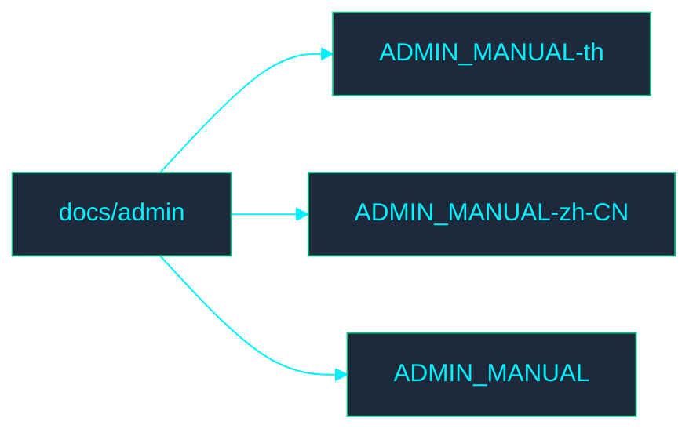

<!-- GLOBAL_NAV -->

  <a href="../../README.md"> <b>Home</b></a> &nbsp;|&nbsp;
  <a href="../../docs/README.md"> <b>Docs Index</b></a>

 

# 📁 Admin Documentation

Welcome to the **Admin** directory. This section contains documentation related to IMS admin processes.

## 🗺️ Directory Map

## 📄 File Index

- [ADMIN_MANUAL-th.md](ADMIN_MANUAL-th.md)
- [ADMIN_MANUAL-zh-CN.md](ADMIN_MANUAL-zh-CN.md)
- [ADMIN_MANUAL.md](ADMIN_MANUAL.md)
