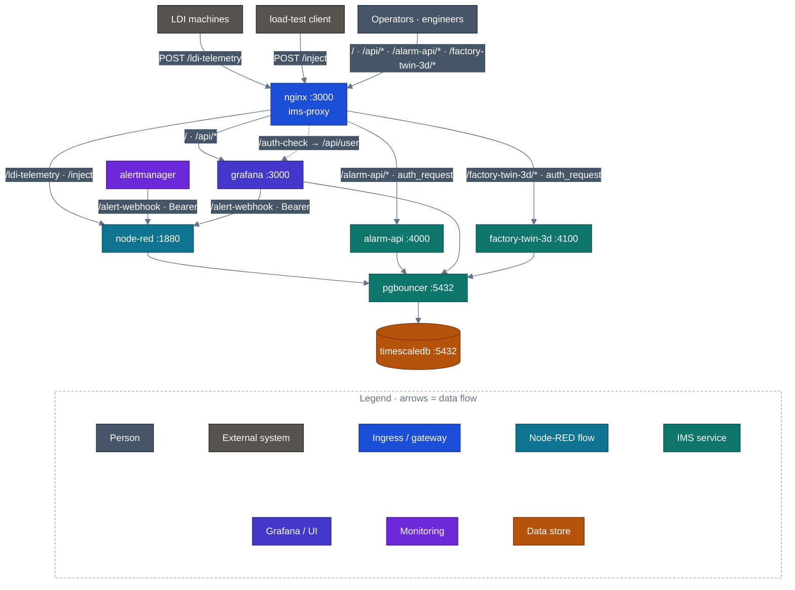

<!-- GLOBAL_NAV -->
<div align="right">
  <a href="../../README.md"> <b>Home</b></a> &nbsp;|&nbsp;
  <a href="../README.md"> <b>Docs Index</b></a>
</div>
<br/>

<div align="center">
  <h1>IMS API Reference Manual</h1>
  <p><b>Production API specifications for high-frequency telemetry ingestion, alarm lifecycle management, and alerting webhooks</b></p>
  <p>
    <a href="API_REFERENCE.md">English</a> |
    <a href="../../th/docs/api/API_REFERENCE.md">ไทย</a> |
    <a href="../../zh-CN/docs/api/API_REFERENCE.md">简体中文</a>
  </p>
</div>

---

## 1. Architectural Overview & Network Topology

The Industrial Monitoring System (IMS) exposes HTTP, WebSocket, and SNMP interfaces for edge industrial machines, manufacturing execution systems (MES), supervisory controllers, and NOC automation scripts.

Traffic entering through the external port (default: `http://localhost:3000`) is handled by a unified high-performance Nginx reverse proxy. The proxy terminates public client connections, applies per-source-IP rate limiting (`limit_req zone=grafana_limit rate=100r/s burst=2500 nodelay`), enforces large client header buffers (`4 16k`), and securely routes requests to isolated internal container networks.



### Authentication & Authorization Models

IMS enforces defense-in-depth authentication across distinct service boundaries:

1. **Ingestion API Key (`X-API-Key`)**: Used by edge devices pushing telemetry to Node-RED (`/ldi-telemetry`). The token is validated against the system environment secret (`INGEST_API_KEY`).
2. **Session Cookie Auth Gate (`auth_request /auth-check`)**: Used for operational mutations (`/alarm-api/`) and spatial twins (`/factory-twin-3d/`). Nginx sub-requests Grafana's `/api/user` endpoint using incoming session cookies. Unauthenticated requests are rejected with `401 Unauthorized` before reaching application backends.
3. **Internal Database Role Isolation**: `alarm-api` connects to PostgreSQL via PgBouncer as `alarm_api_writer`, restricted solely to updating lifecycle columns on `public.ldi_alarm_lifecycle`.

---

## 2. Telemetry Ingestion API

Accepts high-frequency manufacturing time-series telemetry from LDI exposure equipment.

### `POST /ldi-telemetry`

Directly streams structured machine execution metrics, alignment offsets, exposure dosages, and pneumatic sensor readings into the Node-RED memory queue for batched ingestion into TimescaleDB.

- **Gateway URL**: `http://localhost:3000/ldi-telemetry`
- **Internal Direct URL**: `http://node-red:1880/ldi-telemetry`
- **Method**: `POST`
- **Headers**:
  - `Content-Type: application/json`
  - `X-API-Key: ${INGEST_API_KEY}` (Required)

#### Request Payload Schema (JSON Array)

```json
[
  {
    "time": "2026-09-28T04:00:00Z",
  "factory": "F1",
  "process": "LDI",
  "eqp_id": "LDI-01",
  "mo": "MO-001234",
  "fpn": "PN-5678",
  "layer_name": "L1",
  "resist_dosage": 45.5,
  "scale_x": 1.002,
  "scale_y": 0.998,
  "temperature": 24.5,
  "humidity": 45.0,
  "scan_speed": 120.0,
  "air_vacuum": -15.2,
  "thickness": 1.2,
  "board_no": 1,
  "total_board": 100,
  "total_time": 450.5,
  "state": true,
  "pe_1": 1.1,
  "je_1": 2.2,
    "log_id": "LOG-10001"
  }
]
```

#### Field Dictionary

| Field | Type | Required | Units / Format | Description |
|:------|:-----|:---------|:---------------|:------------|
| `time` | ISO 8601 String | Yes | UTC timestamp | Timestamp of measurement capture at machine edge. |
| `factory` | String | Yes | Identifier | Factory or site code (e.g. `F1`). |
| `process` | String | Yes | Process step | Manufacturing department (e.g. `LDI`, `DRILLING`, `VCP`). |
| `eqp_id` | String | Yes | Machine ID | Unique equipment identifier (e.g. `LDI-01`). |
| `mo` | String | Yes | Alphanumeric | Manufacturing Order / Work Order ID. |
| `fpn` | String | Yes | Alphanumeric | Factory Part Number / Product ID. |
| `layer_name` | String | Yes | Alphanumeric | PCB layer designation (e.g. `L1`, `L2`, `TOP`, `BOT`). |
| `resist_dosage` | Float | Yes | $\text{mJ/cm}^2$ | Photoresist light exposure dosage energy. |
| `scale_x` | Float | Yes | Ratio | Optical scaling calibration factor along X-axis. |
| `scale_y` | Float | Yes | Ratio | Optical scaling calibration factor along Y-axis. |
| `temperature` | Float | Yes | $^\circ\text{C}$ | Ambient chamber temperature. |
| `humidity` | Float | Yes | $\% \text{RH}$ | Chamber relative humidity percentage. |
| `scan_speed` | Float | Yes | $\text{mm/s}$ | Exposure optical scanning head velocity. |
| `air_vacuum` | Float | Yes | $\text{kPa}$ | Substrate holding chuck pneumatic vacuum pressure. |
| `thickness` | Float | Yes | $\text{mm}$ | Panel material substrate core thickness. |
| `board_no` | Integer | Yes | Counter | Sequential board number within current batch. |
| `total_board` | Integer | Yes | Count | Total expected panels for current production lot. |
| `total_time` | Float | Yes | Seconds | Cumulative machine active exposure cycle time. |
| `state` | Boolean | Yes | True/False | Operational run state (`true` = Running, `false` = Idle/Fault). |
| `pe_1` | Float | Optional | $\mu\text{m}$ | Measured position error for fiducial channel 1. |
| `je_1` | Float | Optional | $\mu\text{m}$ | Measured jitter error for optical head 1. |
| `log_id` | String | Yes | Alphanumeric | Unique trace identifier for log message correlation. |

#### HTTP Response Codes

- **`200 OK`**: Batch passed schema validation, was written to write-ahead staging (`public.ingest_staging`), committed to hypertable (`public.ldi_data`), and deleted from staging.
  ```json
  {
    "message": "LDI Batch received",
    "rows": 10
  }
  ```
- **`400 Bad Request`**: Malformed JSON payload, payload is not a JSON array, or items missing mandatory fields (`eqp_id`, `log_id`).
  ```json
  {
    "error": "Payload must be a JSON array"
  }
  ```
- **`401 Unauthorized`**: Missing or invalid `X-API-Key` authentication header.
  ```json
  {
    "error": "Unauthorized"
  }
  ```
- **`413 Payload Too Large`**: Batch size exceeds maximum ingestion limit (500 rows).
  ```json
  {
    "error": "Batch too large: 520 rows, max 500 -- split it"
  }
  ```
- **`502 Bad Gateway`**: Staging succeeded but hypertable insertion failed; batch retained in `public.ingest_staging` for recovery retry.
  ```json
  {
    "error": "Insert failed, batch staged for retry"
  }
  ```
- **`503 Service Unavailable`**: Database pool unavailable or write-ahead staging insertion failed; batch rejected.
  ```json
  {
    "error": "Staging failed, batch not accepted"
  }
  ```

#### Live Ingestion cURL Example

```bash
curl -X POST http://localhost:3000/ldi-telemetry \
  -H "Content-Type: application/json" \
  -H "X-API-Key: ${INGEST_API_KEY}" \
  -d '[{
    "time": "2026-09-28T04:00:00Z",
    "factory": "F1",
    "process": "LDI",
    "eqp_id": "LDI-01",
    "mo": "MO-001234",
    "fpn": "PN-5678",
    "layer_name": "L1",
    "resist_dosage": 45.5,
    "scale_x": 1.002,
    "scale_y": 0.998,
    "temperature": 24.5,
    "humidity": 45.0,
    "scan_speed": 120.0,
    "air_vacuum": -15.2,
    "thickness": 1.2,
    "board_no": 1,
    "total_board": 100,
    "total_time": 450.5,
    "state": true,
    "pe_1": 1.1,
    "je_1": 2.2,
    "log_id": "LOG-10001"
  }]'
```

---

## 3. General Metric Ingestion API

Provides ad-hoc telemetry injection for non-LDI manufacturing equipment, environment sensor nodes, and diagnostic test scripts.

### `POST /inject`

- **Gateway URL**: `http://localhost:3000/inject`
- **Internal Direct URL**: `http://node-red:1880/inject`
- **Method**: `POST`
- **Headers**: `Content-Type: application/json`

#### Request Payload Schema

```json
{
  "device_id": "SENSOR-ENV-01",
  "metric": "ambient_temperature",
  "value": 23.4,
  "unit": "celsius",
  "timestamp": 1790568000
}
```

#### Responses

- **`200 OK`**: Metric received and forwarded to processing pipe.
  ```json
  {
    "status": "ok",
    "received": 1
  }
  ```

#### Live cURL Example

```bash
curl -X POST http://localhost:3000/inject \
  -H "Content-Type: application/json" \
  -d '{"device_id": "CHILLER-01", "metric": "flow_rate_lpm", "value": 48.2, "timestamp": 1790568000}'
```

---

## 4. Alarm Lifecycle Management API

The `alarm-api` microservice (`services/alarm-api`) governs the operational lifecycle states of factory alarms stored in `public.ldi_alarm_lifecycle`.

Alarms progress through strict deterministic state transitions:

```mermaid
%%{init: {"flowchart": {"nodeSpacing": 20, "rankSpacing": 32, "padding": 10, "wrappingWidth": 150, "curve": "basis"}, "sequence": {"wrap": true, "width": 170, "actorMargin": 36, "boxMargin": 8, "noteMargin": 8, "messageMargin": 30, "mirrorActors": false}, "state": {"padding": 6}, "theme": "base", "themeVariables": {"fontFamily": "Inter, Segoe UI, Helvetica, Arial, sans-serif", "fontSize": "14px", "primaryColor": "#334155", "primaryTextColor": "#ffffff", "primaryBorderColor": "#1e293b", "lineColor": "#64748b", "textColor": "#64748b", "secondaryColor": "#475569", "tertiaryColor": "#f1f5f9", "clusterBkg": "transparent", "clusterBorder": "#94a3b8", "titleColor": "#64748b", "edgeLabelBackground": "#475569", "nodeTextColor": "#ffffff", "noteBkgColor": "#fef3c7", "noteTextColor": "#1e293b", "noteBorderColor": "#d97706", "actorBkg": "#334155", "actorTextColor": "#ffffff", "actorBorder": "#1e293b", "actorLineColor": "#94a3b8", "signalColor": "#64748b", "signalTextColor": "#64748b", "labelBoxBkgColor": "#334155", "labelBoxBorderColor": "#1e293b", "labelTextColor": "#ffffff", "loopTextColor": "#64748b", "activationBkgColor": "#e2e8f0", "sequenceNumberColor": "#ffffff", "stateLabelColor": "#ffffff", "compositeBackground": "transparent", "transitionColor": "#64748b", "transitionLabelColor": "#64748b"}}}%%
stateDiagram-v2
  accTitle: Alarm lifecycle states
  accDescr: An alarm row starts OPEN when inserted; POST /alarms/ack moves it to ACKNOWLEDGED; POST /alarms/resolve moves OPEN or ACKNOWLEDGED to RESOLVED; RESOLVED is final and any further request returns 409.
  [*] --> OPEN: alarm inserted (trg_ldi_alarm_lifecycle_init)
  OPEN --> ACKNOWLEDGED: POST /alarms/ack
  OPEN --> RESOLVED: POST /alarms/resolve
  ACKNOWLEDGED --> RESOLVED: POST /alarms/resolve
  RESOLVED --> [*]: final · further requests 409
```



### Who may call it

`alarm-api` publishes no host port. It is reachable only through nginx at `/alarm-api/`, or from another container on the internal network at `http://alarm-api:4000`.

Every ack/resolve request needs a Grafana session cookie, and each request passes two checks:

1. **nginx** sends the cookie to Grafana (`auth_request` → `/api/user`). A missing or invalid session gets **401** before the request reaches the service.
2. **alarm-api** asks Grafana again, both `/api/user` and `/api/user/orgs`. It takes the caller's login and the caller's role in the current organisation:
   - **Editor** or **Admin** may write, and so may a Grafana server admin.
   - **Viewer** gets **403**.

The actor stored in `acknowledged_by` / `resolved_by` is always the Grafana login of the session. Any `acknowledged_by` or `resolved_by` field in the request body is ignored.

### `POST /alarm-api/alarms/ack`

Acknowledges an alarm: `OPEN` → `ACKNOWLEDGED`.

- **URL**: `http://<host>:3000/alarm-api/alarms/ack`
- **Headers**: `Content-Type: application/json`, `Cookie: grafana_session=…`

#### Request payload

| Field | Type | Required | Description |
|:------|:-----|:---------|:------------|
| `logdate_ms` | Number | Yes | Alarm event time in Unix epoch milliseconds. |
| `logid` | String | Yes | Identifier of the alarm log entry. |

```json
{ "logdate_ms": 1790568000000, "logid": "LOG-10001" }
```

#### Responses

- **`200 OK`**: now `ACKNOWLEDGED`. The body echoes the row, and `acknowledged_by` holds the caller's Grafana login.
- **`400 Bad Request`**: `{"error": "logdate_ms (number) and logid are required"}`
- **`401 Unauthorized`**: no valid Grafana session. Returned by nginx, or by the service when it is called directly.
- **`403 Forbidden`**: `{"error": "insufficient permission (Viewer role cannot acknowledge/resolve alarms)"}`
- **`404 Not Found`**: no lifecycle row for that `logdate_ms` and `logid`.
- **`409 Conflict`**: the alarm is not `OPEN`, for example `{"error": "cannot transition to ACKNOWLEDGED from current status ACKNOWLEDGED"}`.
- **`500 Internal Error`**: database unreachable or unexpected error.

#### cURL example

```bash
curl -X POST http://localhost:3000/alarm-api/alarms/ack \
  -H "Content-Type: application/json" \
  -H "Cookie: grafana_session=<your session cookie>" \
  -d '{"logdate_ms": 1790568000000, "logid": "LOG-10001"}'
```

---

### `POST /alarm-api/alarms/resolve`

Resolves an alarm: `OPEN` or `ACKNOWLEDGED` → `RESOLVED`, with an optional note.

- **URL**: `http://<host>:3000/alarm-api/alarms/resolve`
- **Headers**: `Content-Type: application/json`, `Cookie: grafana_session=…`

#### Request payload

| Field | Type | Required | Description |
|:------|:-----|:---------|:------------|
| `logdate_ms` | Number | Yes | Alarm event time in Unix epoch milliseconds. |
| `logid` | String | Yes | Identifier of the alarm log entry. |
| `resolution_note` | String | No | Root cause and corrective action. |

```json
{ "logdate_ms": 1790568000000, "logid": "LOG-10001", "resolution_note": "Replaced the chuck filter; vacuum back in range." }
```

#### Responses

Same codes as `ack`. `200` returns the row with `status: "RESOLVED"`, and `resolved_by` holds the caller's Grafana login. `409` means the alarm is already `RESOLVED`.

#### cURL example

```bash
curl -X POST http://localhost:3000/alarm-api/alarms/resolve \
  -H "Content-Type: application/json" \
  -H "Cookie: grafana_session=<your session cookie>" \
  -d '{"logdate_ms": 1790568000000, "logid": "LOG-10001", "resolution_note": "Replaced the chuck filter."}'
```

---

### `GET /alarm-api/healthz`

Liveness and database check (`SELECT 1` through the pool). The service itself does not ask for a session. Through nginx, though, `/alarm-api/` still requires one, so Docker's healthcheck calls it from inside the container instead.

- **Through nginx**: `http://<host>:3000/alarm-api/healthz`, with a Grafana session cookie
- **Inside the container**: `http://127.0.0.1:4000/healthz` (what Docker's healthcheck calls); other containers can use `http://alarm-api:4000/healthz`

#### Responses

- **`200 OK`**: `{"status": "ok"}`
- **`503 Service Unavailable`**: `{"status": "db unreachable"}`

```bash
docker exec ims-alarm-api wget -qO- http://127.0.0.1:4000/healthz
```

---

## 5. Alerting & Notification Webhook API

Enables Prometheus, external monitoring probes, and industrial PLC gateways to dispatch alert incidents into Prometheus Alertmanager.

### `POST /api/v2/alerts` (Alertmanager Ingestion)

- **Gateway URL**: `http://localhost:3000/alert-webhook` (or direct `http://localhost:9093/api/v2/alerts`)
- **Method**: `POST`
- **Headers**: `Content-Type: application/json`

#### Prometheus Alertmanager v2 Schema

```json
[
  {
    "labels": {
      "alertname": "LdiHighLaserDosage",
      "severity": "critical",
      "instance": "LDI-01",
      "process": "LDI",
      "factory": "F1"
    },
    "annotations": {
      "summary": "Laser dosage exceeded maximum tolerance limit",
      "description": "LDI-01 measured resist dosage at 48.5 mJ/cm2 (Limit: 46.0 mJ/cm2). Immediate inspection required."
    },
    "startsAt": "2026-09-28T04:10:00Z",
    "endsAt": "2026-09-28T04:20:00Z",
    "generatorURL": "http://prometheus:9090/graph"
  }
]
```

#### Responses

- **`200 OK`**: Alert received and scheduled for notification dispatch (LINE / Microsoft Teams / Webhook).

#### Live cURL Example

```bash
curl -X POST http://localhost:9093/api/v2/alerts \
  -H "Content-Type: application/json" \
  -d '[
    {
      "labels": {
        "alertname": "LdiVacuumDrop",
        "severity": "warning",
        "instance": "LDI-02",
        "process": "LDI"
      },
      "annotations": {
        "summary": "Chamber vacuum pressure loss",
        "description": "Chamber vacuum dropped below -12.0 kPa for over 3 minutes."
      },
      "startsAt": "2026-09-28T04:12:00Z"
    }
  ]'
```

---

## 6. Gateway System & Watchdog APIs

The Nginx reverse proxy provides fast-path endpoints for container orchestrators, uptime probes, and Grafana Live WebSockets:

| Endpoint | Protocol | Upstream Service | Description |
|:---------|:---------|:-----------------|:------------|
| `/api/health` | HTTP GET | Grafana `:3000` | Fast-path platform health endpoint. |
| `/api/login/ping` | HTTP GET | Grafana `:3000` | Low-overhead session ping for reconnection watchdogs. |
| `/api/live/ws` | WebSocket | Grafana `:3000` | Persistent bi-directional streaming for real-time dashboard updates. |
| `/auth-check` | HTTP GET | Grafana `:3000` | Internal sub-request endpoint validating Grafana session cookies. |

---

## 7. Error Codes & Operational Diagnostics

| Status Code | Reason | Diagnostic & Remediation Steps |
|:------------|:-------|:-------------------------------|
| `400 Bad Request` | Schema or Validation Failure | Verify JSON payload against Field Dictionary. Ensure `logdate_ms` is an integer number. |
| `401 Unauthorized` | Missing / Invalid Auth | Supply valid `X-API-Key` or ensure operator is logged into Grafana session. |
| `404 Not Found` | Entity Missing | Verify `logid` and `logdate_ms` exist in `public.ldi_alarm_lifecycle`. |
| `409 Conflict` | Illegal State Transition | Verify current alarm status (`SELECT status FROM public.ldi_alarm_lifecycle`). Resolved alarms cannot transition to Acknowledged. |
| `429 Too Many Requests` | Nginx Rate Limit Exceeded | Client exceeded 100 req/s rate limit. Reduce polling frequency or implement exponential backoff. |
| `502 Bad Gateway` | Upstream Unreachable | Upstream container recreated or restarting. Execute `docker exec ims-proxy nginx -s reload`. |
| `503 Service Unavailable` | Database Unreachable | PgBouncer or TimescaleDB pool exhausted. Check container health via `make verify`. |
