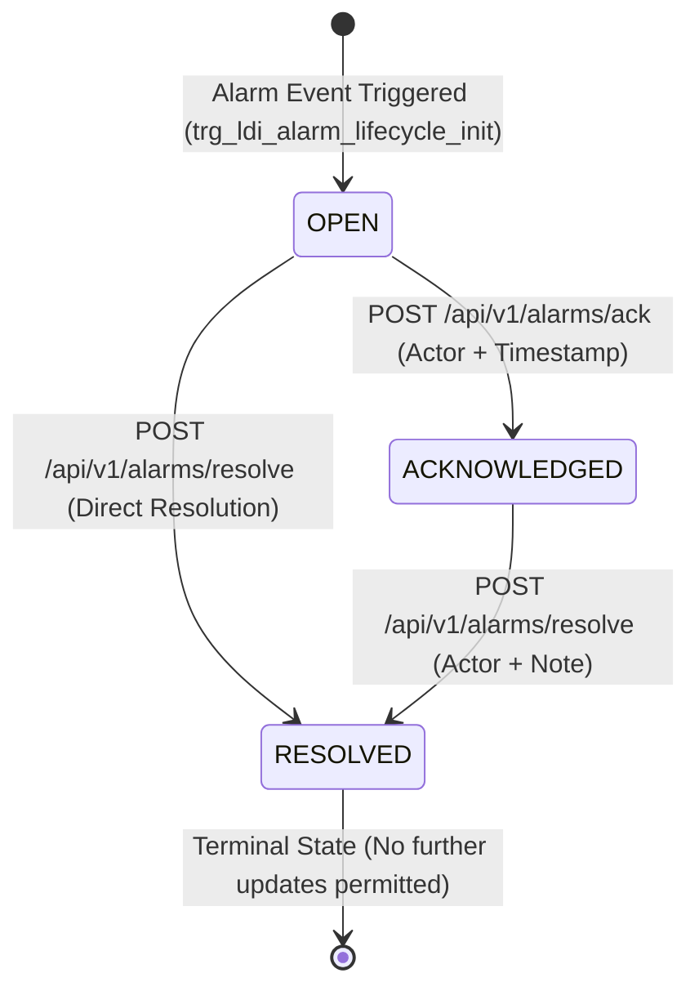

<!-- GLOBAL_NAV -->
<div align="right">
  <a href="../../README.md"> <b>Home</b></a> &nbsp;|&nbsp;
  <a href="../README.md"> <b>Docs Index</b></a>
</div>
<br/>

<div align="center">
  <h1>IMS Industrial Alarm Severity Taxonomy & Lifecycle Architecture</h1>
  <p><b>4-tier severity classification, Canonical Color Tokens, finite state machine (OPEN → ACKNOWLEDGED → RESOLVED), and ISA-18.2 alignment</b></p>
  <p>
    <a href="ALARM_SEVERITY_GUIDE.md">English</a> |
    <a href="../../th/docs/architecture/ALARM_SEVERITY_GUIDE.md">ไทย</a> |
    <a href="../../zh-CN/docs/architecture/ALARM_SEVERITY_GUIDE.md">简体中文</a>
  </p>
</div>

---

## 1. Overview & Operational Scope

The Industrial Monitoring System (IMS) implements a deterministic alarm management architecture designed to prevent operator alarm floods, enforce clear operational ownership, and provide actionable context across shop-floor Andon boards and engineering analytics.

Alarm processing operates across two tightly decoupled database structures:
1. **Append-Only Fact Table (`public.ldi_alarm_log`)**: High-throughput immutable hypertable logging every alarm event trigger.
2. **Mutable Lifecycle State Table (`public.ldi_alarm_lifecycle`)**: Dedicated state table tracking ownership, operator acknowledgment, and terminal resolution timestamps.

---

## 2. The 4-Tier Severity Scale & Canonical Color Tokens

Every alarm code in `public.ldi_alarm_ms_code` is governed by a database `CHECK` constraint restricting severity to four tiers:

| Severity Tier | Canonical Token | Hex Code | Visual Indicator | Operational Priority & Response Expectation |
|:--------------|:----------------|:---------|:-----------------|:--------------------------------------------|
| **Critical**  | `critical`      | `#EF4444` | Crimson Red      | Highest priority — immediate machine stop or product scrap risk. Response $< 2\text{ minutes}$. |
| **Major**     | `warning`       | `#F59E0B` | Amber Yellow     | Significant equipment fault or parameter drift. Requires prompt intervention $< 15\text{ minutes}$. |
| **Minor**     | `severity-minor`| `#EAB308` | Gold Yellow      | Low-impact warning or preventive maintenance notification. Response during shift window. |
| **Warning**   | `accent`        | `#3B82F6` | Precision Blue   | Informational or advisory notice. Mapped to accent blue to avoid visual confusion with Major amber. |

> [!TIP]
> **Design System Compliance**: Notice that the lowest tier **Warning** intentionally uses the `#3B82F6` (accent blue) token, whereas **Major** uses `#F59E0B` (amber). This ensures that operators can immediately distinguish between an advisory notification and a major condition at a single glance.

---

## 3. Finite State Machine Lifecycle (Migration 077)

Alarm lifecycle state transitions are enforced server-side inside PostgreSQL by trigger `trg_ldi_alarm_lifecycle_guard`:



### State Definitions & Trigger Enforcement

- **`OPEN`**: Initial state auto-populated upon event insertion into `public.ldi_alarm_log`. No operator intervention has occurred.
- **`ACKNOWLEDGED`**: Operator has accepted responsibility. Mandatory `acknowledged_by` actor identity and auto-stamped `acknowledged_at` timestamp.
- **`RESOLVED`**: Terminal state. Requires `resolved_by` actor identity and optional `resolution_note`. Once marked `RESOLVED`, the row is permanently immutable—subsequent updates are rejected by database exception.

---

## 4. ISA-18.2 Taxonomy Alignment & Architectural Boundaries

IMS adopts vocabulary and concepts from **ANSI/ISA-18.2-2016** (Management of Alarm Systems for the Process Industries). For audit accuracy, the system is described as **"ISA-18.2-style"**:

### What Is Implemented
- **Standardized 4-Tier Severity Hierarchy**: Structured taxonomy with explicit priority mappings.
- **Operator Lifecycle State Machine**: Tracked state transitions (`OPEN` $\to$ `ACKNOWLEDGED` $\to$ `RESOLVED`).
- **Audit-Traceable Acknowledgment**: REST API integration (`ims-alarm-api`) providing actor attribution and timestamps.
- **Andon Board Visualization (ISA-101)**: High-contrast situational awareness displays on shop-floor kiosks.

### What Is Out of Scope (By Design)
- **Alarm Shelving & Suppression**: Temporary suppression logic is currently handled manually via operator maintenance modes rather than automated shelving timers.
- **Dynamic Rationalization Catalogs**: Alarm rationalization is maintained in relational documentation tables rather than dynamic runtime configuration matrices.

---

## 5. Live SQL Queries & Integration API

### Query Active Unresolved Alarms (Andon Queue)

```sql
SELECT
  l.logid,
  l.logdate,
  l.equipmentid,
  m.alarm_code,
  m.alarm_msg,
  m.severity,
  COALESCE(lc.status, 'OPEN') AS status,
  lc.acknowledged_by,
  ROUND(EXTRACT(EPOCH FROM (NOW() - l.logdate)) / 60.0, 1) AS elapsed_minutes
FROM public.ldi_alarm_log l
JOIN public.ldi_alarm_ms_code m ON l.errorcode = m.alarm_code
LEFT JOIN public.ldi_alarm_lifecycle lc ON (l.logdate = lc.logdate AND l.logid = lc.logid)
WHERE lc.status IS DISTINCT FROM 'RESOLVED'
  AND l.logdate > NOW() - INTERVAL '24 hours'
ORDER BY
  CASE m.severity
    WHEN 'Critical' THEN 1
    WHEN 'Major'    THEN 2
    WHEN 'Minor'    THEN 3
    ELSE 4
  END ASC,
  l.logdate DESC;
```

### API Acknowledgment & Resolution via cURL

```bash
# 1. Operator acknowledges an open alarm (via Nginx proxy front-door with active Grafana session)
curl -X POST "http://localhost:3000/alarm-api/alarms/ack" \
  -H "Content-Type: application/json" \
  -H "Cookie: grafana_session=YOUR_SESSION_COOKIE" \
  -d '{
    "logdate_ms": 1790568000000,
    "logid": "LOG-10001",
    "acknowledged_by": "OP-9842"
  }'

# 2. Operator marks alarm resolved with maintenance note
curl -X POST "http://localhost:3000/alarm-api/alarms/resolve" \
  -H "Content-Type: application/json" \
  -H "Cookie: grafana_session=YOUR_SESSION_COOKIE" \
  -d '{
    "logdate_ms": 1790568000000,
    "logid": "LOG-10001",
    "resolved_by": "TECH-104",
    "resolution_note": "Replaced exposure vacuum seal gasket; pressure normalized."
  }'
```
