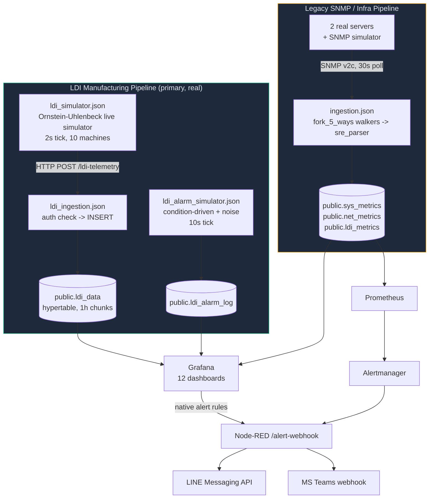

# สถาปัตยกรรมระบบ IMS (IMS System Architecture)

> แหล่งอ้างอิงข้อมูลหลัก (Single source of truth) สำหรับโทโพโลยีของระบบ, โฟลว์ข้อมูล, และสถาปัตยกรรมระดับปฏิบัติการ เขียนขึ้นใหม่ในวันที่ 2026-08-05 หลังจากพบว่าเอกสารสถาปัตยกรรมเวอร์ชันก่อนหน้าเป็นเอกสารสองฉบับที่ขัดแย้งกันเองนำมาต่อกัน ซึ่งอธิบายจำนวนแดชบอร์ดและเส้นทางการนำเข้าข้อมูลที่ไม่ตรงกับระบบที่ใช้งานจริงอีกต่อไป (ดู `IMS-SYSTEM-AUDIT-REPORT.md` หน้า 1-2) ข้อมูลทั้งหมดด้านล่างได้รับการตรวจสอบโดยตรงกับระบบที่รันอยู่หรือไฟล์ซอร์สที่มีการติดตาม ไม่ใช่การคัดลอกมาจากเอกสารฉบับก่อนหน้า
> 
> **ข้อมูลที่ผ่านการตรวจสอบแล้ว (Verified Claims):** สำหรับล็อกการรันระบบจริง, ผลลัพธ์ของการตั้งค่า, และภาพหน้าจอที่เป็นข้อพิสูจน์สำหรับข้อความด้านล่าง โปรดดูที่ **[ดัชนีหลักฐาน (Evidence Index)](../evidence/INDEX.md)**

---

## บริบทของระบบ (System Context)

IMS เป็น Docker Compose stack ที่มี **ไปป์ไลน์ข้อมูลเทเลเมทรีที่เป็นอิสระต่อกันสองชุด** ซึ่งส่งข้อมูลไปยัง TimescaleDB ฐานข้อมูลเดียวที่ใช้งานร่วมกัน แสดงผลผ่าน **Grafana แดชบอร์ด 12 ตัว** พร้อมการแจ้งเตือนผ่านทั้งระบบแจ้งเตือนดั้งเดิมของ Grafana และ Prometheus/Alertmanager

**ทำไมถึงมีไปป์ไลน์สองชุด:** ไปป์ไลน์ SNMP แบบดั้งเดิม (`ingestion.json`) คือการออกแบบดั้งเดิมของระบบ — คือการดึงข้อมูลจากอุปกรณ์ที่สื่อสารด้วย SNMP, แปลงข้อมูลผ่าน `sre_parser` แบบเก็บสถานะ, จากนั้น insert ลงใน `sys_metrics`/`net_metrics`/`ldi_metrics` ภายหลังเทเลเมทรีการผลิตของเครื่อง LDI ได้ถูกสร้างเป็นไปป์ไลน์ของตัวเองที่มีความละเอียดสูงกว่า (นำเข้า `ldi_data`, ส่งผ่าน HTTP POST แทน SNMP) เนื่องจากแดชบอร์ดด้านการผลิตต้องการความแม่นยำระดับตัวอย่างในเรื่อง PE/JE/Cpk ซึ่งตาราง `ldi_metrics` ที่ได้จากการจำลองด้วย k6 ไม่ได้ถูกออกแบบมาเพื่อรองรับข้อมูลระดับนี้ **เนื้อหาด้าน LDI/การผลิตของ Grafana แดชบอร์ดทั้ง 12 ตัว อ่านข้อมูลจาก `ldi_data` ไม่ใช่ `ldi_metrics`** ตาราง `ldi_metrics` ยังคงมีอยู่และยังมีการบันทึกข้อมูล (ผ่าน SRE parser ของ `ingestion.json`) แต่พารามิเตอร์บางตัวที่เป็นข้อมูลเฉพาะของเครื่อง LDI (`throughput`, `power_watt`, `vibration`) ได้รับการยืนยันแล้วว่ามีค่าเป็น `0` เสมอสำหรับอุปกรณ์ประเภท LDI — ถือเป็นช่องโหว่ที่ทราบกันในไปป์ไลน์นั้น ไม่ใช่ช่องโหว่ใน `ldi_data` ดูส่วน "ช่องโหว่ที่ทราบแล้ว (Known Gaps)" ด้านล่าง

---

## รายการคอนเทนเนอร์ (Container Inventory)

| บริการ (Service) | คอนเทนเนอร์ (Container) | วัตถุประสงค์ (Purpose) |
|---|---|---|
| `timescaledb` | `ims-timescaledb` | PostgreSQL + TimescaleDB — หน่วยเก็บข้อมูลแบบถาวรทั้งหมด |
| `pgbouncer` | `ims-pgbouncer` | Connection pooler แบบโหมด transaction ที่อยู่หน้า TimescaleDB |
| `node-red` | `ims-node-red` | ทำหน้าที่จัดการทั้งสองไปป์ไลน์ของเทเลเมทรี (เครื่องมือจำลอง + การนำเข้าข้อมูล) และโฟลว์การส่งการแจ้งเตือน |
| `grafana` | `ims-grafana` | แดชบอร์ด, กฎการแจ้งเตือนที่เตรียมไว้, การแจ้งเตือนดั้งเดิม ไม่มีโฮสต์พอร์ตเป็นของตัวเอง — เข้าถึงได้ผ่าน `proxy` เท่านั้น (ดูด้านล่าง) |
| `proxy` | `ims-proxy` | nginx reverse proxy; จุดเข้าถึง (entry point) สู่ Grafana และ `alarm-api` เพียงจุดเดียวที่เปิดให้โฮสต์ ควบคุม `/alarm-api/` ภายใต้การตรวจสอบ `auth_request` กับเซสชันของ Grafana เอง (`proxy/nginx.conf`) — ดู `SECURITY_MODEL.md` |
| `alarm-api` | `ims-alarm-api` | เส้นทางการเขียนข้อมูลสำหรับ `public.ldi_alarm_lifecycle` (Acknowledge/Resolve, ถูกเรียกใช้จาก `IMS LDI - Alarm Console`) ไม่มีโฮสต์พอร์ต; เข้าถึงได้ผ่าน `proxy` เท่านั้น เชื่อมต่อกับ Postgres ด้วยสิทธิ์ระดับต่ำสุดของบทบาท `alarm_api_writer` (ไมเกรชัน 078) |
| `renderer` | `ims-grafana-renderer` | บริการ `grafana-image-renderer` ภายนอก (ส่งออกไฟล์ PNG สำหรับการแจ้งเตือน/รายงาน) |
| `prometheus` | `ims-prometheus` | ดึงข้อมูล (scrape) exporter ที่เกี่ยวข้องกับ `sys_metrics` และตรวจสอบความสมบูรณ์ของ Node-RED; ประเมินกฎการแจ้งเตือนของตนเอง |
| `alertmanager` | `ims-alertmanager` | กำหนดเส้นทางการแจ้งเตือนของ Prometheus ไปยัง `/alert-webhook` ของ Node-RED |
| `blackbox-exporter` | (blackbox) | โพรบตรวจจับ HTTP/TCP/ICMP สำหรับการตรวจสอบ SLA |
| `snmpsim` | (snmpsim) | Agent สำหรับจำลอง SNMP เพื่อการพัฒนา/ทดสอบเป้าหมายของไปป์ไลน์ดั้งเดิม |
| `db-migrate` | `ims-db-migrate` | ตัวรันไมเกรชันแบบครั้งเดียวจบ (`scripts/migrate-entrypoint.sh`), ควบคุมการเริ่มต้นทำงานของ `node-red` และ `alarm-api` |

บริการสำหรับใช้งานภายในเท่านั้น (PgBouncer, ตัวจำลอง SNMP, blackbox exporter, Grafana, alarm-api) จะไม่เปิดเผยสู่โฮสต์โดยตรง; มีเพียง `proxy` (3000, เป็นด้านหน้าของทั้ง Grafana และ alarm-api), Node-RED (1880), Prometheus (9090), และ Alertmanager (127.0.0.1:9093, เฉพาะลูปแบ็กเท่านั้น) ที่ทำการพอร์ตเอาไว้

---

## ไปป์ไลน์การผลิต LDI (LDI Manufacturing Pipeline) (ไปป์ไลน์ที่ทุกแดชบอร์ดใช้งานจริง)

1. **`ldi_simulator.json`** (แท็บ "LDI Live Simulator") รันกระบวนการ Orstein-Uhlenbeck แบบ mean-reverting ต่อหนึ่งเครื่อง (เครื่อง LDI จำลอง 10 เครื่อง ครอบคลุม 3 กระบวนการ: DF INNER, DF OUTER, SM) บนความถี่ 2 วินาที, และส่งข้อมูลเป็นชุดผ่าน HTTP POST ไปยัง `/ldi-telemetry`
2. **`ldi_ingestion.json`** (แท็บ "IMS LDI Ingestion") รับข้อมูลจาก POST, ตรวจสอบ `x-api-key` header เทียบกับ `INGEST_API_KEY`, และทำการ insert ลงใน `public.ldi_data`
3. **`ldi_alarm_simulator.json`** (แท็บ "LDI Alarm Simulator") รันบนความถี่ 10 วินาที รหัสสัญญาณเตือน (Alarm codes) ที่ทราบว่ามีความเชื่อมโยงกับพารามิเตอร์ในโลกจริง (ความร้อน/ความชื้น, ข้อผิดพลาดจากการจับคู่ตำแหน่ง PE/JE, ความเร็วในการสแกน) จะถูกขับเคลื่อนโดยเงื่อนไข — มันจะแจ้งเตือนเมื่อเทเลเมทรีใหม่ที่อ่านได้มีค่าอยู่นอกช่วงที่กำหนด (out of spec) ตามเงื่อนไขการตรวจสอบ RCA แบบเดียวกับเกณฑ์ใน `v_ldi_alarm_context` (ไมเกรชัน 045) รหัสที่ไม่มีความเชื่อมโยงกับพารามิเตอร์ (ข้อผิดพลาดจากการปรับเทียบ, ข้อผิดพลาดจากอุปกรณ์สร้างภาพ, ฯลฯ) จะถูกดึงมาจากพูลของสัญญาณรบกวนที่มีการสุ่มแบบถ่วงน้ำหนัก เพื่อให้ตรงกับความถี่ที่เกิดขึ้นจริงในประวัติ เครื่องหมาย `VACUUM` (รหัสสัญญาณเตือน `91009`) ถูกตั้งใจให้เป็นเพียงสัญญาณรบกวนเท่านั้น: ค่า `air_vacuum` ซึ่งเป็นค่าคงที่ในแต่ละสูตรการผลิต (recipe) ของทุกเครื่องนั้น ตั้งอยู่นอกช่วงการเตือน (out of spec) ใน `flag_vac_out_of_spec` อยู่แล้วไม่ว่าจะเวลาใด ดังนั้นกลยุทธ์เวลาการแจ้งเตือนใด ๆ ไม่สามารถสร้างสัญญาณสหสัมพันธ์จริงขึ้นมาได้ — มันเป็นความไม่ตรงกันระหว่างค่าขีดจำกัด/สูตรการผลิต ไม่ใช่สิ่งที่จำลองการซ่อมแซมขึ้นมาได้
4. ทั้งสองระบบป้อนข้อมูลให้ `public.ldi_data` / `public.ldi_alarm_log` ซึ่ง Grafana แดชบอร์ดในกลุ่ม LDI ทั้งหมด และแผงวิเคราะห์ RCA Truth Test อาศัยข้อมูลจากแหล่งเหล่านี้

สำหรับ **Yield (ผลผลิต)** นั้น มีแหล่งข้อมูลความจริงเพียงแหล่งเดียว: ฟังก์ชัน `public.f_ldi_yield_pct()` (ไมเกรชัน 046) — กรณีที่เลวร้ายที่สุดระหว่างอัตราการผ่าน PE (PE-pass-rate) และอัตราการผ่าน JE (JE-pass-rate) เมื่อเทียบกับค่า `pe_setting`/`je_setting` ของแต่ละแถว (ไม่ใช่ค่ามาตรฐานตายตัว) แดชบอร์ด NOC Overview และแดชบอร์ดการผลิตทั้งคู่ต่างเรียกใช้งานฟังก์ชันเดียวกันนี้ ดังนั้นในเชิงโครงสร้างแล้วตัวเลขจะไม่เกิดความขัดแย้งกัน

**Cpk**, สูตรคำนวณความสามารถของกระบวนการ (`LEAST((limit-mean)/(3*sigma), (mean+limit)/(3*sigma))`, sample stddev), ถูกสร้างขึ้นแยกเป็นเอกเทศใน 5 จุดด้วยกัน (แผงแดชบอร์ด 3 แผง + `v_machine_spc_fleet` + `v_machine_spc_ranking`) แทนที่จะเป็นการแชร์สูตรร่วมกัน — `tests/e2e/golden-dataset-spc.js` นำชุดข้อมูลสังเคราะห์ที่คำนวณด้วยมือเข้าสู่ฟังก์ชันทั้ง 5 และยืนยันว่าผลลัพธ์นั้นตรงกัน เพื่อเป็นประตูด่านความปลอดภัยขั้นสูง (CI gate) ของ CI ไว้ป้องกันปัญหาความคลาดเคลื่อนกลับมาเกิดขึ้นอีก

---

## ไปป์ไลน์โครงสร้างพื้นฐาน / SNMP แบบดั้งเดิม (Legacy SNMP / Infrastructure Pipeline)

`ingestion.json` (แท็บ "IMS Ingestion Pipeline") จะทำการร้องขอข้อมูล (poll) จากอุปกรณ์ที่ลงทะเบียนผ่านโปรโตคอล SNMP v2c ในทุก 30 วินาที:

- รายการอุปกรณ์ถูกโหลดจาก `public.devices` เข้าไปอยู่ใน `global.deviceRegistry` (รีเฟรชทุก 5 นาที)
- `fork_5_ways` ทำหน้าที่กระจายตัวเดินสายเพื่อร้องขอข้อมูล (CPU, Storage, Network, Temperature, LDI) สำหรับแต่ละอุปกรณ์คู่ขนานกัน
- `sre_parser` ("SRE AIOps Parser v9 Batch") คอยรักษาสถานะของแต่ละอุปกรณ์ในบริบทการทำงาน, พักการเก็บข้อมูลแบบแถว, และการเพิ่มข้อมูลเป็นรอบ ๆ เข้าสู่ `sys_metrics` / `net_metrics` / `ldi_metrics` เป็นอิสระแยกในแต่ละตาราง (ความล้มเหลวเพียงบางส่วนของตัวรับข้อมูล จะไม่หยุดข้อมูลอื่นที่ไม่เกี่ยวข้อง)
- ตัวจำลองโหลดข้อมูลสังเคราะห์สไตล์ k6 (`inject_fleet` -> `generate_fleet_targets` -> `pace_limiter` -> โครงสร้างไปป์ไลน์/parser เดียวกัน) ก็คอยป้อนข้อมูลไปป์ไลน์ตัวนี้เพื่อวัตถุประสงค์ในการจำลองการทดสอบการรับโหลด

ไปป์ไลน์ชุดนี้เป็นตัวผลักดันแผงแดชบอร์ดโครงสร้างพื้นฐานบน NOC Overview อย่างแท้จริง (ข้อมูล CPU/RAM/Disk/Temperature สำหรับเซิร์ฟเวอร์จริง 2 เครื่องคือ `ERP-MASTER-UBUNTU` / `ERP-MASTER-WINDOWS`) รวมถึงแดชบอร์ด AIOps & Capacity Forecast ข้อมูลชุดนี้ **ไม่ใช่** แหล่งที่คอยป้อนกระบวนการ LDI / แผงควบคุมคุณภาพ — ดูการแยกส่วนไปป์ไลน์ที่ด้านบน

---

## สคีมาของฐานข้อมูล (Database Schema) (ข้อมูล ณ ไมเกรชัน 047)

> จำนวนคอลัมน์และรายการของ view/materialized-view/CAGG รวมถึงจำนวนของไมเกรชันที่มีการปรับใช้ทั้งหมดนั้นถูกสร้างขึ้นมาใหม่โดยอัตโนมัติ ใน **[DATABASE_SCHEMA.md](DATABASE_SCHEMA.md)** (`node scripts/generate-schema-inventory.js`, ผ่านการตรวจสอบผ่านระบบ CI ที่เชื่อมกับฐานข้อมูลจริงแล้ว) ตารางข้อมูลนี้จะช่วยให้คำตอบถึงหลักการหรือเหตุผล ว่าสิ่งนี้ไปป้อนกับตารางอะไร ทำไปเพื่อจุดประสงค์อะไร — เป็นสิ่งที่ตัวสร้างสคีมาแบบออโต้ไม่สามารถสรุปได้จาก `information_schema` เพียงอย่างเดียว

| ตาราง (Table) | ประเภท (Type) | รับข้อมูลจาก (Fed by) | วัตถุประสงค์ (Purpose) |
|---|---|---|---|
| `devices` | Table | manual/seed | ที่เก็บข้อมูลของทุกเอนทิตีที่ถูกตรวจสอบ (`device_type`: `ldi` หรือ `server`) |
| `ldi_data` | Hypertable, ขนาดก้อน 1 ชั่วโมง | `ldi_ingestion.json` | เทเลเมทรีการประมวลผล LDI จริง — ตัวบ่งชี้ความเร็วในการแสกน, อุณหภูมิ, ความชื้น, ศูนย์ยากาศ, และค่าความเบี่ยงเบน PE/JE ซึ่งมาเป็นรายละเอียดรายตัวอย่าง (per-sample) ถือเป็นจุดกำเนิดแหล่งข้อมูลสำหรับทุกแผงแดชบอร์ดควบคุม LDI |
| `ldi_alarm_log` | Hypertable, ขนาดก้อน 7 วัน | `ldi_alarm_simulator.json` | แถวข้อมูลรายเหตุการณ์ที่เกิดขึ้นจากการแจ้งเตือน โดยเชื่อมโยงกับเงื่อนไขนับตั้งแต่ช่วงเวลาที่มีการแก้ไขระบบจำลอง (simulator fix) |
| `ldi_alarm_ms_code` | Table | ไมเกรชัน 036 (mock seed) | แหล่งอ้างอิงรหัสสัญญาณเตือนหลัก (ผลิตรหัสการปฏิบัติจริง 20 รหัส, อธิบายถึงการทำงานเท่านั้น — ไม่ใช่แคตตาล็อกคู่มือผู้จัดจำหน่าย) |
| `sys_metrics` / `net_metrics` / `ldi_metrics` | Hypertables, ขนาดก้อน 1 วัน | `ingestion.json` (ไปป์ไลน์ดั้งเดิม) | เทเลเมทรีของโครงสร้างพื้นฐาน + ตารางการชี้วัดที่จำลองจาก k6 โดยมีช่องโหว่ทางข้อมูลที่รู้แล้ว (ดูด้านล่าง) |
| `schema_migrations` | Table | `scripts/migrate-entrypoint.sh` | ติดตามความคืบหน้าของไมเกรชัน — `(version, filename, applied_at)`, ไม่ได้มีคอลัมน์ `checksum` ตามรูปแบบของตัวหลักดั้งเดิม (canonical shape) |

**Views ที่ควรรู้จัก:** `v_ldi_alarm_context` (ไมเกรชัน 045, นำสัญญาณเตือนมาเชื่อมอ้างอิงเข้ากับการอ่านเทเลเมทรีในขอบเขตเวลา 5 นาทีก่อนหน้านั้น — ซึ่งเป็นไปตามแนวทางความสอดคล้องกันกับการประเมินของ RCA Truth Test), `v_machine_spc_fleet` / `v_machine_spc_ranking` (สำหรับตัว Cpk ทั้งในขอบเขตเครือข่ายและกลุ่มที่เลือกสรร), `v_fleet_health` / `v_fleet_score` (ไมเกรชัน 047 ซึ่งปรับไปประยุกต์ใช้เพียงแค่กับ `device_type='server'` เท่านั้น — ก่อนหน้านี้ได้รวบแถวที่เป็นค่าศูนย์โดยถาวรของเครื่อง LDI รวมอยู่ด้วย นำไปสู่การลดทอนของคะแนนด้านสุขภาพของระบบโครงสร้างพื้นฐาน)

---

## การกำกับดูแลการทำไมเกรชัน (Migration Governance)

**ตัวรันการทำไมเกรชันฉบับสมบูรณ์มีเพียงตัวเดียวเท่านั้น (One canonical migration runner)**: `scripts/migrate-entrypoint.sh` บริการ Docker Compose รูปแบบ `db-migrate` ทำหน้าที่ขับเคลื่อนโปรแกรมให้ออกมาทำงานได้เลยเพียงทีเดียวแบบลัดวงจรการเริ่มต้น (โดยขึ้นอยู่กับคุณสมบัติของ `node-red` ตรงที่เป็นเงื่อนไขของ `db-migrate: condition: service_completed_successfully`); `scripts/migrate.sh` เป็นโปรแกรมครอบตัวบางเบา (`docker compose run --rm db-migrate`) เพื่อใช้สำหรับการรันสั่งใหม่แบบวิธีจัดการด้วยมือทั้งหมดโดยไม่ต้องบูทการทำงานทั้งสแต็กการจัดเก็บ

ก่อนหน้านี้โค้ดโปรเจ็กต์นี้เคยมีระบบจัดการการไมเกรตแบบทำงานแยกอิสระจากกันและกันจำนวน 3 ชุด ด้วยรูปแบบวิธีการติดตามสถานะที่มีความต่างกันไป (`migrate.sh` มีลูปของมันเอง ควบคู่กับคอลัมน์ `checksum` ซึ่งไม่ได้เอาไปใช้งานไหน, `migrate-entrypoint.sh` กลับไม่มีลูปแบบนั้นเลย, และ `init-migrations.sh` ก็ยังไม่ได้มีตารางติดตามใด ๆ เลย การวินิจฉัยของชุดนี้มีจากการพิจารณาข้อความผิดพลาดที่เจอเอาเองล้วน ๆ) — ไม่ว่าอันไหนรันลงฐานข้อมูลได้ก่อน ก็จะเป็นฝ่ายกำหนดรูปแบบคอลัมน์ของ `schema_migrations` ฐานข้อมูลนั้นโดยอัตโนมัติอย่างไร้ร่องรอย นี่เองคือจุดกำเนิดปัญหาต้นตอ (root cause) นำมาซึ่งความผันผวนของการติดตามที่ได้รับการคอนเฟิร์มแล้วในเหตุการณ์หนึ่ง (ในไมเกรชัน 038 ที่เจอรันระบบผ่านแล้วทว่าช่องบรรทัดติดตามยังขึ้นสถานะไม่ได้มาร์ค) สำหรับโปรแกรม `init-migrations.sh` ก็โดนลบทิ้งเรียบร้อยไปแล้ว; ปัจจุบันมีตัวดำเนินการรันหนึ่งเดียวร่วมกับตารางข้อมูลหนึ่งฉบับ

ไมเกรชันทั้งหมดนั้นสมควรที่จะเป็น Idempotent (เช่นใช้เงื่อนไข `CREATE ... IF NOT EXISTS`, และเงื่อนไขสำหรับการคุ้มกันแบบ `DO $$ ... IF EXISTS ...` เป็นการตรวจเช็คในเคสเปลี่ยนชื่ออะไรทำนองนั้น ฯลฯ) เพื่อยืนยันให้ได้ว่าการเลือกรันทำรอบในฐานข้อมูลที่ผ่านการไมเกรตเสร็จเรียบร้อยแล้วไปจะมีความปลอดภัยไร้การกวนทับค่าเสมอ (safe no-op) **สำหรับกรณีเตือนภัยที่น่าพิจารณาเป็นตัวอย่างคือเคส ไมเกรชัน 020**: เริ่มแรกมามันออกแบบมาให้ไปลบชุดโดยไม่ต้องใส่เงื่อนไขกั้นเลย (`DROP TABLE ldi_data CASCADE`), ซึ่งถ้าในสเตปพัฒนาซอฟต์แวร์ต้น ๆ ก็ไม่เป็นปัญหาอะไรถ้าโปรเจกต์ยังไม่ได้บรรจุข้อมูลจริง — แต่ทว่าพบรายงานมันติ๊กว่าเคยติดตั้งไว้แบบที่ยังไม่ได้เคยใช้งานต่อฐานข้อมูลซึ่งกำลังบันทึกแถวข้อมูลของจริงจำนวนสูงถึง 2.8 แสนแถว+ สุดท้ายเลยโดนแก้โค้ดสร้างตารางข้อมูลเข้าไปถ้าหาตัวตารางไม่เจอหรือทำการปรับจูนโค้ดเฉพาะจุดเข้าที่ของมันเสียใหม่ แทนการเดินดุ่ย ๆ เข้าไปสั่งโละตารางลบทิ้ง

ไมเกรชัน 048 ทำการสานต่องานจากที่ 020 ค้างคาไว้จนเสร็จสิ้น: การปรับโฉมชุดคอลัมน์ให้ `ldi_data` ของ `DOUBLE PRECISION` → เปลี่ยนให้เป็น `REAL` แทน, ซึ่งระบบจะผ่านไปอย่างไร้ร่องรอยเลยล่ะถ้าไปทำงานในฐานก้อนข้อมูลบีบอัด มันมีการถอดการบีบอัด, ลบทำลาย/ก่อประกอบตัวโซ่สายความสัมพันธ์ต่อเนื่องใน Continuous Aggregates ทั้งหลายขึ้นใหม่ (`ldi_data_1m` → `15m` → `1h`, พร้อมด้วยพ่วงตาม `ldi_data_hourly`) ทั้งครอบคลุมกระแสสายการสืบสายที่ขึ้นกับบรรดาเพลนวิว (plain view) ทั้งหมด 7 จุดที่โยงด้วยกัน, เปลี่ยนรูปแบบประเภทคอลัมน์เหล่านั้นซะ, ท้ายสุดยังทำรีเฟรชอัปเดตบรรดา CAGG ครบถ้วนโดยขุดดิบข้อมูลเพียว ๆ — ล้อมรั้วคุ้มกันเป็นอย่างดีให้ทำตัวข้ามเมื่อพบเจอว่าชุดคอลัมน์มันเปลี่ยนไปแล้วว่าเป็น `REAL` เรียบร้อย (เจอแน่ ๆ ในการจัดทำระบบฐานขึ้นใหม่แบบเอี่ยมอ่อง ผ่านทางสคริปต์ `postgres/init/001`) ทางด้านฝั่งไมเกรชัน 049 ตัดตารางที่สิ้นสภาพไร้ชีวาออกไปอย่างตาราง `alert_rules`/`alert_history` (ดูข้อมูลต่อใน "ช่องโหว่ที่ทราบแล้ว") และต่อมายังฝั่งไมเกรชัน 050 เข้ามาเพื่อส่งเสริมกระบวนการคิดของตัว RCA Lift/Confidence นำเข้าสู่ระบบวิวมุมมองร่วมใช้งานจริง ชื่อวิวมุมมองร่วม `v_ldi_rca_recent_window` 

ไมเกรชัน 064 เปลี่ยนแปลง `v_machine_spc_fleet` และ `v_ldi_rca_recent_window` จากแบบเพลนวิว (plain views) ไปให้เป็นประเภท Materialized views แทน (แบบที่ว่าใช้ชื่อตัวเดิม และออกชุดคอลัมน์โครงสร้างชุดเดียวกัน, ฉะนั้นไม่ต้องทำการเข้าไปแก้ไขแผงที่เข้าไปใช้งานเพื่อดึงดูข้อมูลแต่อย่างใด) ด้วยการรีเฟรชตัวเองออโต้สำหรับรอบ 60s ที่มาจากฟังก์ชันตั้งตารางการประมวลผลตัวมาตรฐานทั่วไปในตัว TimescaleDB เอง (อย่างคำสั่ง `add_job` — เผอิญสแต็กของชุดรันนี้ดันไม่มีแพคตัวติดตั้งตัวปลั๊กอิน `pg_cron` แถมมาเลย, จึงต้องส่ายหน้าให้กับตัวเลือกทางฝั่งหลังแทน) ซึ่งมันยังทำการแยกจัดการระบบดึงโค้ดฝังแฝงสายตัว CTE ออกจากชุดแผงควบคุม Engineering Analytics "RCA Truth Test" ออกไปประดิษฐ์ขึ้นใหม่เพื่อการนี้สำหรับใน materialized view ที่ใช้ชื่อว่า `v_ldi_rca_truth_test`, ซึ่ง *นี่แหละ* สร้างจุดที่จะต้องแก้ไขรหัสภาษาบรรทัด SQL แผงการอิงโค้ดใหม่ (กลายเป็น `SELECT ... FROM v_ldi_rca_truth_test` แทนการนั่งรอชุดระบบรันสาย CTE ในทุกอณูจังหวะของการอ่านคำสั่ง) ทั้งคู่ความเปลี่ยนแปลงที่ถูกสร้างนี้ถูกกำกับจัดการผ่านการตรวจวัดตัวเลขอิงตามของจริงผ่าน `EXPLAIN ANALYZE`, ไม่ได้นึกกะเกณฑ์เดาเอาเองมั่วซั่ว: ความช้าหน่วงด้านสถิติของการสืบค้นค่า (Query latency) ระดับ P95 ภายใต้ชุด LDI หดลงจากเดิมคือ 60.12ms เหลือสั้นจู๋ที่ตัวเลข 5.30ms

---

## การแจ้งเตือน (Alerting)

มีตัวขับเคลื่อนเอนจิ้นสองชิ้นเป็นอิสระในการประเมินสำหรับการแจ้งเตือน แล้วไหลต่อมาบรรจบรวมเป็นทางป้อนตัวเดียวกันผ่านการทำงานของโฟลว์ข้อมูลตัวจัดการกระจายใน Node-RED:

1. **ระบบการแจ้งเตือนดั้งเดิมของ Grafana (Grafana native alerting)** (`monitoring/grafana/provisioning/alerting/*.yml`) — กฎการแจ้งเตือนเฉพาะสำหรับ LDI (เช่น การแจ้งเตือนของเครื่องในฐานข้อมูล, ขีดความสามารถกระบวนการต่ำกว่า 1.33, การสั่นสะเทือนระดับวิกฤต, ความผิดปกติของ Z-score) จะถูกประเมินโดยตรงกับ TimescaleDB ผ่านตัวตั้งเวลาของ Grafana เอง
2. **Prometheus + Alertmanager** — กฎที่เน้นโครงสร้างพื้นฐาน (เกณฑ์ CPU/RAM/ดิสก์/อุณหภูมิ, การลดลงของบริการ, สถานะดาวน์ของอินเตอร์เฟส) ซึ่งจะถูกประเมินโดย Prometheus และถูกจัดการเส้นทางโดย Alertmanager (`monitoring/alertmanager/alertmanager.yml`) ผ่านการจัดกลุ่มตามความรุนแรงและกฎการยับยั้ง (ระดับ critical จะระงับระดับ warning สำหรับอุปกรณ์ตัวเดียวกัน)

**ทั้งสองเส้นทางมุ่งประสานเข้าสู่เป้าหมาย `nodered_data/flows/alerting.json` แบบร่วมกัน** (ในแท็บ "IMS Alerting Pipeline") ซึ่งทำหน้าคอยรับ webhook จาก Alertmanager ที่ `POST /alert-webhook`, โดยเตรียมจัดรูปแบบการแจ้งเตือน, และกระจายตัวส่งต่อไปยัง:
- **LINE Messaging API** (ขีดเส้นใต้ว่าไม่ใช่ LINE Notify — เพราะ API นั้นถูกยกเลิกโดย LINE ไปแล้วในปี 2025 และไม่ได้ใช้ในที่นี้) ผ่าน `LINE_CHANNEL_ACCESS_TOKEN` + `LINE_USER_ID`
- **MS Teams** ส่งผ่านเข้าไปทางรหัส `TEAMS_WEBHOOK_URL`, ดุจดังในฐานะ Adaptive Card

หากข้อมูลข้อมูลประจำตัวใดยังไม่ได้ถูกตั้งค่า (unset) ฟังก์ชันการนำส่งที่สอดคล้องกันนั้นจะเรียก `node.error()` (ซึ่งมองเห็นได้ในโหนดแก้ไขข้อบกพร่อง "Alert Delivery Failure" ของโฟลว์และผ่านตัวบ่งชี้สถานะสีแดงถาวรบนโหนดเอง) แทนที่จะลบการแจ้งเตือนแบบเงียบ ๆ — แต่การส่งมอบจะไม่เกิดขึ้นจนกว่าข้อมูลรับรองจริงจะถูกกำหนดค่าใน `.env` ส่วนในอีกช่องทางของ Grafana เองในส่วนเส้นทาง `ims-slack-critical` ก็ยังถูกกำหนดให้โอนการส่งผ่านมาที่ตัว webhook นี้เช่นเดียวกัน; ซึ่งก่อนหน้านี้มีการกำหนดให้ส่งตรงไปที่ slack ซึ่งชี้ไปที่ URL แทนที่ได้ถูกนำออกไปแล้วเพื่อไม่ให้เกิดความล้มเหลวซ้ำซากกับทุกๆ การแจ้งเตือนระดับวิกฤต

---

## รายการแดชบอร์ด (Dashboard Inventory)

> จำนวนแผงควบคุมและคำอธิบายถูกสร้างขึ้นโดยอัตโนมัติใน **[DASHBOARD_INVENTORY.md](DASHBOARD_INVENTORY.md)** (`node scripts/generate-dashboard-inventory.js`, ผ่านการตรวจสอบจากระบบ CI แล้ว) ตารางนี้เพิ่มข้อมูลเกี่ยวกับ "เหตุผล" ในเชิงสถาปัตยกรรม -- ขอบเขตของการอ้างอิงไขว้ -- ซึ่งโปรแกรมสร้างข้อมูลไม่สามารถอนุมานจากไฟล์ JSON เพียงอย่างเดียวได้; คอลัมน์ UID/Title ในที่นี้ต้องสอดคล้องกับไฟล์ที่สร้างขึ้นเมื่อมีการเพิ่มหรือเปลี่ยนชื่อแดชบอร์ด

| UID | ชื่อไตเติ้ล (Title) | ขอบเขตหน้าที่ (Scope) |
|---|---|---|
| `ims-noc-overview` | IMS NOC Overview | เฉพาะโครงสร้างพื้นฐาน (เซิร์ฟเวอร์จริง 2 เครื่อง + เครือข่าย) — เนื้อหาด้านกระบวนการผลิตของ LDI จะแยกไปอยู่ที่อื่น ดูด้านล่าง |
| `ims-ldi-manufacturing` | IMS LDI - Manufacturing Command Center | แดชบอร์ด RCA เต็มรูปแบบ 4 เลเยอร์: KPI ระดับบริหาร, เทเลเมทรีเครื่องจักร, บริบทการผลิต, สตรีมของสัญญาณเตือน |
| `ims-ldi-operator-andon` | IMS LDI - Operator Andon Board | หน้าจอบนตู้คีออสก์บริเวณพื้นที่การผลิต, 1280x720 จัดเต็มแบบไม่ต้องเลื่อนสกอร์ (no-scroll) |
| `ims-ldi-engineering-analytics` | IMS LDI - Engineering Analytics & SPC | อันดับ Cpk/SPC, RCA Truth Test, การกระจาย PE/JE |
| `ims-ldi-machine-snapshot` | IMS LDI - Machine Snapshot | ตรวจสอบเจาะลึกรายเหตุการณ์ (คลิกสัญญาณเตือน/บันทึกเพื่อตรวจสอบ) |
| `ldi-data-readiness` | LDI Data Readiness & Integration Gaps | แดชบอร์ดตรวจสอบคุณภาพข้อมูลด้วยตนเอง (ความซ้ำซ้อนของ board-key, % ความครอบคลุม, อัตราความตรงกันของ alarm-master) |
| `ims-easy-overview` | IMS Easy Overview | ภาพรวมระดับกองทัพแบบพริบตาเดียว ปราศจากการตั้งค่าใดๆ ซึ่งสร้างจาก view/function ที่ใช้ร่วมกันทั้งหมด (`v_ldi_machine_latest_full`, `v_ldi_alarm_context`, `f_ldi_yield_pct`, `v_machine_spc_fleet`) -- โดยไม่มีตัวแปรของเทมเพลตที่ต้องกำหนดค่า |
| `ims-engineering` | IMS Engineering Drill-Down | เน้นไปที่โครงสร้างพื้นฐาน (Infra-focused): CPU/RAM/ดิสก์จัดเก็บ/เครือข่ายต่อหนึ่งเซิร์ฟเวอร์, ปริมาณงานการผลิตของ LDI/คุณภาพ (ไปป์ไลน์ดั้งเดิม) |
| `ims-capacity` | IMS AIOps & Capacity Forecast | พยากรณ์เส้นจำนวนวันที่คาดหมายให้แตะจนจะสุดลิมิตเพดานบรรจุระดับค่าอิ่มตัวแบบ regression (ทาง infra) |
| `ims-meta-monitoring` | IMS Pipeline Health & Meta-Monitoring | สุขภาพของตัวรับส่งข้อมูลไปป์ไลน์เอง (แถวบันทึก/วินาที, อัตราความสำเร็จของชุดรวม, ความลึกของคิวทดลองใหม่) |

NOC Overview ถูกแยกเนื้อหาออกจาก LDI/กระบวนการประกอบการผลิต ในรอบเวลานี้ (ซึ่งก่อนหน้านี้ทำสำเนาข้อมูลแผง Yield วางซ้อนกันกับ Manufacturing) — ตอนนี้โครงสร้างพื้นฐานและเนื้อหาการผลิตถูกแยกการนำเสนอบนแดชบอร์ดที่ต่างกันโดยเจตนา ไม่ได้รวมเป็น "ภาพรวม" แดชบอร์ดเดียวอีกต่อไป

---

## ช่องโหว่ที่ทราบแล้ว (Known Gaps)

บันทึกเป็นเอกสารไว้ที่นี่ดีกว่าที่จะถูกทิ้งไว้ให้ผู้ดูแลระบบคนถัดไปมาค้นพบเอง:

- **สำหรับ `ldi_metrics.throughput` / `.power_watt` / `.vibration` ถือค่าเป็นเลข `0` เสมอกับเครื่องสเปค LDI ทุกหน่วย** (ยืนยันว่าข้อมูลชุดนี้ครอบคลุมแถวประมวลผลแล้วกว่า ~2,300+ แถวข้อมูลจากเครื่องทั้งหมด 10 เครื่อง) ท่อการนำเข้าแบบจำลอง k6 สังเคราะห์ซึ่งป้อนตารางนี้ไม่เคยได้ผูกปมไว้ให้เพื่อรับข้อมูลสำหรับอุปกรณ์จำพวก LDI กฎการแจ้งเตือน `ims-ldi-vibration-critical` จึงถูกสั่งหยุดการใช้งานชั่วคราวไว้ด้วยเหตุผลนี้ มากกว่าที่จะถูกปล่อยทิ้งให้มันล้มเหลวแบบเงียบๆ สิ่งนี้ **ไม่** ส่งผลกระทบต่อแดชบอร์ดใดๆ ที่อ่านจาก `ldi_data` (ท่อรับข้อมูลจริง) — มีเฉพาะตัวตาราง `ldi_metrics` รุ่นเดิม และตัวระบบใดๆ ที่เข้าสืบค้นคำถามโดยตรงเท่านั้นที่โดนหางเลข
- **การทำซ้ำของ Board-key บน LDI-01/LDI-04** (คือมี `(mo, board_no)` 157 / 121 คู่ที่ซ้ำกันตามลำดับ, ในขณะที่อีก 8 เครื่องอื่นๆ มีค่าเป็น 0) มีสาเหตุหลักมาจาก: การชนกันของข้อความ `MO-NNNNN` แบบสุ่มข้ามวงจรการทำงานที่แยกจากกัน (birthday paradox ซึ่งมีเพียงค่าประมาณ 90,000 ค่าที่เป็นไปได้ในรหัส 5 หลัก และมีการดึงค่าตัวเลขจาก 175 ถึง 257 ครั้งต่อเครื่องตามประวัติของชุดข้อมูล) — มันไม่ได้เป็นบอร์ดที่ถูกนับซ้ำแต่อย่างใด ขอบเขตหมายเลขรหัสถูกขยายให้กว้างขึ้นถึง 10 เท่า (เป็น 6 หลัก) ในทั้งตัวการจำลองการทำงานจริง และตัวสร้างแบทช์ประวัติศาสตร์ เพื่อทำให้โอกาสที่จะเกิดขึ้นอีกในอนาคตลดน้อยลง
- **การแจ้งเตือนจริงส่งถึงระบบ (LINE/Teams) ต้องการข้อมูลประจำตัวที่ repo นี้ไม่สามารถจัดส่งมาให้ได้** — รหัสเหล่านี้ได้แก่ `LINE_CHANNEL_ACCESS_TOKEN`, `LINE_USER_ID`, `TEAMS_WEBHOOK_URL` ในค่า `.env` ล้วนถูกปล่อยให้เป็นค่าว่างโดยปริยาย ไปป์ไลน์นี้ได้รับการพิสูจน์แล้วว่ามีความถูกต้องตั้งแต่ต้นจนจบ และส่งสัญญาณเมื่อล้มเหลวด้วย (`node.error()` + ป้ายแจ้งสถานะสีแดงสว่างต่อเนื่อง), แต่มันยังไม่สามารถไปถึงผู้คนรับได้จริงๆ จนกว่าข้อมูลยืนยันตัวตนของจริงจะถูกติดตั้งเข้าไปใน `.env` 
- **สหสัมพันธ์แบบ VACUUM (91009) RCA ได้รับการแก้ไข 2026-08-07** (ก่อนหน้านี้ได้ถูกคัดออกเนื่องจากมันดูเข้ากันไม่ได้ในทางโครงสร้าง — ย่อหน้านี้จะกลายเป็นแค่ส่วนหนึ่งของประวัติศาสตร์ซึ่งเก่าแล้ว, ไม่ใช่สถานะปัจจุบันอีกต่อไป) ขีดจำกัดที่มีความผิดปกติอยู่นอกเกณฑ์ (out-of-spec) ได้ถูกตั้งขึ้นมาใหม่สำหรับสูตร DF INNER range (`air_vacuum > -8 OR < -30`, ในไมเกรชัน 057 — ซึ่งคำนวนจากตัวจำลองแบบ, ไม่ได้อ้างอิงจากข้อมูลจำเพาะจากผู้จัดจำหน่าย), ในรุ่น DF OUTER/SM สื่อสาร `NULL` แทนรหัสของ `0.0` ซึ่งเคยตีตรา "not applicable (ใช้ไม่ได้)" (ไมเกรชัน 054, ข้อมูลได้นำกลับมารวมเข้ากับบันทึกของประวัติศาสตร์ในไมเกรชัน 060), รวมกับการจำลองด้วย generator ของโทรมาตรเพื่อเพิ่มกิจกรรมความผิดพลาดที่หายากเพื่อสร้างสถานการณ์ให้สหสัมพันธ์สอดรับเหตุที่เกี่ยวข้องกันได้จริงๆ (`nodered_data/flows.json`, ในชุด `ldisim_gen`) **ข้อมูลสถิติของ Lift เปลี่ยนแปลงและคลาดเคลื่อนไปตามกาลเวลาบนระบบไลฟ์นี้ — อย่าได้ถือจำนวนตัวเลขใดๆ ในตรงนี้ว่าเป็นค่าคงที่ตายตัวตลอดกาล.** ดูวิธีการประมวลผลปัจจุบันพร้อมกับตารางข้อมูลประวัติที่ถูกระบุไว้ในหน้า `docs/architecture/LDI_RCA_GUIDE.md`; รันคิวรี่ `SELECT * FROM public.v_ldi_rca_truth_test` เพื่อรับตัวเลขอัพเดทของวันนี้ได้เลย
- **MOTION (70004) มีสัญญาณชี้บอกได้เข้มแข็งแต่มันก็ยังสามารถตกขอบเกณฑ์ของความมั่นใจ n≥30 ได้** ในตารางของ `v_ldi_rca_recent_window` (วิวมองของตารางหน้าต่างกลิ้งปฏิบัติการ 24 ชั่วโมง — วิวตารางรันการยืนยันข้อมูลแบบจัดเต็ม `v_ldi_rca_truth_test` ปกติจะมีข้อมูลเหตุการณ์ที่ล้นพอ) — อาการที่สแกนความเร็วแบบคลาดเคลื่อนถูกนำมาตรวจสอบแบบเป๊ะๆ แต่ตามหลักสถิติมันเป็นปรากฎการณ์ที่มีน้อยและหายากกว่าสถิติความร้อน/ความชื้น/ปัญหาความจัดเรียงผิดศูนย์กลาง ในรูปแบบการแยกสูตรปัจจุบัน ไม่ใช่เป็นความบกพร่อง หมวดหมู่ของเหตุขัดข้องจะได้รับสถานะมั่นใจเกรด "OK" ก็ต่อเมื่อมีเหตุการณ์บันทึกสะสมได้มากพอเมื่ออ่านจากช่วงรอบของมุมมองตรงไหนก็ได้ โปรดดูตารางปัจจุบัน ณ หน้า `LDI_RCA_GUIDE.md`
- **ตารางระบบ `postgres/init/` ร่วมกับชุดระบบของ `database/migrations/` กำหนดระเบียบนโยบายการรักษาข้อมูลแตกต่างกันตารางเดียวกัน (ถูกตรวจสอบเมื่อ 2026-08-10)** — สำหรับทางสายของ `postgres/init/001` มันล็อกระบบเกณฑ์นโยบายตารางในตาราง `sys_metrics`/`net_metrics`/`ldi_metrics` ไว้ที่กรอบหน่วงยืดรักษาเก็บทนรับยาวถึง 30 วัน; ขณะระบบฐานส่วนของท่อนล่าง `database/migrations/016-aggressive-retention.sql` คอยจัดคิวล็อคบังคับกดขีดทอนตารางแบบชนิดเดียวกันด้วยกรอบเพียง 14 วัน บนฐานข้อมูลที่กำลังใช้งานอยู่ กลับสอดรับตรงกับค่าฝั่งตัวคุมรับเป้า 30 วัน ของทางฝั่ง `postgres/init/` สิ่งนี้จะบ่งบอกถึงว่าการขึ้นระบบนี้ถูกบูทสร้างการติดตั้งขึ้นใหม่มากกว่าการที่จะไปทำการสร้างกระบวนการผ่านการนำประยุกต์แต่ละบรรทัดไมเกรชันขึ้นเป็นทอดๆ — หมายความว่าโครงของเกณฑ์ตามหลักการในไมเกรชัน 016 มันไม่เคยถูกเอาไปรันใช้งานที่ตรงนี้ได้จริงเลยนั่นเอง โครงการของ `postgres/init/032` ก็เข้ามาตั้งค่าขีดจำกัดการหน่วงสะสม `ldi_data` (ยาว 180 วัน) และระบบ `ldi_alarm_log` (ตั้งเป้าอึด 365 วัน) ซึ่งไม่ได้มีการสอดรับประยุกต์เข้าเทียบกับค่าการใช้งานจาก `database/migrations/` เลยทั้งหมด โปรดดูรายละเอียดเพิ่มเติมที่หน้าเอกสาร `docs/architecture/DATA_RETENTION.md` สำหรับกรอบนโยบายปัจจุบันและทำไมถึงสำคัญ ณ ปัจจุบันนี้ยังไม่ได้มีการเจรจาผสานให้เข้ารูปเข้ากันให้กลมกลืนกันสำหรับเคสข้อนี้
- **ผ่านการแก้ไข (2026-08-12) — ประตูกั้นระบบรับสกัดทวนตรวจสอบของ golden-dataset SPC ไม่สามารถตีประจักษ์ค่าต่อ `v_machine_spc_fleet` หลังสิ้นสุดตัวตั้งความกระตุกพิกัดจากตัวไมเกรชัน 064 เป็นต้นมา** ทางฝั่งระบบตรวจสอบ อย่าง `tests/e2e/golden-dataset-spc.js` ป้อนยัดค่าข้อมูลเชิงสังเคราะห์ตกลงในกระบวนทรานซักชั่น ซึ่งมีทิศทางกระแสย้อนกลับคืนตีทิ้งพิกัดให้เป็นเหมือนเดิมซะทั้งหมดเสมอ, แต่ทว่าตัวตั้งระบบไมเกรชัน 064 มันไปเข้าแปลงระบบข้อมูลปรับค่า `v_machine_spc_fleet` เปลี่ยนไปสู่ materialized view แทนโครงของมุมมองฉบับ plain view แทน, ซึ่งมันเกิดการจุดชงักที่ช่องทางนี้ดันไม่สามารถชี้ค่าพิกัดความสามารถการแทรกข้อมูลจากนอกทรานซักชั่นวงคิวรันที่มีความดองค้างยังไม่คอมมิตข้อมูลเข้าไปได้ (materialized view เปรียบเสมือนเป้าข้อมูลแสนปช็อตมิติต่างหากที่ทำหน้าทีเดี่ยวอิสระแยกตัวออกไป ไม่ใช่เป็นกรอบกระแสหน้าจอเปิดรอคิวประมวลผลดึงรับรีรันเรียกคิวของกระแสชุดรันที่ประทับสูตรรอบวง) ปัญหาซ่อมแซมได้โดยเข้าไปเพิ่มบรรทัดอินไลน์แบบเน้นสอดอิงค่าในสูตรตารางนั้นเข้ารวมกับชุดประเมินเลยแบบดื้อๆ (นั่นคือสูตรการแบบวิธีเดียวกันถูกดึงนำมาจับประยุกต์ใช้เพื่ออ้างอิงให้เข้ากับตัวชุดกระดานควบคุมหน้าตรวจอีกทั้ง 3 ส่วนของการตรวจสอบหมวดนี้ไปแทนแล้ว) แทรกเข้าไปแทนกระบวนสืบค้นเจาะค่าข้อมูลเพื่อรับเปรียบจับผลโดยตรงต่อวิวตรงหน้า — ระบบสั่งปรับค่า `REFRESH MATERIALIZED VIEW` ก็เคยเข้ามาเป็นตัวประเมินและถูกสับตกการใช้งานไป, ด้วยเหตุที่ว่าตัวมันก็ยังทะลวงหน้าส่องดักเอาแถวค่าจากในของพิกัดข้อมูลตัวทรานซักชั่นระดับส่วนกระเปาะนอกที่ไม่ได้รับการป้อนข้อมูลคอมมิตมาไม่เจออยู่ดี หากไม่มีคำสั่งรับอินเสิร์ตคิวคอมมิตแรกผ่านพ้นมาได้เสียก่อน, ซึ่งรูปแบบรันประมวลผลแบบดังว่าจะเป็นการขัดแย้งล้มทำลายระบบทัศนคติตัวกฏดั้งเดิมที่แฝงวางไว้คือ "กดรันทำลายโละตลอดทรานซักชั่นทั้งหมดเสมอ, มีความคงทนสถิตเป็นเส้นเลขศูนย์เปอร์เซ็นต์ตลอดกาล" ขณะนี้ได้ฉลุยผ่านมาตรรับตัวเช็คทั้ง 7/7 ล้วนเสร็จสมบูรณ์ โปรดอ่านได้ตามเป้าตัวหน้าเป้าหมายของ `docs/architecture/LDI_SPC_GUIDE.md`
- **กรอบการตั้งปลุกรันระบุแบบ `restart: unless-stopped` ไม่สามารถกู้จุดทำงานออโต้โหมดรีรันดึงชีพให้กับท่อนระบบ `ims-timescaledb` หลังจากจุดประทะโดนชุดกดโค่นระบบจากลูปสับเตะโดนคำสั่งตีทิ้งด้วยโหมด `docker kill` บนฐานตั้งเวทีซ้อมฉุกเฉินจุดการซ้อมเตรียมของงานระดับ DR (2026-08-10)** — ตรวจยืนยันความพังมาแล้วตั้งสองรอบซ้อนคู่ประชันของการติดตามวิถีวิ่งด้วยเวทีเหตุการณ์ไลฟ์สดแบบ `docker events` เลย: វាตอบสนองดีดเตะโชว์ฟ้องรหัสส่งข้อมูลสลับเหตุการณ์เฉพาะทางกระเปาะ `kill`/`die` เท่านั้นแหล่ะ, ไร้ตัวสัญญาณฟังก์ชั่นการกู้ชีพแบบออโต้เรียกปลุก `start` แต่อย่างใดใดเลย, ถึงแม้ว่าระบบของโหมดสั่ง `docker inspect` จะแสดงจุดพิสูจน์ประทับค่าชัดเจนบนรอยยืนยันตัวอ้างของกรอบกฎของรหัสรีรันโหมดว่าทำงานแฝงรอไว้ให้แล้วก็ตาม โครงต้นเหตุบั๊กแท้จริงมันไม่ได้ถูกตีขอบสกัดกั้นรับประมวลให้ระบุชัดๆ แบบฟันธงกระจ่างลงตรงนี้ (น่าประเมินได้ถึงแนวลึกถึงระดับความขัดแย้งของระดับกรอบการสับก้าวก่ายของรูปแบบแพลตฟอร์มพึ่งระบบแบบจำเพาะแบบตัว Docker Desktop/WSL2; ด้วยเป็นจุดประเด็นแฝงยังไม่ผ่านชี้ตรวจสอบแบบมั่นๆ ณ ตัวค่ายเวทีตัวหน้างานสนามจริง ๆ ของ Linux โหมดรันปฏิบัติของแท้) มีการพบจุดกังวลตัวแวะหาสาเหตุต่อเนื่องเข้ามาตามปมในลูปจุดเดียวกันนี้อีกชุด: ภายหลังจากที่กู้ชีพเรียกมาด้วยการใช้คนจัดการกดสับด้วยตัวเองมาหมาดๆ, หมาเฝ้าบ้านตรวจชีพจรคอนเนกชั่นสะดุดจากการติดต่อกับ LDI ที่สะดุดขาดตอนลงแบบรวดเดียวจบ (ฟังก์ชัน `ldiDbConnFailureStreak`, ปั้นเสกวางเตรียมสกัดตัวนี้ไว้ดักก่อนจากรุ่นเซสชั่นดั้งเดิมเพื่อเผื่อไว้สำหรับโหมดตัวหน้าชนเมื่อเจอเหตุการณ์ตีพังสะดุดตกร่องเป๊ะหน้าพิกัดตรงทรงตรงตัว) វាไม่ได้ทำตัวเรียกการสะบัดแจ้งประท้วงให้ตัว Node-RED รีสตาร์ทตัวเองแบบอัตโนมัติภายในช่วงเวลาหน่วงจุดประมาณเว้นไว้เกือบ 6 นาทีแรก — การรอดสุดท้ายมาใช้โหมดคนจัดการมือแทนเพื่อปลุกผีลากกลับคืนจุดฟื้นเดิมโดยกดคิวป้อนด้วยมือคือคำสั่งสับ `docker restart ims-node-red` แทนเข้าไป เชิญไปเสาะติดตามผลดูหน้าประวัติเหตุทั้งหมดนี้ต่อในตารางปมหน้าจอ `IMS_MANUFACTURING_PLATFORM_V2.md` ของเวทีอ้าง DR Test Evidence (ที่เป้าเจาะ Drill 2) แง่มุมในจุดนี้ไม่ได้ทำการซ่อมรันแก้ไขกัน ณ แผงกางสแตนด์บายประมวลรับเวลานี้แต่อย่างใด — หน้าที่ปะติดปะต่อความประสงค์สงสัยตีมูลประเด็นเจาะว่าติดขัดพิกัดตรงไหนเพื่อลากเอาให้ได้เหตุผลว่าระบบสะดุดจับคะแนนเกินจุดไม่ยอมผ่านลิมิตเกณฑ์ได้มันถือว่าเป็นคิวสืบสวนท้าประลองตามมาข้างหน้าถัดไป, แทนที่จะตั้งเป้าหยิบด่วนแก้ไขจับอุดแบบขอไปทีให้จบรันแพทช์ลุยอดจบเอาในตัวช่วงตัวเซสชันขณะเวลานี้ทีเดียวเลย
- **ขอบเขตเส้นของโดเมนรูปแบบของงานรวมกับคิวจัดรันประกอบในกระบวนผลิตประเภทอื่นๆ ที่จะถูกจัดบรรจุรวมต่อในอนาคตข้างหน้าจะถูกแยกดึงแยกตีกรอบสกัดจัดจดทะเบียนรายงานตัวออกต่างหากในเป้าหมายหน้าฉบับอื่น, ไม่รวมทำทับมารวมรันอยู่ในจุดตัวบรรจุแฟ้มนี้แล้ว** — ลองแง้มส่องดูกติกาตามกรอบของการวางทิศกั้นฉากการแบ่งพรมแดนคั่นร่องระหว่างเส้นสาธารณูปโภค (infrastructure)/กระบวนทางงานการผลิตอุตสาหกรรมในจุดช่องต่อ `docs/architecture/OWNERSHIP.md` ได้เลย (โครงสร้างหน้า `monitoring/grafana/dashboards/{infrastructure,manufacturing}/`, พิกัดที่มีการคุมกฎรักษาทรงสิทธิ์ไว้รองรับด้วยกฎทางฝั่ง `CODEOWNERS`) บวกรวมของเป้าฝั่ง `docs/architecture/MANUFACTURING_DOMAIN.md` เพื่อจะได้เข้าใจรู้ถึงแนวทางวิถีขั้นตอนกลไกของการเข้าเสียบช่องเชื่อมรูปแบบกระบวนการการประกอบสายการผลิตรุ่นต่อมาถัดไปล่วงหน้าอื่นๆ ในอนาคต (พิกัดแบบ AOI, สายชุบทำพื้น, ชุดเลเซอร์รอยกัดลึก, กองทัพสว่านคว้านรูทะลวง) ว่าจะมีคิวจ่อลัดขึ้นเวทีรับการเข้าสวมประสานตัวรันจิ้มเชื่อมขึ้นตัวยังไง โดยแบบปราศจากผลกระทบปะทะเข้าไปกวนแอบเจาะสายสคีมาผังวงทางของด้านขุมพิกัด LDI แดชบอร์ดหรือตัวใดๆเลย ฝั่งระบุตัวโครงของหน้า `docs/architecture/EAP_ARCHITECTURE.md` ถือประทับหน้าที่ประดิษฐ์ขึ้นสกัดวางไว้เป็นป้ายคู่มือกติกาตั้งไว้ให้เป็นอุปกรณ์คู่ควบจุดการประมวลส่งกิฟต์อแดปเตอร์ขุมข้อมูลของจริงแท้ที่มีกันรันตัวทั้งคู่นั้นไปก่อน (ท่อนของ SNMP, ตัวช่องจุดของ HTTP/JSON) พร้อมโยงประกบร่างจุดเชื่อมสัญญากติกาหน้าโหมดของรุ่นจุดเสียบแบบอแดปเตอร์ SECS/GEM ไว้เป็นแนวตัวแทนรอมารับเอาไปทำประยุกต์ใช้ต่อกันได้ ทางหมวดเป้าของตัว `docs/architecture/IMS_MANUFACTURING_PLATFORM_V2.md` ทำหน้าเป็นจุดแสดงศูนย์กลางบัญชาการแผนแพลนวางผังรันคิวตารางหน้าการเปิดโรลเอ้าต์โครงการผูกมัดตีขนาบพร้อมพ่วงรวบร่องรอยชี้ความชัดเจนประจักษ์ครบเป๊ะสกัดหยิบจากแหล่งทั้ง 3 แฝดใบเถานี้นี่แหละ
- **ระเบียบแบ่งจัดชั้นประเภทระดับกลุ่มพิกัดฐานสัญญาณการแจ้งเตือนมาในสายวิถีระเบียบเกณฑ์ทรงคล้ายแนวพิกัดชั้นเชิงอิงตาม "กติกาอิงมาตรฐานหน้าตาแบบสไตล์รุ่นฝั่ง ISA-18.2-style," โดยมันไม่ได้อัญเชิญมารับจดตราแปะเข้าข่ายยืนยันเป็น ISA-18.2 มาตรฐานประทับตราครบเครื่องจริง ๆ ดุ้นเดียวแบบนั้น (ได้ถูกดักรอตีแสกหน้ารันการพิสูจน์ซ้ำตรวจสอบกันไปแล้ว 2026-08-10, เพื่อโต้ต่อแถลงข้อความอ้างชี้จุดโต้ที่เคลมว่ามีเป๊ะมาตรฐานเข้าตากรรมการไปถึงเบอร์นั้นแล้ว)** ความเป็นรูปธรรมที่แท้จริงนั่นคือ: ระเบียบบัญญัติจัดกางแบ่งโซนระดับซอยลึกลดหลั่นขยี้ระดับใน 4 สายฐานทรงลำดับทวีขั้นความน่ากลัวจัดตาม Critical/Major/Minor/Warning พร้อมพ่วงใช้ชี้จับชื่อควบกับการกำหนดเซตโค้ดสาดสีล๊อคชุดจำแนกลูกเล่นเฉพาะตามพิกัดของสายการตีรหัสชุดนี้ (`GRAFANA_DESIGN_SYSTEM.md` ย่อหน้าช่วง §2.1) ยืมดึงถอดจังหวะคำจำกัดความแบ่งแยกความสยองอิงศัพท์วิชาการมาจากหน้าตำรับตำรามาตรฐานของตัว ISA-18.2 นี่แหละ สิ่งจุดไหนที่มันเป็นตัวจับการ **ไม่ถูกเอาเข้ามาทำการรันประกอบตีรันประยุกต์** บังคับสวมเข้าใช้งานละก็: เช่นจุดพิกัดระบบอ้างชี้รับสถานะฝั่งอาการสัญญาณจับแจ้งแจกเตือนภัย (Unacknowledged รุ่นที่หน้าไม่มีข้อมูลตีรับรอง/Acknowledged ล็อกจุดคิวประทับโหมดตีรับเข้าระบบ/RTN-Unacknowledged ตัวปล่อยฟรีคืนปกติไม่มีใครรับมือ/Shelved จัดโหมดต้อนมุมจับกดเลื่อนผลัดผ่อนพักฉากไว้/Suppressed คิวรันกดยุติทำลายปิดฉากกางแจ้งตัวค้างเตือน/Out-of-Service ถีบทิ้งตัดตกจากเวที), ตำรับคัมภีร์จับการอ้างอิงรันประมวลคำอธิบายตรรกะจัดร้อยเรียงสมมติฐานบันทึกฐานกฎตีให้รัดกุมชี้เป้า, ลามยาวถึงตัวเลขพิกัดดัชนีสายแดชบอร์ดหน้ารันสถิติคะแนนผลตัวชี้วัดสมรรถนะฝั่งเตือนแจ้งความทนทาน KPI ให้อีก (ระดับจำนวนขีดครั้งการระบุเตือนภัย/ต่อรอบโอเปอเรเตอร์ผู้คุม/ในเวลาความถี่ระดับ 10 นาที, นับระดับกรอบ % ความคุมระดับการสาดเข้าพรั่งพรูแจ้งระดับฝ่าน้ำหลากแบบรัวกะหน่ำซัด flood มาให้, ระบบแสกนจับการดักวิเคราะห์เป้าแกะรอยหมายระบุตีหัวตัวโจ๊กเกอร์พังชิ้นจอมปัญหาพังรายดั้งเดิมตัวต้นเพลิงแบบเน้นจุด "bad actor") — ดัชนีเนื้อส่วนนี้ต่างหากนับว่าเป็นเนื้อจุดเด็ดชิ้นเน้น ๆ ที่จับชี้สะท้อนความเป็นสารัตถะหลักกางเป็นชิ้นเป็นอันยืนกรานประทับตรายืนหนึ่งในฐานโครงของระเบียบมาตรฐานการคุมแบบสายของมาตรฐานความจริงแท้เป๊ะของจริง ด้านตัวจุดที่ชื่อว่าตารางรับตัวของ `ldi_alarm_log` ไม่มีเค้าโครงโผล่ของช่องช่องตารางตีโหมดจัดการประเภท ack กดรับ/shelve ดองตัว/suppress กลบรวบสกัดจุดตัวเตือนนั้นใด ๆ ห้อยประดับมาแฝงสถิตโผล่ให้เห็นหน้าโผล่มาเลยแม้แต่เศษเงา; การส่งสัญญาไฟเตือนแจกทุกเคสโดนตีทิ้งจดทะเบียนฝังรหัสอิงสถานะฝังค่าทิ้งค้างลอยนิ่งอ้อม ๆ ซ่อนตีรอยหน้าโหมดการแสกนเดียวจุดเดียวเท่านั้น หากแม้นคราใดพบหน้ากระดาษการกางคู่มือแนวชี้แบบใด ๆ มีการลากพุ่งชี้เป้าลากโยงเจตนาเข้าไปเผชิญหน้าเปิดทางต่อพรรคนักบัญชาการบรรดาทั้งหมู่ผู้ทรงสิทธิ์ได้เสียระดับโหมดใด ๆ ก็ดี มีแนวโน้มประสงค์เจตนาประทับบัญญัติต้องเรียงความร่ายคำร่ายต้อนชี้แจงร่ายโหมดแถลงบัญญัติจัดการสับอธิบายสกัดเส้นโครงแบบของตัวกระบวนการป้อนรับแจ้งสัญญาณความผิดปกติแล้วไซร้, พึงควรลากจูงคำเปิดหน้าประดิษฐ์ขึ้นสกัดลงเขียนสับให้แน่ ๆ กระจ่างล๊อคเจาะระบุไปเลยให้ชัวร์ทิศว่า "ใช้คุมทรงรูปแบบจัดการการวางลีลาระดับความอันตรายในแบบสไตล์สายรุ่นตามทางฝั่งอิง ISA-18.2-style," เท่านี้พอ ถีบข้อความการตีกินหน้าบอดปั้นคำว่าโหมดรันนี้ทรง "ISA-18.2 compliant สอดรับกันแบบเป๊ะปังระดับเนี๊ยบๆ ไปทุกข้อดุ้นๆ " หรือลากชี้ตีรันเคลมระบุอ้างมิติว่าเป็นโครงรันที่ใช้ระบบแบบมาตรฐานทรง ISA-18.2 สายมาตราฐานเพียว ๆ ดิบ ๆ ของแท้จริงไปให้ตกทิ้งเลย ขอลากทิ้งท้ายท่อนตรงจุดโน้ตไว้แค่นี้อีกนิดเลยนะว่าหลักโครงความจริงของกฎมาตรฐานท่อนรุ่น ISA-**101** (อันที่ลากแยกผ่ามาเดี่ยว ๆ ตัวของมาตรฐานอีกแขนงทางเลือก ที่กางแสกนพิกัดจิ้มตรงจุดโครงแผงสายตัวเชื่อมสไตล์การแสดงออกแบบระบบรับภาพ HMI ล้วนๆนั้น) มันได้รับการคว้าเกียรติจิ้มประทับรันเลือกตีติดตราความชัวร์ความปังเป๊ะตรงกับและสวมกางเจาะเอาไว้เป็นตัวครอบรับแคบจุดทิศไว้แค่อุดเฉพาะของโครงอิงเฉพาะส่วนโครงบอร์ดตู้แผง Operator Andon Board บริเวณสายท่อนกรอบหน้าซุ้มโชว์ป้ายแดชบอร์ดให้เป๊ะเท่านั้นเอ๊งเลยจริง ๆ — จุดหมวดข้อประเด็นนั้นไม่มีทางโดนจับกวนเข้ามาเฉียดชนขัดกันกับตรงของเนื้อหาอธิบายชุดตัวแถลงโน้ตในที่นี้แน่

---

## ด่านธรรมาภิบาล / การคุมประตูของจุด CI (Governance / CI Gates)

5 ป้อมปราการประเมินอัตโนมัติด่านเช็คสอบถูกกะเกณฑ์ติดตั้งไว้เป็นชุดทำงานกางเกราะปัดดักกวาดล้างรันร่อนสแกนผ่านเวทีหน้าการรับมือคิวการรันในวงรอบกั้นระดับชั้นของ CI (`.github/workflows/ci.yml`), ซึ่งสกัดล๊อคจับรอประกบรันดักรอแมลงจุดข้อผิดพลาดล่มพัง ๆ แยกจุดตามหมวดที่ควรสกัดร่อนเอาแทนที่ให้มนุษย์เข้ามาตรวจสอบร่อนกวาดกันเอาตามคิวรับช่องตรวจเองแบบเมนวลของทางรอบปติ:

| ด่านประตูกั้น (Gate) | สคริปต์ตัวจัดการ (Script) | สกัดผลลัพธ์รับรองพิสูจน์ได้ว่า (What it proves) |
|---|---|---|
| โครงสร้างแบบแผงแดชบอร์ด | `tests/lint/dashboard-linter.js` | คอยจัดตีเส้นบรรทัดกริลให้เข้าที่, คุมสเกลระดับความสูงหน้าปัดมาตรฐาน, แผงกั้นเพดานล็อกลิมิตค้างหน้าความจุตู้คีออสก์แบบไร้ห้ามรันการเลื่อนปัดจอสกอร์อัด (เป็นระดับรอบอ้างจับเฉพาะรายหน้าของจอแดชบอร์ดทีละอันนะ, เช่น: `ims-ldi-operator-andon`: สั่งอ้างยูนิตล็อกใช้ไปเลยที่ 20 ยูนิตของกริด) |
| แผนครอบคลุมการสกัดวงจำแนกรอยประเภท RCA | `tests/lint/rca-mapping-coverage.js` | ท่อนขั้นต้องควบคุมเลย ≥70% สำหรับฝั่งตัวระบบชุดโครงรหัสประมวลสัญญาณแม่แบบแจ้งเตือนต้องบังคับโดนประทับตีกรอบผูกรวบเชื่อมสู่ระเบียบประเภทจัดหมวดทิศพิกัดของทาง RCA เอาไว้, และโยงสายชุดตัวข้อมูลที่มีหน้าแดชบอร์ดอ้างอิงชี้ถึงทั้งหมดด้วยรหัสถูกต้องเป๊ะยืนยันรับประกันรอดชัวร์ 100% |
| กรอบงบสัดส่วนโควต้าการเบิกการคิวสืบ (ในเชิงมิติแบบโครงสร้าง) | `tests/lint/query-budget-linter.js` | การประทับตีกฎห้ามหน้าจอแผงสแกนบุกพุ่งตะลุยลงช่องแถวแสกนสายวิ่งรันของพิกัดตระเวนแสกนหน้าตาราง `ldi_data` แบบล้วงค่าเพียว ๆ ดิบ ๆ ของมันดื้อๆ ไปทดแทนสวมรันเพื่ออ้างคิวรันจับของกรอบทิศกั้นขีดระบุรอบพิกัดของชั้นคลาสระดับเส้นจุดระบบสาย CAGG อย่างการรันชุดคลาสของตัว `_1m`/`_15m`/`_1h` เอาไปไม่ได้เลยชัวร์ ๆ |
| กำหนดรอบเป้ากรอบโควต้าการเบิกวงทางสาย (ทิศทางรันอ้างอิงจับผลจังหวะจดเวลารันผลของจริงแท้) | `tests/e2e/query-timing-check.js` | สับเช็คสถิติจับเวลาวัดกรอบระยะของจังหวะแสกนเจาะหน้าวง `EXPLAIN ANALYZE` ระดับฝั่งเซอร์เวอร์ของแท้ผลจากสนามประมวล, รันตัววัดชี้ความชันรันคะแนนของระดับพิกัดรอบ P95 ที่ห้ามฉุดสอยยืดกรอบล้นไปให้แตะเกินกว่า 80ms เด็ดขาด, โดยเป้าหมายพิกัดทดสอบเป็นการชนเข้าทาบดวลสนามลุยกับจุดชุดเครื่องระบบของเป้าหมายบนค่ายระบบชุดฐานข้อมูลแบบโหมดวงสู้สดลุยตีสนามแท้จริง |
| ปราการการันตีชัวร์ค่าผลข้อมูลความถูกต้องความเป๊ะระบบแผงหน้าตัวโชว์ | `tests/e2e/panel-data-check.js` | คำสั่งตีประทับพ่นโค้ดของ SQL *ที่รันสกัดลงจอดแสกนผลคลี่ประมวลออกมาเป็นจริงจัง * สำหร้บจังหวะผลของทางตัวหน้าแดชบอร์ดทุกๆ แผงทุกแผ่นเลย ต้องถูกจับลงพิกัดนำมาประกบรันเข้าทาบประจันกับจุดสนามของชุดฐานข้อมูลจริง ๆ แบบเปิดไลฟ์แสกน แล้วแสกนบีบยัดให้สกัดบรรทัดแถวพิกัดเรียกคืนข้อมูลการตีกลับพ่วงคืนมาของที่รันได้คลี่รันผลออกมาเป็นรูปร่างความสมบูรณ์ส่งกลับสับรับเข้าชุดประกอบสมบูรณ์คู่ร้อยกับตัวพิกัดรับช่องแถวตัวคอลัมน์เวลาดั้งเดิมประจำพิกัด `time` พร้อมกลับมาในทรงความเป๊ะแบบดั้งเดิมให้รับกันด้วย |
| ส่องกรอบคุมการหนีตกเป้าความสคีมาหลุดปลิวไหลพิกัดทิ้งตัว | `scripts/migrate.sh` (สั่งแสกนจับล๊อครับรับรองทิศทางพิกัดคะแนนตีกราฟจอดตรงจุดตัวเคว้งคือรอสถานะยืนกรานดองสถิตแสตมป์รับสับค่ารอตรงศูนย์ชัวร์ `Pending: 0`) | กางกรอบส่องของระบบชั้นฝั่งฐานในสุดพื้นที่ไดเรกทอรีสายตารางไมเกรชันของโครงแสกนรอบ เซ็นรับแสตมป์ตกลงจับมือสับคะแนนทิศรับตรงกับตัวระบบดักของโครงอิงจริงตรงคู่ประสานดักจับเป๊ะเห็นชอบร้อยเปอร์เซ็นต์คู่รับกับทิศค่าตัวพิกัดตารางตระกูลระบบฐาน `schema_migrations` รันดักใช้ตัวสับใช้งานรันสดกันแล้วชัวร์ |
| กวาดล้างจุดวัตถุตกร่องเคว้งดองทิ้งเร่ร่อนลอยชาย | `tests/lint/orphan-object-linter.js` | ตัวหน้าบรรทัดกระดานรับตารางเก็บฐานของทุกระบบสดร่วมรวมโหมดทั้งโครงหน้าโครงทอดตัวในวิวมอง จะตกไปเป็นฐานโหมดอยู่ในห้วงโซ่ล๊อคโดนคีบอ้างจับพันพ่วงโยงเชื่อมยึดกับตัวใช้งานให้เอาไปจ่อถูกผูกรั้งประทับอ้างกับแผงจอแดชบอร์ด กองกฏการแจกจุดระบุกฎเงื่อนไขเรียกตั้งสัญญาณกติกาข้อเตือน หรือไม่ว่าถูกเกี่ยวแฝงลากเข้าจังหวะเส้นพุ่งโพรลด์ตัวก๊อกทิศโฟลว์กระแสวิ่ง ก็หรือไม่เว้นโดนจับตีทิ้งประทับให้เป็นรันของสายเส้นตัวโครงระบบไมเกรชันก็ตามแต่ใจสั่งมา อย่างรันยอดจุดรับคือประทับนับจังหวะมีเอี่ยวสักเป็นอันติดคิวเกี่ยวพันพ่วงมาไปละอันนึงละ — ล้างความเนียนร่องรอยการเคว้งโผล่ซ่อนตัวเงียบสถิตหลุดหายล่องลอยแบบไม่ใช้งานไม่เกี่ยวปะติดพ่วงร้อยเข้าข่ายโดนระบบสับสกัดรันอ้างถึงตัวรับรันจริงจังให้จับทำงานที่พิกัดไหนได้เงียบเลยตามเลยเอาดื้อๆชัวร์ |
| พิกัดรันคุมชุดเซตตรวจสอบคะแนนรับ SPC จากฐานเซตชุดฐานข้อมูลสังเคราะห์ (Golden-dataset) | `tests/e2e/golden-dataset-spc.js` | โคตาระชุดทิศตีฐานประกอบรันค่าระเบียบความรันแกว่ง Cpk/Cp อิสระดึงแยกคลาสอิสระรันออกกันมาแบบทิศเดี่ยวๆ ล้วนโดนนำจับค้อมตีทิศรันโหวตประสานมิติยินยอมพร้อมร้อยยืนทับตีทวนส่งรันค่าตรงตามตำรับความเป๊ะกอดจับชุดประสานเป๊ะตีเทียบแม่แบบโครงตัวทาบเป๊ะสอดแนวประทับอิงสวมสูตรร้อยเทียบตามพิกัดกับตัวข้อมูลจำเพาะประทับตีความแม่นจับบนชุดฐานทดสอบสถิติสร้างประจุชุดรันกลุ่มแบบสังเคราะห์สถิติประจักษ์แบบรู้จักตัวเตรียมชัวร์กะมาก่อนล้วนเรียบร้อยเป๊ะพร้อมทุกกระเบียด |

สีโทเคน (`GRAFANA_DESIGN_SYSTEM.md`): ทุกความละเอียดของคิวรันลิมิตเกณฑ์ด่านกั้นทดสอบแสกนและทุกช่องบรรจุตีของจุดตัวชี้บอกโทนสีฉาบป้ายรันจับความแมปที่รันสะท้อนแสดงรันประทับระดับกระพริบตัวรับสถานะรายงานอาการหน้าเครือง/ระบบจุดประท้วงเตือนแจกเตือนภัยล้วนหยิบดึงกะใช้เอาเฉพาะตัวรหัส 1 ในทิศพิกัดสาดรันคิวช่องสีกรอบชุดโทเคนบัญญัติป้อนเสิร์ฟใน 5 ชุดนี้มาเท่านั้น — แจ้งยอดผ่านปกติ OK `#22C55E`, ป้ายเตือนเฝ้าระวัง Warning `#F59E0B`, แจ้งสกัดสั่นเตือนขั้นโคตรวิกฤต Critical `#EF4444`, สัญญาณแผงว่างไร้รายงาน No Data `#64748B`, และก็สีรับแจกแถลงข้อมูล Info `#2563EB` โทนสีลูกเล่นป้ายแต่งแต้มจับรัน (พิกัดจับป้ายแยกเฉดเส้นของสเกลชุดแถบความเด่นภาพของวงกราฟตารางจัดต่างซีรีส์, ฉากพื้นหลังของแบ็คกราวด์ตัวปูพรม, ตัวแผงขอบปาดแต่งเสริมขอบคุมพิกัด, รวมสีตกแต่งแฝงสายตัวแบรนด์เน้นเอกลักษณ์ประจำชิ้น) โดยพวกนี้ได้รับการกางโควต้าให้คุมล๊อคหนีแยกขอบเขตปลีกตัวหนีไม่ตกอยู่ใต้ค่ายกำหนดควบคุมรันนี้เป็นที่จงใจเว้นวรรคให้โดยตั้งใจละ — คือมันเป็นไปไม่ได้เลยที่โครงป้ายหน้าแดชบอร์ดซักอันนึงจะไปพึ่งสกัดรันพยายามปั้นจับมาบังคับเสกผูกยัดทะลุเอาจากฝั่งสีที่มีฐานคลังแจกตัวจัดๆ แบบแจกมาแค่มีสดพิกัด 5 ตัวหลักเดี่ยวๆ แค่นั้นรันมาได้หรอกรับรองไปไม่รอดแน่

ตัวที่ยังจับบรรจุให้ไม่ได้โควต้าวางในจุดของระบบฐานประตูกั้นจับคิวทดสอบรัน CI: ชุดตรวจพิกัดชนเปรียบเชิงประจักษ์ความคมมองรันตีถอยสายหน้าภาพโหมดสกรีนภาพตัวแท้แบบเน้นวิชวลหน้าจอรันจริงแบบ (แนวๆ กางตีจุดสแกนขีดรอยตัดเส้นโหมดภาพแบบกางประทับตีเส้นคู่รับความต่างจุดดิฟฟ์ฐานตัวแสกนจุดเบสไลน์มาสอยเลย) สคริปต์สกัดงานของ `tests/playwright/dashboard-visual-regression.js` กระชากรูปบันทึกจับตีกรอบจำลองหน้ามุมมิติแดชบอร์ดเพื่อฉายช็อตยัดเก็บลากมุมจอรูปได้ 4 พิกัดแดชบอร์ดนำมาเพื่อเป็นจุดทำโหมดเอาไว้ร้อยสวมใช้รองรับใส่ลงจดในบันทึกเอกสารข้อมูลเอาเพื่อฉาบอธิบายให้เท่านั้นแหละ แต่ไม่ได้ทำไว้สำหรับเป้าหมายรันฉายช็อตกางเกณฑ์ประทับคานงัดประชันผลรันกางค่ายท้าเทียบจับคะแนนสายดักทวนย้อนกลับอิงตีเป้าคะแนนเทียบเบสไลน์ให้ประชันชี้เป้าความรันผลสอบรับความฉลุยชัวร์/รึรับเหรียญตกป้ายล่มปักฉายเอาแต่แต่อย่างใด — หากหมายขุมตีรันด่านคุมประทับแสกนกั้นดักสายระบบเชิงรูปโฉมวิชวลของรันจริงจังให้เป็นจริงตามมรรคผลละก็ มันหลบไม่ได้ที่คงต้องเปิดลานคุมต้อนรันอัญเชิญบรรจุแอดไฟลป์รวมก๊วนกลุ่มชุดรันภาพบรรทัดตั้งสกัดเบสไลน์ล๊อคเกณฑ์ไว้คอยให้ผ่านรันคิวประทับมาคอมมิตเข้ามา, ร่วมดึงซอฟแวร์ลุยจับดึงฉีกแสกนเส้นพิกเซลระดับแบบทูลดิฟฟ์เข้ามาช่วยสแกนเทียบ, กับคิวรอการเตรียมตั้งเวทีกราฟอัญเชิญสแต็ก Grafana พุ่งอัดฉีดตัวเป็นแขนงพิกัดการเตรียมบริการระบบโหมดสายรันของตัว CI พร้อมอ้าแขนตั้งรับก่อนเปิดรันระบบ, ซึ่งทุกข้อมวลรวมทั้งพวงนี่ไม่มีวี่แววความจงใจตั้งเป้าว่าจะเกิดขึ้นรันติดตั้งมาโผล่ปรากฎอยู่สักแอะในเวลานี้เลยจริง ๆ

---

## ข้อมูลเอกสารการอ้างอิงแหล่ง (References)

| ทรัพยากรแหล่งข้อมูล (Resource) | ลิงก์จุดเชื่อมโยง (Link) |
|---|---|
| ชุดหลักเอกสารคัมภีร์ข้อมูลการใช้งานคู่มือ (TimescaleDB Documentation) | https://docs.timescale.com/ |
| ชุดเอกสารกางรันข้อมูลระบบตัว Node-RED (Node-RED Documentation) | https://nodered.org/docs/ |
| คลังเอกสารข้อมูลระเบียบวิธีคุม Grafana (Grafana Documentation) | https://grafana.com/docs/ |
| ท่อนระบบคู่มือบัญญัติของ Prometheus (Prometheus Documentation) | https://prometheus.io/docs/ |
| แหล่งตำราระบบสั่งงานของตัว Alertmanager (Alertmanager Documentation) | https://prometheus.io/docs/alerting/latest/configuration/ |
| ระบบพิกัดขุมสายส่งแจงรับระบบเชื่อม API แบบข้อความผ่านทาง LINE (LINE Messaging API) | https://developers.line.biz/en/docs/messaging-api/ |

ข้อมูลท่อนชุดเอกสารแฝงสกัดโยงเกี่ยวที่เชื่อมประสานพัวพันรันตีประทับเข้ารหัสจดร่วมโครงเป้าคลังโค้ดนี้: ตัวคลัง `GRAFANA_DESIGN_SYSTEM.md` (บัญญัติติดกติการวบมติคุมข้อประทับตีตรากติกาเกณฑ์โทนของสี/จิ้มแจกรหัสประทับล๊อคกติกาชุดโทเคนของชุดแบรนด์), เชื่อมฝั่งคลังรับท่อน `../operations/TROUBLESHOOTING.md`, ผนวกดึงควบเข้าเส้น `../audits/IMS-SYSTEM-AUDIT-REPORT.md` (รายงานตัวปูมจดแสกนฉายเป้าคลี่ผลตัวออดิตการแสกนกวาดของระบบอันเป็นพิกัดเป้าที่ลากฉุดดึงนำล่อสกัดให้ต้องบังคับเกิดการต้องมาอัญเชิญกางร่ายต้อนโละจดแสกนร่ายใหม่กันเป็นแผงหน้าแผงตัวตารางเอกสารชุดนี้แหละ)
