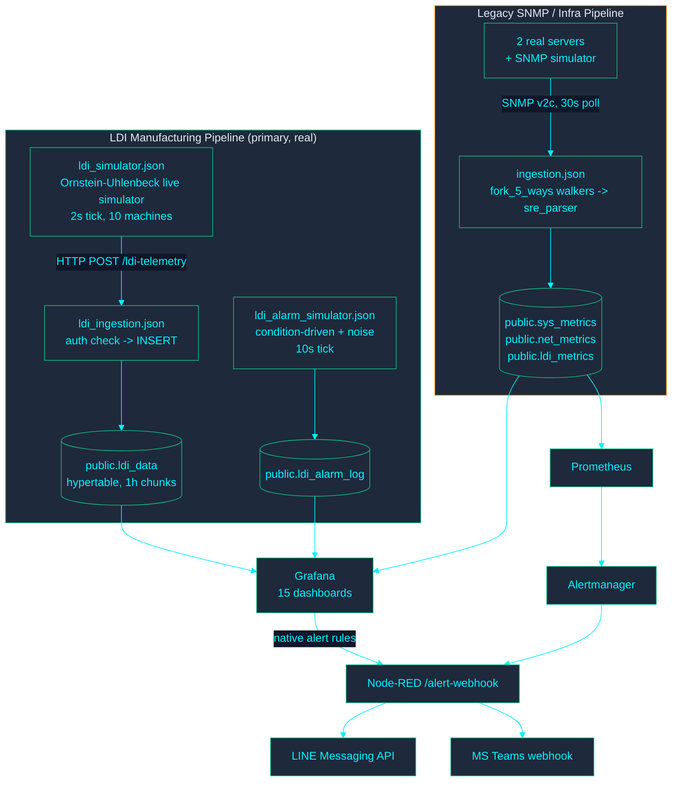

# สถาปัตยกรรมระบบ IMS (IMS System Architecture)

> แหล่งอ้างอิงข้อมูลหลัก (Single source of truth) สำหรับโทโพโลยีของระบบ, โฟลว์ข้อมูล, และสถาปัตยกรรมระดับปฏิบัติการ เขียนขึ้นใหม่ในวันที่ 2026-08-05 หลังจากพบว่าเอกสารสถาปัตยกรรมเวอร์ชันก่อนหน้าเป็นเอกสารสองฉบับที่ขัดแย้งกันเองนำมาต่อกัน ซึ่งอธิบายจำนวนแดชบอร์ดและเส้นทางการนำเข้าข้อมูลที่ไม่ตรงกับระบบที่ใช้งานจริงอีกต่อไป (ดู `IMS-SYSTEM-AUDIT-REPORT.md` หน้า 1-2) ข้อมูลทั้งหมดด้านล่างได้รับการตรวจสอบโดยตรงกับระบบที่รันอยู่หรือไฟล์ซอร์สที่มีการติดตาม ไม่ใช่การคัดลอกมาจากเอกสารฉบับก่อนหน้า
>
> **ข้อมูลที่ผ่านการตรวจสอบแล้ว (Verified Claims):** สำหรับล็อกการรันระบบจริง, ผลลัพธ์ของการตั้งค่า, และภาพหน้าจอที่เป็นข้อพิสูจน์สำหรับข้อความด้านล่าง โปรดดูที่ **[ดัชนีหลักฐาน (Evidence Index)](../evidence/INDEX.md)**

---

## บริบทของระบบ (System Context)

IMS เป็น Docker Compose stack ที่มี **ไปป์ไลน์เทเลเมทรี 2 ชุดที่ทำงานแยกจากกัน** ซึ่งส่งข้อมูลไปยัง TimescaleDB ฐานข้อมูลเดียวที่ใช้งานร่วมกัน แสดงผลผ่าน **Grafana แดชบอร์ด 15 ตัว** พร้อมการแจ้งเตือนผ่านทั้งระบบแจ้งเตือนดั้งเดิมของ Grafana และ Prometheus/Alertmanager

**ทำไมถึงมีไปป์ไลน์สองชุด:** ไปป์ไลน์ SNMP แบบดั้งเดิม (`ingestion.json`) คือการออกแบบดั้งเดิมของระบบ — คือการดึงข้อมูลจากอุปกรณ์ที่สื่อสารด้วย SNMP, แปลงข้อมูลผ่าน `sre_parser` แบบเก็บสถานะ, จากนั้น insert ลงใน `sys_metrics`/`net_metrics`/`ldi_metrics` ภายหลังเทเลเมทรีการผลิตของเครื่อง LDI ได้ถูกสร้างเป็นไปป์ไลน์ของตัวเองที่มีความละเอียดสูงกว่า (นำเข้า `ldi_data`, ส่งผ่าน HTTP POST แทน SNMP) เนื่องจากแดชบอร์ดด้านการผลิตต้องการความแม่นยำระดับตัวอย่างในเรื่อง PE/JE/Cpk ซึ่งตาราง `ldi_metrics` ที่ได้จากการจำลองด้วย k6 ไม่ได้ถูกออกแบบมาเพื่อรองรับข้อมูลระดับนี้ **เนื้อหาด้าน LDI/การผลิตของ Grafana แดชบอร์ดทั้ง 15 ตัว อ่านข้อมูลจาก `ldi_data` ไม่ใช่ `ldi_metrics`** ตาราง `ldi_metrics` ยังคงมีอยู่และยังมีการบันทึกข้อมูล (ผ่าน SRE parser ของ `ingestion.json`) แต่พารามิเตอร์บางตัวที่เป็นข้อมูลเฉพาะของเครื่อง LDI (`throughput`, `power_watt`, `vibration`) ได้รับการยืนยันแล้วว่าเป็นพารามิเตอร์ที่ถูกสงวนไว้สำหรับการรวมระบบในอนาคตสำหรับอุปกรณ์ประเภท LDI — ถือเป็นข้อกำหนดและขอบเขตทางเทคนิคของไปป์ไลน์นั้น ไม่ใช่ข้อบกพร่องใน `ldi_data` ดูส่วน "ข้อกำหนดและขอบเขตทางเทคนิค (System Constraints & Technical Boundaries)" ด้านล่าง

---

## รายการคอนเทนเนอร์ (Container Inventory)

| บริการ (Service)    | คอนเทนเนอร์ (Container) | วัตถุประสงค์ (Purpose)                                                                                                                                                                                                                                          |
| ------------------- | ----------------------- | --------------------------------------------------------------------------------------------------------------------------------------------------------------------------------------------------------------------------------------------------------------- |
| `timescaledb`       | `ims-timescaledb`       | PostgreSQL + TimescaleDB — หน่วยเก็บข้อมูลแบบถาวรทั้งหมด                                                                                                                                                                                                        |
| `pgbouncer`         | `ims-pgbouncer`         | Connection pooler แบบโหมด transaction ที่อยู่หน้า TimescaleDB                                                                                                                                                                                                   |
| `node-red`          | `ims-node-red`          | ทำหน้าที่จัดการทั้งสองไปป์ไลน์ของเทเลเมทรี (เครื่องมือจำลอง + การนำเข้าข้อมูล) และโฟลว์การส่งการแจ้งเตือน                                                                                                                                                       |
| `grafana`           | `ims-grafana`           | แดชบอร์ด, กฎการแจ้งเตือนที่เตรียมไว้, การแจ้งเตือนดั้งเดิม ไม่มีโฮสต์พอร์ตเป็นของตัวเอง — เข้าถึงได้ผ่าน `proxy` เท่านั้น (ดูด้านล่าง)                                                                                                                          |
| `proxy`             | `ims-proxy`             | nginx reverse proxy; จุดเข้าถึง (entry point) สู่ Grafana และ `alarm-api` เพียงจุดเดียวที่เปิดให้โฮสต์ ควบคุม `/alarm-api/` ภายใต้การตรวจสอบ `auth_request` กับเซสชันของ Grafana เอง (`proxy/nginx.conf`) — ดู `SECURITY_MODEL.md`                              |
| `alarm-api`         | `ims-alarm-api`         | เส้นทางการเขียนข้อมูลสำหรับ `public.ldi_alarm_lifecycle` (Acknowledge/Resolve, ถูกเรียกใช้จาก `IMS LDI - Alarm Console`) ไม่มีโฮสต์พอร์ต; เข้าถึงได้ผ่าน `proxy` เท่านั้น เชื่อมต่อกับ Postgres ด้วยสิทธิ์ระดับต่ำสุดของบทบาท `alarm_api_writer` (ไมเกรชัน 078) |
| `renderer`          | `ims-grafana-renderer`  | บริการ `grafana-image-renderer` ภายนอก (ส่งออกไฟล์ PNG สำหรับการแจ้งเตือน/รายงาน)                                                                                                                                                                               |
| `prometheus`        | `ims-prometheus`        | ดึงข้อมูล (scrape) exporter ที่เกี่ยวข้องกับ `sys_metrics` และตรวจสอบความสมบูรณ์ของ Node-RED; ประเมินกฎการแจ้งเตือนของตนเอง                                                                                                                                     |
| `alertmanager`      | `ims-alertmanager`      | กำหนดเส้นทางการแจ้งเตือนของ Prometheus ไปยัง `/alert-webhook` ของ Node-RED                                                                                                                                                                                      |
| `blackbox-exporter` | (blackbox)              | โพรบตรวจจับ HTTP/TCP/ICMP สำหรับการตรวจสอบ SLA                                                                                                                                                                                                                  |
| `snmpsim`           | (snmpsim)               | Agent สำหรับจำลอง SNMP เพื่อการพัฒนา/ทดสอบเป้าหมายของไปป์ไลน์ดั้งเดิม                                                                                                                                                                                           |
| `db-migrate`        | `ims-db-migrate`        | ตัวรันไมเกรชันแบบครั้งเดียวจบ (`scripts/migrate-entrypoint.sh`), ควบคุมการเริ่มต้นทำงานของ `node-red` และ `alarm-api`                                                                                                                                           |

บริการสำหรับใช้งานภายในเท่านั้น (PgBouncer, ตัวจำลอง SNMP, blackbox exporter, Grafana, alarm-api) จะไม่เปิดเผยสู่โฮสต์โดยตรง; มีเพียง `proxy` (3000, เป็นด้านหน้าของทั้ง Grafana และ alarm-api), Node-RED (1880), Prometheus (9090), และ Alertmanager (127.0.0.1:9093, เฉพาะลูปแบ็กเท่านั้น) ที่ทำการพอร์ตเอาไว้

---

## ไปป์ไลน์การผลิต LDI (LDI Manufacturing Pipeline) (ไปป์ไลน์ที่ทุกแดชบอร์ดใช้งานจริง)

1. **`ldi_simulator.json`** (แท็บ "LDI Live Simulator") รันกระบวนการ Orstein-Uhlenbeck แบบ mean-reverting ต่อหนึ่งเครื่อง (เครื่อง LDI จำลอง 10 เครื่อง ครอบคลุม 3 กระบวนการ: DF INNER, DF OUTER, SM) บนความถี่ 2 วินาที, และส่งข้อมูลเป็นชุดผ่าน HTTP POST ไปยัง `/ldi-telemetry`
2. **`ldi_ingestion.json`** (แท็บ "IMS LDI Ingestion") รับข้อมูลจาก POST, ตรวจสอบ `x-api-key` header เทียบกับ `INGEST_API_KEY`, และทำการ insert ลงใน `public.ldi_data`
3. **`ldi_alarm_simulator.json`** (แท็บ "LDI Alarm Simulator") รันบนความถี่ 10 วินาที รหัสสัญญาณเตือน (Alarm codes) ที่ทราบว่ามีความเชื่อมโยงกับพารามิเตอร์ในโลกจริง (ความร้อน/ความชื้น, ข้อผิดพลาดจากการจับคู่ตำแหน่ง PE/JE, ความเร็วในการสแกน) จะถูกขับเคลื่อนโดยเงื่อนไข — มันจะแจ้งเตือนเมื่อเทเลเมทรีใหม่ที่อ่านได้มีค่าอยู่นอกช่วงที่กำหนด (out of spec) ตามเงื่อนไขการตรวจสอบ RCA แบบเดียวกับเกณฑ์ใน `v_ldi_alarm_context` (ไมเกรชัน 045) รหัสที่ไม่มีความเชื่อมโยงกับพารามิเตอร์ (ข้อผิดพลาดจากการปรับเทียบ, ข้อผิดพลาดจากอุปกรณ์สร้างภาพ, ฯลฯ) จะถูกดึงมาจากพูลของสัญญาณรบกวนที่มีการสุ่มแบบถ่วงน้ำหนัก เพื่อให้ตรงกับความถี่ที่เกิดขึ้นจริงในประวัติ เครื่องหมาย `VACUUM` (รหัสสัญญาณเตือน `91009`) ถูกตั้งใจให้เป็นเพียงสัญญาณรบกวนเท่านั้น: ค่า `air_vacuum` ซึ่งเป็นค่าคงที่ในแต่ละสูตรการผลิต (recipe) ของทุกเครื่องนั้น ตั้งอยู่นอกช่วงการเตือน (out of spec) ใน `flag_vac_out_of_spec` อยู่แล้วไม่ว่าจะเวลาใด ดังนั้นกลยุทธ์เวลาการแจ้งเตือนใด ๆ ไม่สามารถสร้างสัญญาณสหสัมพันธ์จริงขึ้นมาได้ — มันเป็นความไม่ตรงกันระหว่างค่าขีดจำกัด/สูตรการผลิต ไม่ใช่สิ่งที่จำลองการซ่อมแซมขึ้นมาได้
4. ทั้งสองระบบป้อนข้อมูลให้ `public.ldi_data` / `public.ldi_alarm_log` ซึ่ง Grafana แดชบอร์ดในกลุ่ม LDI ทั้งหมด และแผงวิเคราะห์ RCA Truth Test อาศัยข้อมูลจากแหล่งเหล่านี้

สำหรับ **Yield (ผลผลิต)** นั้น มีแหล่งข้อมูลอ้างอิงหลัก (Single Source of Truth): ฟังก์ชัน `public.f_ldi_yield_pct()` (ไมเกรชัน 046) — กรณีที่เลวร้ายที่สุดระหว่างอัตราการผ่าน PE (PE-pass-rate) และอัตราการผ่าน JE (JE-pass-rate) เมื่อเทียบกับค่า `pe_setting`/`je_setting` ของแต่ละแถว (ไม่ใช่ค่ามาตรฐานตายตัว) แดชบอร์ด NOC Overview และแดชบอร์ดการผลิตทั้งคู่ต่างเรียกใช้งานฟังก์ชันเดียวกันนี้ ดังนั้นในเชิงโครงสร้างแล้วตัวเลขจะไม่เกิดความขัดแย้งกัน

**Cpk**, สูตรคำนวณความสามารถของกระบวนการ (`LEAST((limit-mean)/(3*sigma), (mean+limit)/(3*sigma))`, sample stddev), ถูกสร้างขึ้นแยกเป็นเอกเทศใน 5 จุดด้วยกัน (แผงแดชบอร์ด 3 แผง + `v_machine_spc_fleet` + `v_machine_spc_ranking`) แทนที่จะเป็นการแชร์สูตรร่วมกัน — `tests/e2e/golden-dataset-spc.js` นำชุดข้อมูลสังเคราะห์ที่คำนวณด้วยมือเข้าสู่ฟังก์ชันทั้ง 5 และยืนยันว่าผลลัพธ์นั้นตรงกัน เพื่อเป็นด่านตรวจสอบของ CI (CI Gate) ป้องกันไม่ให้เกิดปัญหาความคลาดเคลื่อนซ้ำอีก

---

## ไปป์ไลน์โครงสร้างพื้นฐาน / SNMP แบบดั้งเดิม (Legacy SNMP / Infrastructure Pipeline)

`ingestion.json` (แท็บ "IMS Ingestion Pipeline") จะทำการร้องขอข้อมูล (poll) จากอุปกรณ์ที่ลงทะเบียนผ่านโปรโตคอล SNMP v2c ในทุก 30 วินาที:

- รายการอุปกรณ์ถูกโหลดจาก `public.devices` เข้าไปอยู่ใน `global.deviceRegistry` (รีเฟรชทุก 5 นาที)
- `fork_5_ways` ทำหน้าที่แยกการดึงข้อมูลแบบคู่ขนาน (CPU, Storage, Network, Temperature, LDI) สำหรับแต่ละอุปกรณ์คู่ขนานกัน
- `sre_parser` ("SRE AIOps Parser v9 Batch") คอยรักษาสถานะของแต่ละอุปกรณ์ในบริบทการทำงาน, พักการเก็บข้อมูลแบบแถว, และการเพิ่มข้อมูลเป็นรอบ ๆ เข้าสู่ `sys_metrics` / `net_metrics` / `ldi_metrics` เป็นอิสระแยกในแต่ละตาราง (ความล้มเหลวเพียงบางส่วนของตัวรับข้อมูล จะไม่หยุดข้อมูลอื่นที่ไม่เกี่ยวข้อง)
- ตัวจำลองโหลดข้อมูลสังเคราะห์สไตล์ k6 (`inject_fleet` -> `generate_fleet_targets` -> `pace_limiter` -> โครงสร้างไปป์ไลน์/parser เดียวกัน) ก็คอยป้อนข้อมูลไปป์ไลน์ตัวนี้เพื่อวัตถุประสงค์ในการจำลองการทดสอบการรับโหลด

ไปป์ไลน์ชุดนี้เป็นตัวผลักดันแผงแดชบอร์ดโครงสร้างพื้นฐานบน NOC Overview อย่างแท้จริง (ข้อมูล CPU/RAM/Disk/Temperature สำหรับเซิร์ฟเวอร์จริง 2 เครื่องคือ `ERP-MASTER-UBUNTU` / `ERP-MASTER-WINDOWS`) รวมถึงแดชบอร์ด AIOps & Capacity Forecast ข้อมูลชุดนี้ **ไม่ใช่** แหล่งที่คอยป้อนกระบวนการ LDI / แผงควบคุมคุณภาพ — ดูการแยกส่วนไปป์ไลน์ที่ด้านบน

---

## สคีมาของฐานข้อมูล (Database Schema) (ข้อมูล ณ ไมเกรชัน 047)

> จำนวนคอลัมน์และรายการของ view/materialized-view/CAGG รวมถึงจำนวนของไมเกรชันที่มีการปรับใช้ทั้งหมดนั้นถูกสร้างขึ้นมาใหม่โดยอัตโนมัติ ใน **[DATABASE_SCHEMA.md](DATABASE_SCHEMA.md)** (`node scripts/generate-schema-inventory.js`, ผ่านการตรวจสอบผ่านระบบ CI ที่เชื่อมกับฐานข้อมูลจริงแล้ว) ตารางข้อมูลนี้จะช่วยให้คำตอบถึงหลักการหรือเหตุผล ว่าสิ่งนี้ไปป้อนกับตารางอะไร ทำไปเพื่อจุดประสงค์อะไร — เป็นสิ่งที่ตัวสร้างสคีมาแบบออโต้ไม่สามารถสรุปได้จาก `information_schema` เพียงอย่างเดียว

| ตาราง (Table)                                 | ประเภท (Type)                  | รับข้อมูลจาก (Fed by)               | วัตถุประสงค์ (Purpose)                                                                                                                                                                                                     |
| --------------------------------------------- | ------------------------------ | ----------------------------------- | -------------------------------------------------------------------------------------------------------------------------------------------------------------------------------------------------------------------------- |
| `devices`                                     | Table                          | manual/seed                         | ที่เก็บข้อมูลของทุกเอนทิตีที่ถูกตรวจสอบ (`device_type`: `ldi` หรือ `server`)                                                                                                                                               |
| `ldi_data`                                    | Hypertable, ขนาดก้อน 1 ชั่วโมง | `ldi_ingestion.json`                | เทเลเมทรีการประมวลผล LDI จริง — ตัวบ่งชี้ความเร็วในการสแกน, อุณหภูมิ, ความชื้น, สุญญากาศ, และค่าความเบี่ยงเบน PE/JE ซึ่งมาเป็นรายละเอียดรายตัวอย่าง (per-sample) ถือเป็นจุดกำเนิดแหล่งข้อมูลสำหรับทุกแผงแดชบอร์ดควบคุม LDI |
| `ldi_alarm_log`                               | Hypertable, ขนาดก้อน 7 วัน     | `ldi_alarm_simulator.json`          | แถวข้อมูลรายเหตุการณ์ที่เกิดขึ้นจากการแจ้งเตือน โดยเชื่อมโยงกับเงื่อนไขนับตั้งแต่ช่วงเวลาที่มีการแก้ไขระบบจำลอง (simulator fix)                                                                                            |
| `ldi_alarm_ms_code`                           | Table                          | ไมเกรชัน 036 (mock seed)            | แหล่งอ้างอิงรหัสสัญญาณเตือนหลัก (ผลิตรหัสการปฏิบัติจริง 20 รหัส, อธิบายถึงการทำงานเท่านั้น — ไม่ใช่แคตตาล็อกคู่มือผู้จัดจำหน่าย)                                                                                           |
| `sys_metrics` / `net_metrics` / `ldi_metrics` | Hypertables, ขนาดก้อน 1 วัน    | `ingestion.json` (ไปป์ไลน์ดั้งเดิม) | เทเลเมทรีของโครงสร้างพื้นฐาน + ตารางการชี้วัดที่จำลองจาก k6 โดยมีข้อกำหนดและขอบเขตทางเทคนิค (ดูด้านล่าง)                                                                                                                  |
| `schema_migrations`                           | Table                          | `scripts/migrate-entrypoint.sh`     | ติดตามความคืบหน้าของไมเกรชัน — `(version, filename, applied_at)`, ไม่ได้มีคอลัมน์ `checksum` ตามรูปแบบของตัวหลักดั้งเดิม (canonical shape)                                                                                 |

**Views ที่ควรรู้จัก:** `v_ldi_alarm_context` (ไมเกรชัน 045, นำสัญญาณเตือนมาเชื่อมอ้างอิงเข้ากับการอ่านเทเลเมทรีในขอบเขตเวลา 5 นาทีก่อนหน้านั้น — ซึ่งเป็นไปตามแนวทางความสอดคล้องกันกับการประเมินของ RCA Truth Test), `v_machine_spc_fleet` / `v_machine_spc_ranking` (สำหรับตัว Cpk ทั้งในขอบเขตเครือข่ายและกลุ่มที่เลือกสรร), `v_fleet_health` / `v_fleet_score` (ไมเกรชัน 047 ซึ่งปรับไปประยุกต์ใช้เพียงแค่กับ `device_type='server'` เท่านั้น — ก่อนหน้านี้ได้รวบแถวที่เป็นค่าศูนย์โดยถาวรของเครื่อง LDI รวมอยู่ด้วย นำไปสู่การลดทอนของคะแนนด้านสุขภาพของระบบโครงสร้างพื้นฐาน)

---

## การกำกับดูแลการทำไมเกรชัน (Migration Governance)

**ตัวรันการทำไมเกรชันฉบับสมบูรณ์มีเพียงตัวเดียวเท่านั้น (One canonical migration runner)**: `scripts/migrate-entrypoint.sh` บริการ Docker Compose รูปแบบ `db-migrate` ทำหน้าที่ขับเคลื่อนโปรแกรมให้ออกมาทำงานได้เลยเพียงทีเดียวแบบลัดวงจรการเริ่มต้น (โดยขึ้นอยู่กับคุณสมบัติของ `node-red` ตรงที่เป็นเงื่อนไขของ `db-migrate: condition: service_completed_successfully`); `scripts/migrate.sh` เป็นโปรแกรมครอบตัวบางเบา (`docker compose run --rm db-migrate`) เพื่อใช้สำหรับการรันสั่งใหม่แบบวิธีจัดการด้วยมือทั้งหมดโดยไม่ต้องบูทการทำงานทั้งสแต็กการจัดเก็บ

ก่อนหน้านี้โค้ดโปรเจ็กต์นี้เคยมีระบบจัดการการไมเกรตแบบทำงานแยกอิสระจากกันและกันจำนวน 3 ชุด ด้วยรูปแบบวิธีการติดตามสถานะที่มีความต่างกันไป (`migrate.sh` มีลูปของมันเอง ควบคู่กับคอลัมน์ `checksum` ซึ่งไม่ได้เอาไปใช้งานไหน, `migrate-entrypoint.sh` กลับไม่มีลูปแบบนั้นเลย, และ `init-migrations.sh` ก็ยังไม่ได้มีตารางติดตามใด ๆ เลย การวินิจฉัยของชุดนี้มีจากการพิจารณาข้อความผิดพลาดที่เจอเอาเองล้วน ๆ) — ไม่ว่าอันไหนรันลงฐานข้อมูลได้ก่อน ก็จะเป็นฝ่ายกำหนดรูปแบบคอลัมน์ของ `schema_migrations` ฐานข้อมูลนั้นโดยอัตโนมัติอย่างไร้ร่องรอย นี่เองคือจุดกำเนิดปัญหาต้นตอ (root cause) นำมาซึ่งความผันผวนของการติดตามที่ได้รับการคอนเฟิร์มแล้วในเหตุการณ์หนึ่ง (ในไมเกรชัน 038 ที่เจอรันระบบผ่านแล้วทว่าช่องบรรทัดติดตามยังขึ้นสถานะไม่ได้มาร์ค) สำหรับโปรแกรม `init-migrations.sh` ก็โดนลบทิ้งเรียบร้อยไปแล้ว; ปัจจุบันมีตัวดำเนินการรันหนึ่งเดียวร่วมกับตารางข้อมูลหนึ่งฉบับ

ไมเกรชันทั้งหมดควรมีคุณสมบัติ Idempotent (เช่น การใช้เงื่อนไข `CREATE ... IF NOT EXISTS` และคำสั่งป้องกันอย่าง `DO $$ ... IF EXISTS ...` สำหรับการตรวจสอบกรณีเปลี่ยนชื่อ ฯลฯ) เพื่อให้แน่ใจว่าการดำเนินการซ้ำบนฐานข้อมูลที่ได้รับการไมเกรตแล้ว จะเป็นไปอย่างปลอดภัยและไม่มีผลกระทบต่อข้อมูลเดิม (safe no-op) **ตัวอย่างที่ควรระวังคือ ไมเกรชัน 020**: ในตอนแรกมีการออกแบบให้ลบตารางโดยไม่มีเงื่อนไขป้องกัน (`DROP TABLE ldi_data CASCADE`) ซึ่งไม่เป็นปัญหาในขั้นตอนการพัฒนาหากยังไม่มีข้อมูลจริง แต่มีรายงานว่าถูกนำไปรันบนฐานข้อมูลที่มีข้อมูลจริงกว่า 2.8 แสนแถว ภายหลังจึงต้องแก้ไขโค้ดให้สร้างตารางใหม่เฉพาะเมื่อไม่มีตารางอยู่ หรือปรับปรุงโค้ดเฉพาะจุด แทนการลบตารางโดยพลการ

ไมเกรชัน 048 ดำเนินการต่อจากไมเกรชัน 020 จนเสร็จสมบูรณ์: ทำการเปลี่ยนประเภทคอลัมน์ของ `ldi_data` จาก `DOUBLE PRECISION` เป็น `REAL` ซึ่งระบบจะทำงานได้อย่างราบรื่นหากข้อมูลถูกบีบอัดอยู่ กระบวนการนี้รวมถึงการคลายการบีบอัด, ลบและสร้าง Continuous Aggregates ใหม่ทั้งหมด (`ldi_data_1m` → `15m` → `1h` และ `ldi_data_hourly`) ครอบคลุม views ปกติ 7 จุดที่เชื่อมโยงกัน, ทำการเปลี่ยนประเภทคอลัมน์, และอัปเดตข้อมูล CAGG ทั้งหมดใหม่ นอกจากนี้ยังมีการเพิ่มเงื่อนไขตรวจสอบเพื่อข้ามกระบวนการนี้หากคอลัมน์ถูกเปลี่ยนเป็น `REAL` แล้ว (เช่น กรณีสร้างฐานข้อมูลใหม่ทั้งหมดผ่านสคริปต์ `postgres/init/001`) สำหรับไมเกรชัน 049 ได้ลบตารางที่ไม่ได้ใช้งานแล้วอย่าง `alert_rules`/`alert_history` (ดูเพิ่มเติมใน "ช่องโหว่ที่ทราบแล้ว") และไมเกรชัน 050 ได้นำข้อมูล RCA Lift/Confidence เข้าสู่ view หลักที่ใช้งานจริง คือ `v_ldi_rca_recent_window`

ไมเกรชัน 064 ได้เปลี่ยน `v_machine_spc_fleet` และ `v_ldi_rca_recent_window` จาก views ธรรมดาให้เป็น Materialized views (โดยยังคงใช้ชื่อและโครงสร้างคอลัมน์เดิม จึงไม่ต้องแก้ไขการคิวรีข้อมูลบนแดชบอร์ด) พร้อมตั้งค่าให้อัปเดตอัตโนมัติทุก 60 วินาที ผ่านฟังก์ชัน job scheduler มาตรฐานของ TimescaleDB อย่าง `add_job` (เนื่องจากระบบปัจจุบันไม่ได้ติดตั้งปลั๊กอิน `pg_cron` จึงเลือกใช้ความสามารถนี้แทน) นอกจากนี้ยังได้แยก CTE ลอจิกออกจาก Engineering Analytics "RCA Truth Test" มาสร้างเป็น Materialized view ใหม่ชื่อ `v_ldi_rca_truth_test` ซึ่งจุดนี้จำเป็นต้องปรับปรุงโค้ด SQL บนแดชบอร์ดใหม่ (เปลี่ยนเป็น `SELECT ... FROM v_ldi_rca_truth_test` แทนการประมวลผล CTE ทุกครั้ง) การเปลี่ยนแปลงทั้งสองนี้ได้รับการตรวจสอบประสิทธิภาพผ่าน `EXPLAIN ANALYZE` อย่างชัดเจน: พบว่าความหน่วง (Query latency) ระดับ P95 ของ LDI ลดลงอย่างมีนัยสำคัญจาก 60.12ms เหลือเพียง 5.30ms

---

## การแจ้งเตือน (Alerting)

ระบบแจ้งเตือนมี 2 เอนจินที่ประเมินผลแยกจากกัน ก่อนที่ข้อมูลจะถูกส่งมารวมกันที่โฟลว์จัดการการแจ้งเตือนใน Node-RED:

1. **ระบบการแจ้งเตือนดั้งเดิมของ Grafana (Grafana native alerting)** (`monitoring/grafana/provisioning/alerting/*.yml`) — กฎการแจ้งเตือนเฉพาะสำหรับ LDI (เช่น การแจ้งเตือนของเครื่องในฐานข้อมูล, ขีดความสามารถกระบวนการต่ำกว่า 1.33, การสั่นสะเทือนระดับวิกฤต, ความผิดปกติของ Z-score) จะถูกประเมินโดยตรงกับ TimescaleDB ผ่านตัวตั้งเวลาของ Grafana เอง
2. **Prometheus + Alertmanager** — กฎที่เน้นโครงสร้างพื้นฐาน (เกณฑ์ CPU/RAM/ดิสก์/อุณหภูมิ, การลดลงของบริการ, สถานะดาวน์ของอินเตอร์เฟส) ซึ่งจะถูกประเมินโดย Prometheus และถูกจัดการเส้นทางโดย Alertmanager (`monitoring/alertmanager/alertmanager.yml`) ผ่านการจัดกลุ่มตามความรุนแรงและกฎการยับยั้ง (ระดับ critical จะระงับระดับ warning สำหรับอุปกรณ์ตัวเดียวกัน)

**ทั้งสองเส้นทางมุ่งประสานเข้าสู่เป้าหมาย `nodered_data/flows/alerting.json` แบบร่วมกัน** (ในแท็บ "IMS Alerting Pipeline") ซึ่งทำหน้าคอยรับ webhook จาก Alertmanager ที่ `POST /alert-webhook`, โดยเตรียมจัดรูปแบบการแจ้งเตือน, และกระจายตัวส่งต่อไปยัง:

- **LINE Messaging API** (ขีดเส้นใต้ว่าไม่ใช่ LINE Notify — เพราะ API นั้นถูกยกเลิกโดย LINE ไปแล้วในปี 2025 และไม่ได้ใช้ในที่นี้) ผ่าน `LINE_CHANNEL_ACCESS_TOKEN` + `LINE_USER_ID`
- **MS Teams** ส่งผ่านเข้าไปทางรหัส `TEAMS_WEBHOOK_URL`, ในรูปแบบ Adaptive Card

หากข้อมูลข้อมูลประจำตัวใดยังไม่ได้ถูกตั้งค่า (unset) ฟังก์ชันการนำส่งที่สอดคล้องกันนั้นจะเรียก `node.error()` (ซึ่งมองเห็นได้ในโหนดแก้ไขข้อบกพร่อง "Alert Delivery Failure" ของโฟลว์และผ่านตัวบ่งชี้สถานะสีแดงถาวรบนโหนดเอง) แทนที่จะลบการแจ้งเตือนแบบเงียบ ๆ — แต่การส่งมอบจะไม่เกิดขึ้นจนกว่าข้อมูลรับรองจริงจะถูกกำหนดค่าใน `.env` ส่วนในอีกช่องทางของ Grafana เองในส่วนเส้นทาง `ims-slack-critical` ก็ยังถูกกำหนดให้โอนการส่งผ่านมาที่ตัว webhook นี้เช่นเดียวกัน; ซึ่งก่อนหน้านี้มีการกำหนดให้ส่งตรงไปที่ slack ซึ่งชี้ไปที่ URL แทนที่ได้ถูกนำออกไปแล้วเพื่อไม่ให้เกิดความล้มเหลวซ้ำซากกับทุกๆ การแจ้งเตือนระดับวิกฤต

---

## รายการแดชบอร์ด (Dashboard Inventory)

> จำนวนแผงควบคุมและคำอธิบายถูกสร้างขึ้นโดยอัตโนมัติใน **[DASHBOARD_INVENTORY.md](DASHBOARD_INVENTORY.md)** (`node scripts/generate-dashboard-inventory.js`, ผ่านการตรวจสอบจากระบบ CI แล้ว) ตารางนี้เพิ่มข้อมูลเกี่ยวกับ "เหตุผล" ในเชิงสถาปัตยกรรม -- ขอบเขตของการอ้างอิงไขว้ -- ซึ่งโปรแกรมสร้างข้อมูลไม่สามารถอนุมานจากไฟล์ JSON เพียงอย่างเดียวได้; คอลัมน์ UID/Title ในที่นี้ต้องสอดคล้องกับไฟล์ที่สร้างขึ้นเมื่อมีการเพิ่มหรือเปลี่ยนชื่อแดชบอร์ด

| UID                             | ชื่อไตเติ้ล (Title)                    | ขอบเขตหน้าที่ (Scope)                                                                                                                                                                                                                          |
| ------------------------------- | -------------------------------------- | ---------------------------------------------------------------------------------------------------------------------------------------------------------------------------------------------------------------------------------------------- |
| `ims-noc-overview`              | IMS NOC Overview                       | เฉพาะโครงสร้างพื้นฐาน (เซิร์ฟเวอร์จริง 2 เครื่อง + เครือข่าย) — เนื้อหาด้านกระบวนการผลิตของ LDI จะแยกไปอยู่ที่อื่น ดูด้านล่าง                                                                                                                  |
| `ims-ldi-manufacturing`         | IMS LDI - Manufacturing Command Center | แดชบอร์ด RCA เต็มรูปแบบ 4 เลเยอร์: KPI ระดับบริหาร, เทเลเมทรีเครื่องจักร, บริบทการผลิต, สตรีมของสัญญาณเตือน                                                                                                                                    |
| `ims-ldi-operator-andon`        | IMS LDI - Operator Andon Board         | หน้าจอบนตู้คีออสก์บริเวณพื้นที่การผลิต, 1280x720 แสดงผลพอดีหน้าจอโดยไม่ต้องเลื่อน (no-scroll)                                                                                                                                                      |
| `ims-ldi-engineering-analytics` | IMS LDI - Engineering Analytics & SPC  | อันดับ Cpk/SPC, RCA Truth Test, การกระจาย PE/JE                                                                                                                                                                                                |
| `ims-ldi-machine-snapshot`      | IMS LDI - Machine Snapshot             | ตรวจสอบเจาะลึกรายเหตุการณ์ (คลิกสัญญาณเตือน/บันทึกเพื่อตรวจสอบ)                                                                                                                                                                                |
| `ldi-data-readiness`            | LDI Data Readiness & Integration Gaps  | แดชบอร์ดตรวจสอบคุณภาพข้อมูลด้วยตนเอง (ความซ้ำซ้อนของ board-key, % ความครอบคลุม, อัตราความตรงกันของ alarm-master)                                                                                                                               |
| `ims-easy-overview`             | IMS Easy Overview                      | ภาพรวมระดับกองทัพแบบพริบตาเดียว ปราศจากการตั้งค่าใดๆ ซึ่งสร้างจาก view/function ที่ใช้ร่วมกันทั้งหมด (`v_ldi_machine_latest_full`, `v_ldi_alarm_context`, `f_ldi_yield_pct`, `v_machine_spc_fleet`) -- โดยไม่มีตัวแปรของเทมเพลตที่ต้องกำหนดค่า |
| `ims-engineering`               | IMS Engineering Drill-Down             | เน้นไปที่โครงสร้างพื้นฐาน (Infra-focused): CPU/RAM/ดิสก์จัดเก็บ/เครือข่ายต่อหนึ่งเซิร์ฟเวอร์, ปริมาณงานการผลิตของ LDI/คุณภาพ (ไปป์ไลน์ดั้งเดิม)                                                                                                |
| `ims-capacity`                  | IMS AIOps & Capacity Forecast          | พยากรณ์เส้นจำนวนวันที่คาดหมายให้แตะจนจะสุดลิมิตเพดานบรรจุระดับค่าอิ่มตัวแบบ regression (ทาง infra)                                                                                                                                             |
| `ims-meta-monitoring`           | IMS Pipeline Health & Meta-Monitoring  | สุขภาพของตัวรับส่งข้อมูลไปป์ไลน์เอง (แถวบันทึก/วินาที, อัตราความสำเร็จของชุดรวม, ความลึกของคิวทดลองใหม่)                                                                                                                                       |

NOC Overview ถูกแยกเนื้อหาออกจาก LDI/กระบวนการประกอบการผลิต ในรอบเวลานี้ (ซึ่งก่อนหน้านี้ทำสำเนาข้อมูลแผง Yield วางซ้อนกันกับ Manufacturing) — ตอนนี้โครงสร้างพื้นฐานและเนื้อหาการผลิตถูกแยกการนำเสนอบนแดชบอร์ดที่ต่างกันโดยเจตนา ไม่ได้รวมเป็น "ภาพรวม" แดชบอร์ดเดียวอีกต่อไป

---

## ข้อกำหนดและขอบเขตทางเทคนิค (System Constraints & Technical Boundaries)

- **พารามิเตอร์ `ldi_metrics.throughput` / `.power_watt` / `.vibration` เป็นพารามิเตอร์ที่ถูกสงวนไว้สำหรับการรวมระบบในอนาคตสำหรับอุปกรณ์ประเภท LDI ทุกหน่วย** (ยืนยันว่าข้อมูลชุดนี้ครอบคลุมแถวประมวลผลแล้วกว่า ~2,300+ แถวข้อมูลจากเครื่องทั้งหมด 10 เครื่อง) ไปป์ไลน์นำเข้าข้อมูลจำลองจาก k6 ไม่ได้ถูกตั้งค่ามาให้สร้างข้อมูลสำหรับอุปกรณ์ LDI กฎการแจ้งเตือน `ims-ldi-vibration-critical` จึงถูกสั่งหยุดการใช้งานชั่วคราวไว้ด้วยเหตุผลนี้ สิ่งนี้ **ไม่** ส่งผลกระทบต่อแดชบอร์ดใดๆ ที่อ่านจาก `ldi_data` (ท่อรับข้อมูลจริง) — มีเฉพาะตัวตาราง `ldi_metrics` รุ่นเดิม และตัวระบบใดๆ ที่เข้าสืบค้นคำถามโดยตรงเท่านั้นที่ได้รับผลกระทบ
- **การทำซ้ำของ Board-key บน LDI-01/LDI-04** (คือมี `(mo, board_no)` 157 / 121 คู่ที่ซ้ำกันตามลำดับ, ในขณะที่อีก 8 เครื่องอื่นๆ มีค่าเป็น 0) มีสาเหตุหลักมาจาก: การชนกันของข้อความ `MO-NNNNN` แบบสุ่มข้ามวงจรการทำงานที่แยกจากกัน (birthday paradox ซึ่งมีเพียงค่าประมาณ 90,000 ค่าที่เป็นไปได้ในรหัส 5 หลัก และมีการดึงค่าตัวเลขจาก 175 ถึง 257 ครั้งต่อเครื่องตามประวัติของชุดข้อมูล) — มันไม่ได้เป็นบอร์ดที่ถูกนับซ้ำแต่อย่างใด ขอบเขตหมายเลขรหัสถูกขยายให้กว้างขึ้นถึง 10 เท่า (เป็น 6 หลัก) ในทั้งตัวการจำลองการทำงานจริง และตัวสร้างแบทช์ประวัติศาสตร์ เพื่อทำให้โอกาสที่จะเกิดขึ้นอีกในอนาคตลดน้อยลง
- **การแจ้งเตือนจริงส่งถึงระบบ (LINE/Teams) ต้องการข้อมูลประจำตัวที่ repo นี้ไม่สามารถจัดส่งมาให้ได้** — รหัสเหล่านี้ได้แก่ `LINE_CHANNEL_ACCESS_TOKEN`, `LINE_USER_ID`, `TEAMS_WEBHOOK_URL` ในค่า `.env` ล้วนถูกปล่อยให้เป็นค่าว่างโดยปริยาย ไปป์ไลน์นี้ได้รับการพิสูจน์แล้วว่ามีความถูกต้องตั้งแต่ต้นจนจบ และส่งสัญญาณเมื่อล้มเหลวด้วย (`node.error()` + ป้ายแจ้งสถานะสีแดงสว่างต่อเนื่อง), แต่มันยังไม่สามารถไปถึงผู้คนรับได้จริงๆ จนกว่าข้อมูลยืนยันตัวตนของจริงจะถูกติดตั้งเข้าไปใน `.env`
- **การแก้ไขสหสัมพันธ์ RCA สำหรับ VACUUM (91009) (2026-08-07)** ก่อนหน้านี้ประเด็นนี้ถูกคัดออกเนื่องจากความไม่สอดคล้องกันเชิงโครงสร้าง ขีดจำกัดนอกเกณฑ์ (out-of-spec limits) ได้ถูกกำหนดใหม่สำหรับสูตร DF INNER (`air_vacuum > -8 OR < -30`, ในไมเกรชัน 057 — อ้างอิงจากแบบจำลอง ไม่ใช่จากผู้ผลิต) สำหรับกระบวนการ DF OUTER/SM ได้ปรับให้ส่งค่า `NULL` แทน `0.0` ซึ่งเดิมตีความว่า "ไม่สามารถใช้งานได้" (ไมเกรชัน 054, และนำประวัติกลับมาในไมเกรชัน 060) นอกจากนี้ได้ปรับปรุงเครื่องมือสร้างข้อมูลโทรมาตรจำลอง (Telemetry Generator) ให้เพิ่มอัตราความผิดพลาดที่เกิดขึ้นได้ยาก เพื่อจำลองความสัมพันธ์ของเหตุการณ์ให้สมจริงยิ่งขึ้น (`nodered_data/flows.json` ในส่วน `ldisim_gen`) **ข้อควรระวัง: สถิติ RCA Lift เปลี่ยนแปลงได้ตลอดเวลาในระบบที่ใช้งานจริง (Live system) ตัวเลขในที่นี้จึงไม่ใช่ค่าคงที่** โปรดอ้างอิงวิธีการประมวลผลปัจจุบันและข้อมูลประวัติใน `docs/architecture/LDI_RCA_GUIDE.md` หรือดำเนินการรันคิวรี `SELECT * FROM public.v_ldi_rca_truth_test` เพื่อดึงข้อมูลสถานะล่าสุด
- **MOTION (70004) มีสัญญาณชี้บอกได้เข้มแข็งแต่มันก็ยังสามารถตกขอบเกณฑ์ของความมั่นใจ n≥30 ได้** ในตารางของ `v_ldi_rca_recent_window` (วิวมองของตารางหน้าต่างกลิ้งปฏิบัติการ 24 ชั่วโมง — วิวตารางรันการยืนยันข้อมูลแบบจัดเต็ม `v_ldi_rca_truth_test` ปกติจะมีข้อมูลเหตุการณ์ที่ล้นพอ) — อาการที่สแกนความเร็วแบบคลาดเคลื่อนถูกนำมาตรวจสอบแบบเป๊ะๆ แต่ตามหลักสถิติมันเป็นปรากฎการณ์ที่มีน้อยและหายากกว่าสถิติความร้อน/ความชื้น/ปัญหาความจัดเรียงผิดศูนย์กลาง ในรูปแบบการแยกสูตรปัจจุบัน ไม่ใช่เป็นความบกพร่อง หมวดหมู่ของเหตุขัดข้องจะได้รับสถานะมั่นใจเกรด "OK" ก็ต่อเมื่อมีเหตุการณ์บันทึกสะสมได้มากพอเมื่ออ่านจากช่วงรอบของมุมมองตรงไหนก็ได้ โปรดดูตารางปัจจุบัน ณ หน้า `LDI_RCA_GUIDE.md`
- **ความขัดแย้งของนโยบายการเก็บรักษาข้อมูลระหว่าง `postgres/init/` และ `database/migrations/` (ตรวจสอบเมื่อ 2026-08-10)** — สคริปต์ `postgres/init/001` กำหนดระยะเวลาการเก็บรักษาข้อมูลสำหรับตาราง `sys_metrics`/`net_metrics`/`ldi_metrics` ไว้ที่ 30 วัน ในขณะที่ `database/migrations/016-aggressive-retention.sql` กำหนดไว้เพียง 14 วัน การที่ฐานข้อมูลจริงในปัจจุบันมีนโยบายอยู่ที่ 30 วัน บ่งชี้ว่าระบบนี้ถูกสร้างขึ้นใหม่ทั้งหมด (Fresh install) มากกว่าการอัปเกรดผ่านไมเกรชันตามลำดับ ทำให้ลอจิกในไมเกรชัน 016 ไม่เคยมีผลใช้งานจริง นอกจากนี้ `postgres/init/032` ยังได้กำหนดการเก็บรักษาข้อมูลสำหรับ `ldi_data` ไว้ที่ 180 วัน และ `ldi_alarm_log` ที่ 365 วัน ซึ่งไม่ได้มีไมเกรชันใดใน `database/migrations/` ที่สอดรับกับตัวเลขเหล่านี้ โปรดดูรายละเอียดนโยบายปัจจุบันและความสำคัญได้ใน `docs/architecture/DATA_RETENTION.md` ปัจจุบันประเด็นนี้ยังอยู่ระหว่างการรอแก้ไขเพื่อประสานให้เป็นมาตรฐานเดียวกัน
- **การแก้ไขปัญหาการทดสอบ Golden-dataset SPC (2026-08-12)** — ก่อนหน้านี้กระบวนการทดสอบ `tests/e2e/golden-dataset-spc.js` ไม่สามารถตรวจสอบผลลัพธ์ผ่าน `v_machine_spc_fleet` ได้หลังจากไมเกรชัน 064 เป็นต้นมา เนื่องจากการทดสอบจะแทรกข้อมูลสังเคราะห์ลงในทรานแซกชันที่จะถูกยกเลิก (rollback) ในตอนท้ายเสมอ ในขณะที่ไมเกรชัน 064 ได้เปลี่ยน `v_machine_spc_fleet` เป็น Materialized view ซึ่งไม่สามารถเข้าถึงข้อมูลในทรานแซกชันที่ยังไม่คอมมิตได้ ปัญหานี้ได้รับการแก้ไขโดยการใช้ฟังก์ชันอินไลน์สำหรับการคำนวณ SPC ภายในชุดการทดสอบโดยตรง แทนการคิวรีข้อมูลผ่าน view การใช้คำสั่ง `REFRESH MATERIALIZED VIEW` ในระหว่างการทดสอบถูกปฏิเสธเนื่องจากกระบวนการ Refresh ไม่สามารถมองเห็นข้อมูลที่ยังไม่ได้คอมมิต และหากใช้การคอมมิตจริงจะส่งผลกระทบต่อกฎการรักษาความสะอาดของข้อมูลการทดสอบ ปัจจุบันการทดสอบผ่านเกณฑ์ทั้ง 7 ข้ออย่างสมบูรณ์ โปรดอ้างอิงรายละเอียดเพิ่มเติมที่ `docs/architecture/LDI_SPC_GUIDE.md`
- **ปัญหาการกู้คืนอัตโนมัติของ `ims-timescaledb` ภายใต้นโยบาย `restart: unless-stopped` เมื่อถูกบังคับหยุดด้วย `docker kill` ระหว่างการซ้อมแผนรับมือเหตุฉุกเฉิน (DR Test) (2026-08-10)** — ปัญหานี้ได้รับการยืนยันถึงสองครั้งผ่านการติดตามระบบด้วย `docker events`: ระบบรายงานเพียงเหตุการณ์ `kill`/`die` โดยไม่มีเหตุการณ์ `start` ตามมาเพื่อเริ่มต้นบริการใหม่ แม้ว่าคำสั่ง `docker inspect` จะแสดงว่ามีนโยบายรีสตาร์ทถูกตั้งค่าไว้อย่างถูกต้องก็ตาม สาเหตุที่แท้จริงยังไม่เป็นที่แน่ชัด (คาดว่าอาจเกิดจากความไม่เข้ากันเฉพาะแพลตฟอร์มของ Docker Desktop/WSL2; โดยยังไม่พบปัญหานี้ในสภาพแวดล้อม Linux Production) นอกจากนี้ยังพบปัญหาต่อเนื่องคือ หลังจากดำเนินการเริ่มต้นฐานข้อมูลใหม่ด้วยตนเอง ฟังก์ชันตรวจสอบการเชื่อมต่อ (`ldiDbConnFailureStreak` ซึ่งออกแบบมาเพื่อจัดการสถานการณ์ฐานข้อมูลล่ม) ไม่สามารถสั่งให้ Node-RED รีสตาร์ทตัวเองโดยอัตโนมัติในช่วง 6 นาทีแรก ทำให้ต้องกู้คืนระบบผ่านคำสั่ง `docker restart ims-node-red` ด้วยตนเอง สามารถตรวจสอบหลักฐานการทดสอบ DR ได้ที่ `IMS_MANUFACTURING_PLATFORM_V2.md` (เป้าหมาย Drill 2) ปัญหานี้ยังคงอยู่และถูกจัดเป็นรายการสืบสวนเพิ่มเติมสำหรับการดำเนินการในอนาคต แทนที่จะใช้มาตรการแก้ไขชั่วคราว
- **ขอบเขตเส้นของโดเมนรูปแบบของงานรวมกับคิวจัดรันประกอบในกระบวนผลิตประเภทอื่นๆ ที่จะถูกจัดบรรจุรวมต่อในอนาคตข้างหน้าจะถูกแยกดึงแยกตีกรอบสกัดจัดจดทะเบียนรายงานตัวออกต่างหากในเป้าหมายหน้าฉบับอื่น, ไม่รวมทำทับมารวมรันอยู่ในจุดตัวบรรจุแฟ้มนี้แล้ว** — ลองแง้มส่องดูกติกาตามกรอบของการวางทิศกั้นฉากการแบ่งพรมแดนคั่นร่องระหว่างเส้นสาธารณูปโภค (infrastructure)/กระบวนทางงานการผลิตอุตสาหกรรมในจุดช่องต่อ `docs/architecture/OWNERSHIP.md` ได้เลย (โครงสร้างหน้า `monitoring/grafana/dashboards/{infrastructure,manufacturing}/`, พิกัดที่มีการคุมกฎรักษาทรงสิทธิ์ไว้รองรับด้วยกฎทางฝั่ง `CODEOWNERS`) บวกรวมของเป้าฝั่ง `docs/architecture/MANUFACTURING_DOMAIN.md` เพื่อจะได้เข้าใจรู้ถึงแนวทางวิถีขั้นตอนกลไกของการเข้าเสียบช่องเชื่อมรูปแบบกระบวนการการประกอบสายการผลิตรุ่นต่อมาถัดไปล่วงหน้าอื่นๆ ในอนาคต (พิกัดแบบ AOI, สายชุบทำพื้น, ชุดเลเซอร์รอยกัดลึก, กองทัพสว่านคว้านรูทะลวง) ว่าจะมีคิวจ่อลัดขึ้นเวทีรับการเข้าสวมประสานตัวรันจิ้มเชื่อมขึ้นตัวยังไง โดยแบบปราศจากผลกระทบปะทะเข้าไปกวนแอบเจาะสายสคีมาผังวงทางของด้านขุมพิกัด LDI แดชบอร์ดหรือตัวใดๆเลย ฝั่งระบุตัวโครงของหน้า `docs/architecture/EAP_ARCHITECTURE.md` ถือประทับหน้าที่ประดิษฐ์ขึ้นสกัดวางไว้เป็นป้ายคู่มือกติกาตั้งไว้ให้เป็นอุปกรณ์คู่ควบจุดการประมวลส่งกิฟต์อแดปเตอร์ขุมข้อมูลของจริงแท้ที่มีกันรันตัวทั้งคู่นั้นไปก่อน (ท่อนของ SNMP, ตัวช่องจุดของ HTTP/JSON) พร้อมโยงประกบร่างจุดเชื่อมสัญญากติกาหน้าโหมดของรุ่นจุดเสียบแบบอแดปเตอร์ SECS/GEM ไว้เป็นแนวตัวแทนรอมารับเอาไปทำประยุกต์ใช้ต่อกันได้ ทางหมวดเป้าของตัว `docs/architecture/IMS_MANUFACTURING_PLATFORM_V2.md` ทำหน้าเป็นจุดแสดงศูนย์กลางบัญชาการแผนแพลนวางผังรันคิวตารางหน้าการเปิดโรลเอ้าต์โครงการผูกมัดตีขนาบพร้อมพ่วงรวบร่องรอยชี้ความชัดเจนประจักษ์ครบเป๊ะสกัดหยิบจากแหล่งทั้ง 3 แฝดใบเถานี้นี่แหละ
- **ระดับความรุนแรงของการแจ้งเตือนอ้างอิงจาก ISA-18.2-style แต่ไม่ใช่การปฏิบัติตามมาตรฐานอย่างสมบูรณ์ (ISA-18.2 compliant) (ตรวจสอบเมื่อ 2026-08-10)** — การแบ่งระดับการแจ้งเตือนเป็น 4 ระดับ ได้แก่ Critical/Major/Minor/Warning พร้อมข้อกำหนดเรื่องสีสัญลักษณ์ (`GRAFANA_DESIGN_SYSTEM.md` §2.1) เป็นการนำคำนิยามมาจากมาตรฐาน ISA-18.2 อย่างไรก็ตาม ระบบไม่ได้นำหลักการสำคัญหลายประการมาปรับใช้ ได้แก่: โครงสร้างสถานะของการแจ้งเตือน (Unacknowledged/Acknowledged/Shelved/Suppressed/Out-of-Service), การวิเคราะห์สาเหตุที่เป็นระบบ, และแดชบอร์ดติดตามประสิทธิภาพการแจ้งเตือน (KPIs เช่น อัตราการแจ้งเตือนต่อผู้ปฏิบัติงาน, เปอร์เซ็นต์ของ alarm flood, และการวิเคราะห์ bad actor) ซึ่งทั้งหมดนี้ถือเป็นหัวใจหลักของมาตรฐานดังกล่าว ตาราง `ldi_alarm_log` ปัจจุบันไม่มีคอลัมน์สำหรับบันทึกการ Acknowledge หรือการดำเนินการอื่นๆ นอกจากการบันทึกเหตุการณ์แบบทางเดียว ดังนั้น หากมีการอ้างอิงถึงระบบการแจ้งเตือนในเอกสารใดๆ ควรระบุอย่างชัดเจนว่า "เป็นรูปแบบที่ประยุกต์มาจาก ISA-18.2 (ISA-18.2-style)" และควรหลีกเลี่ยงการใช้คำว่า "ปฏิบัติตามมาตรฐาน (compliant)" อนึ่ง มาตรฐานด้านการแสดงผล **ISA-101** ได้ถูกนำมาประยุกต์ใช้อย่างสมบูรณ์กับแดชบอร์ด Operator Andon Board เพียงอย่างเดียว และไม่ขัดแย้งกับประเด็นเรื่องการแจ้งเตือนนี้

---

## มาตรฐานการกำกับดูแลและ CI Gates (Governance / CI Gates)

5 ป้อมปราการประเมินอัตโนมัติด่านเช็คสอบถูกกะเกณฑ์ติดตั้งไว้เป็นชุดทำงานกางเกราะปัดดักกวาดล้างรันร่อนสแกนผ่านเวทีหน้าการรับมือคิวการรันในวงรอบกั้นระดับชั้นของ CI (`.github/workflows/ci.yml`), ซึ่งสกัดล๊อคจับรอประกบรันดักรอแมลงจุดข้อผิดพลาดล่มพัง ๆ แยกจุดตามหมวดที่ควรสกัดร่อนเอาแทนที่ให้มนุษย์เข้ามาตรวจสอบร่อนกวาดกันเอาตามคิวรับช่องตรวจเองแบบเมนวลของทางรอบปติ:

| ด่านประตูกั้น (Gate)                                                                  | สคริปต์ตัวจัดการ (Script)                                                  | สกัดผลลัพธ์รับรองพิสูจน์ได้ว่า (What it proves)                                                                                                                                                                                                                                                                                                                                                                                                              |
| ------------------------------------------------------------------------------------- | -------------------------------------------------------------------------- | ------------------------------------------------------------------------------------------------------------------------------------------------------------------------------------------------------------------------------------------------------------------------------------------------------------------------------------------------------------------------------------------------------------------------------------------------------------ |
| โครงสร้างแบบแผงแดชบอร์ด                                                               | `tests/lint/dashboard-linter.js`                                           | คอยจัดตีเส้นบรรทัดกริลให้เข้าที่, คุมสเกลระดับความสูงหน้าปัดมาตรฐาน, แผงกั้นเพดานล็อกลิมิตค้างหน้าความจุตู้คีออสก์แบบไร้ห้ามรันการเลื่อนปัดจอสกอร์อัด (เป็นระดับรอบอ้างจับเฉพาะรายหน้าของจอแดชบอร์ดทีละอันนะ, เช่น: `ims-ldi-operator-andon`: สั่งอ้างยูนิตล็อกใช้ไปเลยที่ 20 ยูนิตของกริด)                                                                                                                                                                  |
| แผนครอบคลุมการสกัดวงจำแนกรอยประเภท RCA                                                | `tests/lint/rca-mapping-coverage.js`                                       | ท่อนขั้นต้องควบคุมเลย ≥70% สำหรับฝั่งตัวระบบชุดโครงรหัสประมวลสัญญาณแม่แบบแจ้งเตือนต้องบังคับโดนประทับตีกรอบผูกรวบเชื่อมสู่ระเบียบประเภทจัดหมวดทิศพิกัดของทาง RCA เอาไว้, และโยงสายชุดตัวข้อมูลที่มีหน้าแดชบอร์ดอ้างอิงชี้ถึงทั้งหมดด้วยรหัสถูกต้องเป๊ะยืนยันรับประกันรอดชัวร์ 100%                                                                                                                                                                           |
| การจัดการ Query Budget (ในเชิงมิติแบบโครงสร้าง)                                       | `tests/lint/query-budget-linter.js`                                        | ตรวจสอบและป้องกันไม่ให้แดชบอร์ดคิวรีข้อมูลดิบจากตาราง `ldi_data` โดยตรง ซึ่งบังคับให้ต้องใช้งานผ่าน Continuous Aggregates (CAGG) เช่น `_1m`, `_15m`, หรือ `_1h` เพื่อบริหารจัดการทรัพยากรฐานข้อมูลอย่างเหมาะสม                                                                                                                                                                                                                                               |
| การควบคุมระยะเวลาประมวลผล Query (Query Timing Check)                                  | `tests/e2e/query-timing-check.js`                                          | ตรวจสอบระยะเวลาการทำงานของฐานข้อมูลผ่าน `EXPLAIN ANALYZE` บนสภาพแวดล้อมที่จำลองเหมือนระบบจริง โดยกำหนดให้ค่า P95 Query Latency ต้องไม่เกิน 80ms การทดสอบนี้รันโดยตรงกับชุดข้อมูลสดในระดับเดียวกับ Production เพื่อยืนยันประสิทธิภาพของระบบ                                                                                                                                                                                                                   |
| ตรวจสอบความถูกต้องของข้อมูลที่จะแสดงผลบนแดชบอร์ด (Panel Data Integrity)               | `tests/e2e/panel-data-check.js`                                            | ตรวจสอบให้แน่ใจว่าคิวรี SQL ทุกตัวที่ใช้ในแดชบอร์ด เมื่อส่งคำสั่งไปยังฐานข้อมูลจริงแล้วจะต้องสามารถประมวลผลคืนค่าข้อมูลได้อย่างถูกต้อง โดยข้อมูลที่รับกลับมาจะต้องมีความสมบูรณ์ และสอดคล้องกับคอลัมน์โครงสร้างเวลา `time` ตามรูปแบบดั้งเดิมที่กำหนดไว้                                                                                                                                                                                                       |
| ตรวจสอบสถานะการจัดการไมเกรชันโครงสร้างฐานข้อมูล (Schema Migration Drift)              | `scripts/migrate.sh` (ตรวจสอบให้แน่ใจว่ามีสถานะการอัปเดตเป็น `Pending: 0`) | ดำเนินการตรวจสอบเปรียบเทียบไฟล์ไมเกรชันทั้งหมดในโฟลเดอร์ต้นฉบับ กับตารางประวัติ `schema_migrations` ในระบบฐานข้อมูล เพื่อให้มั่นใจว่าไมเกรชันทุกตัวได้ถูกประมวลผลอย่างสมบูรณ์แล้วในระบบปัจจุบัน 100%                                                                                                                                                                                                                                                         |
| ตรวจสอบโครงสร้างข้อมูลที่ไม่มีการอ้างอิงถึง (Orphan Object)                           | `tests/lint/orphan-object-linter.js`                                       | ตรวจสอบว่าตารางข้อมูลและ views ทั้งหมดที่สร้างขึ้น ถูกนำไปใช้งานจริงบนแดชบอร์ด, กฎการแจ้งเตือน, โฟลว์การประมวลผลข้อมูล, หรือระบบไมเกรชันอย่างน้อยหนึ่งแห่ง เพื่อป้องกันการเกิดออบเจกต์ขยะ (Orphan Objects) ในระบบฐานข้อมูลที่ไม่ถูกเรียกใช้งานเลย                                                                                                                                                                                                            |
| พิกัดรันคุมชุดเซตตรวจสอบคะแนนรับ SPC จากฐานเซตชุดฐานข้อมูลสังเคราะห์ (Golden-dataset) | `tests/e2e/golden-dataset-spc.js`                                          | โคตาระชุดทิศตีฐานประกอบรันค่าระเบียบความรันแกว่ง Cpk/Cp อิสระดึงแยกคลาสอิสระรันออกกันมาแบบทิศเดี่ยวๆ ล้วนโดนนำจับค้อมตีทิศรันโหวตประสานมิติยินยอมพร้อมร้อยยืนทับตีทวนส่งรันค่าตรงตามตำรับความเป๊ะกอดจับชุดประสานเป๊ะตีเทียบแม่แบบโครงตัวทาบเป๊ะสอดแนวประทับอิงสวมสูตรร้อยเทียบตามพิกัดกับตัวข้อมูลจำเพาะประทับตีความแม่นจับบนชุดฐานทดสอบสถิติสร้างประจุชุดรันกลุ่มแบบสังเคราะห์สถิติประจักษ์แบบรู้จักตัวเตรียมชัวร์กะมาก่อนล้วนเรียบร้อยเป๊ะพร้อมทุกกระเบียด |

สีโทเคน (`GRAFANA_DESIGN_SYSTEM.md`): ทุกการแสดงผลสถานะที่บ่งชี้ถึงเกณฑ์การแจ้งเตือนและการทำงานของเครื่องจักร จะต้องใช้เพียง 5 โทนสีมาตรฐานที่ระบุไว้เท่านั้น — สถานะปกติ (OK) `#22C55E`, สถานะเฝ้าระวัง (Warning) `#F59E0B`, สถานะวิกฤต (Critical) `#EF4444`, สถานะไม่มีข้อมูล (No Data) `#64748B`, และข้อมูลทั่วไป (Info) `#2563EB` ส่วนโทนสีสำหรับการตกแต่งอื่น ๆ (เช่น กราฟซีรีส์, พื้นหลัง, ขอบแผงแดชบอร์ด, และเอกลักษณ์แบรนด์) จะไม่อยู่ภายใต้ข้อกำหนดการคุมสีกลุ่มนี้ เนื่องจากเป็นไปไม่ได้ที่จะออกแบบแดชบอร์ดทั้งชุดโดยอาศัยเพียง 5 โทนสีสถานะหลักนี้เท่านั้น

ข้อจำกัดในปัจจุบันสำหรับระบบการทดสอบ CI คือระบบตรวจจับความเปลี่ยนแปลงเชิงประจักษ์ (Visual Regression Testing): สคริปต์ `tests/playwright/dashboard-visual-regression.js` ในขณะนี้ทำหน้าที่เพียงสร้างภาพสแนปชอตสำหรับแดชบอร์ดทั้ง 4 ตัวเพื่อนำไปประกอบลงในเอกสารประกอบเท่านั้น แต่ยังไม่ได้ถูกตั้งค่าให้ตรวจจับหรือเปรียบเทียบหาความเปลี่ยนแปลงระหว่างการคอมมิตกับภาพตัวอย่างมาตรฐาน (baseline) หากต้องการเพิ่มระบบตรวจสอบนี้ จะต้องมีการจัดเก็บภาพตัวอย่างมาตรฐานเพื่อเปรียบเทียบ นำซอฟต์แวร์ตรวจความต่างในระดับพิกเซลเข้ามาใช้งาน และดำเนินการตั้งสแต็ก Grafana พร้อมบริการอื่นๆ ให้เป็นส่วนหนึ่งของระบบ CI ซึ่งการตั้งค่ากระบวนการทั้งหมดนี้ยังไม่อยู่ในแผนการดำเนินการ ณ ปัจจุบัน

---

## ข้อมูลเอกสารการอ้างอิงแหล่ง (References)

| ทรัพยากรแหล่งข้อมูล (Resource)                                                     | ลิงก์จุดเชื่อมโยง (Link)                                    |
| ---------------------------------------------------------------------------------- | ----------------------------------------------------------- |
| ชุดหลักเอกสารคัมภีร์ข้อมูลการใช้งานคู่มือ (TimescaleDB Documentation)              | <https://docs.timescale.com/>                               |
| ชุดเอกสารกางรันข้อมูลระบบตัว Node-RED (Node-RED Documentation)                     | <https://nodered.org/docs/>                                 |
| คลังเอกสารข้อมูลระเบียบวิธีคุม Grafana (Grafana Documentation)                     | <https://grafana.com/docs/>                                 |
| ท่อนระบบคู่มือบัญญัติของ Prometheus (Prometheus Documentation)                     | <https://prometheus.io/docs/>                               |
| แหล่งตำราระบบสั่งงานของตัว Alertmanager (Alertmanager Documentation)               | <https://prometheus.io/docs/alerting/latest/configuration/> |
| ระบบพิกัดขุมสายส่งแจงรับระบบเชื่อม API แบบข้อความผ่านทาง LINE (LINE Messaging API) | <https://developers.line.biz/en/docs/messaging-api/>        |

เอกสารอื่นๆ ที่เกี่ยวข้องกับโครงสร้างนี้ ได้แก่ `GRAFANA_DESIGN_SYSTEM.md` (สำหรับมาตรฐานการออกแบบแดชบอร์ด ระบบสี และโทนแบรนด์), `../operations/TROUBLESHOOTING.md` (เอกสารสำหรับแก้ไขปัญหาระบบ), และ `../audits/IMS-SYSTEM-AUDIT-REPORT.md` (รายงานสรุปการตรวจประเมินระบบอย่างรอบด้าน ซึ่งเป็นสาเหตุที่ทำให้ต้องมีการตรวจสอบและปรับปรุงเอกสารโครงสร้างระบบฉบับนี้)
