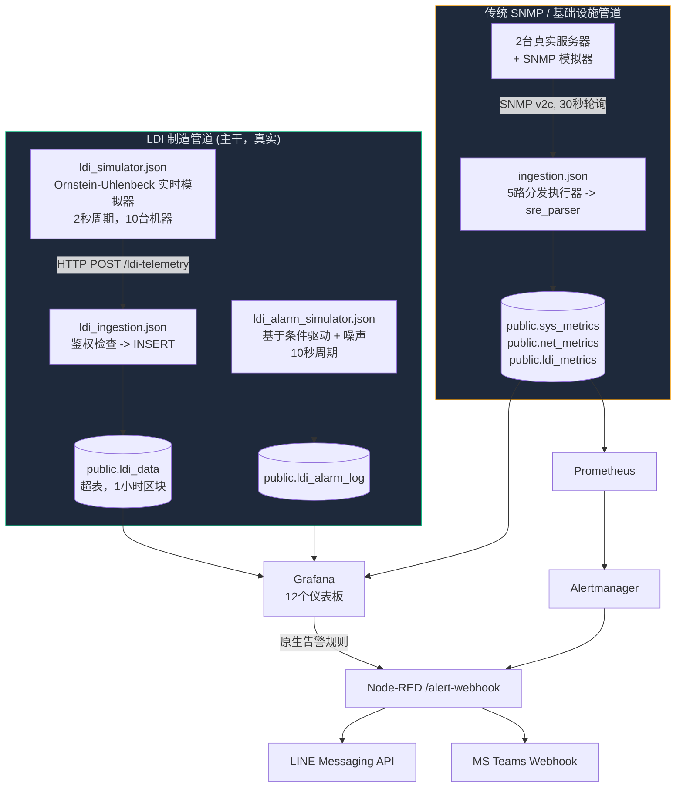

# IMS 系统架构

> 系统拓扑、数据流和运行架构的唯一事实来源。在发现之前的版本是将两个不同且自相矛盾的架构文档拼接在一起（描述的仪表板数量和摄取路径已不再与实时系统匹配，参见 `IMS-SYSTEM-AUDIT-REPORT.md` P1-2）后，于 2026-08-05 进行了重写。以下所有声明均直接对照运行中的系统或受控源文件进行了验证，而非沿用自先前文档。
> 
> **已验证声明：** 有关证明以下声明的实际运行时日志、配置输出和屏幕截图，请参阅 **[证据索引 (Evidence Index)](../evidence/INDEX.md)**。

---

## 系统上下文

IMS 是一个 Docker Compose 技术栈，包含**两条独立的遥测管道**，它们向同一个共享的 TimescaleDB 提供数据，跨 **12 个 Grafana 仪表板**进行可视化，并通过 Grafana 原生告警引擎和 Prometheus/Alertmanager 发出告警。

**存在两条管道的原因：** 传统的 SNMP 管道 (`ingestion.json`) 是系统的最初设计 —— 轮询支持 SNMP 的设备，通过有状态的 `sre_parser` 进行解析，并插入至 `sys_metrics`/`net_metrics`/`ldi_metrics`。LDI 制造遥测后来被赋予了其专属的、保真度更高的管道（`ldi_data`，由 HTTP POST 而非 SNMP 提供数据），因为制造仪表板需要每个样本的 PE/JE/Cpk 精度，而用于 k6 合成测试的 `ldi_metrics` 表在设计上从未打算承载此类精度。**所有 12 个 Grafana 仪表板的 LDI/制造内容均从 `ldi_data` 读取，而非 `ldi_metrics`。** `ldi_metrics` 仍然存在且仍在写入（通过 `ingestion.json` 的 SRE 解析器），但其几个 LDI 专有列（`throughput`、`power_watt`、`vibration`）已确认对于 LDI 级设备始终为 `0` —— 这是该管道中的一个已知缺陷，但在 `ldi_data` 中不存在。参见下方的“已知差异 (Known Gaps)”。

---

## 容器清单

| Service | Container | Purpose |
|---|---|---|
| `timescaledb` | `ims-timescaledb` | PostgreSQL + TimescaleDB — 所有持久化存储 |
| `pgbouncer` | `ims-pgbouncer` | TimescaleDB 前端基于事务模式的连接池 |
| `node-red` | `ims-node-red` | 包含遥测管道（模拟器 + 摄取）和告警分发流 |
| `grafana` | `ims-grafana` | 仪表板、已配置的告警规则、原生告警。无专有主机端口 — 只能通过 `proxy` 访问（见下文）。 |
| `proxy` | `ims-proxy` | nginx 反向代理；Grafana 和 `alarm-api` 唯一面向主机发布的入口。通过对照 Grafana 自身会话的 `auth_request` 检查来控制对 `/alarm-api/` 的访问权限（`proxy/nginx.conf`） — 参见 `SECURITY_MODEL.md`。 |
| `alarm-api` | `ims-alarm-api` | `public.ldi_alarm_lifecycle` 的写入路径（用于确认/解决告警，由 `IMS LDI - Alarm Console` 调用）。无主机端口；仅能通过 `proxy` 访问。以最低权限角色 `alarm_api_writer` 连接到 Postgres（迁移脚本 078）。 |
| `renderer` | `ims-grafana-renderer` | 外部 `grafana-image-renderer` 服务（为告警/报告提供 PNG 导出） |
| `prometheus` | `ims-prometheus` | 抓取与 `sys_metrics` 相关的导出器和 Node-RED 运行状况；评估其自身的告警规则 |
| `alertmanager` | `ims-alertmanager` | 将 Prometheus 告警路由至 Node-RED 的 `/alert-webhook` |
| `blackbox-exporter` | (blackbox) | 针对 SLA 监控的 HTTP/TCP/ICMP 探测 |
| `snmpsim` | (snmpsim) | 用于传统管道开发/测试目标的模拟 SNMP 代理 |
| `db-migrate` | `ims-db-migrate` | 一次性迁移运行器（`scripts/migrate-entrypoint.sh`），负责控制 `node-red` 和 `alarm-api` 的启动时序 |

内部专属服务（PgBouncer、SNMP 模拟器、blackbox exporter、Grafana、alarm-api）从不直接暴露给主机；只有 `proxy`（3000，前置于 Grafana 和 alarm-api）、Node-RED（1880）、Prometheus（9090）和 Alertmanager（127.0.0.1:9093，仅限环回地址）发布端口。

---

## LDI 制造管道（所有仪表板实际使用的管道）

1. **`ldi_simulator.json`**（“LDI 实时模拟器”选项卡）以 2 秒为周期，对每台机器运行一个 Ornstein-Uhlenbeck 均值回归过程（在 3 个工艺：DF INNER、DF OUTER、SM 中共有 10 台模拟 LDI 机器），并向 `/ldi-telemetry` 发送 POST 批量数据。
2. **`ldi_ingestion.json`**（“IMS LDI 摄取”选项卡）接收 POST 请求，对照 `INGEST_API_KEY` 检查 `x-api-key` 标头，并插入到 `public.ldi_data` 中。
3. **`ldi_alarm_simulator.json`**（“LDI 告警模拟器”选项卡）以 10 秒为周期运行。具有已知现实世界参数关联的告警代码（温度/湿度、PE/JE 对准误差、扫描速度）是条件驱动的 —— 只有在新鲜读取的遥测数据实际超出规格时才会触发，使用与 `v_ldi_alarm_context`（迁移脚本 045）在评估 RCA 时相同的阈值。没有已知参数关联的代码（校准故障、成像设备故障等）则从匹配实际历史频率的加权随机噪声池中抽取。`VACUUM`（告警代码 `91009`）刻意设置为仅噪声：无论时间长短，每台机器恒定工艺配方的 `air_vacuum` 值都已处于 `flag_vac_out_of_spec` 的“超出规格”范围内，因此任何告警时序策略都无法为其生成真实的关联信号 —— 这是标志位阈值与工艺配方不匹配所致，不应在模拟器中伪造修复。
4. 两者都馈入 `public.ldi_data` / `public.ldi_alarm_log`，这也是所有 LDI Grafana 仪表板和 RCA 事实测试 (RCA Truth Test) 面板读取的来源。

**良率 (Yield)**，特别需要指出，具有唯一的事实来源：`public.f_ldi_yield_pct()`（迁移脚本 046）—— 它是 PE 合格率和 JE 合格率对照每一行自身的 `pe_setting`/`je_setting`（而不是硬编码的阈值）的最差情况取值。NOC 概览和制造仪表板都调用此同一函数，因此它们在数值上不可能出现结构性分歧。

**Cpk**，制程能力公式（`LEAST((limit-mean)/(3*sigma), (mean+limit)/(3*sigma))`，样本标准差），在 5 个地方进行了独立的实现（3 个仪表板面板 + `v_machine_spc_fleet` + `v_machine_spc_ranking`）而不是共享实现 —— `tests/e2e/golden-dataset-spc.js` 通过所有 5 个实现运行手工计算的合成数据集，并断言它们保持一致，作为防止其再次偏离的常驻 CI 门控。

---

## 传统 SNMP / 基础设施管道

`ingestion.json`（“IMS 摄取管道”选项卡）每 30 秒通过 SNMP v2c 轮询注册的设备：

- 设备注册表从 `public.devices` 加载到 `global.deviceRegistry` 中（每 5 分钟刷新一次）。
- `fork_5_ways` 为每台设备调度并行的执行器（CPU、存储、网络、温度、LDI）。
- `sre_parser`（“SRE AIOps 解析器 v9 批处理”）在流程上下文中维护每台设备的状态、缓冲行，并将数据分别批量插入 `sys_metrics` / `net_metrics` / `ldi_metrics` 表中（部分执行器失败不会阻塞不相关的数据）。
- 一个类似 k6 的合成负载模拟器（`inject_fleet` -> `generate_fleet_targets` -> `pace_limiter` -> 相同的分发/解析路径）也出于负载测试目的，向这条相同管道馈入数据。

该管道实际为 NOC 概览的基础设施面板（两台真实服务器 `ERP-MASTER-UBUNTU` / `ERP-MASTER-WINDOWS` 的 CPU/RAM/磁盘/温度）以及 AIOps 兼容量预测仪表板提供动力。它**不**为任何 LDI 工艺/质量面板提供动力 —— 请参见上方的管道划分。

---

## 数据库模式（截至迁移脚本 047）

> 列数、完整的 视图/物化视图/连续聚合 (Continuous Aggregates) 列表以及当前已应用的迁移数会在 **[DATABASE_SCHEMA.md](DATABASE_SCHEMA.md)** 中自动生成（`node scripts/generate-schema-inventory.js`，通过 CI 与实时数据库进行检查校验）。此表补充说明了“原因” —— 向每个表提供数据的内容及其用途，因为生成器无法仅从 `information_schema` 中推断出这些。

| Table | Type | Fed by | Purpose |
|---|---|---|---|
| `devices` | 表 (Table) | 手动/种子 | 记录每个被监控实体的注册表（`device_type`: `ldi` 或 `server`） |
| `ldi_data` | 超表 (Hypertable)，1小时区块 | `ldi_ingestion.json` | 真实的 LDI 工艺遥测 —— PE/JE、温度、湿度、真空度、扫描速度，具体到每个样本。是所有 LDI 仪表板面板的来源。 |
| `ldi_alarm_log` | 超表 (Hypertable)，7天区块 | `ldi_alarm_simulator.json` | 告警事件行，自本次会话的模拟器修复后与条件相关联 |
| `ldi_alarm_ms_code` | 表 (Table) | 迁移脚本 036（模拟种子） | 主告警代码参考（20个真实的生产代码，仅功能描述 —— 而非供应商目录） |
| `sys_metrics` / `net_metrics` / `ldi_metrics` | 超表 (Hypertables)，1天区块 | `ingestion.json`（传统管道） | 基础设施遥测 + 具有已知缺口的 k6 合成 LDI 指标表（见下文） |
| `schema_migrations` | 表 (Table) | `scripts/migrate-entrypoint.sh` | 迁移跟踪 —— `(version, filename, applied_at)`，在规范形态中没有 `checksum` 列 |

**值得了解的视图：** `v_ldi_alarm_context`（迁移脚本 045，将告警连接到其之前 5 分钟内的遥测读数 —— 这是 RCA 事实测试关联的基础），`v_machine_spc_fleet` / `v_machine_spc_ranking`（Cpk，针对全队列与针对单选），`v_fleet_health` / `v_fleet_score`（迁移脚本 047，范围仅限定为 `device_type='server'` —— 以前它包含 LDI 机器的永久零桩行，稀释了基础设施健康评分）。

---

## 迁移治理

**唯一的规范迁移运行器**：`scripts/migrate-entrypoint.sh`。Docker Compose 的一次性 `db-migrate` 服务会自动运行它（`node-red` 依赖于 `db-migrate: condition: service_completed_successfully`）；`scripts/migrate.sh` 只是一个轻薄包装器（`docker compose run --rm db-migrate`），用于在不启动其余技术栈的情况下进行手动重运行。

此仓库以前有 3 个具有不同跟踪行为的独立迁移运行器（`migrate.sh` 拥有自身的循环及未使用的 `checksum` 列，`migrate-entrypoint.sh` 没有，`init-migrations.sh` 完全没有跟踪表，而是通过错误文本匹配进行猜测）—— 给定数据库上最先运行的脚本无声地决定了该数据库实际的 `schema_migrations` 形态。这是至少一次已确认跟踪漂移事件的根本原因（迁移脚本 038，被发现已在实时库中应用但其跟踪行仍未被标记）。`init-migrations.sh` 现已被移除；现在只有确切的一个运行器和一种跟踪形态。

所有迁移脚本都应当是幂等的（`CREATE ... IF NOT EXISTS`、对于重命名的 `DO $$ ... IF EXISTS ...` 保护等），以便针对已迁移数据库的重运行始终是安全的空操作。**迁移脚本 020 是一个警示案例**：它最初以无条件的 `DROP TABLE ldi_data CASCADE` 开始，这只有在项目尚未有真实数据的早期开发阶段才安全 —— 后来发现其在一个包含超过 28.4 万真实行的数据库中被标记为已应用但从未运行过。现已重写为：若缺失则创建并原地调整，而不是删除。

迁移脚本 048 完成了 020 开始的工作：`ldi_data` 的 `DOUBLE PRECISION` → `REAL` 转换，该转换在压缩区块上会静默变成空操作。它先解压缩，然后删除并重建受其依赖的连续聚合 (Continuous Aggregates) 链条（`ldi_data_1m` → `15m` → `1h`，加上 `ldi_data_hourly`）和 7 个依赖普通视图，转换了列，并根据原始数据刷新每一个连续聚合 (Continuous Aggregates) —— 并设有保护：若列已经是 `REAL`，则作为空操作返回（这对于通过 `postgres/init/001` 全新部署的情况为真）。迁移脚本 049 删除了废弃的 `alert_rules`/`alert_history` 表（参见已知差异）。迁移脚本 050 将 RCA 提升度/置信度逻辑提升为真正的共享视图：`v_ldi_rca_recent_window`。

迁移脚本 064 将 `v_machine_spc_fleet` 和 `v_ldi_rca_recent_window` 从普通视图转换为物化视图（因为名称和输出列完全相同，读取它们的 4 个面板无需更改仪表板），并通过 TimescaleDB 内置通用任务调度程序每 60 秒刷新一次（`add_job` —— 栈内未安装 `pg_cron` 扩展，因此不作考虑）。它还提取了工程分析 "RCA 事实测试" 面板的内联 CTE 进入了新物化视图 `v_ldi_rca_truth_test`，这*确实*需要一行面板的 SQL 更改（现在是 `SELECT ... FROM v_ldi_rca_truth_test` 而不是单次读取中重算 CTE 链）。两项更改均受实际 `EXPLAIN ANALYZE` 数据而非主观猜测所驱动：LDI 套件的 P95 查询延迟从 60.12ms 降至 5.30ms。

---

## 告警 (Alerting)

两个独立的告警评估引擎都汇入同一个 Node-RED 分发流：

1. **Grafana 原生告警**（`monitoring/grafana/provisioning/alerting/*.yml`）—— LDI 专用规则（机器告警入库、制程能力低于 1.33、振动达到严重级别、Z-score 异常）通过 Grafana 的自带调度器直接对照 TimescaleDB 评估。
2. **Prometheus + Alertmanager** —— 聚焦于基础设施的规则（CPU/RAM/磁盘/温度阈值、服务宕机、接口中断）由 Prometheus 评估，通过 Alertmanager 路由（`monitoring/alertmanager/alertmanager.yml`），并配置有基于严重性的分组和抑制规则（严重级别抑制同设备上的警告级别）。

**两条路径都在 `nodered_data/flows/alerting.json` 汇集**（“IMS 告警管道”选项卡），其通过 `POST /alert-webhook` 接收 Alertmanager 的 Webhook，格式化告警并散布至：
- **LINE Messaging API**（并非 LINE Notify —— 该 API 已于 2025 年被 LINE 废弃且未在此使用）通过 `LINE_CHANNEL_ACCESS_TOKEN` + `LINE_USER_ID` 发送。
- **MS Teams** 通过 `TEAMS_WEBHOOK_URL` 作为 Adaptive Card (自适应卡片) 发送。

若任意凭证未设置，对应的分发函数则会调用 `node.error()`（在节点流内的 "Alert Delivery Failure" 调试节点可见，并且在节点本身显示持续红色状态指示符）而不是默默丢弃告警 —— 但在真实凭证配置于 `.env` 之前，交付仍未真正进行。Grafana 自身的 `ims-slack-critical` 路由也同样转发至该同一 Webhook；此前指向占位 URL 的直连 Slack 配置已被移除，而不是任其在每个严重告警时报错。

---

## 仪表板清单

> 面板计数和描述会自动在 **[DASHBOARD_INVENTORY.md](DASHBOARD_INVENTORY.md)** 内生成（`node scripts/generate-dashboard-inventory.js`，受 CI 检查）。下表补充了架构层的“原因” —— 范围边界以及交叉引用 —— 因为生成器无法仅从 JSON 推测这些信息；当新增或重命名仪表板时，须保持此处的 UID/标题列与生成文件同步。

| UID | Title | Scope |
|---|---|---|
| `ims-noc-overview` | IMS NOC Overview | 仅限基础设施（2台真实服务器 + 网络）—— LDI 工艺内容放置于它处，见下方 |
| `ims-ldi-manufacturing` | IMS LDI - Manufacturing Command Center | 完整的4层 RCA 仪表板：高管 KPI、机器遥测、生产上下文、告警流 |
| `ims-ldi-operator-andon` | IMS LDI - Operator Andon Board | 工厂车间信息终端，1280x720 无滚动设计预留 |
| `ims-ldi-engineering-analytics` | IMS LDI - Engineering Analytics & SPC | Cpk/SPC 排名、RCA 事实测试、PE/JE 分布 |
| `ims-ldi-machine-snapshot` | IMS LDI - Machine Snapshot | 逐个事件向下钻取（点击告警/日志以审查） |
| `ldi-data-readiness` | LDI Data Readiness & Integration Gaps | 具备自审能力的数据质量仪表板（板键重复度、覆盖率 %、主告警匹配率） |
| `ims-easy-overview` | IMS Easy Overview | 零配置全队列概览，完全基于共享视图/函数构建（`v_ldi_machine_latest_full`, `v_ldi_alarm_context`, `f_ldi_yield_pct`, `v_machine_spc_fleet`）—— 无模板变量设置要求 |
| `ims-engineering` | IMS Engineering Drill-Down | 聚焦基础设施：每台服务器的 CPU/RAM/存储/网络情况，LDI 吞吐量/质量（传统管道） |
| `ims-capacity` | IMS AIOps & Capacity Forecast | 全满/饱和天数回归预测（基础设施层） |
| `ims-meta-monitoring` | IMS Pipeline Health & Meta-Monitoring | 摄取管道自身的健康度（每秒行数，批量成功率，重试队列深度） |

NOC 概览在本次会话中从 LDI/制造内容中拆分出来（它此前包含了制造良率面板的重复版本）—— 现已将基础设施与制造关注点有意识地放在独立仪表板中，而非混合在一个“概览”页面上。

---

## 已知差异 (Known Gaps)

在此进行记录，而不是让下个人去重新发现：

- **针对每一个 LDI 设备，`ldi_metrics.throughput` / `.power_watt` / `.vibration` 始终为 `0`**（确认范围覆盖超过 2,300+ 行，全部 10 台机器）。供给该表数据的 k6 合成摄取管道在设计之初从未连接去为 LDI 类设备填充这些字段。因此暂停了 `ims-ldi-vibration-critical` 告警规则，而不是让其默默处于无法触发状态。这**不**影响任何读取自 `ldi_data`（真实管道）的仪表板 —— 仅影响传统的 `ldi_metrics` 表及任何直接查询该表的应用。
- **LDI-01/LDI-04 上出现的板键重复**（分别有 157 / 121 个重复的 `(mo, board_no)` 组合，其他 8 台设备为 0）的根本原因已明确：纯属独立任务周期中的随机 `MO-NNNNN` 字符串冲突（生日悖论，考虑到只有 ~90,000 个可能的5位数取值，且在数据集历史记录中每台设备执行了 175-257 次抽取）—— 并非真实的开发板被双重计算。随机 ID 空间在实时模拟器与历史批量生成器中均扩大了 10 倍（至 6 位数字），以使其在后续运作中几无可能再现。
- **真正实现告警交付（LINE/Teams）需要本库不能提交的凭证** —— `.env` 内的 `LINE_CHANNEL_ACCESS_TOKEN`、`LINE_USER_ID`、`TEAMS_WEBHOOK_URL` 默认均为空值。能够证明该管道端到端正确运行并且遇障大声报错（`node.error()` + 持续的红色状态指示），但在把真实凭证配置入 `.env` 之前，任何内容都不会实际触达人类。
- **VACUUM (91009) RCA 关联度在 2026-08-07 被修复**（在此之前因架构上不可关联而被排除 —— 那段文字已是陈年历史，非当前状态）。超标阈值以模拟器自有的 DF INNER 配方范围（`air_vacuum > -8 OR < -30`，迁移脚本 057 —— 源自模拟器推导而非厂家规范）为中心重新校准；DF OUTER/SM 现已正确发回 `NULL`，取代了 `0.0` 作为 "不适用" 的前哨值（迁移脚本 054，在迁移脚本 060 中回填至历史行）；并且遥测生成器被注入了少见的弱真空故障事件，从而具备能够用于对比的真实偏差（`nodered_data/flows.json`，`ldisim_gen`）。**在此动态摄取系统中，提升度数值随时间发生漂移 —— 切勿把此处的任何单调数值当作永久值。** `docs/architecture/LDI_RCA_GUIDE.md` 含有当前的方法论及附带日期的快照表格；请重新执行 `SELECT * FROM public.v_ldi_rca_truth_test` 获取最新的当天数值。
- **MOTION (70004) 具备强信号，但在 `v_ldi_rca_recent_window` 中可能会达不到 n≥30 的置信度基底**（它是 24 小时滚动窗口视角的运行视图 —— `v_ldi_rca_truth_test` 全数据集验证视图通常能囊括足够事件）—— 扫描速度漂移是被正确关联的，只是在当前的配方分布中，它的发生频率在统计学上低于温度/湿度/对准等事件。这不是 Bug；只要在其被查询的任意窗口里积累了足量事件，该类别就能获取 "OK" 的置信度。请查阅 `LDI_RCA_GUIDE.md` 获知最新数值。
- **`postgres/init/` 和 `database/migrations/` 为相同的表设定了不一致的保留策略（2026-08-10 进行实时验证）** —— `postgres/init/001` 将 `sys_metrics`/`net_metrics`/`ldi_metrics` 设为 30 天保留期；`database/migrations/016-aggressive-retention.sql` 则将同样这几张表设为 14 天保留期。实时数据库与 `postgres/init/` 中的 30 天值相符，这意味着该部署属于初始全新启动，而非透过依序实施全部迁移脚本所建 —— 迁移脚本 016 的策略大抵从未能在此处实际执行。`postgres/init/032` 同时也指定了 `ldi_data`（180天）和 `ldi_alarm_log`（365天）的保留期，这在 `database/migrations/` 内无从找到对应脚本。参见 `docs/architecture/DATA_RETENTION.md` 获取完整的实时策略一览表及为何这很重要。此现象未在本文中予以调和。
- **已修复 (2026-08-12) —— 黄金数据集 SPC 的回归门控在自迁移脚本 064 后无法验证 `v_machine_spc_fleet`。** `tests/e2e/golden-dataset-spc.js` 将合成数据塞进一条必将回滚的事务中，可是迁移脚本 064 将 `v_machine_spc_fleet` 从普通视图转变为物化视图，此等对象在结构上断无能力得见未提交事务之中的插入（物化视图乃是一份独辟的物理快照，而非再次临场运行其定义查询）。通过将该视图详尽的公式以硬编码方式植进测试中进行修复（此类模式已经为该套件余下的 3 个跨面板层级审查所利用），舍弃了针对实时物化对象的查询 —— 曾考虑过使用 `REFRESH MATERIALIZED VIEW` 却予驳回，由于倘若不先行把黄金插入内容化作确实的提交，它同样无法目睹外层事务之未提交行，而上述做法有违套件的 "必然予以回滚，持零持久化" 初衷。所有 7/7 断言如今均顺利通过。参见 `docs/architecture/LDI_SPC_GUIDE.md`。
- **`restart: unless-stopped` 并未在灾难恢复演练 (DR testing) 中实现 `ims-timescaledb` 针对 `docker kill` 的自恢复 (2026-08-10)** —— 透过实时流式的 `docker events` 获得两次确认：仅仅触发出 `kill`/`die` 事件，并未自行 `start`，尽管 `docker inspect` 业已证实该重启策略正确无误地应用至此容器。根源所在尚未得以彻底抽丝剥茧（兴许只在特定于 Docker Desktop/WSL2 之环境下发生关联作用；未经真实 Linux 生产主机的确认）。从同一场灾备排查得来一个衍生的查明真相：于人手成功实施灾难复原以后，LDI 摄取专用的连接池重连看门狗（`ldiDbConnFailureStreak`，恰是在该场会话早先特定针对此故障模型而建造的）未能够在大约 6 分钟左右的时间限度里诱发一场非人工的 Node-RED 重新启动 —— 只有亲手输入 `docker restart ims-node-red` 才得以修正。详细时间流梳理见诸于 `IMS_MANUFACTURING_PLATFORM_V2.md` 内有关 DR 测试证据之环节 (Drill 2)。未在此番修缮流程中将其整改 —— 理解看门狗计数器因何故未能企及原定阈值，属于后续探究的一环，非同一场对话下的临时补丁。
- **领域界限及其往后的诸如各项制造工艺种类并非记叙于本文档里头** —— 关于基础设施/制造业相剥离事宜，望翻查 `docs/architecture/OWNERSHIP.md`（见 `monitoring/grafana/dashboards/{infrastructure,manufacturing}/`，靠 `CODEOWNERS` 作把关强制执行），欲知不牵涉改换 LDI 模型表和诸仪表板情况下应怎样纳入以后的工艺形式（AOI（自动光学检测）、电镀 (plating)、蚀刻 (etching)、钻孔 (drilling)），敬请翻看 `docs/architecture/MANUFACTURING_DOMAIN.md`。另外 `docs/architecture/EAP_ARCHITECTURE.md` 着笔涵盖实打实的两个硬件适配器 (SNMP、HTTP/JSON) 外加一纸未着实作的 SECS/GEM 协议适配合同。`docs/architecture/IMS_MANUFACTURING_PLATFORM_V2.md` 是提供上文所述这三者依凭依托的一部释出推行计划与物证志录。
- **告警严重等级分类法为“类 ISA-18.2”风格，而远未达至合乎 ISA-18.2 的境界**（确认于 2026-08-10，以反驳某处有关达标的断言）。货真价实的一面：分属四个阶层的 Critical/Major/Minor/Warning 名称，及专门指定予此体系的色彩记号 (`GRAFANA_DESIGN_SYSTEM.md` §2.1) 确有借用 ISA-18.2 所辖灾患程度的语汇。未能**落到实处**的一面：警示状态（例如：未确认 (Unacknowledged) / 已确认 (Acknowledged) / 恢复原状但未确认 (RTN-Unacknowledged) / 搁置 (Shelved) / 抑制 (Suppressed) / 停止服务 (Out-of-Service)）、有关正当化辩护的公文说明、告警绩效相关 KPI 考评（诸如警报数/干事/一刻钟，深陷洪泛区 (flood) 百分率比重，“惹祸精 (bad actor)” 溯源剖析）—— 而恰恰就是这些组成该法案的最扎实内涵。`ldi_alarm_log` 此表上压根未拨给任何应答 (ack)、搁置 (shelve) 或遏抑 (suppress) 功用的横栏；一切告警永远恒处一个潜台词状态之下。若以后某一面向项目干系人的文本材料中确系需要阐述起告警规整，那最合时宜的写法当是“ISA-18.2 风格严重等级分类”，而不是“遵循 ISA-18.2 法规要求”，抑或“援用 ISA-18.2 规程体系”。ISA-**101** (另立一派之规，专门针对于 HMI 布置设计范畴) 则只在 Operator Andon Board 显示板作为前台展现的这个极其缩微狭窄维度中称得上当之无愧 —— 未在本次说明里受到波及。

---

## 治理 / CI 门控

五大自动化门控设施在 CI 里持续放行 (`.github/workflows/ci.yml`)，逐一狙击某大类失败风险，省却了审核员通过双眼做繁重工序的一道坎：

| Gate | Script | What it proves |
|---|---|---|
| Dashboard structure | `tests/lint/dashboard-linter.js` | 网格对齐、标准面板高度限制、信息亭的免滚动高度天花板（逐仪表板校验，例如 `ims-ldi-operator-andon`: 20 个网格单元） |
| RCA category coverage | `tests/lint/rca-mapping-coverage.js` | 主告警代码之中 ≥70% 能得以关联到某个 RCA 类目之上，并且每一处在仪表板上的征用都是货真价实的 |
| Query budget (structural) | `tests/lint/query-budget-linter.js` | 不允许任一面板对未加工过的原始 `ldi_data` 执行大段的全程漫游式范围扫描，必须使用 `_1m`/`_15m`/`_1h` 连续聚合 (Continuous Aggregates) 梯队层级 |
| Query budget (real timing) | `tests/e2e/query-timing-check.js` | 根据实时 DB 之真面目得到的服务器端正牌 `EXPLAIN ANALYZE` 读秒反馈，P95 < 80ms |
| Panel data correctness | `tests/e2e/panel-data-check.js` | 每一块面板中*实质完成解析后*的 SQL 在实时数据库试剑，并且能取回确确实实连带妥贴 `time` 专栏的横列 |
| Schema drift | `scripts/migrate.sh` (断言 `Pending: 0`) | 迁移库目录与活数据库实录的 `schema_migrations` 总表达成共识 |
| Orphan objects | `tests/lint/orphan-object-linter.js` | 所有存活于世的 DB 表面或视图最少需获得任一仪表板、告警原则、信号流或迁移历程所钦点关连 —— 杜绝悄无声息的占着茅坑不拉屎 |
| Golden-dataset SPC | `tests/e2e/golden-dataset-spc.js` | 全数五套各自为战的 Cpk/Cp 算法，皆于特定一则合成数据集当中运算后交出同教条公式吻合的标准统一的答卷 |

色彩标记 (`GRAFANA_DESIGN_SYSTEM.md`)：每一道表示机器或告警状况高低的门坎跨越及映射的色彩分配，只能仰仗五大令牌来差遣行事 —— OK `#22C55E`、Warning `#F59E0B`、Critical `#EF4444`、No Data `#64748B`、Info `#2563EB`。点缀用色（拉开图表序列区分感、底子颜色、界框线条边际，或为打响招牌名声的显眼装潢）都经受了放任许可 —— 一面仪表板不可能靠区区五种重彩颜色就可以造好。

尚未纳为 CI 门控的措施：百分百眼见为实的页面截影防回归系统 (基线图差异法对拼)。`tests/playwright/dashboard-visual-regression.js` 现能够为了档案备案留下等同 4 面仪表板真容的截图倩影，却不配备基线比较或是拍板裁定去留通过的强行界准手笔 —— 理想丰满的一道防视觉回退闸口，需具备获提交的基准样张、能够辨别出单粒像素级参差落错比对工机，还有以供长设作为 CI 常备使唤的 Grafana 运作实例，时下这一套装备尚且一概空缺。

---

## 参考资料

| Resource | Link |
|---|---|
| TimescaleDB Documentation | https://docs.timescale.com/ |
| Node-RED Documentation | https://nodered.org/docs/ |
| Grafana Documentation | https://grafana.com/docs/ |
| Prometheus Documentation | https://prometheus.io/docs/ |
| Alertmanager Documentation | https://prometheus.io/docs/alerting/latest/configuration/ |
| LINE Messaging API | https://developers.line.biz/en/docs/messaging-api/ |

本仓库相关文档：`GRAFANA_DESIGN_SYSTEM.md`（颜色/标记约定），`../operations/TROUBLESHOOTING.md`，`../audits/IMS-SYSTEM-AUDIT-REPORT.md`（促成此次重写的审计报告）。
