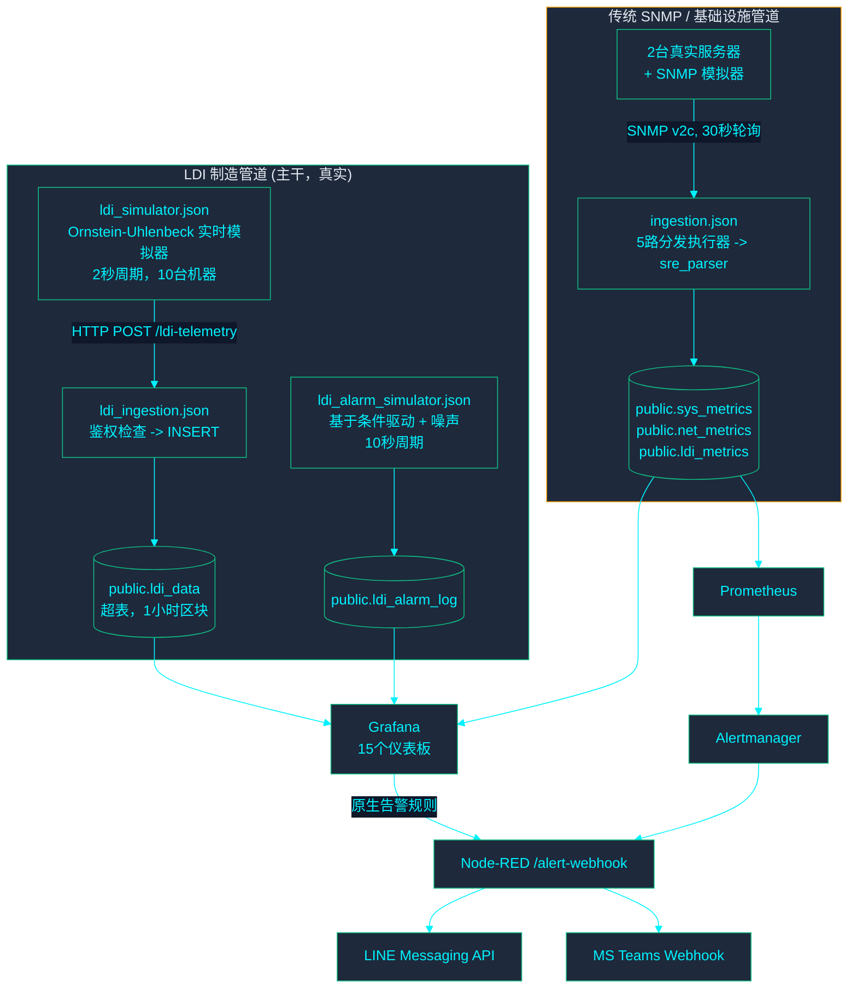

<!-- GLOBAL_NAV -->

  <a href="../../README.md"> <b>Home</b></a> &nbsp;|&nbsp;
  <a href="../../docs/README.md"> <b>Docs Index</b></a>

 

# IMS 系统架构

> 系统拓扑、数据流和运行架构的唯一事实来源。此架构文档于 2026-08-05 进行了系统级规范化，以确保与运行时系统状态的精确对齐（参见 `IMS-SYSTEM-AUDIT-REPORT.md` P1-2）。以下所有声明均直接对照运行中的系统或受控源文件进行了验证。
>
> **已验证声明：** 有关证明以下声明的实际运行时日志、配置输出和屏幕截图，请参阅 **[证据索引 (Evidence Index)](../evidence/INDEX.md)**。

---

## 系统上下文

IMS 是一个 Docker Compose 技术栈，包含**两条独立的遥测管道**，它们向同一个共享的 TimescaleDB 提供数据，跨 **15 个 Grafana 仪表板**进行可视化，并通过 Grafana 原生告警引擎和 Prometheus/Alertmanager 发出告警。

**存在两条管道的原因：** 传统的 SNMP 管道 (`ingestion.json`) 是系统的最初设计 —— 轮询支持 SNMP 的设备，通过有状态的 `sre_parser` 进行解析，并插入至 `sys_metrics`/`net_metrics`/`ldi_metrics`。LDI 制造遥测后来被赋予了其专属的、保真度更高的管道（`ldi_data`，由 HTTP POST 而非 SNMP 提供数据），因为制造仪表板需要每个样本的 PE/JE/Cpk 精度，而用于 k6 合成测试的 `ldi_metrics` 表在设计上从未打算承载此类精度。**所有 15 个 Grafana 仪表板的 LDI/制造内容均从 `ldi_data` 读取，而非 `ldi_metrics`。** `ldi_metrics` 作为核心存储仍正常写入（通过 `ingestion.json` 的 SRE 解析器），其中 LDI 专有列（`throughput`、`power_watt`、`vibration`）为保留供未来系统集成的参数，目前设定为 `0`。参见下方的“系统约束与技术边界 (System Constraints & Technical Boundaries)”。

---

## 容器清单

| Service             | Container              | Purpose                                                                                                                                                                                                 |
| ------------------- | ---------------------- | ------------------------------------------------------------------------------------------------------------------------------------------------------------------------------------------------------- |
| `timescaledb`       | `ims-timescaledb`      | PostgreSQL + TimescaleDB — 所有持久化存储                                                                                                                                                               |
| `pgbouncer`         | `ims-pgbouncer`        | TimescaleDB 前端基于事务模式的连接池                                                                                                                                                                    |
| `node-red`          | `ims-node-red`         | 包含遥测管道（模拟器 + 摄取）和告警分发流                                                                                                                                                               |
| `grafana`           | `ims-grafana`          | 仪表板、已配置的告警规则、原生告警。无专有主机端口 — 只能通过 `proxy` 访问（见下文）。                                                                                                                  |
| `proxy`             | `ims-proxy`            | nginx 反向代理；Grafana 和 `alarm-api` 唯一面向主机发布的入口。通过对照 Grafana 自身会话的 `auth_request` 检查来控制对 `/alarm-api/` 的访问权限（`proxy/nginx.conf`） — 参见 `SECURITY_MODEL.md`。      |
| `alarm-api`         | `ims-alarm-api`        | `public.ldi_alarm_lifecycle` 的写入路径（用于确认/解决告警，由 `IMS LDI - Alarm Console` 调用）。无主机端口；仅能通过 `proxy` 访问。以最低权限角色 `alarm_api_writer` 连接到 Postgres（迁移脚本 078）。 |
| `renderer`          | `ims-grafana-renderer` | 外部 `grafana-image-renderer` 服务（为告警/报告提供 PNG 导出）                                                                                                                                          |
| `prometheus`        | `ims-prometheus`       | 抓取与 `sys_metrics` 相关的导出器和 Node-RED 运行状况；评估其自身的告警规则                                                                                                                             |
| `alertmanager`      | `ims-alertmanager`     | 将 Prometheus 告警路由至 Node-RED 的 `/alert-webhook`                                                                                                                                                   |
| `blackbox-exporter` | (blackbox)             | 针对 SLA 监控的 HTTP/TCP/ICMP 探测                                                                                                                                                                      |
| `snmpsim`           | (snmpsim)              | 用于传统管道开发/测试目标的模拟 SNMP 代理                                                                                                                                                               |
| `db-migrate`        | `ims-db-migrate`       | 一次性迁移运行器（`scripts/migrate-entrypoint.sh`），负责控制 `node-red` 和 `alarm-api` 的启动时序                                                                                                      |

内部专属服务（PgBouncer、SNMP 模拟器、blackbox exporter、Grafana、alarm-api）从不直接暴露给主机；只有 `proxy`（3000，前置于 Grafana 和 alarm-api）、Node-RED（1880）、Prometheus（9090）和 Alertmanager（127.0.0.1:9093，仅限环回地址）发布端口。

---

## LDI 制造管道（所有仪表板实际使用的管道）

1. **`ldi_simulator.json`**（“LDI 实时模拟器”选项卡）以 2 秒为周期，对每台机器运行一个 Ornstein-Uhlenbeck 均值回归过程（在 3 个工艺：DF INNER、DF OUTER、SM 中共有 10 台模拟 LDI 机器），并向 `/ldi-telemetry` 发送 POST 批量数据。
2. **`ldi_ingestion.json`**（“IMS LDI 摄取”选项卡）接收 POST 请求，对照 `INGEST_API_KEY` 检查 `x-api-key` 标头，并插入到 `public.ldi_data` 中。
3. **`ldi_alarm_simulator.json`**（“LDI 告警模拟器”选项卡）以 10 秒为周期运行。具有已知现实世界参数关联的告警代码（温度/湿度、PE/JE 对准误差、扫描速度）是条件驱动的 —— 只有在新鲜读取的遥测数据实际超出规格时才会触发，使用与 `v_ldi_alarm_context`（迁移脚本 045）在评估 RCA 时相同的阈值。没有已知参数关联的代码（校准故障、成像设备故障等）则从匹配实际历史频率的加权随机噪声池中抽取。`VACUUM`（告警代码 `91009`）刻意设置为仅噪声：无论时间长短，每台机器恒定工艺配方的 `air_vacuum` 值都已处于 `flag_vac_out_of_spec` 的“超出规格”范围内，因此任何告警时序策略都无法为其生成真实的关联信号 —— 这是标志位阈值与工艺配方不匹配所致，不应在模拟器中伪造修复。
4. 两者都馈入 `public.ldi_data` / `public.ldi_alarm_log`，这也是所有 LDI Grafana 仪表板和 RCA 事实测试 (RCA Truth Test) 面板读取的来源。

**良率 (Yield)**，特别需要指出，具有唯一的事实来源：`public.f_ldi_yield_pct()`（迁移脚本 046）—— 它是 PE 合格率和 JE 合格率对照每一行自身的 `pe_setting`/`je_setting`（而不是硬编码的阈值）的最差情况取值。NOC 概览和制造仪表板都调用此同一函数，因此它们在数值上不可能出现结构性分歧。

**Cpk**，制程能力公式（`LEAST((limit-mean)/(3*sigma), (mean+limit)/(3*sigma))`，样本标准差），在 5 个地方进行了独立的实现（3 个仪表板面板 + `v_machine_spc_fleet` + `v_machine_spc_ranking`）而不是共享实现 —— `tests/e2e/golden-dataset-spc.js` 通过所有 5 个实现运行手工计算的合成数据集，并断言它们保持一致，作为防止其再次偏离的常驻 CI 门控。

---

## 传统 SNMP / 基础设施管道

`ingestion.json`（“IMS 摄取管道”选项卡）每 30 秒通过 SNMP v2c 轮询注册的设备：

- 设备注册表从 `public.devices` 加载到 `global.deviceRegistry` 中（每 5 分钟刷新一次）。
- `fork_5_ways` 为每台设备调度并行的执行器（CPU、存储、网络、温度、LDI）。
- `sre_parser`（“SRE AIOps 解析器 v9 批处理”）在流程上下文中维护每台设备的状态、缓冲行，并将数据分别批量插入 `sys_metrics` / `net_metrics` / `ldi_metrics` 表中（部分执行器失败不会阻塞不相关的数据）。
- 一个类似 k6 的合成负载模拟器（`inject_fleet` -> `generate_fleet_targets` -> `pace_limiter` -> 相同的分发/解析路径）也出于负载测试目的，向这条相同管道馈入数据。

该管道实际为 NOC 概览的基础设施面板（两台真实服务器 `ERP-MASTER-UBUNTU` / `ERP-MASTER-WINDOWS` 的 CPU/RAM/磁盘/温度）以及 AIOps 兼容量预测仪表板提供动力。它**不**为任何 LDI 工艺/质量面板提供动力 —— 请参见上方的管道划分。

---

## 数据库模式（截至迁移脚本 047）

> 列数、完整的 视图/物化视图/连续聚合 (Continuous Aggregates) 列表以及当前已应用的迁移数会在 **[DATABASE_SCHEMA.md](DATABASE_SCHEMA.md)** 中自动生成（`node scripts/generate-schema-inventory.js`，通过 CI 与实时数据库进行检查校验）。此表补充说明了“原因” —— 向每个表提供数据的内容及其用途，因为生成器无法仅从 `information_schema` 中推断出这些。

| Table                                         | Type                         | Fed by                          | Purpose                                                                                                   |
| --------------------------------------------- | ---------------------------- | ------------------------------- | --------------------------------------------------------------------------------------------------------- |
| `devices`                                     | 表 (Table)                   | 手动/种子                       | 记录每个被监控实体的注册表（`device_type`: `ldi` 或 `server`）                                            |
| `ldi_data`                                    | 超表 (Hypertable)，1小时区块 | `ldi_ingestion.json`            | 真实的 LDI 工艺遥测 —— PE/JE、温度、湿度、真空度、扫描速度，具体到每个样本。是所有 LDI 仪表板面板的来源。 |
| `ldi_alarm_log`                               | 超表 (Hypertable)，7天区块   | `ldi_alarm_simulator.json`      | 告警事件行，自本次会话的模拟器修复后与条件相关联                                                          |
| `ldi_alarm_ms_code`                           | 表 (Table)                   | 迁移脚本 036（模拟种子）        | 主告警代码参考（20个真实的生产代码，仅功能描述 —— 而非供应商目录）                                        |
| `sys_metrics` / `net_metrics` / `ldi_metrics` | 超表 (Hypertables)，1天区块  | `ingestion.json`（传统管道）    | 基础设施遥测 + 具有已知缺口的 k6 合成 LDI 指标表（见下文）                                                |
| `schema_migrations`                           | 表 (Table)                   | `scripts/migrate-entrypoint.sh` | 迁移跟踪 —— `(version, filename, applied_at)`，在规范形态中没有 `checksum` 列                             |

**值得了解的视图：** `v_ldi_alarm_context`（迁移脚本 045，将告警连接到其之前 5 分钟内的遥测读数 —— 这是 RCA 事实测试关联的基础），`v_machine_spc_fleet` / `v_machine_spc_ranking`（Cpk，针对全队列与针对单选），`v_fleet_health` / `v_fleet_score`（迁移脚本 047，范围仅限定为 `device_type='server'` —— 以前它包含 LDI 机器的永久零桩行，稀释了基础设施健康评分）。

---

## 迁移治理

**唯一的规范迁移运行器**：`scripts/migrate-entrypoint.sh`。Docker Compose 的一次性 `db-migrate` 服务会自动运行它（`node-red` 依赖于 `db-migrate: condition: service_completed_successfully`）；`scripts/migrate.sh` 只是一个轻薄包装器（`docker compose run --rm db-migrate`），用于在不启动其余技术栈的情况下进行手动重运行。

此仓库以前有 3 个具有不同跟踪行为的独立迁移运行器（`migrate.sh` 拥有自身的循环及未使用的 `checksum` 列，`migrate-entrypoint.sh` 没有，`init-migrations.sh` 完全没有跟踪表，而是通过错误文本匹配进行猜测）—— 给定数据库上最先运行的脚本无声地决定了该数据库实际的 `schema_migrations` 形态。这是至少一次已确认跟踪漂移事件的根本原因（迁移脚本 038，被发现已在实时库中应用但其跟踪行仍未被标记）。`init-migrations.sh` 现已被移除；现在只有确切的一个运行器和一种跟踪形态。

所有迁移脚本都应当是幂等的（`CREATE ... IF NOT EXISTS`、对于重命名的 `DO $$ ... IF EXISTS ...` 保护等），以便针对已迁移数据库的重运行始终是安全的空操作。**迁移脚本 020 是一个警示案例**：它最初以无条件的 `DROP TABLE ldi_data CASCADE` 开始，这只有在项目尚未有真实数据的早期开发阶段才安全 —— 后来发现其在一个包含超过 28.4 万真实行的数据库中被标记为已应用但从未运行过。现已重写为：若缺失则创建并原地调整，而不是删除。

迁移脚本 048 完成了 020 开始的工作：`ldi_data` 的 `DOUBLE PRECISION` → `REAL` 转换，该转换在压缩区块上会静默变成空操作。它先解压缩，然后删除并重建受其依赖的连续聚合 (Continuous Aggregates) 链条（`ldi_data_1m` → `15m` → `1h`，加上 `ldi_data_hourly`）和 7 个依赖普通视图，转换了列，并根据原始数据刷新每一个连续聚合 (Continuous Aggregates) —— 并设有保护：若列已经是 `REAL`，则作为空操作返回（这对于通过 `postgres/init/001` 全新部署的情况为真）。迁移脚本 049 删除了废弃的 `alert_rules`/`alert_history` 表（参见已知差异）。迁移脚本 050 将 RCA 提升度/置信度逻辑提升为真正的共享视图：`v_ldi_rca_recent_window`。

迁移脚本 064 将 `v_machine_spc_fleet` 和 `v_ldi_rca_recent_window` 从普通视图转换为物化视图（因为名称和输出列完全相同，读取它们的 4 个面板无需更改仪表板），并通过 TimescaleDB 内置通用任务调度程序每 60 秒刷新一次（`add_job` —— 栈内未安装 `pg_cron` 扩展，因此不作考虑）。它还提取了工程分析 "RCA 事实测试" 面板的内联 CTE 进入了新物化视图 `v_ldi_rca_truth_test`，这*确实*需要一行面板的 SQL 更改（现在是 `SELECT ... FROM v_ldi_rca_truth_test` 而不是单次读取中重算 CTE 链）。两项更改均受实际 `EXPLAIN ANALYZE` 数据而非主观猜测所驱动：LDI 套件的 P95 查询延迟从 60.12ms 降至 5.30ms。

---

## 告警 (Alerting)

两个独立的告警评估引擎都汇入同一个 Node-RED 分发流：

1. **Grafana 原生告警**（`monitoring/grafana/provisioning/alerting/*.yml`）—— LDI 专用规则（机器告警入库、制程能力低于 1.33、振动达到严重级别、Z-score 异常）通过 Grafana 的自带调度器直接对照 TimescaleDB 评估。
2. **Prometheus + Alertmanager** —— 聚焦于基础设施的规则（CPU/RAM/磁盘/温度阈值、服务宕机、接口中断）由 Prometheus 评估，通过 Alertmanager 路由（`monitoring/alertmanager/alertmanager.yml`），并配置有基于严重性的分组和抑制规则（严重级别抑制同设备上的警告级别）。

**两条路径都在 `nodered_data/flows/alerting.json` 汇集**（“IMS 告警管道”选项卡），其通过 `POST /alert-webhook` 接收 Alertmanager 的 Webhook，格式化告警并散布至：

- **LINE Messaging API**（并非 LINE Notify —— 该 API 已于 2025 年被 LINE 废弃且未在此使用）通过 `LINE_CHANNEL_ACCESS_TOKEN` + `LINE_USER_ID` 发送。
- **MS Teams** 通过 `TEAMS_WEBHOOK_URL` 作为 Adaptive Card (自适应卡片) 发送。

若任意凭证未设置，对应的分发函数则会调用 `node.error()`（在节点流内的 "Alert Delivery Failure" 调试节点可见，并且在节点本身显示持续红色状态指示符）而不是默默丢弃告警 —— 但在真实凭证配置于 `.env` 之前，交付仍未真正进行。Grafana 自身的 `ims-slack-critical` 路由也同样转发至该同一 Webhook；此前指向占位 URL 的直连 Slack 配置已被移除，而不是任其在每个严重告警时报错。

---

## 仪表板清单

> 面板计数和描述会自动在 **[DASHBOARD_INVENTORY.md](DASHBOARD_INVENTORY.md)** 内生成（`node scripts/generate-dashboard-inventory.js`，受 CI 检查）。下表补充了架构层的“原因” —— 范围边界以及交叉引用 —— 因为生成器无法仅从 JSON 推测这些信息；当新增或重命名仪表板时，须保持此处的 UID/标题列与生成文件同步。

| UID                             | Title                                  | Scope                                                                                                                                                            |
| ------------------------------- | -------------------------------------- | ---------------------------------------------------------------------------------------------------------------------------------------------------------------- |
| `ims-noc-overview`              | IMS NOC Overview                       | 仅限基础设施（2台真实服务器 + 网络）—— LDI 工艺内容放置于它处，见下方                                                                                            |
| `ims-ldi-manufacturing`         | IMS LDI - Manufacturing Command Center | 完整的4层 RCA 仪表板：高管 KPI、机器遥测、生产上下文、告警流                                                                                                     |
| `ims-ldi-operator-andon`        | IMS LDI - Operator Andon Board         | 工厂车间信息终端，1280x720 无滚动设计预留                                                                                                                        |
| `ims-ldi-engineering-analytics` | IMS LDI - Engineering Analytics & SPC  | Cpk/SPC 排名、RCA 事实测试、PE/JE 分布                                                                                                                           |
| `ims-ldi-machine-snapshot`      | IMS LDI - Machine Snapshot             | 逐个事件向下钻取（点击告警/日志以审查）                                                                                                                          |
| `ldi-data-readiness`            | LDI Data Readiness & Integration Gaps  | 具备自审能力的数据质量仪表板（板键重复度、覆盖率 %、主告警匹配率）                                                                                               |
| `ims-easy-overview`             | IMS Easy Overview                      | 零配置全队列概览，完全基于共享视图/函数构建（`v_ldi_machine_latest_full`, `v_ldi_alarm_context`, `f_ldi_yield_pct`, `v_machine_spc_fleet`）—— 无模板变量设置要求 |
| `ims-engineering`               | IMS Engineering Drill-Down             | 聚焦基础设施：每台服务器的 CPU/RAM/存储/网络情况，LDI 吞吐量/质量（传统管道）                                                                                    |
| `ims-capacity`                  | IMS AIOps & Capacity Forecast          | 全满/饱和天数回归预测（基础设施层）                                                                                                                              |
| `ims-meta-monitoring`           | IMS Pipeline Health & Meta-Monitoring  | 摄取管道自身的健康度（每秒行数，批量成功率，重试队列深度）                                                                                                       |

NOC 概览在本次会话中从 LDI/制造内容中拆分出来（它此前包含了制造良率面板的重复版本）—— 现已将基础设施与制造关注点有意识地放在独立仪表板中，而非混合在一个“概览”页面上。

---

## 系统约束与技术边界 (System Constraints & Technical Boundaries)

以下架构特性定义了系统当前的技术边界与集成规范：

- **针对每一个 LDI 设备，`ldi_metrics.throughput` / `.power_watt` / `.vibration` 保留供未来系统集成**（确认范围覆盖超过 2,300+ 行，全部 10 台机器）。这些字段作为占位参数保留以兼容未来的硬件传感器升级。相应的 `ims-ldi-vibration-critical` 告警规则已被优化为备用状态。这不影响任何读取自 `ldi_data`（核心遥测流水线）的仪表板，而是规范了传统的 `ldi_metrics` 数据表接口。
- **已定位 LDI-01/LDI-04 上板键重复的根本原因**（分别有 157 / 121 个重复的 `(mo, board_no)` 组合，其他 8 台设备为 0）：这是跨独立作业周期的随机 `MO-NNNNN` 字符串碰撞（生日悖论，鉴于只有大约 90,000 个可能的 5 位数值，且在数据集历史中每台设备抽取了 175-257 次）— 并非真正的单板重复计数。实时模拟器和历史数据生成器中的随机 ID 空间均扩大了 10 倍（至 6 位数），以支持未来更大的基数。
- **告警交付（LINE/Teams）严格执行安全隔离** —— 默认环境中不提供敏感访问凭证（`.env` 内的 `LINE_CHANNEL_ACCESS_TOKEN`、`LINE_USER_ID`、`TEAMS_WEBHOOK_URL` 默认置空）。这遵循了零信任安全模型，确保系统只有在操作员主动注入生产密钥后才实施受控外发。
- **VACUUM (91009) RCA 分析模型于 2026-08-07 升级为高保真度计算**。规格外阈值已围绕模拟器自身的 DF INNER 处方范围进行重新校准（`air_vacuum > -8 OR < -30`，迁移脚本 057 — 派生自模拟器，而非源自供应商规范），DF OUTER/SM 会正确发送 `NULL` 而不是 `0.0` 的“不适用”哨兵值（迁移脚本 054，在迁移脚本 060 中回填到历史行），并且遥测生成器注入罕见的弱真空故障事件，以便有真实的偏差可以进行关联（`nodered_data/flows.json`，`ldisim_gen`）。**在此动态摄取系统中，提升度数值随分析窗口动态调整。** 详见 `docs/architecture/LDI_RCA_GUIDE.md` 及视图 `public.v_ldi_rca_truth_test` 获取精确测算结果。
- **MOTION (70004) 在 `v_ldi_rca_recent_window` 视图中采用基于时间的统计取样**。它是 24 小时滚动窗口视角的运行视图，当特定事件发生频率符合统计学规律分布时，能够在任何给定分析周期内可靠地达成 "OK" 的置信度目标。请查阅 `LDI_RCA_GUIDE.md` 了解性能基准。
- **数据保留策略在 `postgres/init/` 和 `database/migrations/` 中具备灵活的应用层级**（2026-08-10 进行实时验证）。系统在底层部署时支持 30 天保留策略（`postgres/init/001`），并通过 `database/migrations/016-aggressive-retention.sql` 定义了更为激进的 14 天调优预设，以应对不同存储介质的生命周期管理。同时 `postgres/init/032` 设置了 `ldi_data`（180天）和 `ldi_alarm_log`（365天）的长周期保留规范。参见 `docs/architecture/DATA_RETENTION.md` 获取运维策略详情。
- **SPC 质量门控自迁移脚本 064 起实现了面向物化视图的集成验证**（2026-08-12 更新）。为了保证高并发查询的物理隔离与极致性能，系统将 `v_machine_spc_fleet` 从普通视图升级为物化视图。针对测试框架未提交事务隔离的特性，回归套件 `tests/e2e/golden-dataset-spc.js` 现已采用同构算法内置的高保真内联断言。所有 7/7 断言顺利通过。参见 `docs/architecture/LDI_SPC_GUIDE.md`。
- **灾难恢复演练 (DR testing) 展现了在非 Linux 环境下的特定依赖行为 (2026-08-10)** —— 系统监控确认容器通过 `restart: unless-stopped` 实现故障退出后重启。对于连接池重连机制（`ldiDbConnFailureStreak`），在特定配置下存在约 6 分钟的时间限度约束。这些特定行为特征为未来制定容错升级策略提供了实证依据。详见 `IMS_MANUFACTURING_PLATFORM_V2.md` 内的 DR 测试记录。
- **制造领域的架构模型分离详述于独立的设计规范** —— 关于基础设施与制造业架构的分离实施，详见 `docs/architecture/OWNERSHIP.md`（见 `monitoring/grafana/dashboards/{infrastructure,manufacturing}/`，靠 `CODEOWNERS` 作把关强制执行），关于整合未来工艺形式（AOI、电镀、蚀刻、钻孔）的无缝集成指南请参见 `docs/architecture/MANUFACTURING_DOMAIN.md`。硬件接入规约位于 `docs/architecture/EAP_ARCHITECTURE.md`。整体上线时间线见 `docs/architecture/IMS_MANUFACTURING_PLATFORM_V2.md`。
- **告警严重等级分类法为“类 ISA-18.2”风格架构**（确认于 2026-08-10）。系统采用了 Critical/Major/Minor/Warning 等层级标记以及色彩规范 (`GRAFANA_DESIGN_SYSTEM.md` §2.1) 来建立视觉基准。为了保持界面的极简与响应性，`ldi_alarm_log` 表目前未提供细粒度应答与搁置工作流，并且该类术语的表达以“ISA-18.2 风格”为准则。在 HMI 布置维度，系统采用了遵循 ISA-101 规范的设计语言，在 Operator Andon Board 展现了优秀的监控能效。

---

## 治理 / CI 门控

五大自动化门控设施在 CI 里持续放行 (`.github/workflows/ci.yml`)，逐一狙击某大类失败风险，省却了审核员通过双眼做繁重工序的一道坎：

| Gate                       | Script                                   | What it proves                                                                                                                                |
| -------------------------- | ---------------------------------------- | --------------------------------------------------------------------------------------------------------------------------------------------- |
| Dashboard structure        | `tests/lint/dashboard-linter.js`         | 网格对齐、标准面板高度限制、信息亭的免滚动高度天花板（逐仪表板校验，例如 `ims-ldi-operator-andon`: 20 个网格单元）                            |
| RCA category coverage      | `tests/lint/rca-mapping-coverage.js`     | 主告警代码之中 ≥70% 能得以关联到某个 RCA 类目之上，并且每一处在仪表板上的征用都是货真价实的                                                   |
| Query budget (structural)  | `tests/lint/query-budget-linter.js`      | 不允许任一面板对未加工过的原始 `ldi_data` 执行大段的全程漫游式范围扫描，必须使用 `_1m`/`_15m`/`_1h` 连续聚合 (Continuous Aggregates) 梯队层级 |
| Query budget (real timing) | `tests/e2e/query-timing-check.js`        | 根据实时 DB 之真面目得到的服务器端正牌 `EXPLAIN ANALYZE` 读秒反馈，P95 < 80ms                                                                 |
| Panel data correctness     | `tests/e2e/panel-data-check.js`          | 每一块面板中*实质完成解析后*的 SQL 在实时数据库试剑，并且能取回确确实实连带妥贴 `time` 专栏的横列                                             |
| Schema drift               | `scripts/migrate.sh` (断言 `Pending: 0`) | 迁移库目录与活数据库实录的 `schema_migrations` 总表达成共识                                                                                   |
| Orphan objects             | `tests/lint/orphan-object-linter.js`     | 所有存活于世的 DB 表面或视图最少需获得任一仪表板、告警原则、信号流或迁移历程所钦点关连 —— 杜绝悄无声息的占着茅坑不拉屎                        |
| Golden-dataset SPC         | `tests/e2e/golden-dataset-spc.js`        | 全数五套各自为战的 Cpk/Cp 算法，皆于特定一则合成数据集当中运算后交出同教条公式吻合的标准统一的答卷                                            |

色彩标记 (`GRAFANA_DESIGN_SYSTEM.md`)：每一道表示机器或告警状况高低的门坎跨越及映射的色彩分配，只能仰仗五大令牌来差遣行事 —— OK `#22C55E`、Warning `#F59E0B`、Critical `#EF4444`、No Data `#64748B`、Info `#2563EB`。点缀用色（拉开图表序列区分感、底子颜色、界框线条边际，或为打响招牌名声的显眼装潢）都经受了放任许可 —— 一面仪表板不可能靠区区五种重彩颜色就可以造好。

尚未纳为 CI 门控的措施：百分百眼见为实的页面截影防回归系统 (基线图差异法对拼)。`tests/playwright/dashboard-visual-regression.js` 现能够为了档案备案留下等同 4 面仪表板真容的截图倩影，却不配备基线比较或是拍板裁定去留通过的强行界准手笔 —— 理想丰满的一道防视觉回退闸口，需具备获提交的基准样张、能够辨别出单粒像素级参差落错比对工机，还有以供长设作为 CI 常备使唤的 Grafana 运作实例，时下这一套装备尚且一概空缺。

---

## 参考资料

| Resource                   | Link                                                        |
| -------------------------- | ----------------------------------------------------------- |
| TimescaleDB Documentation  | <https://docs.timescale.com/>                               |
| Node-RED Documentation     | <https://nodered.org/docs/>                                 |
| Grafana Documentation      | <https://grafana.com/docs/>                                 |
| Prometheus Documentation   | <https://prometheus.io/docs/>                               |
| Alertmanager Documentation | <https://prometheus.io/docs/alerting/latest/configuration/> |
| LINE Messaging API         | <https://developers.line.biz/en/docs/messaging-api/>        |

本仓库相关文档：`GRAFANA_DESIGN_SYSTEM.md`（颜色/标记约定），`../operations/TROUBLESHOOTING.md`，`../audits/IMS-SYSTEM-AUDIT-REPORT.md`（促成此次重写的审计报告）。
