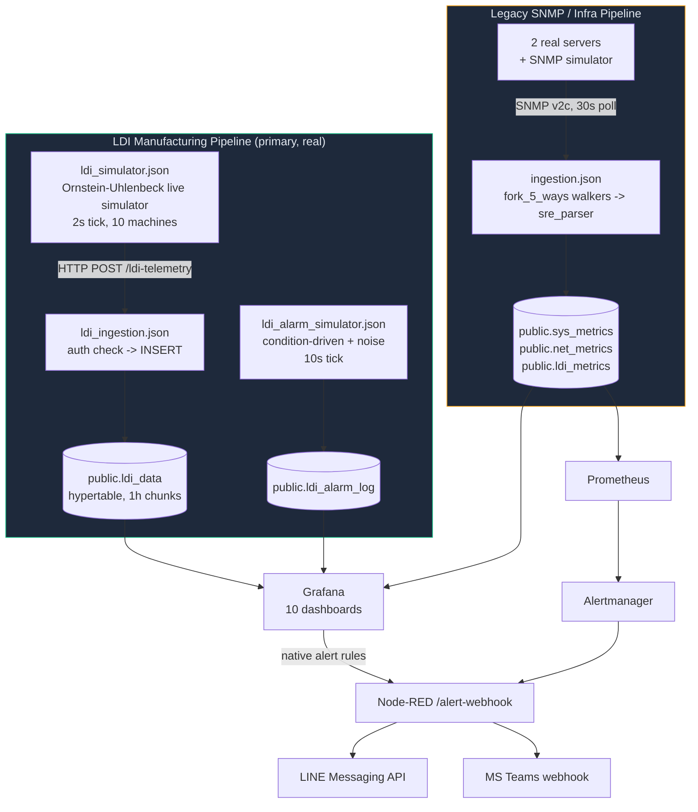

# IMS System Architecture

> Single source of truth for system topology, data flow, and operational architecture. Rewritten 2026-08-05 after the previous version was found to be two different, self-contradictory architecture docs concatenated together, describing a dashboard count and ingestion path that no longer matched the live system (see `IMS-WORLD-CLASS-AUDIT-REPORT.md` P1-2). Every claim below was verified directly against the running system or the tracked source files, not carried over from the prior doc.

---

## System Context

IMS is a Docker Compose stack with **two independent telemetry pipelines** feeding one shared TimescaleDB, visualized across **10 Grafana dashboards** with alerting through both Grafana's native alert engine and Prometheus/Alertmanager.

**Why two pipelines exist:** the legacy SNMP pipeline (`ingestion.json`) was the system's original design — poll SNMP-speaking devices, parse via a stateful `sre_parser`, insert into `sys_metrics`/`net_metrics`/`ldi_metrics`. LDI manufacturing telemetry was later given its own, higher-fidelity pipeline (`ldi_data`, fed by HTTP POST rather than SNMP) because the manufacturing dashboards need per-sample PE/JE/Cpk precision that the k6-synthetic `ldi_metrics` table was never designed to carry. **All 10 Grafana dashboards' LDI/manufacturing content reads from `ldi_data`, not `ldi_metrics`.** `ldi_metrics` still exists and is still written to (via `ingestion.json`'s SRE parser), but several of its LDI-specific columns (`throughput`, `power_watt`, `vibration`) are confirmed to always be `0` for LDI-class devices — a known gap in that pipeline, not in `ldi_data`. See "Known Gaps" below.

---

## Container Inventory

| Service | Container | Purpose |
|---|---|---|
| `timescaledb` | `ims-timescaledb` | PostgreSQL + TimescaleDB — all persistent storage |
| `pgbouncer` | `ims-pgbouncer` | Transaction-mode connection pooler in front of TimescaleDB |
| `node-red` | `ims-node-red` | Both telemetry pipelines (simulators + ingestion) and the alert-delivery flow |
| `grafana` | `ims-grafana` | Dashboards, provisioned alert rules, native alerting |
| `renderer` | `ims-grafana-renderer` | External `grafana-image-renderer` service (PNG export for alerts/reports) |
| `prometheus` | `ims-prometheus` | Scrapes `sys_metrics`-adjacent exporters and Node-RED health; evaluates its own alert rules |
| `alertmanager` | `ims-alertmanager` | Routes Prometheus alerts to Node-RED's `/alert-webhook` |
| `blackbox-exporter` | (blackbox) | HTTP/TCP/ICMP probes for SLA monitoring |
| `snmpsim` | (snmpsim) | Simulated SNMP agent for the legacy pipeline's dev/test targets |
| `db-migrate` | `ims-db-migrate` | One-shot migration runner (`scripts/migrate-entrypoint.sh`), gates `node-red` startup |

Internal-only services (PgBouncer, SNMP simulator, blackbox exporter) are never exposed to the host; only Grafana (3000), Node-RED (1880), Prometheus (9090), and Alertmanager (127.0.0.1:9093, loopback-only) publish ports.

---

## LDI Manufacturing Pipeline (the one every dashboard actually uses)

1. **`ldi_simulator.json`** ("LDI Live Simulator" tab) runs an Ornstein-Uhlenbeck mean-reverting process per machine (10 simulated LDI machines across 3 processes: DF INNER, DF OUTER, SM) on a 2-second tick, and POSTs batches to `/ldi-telemetry`.
2. **`ldi_ingestion.json`** ("IMS LDI Ingestion" tab) receives the POST, checks the `x-api-key` header against `INGEST_API_KEY`, and inserts into `public.ldi_data`.
3. **`ldi_alarm_simulator.json`** ("LDI Alarm Simulator" tab) runs on a 10-second tick. Alarm codes with a known real-world parameter link (thermal/humidity, PE/JE registration error, scan-speed) are condition-driven — they only fire when the corresponding telemetry is actually out of spec on a fresh read, using the same thresholds `v_ldi_alarm_context` (migration 045) evaluates RCA against. Codes with no known parameter link (calibration faults, imaging device faults, etc.) are drawn from a weighted-random noise pool matching real historical frequency. `VACUUM` (alarm code `91009`) is deliberately noise-only: the recipe-constant `air_vacuum` values for every machine already sit inside `flag_vac_out_of_spec`'s "out of spec" range regardless of timing, so no alarm-timing strategy can produce a real correlation signal for it — a flag-threshold/recipe mismatch, not something to fake a fix for in the simulator.
4. Both feed `public.ldi_data` / `public.ldi_alarm_log`, which every LDI Grafana dashboard and the RCA Truth Test panel read from.

**Yield**, specifically, has a single source of truth: `public.f_ldi_yield_pct()` (migration 046) — worst-case of PE-pass-rate and JE-pass-rate against each row's own `pe_setting`/`je_setting` (not a hardcoded threshold). Both NOC Overview and Manufacturing call this same function, so they cannot structurally disagree on the number.

**Cpk**, the process-capability formula (`LEAST((limit-mean)/(3*sigma), (mean+limit)/(3*sigma))`, sample stddev), is independently implemented in 5 places (3 dashboard panels + `v_machine_spc_fleet` + `v_machine_spc_ranking`) rather than shared — `tests/e2e/golden-dataset-spc.js` runs a hand-computed synthetic dataset through all 5 and asserts they agree, as a standing CI gate against this drifting apart again.

---

## Legacy SNMP / Infrastructure Pipeline

`ingestion.json` ("IMS Ingestion Pipeline" tab) polls registered devices via SNMP v2c every 30 seconds:

- Device registry loads from `public.devices` into `global.deviceRegistry` (refreshed every 5 minutes).
- `fork_5_ways` dispatches parallel walkers (CPU, Storage, Network, Temperature, LDI) per device.
- `sre_parser` ("SRE AIOps Parser v9 Batch") maintains per-device state in flow context, buffers rows, and batch-inserts into `sys_metrics` / `net_metrics` / `ldi_metrics` independently per table (a partial walker failure doesn't block unrelated data).
- A k6-style synthetic load simulator (`inject_fleet` -> `generate_fleet_targets` -> `pace_limiter` -> the same fork/parser path) also feeds this same pipeline for load-testing purposes.

This pipeline is what actually powers NOC Overview's infrastructure panels (CPU/RAM/Disk/Temperature of the 2 real servers, `ERP-MASTER-UBUNTU` / `ERP-MASTER-WINDOWS`) and the AIOps & Capacity Forecast dashboard. It is **not** what powers any LDI process/quality panel — see the pipeline split above.

---

## Database Schema (as of migration 047)

> Column counts, the full view/materialized-view/CAGG list, and the current applied-migration count are auto-generated in **[DATABASE_SCHEMA.md](DATABASE_SCHEMA.md)** (`node scripts/generate-schema-inventory.js`, CI-checked against the live database). This table adds the "why" -- what feeds each table and what it's for -- that the generator can't infer from `information_schema` alone.

| Table | Type | Fed by | Purpose |
|---|---|---|---|
| `devices` | Table | manual/seed | Registry of every monitored entity (`device_type`: `ldi` or `server`) |
| `ldi_data` | Hypertable, 1h chunks | `ldi_ingestion.json` | Real LDI process telemetry — PE/JE, temperature, humidity, vacuum, scan speed, per-sample. Source for every LDI dashboard panel. |
| `ldi_alarm_log` | Hypertable, 7d chunks | `ldi_alarm_simulator.json` | Per-alarm-event rows, condition-correlated as of this session's simulator fix |
| `ldi_alarm_ms_code` | Table | migration 036 (mock seed) | Master alarm code reference (20 real production codes, functional descriptions only — not the vendor catalog) |
| `sys_metrics` / `net_metrics` / `ldi_metrics` | Hypertables, 1d chunks | `ingestion.json` (legacy pipeline) | Infra telemetry + the k6-synthetic LDI metrics table with known gaps (see below) |
| `schema_migrations` | Table | `scripts/migrate-entrypoint.sh` | Migration tracking — `(version, filename, applied_at)`, no `checksum` column in the canonical shape |

**Views worth knowing:** `v_ldi_alarm_context` (migration 045, joins alarms to the telemetry reading within 5 minutes prior — this is what the RCA Truth Test correlates against), `v_machine_spc_fleet` / `v_machine_spc_ranking` (Cpk, fleet-wide vs. per-selection), `v_fleet_health` / `v_fleet_score` (migration 047, scoped to `device_type='server'` only — this previously included LDI machines' permanently-zero stub rows, diluting the infra health score).

---

## Migration Governance

**One canonical migration runner**: `scripts/migrate-entrypoint.sh`. Docker Compose's one-shot `db-migrate` service runs it automatically (`node-red` depends on `db-migrate: condition: service_completed_successfully`); `scripts/migrate.sh` is a thin wrapper (`docker compose run --rm db-migrate`) for a manual re-run without bringing up the rest of the stack.

This repo previously had 3 independent migration runners with different tracking behavior (`migrate.sh` had its own loop with an unused `checksum` column, `migrate-entrypoint.sh` had none, `init-migrations.sh` had no tracking table at all and guessed via error-text matching) — whichever ran first on a given database silently determined that database's actual `schema_migrations` shape. This was the root cause of at least one confirmed tracking-drift incident (migration 038, found live-applied with its tracking row still unmarked). `init-migrations.sh` has been removed; there is now exactly one runner and one tracking shape.

All migrations should be idempotent (`CREATE ... IF NOT EXISTS`, `DO $$ ... IF EXISTS ...` guards for renames, etc.) so a re-run against an already-migrated database is always a safe no-op. **Migration 020 is a cautionary example**: it originally began with an unconditional `DROP TABLE ldi_data CASCADE`, safe only during early development before this project had real data — found still marked as applied-but-never-run against a database holding 284k+ real rows. Rewritten to create-if-missing and tune-in-place instead of dropping.

Migration 048 completes what 020 started: `ldi_data`'s `DOUBLE PRECISION` → `REAL` conversion, which silently no-op'd on compressed chunks. It decompresses, drops/rebuilds the dependent continuous-aggregate chain (`ldi_data_1m` → `15m` → `1h`, plus `ldi_data_hourly`) and 7 dependent plain views, converts the columns, and refreshes every CAGG from raw data — guarded so it's a no-op if the columns are already `REAL` (true on any fresh deployment via `postgres/init/001`). Migration 049 drops the dead `alert_rules`/`alert_history` tables (see Known Gaps). Migration 050 promotes the RCA Lift/Confidence logic to a real shared view, `v_ldi_rca_recent_window`.

Migration 064 converts `v_machine_spc_fleet` and `v_ldi_rca_recent_window` from plain views to materialized views (identical names and output columns, so no dashboard changes were needed for the 4 panels reading them), refreshed every 60s via TimescaleDB's built-in generic job scheduler (`add_job` — this stack has no `pg_cron` extension installed, so that wasn't an option). It also extracts the Engineering Analytics "RCA Truth Test" panel's inline CTE into a new materialized view, `v_ldi_rca_truth_test`, which *did* require a one-line panel SQL change (now `SELECT ... FROM v_ldi_rca_truth_test` instead of recomputing the CTE chain per read). Both changes were driven by measured `EXPLAIN ANALYZE` numbers, not guesswork: LDI-suite P95 query latency went from 60.12ms to 5.30ms.

---

## Alerting

Two independent alert-evaluation engines both funnel into the same Node-RED delivery flow:

1. **Grafana native alerting** (`monitoring/grafana/provisioning/alerting/*.yml`) — LDI-specific rules (machine alarm-in-database, process capability below 1.33, vibration critical, Z-score anomalies) evaluated directly against TimescaleDB via Grafana's own scheduler.
2. **Prometheus + Alertmanager** — infra-focused rules (CPU/RAM/disk/temperature thresholds, service-down, interface-down) evaluated by Prometheus, routed by Alertmanager (`monitoring/alertmanager/alertmanager.yml`) with severity-based grouping and inhibition rules (critical suppresses warning on the same device).

**Both paths converge on `nodered_data/flows/alerting.json`** ("IMS Alerting Pipeline" tab), which receives Alertmanager's webhook at `POST /alert-webhook`, formats the alert, and fans out to:
- **LINE Messaging API** (not LINE Notify — that API was discontinued by LINE in 2025 and is not used here) via `LINE_CHANNEL_ACCESS_TOKEN` + `LINE_USER_ID`.
- **MS Teams** via `TEAMS_WEBHOOK_URL`, as an Adaptive Card.

If either credential is unset, the corresponding delivery function calls `node.error()` (visible in the flow's "Alert Delivery Failure" debug node and via a persistent red status indicator on the node itself) rather than silently dropping the alert — but delivery still doesn't happen until real credentials are configured in `.env`. Grafana's own `ims-slack-critical` route also forwards to this same webhook; a previous direct-to-Slack config pointing at a placeholder URL was removed rather than left failing on every critical alert.

---

## Dashboard Inventory

> Panel counts and descriptions are auto-generated in **[DASHBOARD_INVENTORY.md](DASHBOARD_INVENTORY.md)** (`node scripts/generate-dashboard-inventory.js`, CI-checked). This table adds the architectural "why" -- scope boundaries and cross-references -- that a generator can't infer from JSON alone; keep the UID/Title columns here in sync with the generated file when a dashboard is added or renamed.

| UID | Title | Scope |
|---|---|---|
| `ims-noc-overview` | IMS NOC Overview | Infrastructure only (2 real servers + network) — LDI process content lives elsewhere, see below |
| `ims-ldi-manufacturing` | IMS LDI - Manufacturing Command Center | Full 4-layer RCA dashboard: executive KPIs, machine telemetry, production context, alarm stream |
| `ims-ldi-operator-andon` | IMS LDI - Operator Andon Board | Factory-floor kiosk, 1280x720 no-scroll budget |
| `ims-ldi-engineering-analytics` | IMS LDI - Engineering Analytics & SPC | Cpk/SPC ranking, RCA Truth Test, PE/JE distributions |
| `ims-ldi-machine-snapshot` | IMS LDI - Machine Snapshot | Per-event drill-down (click an alarm/log to inspect) |
| `ldi-data-readiness` | LDI Data Readiness & Integration Gaps | Self-auditing data-quality dashboard (board-key duplication, coverage %, alarm-master match rate) |
| `ims-easy-overview` | IMS Easy Overview | Zero-config whole-fleet glance built entirely from shared views/functions (`v_ldi_machine_latest_full`, `v_ldi_alarm_context`, `f_ldi_yield_pct`, `v_machine_spc_fleet`) -- no template variables to set |
| `ims-engineering` | IMS Engineering Drill-Down | Infra-focused: CPU/RAM/storage/network per server, LDI throughput/quality (legacy pipeline) |
| `ims-capacity` | IMS AIOps & Capacity Forecast | Days-until-full/saturation regression forecasts (infra) |
| `ims-meta-monitoring` | IMS Pipeline Health & Meta-Monitoring | Ingestion pipeline's own health (rows/sec, batch success rate, retry queue depth) |

NOC Overview was split from LDI/manufacturing content this session (it previously duplicated Manufacturing's Yield panel) — infrastructure and manufacturing concerns are deliberately kept on separate dashboards now, not blended on one "overview" page.

---

## Known Gaps

Documented here rather than silently left for the next person to rediscover:

- **`ldi_metrics.throughput` / `.power_watt` / `.vibration` are always `0` for every LDI device** (confirmed across ~2,300+ rows, all 10 machines). The k6-synthetic ingestion pipeline that feeds this table was never wired to populate these fields for LDI-class devices. The `ims-ldi-vibration-critical` alert rule is paused for this reason rather than left silently unable to fire. This does **not** affect any dashboard reading from `ldi_data` (the real pipeline) — only the legacy `ldi_metrics` table and anything querying it directly.
- **Board-key duplication on LDI-01/LDI-04** (157 / 121 duplicate `(mo, board_no)` pairs respectively, 0 on the other 8 machines) is root-caused: random `MO-NNNNN` string collisions across separate job cycles (birthday paradox, given only ~90,000 possible 5-digit values and 175-257 draws per machine over the dataset's history) — not a real double-counted board. The random ID space was widened 10x (6 digits) in both the live simulator and the historical batch generator to make this far less likely going forward.
- **Real alert delivery (LINE/Teams) requires credentials this repo cannot ship** — `LINE_CHANNEL_ACCESS_TOKEN`, `LINE_USER_ID`, `TEAMS_WEBHOOK_URL` in `.env` are all empty by default. The pipeline is provably correct end-to-end and loud-on-failure (`node.error()` + a persistent red status), but nothing actually reaches a human until real credentials are configured.
- **VACUUM (91009) RCA correlation was fixed 2026-08-07** (previously excluded here as structurally uncorrelatable — that paragraph is now stale history, not current state). The out-of-spec threshold is recalibrated around the simulator's own DF INNER recipe range (`air_vacuum > -8 OR < -30`, migration 057 — simulator-derived, not a sourced vendor spec), DF OUTER/SM correctly send `NULL` instead of a `0.0` "not applicable" sentinel (migration 054, backfilled to historical rows in migration 060), and the telemetry generator injects rare weak-vacuum fault events so there's a real excursion to correlate against (`nodered_data/flows.json`, `ldisim_gen`). **Lift figures drift over time on this live-ingesting system — don't treat any single number here as permanent.** `docs/architecture/LDI_RCA_GUIDE.md` has the current methodology and a dated snapshot table; re-run `SELECT * FROM public.v_ldi_rca_truth_test` for today's numbers.
- **MOTION (70004) has a strong signal but can fall short of the n≥30 confidence floor** in `v_ldi_rca_recent_window` (the 24h rolling-window operational view — `v_ldi_rca_truth_test`, the full-dataset validation view, usually has enough events) — scan-speed excursions are correctly correlated, just statistically rarer than thermal/humidity/alignment events in the current recipe distribution. Not a bug; the category earns "OK" confidence once enough events accumulate in whatever window is being read. See `LDI_RCA_GUIDE.md` for current figures.
- **`postgres/init/` and `database/migrations/` set different retention policies for the same tables (live-verified 2026-08-10)** — `postgres/init/001` sets `sys_metrics`/`net_metrics`/`ldi_metrics` to 30-day retention; `database/migrations/016-aggressive-retention.sql` sets the same tables to 14 days. The live database matches the 30-day `postgres/init/` value, meaning this deployment was bootstrapped fresh rather than built by applying every migration in sequence — migration 016's policy was likely never applied here. `postgres/init/032` also sets `ldi_data` (180d) and `ldi_alarm_log` (365d) retention with no equivalent in `database/migrations/` at all. See `docs/architecture/DATA_RETENTION.md` for the full live policy table and why this matters. Not reconciled here.
- **The golden-dataset SPC regression gate can't actually verify `v_machine_spc_fleet` since migration 064 (live-verified 2026-08-10)** — `tests/e2e/golden-dataset-spc.js` inserts synthetic data inside a transaction that always rolls back, but migration 064 converted `v_machine_spc_fleet` from a plain view to a materialized view, which can't see uncommitted-transaction inserts. 5 of 7 assertions still pass (the 3 dashboard-panel implementations + `v_machine_spc_ranking`, none of which are materialized); the 2 failures are specifically `v_machine_spc_fleet`'s `cpk_pe`/`worst_cpk` checks returning parse garbage, not a confirmed formula bug. See `docs/architecture/LDI_SPC_GUIDE.md`. Not fixed here — requires either exempting the materialized-view check or restructuring the test to `REFRESH MATERIALIZED VIEW` first, both real engineering changes.
- **`restart: unless-stopped` did not auto-recover `ims-timescaledb` from a `docker kill` in DR testing (2026-08-10)** — confirmed twice via live `docker events` streaming: only `kill`/`die` events fired, no automatic `start`, despite `docker inspect` confirming the restart policy was correctly applied to the container. Root cause not fully isolated (possibly a Docker Desktop/WSL2-specific interaction; unverified on a real Linux production host). A cascading finding from the same drill: after a manual recovery, LDI ingestion's pool-reconnect watchdog (`ldiDbConnFailureStreak`, built earlier this session specifically for this failure mode) did not trigger an automatic Node-RED restart within ~6 minutes — only a manual `docker restart ims-node-red` fixed it. See `IMS_MANUFACTURING_PLATFORM_V2.md`'s DR Test Evidence (Drill 2) for the full timeline. Not fixed in this pass — understanding why the watchdog counter didn't reach its threshold is follow-up investigation, not a same-session patch.
- **Domain boundaries and future manufacturing process types are documented separately, not in this file** — see `docs/architecture/OWNERSHIP.md` for the infrastructure/manufacturing split (`monitoring/grafana/dashboards/{infrastructure,manufacturing}/`, `CODEOWNERS`-enforced) and `docs/architecture/MANUFACTURING_DOMAIN.md` for how a future process type (AOI, plating, etching, drilling) onboards without touching LDI's schema or dashboards. `docs/architecture/EAP_ARCHITECTURE.md` documents the two real equipment adapters (SNMP, HTTP/JSON) and an unimplemented SECS/GEM adapter contract. `docs/architecture/IMS_MANUFACTURING_PLATFORM_V2.md` is the rollout plan and evidence log all three came from.
- **The alarm severity taxonomy is "ISA-18.2-style," not ISA-18.2-compliant** (verified 2026-08-10, in response to a claim of full standard compliance). What's real: the 4-tier Critical/Major/Minor/Warning naming and its dedicated color tokens (`GRAFANA_DESIGN_SYSTEM.md` §2.1) borrow ISA-18.2's severity vocabulary. What's **not** implemented: alarm states (Unacknowledged/Acknowledged/RTN-Unacknowledged/Shelved/Suppressed/Out-of-Service), rationalization documentation, or alarm performance KPIs (alarms/operator/10-min, % time in flood, "bad actor" analysis) — the actual substance of the standard. `ldi_alarm_log` has no ack/shelve/suppress column at all; every alarm is permanently in one implicit state. If a stakeholder-facing doc ever needs to describe alarm management, it should say "ISA-18.2-style severity taxonomy," not "ISA-18.2 compliant" or "using the ISA-18.2 standard." ISA-**101** (a separate standard, HMI design) is correctly and narrowly claimed for the Operator Andon Board's kiosk layout only — not affected by this note.

---

## Governance / CI Gates

Five automated gates run in CI (`.github/workflows/ci.yml`), each catching a different failure class a human reviewer would otherwise have to check by hand:

| Gate | Script | What it proves |
|---|---|---|
| Dashboard structure | `tests/lint/dashboard-linter.js` | Grid alignment, standard panel heights, kiosk no-scroll ceilings (per-dashboard, e.g. `ims-ldi-operator-andon`: 20 grid units) |
| RCA category coverage | `tests/lint/rca-mapping-coverage.js` | ≥70% of master alarm codes are mapped to an RCA category, and every dashboard reference is valid |
| Query budget (structural) | `tests/lint/query-budget-linter.js` | No panel range-scans raw `ldi_data` instead of the `_1m`/`_15m`/`_1h` CAGG tiers |
| Query budget (real timing) | `tests/e2e/query-timing-check.js` | Real server-side `EXPLAIN ANALYZE` timing, P95 < 80ms, against the live DB |
| Panel data correctness | `tests/e2e/panel-data-check.js` | Every panel's *actually-resolved* SQL runs against a live DB and returns real rows with a proper `time` column |
| Schema drift | `scripts/migrate.sh` (asserted `Pending: 0`) | The migrations directory and the live `schema_migrations` table agree |
| Orphan objects | `tests/lint/orphan-object-linter.js` | Every live DB table/view is referenced by at least one dashboard, alert rule, flow, or migration — not silently unused |
| Golden-dataset SPC | `tests/e2e/golden-dataset-spc.js` | All 5 independent Cpk/Cp implementations agree with the textbook formula on a known synthetic dataset |

Color tokens (`GRAFANA_DESIGN_SYSTEM.md`): every threshold step and value-mapping color that conveys machine/alarm status uses one of 5 tokens — OK `#22C55E`, Warning `#F59E0B`, Critical `#EF4444`, No Data `#64748B`, Info `#2563EB`. Decorative colors (graph-series differentiation, backgrounds, borders, brand accents) are intentionally exempt — a dashboard can't be built from 5 saturated colors alone.

Not yet a CI gate: true visual/screenshot regression (baseline-image diffing). `tests/playwright/dashboard-visual-regression.js` captures screenshots of 4 dashboards for documentation purposes but has no baseline comparison or pass/fail assertion — a real regression gate would need committed baseline images, a pixel-diff tool, and Grafana running as a CI service, none of which exist yet.

---

## References

| Resource | Link |
|---|---|
| TimescaleDB Documentation | https://docs.timescale.com/ |
| Node-RED Documentation | https://nodered.org/docs/ |
| Grafana Documentation | https://grafana.com/docs/ |
| Prometheus Documentation | https://prometheus.io/docs/ |
| Alertmanager Documentation | https://prometheus.io/docs/alerting/latest/configuration/ |
| LINE Messaging API | https://developers.line.biz/en/docs/messaging-api/ |

Related docs in this repo: `GRAFANA_DESIGN_SYSTEM.md` (color/token conventions), `../operations/TROUBLESHOOTING.md`, `../audits/IMS-WORLD-CLASS-AUDIT-REPORT.md` (the audit that prompted this rewrite).
