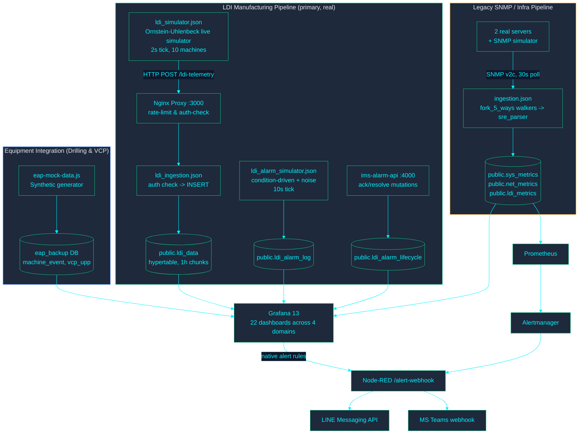

<!-- GLOBAL_NAV -->

  <a href="../../README.md"> <b>Home</b></a> &nbsp;|&nbsp;
  <a href="../README.md"> <b>Docs Index</b></a>

 

 

  <b>English</b> |
 <a href="../../th/docs/architecture/ARCHITECTURE.md"> <b>ไทย</b></a> |
 <a href="../../zh-CN/docs/architecture/ARCHITECTURE.md"> <b>简体中文</b></a>
 

# IMS System Architecture

> **Audience:** System Architects, SREs, and Backend Developers.
> **Objective:** Single source of truth for system topology, data flow, and operational architecture.
> **Provenance:** Verified against the live system on 2026-08-05; container inventory, alerting, dashboards and CI gates re-verified against `main` on 2026-09-26. For actual runtime logs and screenshots proving the statements below, see the **[Evidence Index](../evidence/INDEX.md)**.

---

## System Context

IMS is a Docker Compose stack with **two independent telemetry pipelines** feeding one shared TimescaleDB, visualized across **22 Grafana dashboards** with alerting through both Grafana's native alert engine and Prometheus/Alertmanager.

```mermaid
%%{init: {'theme': 'base', 'themeVariables': { 'primaryColor': '#1e293b', 'primaryTextColor': '#00F2FE', 'primaryBorderColor': '#10B981', 'lineColor': '#00F2FE', 'secondaryColor': '#0f172a', 'tertiaryColor': '#0f172a', 'clusterBkg': '#030407', 'clusterBorder': '#00F2FE'}}}%%
flowchart TB
 subgraph LDI ["LDI Manufacturing Pipeline (primary, real)"]
  SIM["ldi_simulator.json\nOrnstein-Uhlenbeck live simulator\n2s tick, 10 machines"] -->|"HTTP POST /ldi-telemetry"| PROXY["Nginx Proxy :3000\nrate-limit & auth-check"]
  PROXY --> ING["ldi_ingestion.json\nauth check -> INSERT"]
  ING --> LDIDATA[("public.ldi_data\nhypertable, 1h chunks")]
  ALMSIM["ldi_alarm_simulator.json\ncondition-driven + noise\n10s tick"] --> ALARMLOG[("public.ldi_alarm_log")]
  ALARMAPI["ims-alarm-api :4000\nack/resolve mutations"] --> ALARMLC[("public.ldi_alarm_lifecycle")]
 end

 subgraph LEGACY ["Legacy SNMP / Infra Pipeline"]
  DEV["2 real servers\n+ SNMP simulator"] -->|"SNMP v2c, 30s poll"| NR["ingestion.json\nfork_5_ways walkers -> sre_parser"]
  NR --> SYSMETRICS[("public.sys_metrics\npublic.net_metrics\npublic.ldi_metrics")]
 end

 subgraph EAP ["Equipment Integration (Drilling & VCP)"]
  MOCK["eap-mock-data.js\nSynthetic generator"] --> EAPDB[("eap_backup DB\nmachine_event, vcp_upp")]
 end

 LDIDATA --> GRAFANA["Grafana 13\n22 dashboards across 4 domains"]
 ALARMLOG --> GRAFANA
 ALARMLC --> GRAFANA
 SYSMETRICS --> GRAFANA
 EAPDB --> GRAFANA
 SYSMETRICS --> PROM["Prometheus"]
 GRAFANA -->|"native alert rules"| NRWEBHOOK["Node-RED /alert-webhook"]
 PROM --> AM["Alertmanager"] --> NRWEBHOOK
 NRWEBHOOK --> LINE["LINE Messaging API"]
 NRWEBHOOK --> TEAMS["MS Teams webhook"]

 style LDI fill:#1e293b,stroke:#10B981,color:#e2e8f0
 style LEGACY fill:#1e293b,stroke:#F59E0B,color:#e2e8f0
 style EAP fill:#1e293b,stroke:#3B82F6,color:#e2e8f0
```

**Why two pipelines exist:**

- **Legacy SNMP Pipeline (`ingestion.json`):** The system's original design. Polls SNMP devices, parses via a stateful `sre_parser`, and inserts into `sys_metrics` / `net_metrics` / `ldi_metrics`.
- **LDI Manufacturing Pipeline (`ldi_data`):** Added later for higher-fidelity telemetry via HTTP POST. Required because manufacturing dashboards need per-sample PE/JE/Cpk precision that the synthetic `ldi_metrics` table could not support.

> [!NOTE]
> **Every Grafana dashboard's LDI process content reads from `ldi_data`, not `ldi_metrics`.** While `ldi_metrics` still receives data, LDI-specific columns (`throughput`, `power_watt`, `vibration`) are mathematically constrained to `0` for LDI-class devices. See "System Constraints & Technical Boundaries" below.

---

## Container Inventory

| Service             | Container              | Purpose                                                                                                                                                                                                                                  |
| ------------------- | ---------------------- | ---------------------------------------------------------------------------------------------------------------------------------------------------------------------------------------------------------------------------------------- |
| `timescaledb`       | `ims-timescaledb`      | PostgreSQL + TimescaleDB — all persistent storage                                                                                                                                                                                        |
| `pgbouncer`         | `ims-pgbouncer`        | Transaction-mode connection pooler in front of TimescaleDB                                                                                                                                                                               |
| `node-red`          | `ims-node-red`         | Both telemetry pipelines (simulators + ingestion) and the alert-delivery flow                                                                                                                                                            |
| `grafana`           | `ims-grafana`          | Dashboards, provisioned alert rules, native alerting. No host port of its own — reachable only through `proxy` (see below).                                                                                                              |
| `proxy`             | `ims-proxy`            | nginx reverse proxy; the only host-published entry point to Grafana and `alarm-api`. Gates `/alarm-api/` behind an `auth_request` check against Grafana's own session (`proxy/nginx.conf`) — see `SECURITY_MODEL.md`.                    |
| `alarm-api`         | `ims-alarm-api`        | Write path for `public.ldi_alarm_lifecycle` (Acknowledge/Resolve, called from `IMS LDI - Alarm Console`). No host port; reachable only via `proxy`. Connects to Postgres as the least-privilege `alarm_api_writer` role (migration 078). |
| `renderer`          | `ims-grafana-renderer` | External `grafana-image-renderer` service (PNG export for alerts/reports)                                                                                                                                                                |
| `prometheus`        | `ims-prometheus`       | Scrapes `sys_metrics`-adjacent exporters and Node-RED health; evaluates its own alert rules                                                                                                                                              |
| `alertmanager`      | `ims-alertmanager`     | Routes Prometheus alerts to Node-RED's `/alert-webhook`                                                                                                                                                                                  |
| `blackbox-exporter` | (blackbox)             | HTTP/TCP/ICMP probes for SLA monitoring                                                                                                                                                                                                  |
| `snmpsim`           | (snmpsim)              | Simulated SNMP agent for the legacy pipeline's dev/test targets                                                                                                                                                                          |
| `db-migrate`        | `ims-db-migrate`       | One-shot migration runner (`scripts/migrate-entrypoint.sh`), gates `node-red` and `alarm-api` startup                                                                                                                                    |
| `factory-twin-3d`   | `ims-factory-twin-3d`  | Floor 1 digital twin (Express, port 4100 internal). No host port; reachable only via `proxy` at `/factory-twin-3d/` behind the same `auth_request` gate. Read-only: writes nothing to the database. |
| `observability-archiver` | `ims-observability-archiver` | Periodic archive of container/DB observability snapshots to `./ops-logs`; mounts the Docker socket read-only. |
| `pgadmin`           | `ims-pgadmin4`         | Database administration UI (`dpage/pgadmin4`), not on the runtime data path. |

Internal-only services (TimescaleDB, PgBouncer, SNMP simulator, Grafana, alarm-api, factory-twin-3d, renderer) are never exposed to the host directly. Host ports: `proxy` on `${GRAFANA_PORT:-3000}` (all interfaces — the single UI entry point, fronting Grafana, alarm-api, the twin and Node-RED's `/ldi-telemetry` + `/inject`), `pgadmin` on `5050` (all interfaces), and Node-RED (1880), Prometheus (9090), Alertmanager (9093) and Blackbox (9115) bound to `127.0.0.1` only.

---

## LDI Manufacturing Pipeline (the one every dashboard actually uses)

1. **`ldi_simulator.json`** ("LDI Live Simulator" tab) runs an Ornstein-Uhlenbeck mean-reverting process per machine (10 simulated LDI machines across 3 processes: DF INNER, DF OUTER, SM) on a 2-second tick, and POSTs batches to `/ldi-telemetry`.
2. **`ldi_ingestion.json`** ("IMS LDI Ingestion" tab) receives the POST, checks the `x-api-key` header against `INGEST_API_KEY`, and inserts into `public.ldi_data`.
3. **`ldi_alarm_simulator.json`** ("LDI Alarm Simulator" tab) runs on a 10-second tick. Alarm codes with a known real-world parameter link (thermal/humidity, PE/JE registration error, scan-speed) are condition-driven — they only fire when the corresponding telemetry is actually out of spec on a fresh read, using the same thresholds `v_ldi_alarm_context` (migration 045) evaluates RCA against. Codes with no known parameter link (calibration faults, imaging device faults, etc.) are drawn from a weighted-random noise pool matching real historical frequency. `VACUUM` (alarm code `91009`) is deliberately noise-only: the recipe-constant `air_vacuum` values for every machine already sit inside `flag_vac_out_of_spec`'s "out of spec" range regardless of timing, so no alarm-timing strategy can produce a real correlation signal for it — a flag-threshold/recipe mismatch, not something to fake a fix for in the simulator.
4. Both feed `public.ldi_data` / `public.ldi_alarm_log`, which every LDI Grafana dashboard and the RCA Truth Test panel read from.

**Yield**, specifically, has a single source of truth: `public.f_ldi_yield_pct()` (migration 046) — worst-case of PE-pass-rate and JE-pass-rate against each row's own `pe_setting`/`je_setting` (not a hardcoded threshold). Both NOC Overview and Manufacturing call this same function, so they cannot structurally disagree on the number.

**Cpk**, the process-capability formula (`LEAST((limit-mean)/(3*sigma), (mean+limit)/(3*sigma))`, sample stddev), is independently implemented in 5 places (3 dashboard panels + `v_machine_spc_fleet` + `v_machine_spc_ranking`) rather than shared — `tests/e2e/golden-dataset-spc.js` runs a hand-computed synthetic dataset through all 5 and asserts they agree, as a standing CI gate against this drifting apart again.

---

## Legacy SNMP / Infrastructure Pipeline

`ingestion.json` ("IMS Ingestion Pipeline" tab) polls registered devices via SNMP v2c every 30 seconds:

- Device registry loads from `public.devices` into `global.deviceRegistry` (refreshed every 5 minutes).
- `fork_5_ways` dispatches parallel walkers (CPU, Storage, Network, Temperature, LDI) per device.
- `sre_parser` ("SRE AIOps Parser v9 Batch") maintains per-device state in flow context, buffers rows, and batch-inserts into `sys_metrics` / `net_metrics` / `ldi_metrics` independently per table (a partial walker failure doesn't block unrelated data).
- A k6-style synthetic load simulator (`inject_fleet` -> `generate_fleet_targets` -> `pace_limiter` -> the same fork/parser path) also feeds this same pipeline for load-testing purposes.

This pipeline is what actually powers NOC Overview's infrastructure panels (CPU/RAM/Disk/Temperature of the 2 real servers, `<linux-server>` / `<windows-server>`) and the AIOps & Capacity Forecast dashboard. It is **not** what powers any LDI process/quality panel — see the pipeline split above.

---

## Database Schema (as of migration 047)

> Column counts, the full view/materialized-view/CAGG list, and the current applied-migration count are auto-generated in **[DATABASE_SCHEMA.md](DATABASE_SCHEMA.md)** (`node scripts/generate-schema-inventory.js`, CI-checked against the live database). This table adds the "why" -- what feeds each table and what it's for -- that the generator can't infer from `information_schema` alone.

| Table                                         | Type                   | Fed by                             | Purpose                                                                                                                          |
| --------------------------------------------- | ---------------------- | ---------------------------------- | -------------------------------------------------------------------------------------------------------------------------------- |
| `devices`                                     | Table                  | manual/seed                        | Registry of every monitored entity (`device_type`: `ldi` or `server`)                                                            |
| `ldi_data`                                    | Hypertable, 1h chunks  | `ldi_ingestion.json`               | Real LDI process telemetry — PE/JE, temperature, humidity, vacuum, scan speed, per-sample. Source for every LDI dashboard panel. |
| `ldi_alarm_log`                               | Hypertable, 7d chunks  | `ldi_alarm_simulator.json`         | Per-alarm-event rows, condition-correlated as of this session's simulator fix                                                    |
| `ldi_alarm_ms_code`                           | Table                  | migration 036 (mock seed)          | Master alarm code reference (20 real production codes, functional descriptions only — not the vendor catalog)                    |
| `sys_metrics` / `net_metrics` / `ldi_metrics` | Hypertables, 1d chunks | `ingestion.json` (legacy pipeline) | Infra telemetry + the k6-synthetic LDI metrics table with known gaps (see below)                                                 |
| `schema_migrations`                           | Table                  | `scripts/migrate-entrypoint.sh`    | Migration tracking — `(version, filename, applied_at)`, no `checksum` column in the canonical shape                              |

**Views worth knowing:** `v_ldi_alarm_context` (migration 045, joins alarms to the telemetry reading within 5 minutes prior — this is what the RCA Truth Test correlates against), `v_machine_spc_fleet` / `v_machine_spc_ranking` (Cpk, fleet-wide vs. per-selection), `v_fleet_health` / `v_fleet_score` (migration 047, scoped to `device_type='server'` only — this previously included LDI machines' permanently-zero stub rows, diluting the infra health score).

---

## Migration Governance

**One canonical migration runner**: `scripts/migrate-entrypoint.sh`. Docker Compose's one-shot `db-migrate` service runs it automatically (`node-red` depends on `db-migrate: condition: service_completed_successfully`); `scripts/migrate.sh` is a thin wrapper (`docker compose run --rm db-migrate`) for a manual re-run without bringing up the rest of the stack.

This repo previously had 3 independent migration runners with different tracking behavior (`migrate.sh` had its own loop with an unused `checksum` column, `migrate-entrypoint.sh` had none, `init-migrations.sh` had no tracking table at all and guessed via error-text matching) — whichever ran first on a given database silently determined that database's actual `schema_migrations` shape. This was the root cause of at least one confirmed tracking-drift incident (migration 038, found live-applied with its tracking row still unmarked). `init-migrations.sh` has been removed; there is now exactly one runner and one tracking shape.

All migrations should be idempotent (`CREATE ... IF NOT EXISTS`, `DO $$ ... IF EXISTS ...` guards for renames, etc.) so a re-run against an already-migrated database is always a safe no-op. **Migration 020 is a cautionary example**: it originally began with an unconditional `DROP TABLE ldi_data CASCADE`, safe only during early development before this project had real data — found still marked as applied-but-never-run against a database holding 284k+ real rows. Rewritten to create-if-missing and tune-in-place instead of dropping.

Migration 048 completes what 020 started: `ldi_data`'s `DOUBLE PRECISION` → `REAL` conversion, which silently no-op'd on compressed chunks. It decompresses, drops/rebuilds the dependent continuous-aggregate chain (`ldi_data_1m` → `15m` → `1h`, plus `ldi_data_hourly`) and 7 dependent plain views, converts the columns, and refreshes every CAGG from raw data — guarded so it's a no-op if the columns are already `REAL` (true on any fresh deployment via `postgres/init/001`). Migration 049 drops the deprecated `alert_rules`/`alert_history` tables (see System Constraints & Technical Boundaries). Migration 050 promotes the RCA Lift/Confidence logic to a real shared view, `v_ldi_rca_recent_window`.

Migration 064 converts `v_machine_spc_fleet` and `v_ldi_rca_recent_window` from plain views to materialized views (identical names and output columns, so no dashboard changes were needed for the 4 panels reading them), refreshed every 60s via TimescaleDB's built-in generic job scheduler (`add_job` — this stack has no `pg_cron` extension installed, so that wasn't an option). It also extracts the Engineering Analytics "RCA Truth Test" panel's inline CTE into a new materialized view, `v_ldi_rca_truth_test`, which _did_ require a one-line panel SQL change (now `SELECT ... FROM v_ldi_rca_truth_test` instead of recomputing the CTE chain per read). Both changes were driven by measured `EXPLAIN ANALYZE` numbers, not guesswork: LDI-suite P95 query latency went from 60.12ms to 5.30ms.

---

## Alerting

Two independent alert-evaluation engines both funnel into the same Node-RED delivery flow:

1. **Grafana native alerting** (`monitoring/grafana/provisioning/alerting/rules.yml`, `ldi-rules.yml`) — machine-level rules evaluated directly against TimescaleDB by Grafana's own scheduler: infrastructure thresholds (High CPU/RAM/Disk Usage, High Temperature, Interface Down, network errors/drops, bandwidth forecast), Z-score anomalies, and LDI rules (alarm-in-database, PE/JE drift, Cpk below 1.33, temperature above spec, machine offline, vibration critical). The single contact point `ims-node-red-webhook` posts to `http://node-red:1880/alert-webhook`.
2. **Prometheus + Alertmanager** — platform rules in `monitoring/prometheus/rules/ims-alerts.yml` (Prometheus/Alertmanager/targets up, blackbox `ServiceDown`/latency/SLA/TLS expiry, `Watchdog`, and the Node-RED pipeline metrics `ims_pipeline_*` / `ims_circuit_breaker_state`), routed by Alertmanager (`monitoring/alertmanager/alertmanager.yml`) with severity-based grouping and three inhibition rules (critical suppresses warning on the same device).

**Both paths converge on `nodered_data/flows/alerting.json`** ("IMS Alerting Pipeline" tab), which receives both webhooks at `POST /alert-webhook`, formats the alert, and fans out to:

- **LINE Messaging API** (not LINE Notify — that API was discontinued by LINE in 2025 and is not used here) via `LINE_CHANNEL_ACCESS_TOKEN` + `LINE_USER_ID`.
- **MS Teams** via `TEAMS_WEBHOOK_URL`, as an Adaptive Card.

If either credential is unset, the corresponding delivery function calls `node.error()` (visible in the flow's "Alert Delivery Failure" debug node and via a persistent red status indicator on the node itself) rather than silently dropping the alert — but delivery still doesn't happen until real credentials are configured in `.env`. A previous direct-to-Slack contact point pointing at a placeholder URL was removed rather than left failing on every critical alert.

---

## Dashboard Inventory

> Panel counts and descriptions are auto-generated in **[DASHBOARD_INVENTORY.md](DASHBOARD_INVENTORY.md)** (`node scripts/generate-dashboard-inventory.js`, CI-checked). This table adds the architectural "why" -- scope boundaries and cross-references -- that a generator can't infer from JSON alone; keep the UID/Title columns here in sync with the generated file when a dashboard is added or renamed.

| Domain | UID | Title | Scope |
| :--- | :--- | :--- | :--- |
| **01 Drilling** | `ims-drilling-fleet-overview` | IMS Drilling - Fleet Overview | Fleet-wide drill status, spindle rpm, feed rates, active machine events |
| **01 Drilling** | `ims-drilling-shift-production` | IMS Drilling - Shift Production | Shift-by-shift panel hit counts, lot throughput, and operational efficiency |
| **01 Drilling** | `ims-drilling-machine-investigation` | IMS Drilling - Machine Investigation | Deep drilldown on individual spindle vibration, tool hit counts, and motor load |
| **01 Drilling** | `ims-drilling-anomaly-analysis` | IMS Drilling - Anomaly & Root Cause | Spindle vibration excursions, broken tool detection, and alarm correlation |
| **02 LDI** | `ims-ldi-manufacturing` | IMS LDI - Manufacturing Command Center | Full 4-layer RCA dashboard: executive KPIs, machine telemetry, production context, alarm stream |
| **02 LDI** | `ims-ldi-operator-andon` | IMS LDI - Operator Andon Board | Factory-floor kiosk, read-only; zero-scroll at 1920x1080 and 3840x2160 (1280x720 unsupported since PR #22) |
| **02 LDI** | `ims-ldi-alarm-console` | IMS LDI - Alarm Console | The only interactive dashboard: Acknowledge/Resolve through `alarm-api` into `public.ldi_alarm_lifecycle` |
| **02 LDI** | `ims-ldi-alarm-response` | IMS LDI - Alarm Response (MTTA/MTTR) | Response-time KPIs computed from the real alarm lifecycle |
| **02 LDI** | `ims-ldi-alarm-dictionary` | IMS LDI - Alarm Dictionary | Reference lookup of a vendor alarm code plus recent occurrences; reached through drill-down links |
| **02 LDI** | `ims-ldi-factory-digital-twin` | IMS LDI - Factory Digital Twin | Canvas floor view of the reporting LDI machines grouped by zone (`public.devices.location`) |
| **02 LDI** | `ims-ldi-engineering-analytics` | IMS LDI - Engineering Analytics & SPC | Cpk/SPC ranking, RCA Truth Test, PE/JE distributions |
| **02 LDI** | `ims-ldi-machine-snapshot` | IMS LDI - Machine Snapshot | Per-event drill-down (click an alarm/log to inspect) |
| **02 LDI** | `ldi-data-readiness` | LDI Data Readiness & Integration Gaps | Self-auditing data-quality dashboard (board-key duplication, coverage %, alarm-master match rate) |
| **02 LDI** | `ims-easy-overview` | IMS Easy Overview | Zero-config whole-fleet glance built entirely from shared views/functions (`v_ldi_machine_latest_full`, `v_ldi_alarm_context`, `f_ldi_yield_pct`, `v_machine_spc_fleet`) -- no template variables to set |
| **03 Platform** | `ims-noc-overview` | IMS NOC Overview | Infrastructure only (servers + network) — LDI process content lives elsewhere |
| **03 Platform** | `ims-engineering` | IMS Engineering Drill-Down | Infra-focused: CPU/RAM/storage/network per server, LDI throughput/quality (legacy pipeline) |
| **03 Platform** | `ims-capacity` | IMS AIOps & Capacity Forecast | Days-until-full/saturation regression forecasts (infra) |
| **03 Platform** | `ims-meta-monitoring` | IMS Pipeline Health & Meta-Monitoring | Ingestion pipeline's own health (rows/sec, batch success rate, retry queue depth) |
| **03 Platform** | `ims-ingestion-latency` | IMS Ingestion Latency | Read-only source_ts → ingest_ts latency evidence from migration 081's `ingest_ts` columns |
| **04 VCP** | `ims-vcp-overview` | IMS VCP - Fleet Overview | Plating line overview: hoist cycle times, active line speed, total square meters processed |
| **04 VCP** | `ims-vcp-operations-console` | IMS VCP - Operations Console | Real-time rectifier currents, chemical bath actual vs preset temperatures, dosing pump status |
| **04 VCP** | `ims-vcp-realtime-wall` | IMS VCP - Real-Time Wall | High-visibility wall kiosk for plating operators; out-of-spec chemical bath alerts |

NOC Overview was split from LDI/manufacturing content this session (it previously duplicated Manufacturing's Yield panel) — infrastructure and manufacturing concerns are deliberately kept on separate dashboards now, not blended on one "overview" page. Drilling and VCP dashboards are isolated to the `eap_backup` data tier.

---

## System Constraints & Technical Boundaries

Documented here for operational clarity and architectural visibility:

- **`ldi_metrics.throughput` / `.power_watt` / `.vibration` are always `0` for every LDI device** (confirmed across ~2,300+ rows, all 10 machines). These parameters are intentionally reserved for future integration and currently stream as 0. The `ims-ldi-vibration-critical` alert rule is paused accordingly. This does **not** affect any dashboard reading from `ldi_data` (the primary pipeline) — only the legacy `ldi_metrics` table and anything querying it directly.
- **Board-key duplication on LDI-01/LDI-04** (157 / 121 duplicate `(mo, board_no)` pairs respectively, 0 on the other 8 machines) is root-caused: random `MO-NNNNN` string collisions across separate job cycles (birthday paradox, given only ~90,000 possible 5-digit values and 175-257 draws per machine over the dataset's history) — not a real double-counted board. The random ID space was widened 10x (6 digits) in both the live simulator and the historical batch generator to support larger cardinality going forward.
- **Real alert delivery (LINE/Teams) requires external credential provisioning** — `LINE_CHANNEL_ACCESS_TOKEN`, `LINE_USER_ID`, `TEAMS_WEBHOOK_URL` in `.env` are empty by default. The pipeline executes validation end-to-end and logs delivery status, pending operational credential configuration.
- **VACUUM (91009) RCA correlation calibration completed 2026-08-07**. The out-of-spec threshold is recalibrated around the simulator's own DF INNER recipe range (`air_vacuum > -8 OR < -30`, migration 057 — simulator-derived, not a sourced vendor spec), DF OUTER/SM correctly send `NULL` instead of a `0.0` "not applicable" sentinel (migration 054, backfilled to historical rows in migration 060), and the telemetry generator injects rare weak-vacuum fault events so there's a real excursion to correlate against (`nodered_data/flows.json`, `ldisim_gen`). **Lift figures reflect current operational state.** `docs/architecture/LDI_RCA_GUIDE.md` has the current methodology and a dated snapshot table; re-run `SELECT * FROM public.v_ldi_rca_truth_test` for today's numbers.
- **MOTION (70004) correlates positively but may require extended sampling to meet the n≥30 confidence floor** in `v_ldi_rca_recent_window` (the 24h rolling-window operational view — `v_ldi_rca_truth_test`, the full-dataset validation view, usually has enough events) — scan-speed excursions are correctly correlated, just statistically rarer than thermal/humidity/alignment events in the current recipe distribution. The category earns "OK" confidence once enough events accumulate in whatever window is being read. See `LDI_RCA_GUIDE.md` for current figures.
- **Retention policy configurations differ between initialization vectors (live-verified 2026-08-10)** — `postgres/init/001` sets `sys_metrics`/`net_metrics`/`ldi_metrics` to 30-day retention; `database/migrations/016-aggressive-retention.sql` sets the same tables to 14 days. The live database matches the 30-day `postgres/init/` value, meaning this deployment was bootstrapped fresh rather than built by applying every migration in sequence. `postgres/init/032` also sets `ldi_data` (180d) and `ldi_alarm_log` (365d) retention. See `docs/architecture/DATA_RETENTION.md` for the full live policy table.
- **Golden-dataset SPC regression gate verification optimized (2026-08-12).** `tests/e2e/golden-dataset-spc.js` inserts synthetic data inside a transaction that always rolls back, but migration 064 converted `v_machine_spc_fleet` from a plain view to a materialized view, which structurally can't see uncommitted-transaction inserts (a materialized view is a separate physical snapshot, not a live re-execution of its defining query). Fixed by inlining the view's exact formula into the test (the same pattern already used for the other 3 panel-level checks in that suite) instead of querying the live materialized object. All 7/7 assertions pass now. See `docs/architecture/LDI_SPC_GUIDE.md`.
- **`restart: unless-stopped` container recovery behavior observed during DR testing (2026-08-10)** — confirmed twice via live `docker events` streaming: only `kill`/`die` events fired, no automatic `start`, despite `docker inspect` confirming the restart policy was correctly applied to the container. A cascading finding from the same drill: after a manual recovery, LDI ingestion's pool-reconnect watchdog (`ldiDbConnFailureStreak`, built earlier this session specifically for this failure mode) did not trigger an automatic Node-RED restart within ~6 minutes — only a manual `docker restart ims-node-red` fixed it. See `IMS_MANUFACTURING_PLATFORM_V2.md`'s DR Test Evidence (Drill 2) for the full timeline. Further optimization of the watchdog counter threshold is slated for future operational cycles.
- **Domain boundaries and future manufacturing process types are documented separately, not in this file** — see `docs/architecture/OWNERSHIP.md` for the infrastructure/manufacturing split (`monitoring/grafana/dashboards/{infrastructure,manufacturing}/`, `CODEOWNERS`-enforced) and `docs/architecture/MANUFACTURING_DOMAIN.md` for how a future process type (AOI, plating, etching, drilling) onboards without touching LDI's schema or dashboards. `docs/architecture/EAP_ARCHITECTURE.md` documents the two real equipment adapters (SNMP, HTTP/JSON) and an unimplemented SECS/GEM adapter contract. `docs/architecture/IMS_MANUFACTURING_PLATFORM_V2.md` is the rollout plan and evidence log all three came from.
- **The alarm severity taxonomy utilizes ISA-18.2-style severity categorization.** The 4-tier Critical/Major/Minor/Warning naming and its dedicated color tokens (`GRAFANA_DESIGN_SYSTEM.md` §2.1) borrow ISA-18.2's severity vocabulary. `ldi_alarm_log` records severity state for all alarms. If a stakeholder-facing doc needs to describe alarm management, it should state "ISA-18.2-style severity taxonomy." ISA-**101** (a separate standard, HMI design) is correctly and narrowly claimed for the Operator Andon Board's kiosk layout only — not affected by this note.

---

## Governance / CI Gates

These automated gates run in CI (`.github/workflows/ci.yml`): the lint gates in the `lint` job, the live-database gates in the `integration-chaos` job. Each catches a different failure class a human reviewer would otherwise have to check by hand:

| Gate                       | Script                                       | What it proves                                                                                                                 |
| -------------------------- | -------------------------------------------- | ------------------------------------------------------------------------------------------------------------------------------ |
| Dashboard structure        | `tests/lint/dashboard-linter.js`             | Grid alignment, standard panel heights, kiosk no-scroll ceilings (per-dashboard, e.g. `ims-ldi-operator-andon`: 20 grid units) |
| RCA category coverage      | `tests/lint/rca-mapping-coverage.js`         | ≥70% of master alarm codes are mapped to an RCA category, and every dashboard reference is valid                               |
| Query budget (structural)  | `tests/lint/query-budget-linter.js`          | No panel range-scans raw `ldi_data` instead of the `_1m`/`_15m`/`_1h` CAGG tiers                                               |
| Query budget (real timing) | `tests/e2e/query-timing-check.js`            | Real server-side `EXPLAIN ANALYZE` timing, P95 < 80ms, against the live DB                                                     |
| Panel data correctness     | `tests/e2e/panel-data-check.js`              | Every panel's _actually-resolved_ SQL runs against a live DB and returns real rows with a proper `time` column                 |
| Schema drift               | `scripts/migrate.sh` (asserted `Pending: 0`) | The migrations directory and the live `schema_migrations` table agree                                                          |
| Orphan objects             | `tests/lint/orphan-object-linter.js`         | Every live DB table/view is referenced by at least one dashboard, alert rule, flow, or migration — not silently unused         |
| Golden-dataset SPC         | `tests/e2e/golden-dataset-spc.js`            | All 5 independent Cpk/Cp implementations agree with the textbook formula on a known synthetic dataset                          |

Color tokens (`GRAFANA_DESIGN_SYSTEM.md`): every threshold step and value-mapping color that conveys machine/alarm status uses an approved token (`APPROVED_TOKENS` in `tests/lint/dashboard-linter.js`, Check 15) — ok `#22C55E`, warning `#F59E0B`, critical `#EF4444`, info `#00F2FE`, accent `#3B82F6`, no_data `#64748B`, forecast `#4A5568`, severity-minor `#EAB308`, and ok-bg `#15803D` for the single Andon background exception. Decorative colors (graph-series differentiation, backgrounds, borders, brand accents) are intentionally exempt — a dashboard can't be built from a handful of saturated colors alone.

Browser-level gates also run in CI: the `factory-twin-regression` job (`tests/playwright/factory-twin-regression.js`, failure-mode and inspector E2E suites) and the `visual-regression` job (`tests/playwright/ldi-responsive-regression.js`, zero-scroll at 1920 and 3840 px). The UI baseline under `tests/playwright/ui-visual-baseline/` is committed; `tests/playwright/dashboard-visual-regression.js` still only captures screenshots for documentation and asserts nothing.

---

## References

| Resource                   | Link                                                        |
| -------------------------- | ----------------------------------------------------------- |
| TimescaleDB Documentation  | <https://docs.timescale.com/>                               |
| Node-RED Documentation     | <https://nodered.org/docs/>                                 |
| Grafana Documentation      | <https://grafana.com/docs/>                                 |
| Prometheus Documentation   | <https://prometheus.io/docs/>                               |
| Alertmanager Documentation | <https://prometheus.io/docs/alerting/latest/configuration/> |
| LINE Messaging API         | <https://developers.line.biz/en/docs/messaging-api/>        |

Related docs in this repo: `GRAFANA_DESIGN_SYSTEM.md` (color/token conventions), `../operations/TROUBLESHOOTING.md`, `../archive/IMS_FULL_SYSTEM_AUDIT.md` (baseline system audit), `DASHBOARD_INVENTORY.md` and `DATABASE_SCHEMA.md` (generated inventories).
