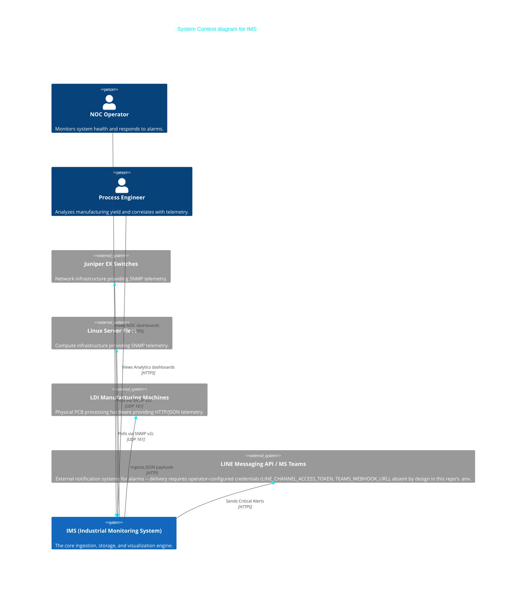
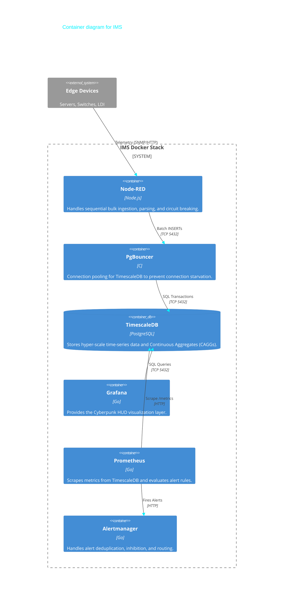
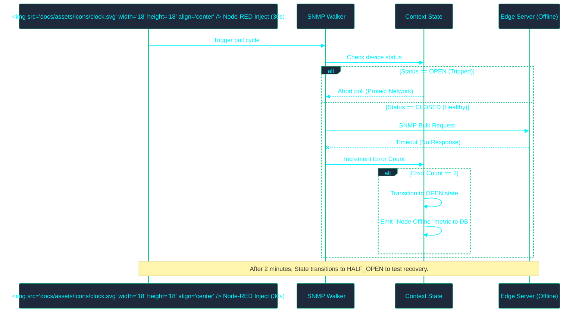

# ️ IMS Visual Architecture Diagrams

> [!NOTE]
>
> > These diagrams are generated dynamically using Mermaid.js. They provide a visual, structural overview of the IMS ecosystem.

---

## 1. System Context Diagram (C4 Model - Level 1)

This diagram shows how external actors interact with the IMS system.

---

## 2. Container Diagram (C4 Model - Level 2)

This diagram breaks down the IMS system into its deployable Docker containers.

---

## 3. Dynamic Flow Diagram: The Circuit Breaker Pattern

This diagram explains the fault-tolerance mechanism when a server goes offline.

