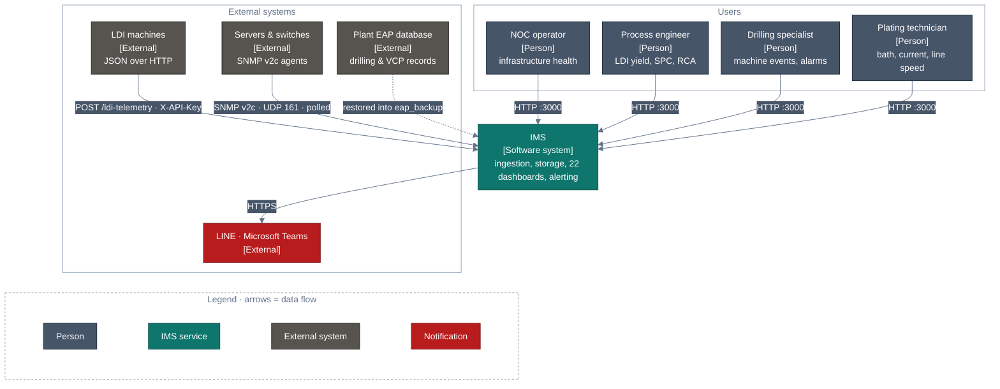
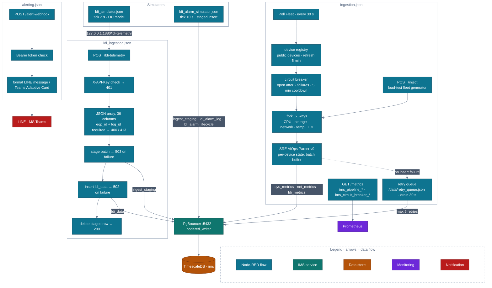
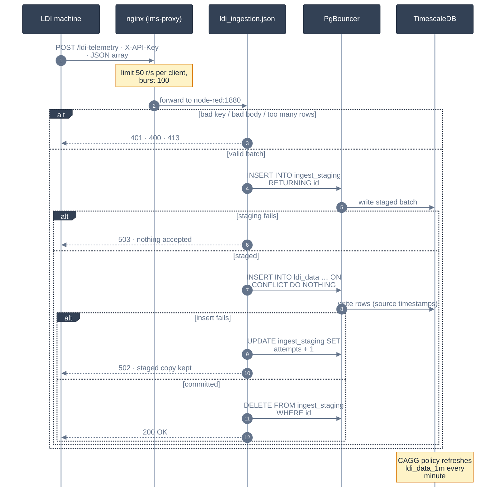
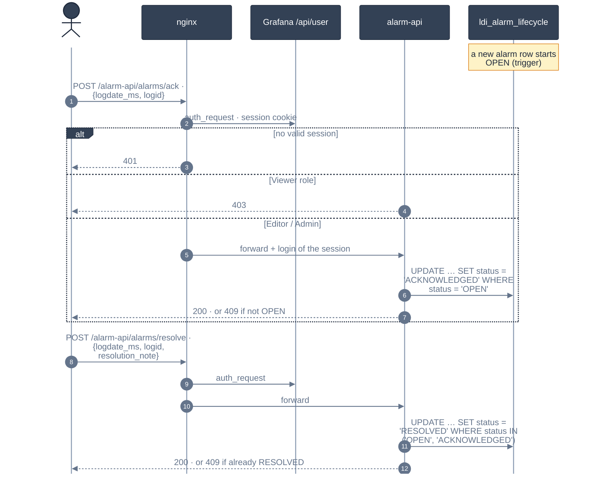
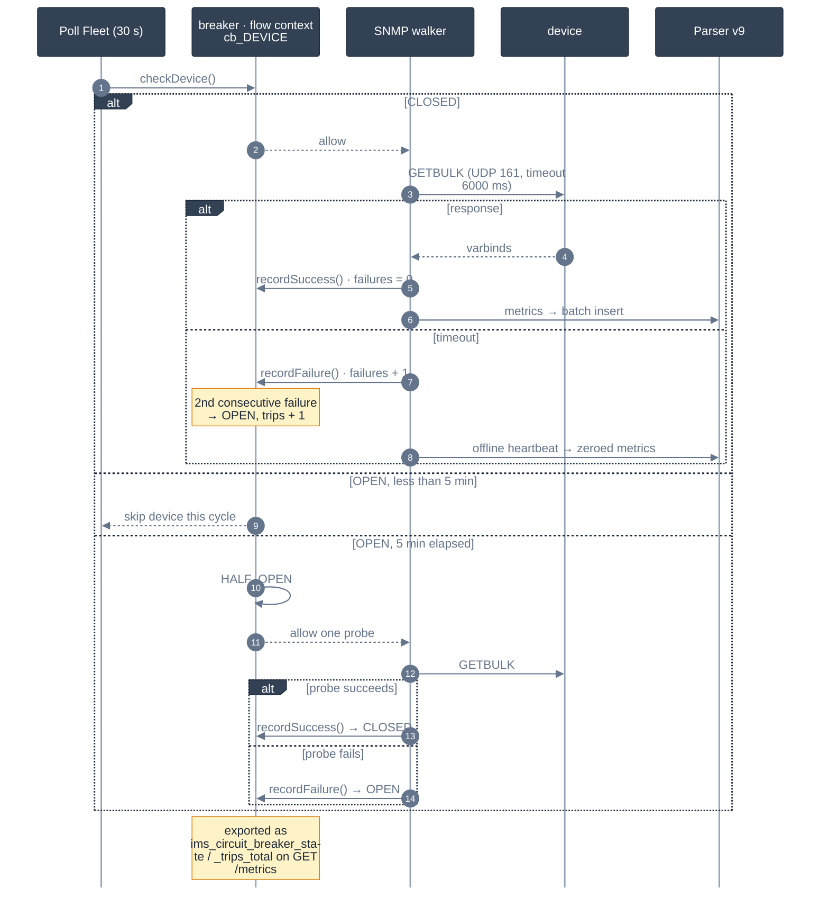
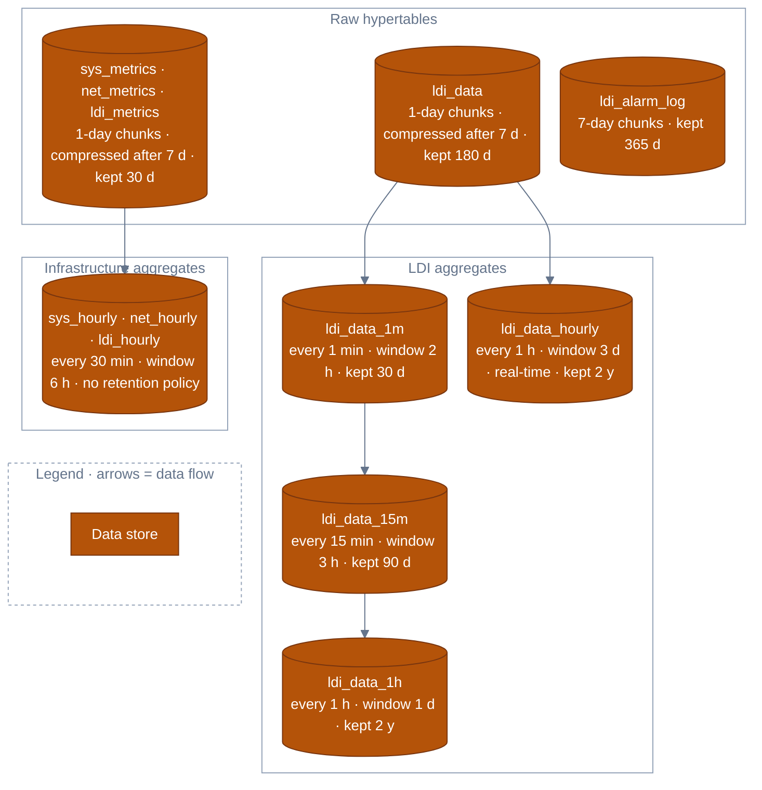
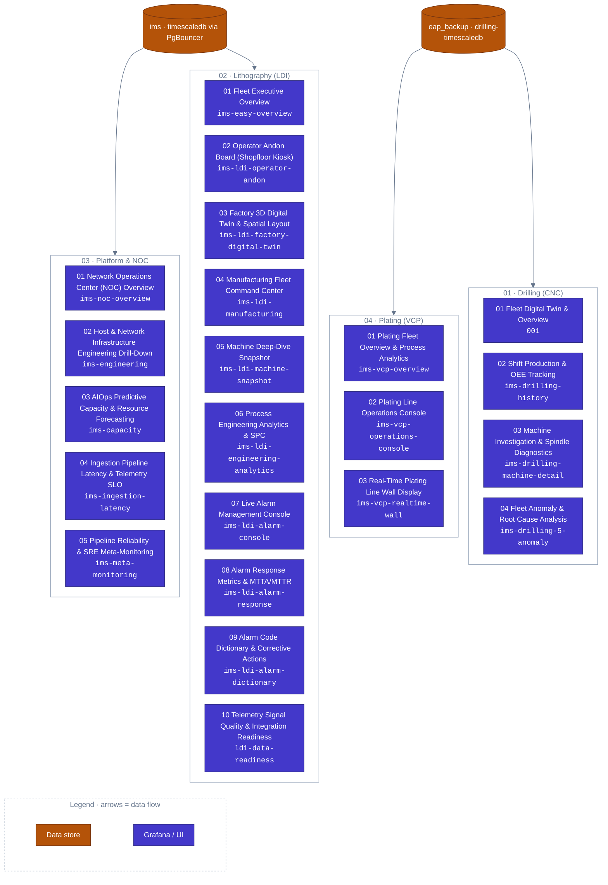

<!-- GLOBAL_NAV -->
<div align="right">
  <a href="../../README.md"> <b>Home</b></a> &nbsp;|&nbsp;
  <a href="../README.md"> <b>Docs Index</b></a>
</div>
<br/>

<div align="center">
  <h1>IMS Visual Architecture & Topology Reference</h1>
  <p><b>Comprehensive C4 models, dynamic sequence flows, gateway security topologies, and storage hierarchies for the Industrial Monitoring System</b></p>
  <p>
    <a href="ARCHITECTURE_DIAGRAM.md">English</a> |
    <a href="../../th/docs/architecture/ARCHITECTURE_DIAGRAM.md">ไทย</a> |
    <a href="../../zh-CN/docs/architecture/ARCHITECTURE_DIAGRAM.md">简体中文</a>
  </p>
</div>

---

> [!TIP]
> **Raw Mermaid Definition**: For standalone rendering in IDE plugins or CI pipelines, the raw Mermaid definition is available at [ims-system-architecture.mermaid](ims-system-architecture.mermaid).

## 1. System Context Diagram (C4 Model - Level 1)

The System Context diagram illustrates how human actors, physical manufacturing equipment, enterprise IT servers, network switches, and external notification platforms interact with the core IMS telemetry engine.


```mermaid
%%{init: {"flowchart": {"nodeSpacing": 20, "rankSpacing": 32, "padding": 10, "wrappingWidth": 150, "curve": "basis"}, "sequence": {"wrap": true, "width": 170, "actorMargin": 36, "boxMargin": 8, "noteMargin": 8, "messageMargin": 30, "mirrorActors": false}, "state": {"padding": 6}, "theme": "base", "themeVariables": {"fontFamily": "Inter, Segoe UI, Helvetica, Arial, sans-serif", "fontSize": "14px", "primaryColor": "#334155", "primaryTextColor": "#ffffff", "primaryBorderColor": "#1e293b", "lineColor": "#64748b", "textColor": "#64748b", "secondaryColor": "#475569", "tertiaryColor": "#f1f5f9", "clusterBkg": "transparent", "clusterBorder": "#94a3b8", "titleColor": "#64748b", "edgeLabelBackground": "#475569", "nodeTextColor": "#ffffff", "noteBkgColor": "#fef3c7", "noteTextColor": "#1e293b", "noteBorderColor": "#d97706", "actorBkg": "#334155", "actorTextColor": "#ffffff", "actorBorder": "#1e293b", "actorLineColor": "#94a3b8", "signalColor": "#64748b", "signalTextColor": "#64748b", "labelBoxBkgColor": "#334155", "labelBoxBorderColor": "#1e293b", "labelTextColor": "#ffffff", "loopTextColor": "#64748b", "activationBkgColor": "#e2e8f0", "sequenceNumberColor": "#ffffff", "stateLabelColor": "#ffffff", "compositeBackground": "transparent", "transitionColor": "#64748b", "transitionLabelColor": "#64748b"}}}%%
flowchart TB
  accTitle: C4 level 1: system context
  accDescr: Four user roles use IMS through the browser; IMS receives LDI telemetry over HTTP, polls servers and switches over SNMP, reads the plant drilling and VCP database, and sends alerts to LINE and Microsoft Teams.

  subgraph PEOPLE["Users"]
    NOC["NOC operator<br/>[Person]<br/>infrastructure health"]:::actor
    PE["Process engineer<br/>[Person]<br/>LDI yield, SPC, RCA"]:::actor
    DRL["Drilling specialist<br/>[Person]<br/>machine events, alarms"]:::actor
    VCPT["Plating technician<br/>[Person]<br/>bath, current, line speed"]:::actor
  end

  IMS["IMS<br/>[Software system]<br/>ingestion, storage, 22 dashboards, alerting"]:::app

  subgraph EXT["External systems"]
    LDIM["LDI machines<br/>[External]<br/>JSON over HTTP"]:::ext
    NET["Servers & switches<br/>[External]<br/>SNMP v2c agents"]:::ext
    EAPSRC["Plant EAP database<br/>[External]<br/>drilling & VCP records"]:::ext
    MSG["LINE · Microsoft Teams<br/>[External]"]:::notify
  end

  NOC -->|"HTTP :3000"| IMS
  PE -->|"HTTP :3000"| IMS
  DRL -->|"HTTP :3000"| IMS
  VCPT -->|"HTTP :3000"| IMS
  LDIM -->|"POST /ldi-telemetry · X-API-Key"| IMS
  NET -->|"SNMP v2c · UDP 161 · polled"| IMS
  EAPSRC -.->|"restored into eap_backup"| IMS
  IMS -->|"HTTPS"| MSG

  subgraph LEGEND["Legend · arrows = data flow"]
    direction TB
    subgraph LEGEND_0[" "]
      direction LR
      LG_actor["Person"]:::actor ~~~ LG_app["IMS service"]:::app ~~~ LG_ext["External system"]:::ext ~~~ LG_notify["Notification"]:::notify
    end
  end
  MSG ~~~ LEGEND
  style LEGEND fill:transparent,stroke:#94a3b8,stroke-dasharray:3 3
  style LEGEND_0 fill:transparent,stroke:transparent
  classDef actor fill:#475569,stroke:#1e293b,color:#ffffff,stroke-width:1px
  classDef ext fill:#57534e,stroke:#292524,color:#ffffff,stroke-width:1px
  classDef ingress fill:#1d4ed8,stroke:#1e3a8a,color:#ffffff,stroke-width:1px
  classDef app fill:#0f766e,stroke:#134e4a,color:#ffffff,stroke-width:1px
  classDef flow fill:#0e7490,stroke:#164e63,color:#ffffff,stroke-width:1px
  classDef store fill:#b45309,stroke:#78350f,color:#ffffff,stroke-width:1px
  classDef viz fill:#4338ca,stroke:#312e81,color:#ffffff,stroke-width:1px
  classDef obs fill:#6d28d9,stroke:#4c1d95,color:#ffffff,stroke-width:1px
  classDef notify fill:#b91c1c,stroke:#7f1d1d,color:#ffffff,stroke-width:1px
  classDef future fill:#f8fafc,stroke:#94a3b8,color:#475569,stroke-width:1px,stroke-dasharray:4 3
```

---

## 2. Container Diagram (C4 Model - Level 2)

This diagram details all 16 services within the IMS Docker Compose topology, highlighting inter-container networking, host port bindings, and data paths.


```mermaid
%%{init: {"flowchart": {"nodeSpacing": 20, "rankSpacing": 32, "padding": 10, "wrappingWidth": 150, "curve": "basis"}, "sequence": {"wrap": true, "width": 170, "actorMargin": 36, "boxMargin": 8, "noteMargin": 8, "messageMargin": 30, "mirrorActors": false}, "state": {"padding": 6}, "theme": "base", "themeVariables": {"fontFamily": "Inter, Segoe UI, Helvetica, Arial, sans-serif", "fontSize": "14px", "primaryColor": "#334155", "primaryTextColor": "#ffffff", "primaryBorderColor": "#1e293b", "lineColor": "#64748b", "textColor": "#64748b", "secondaryColor": "#475569", "tertiaryColor": "#f1f5f9", "clusterBkg": "transparent", "clusterBorder": "#94a3b8", "titleColor": "#64748b", "edgeLabelBackground": "#475569", "nodeTextColor": "#ffffff", "noteBkgColor": "#fef3c7", "noteTextColor": "#1e293b", "noteBorderColor": "#d97706", "actorBkg": "#334155", "actorTextColor": "#ffffff", "actorBorder": "#1e293b", "actorLineColor": "#94a3b8", "signalColor": "#64748b", "signalTextColor": "#64748b", "labelBoxBkgColor": "#334155", "labelBoxBorderColor": "#1e293b", "labelTextColor": "#ffffff", "loopTextColor": "#64748b", "activationBkgColor": "#e2e8f0", "sequenceNumberColor": "#ffffff", "stateLabelColor": "#ffffff", "compositeBackground": "transparent", "transitionColor": "#64748b", "transitionLabelColor": "#64748b"}}}%%
flowchart TB
  accTitle: C4 level 2: the 16 containers
  accDescr: All 16 Docker Compose services and how they connect: nginx is the only all-interfaces port; data services sit on ims-internal; monitoring on ims-monitoring; the archiver reaches Docker only through the socket proxy on the isolated ims-docker-api network.

  USER["Users · browser"]:::actor
  EDGE["LDI machines · SNMP devices"]:::ext

  subgraph INGRESS["Host port 3000, all interfaces"]
    PROXY["proxy · nginx 1.31<br/>ims-proxy"]:::ingress
  end

  subgraph APP["Applications · ims-internal"]
    GRAF["grafana 13.1.2<br/>22 dashboards"]:::viz
    RENDER["renderer<br/>image renderer"]:::app
    ALARM["alarm-api :4000<br/>Express"]:::app
    TWIN["factory-twin-3d :4100<br/>Express"]:::app
    NR["node-red :1880<br/>5 flow files"]:::flow
    SNMPSIM["snmpsim<br/>simulated agents"]:::app
  end

  subgraph DATA["Data · ims-internal"]
    MIG["db-migrate<br/>one-shot, migrations 013–093"]:::app
    PGB["pgbouncer :5432<br/>SCRAM"]:::app
    TSDB[("timescaledb :5432<br/>ims · eap_backup")]:::store
    PGADMIN["pgadmin<br/>127.0.0.1:5050"]:::app
  end

  subgraph MONNET["Monitoring · ims-monitoring"]
    PROM["prometheus<br/>127.0.0.1:9090"]:::obs
    AM["alertmanager<br/>127.0.0.1:9093"]:::obs
    BBOX["blackbox-exporter<br/>127.0.0.1:9115"]:::obs
  end

  subgraph DOCKERAPI["ims-docker-api · internal, no egress"]
    ARCH["observability-archiver<br/>also on ims-internal"]:::app
    SOCK["docker-socket-proxy<br/>read-only endpoints"]:::app
  end

  USER -->|"HTTP :3000"| PROXY
  EDGE -->|"POST /ldi-telemetry"| PROXY
  EDGE -->|"SNMP v2c"| NR
  SNMPSIM -->|"SNMP v2c"| NR
  PROXY --> GRAF
  PROXY -->|"auth_request /alarm-api/"| ALARM
  PROXY -->|"auth_request /factory-twin-3d/"| TWIN
  PROXY -->|"/ldi-telemetry · /inject"| NR
  GRAF <-->|"render request / callback"| RENDER
  GRAF -->|"timescaledb"| PGB
  GRAF -->|"drilling-timescaledb"| TSDB
  ALARM -->|"alarm_api_writer"| PGB
  TWIN --> PGB
  NR -->|"nodered_writer"| PGB
  ARCH -->|"observability_archiver"| TSDB
  PGB --> TSDB
  MIG --> TSDB
  PGADMIN --> TSDB
  NR -->|"/metrics"| PROM
  BBOX -->|"probe results"| PROM
  PROM --> AM
  AM -->|"/alert-webhook"| NR
  GRAF -->|"/alert-webhook"| NR
  ARCH -->|"HTTP :2375"| SOCK

  subgraph LEGEND["Legend · arrows = data flow"]
    direction TB
    subgraph LEGEND_0[" "]
      direction LR
      LG_actor["Person"]:::actor ~~~ LG_ext["External system"]:::ext ~~~ LG_ingress["Ingress / gateway"]:::ingress ~~~ LG_flow["Node-RED flow"]:::flow ~~~ LG_app["IMS service"]:::app
    end
    subgraph LEGEND_1[" "]
      direction LR
      LG_store["Data store"]:::store ~~~ LG_viz["Grafana / UI"]:::viz ~~~ LG_obs["Monitoring"]:::obs
    end
    LEGEND_0 ~~~ LEGEND_1
  end
  SOCK ~~~ LEGEND
  style LEGEND fill:transparent,stroke:#94a3b8,stroke-dasharray:3 3
  style LEGEND_0 fill:transparent,stroke:transparent
  style LEGEND_1 fill:transparent,stroke:transparent
  classDef actor fill:#475569,stroke:#1e293b,color:#ffffff,stroke-width:1px
  classDef ext fill:#57534e,stroke:#292524,color:#ffffff,stroke-width:1px
  classDef ingress fill:#1d4ed8,stroke:#1e3a8a,color:#ffffff,stroke-width:1px
  classDef app fill:#0f766e,stroke:#134e4a,color:#ffffff,stroke-width:1px
  classDef flow fill:#0e7490,stroke:#164e63,color:#ffffff,stroke-width:1px
  classDef store fill:#b45309,stroke:#78350f,color:#ffffff,stroke-width:1px
  classDef viz fill:#4338ca,stroke:#312e81,color:#ffffff,stroke-width:1px
  classDef obs fill:#6d28d9,stroke:#4c1d95,color:#ffffff,stroke-width:1px
  classDef notify fill:#b91c1c,stroke:#7f1d1d,color:#ffffff,stroke-width:1px
  classDef future fill:#f8fafc,stroke:#94a3b8,color:#475569,stroke-width:1px,stroke-dasharray:4 3
```

---

## 3. Component Diagram: Node-RED Ingestion Pipeline (C4 Model - Level 3)

Details the internal components and data flow within the `ims-node-red` ingestion container:


```mermaid
%%{init: {"flowchart": {"nodeSpacing": 20, "rankSpacing": 32, "padding": 10, "wrappingWidth": 150, "curve": "basis"}, "sequence": {"wrap": true, "width": 170, "actorMargin": 36, "boxMargin": 8, "noteMargin": 8, "messageMargin": 30, "mirrorActors": false}, "state": {"padding": 6}, "theme": "base", "themeVariables": {"fontFamily": "Inter, Segoe UI, Helvetica, Arial, sans-serif", "fontSize": "14px", "primaryColor": "#334155", "primaryTextColor": "#ffffff", "primaryBorderColor": "#1e293b", "lineColor": "#64748b", "textColor": "#64748b", "secondaryColor": "#475569", "tertiaryColor": "#f1f5f9", "clusterBkg": "transparent", "clusterBorder": "#94a3b8", "titleColor": "#64748b", "edgeLabelBackground": "#475569", "nodeTextColor": "#ffffff", "noteBkgColor": "#fef3c7", "noteTextColor": "#1e293b", "noteBorderColor": "#d97706", "actorBkg": "#334155", "actorTextColor": "#ffffff", "actorBorder": "#1e293b", "actorLineColor": "#94a3b8", "signalColor": "#64748b", "signalTextColor": "#64748b", "labelBoxBkgColor": "#334155", "labelBoxBorderColor": "#1e293b", "labelTextColor": "#ffffff", "loopTextColor": "#64748b", "activationBkgColor": "#e2e8f0", "sequenceNumberColor": "#ffffff", "stateLabelColor": "#ffffff", "compositeBackground": "transparent", "transitionColor": "#64748b", "transitionLabelColor": "#64748b"}}}%%
flowchart TB
  accTitle: C4 level 3: Node-RED components
  accDescr: The five flow files in nodered_data/flows and what each one writes: SNMP polling with a circuit breaker and a file retry queue, LDI ingestion with a staged write, the two simulators, and alert delivery.

  subgraph F1["ingestion.json"]
    T30["Poll Fleet · every 30 s"]:::flow
    REG["device registry<br/>public.devices · refresh 5 min"]:::flow
    CB["circuit breaker<br/>open after 2 failures · 5 min cooldown"]:::flow
    FORK["fork_5_ways<br/>CPU · storage · network · temp · LDI"]:::flow
    PARSER["SRE AIOps Parser v9<br/>per-device state, batch buffer"]:::flow
    RETRY["retry queue<br/>/data/retry_queue.json · drain 30 s"]:::flow
    INJ["POST /inject<br/>load-test fleet generator"]:::flow
    MET["GET /metrics<br/>ims_pipeline_* · ims_circuit_breaker_*"]:::flow
  end

  subgraph F2["ldi_ingestion.json"]
    LPOST["POST /ldi-telemetry"]:::flow
    AUTH["X-API-Key check → 401"]:::flow
    VAL["JSON array, 36 columns<br/>eqp_id + log_id required → 400 / 413"]:::flow
    STG["stage batch → 503 on failure"]:::flow
    INS["insert ldi_data → 502 on failure"]:::flow
    DONE["delete staged row → 200"]:::flow
  end

  subgraph F3["Simulators"]
    SIMLDI["ldi_simulator.json<br/>tick 2 s · OU model"]:::flow
    SIMALM["ldi_alarm_simulator.json<br/>tick 10 s · staged insert"]:::flow
  end

  subgraph F4["alerting.json"]
    HOOK["POST /alert-webhook"]:::flow
    BEARER["Bearer token check"]:::flow
    FMT["format LINE message / Teams Adaptive Card"]:::flow
  end

  PGB["PgBouncer :5432 · nodered_writer"]:::app
  TSDB[("TimescaleDB · ims")]:::store
  NOTIFY["LINE · MS Teams"]:::notify
  PROM["Prometheus"]:::obs

  T30 --> REG --> CB --> FORK --> PARSER
  INJ --> FORK
  PARSER -->|"sys_metrics · net_metrics · ldi_metrics"| PGB
  PARSER -.->|"on insert failure"| RETRY
  RETRY -->|"max 5 retries"| PGB
  LPOST --> AUTH --> VAL --> STG --> INS --> DONE
  STG -->|"ingest_staging"| PGB
  INS -->|"ldi_data"| PGB
  SIMLDI -->|"127.0.0.1:1880/ldi-telemetry"| LPOST
  SIMALM -->|"ingest_staging · ldi_alarm_log · ldi_alarm_lifecycle"| PGB
  HOOK --> BEARER --> FMT --> NOTIFY
  PGB --> TSDB
  MET --> PROM

  subgraph LEGEND["Legend · arrows = data flow"]
    direction TB
    subgraph LEGEND_0[" "]
      direction LR
      LG_flow["Node-RED flow"]:::flow ~~~ LG_app["IMS service"]:::app ~~~ LG_store["Data store"]:::store ~~~ LG_obs["Monitoring"]:::obs ~~~ LG_notify["Notification"]:::notify
    end
  end
  PROM ~~~ LEGEND
  style LEGEND fill:transparent,stroke:#94a3b8,stroke-dasharray:3 3
  style LEGEND_0 fill:transparent,stroke:transparent
  classDef actor fill:#475569,stroke:#1e293b,color:#ffffff,stroke-width:1px
  classDef ext fill:#57534e,stroke:#292524,color:#ffffff,stroke-width:1px
  classDef ingress fill:#1d4ed8,stroke:#1e3a8a,color:#ffffff,stroke-width:1px
  classDef app fill:#0f766e,stroke:#134e4a,color:#ffffff,stroke-width:1px
  classDef flow fill:#0e7490,stroke:#164e63,color:#ffffff,stroke-width:1px
  classDef store fill:#b45309,stroke:#78350f,color:#ffffff,stroke-width:1px
  classDef viz fill:#4338ca,stroke:#312e81,color:#ffffff,stroke-width:1px
  classDef obs fill:#6d28d9,stroke:#4c1d95,color:#ffffff,stroke-width:1px
  classDef notify fill:#b91c1c,stroke:#7f1d1d,color:#ffffff,stroke-width:1px
  classDef future fill:#f8fafc,stroke:#94a3b8,color:#475569,stroke-width:1px,stroke-dasharray:4 3
```

---

## 4. High-Throughput Manufacturing Telemetry Sequence Flow

Demonstrates the path of manufacturing telemetry from the physical exposure machine into continuous analytical views:


```mermaid
%%{init: {"flowchart": {"nodeSpacing": 20, "rankSpacing": 32, "padding": 10, "wrappingWidth": 150, "curve": "basis"}, "sequence": {"wrap": true, "width": 170, "actorMargin": 36, "boxMargin": 8, "noteMargin": 8, "messageMargin": 30, "mirrorActors": false}, "state": {"padding": 6}, "theme": "base", "themeVariables": {"fontFamily": "Inter, Segoe UI, Helvetica, Arial, sans-serif", "fontSize": "14px", "primaryColor": "#334155", "primaryTextColor": "#ffffff", "primaryBorderColor": "#1e293b", "lineColor": "#64748b", "textColor": "#64748b", "secondaryColor": "#475569", "tertiaryColor": "#f1f5f9", "clusterBkg": "transparent", "clusterBorder": "#94a3b8", "titleColor": "#64748b", "edgeLabelBackground": "#475569", "nodeTextColor": "#ffffff", "noteBkgColor": "#fef3c7", "noteTextColor": "#1e293b", "noteBorderColor": "#d97706", "actorBkg": "#334155", "actorTextColor": "#ffffff", "actorBorder": "#1e293b", "actorLineColor": "#94a3b8", "signalColor": "#64748b", "signalTextColor": "#64748b", "labelBoxBkgColor": "#334155", "labelBoxBorderColor": "#1e293b", "labelTextColor": "#ffffff", "loopTextColor": "#64748b", "activationBkgColor": "#e2e8f0", "sequenceNumberColor": "#ffffff", "stateLabelColor": "#ffffff", "compositeBackground": "transparent", "transitionColor": "#64748b", "transitionLabelColor": "#64748b"}}}%%
sequenceDiagram
  accTitle: LDI telemetry ingest with a staged write
  accDescr: A batch is acknowledged only after it is committed: Node-RED stages it in ingest_staging, inserts it into ldi_data, then deletes the staged copy and returns 200; failures return 400, 401, 413, 503 or 502 and a failed insert leaves the staged copy for recovery.
  autonumber
  participant M as LDI machine
  participant P as nginx (ims-proxy)
  participant N as ldi_ingestion.json
  participant B as PgBouncer
  participant T as TimescaleDB
  M->>P: POST /ldi-telemetry · X-API-Key · JSON array
  Note over P: limit 50 r/s per client, burst 100
  P->>N: forward to node-red:1880
  alt bad key / bad body / too many rows
    N-->>M: 401 · 400 · 413
  else valid batch
    N->>B: INSERT INTO ingest_staging RETURNING id
    B->>T: write staged batch
    alt staging fails
      N-->>M: 503 · nothing accepted
    else staged
      N->>B: INSERT INTO ldi_data … ON CONFLICT DO NOTHING
      B->>T: write rows (source timestamps)
      alt insert fails
        N->>B: UPDATE ingest_staging SET attempts + 1
        N-->>M: 502 · staged copy kept
      else committed
        N->>B: DELETE FROM ingest_staging WHERE id
        N-->>M: 200 OK
      end
    end
  end
  Note over T: CAGG policy refreshes ldi_data_1m every minute
```

---

## 5. Alarm Lifecycle & Deterministic State Machine Sequence Flow

Illustrates the end-to-end operational flow of an alarm event from detection to verified engineering resolution:


```mermaid
%%{init: {"flowchart": {"nodeSpacing": 20, "rankSpacing": 32, "padding": 10, "wrappingWidth": 150, "curve": "basis"}, "sequence": {"wrap": true, "width": 170, "actorMargin": 36, "boxMargin": 8, "noteMargin": 8, "messageMargin": 30, "mirrorActors": false}, "state": {"padding": 6}, "theme": "base", "themeVariables": {"fontFamily": "Inter, Segoe UI, Helvetica, Arial, sans-serif", "fontSize": "14px", "primaryColor": "#334155", "primaryTextColor": "#ffffff", "primaryBorderColor": "#1e293b", "lineColor": "#64748b", "textColor": "#64748b", "secondaryColor": "#475569", "tertiaryColor": "#f1f5f9", "clusterBkg": "transparent", "clusterBorder": "#94a3b8", "titleColor": "#64748b", "edgeLabelBackground": "#475569", "nodeTextColor": "#ffffff", "noteBkgColor": "#fef3c7", "noteTextColor": "#1e293b", "noteBorderColor": "#d97706", "actorBkg": "#334155", "actorTextColor": "#ffffff", "actorBorder": "#1e293b", "actorLineColor": "#94a3b8", "signalColor": "#64748b", "signalTextColor": "#64748b", "labelBoxBkgColor": "#334155", "labelBoxBorderColor": "#1e293b", "labelTextColor": "#ffffff", "loopTextColor": "#64748b", "activationBkgColor": "#e2e8f0", "sequenceNumberColor": "#ffffff", "stateLabelColor": "#ffffff", "compositeBackground": "transparent", "transitionColor": "#64748b", "transitionLabelColor": "#64748b"}}}%%
sequenceDiagram
  accTitle: Alarm acknowledge and resolve
  accDescr: An operator acknowledges and an engineer resolves an alarm from the Alarm Console; nginx checks the Grafana session before alarm-api updates ldi_alarm_lifecycle, and the actor is always the session login.
  autonumber
  actor O as Operator / engineer
  participant P as nginx
  participant G as Grafana /api/user
  participant A as alarm-api
  participant D as ldi_alarm_lifecycle
  Note over D: a new alarm row starts OPEN (trigger)
  O->>P: POST /alarm-api/alarms/ack · {logdate_ms, logid}
  P->>G: auth_request · session cookie
  alt no valid session
    P-->>O: 401
  else Viewer role
    A-->>O: 403
  else Editor / Admin
    P->>A: forward + login of the session
    A->>D: UPDATE … SET status = 'ACKNOWLEDGED' WHERE status = 'OPEN'
    A-->>O: 200 · or 409 if not OPEN
  end
  O->>P: POST /alarm-api/alarms/resolve · {logdate_ms, logid, resolution_note}
  P->>G: auth_request
  P->>A: forward
  A->>D: UPDATE … SET status = 'RESOLVED' WHERE status IN ('OPEN', 'ACKNOWLEDGED')
  A-->>O: 200 · or 409 if already RESOLVED
```

---

## 6. SNMP Ingestion Fault Tolerance: The Circuit Breaker Pattern

Protects network switches from query amplification and connection collapse when edge hardware becomes unresponsive:


```mermaid
%%{init: {"flowchart": {"nodeSpacing": 20, "rankSpacing": 32, "padding": 10, "wrappingWidth": 150, "curve": "basis"}, "sequence": {"wrap": true, "width": 170, "actorMargin": 36, "boxMargin": 8, "noteMargin": 8, "messageMargin": 30, "mirrorActors": false}, "state": {"padding": 6}, "theme": "base", "themeVariables": {"fontFamily": "Inter, Segoe UI, Helvetica, Arial, sans-serif", "fontSize": "14px", "primaryColor": "#334155", "primaryTextColor": "#ffffff", "primaryBorderColor": "#1e293b", "lineColor": "#64748b", "textColor": "#64748b", "secondaryColor": "#475569", "tertiaryColor": "#f1f5f9", "clusterBkg": "transparent", "clusterBorder": "#94a3b8", "titleColor": "#64748b", "edgeLabelBackground": "#475569", "nodeTextColor": "#ffffff", "noteBkgColor": "#fef3c7", "noteTextColor": "#1e293b", "noteBorderColor": "#d97706", "actorBkg": "#334155", "actorTextColor": "#ffffff", "actorBorder": "#1e293b", "actorLineColor": "#94a3b8", "signalColor": "#64748b", "signalTextColor": "#64748b", "labelBoxBkgColor": "#334155", "labelBoxBorderColor": "#1e293b", "labelTextColor": "#ffffff", "loopTextColor": "#64748b", "activationBkgColor": "#e2e8f0", "sequenceNumberColor": "#ffffff", "stateLabelColor": "#ffffff", "compositeBackground": "transparent", "transitionColor": "#64748b", "transitionLabelColor": "#64748b"}}}%%
sequenceDiagram
  accTitle: SNMP circuit breaker
  accDescr: Each 30-second poll checks the per-device breaker kept in Node-RED flow context: two consecutive failures open it, an open breaker skips the device, and after five minutes the next poll is let through as a single probe that closes or re-opens it.
  autonumber
  participant T as Poll Fleet (30 s)
  participant C as breaker · flow context cb_DEVICE
  participant W as SNMP walker
  participant D as device
  participant P as Parser v9
  T->>C: checkDevice()
  alt CLOSED
    C-->>W: allow
    W->>D: GETBULK (UDP 161, timeout 6000 ms)
    alt response
      D-->>W: varbinds
      W->>C: recordSuccess() · failures = 0
      W->>P: metrics → batch insert
    else timeout
      W->>C: recordFailure() · failures + 1
      Note over C: 2nd consecutive failure → OPEN, trips + 1
      W->>P: offline heartbeat → zeroed metrics
    end
  else OPEN, less than 5 min
    C-->>T: skip device this cycle
  else OPEN, 5 min elapsed
    C->>C: HALF_OPEN
    C-->>W: allow one probe
    W->>D: GETBULK
    alt probe succeeds
      W->>C: recordSuccess() → CLOSED
    else probe fails
      W->>C: recordFailure() → OPEN
    end
  end
  Note over C: exported as ims_circuit_breaker_state / _trips_total on GET /metrics
```

---

## 7. TimescaleDB Telemetry Tier & Continuous Aggregates Topology

Illustrates the chunking boundaries, continuous aggregate hierarchies, and lifecycle retention policies:


```mermaid
%%{init: {"flowchart": {"nodeSpacing": 20, "rankSpacing": 32, "padding": 10, "wrappingWidth": 150, "curve": "basis"}, "sequence": {"wrap": true, "width": 170, "actorMargin": 36, "boxMargin": 8, "noteMargin": 8, "messageMargin": 30, "mirrorActors": false}, "state": {"padding": 6}, "theme": "base", "themeVariables": {"fontFamily": "Inter, Segoe UI, Helvetica, Arial, sans-serif", "fontSize": "14px", "primaryColor": "#334155", "primaryTextColor": "#ffffff", "primaryBorderColor": "#1e293b", "lineColor": "#64748b", "textColor": "#64748b", "secondaryColor": "#475569", "tertiaryColor": "#f1f5f9", "clusterBkg": "transparent", "clusterBorder": "#94a3b8", "titleColor": "#64748b", "edgeLabelBackground": "#475569", "nodeTextColor": "#ffffff", "noteBkgColor": "#fef3c7", "noteTextColor": "#1e293b", "noteBorderColor": "#d97706", "actorBkg": "#334155", "actorTextColor": "#ffffff", "actorBorder": "#1e293b", "actorLineColor": "#94a3b8", "signalColor": "#64748b", "signalTextColor": "#64748b", "labelBoxBkgColor": "#334155", "labelBoxBorderColor": "#1e293b", "labelTextColor": "#ffffff", "loopTextColor": "#64748b", "activationBkgColor": "#e2e8f0", "sequenceNumberColor": "#ffffff", "stateLabelColor": "#ffffff", "compositeBackground": "transparent", "transitionColor": "#64748b", "transitionLabelColor": "#64748b"}}}%%
flowchart TB
  accTitle: Hypertables, continuous aggregates and retention
  accDescr: Raw hypertables feed seven continuous aggregates; each box shows its refresh schedule and retention as configured in the live database. The three infrastructure hourly aggregates have no retention policy.

  subgraph RAW["Raw hypertables"]
    LDI[("ldi_data<br/>1-day chunks · compressed after 7 d · kept 180 d")]:::store
    INF[("sys_metrics · net_metrics · ldi_metrics<br/>1-day chunks · compressed after 7 d · kept 30 d")]:::store
    ALM[("ldi_alarm_log<br/>7-day chunks · kept 365 d")]:::store
  end

  subgraph LDICAGG["LDI aggregates"]
    C1M[("ldi_data_1m<br/>every 1 min · window 2 h · kept 30 d")]:::store
    C15[("ldi_data_15m<br/>every 15 min · window 3 h · kept 90 d")]:::store
    C1H[("ldi_data_1h<br/>every 1 h · window 1 d · kept 2 y")]:::store
    CHR[("ldi_data_hourly<br/>every 1 h · window 3 d · real-time · kept 2 y")]:::store
  end

  subgraph INFCAGG["Infrastructure aggregates"]
    SH[("sys_hourly · net_hourly · ldi_hourly<br/>every 30 min · window 6 h · no retention policy")]:::store
  end

  LDI --> C1M --> C15 --> C1H
  LDI --> CHR
  INF --> SH

  subgraph LEGEND["Legend · arrows = data flow"]
    direction TB
    subgraph LEGEND_0[" "]
      direction LR
      LG_store["Data store"]:::store
    end
  end
  SH ~~~ LEGEND
  style LEGEND fill:transparent,stroke:#94a3b8,stroke-dasharray:3 3
  style LEGEND_0 fill:transparent,stroke:transparent
  classDef actor fill:#475569,stroke:#1e293b,color:#ffffff,stroke-width:1px
  classDef ext fill:#57534e,stroke:#292524,color:#ffffff,stroke-width:1px
  classDef ingress fill:#1d4ed8,stroke:#1e3a8a,color:#ffffff,stroke-width:1px
  classDef app fill:#0f766e,stroke:#134e4a,color:#ffffff,stroke-width:1px
  classDef flow fill:#0e7490,stroke:#164e63,color:#ffffff,stroke-width:1px
  classDef store fill:#b45309,stroke:#78350f,color:#ffffff,stroke-width:1px
  classDef viz fill:#4338ca,stroke:#312e81,color:#ffffff,stroke-width:1px
  classDef obs fill:#6d28d9,stroke:#4c1d95,color:#ffffff,stroke-width:1px
  classDef notify fill:#b91c1c,stroke:#7f1d1d,color:#ffffff,stroke-width:1px
  classDef future fill:#f8fafc,stroke:#94a3b8,color:#475569,stroke-width:1px,stroke-dasharray:4 3
```

---

## 8. Dashboard Ecosystem & Operational Domains

The 22 provisioned Grafana dashboards are organized into 4 distinct functional domains:


```mermaid
%%{init: {"flowchart": {"nodeSpacing": 20, "rankSpacing": 32, "padding": 10, "wrappingWidth": 150, "curve": "basis"}, "sequence": {"wrap": true, "width": 170, "actorMargin": 36, "boxMargin": 8, "noteMargin": 8, "messageMargin": 30, "mirrorActors": false}, "state": {"padding": 6}, "theme": "base", "themeVariables": {"fontFamily": "Inter, Segoe UI, Helvetica, Arial, sans-serif", "fontSize": "14px", "primaryColor": "#334155", "primaryTextColor": "#ffffff", "primaryBorderColor": "#1e293b", "lineColor": "#64748b", "textColor": "#64748b", "secondaryColor": "#475569", "tertiaryColor": "#f1f5f9", "clusterBkg": "transparent", "clusterBorder": "#94a3b8", "titleColor": "#64748b", "edgeLabelBackground": "#475569", "nodeTextColor": "#ffffff", "noteBkgColor": "#fef3c7", "noteTextColor": "#1e293b", "noteBorderColor": "#d97706", "actorBkg": "#334155", "actorTextColor": "#ffffff", "actorBorder": "#1e293b", "actorLineColor": "#94a3b8", "signalColor": "#64748b", "signalTextColor": "#64748b", "labelBoxBkgColor": "#334155", "labelBoxBorderColor": "#1e293b", "labelTextColor": "#ffffff", "loopTextColor": "#64748b", "activationBkgColor": "#e2e8f0", "sequenceNumberColor": "#ffffff", "stateLabelColor": "#ffffff", "compositeBackground": "transparent", "transitionColor": "#64748b", "transitionLabelColor": "#64748b"}}}%%
flowchart TB
  accTitle: The 22 provisioned dashboards by folder
  accDescr: Four Grafana folders with their dashboard titles and UIDs; drilling and VCP read the eap_backup database through the drilling-timescaledb data source, LDI and platform dashboards read the ims database through PgBouncer.
  EAP[("eap_backup · drilling-timescaledb")]:::store
  IMS[("ims · timescaledb via PgBouncer")]:::store
  subgraph DRL["01 · Drilling (CNC)"]
    DRL0["01 Fleet Digital Twin & Overview<br/><code>001</code>"]:::viz
    DRL1["02 Shift Production & OEE Tracking<br/><code>ims-drilling-history</code>"]:::viz
    DRL2["03 Machine Investigation & Spindle Diagnostics<br/><code>ims-drilling-machine-detail</code>"]:::viz
    DRL3["04 Fleet Anomaly & Root Cause Analysis<br/><code>ims-drilling-5-anomaly</code>"]:::viz
  end
  EAP --> DRL
  subgraph VCP["04 · Plating (VCP)"]
    VCP0["01 Plating Fleet Overview & Process Analytics<br/><code>ims-vcp-overview</code>"]:::viz
    VCP1["02 Plating Line Operations Console<br/><code>ims-vcp-operations-console</code>"]:::viz
    VCP2["03 Real-Time Plating Line Wall Display<br/><code>ims-vcp-realtime-wall</code>"]:::viz
  end
  EAP --> VCP
  subgraph LDI["02 · Lithography (LDI)"]
    LDI0["01 Fleet Executive Overview<br/><code>ims-easy-overview</code>"]:::viz
    LDI1["02 Operator Andon Board (Shopfloor Kiosk)<br/><code>ims-ldi-operator-andon</code>"]:::viz
    LDI2["03 Factory 3D Digital Twin & Spatial Layout<br/><code>ims-ldi-factory-digital-twin</code>"]:::viz
    LDI3["04 Manufacturing Fleet Command Center<br/><code>ims-ldi-manufacturing</code>"]:::viz
    LDI4["05 Machine Deep-Dive Snapshot<br/><code>ims-ldi-machine-snapshot</code>"]:::viz
    LDI5["06 Process Engineering Analytics & SPC<br/><code>ims-ldi-engineering-analytics</code>"]:::viz
    LDI6["07 Live Alarm Management Console<br/><code>ims-ldi-alarm-console</code>"]:::viz
    LDI7["08 Alarm Response Metrics & MTTA/MTTR<br/><code>ims-ldi-alarm-response</code>"]:::viz
    LDI8["09 Alarm Code Dictionary & Corrective Actions<br/><code>ims-ldi-alarm-dictionary</code>"]:::viz
    LDI9["10 Telemetry Signal Quality & Integration Readiness<br/><code>ldi-data-readiness</code>"]:::viz
  end
  IMS --> LDI
  subgraph PLT["03 · Platform & NOC"]
    PLT0["01 Network Operations Center (NOC) Overview<br/><code>ims-noc-overview</code>"]:::viz
    PLT1["02 Host & Network Infrastructure Engineering Drill-Down<br/><code>ims-engineering</code>"]:::viz
    PLT2["03 AIOps Predictive Capacity & Resource Forecasting<br/><code>ims-capacity</code>"]:::viz
    PLT3["04 Ingestion Pipeline Latency & Telemetry SLO<br/><code>ims-ingestion-latency</code>"]:::viz
    PLT4["05 Pipeline Reliability & SRE Meta-Monitoring<br/><code>ims-meta-monitoring</code>"]:::viz
  end
  IMS --> PLT

  subgraph LEGEND["Legend · arrows = data flow"]
    direction TB
    subgraph LEGEND_0[" "]
      direction LR
      LG_store["Data store"]:::store ~~~ LG_viz["Grafana / UI"]:::viz
    end
  end
  PLT ~~~ LEGEND
  style LEGEND fill:transparent,stroke:#94a3b8,stroke-dasharray:3 3
  style LEGEND_0 fill:transparent,stroke:transparent
  classDef actor fill:#475569,stroke:#1e293b,color:#ffffff,stroke-width:1px
  classDef ext fill:#57534e,stroke:#292524,color:#ffffff,stroke-width:1px
  classDef ingress fill:#1d4ed8,stroke:#1e3a8a,color:#ffffff,stroke-width:1px
  classDef app fill:#0f766e,stroke:#134e4a,color:#ffffff,stroke-width:1px
  classDef flow fill:#0e7490,stroke:#164e63,color:#ffffff,stroke-width:1px
  classDef store fill:#b45309,stroke:#78350f,color:#ffffff,stroke-width:1px
  classDef viz fill:#4338ca,stroke:#312e81,color:#ffffff,stroke-width:1px
  classDef obs fill:#6d28d9,stroke:#4c1d95,color:#ffffff,stroke-width:1px
  classDef notify fill:#b91c1c,stroke:#7f1d1d,color:#ffffff,stroke-width:1px
  classDef future fill:#f8fafc,stroke:#94a3b8,color:#475569,stroke-width:1px,stroke-dasharray:4 3
```

---

## 9. Architectural Verification & Inspection Commands

Verify the active system architecture directly from your terminal:

```bash
# 1. Inspect all 16 containers and exposed ports
docker ps --format "table {{.Names}}\t{{.Status}}\t{{.Ports}}"

# 2. Check PgBouncer connection pool client and server allocation
docker exec -i ims-timescaledb psql -U ims_admin -p 5432 -h ims-pgbouncer -d ims -c "SHOW POOLS;"

# 3. Inspect TimescaleDB hypertable chunk distribution and compression status
docker exec -i ims-timescaledb psql -U ims_admin -d ims -c "
SELECT hypertable_name, num_chunks, total_size, compressed_total_size
FROM timescaledb_information.hypertables
ORDER BY total_size DESC;"

# 4. Check active Continuous Aggregate refresh policies
docker exec -i ims-timescaledb psql -U ims_admin -d ims -c "
SELECT view_name, schedule_interval, max_interval_per_job
FROM timescaledb_information.continuous_aggregate_stats;"
```
