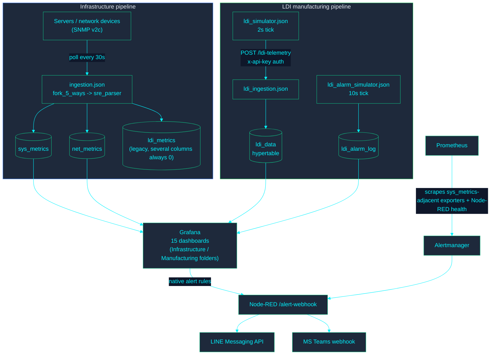
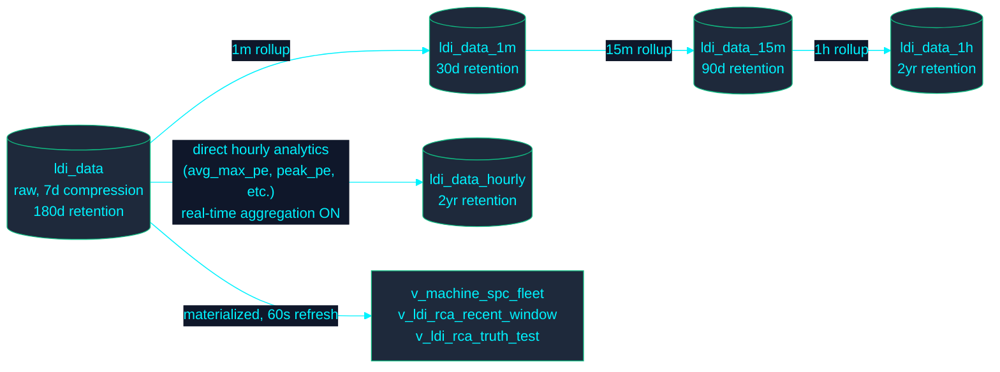
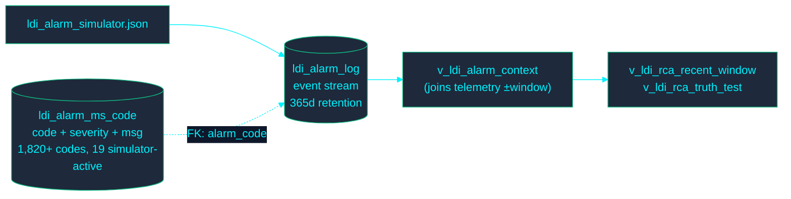

# Data Flow

> **Audience:** SRE/operations, new developers, QA/audit.
>
> **Provenance:** every table/view name and CAGG relationship below was checked directly against the live database (`timescaledb_information.continuous_aggregates`) and the real migrations on 2026-08-10.

---

## End-to-end: both pipelines

**Delivery caveat:** LINE/Teams delivery requires operator-configured `LINE_CHANNEL_ACCESS_TOKEN`/`TEAMS_WEBHOOK_URL` — absent from `.env` by design in this repo. The formatting and delivery-attempt logic up to that point is real and correct.

---

## LDI telemetry: the CAGG rollup chain

Raw `ldi_data` feeds two independent aggregation paths, each serving a different purpose — don't assume they're redundant:

`ldi_data_1m → 15m → 1h` is a chained rollup (each level aggregates the level below it) for dashboard time-range performance. `ldi_data_hourly` is a _separate_, purpose-built hourly view computed directly from raw data with its own analytical columns (`avg_max_pe`, `peak_pe`, and more) and `timescaledb.materialized_only = false` (real-time aggregation — migration 065), because those specific metrics need to reflect the current partial hour, not wait for the next scheduled refresh.

## Alarm master + severity

See `docs/architecture/ALARM_SEVERITY_GUIDE.md` and `docs/architecture/LDI_RCA_GUIDE.md` for the taxonomy and correlation methodology built on top of this.

## Related documents

- `docs/architecture/ARCHITECTURE.md` — full system context, container inventory.
- `docs/architecture/DATABASE_SCHEMA.md` — auto-generated table/column/view reference.
- `docs/architecture/DATA_RETENTION.md` — the retention/compression numbers shown above, with governance caveats.
- `docs/architecture/EAP_ARCHITECTURE.md` — the two ingestion adapters (SNMP, HTTP/JSON) in more detail.
