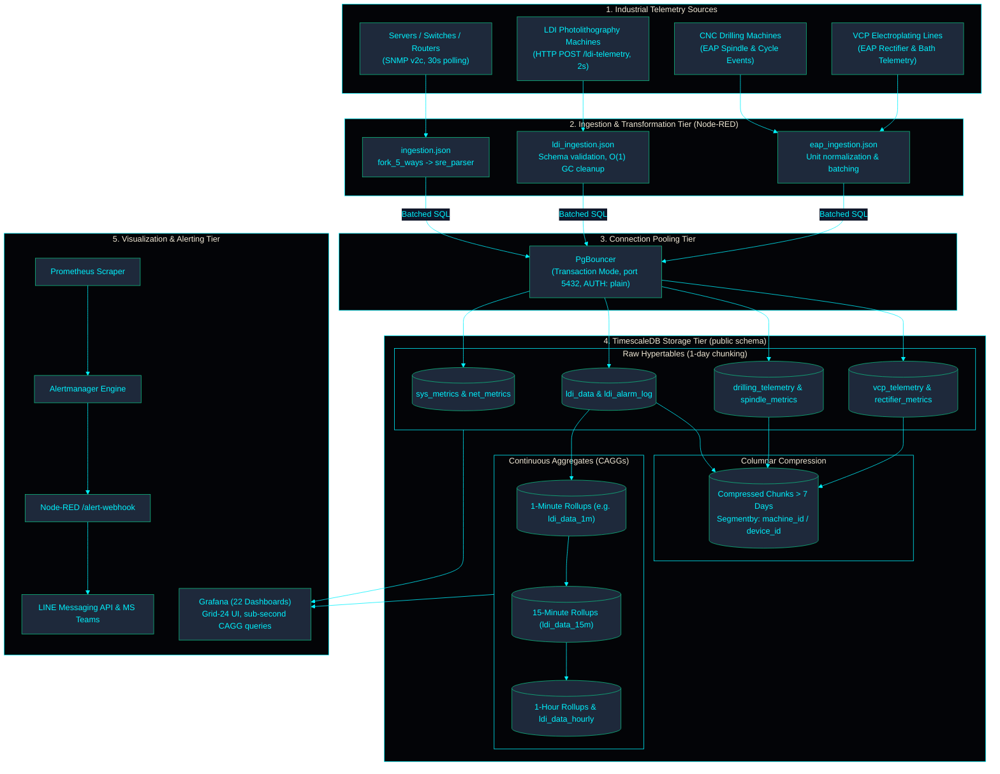
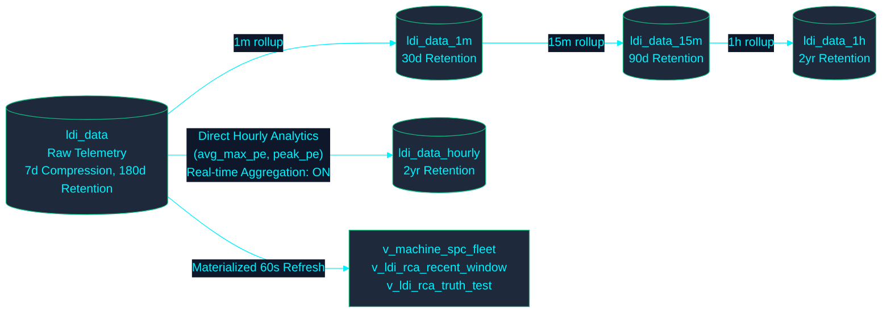
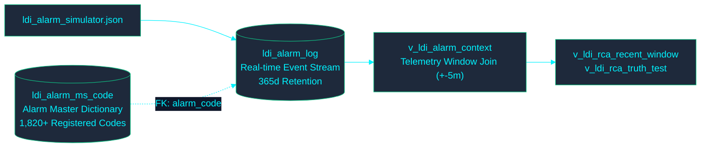

<!-- GLOBAL_NAV -->
<div align="right">
  <a href="../../README.md"> <b>Home</b></a> &nbsp;|&nbsp;
  <a href="../README.md"> <b>Docs Index</b></a>
</div>
<br/>

<div align="center">
  <h1>IMS Telemetry Pipeline & Data Flow Architecture</h1>
  <p><b>Multi-domain ingestion pipelines, Node-RED sandbox transformation, PgBouncer pooling, TimescaleDB CAGG rollups, and Grafana dispatch</b></p>
  <p>
    <a href="DATA_FLOW.md">English</a> |
    <a href="../../th/docs/architecture/DATA_FLOW.md">ไทย</a> |
    <a href="../../zh-CN/docs/architecture/DATA_FLOW.md">简体中文</a>
  </p>
</div>

---

> **Audience:** SRE / Operations, Data Engineers, Software Architects, QA / Compliance  
> **Telemetry Scope:** 4 Industrial Domains (IT/OT Infrastructure, LDI Photolithography, CNC Drilling Fleet, VCP Electroplating)  
> **Provenance:** Every table, view, function node, and continuous aggregate referenced below is verified against `timescaledb_information.continuous_aggregates`, migrations 013–086, and active Node-RED flows.

---

## 1. End-to-End Multi-Domain Pipeline Topology


```mermaid
%%{init: {'theme': 'base', 'themeVariables': { 'primaryColor': '#1e293b', 'primaryTextColor': '#00F2FE', 'primaryBorderColor': '#10B981', 'lineColor': '#00F2FE', 'secondaryColor': '#0f172a', 'tertiaryColor': '#0f172a', 'clusterBkg': '#030407', 'clusterBorder': '#00F2FE'}}}%%
flowchart TB
  subgraph SOURCES["1. Industrial Telemetry Sources"]
    SNMP_DEV["Servers / Switches / Routers
(SNMP v2c, 30s polling)"]
    LDI_DEV["LDI Photolithography Machines
(HTTP POST /ldi-telemetry, 2s)"]
    DRL_DEV["CNC Drilling Machines
(EAP Spindle & Cycle Events)"]
    VCP_DEV["VCP Electroplating Lines
(EAP Rectifier & Bath Telemetry)"]
  end

  subgraph INGESTION["2. Ingestion & Transformation Tier (Node-RED)"]
    NR_INFRA["ingestion.json
fork_5_ways -> sre_parser"]
    NR_LDI["ldi_ingestion.json
Schema validation, O(1) GC cleanup"]
    NR_EAP["eap_ingestion.json
Unit normalization & batching"]
  end

  subgraph POOL["3. Connection Pooling Tier"]
    PGB["PgBouncer
(Transaction Mode, port 5432, AUTH: plain)"]
  end

  subgraph STORAGE["4. TimescaleDB Storage Tier (public schema)"]
    subgraph HYPER["Raw Hypertables (1-day chunking)"]
      HT_SYS[("sys_metrics & net_metrics")]
      HT_LDI[("ldi_data & ldi_alarm_log")]
      HT_DRL[("drilling_telemetry & spindle_metrics")]
      HT_VCP[("vcp_telemetry & rectifier_metrics")]
    end
    subgraph CAGGS["Continuous Aggregates (CAGGs)"]
      CAGG_1M[("1-Minute Rollups (e.g. ldi_data_1m)")]
      CAGG_15M[("15-Minute Rollups (ldi_data_15m)")]
      CAGG_1H[("1-Hour Rollups & ldi_data_hourly")]
    end
    subgraph COMPRESS["Columnar Compression"]
      COL[("Compressed Chunks > 7 Days
Segmentby: machine_id / device_id")]
    end
  end

  subgraph DISPATCH["5. Visualization & Alerting Tier"]
    GRAF["Grafana (22 Dashboards)
Grid-24 UI, sub-second CAGG queries"]
    PROM["Prometheus Scraper"]
    AM["Alertmanager Engine"]
    WH["Node-RED /alert-webhook"]
    NOTIF["LINE Messaging API & MS Teams"]
  end

  SNMP_DEV --> NR_INFRA
  LDI_DEV --> NR_LDI
  DRL_DEV --> NR_EAP
  VCP_DEV --> NR_EAP

  NR_INFRA -->|Batched SQL| PGB
  NR_LDI -->|Batched SQL| PGB
  NR_EAP -->|Batched SQL| PGB

  PGB --> HT_SYS
  PGB --> HT_LDI
  PGB --> HT_DRL
  PGB --> HT_VCP

  HT_LDI --> CAGG_1M --> CAGG_15M --> CAGG_1H
  HT_LDI --> COL
  HT_DRL --> COL
  HT_VCP --> COL

  CAGGS --> GRAF
  HYPER --> GRAF
  PROM --> AM --> WH --> NOTIF
```

---

## 2. Ingestion Processing & Sandboxed Code Patterns

Inside the **Node-RED Ingestion Pipeline**, function nodes execute within a sandboxed V8 context where `require()` is forbidden. All external modules are accessed via `global.get()`. To prevent memory leaks during high-frequency ingestion bursts (>100,000 events/sec), all transformations strictly enforce **O(N) single-pass iteration** and **explicit garbage collection**:

```javascript
// Example: Node-RED Function Node Telemetry Normalization & GC Cleanup
const pg = global.get('pg');
const pool = global.get('pgPool');

const rawPayload = msg.payload;
if (!Array.isArray(rawPayload) || rawPayload.length === 0) {
    return null;
}

const flatData = [];
const insertTime = new Date().toISOString();

// O(N) Single-Pass Transformation
for (let i = 0; i < rawPayload.length; i++) {
    const item = rawPayload[i];
    flatData.push([
        insertTime,
        item.eqp_id,
        Number(item.pe1_intensity) || 0.0,
        Number(item.pe2_intensity) || 0.0,
        Number(item.thickness) || 0.0,
        Number(item.temperature) || 0.0,
        item.lot_id || 'UNKNOWN'
    ]);
}

// Build Parameterized Batch SQL
const columns = '("time", machine_id, pe1_intensity, pe2_intensity, thickness, temperature, lot_id)';
const values = flatData.map((_, idx) => {
    const offset = idx * 7;
    return `($${offset + 1}, $${offset + 2}, $${offset + 3}, $${offset + 4}, $${offset + 5}, $${offset + 6}, $${offset + 7})`;
}).join(', ');

const query = `
    INSERT INTO public.ldi_data ${columns}
    VALUES ${values}
    ON CONFLICT (log_id, "time") DO NOTHING;
`;

// Flatten parameters for node-postgres execution
const flattenedParams = flatData.flat();

// Explicit Garbage Collection Discipline: prevent V8 heap bloat
flatData.length = 0;
msg.payload = null;

// Dispatch to PgBouncer connection pool
msg.topic = query;
msg.params = flattenedParams;
return msg;
```

---

## 3. TimescaleDB Continuous Aggregate Rollup Chain

Raw telemetry data in `public.ldi_data` feeds two independent aggregation paths:


```mermaid
%%{init: {'theme': 'base', 'themeVariables': { 'primaryColor': '#1e293b', 'primaryTextColor': '#00F2FE', 'primaryBorderColor': '#10B981', 'lineColor': '#00F2FE', 'secondaryColor': '#0f172a', 'tertiaryColor': '#0f172a', 'clusterBkg': '#030407', 'clusterBorder': '#00F2FE'}}}%%
flowchart LR
  RAW[("ldi_data
Raw Telemetry
7d Compression, 180d Retention")]

  RAW -->|"1m rollup"| M1[("ldi_data_1m
30d Retention")]
  M1 -->|"15m rollup"| M15[("ldi_data_15m
90d Retention")]
  M15 -->|"1h rollup"| M1H[("ldi_data_1h
2yr Retention")]

  RAW -->|"Direct Hourly Analytics
(avg_max_pe, peak_pe)
Real-time Aggregation: ON"| MHOURLY[("ldi_data_hourly
2yr Retention")]

  RAW -->|"Materialized 60s Refresh"| SPC["v_machine_spc_fleet
v_ldi_rca_recent_window
v_ldi_rca_truth_test"]
```

* **Chained Multi-Level Rollup (`1m -> 15m -> 1h`):** Successively aggregates smaller buckets to power long-range Grafana dashboards (7d, 30d, 90d) with sub-second execution times.
* **Direct Real-Time Hourly Rollup (`ldi_data_hourly`):** Configured with `timescaledb.materialized_only = false` (migration 065), computing complex metrics (`avg_max_pe`, `peak_pe`) directly from raw data while merging active in-flight chunks.

---

## 4. Alarm Processing & Root-Cause Analysis (RCA) Pipeline


```mermaid
%%{init: {'theme': 'base', 'themeVariables': { 'primaryColor': '#1e293b', 'primaryTextColor': '#00F2FE', 'primaryBorderColor': '#10B981', 'lineColor': '#00F2FE', 'secondaryColor': '#0f172a', 'tertiaryColor': '#0f172a', 'clusterBkg': '#030407', 'clusterBorder': '#00F2FE'}}}%%
flowchart LR
  ALM_SIM["ldi_alarm_simulator.json"] --> ALOG[("ldi_alarm_log
Real-time Event Stream
365d Retention")]
  MASTER[("ldi_alarm_ms_code
Alarm Master Dictionary
1,820+ Registered Codes")] -.->|"FK: alarm_code"| ALOG
  ALOG --> CTX["v_ldi_alarm_context
Telemetry Window Join (+-5m)"]
  CTX --> RCA["v_ldi_rca_recent_window
v_ldi_rca_truth_test"]
```

Alarms flow into `public.ldi_alarm_log`, linking to `public.ldi_alarm_ms_code` by foreign key. Downstream views (`v_ldi_alarm_context`) automatically join machine telemetry within a $\pm 5\text{-minute}$ window around the alarm timestamp, feeding statistical root cause analysis into the operator console.

---

## 5. Architectural Constraints & Rules

1. **Database Schema Isolation:** All database objects must reside in `public`. Never create `ims.*` schemas.
2. **PgBouncer Pooling:** Strict transaction pooling (`AUTH_TYPE: plain`). Prepared statements and session-level locks are strictly disallowed.
3. **Idempotent Inserts:** All batch inserts must include `ON CONFLICT (log_id, "time") DO NOTHING`.
4. **Notification Secrets:** Delivery to LINE and MS Teams requires operator-supplied tokens (`LINE_CHANNEL_ACCESS_TOKEN`, `TEAMS_WEBHOOK_URL`). Never commit secrets to git.

---

[⬅️ Back to Architecture Overview](ARCHITECTURE.md) | [ Main Repository](../../README.md)
