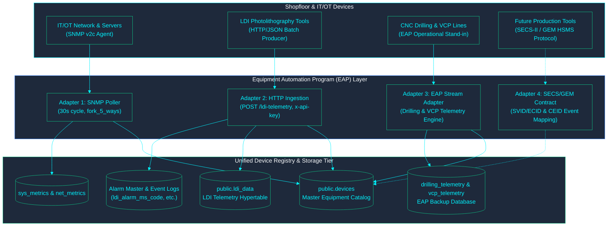

<!-- GLOBAL_NAV -->

  <a href="../../README.md"> <b>Home</b></a> &nbsp;|&nbsp;
  <a href="../README.md"> <b>Docs Index</b></a>

 

  <h1>Equipment Integration Layer Architecture (EAP)</h1>
  
<b>Equipment Automation Program (EAP) adapter patterns, multi-protocol telemetry ingestion, SECS/GEM contracts, and device registry</b>

  

    <a href="EAP_ARCHITECTURE.md">English</a> |
    <a href="../../th/docs/architecture/EAP_ARCHITECTURE.md">ไทย</a> |
    <a href="../../zh-CN/docs/architecture/EAP_ARCHITECTURE.md">简体中文</a>
  

---

> **EAP = Equipment Automation Program** — SECS/GEM-style equipment integration, per the scope confirmed 2026-08-10 (not "Enterprise Application Platform"). See `docs/architecture/IMS_MANUFACTURING_PLATFORM_V2.md` §3 for the foundational specification.
>
> **Reality check, stated up front:** IMS is monitoring-only. It reads telemetry and raises alarms; it never writes commands, downloads recipes, or holds equipment state. There is no physical SECS/GEM-capable tool anywhere in this system today — LDI machines are SNMP-polled/simulated, not SECS/GEM-connected. This doc does **not** claim SECS/GEM compliance, does not implement HSMS session handling, and does not simulate SECS/GEM equipment. It documents the working adapters and defines the contract for future physical shopfloor integrations.
>
> **Provenance:** The SNMP and HTTP/JSON adapter descriptions below are verified directly against `nodered_data/flows/ingestion.json`, `nodered_data/flows/ldi_ingestion.json`, and `scripts/mock/eap-mock-data.js`.

---

## 1. Multi-Adapter Architecture Topology

---

## 2. The Four Adapter Contracts

Every adapter's job is identical regardless of transport protocol: map telemetry and alarm events from physical or simulated devices into `public.devices` and the appropriate telemetry hypertable, using `device_id` as the primary join key across all downstream dashboards, SPC/RCA views, and alarm logs.

### Adapter 1 — SNMP (IT/OT Infrastructure)
* **Location:** `nodered_data/flows/ingestion.json` ("IMS Ingestion Pipeline" tab).
* **Equipment Model:** `public.devices` rows with `device_type IN ('server','workstation','network')`, holding `hostname`, `ip_address`, `snmp_community`, `snmp_port`, `poll_interval`.
* **Data Collection Plan:** Every 30 seconds, `fork_5_ways` dispatches parallel SNMP v2c walkers (CPU, Storage, Network, Temperature, LDI OIDs) per registered device.
* **Event / Alarm Collection:** None at the protocol level — this adapter is telemetry-only; alarms are derived downstream from threshold comparisons.
* **Mapping:** `sre_parser` maintains per-device state and batch-inserts into `sys_metrics`, `net_metrics`, and `ldi_metrics`.

### Adapter 2 — HTTP/JSON (LDI Manufacturing Telemetry)
* **Location:** `nodered_data/flows/ldi_ingestion.json` ("IMS LDI Ingestion" tab).
* **Equipment Model:** `public.devices` rows with `device_type='ldi'`, `process_type='ldi'` (migrations 067/068).
* **Data Collection Plan:** Equipment POSTs JSON array batches to `POST /ldi-telemetry` (authenticated via `x-api-key`). Each record carries `eqp_id` (maps to `device_id`), PE1-6, JE1-4, panel thickness, scan speed, and resist dosage.
* **Event / Alarm Collection:** Dedicated producer writes to `public.ldi_alarm_log`, correlated by `device_id` + `event_id`.
* **Mapping:** Direct batch `INSERT INTO public.ldi_data ON CONFLICT (log_id, "time") DO NOTHING`.

### Adapter 3 — EAP Stand-In Adapter (CNC Drilling & VCP Plating)
* **Location:** `scripts/mock/eap-mock-data.js` and `database/mock/eap_backup-schema.sql`.
* **Equipment Model:** Drilling machines (`drl001`–`drl010`) and VCP plating lines (`vcp001`–`vcp005`).
* **Data Collection Plan:** Generates realistic physical machine cycles:
  - **Drilling:** Program start, spindle speed (RPM), feed rate, spindle masking, tool hit count degradation, and shift reports.
  - **VCP:** Line movement (RUN, IDLE, DOWN), rectifier amperage, bath temperature thermodynamics, and flight-bar synchronization ($\text{plating\_time} \times \text{line\_speed} = 54$).
* **Mapping:** Inserts into `eap_backup` tables (`machine_event`, `vcp_upp`, `catalog.object_registry`) powering 4 drilling and 3 VCP Grafana dashboards.

### Adapter 4 — SECS/GEM (Future Physical Tool Integration)
No runtime code exists today for Adapter 4. When a physical SECS/GEM tool is connected to the plant floor, it must satisfy this formal interface contract:

| EAP Concept | Required Adapter Implementation | Downstream Architectural Target |
|---|---|---|
| **Equipment Registration** | Register tool identity in `public.devices` (`device_id`, `device_type`, `process_type`). | `public.devices` catalog |
| **Collection Events (CEID)** | Translate SECS-II event reports into structured alarm rows keyed by `device_id`. | `<process>_alarm_ms_code` & log |
| **Status Variables (SVID/ECID)** | Translate SECS-II variable reports into hypertable rows keyed by `(device_id, time)`. | `public.<process>_data` hypertable |
| **Explicit Versioning** | Implement versioned adapter payload schema (`adapter-contract-v1`). | API Gateway & Ingestion Validator |

---

## 3. Industrial Security Boundaries (IEC 62443)

Connecting physical shopfloor machinery crosses the plant-floor operational technology boundary:
* **Boundary 1 (front door):** the nginx reverse proxy. It serves **plain HTTP today; TLS termination is not configured**. `/alarm-api/` and `/factory-twin-3d/` require a valid Grafana session (`auth_request`); `/ldi-telemetry` and `/inject` require the `X-API-Key` header, which Node-RED checks, and are rate-limited.
* **Boundary 2 (internal services):** services reach TimescaleDB through PgBouncer in transaction pooling mode on the internal Docker network, each with its own role (see `docs/data/DATA_GOVERNANCE.md`). `alarm-api` uses parameterised queries.
* **Boundary 3 (Shopfloor Equipment Network):** Future Adapter 4 deployments require dedicated OT firewall isolation, mutual TLS / IP whitelisting, and read-only physical taps to ensure IMS cannot transmit write commands to production tools.

---

[⬅️ Back to Architecture Overview](ARCHITECTURE.md) | [ Main Repository](../../README.md)
