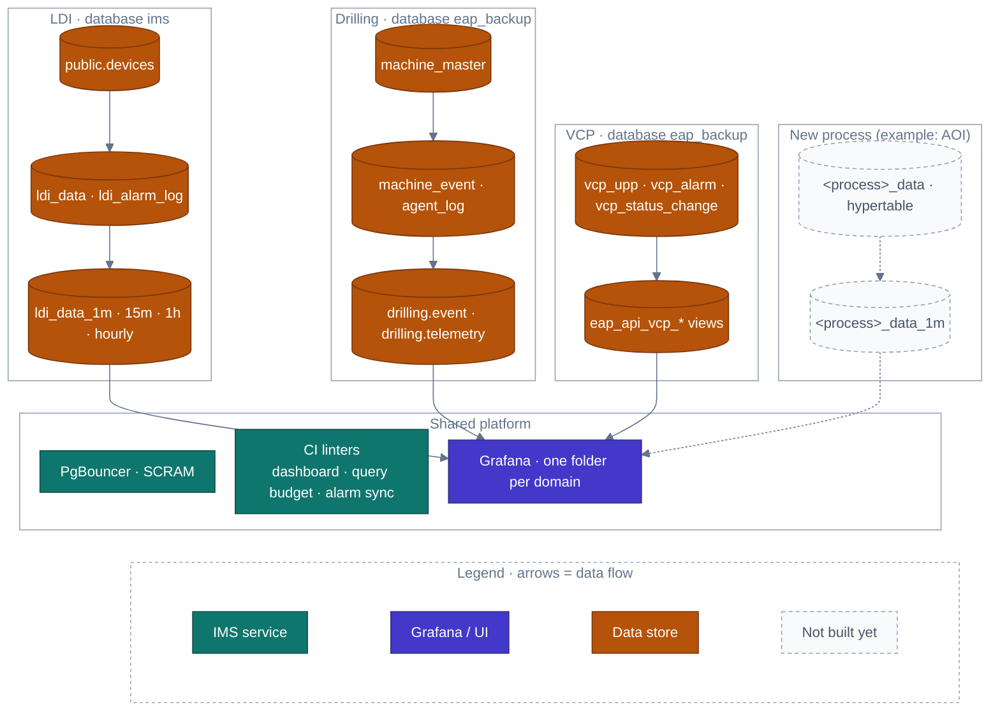

<!-- GLOBAL_NAV -->
<div align="right">
  <a href="../../README.md"> <b>Home</b></a> &nbsp;|&nbsp;
  <a href="../README.md"> <b>Docs Index</b></a>
</div>
<br/>

<div align="center">
  <h1>IMS Manufacturing Domain Extensibility & Process Architecture</h1>
  <p><b>Multi-process expansion patterns, LDI reference architecture, database schema separation, and onboarding checklist</b></p>
  <p>
    <a href="MANUFACTURING_DOMAIN.md">English</a> |
    <a href="../../th/docs/architecture/MANUFACTURING_DOMAIN.md">ไทย</a> |
    <a href="../../zh-CN/docs/architecture/MANUFACTURING_DOMAIN.md">简体中文</a>
  </p>
</div>

---

> **Purpose:** Document the architectural blueprint behind IMS's manufacturing process integrations (LDI photolithography, CNC drilling, VCP electroplating) so onboarding the *next* process type (e.g., Automated Optical Inspection - AOI, chemical etching, surface mount - SMT) is purely additive — a new migration, a new alarm master, and a new dashboard trio — without refactoring or breaking existing production pipelines.
>
> **Provenance:** Every pattern described below reflects the real, working implementation across LDI, CNC drilling, and VCP plating lines, verified against the live schema and dashboard inventory.
>
> **Extensibility:** Ensures zero-downtime scalability across diverse manufacturing stages while maintaining strict separation of concerns.

---

## 1. Domain Extensibility Architecture Topology



---

## 2. The 5-Tier Expansion Pattern

| Architectural Tier | LDI Photolithography (Reference Implementation) | Generic Pattern for Next Process (e.g. AOI / Etching) |
|---|---|---|
| **1. Device Identity** | `public.devices.device_type = 'ldi'`, `public.devices.process_type = 'ldi'` (migration 067/068). Non-manufacturing gear has `process_type = NULL`. | Register tools with distinct `device_type` (e.g. `'aoi'`) and `process_type` (`'aoi'`, `'etching'`). Columns are independent: allows future tools to share transport while isolating process logic. |
| **2. Telemetry Storage** | `public.ldi_data` — hypertable with LDI columns (`pe1..pe6`, `je1..je4`, `thickness`, `scan_speed`), keyed by `(machine_id, time)`. | One hypertable per process type, keyed by `(device_id, time)` with FK to `public.devices`. Column definitions are domain-specific by design (e.g. defect counts for AOI, acid bath concentration for Etching). |
| **3. Alarm Master** | `public.ldi_alarm_ms_code` (code, severity, description) and `public.ldi_alarm_log` event stream. Enforced by `alarm-sync-linter.js`. | One alarm catalog table per process (`<process>_alarm_ms_code`), using identical schema structure, FK constraints, and automated linter registration. |
| **4. SPC / RCA Views** | `public.v_machine_spc_fleet` and `public.v_ldi_rca_recent_window` (migration 064), filtering by `device_type = 'ldi'`. | Create process-specific sibling views (`v_<process>_spc_fleet`) sharing the standardized Cpk/RCA calculation engine and background job schedule (`add_job`). |
| **5. Dashboard Trio** | **Operator Andon** (`ims-ldi-operator-andon.json`), **Engineering Analytics** (`ims-ldi-engineering-analytics.json`), and **Manufacturing Overview** (`ims-ldi-manufacturing.json`). | Deploy the required Trio under `monitoring/grafana/dashboards/manufacturing/` tagged `["manufacturing", "<process>"]`, satisfying `dashboard-linter.js` Check 18. |

---

## 3. Production Onboarding DDL Template

To onboard a new manufacturing process, execute an additive migration following this standard template:

```sql
-- Migration 087: Onboard New Process (e.g. Automated Optical Inspection - AOI)
-- 1. Register Equipment in Unified Master Catalog
INSERT INTO public.devices (device_id, hostname, ip_address, device_type, process_type, location, enabled)
VALUES 
  ('AOI-01', 'aoi-station-01.factory.local', '10.20.30.51', 'aoi', 'aoi', 'Floor 2 - SMT Line 1', TRUE),
  ('AOI-02', 'aoi-station-02.factory.local', '10.20.30.52', 'aoi', 'aoi', 'Floor 2 - SMT Line 2', TRUE)
ON CONFLICT (device_id) DO NOTHING;

-- 2. Create Domain-Specific Telemetry Table & Hypertable
CREATE TABLE IF NOT EXISTS public.aoi_telemetry (
  "time" TIMESTAMPTZ NOT NULL,
  machine_id VARCHAR(64) NOT NULL REFERENCES public.devices(device_id),
  inspection_cycle_ms NUMERIC(10,2),
  defect_count INT DEFAULT 0,
  false_alarm_rate NUMERIC(5,2),
  optical_lighting_lux NUMERIC(8,2),
  lot_id VARCHAR(64)
);

SELECT create_hypertable('public.aoi_telemetry', 'time', chunk_time_interval => INTERVAL '1 day', if_not_exists => TRUE);

-- 3. Configure Native Columnar Compression
ALTER TABLE public.aoi_telemetry SET (
  timescaledb.compress,
  timescaledb.compress_segmentby = 'machine_id',
  timescaledb.compress_orderby = 'time DESC'
);
SELECT add_compression_policy('public.aoi_telemetry', INTERVAL '7 days');

-- 4. Create Alarm Master Dictionary & Event Log
CREATE TABLE IF NOT EXISTS public.aoi_alarm_ms_code (
  alarm_code VARCHAR(32) PRIMARY KEY,
  severity VARCHAR(16) NOT NULL CHECK (severity IN ('CRITICAL', 'WARNING', 'INFO')),
  description TEXT NOT NULL
);

CREATE TABLE IF NOT EXISTS public.aoi_alarm_log (
  event_id BIGSERIAL PRIMARY KEY,
  "time" TIMESTAMPTZ NOT NULL,
  machine_id VARCHAR(64) NOT NULL REFERENCES public.devices(device_id),
  alarm_code VARCHAR(32) NOT NULL REFERENCES public.aoi_alarm_ms_code(alarm_code),
  status VARCHAR(16) DEFAULT 'OPEN' CHECK (status IN ('OPEN', 'ACKNOWLEDGED', 'RESOLVED')),
  acknowledged_by VARCHAR(64),
  resolved_by VARCHAR(64)
);
```

---

## 4. Onboarding Checklist for a New Process Type

1. **Migration:** Register the equipment in `public.devices` with the appropriate `device_type` and a new `process_type`. Create the domain hypertable and columnar compression policy in the same migration.
2. **Alarm Master:** Seed the `<process>_alarm_ms_code` dictionary and `<process>_alarm_log` event table.
3. **Continuous Aggregates & Views:** Add CAGG rollups (`cagg_<process>_1m`) and process-specific SPC/RCA views.
4. **Dashboard Trio:** Build the Operator Andon, Engineering Analytics, and Manufacturing Overview dashboards; place them in `monitoring/grafana/dashboards/manufacturing/` tagged `["manufacturing", "<process>"]`.
5. **Quality Gates:** Register the new process in `tests/lint/alarm-sync-linter.js` and run `scripts/pre-commit.js` to ensure 100% compliance.
6. **Documentation Sync:** Run `node scripts/generate-dashboard-inventory.js` and `node scripts/generate-schema-inventory.js` to update inventory catalogs automatically.

---

[⬅️ Back to Architecture Overview](ARCHITECTURE.md) | [ Main Repository](../../README.md)
