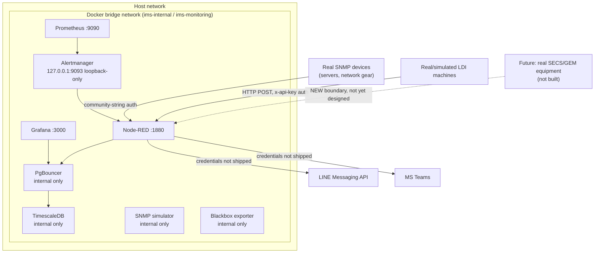

# Security Model

> **Audience:** SRE/operations, QA/audit, security review.
>
> This document is the **architectural trust-boundary view**. `SECURITY.md` (repo root) is the authoritative security *policy* — known limitations, hardening checklist, secrets handling. Read both; they don't duplicate each other.

---

## Trust boundaries

**Boundary 1 — Host ↔ Docker network.** Only Grafana, Node-RED, Prometheus, and Alertmanager (loopback-only) publish host ports. PgBouncer, TimescaleDB, and the SNMP simulator are never exposed to the host — internal Docker DNS only.

**Boundary 2 — Infrastructure domain ↔ Manufacturing domain.** Per `docs/architecture/OWNERSHIP.md`, this is a *logical* separation only (folder/tag/CODEOWNERS boundaries) — both domains share one database, one Grafana instance, one Node-RED process. There is no hard security boundary between them. This is an accepted, explicitly-stated trade-off for a single-tenant deployment at this size, not an oversight.

**Boundary 3 — Equipment Integration Layer (forward-looking, not built).** Per `docs/architecture/EAP_ARCHITECTURE.md`, the day a real SECS/GEM-speaking tool is connected via the unimplemented third adapter, that connection crosses into the plant-floor equipment network — a genuinely new external trust boundary. Requires its own hardening review (credential handling, network segmentation) before any real equipment is wired in. Not designed yet because nothing exists to design it against.

## Authentication per adapter

| Adapter | Mechanism | Where enforced |
|---|---|---|
| SNMP (infrastructure) | Community string (v2c) — file-based, not hardcoded in flows | `nodered_data/flows/ingestion.json`, `public.devices.snmp_community` |
| HTTP/JSON (LDI) | `x-api-key` header checked against `INGEST_API_KEY` | `nodered_data/flows/ldi_ingestion.json` |
| Grafana → PgBouncer → TimescaleDB | Connection-pooled DB credentials | `docker-compose.yaml` env, `pgbouncer.ini` |
| Alert delivery (LINE/Teams) | Bearer token / webhook URL — **absent from `.env` by design** | `nodered_data/flows/alerting.json` |

SNMPv2c's community-string auth is inherently weaker than SNMPv3 (no encryption, community string is effectively a shared password) — `SECURITY.md`'s hardening checklist already tracks migrating to SNMPv3 before connecting real production devices; not re-tracked here to avoid the two documents disagreeing over time.

## CODEOWNERS as a security control

`.github/CODEOWNERS`'s security-sensitive lines (`/.env.example`, `docker-compose*.yaml`, `/database/`, `/.github/`) gate review on those paths regardless of domain. The domain-scoped lines added for the infra/manufacturing split (`docs/architecture/OWNERSHIP.md`) are additive to this, not a replacement — they don't weaken or reorder the security-sensitive entries.

## What this document does not cover

- The known limitations table (PgBouncer port exposure trade-offs, Node-RED admin auth, etc.) — see `SECURITY.md`.
- AI tooling supply-chain security (MCP servers, skills, plugins) — see `SECURITY.md`'s AI Tooling Security section.
- Vulnerability reporting process — see `SECURITY.md`.

## Related documents

- `SECURITY.md` — the authoritative security policy.
- `docs/architecture/OWNERSHIP.md` — the infra/manufacturing domain boundary.
- `docs/architecture/EAP_ARCHITECTURE.md` — the equipment-adapter pattern and Boundary 3's full context.
- `docs/architecture/IMS_MANUFACTURING_PLATFORM_V2.md` §8 — where this trust-boundary framing originated.
