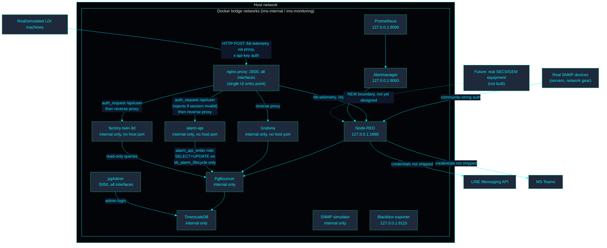

<!-- GLOBAL_NAV -->

  <a href="../../README.md"> <b>Home</b></a> &nbsp;|&nbsp;
  <a href="../README.md"> <b>Docs Index</b></a>

 

# Security Model

> **Audience:** SRE/Operations, QA/Audit, Security Review.
> **Objective:** The architectural trust-boundary view of IMS. (Note: Read `SECURITY.md` in the repo root for the authoritative security policy).
> **Provenance:** Verified against the live docker-compose and proxy configs on 2026-08-10; re-verified against `main` (compose, `proxy/nginx.conf`, `.github/CODEOWNERS`, the `main` ruleset) on 2026-09-26.

---

## Trust boundaries

```mermaid
%%{init: {'theme': 'base', 'themeVariables': { 'primaryColor': '#1e293b', 'primaryTextColor': '#00F2FE', 'primaryBorderColor': '#10B981', 'lineColor': '#00F2FE', 'secondaryColor': '#0f172a', 'tertiaryColor': '#0f172a', 'clusterBkg': '#030407', 'clusterBorder': '#00F2FE'}}}%%
flowchart TB
 subgraph HOST["Host network"]
  subgraph DOCKER["Docker bridge networks (ims-internal / ims-monitoring)"]
   PROXY["nginx proxy :3000, all interfaces\n(single UI entry point)"]
   GRAFANA["Grafana\ninternal only, no host port"]
   ALARMAPI["alarm-api\ninternal only, no host port"]
   TWIN["factory-twin-3d\ninternal only, no host port"]
   NODERED["Node-RED\n127.0.0.1:1880"]
   PROM["Prometheus\n127.0.0.1:9090"]
   AM["Alertmanager\n127.0.0.1:9093"]
   PGB["PgBouncer\ninternal only"]
   TSDB["TimescaleDB\ninternal only"]
   PGADMIN["pgAdmin\n:5050, all interfaces"]
   SNMPSIM["SNMP simulator\ninternal only"]
   BLACKBOX["Blackbox exporter\n127.0.0.1:9115"]
  end
 end

 EXT1["Real SNMP devices\n(servers, network gear)"] -->|"community-string auth"| NODERED
 EXT2["Real/simulated LDI machines"] -->|"HTTP POST /ldi-telemetry via proxy,\nx-api-key auth"| PROXY
 PROXY -->|"/ldi-telemetry, /inject"| NODERED
 NODERED --> PGB --> TSDB
 PROXY -->|"reverse proxy"| GRAFANA
 PROXY -->|"auth_request /api/user\n(rejects if session invalid)\nthen reverse proxy"| ALARMAPI
 PROXY -->|"auth_request /api/user\nthen reverse proxy"| TWIN
 GRAFANA --> PGB
 ALARMAPI -->|"alarm_api_writer role:\nSELECT+UPDATE on\nldi_alarm_lifecycle only"| PGB
 TWIN -->|"read-only queries"| PGB
 PGADMIN -->|"admin login"| TSDB
 PROM --> AM
 AM --> NODERED
 NODERED -->|"credentials not shipped"| LINE["LINE Messaging API"]
 NODERED -->|"credentials not shipped"| TEAMS["MS Teams"]

 FUTURE["Future: real SECS/GEM equipment\n(not built)"] -.->|"NEW boundary, not yet designed"| NODERED
```

**Boundary 1 — Host ↔ Docker network.** Two services listen on every host interface: the `proxy` service (nginx, `${GRAFANA_PORT:-3000}`) and `pgadmin` (`5050`). Node-RED, Prometheus, Alertmanager and the Blackbox exporter publish ports bound to `127.0.0.1` only. Grafana, alarm-api and the Factory Twin used to publish their own ports; all three sit behind `proxy`, so every browser-facing request — read or write — goes through one front door. PgBouncer, TimescaleDB, the SNMP simulator and the image renderer are never exposed to the host — internal Docker DNS only. `pgadmin` is the exception that still needs a host firewall or a `127.0.0.1` binding outside a lab (see `SECURITY.md`). `observability-archiver` mounts the Docker socket; the `:ro` flag does not restrict Docker API calls, so that container is effectively privileged on the host.

**Boundary 1a — Grafana session as the write-path credential.** `alarm-api` (`services/alarm-api`) is the only service in this stack that mutates state from a Grafana dashboard (`IMS LDI - Alarm Console`'s Acknowledge/Resolve buttons, writing to `public.ldi_alarm_lifecycle`). It has no login of its own: `proxy`'s `/alarm-api/` location runs an `auth_request` subrequest against Grafana's own `/api/user` before forwarding anything, so a request only reaches alarm-api if the caller already holds a valid Grafana session — the same login an operator already has to see the dashboard, not a second credential to manage. The `/factory-twin-3d/` location uses the same gate. alarm-api connects to Postgres as `alarm_api_writer` (migration 078), a role scoped to `SELECT`+`UPDATE` on `ldi_alarm_lifecycle` only — not the superuser, not `grafana_reader`. alarm-api then identifies the caller itself. It asks Grafana for `/api/user` (the login) and `/api/user/orgs` (the role in the current organisation), and stores that login as the actor. It ignores any `acknowledged_by` / `resolved_by` sent in the request body, and answers 403 to a Viewer. Only Editor, Admin or a Grafana server admin may acknowledge or resolve. `tests/unit/alarm-api-server.test.js` covers this, and it was checked end to end through nginx against Grafana 13.1.2.

**Boundary 1b — Ingest endpoints.** `/ldi-telemetry` and `/inject` are reachable by anyone who can reach the front door's port. They are protected only by the `x-api-key` header matching `INGEST_API_KEY`, so that key must be a freshly generated secret, never the public `.env.example` value.

**Boundary 2 — Infrastructure domain ↔ Manufacturing domain.** Per `docs/architecture/OWNERSHIP.md`, this is a _logical_ separation only (folder/tag/CODEOWNERS boundaries) — both domains share one database, one Grafana instance, one Node-RED process. There is no hard security boundary between them. This is an accepted, explicitly-stated trade-off for a single-tenant deployment at this size, not an oversight.

**Boundary 3 — Equipment Integration Layer (forward-looking, not built).** Per `docs/architecture/EAP_ARCHITECTURE.md`, the day a real SECS/GEM-speaking tool is connected via the unimplemented third adapter, that connection crosses into the plant-floor equipment network — a genuinely new external trust boundary. Requires its own hardening review (credential handling, network segmentation) before any real equipment is wired in. Not designed yet because nothing exists to design it against.

**PgBouncer `MAX_CLIENT_CONN`** (`200` in `docker-compose.yaml`): do not raise it arbitrarily. Memory limits must scale alongside it (`1 connection ≈ 2MB`).

## Authentication per adapter

| Adapter | Mechanism | Where enforced |
| --- | --- | --- |
| SNMP (infrastructure) | Community string (v2c), stored per device in the database — not hardcoded in flows | `public.devices.snmp_community`, read by `nodered_data/flows/ingestion.json` |
| HTTP/JSON (LDI) | `x-api-key` header checked against `INGEST_API_KEY` | `nodered_data/flows/ldi_ingestion.json`, exposed through `proxy/nginx.conf` |
| Grafana → PgBouncer → TimescaleDB | `grafana_reader` role (read-only), password from `GRAFANA_DB_PASSWORD` | `docker-compose.yaml` env; PgBouncer userlist seeded by `pgbouncer/entrypoint-wrapper.sh`; role password set by `postgres/init/003-grafana-password.sh` |
| Alarm Console → alarm-api (write path) | Grafana session, validated via nginx `auth_request` against Grafana's `/api/user`; DB side uses the least-privilege `alarm_api_writer` role | `proxy/nginx.conf`, `services/alarm-api/server.js`, migration `078-alarm-api-writer-role.sql` |
| Browser → Factory Twin 3D | Same Grafana-session `auth_request` gate; every twin route answers 401 without a valid session (asserted by the browser regression in proxy mode) | `proxy/nginx.conf`, `services/factory-twin-3d` |
| Node-RED editor / admin API | `adminAuth` with a bcrypt hash; Node-RED refuses to start without `NODE_RED_ADMIN_PASSWORD_HASH` | `nodered_data/settings.js` |
| Alert delivery (LINE/Teams) | Bearer token / webhook URL — **absent from `.env` by design** | `nodered_data/flows/alerting.json` |

SNMPv2c's community-string auth is inherently weaker than SNMPv3 (no encryption, community string is effectively a shared password) — `SECURITY.md`'s hardening checklist already tracks migrating to SNMPv3 before connecting real production devices; not re-tracked here to avoid the two documents disagreeing over time.

## CODEOWNERS and branch protection as security controls

`.github/CODEOWNERS` lists the security-sensitive paths (`/SECURITY.md`, `/.env.example`, `/docker-compose*.yaml`, `/database/`, `/postgres/`, `/.github/`, `/nodered_data/flows/`) and requests the owner's review on them. The `main` ruleset requires one approving review, resolved threads, linear history and a `validate-architecture` status check, but it does **not** set `require_code_owner_review`, so CODEOWNERS requests a review without enforcing it — and no current workflow job reports `validate-architecture`, so merges presently rely on an administrator bypass. Both are tracked as follow-ups in `CONTRIBUTING.md`. The domain-scoped lines added for the infra/manufacturing split (`docs/architecture/OWNERSHIP.md`) are additive to the security-sensitive entries, not a replacement.

## What this document does not cover

- The known-limitations table (public example secrets, pgAdmin exposure, plain HTTP, etc.) — see `SECURITY.md`.
- AI tooling supply-chain security (MCP servers, skills, plugins) — see `SECURITY.md`'s AI Tooling Security section.
- Vulnerability reporting process — see `SECURITY.md`.

## Related documents

- `SECURITY.md` — the authoritative security policy.
- `docs/architecture/OWNERSHIP.md` — the infra/manufacturing domain boundary.
- `docs/architecture/EAP_ARCHITECTURE.md` — the equipment-adapter pattern and Boundary 3's full context.
- `docs/architecture/FACTORY_TWIN_SECURITY_MODEL.md` — the Factory Twin's own disclosure model.
- `docs/architecture/IMS_MANUFACTURING_PLATFORM_V2.md` §8 — where this trust-boundary framing originated.

---

[⬅️ Back to IMS Platform Book](IMS_PLATFORM_BOOK.md) | [ Main Repository](../../README.md)
