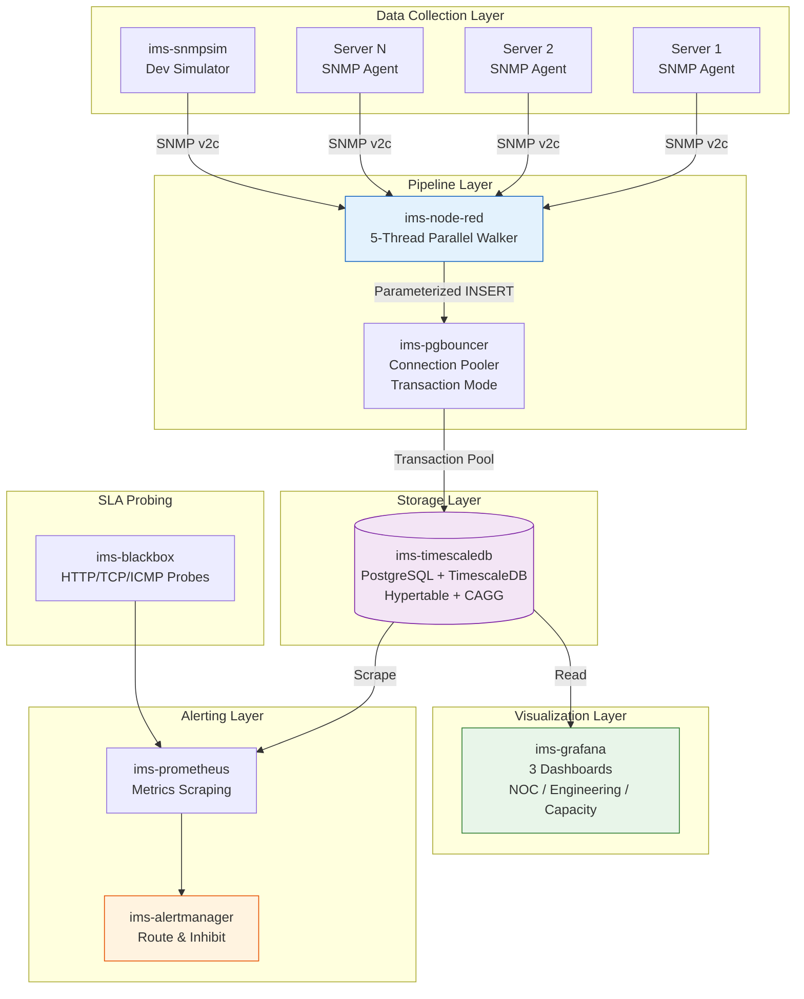

# 🏗️ IMS — System Architecture Document

> **เอกสารทางเทคนิคสำหรับ Engineers และ SREs**
> อธิบาย topology, data flow, monitoring strategy, และ alerting pipeline ของระบบ IMS

---

<div align="center">


</div>

---

## 📑 Table of Contents

1. [System Topology](#-system-topology)
2. [Data Flow Pipeline](#-data-flow-pipeline)
3. [Monitoring Strategy](#-monitoring-strategy)
4. [Alerting Pipeline](#-alerting-pipeline)
5. [Database Schema](#-database-schema)
6. [Security Architecture](#-security-architecture)
7. [Scalability Considerations](#-scalability-considerations)

---

## 🌐 System Topology

### High-Level Architecture



### Component Inventory

| Component | Container | Port (Internal) | Port (External) | Purpose |
|---|---|---|---|---|
| **TimescaleDB** | `ims-timescaledb` | 5432 | — | Time-series database engine |
| **PgBouncer** | `ims-pgbouncer` | 5432 | — | Connection pooler for DB scalability |
| **Node-RED** | `ims-node-red` | 1880 | 1880 | Data pipeline & SNMP collection |
| **Grafana** | `ims-grafana` | 3000 | 3000 | Dashboard visualization |
| **Prometheus** | `ims-prometheus` | 9090 | 9090 | Metrics scraping & alerting rules |
| **Alertmanager** | `ims-alertmanager` | 9093 | 9093 | Alert routing & notification |
| **Blackbox Exporter** | `ims-blackbox` | 9115 | 9115 | HTTP/TCP/ICMP probes for SLA |
| **SNMP Simulator** | `ims-snmpsim` | 161/udp | — | Simulated server metrics for dev |

> **หมายเหตุ**: ภายใน Docker network ใช้ service name ในการเชื่อมต่อ เช่น `ims-pgbouncer:5432` ไม่ใช่ port ที่ map ไว้บน host

---

## 🔄 Data Flow Pipeline

### Stage 1: SNMP Data Collection

```
┌─────────────────────────────────────────────────────────────────────────┐
│  Node-RED 5-Thread Parallel Walker Architecture                         │
│                                                                         │
│  ┌─────────────┐                                                        │
│  │   Inject     │ ──▶ Resolve Device Registry ──▶ ┌──────────────────┐ │
│  │  (30s cycle) │     (host, community, port)     │     Fork         │ │
│  └─────────────┘                                  │  (5 outputs)     │ │
│                                                   └──────┬───────────┘ │
│                     ┌────────────┬──────────┬─────────┬──┴──┐          │
│                     ▼            ▼          ▼         ▼     ▼          │
│              ┌──────────┐ ┌──────────┐ ┌────────┐ ┌─────┐ ┌─────┐     │
│              │CPU Walker│ │Storage   │ │Network │ │Temp │ │LDI  │     │
│              │(4 OIDs)  │ │(10 OIDs)│ │(18 OID)│ │(2)  │ │(8)  │     │
│              └────┬─────┘ └────┬─────┘ └───┬────┘ └──┬──┘ └──┬──┘     │
│                   │            │           │         │       │         │
│                   └────────────┴─────┬─────┴─────────┴───────┘         │
│                                      ▼                                 │
│                              ┌──────────────┐                          │
│                              │Join Barrier   │                          │
│                              │(count=5, 15s) │                          │
│                              └──────┬───────┘                          │
│                                     ▼                                  │
│                              ┌──────────────┐                          │
│                              │  SRE Parser  │                          │
│                              │(try-catch)   │                          │
│                              └──────┬───────┘                          │
│                                     ▼                                  │
│                              ┌──────────────┐                          │
│                              │ PostgreSQL   │                          │
│                              │ INSERT       │                          │
│                              └──────────────┘                          │
└─────────────────────────────────────────────────────────────────────────┘
```

**Dual-Engine SNMP Walker:**

ระบบใช้ Dual-Engine สำหรับ SNMP data collection:

| Mode | Trigger | Method | Performance |
|---|---|---|---|
| **Development** | `NODE_ENV != production` | `session.get()` (individual OID queries) | ง่ายต่อการ debug |
| **Production** | `NODE_ENV = production` | `session.subtree()` (bulk walk) | เร็วกว่า 80% สำหรับ OID จำนวนมาก |

```javascript
// Dual-Engine Pattern
const prodMode = (typeof env !== 'undefined' && env.get && env.get('NODE_ENV') === 'production');

if (prodMode) {
    session.subtree('1.3.6.1.2.1.25.2.3.1', 20, onFeed, onComplete);  // Bulk walk
} else {
    session.get(oids, callback);  // Individual GET
}
```

**Walker Details:**

| Walker | OIDs | Data Collected | Interval |
|---|---|---|---|
| **CPU Walker** | `.1.3.6.1.2.1.25.3.3.1.2.{1-4}` | CPU load per core (%) | 30s |
| **Storage Walker** | `.1.3.6.1.2.1.25.2.3.1.*` | Disk description, total, used, type | 30s |
| **Network Walker** | `.1.3.6.1.2.1.31.1.1.1.*` + sysUpTime | RX/TX bytes, errors, drops, status (64-bit counters) | 30s |
| **Temperature Walker** | `.1.3.6.1.4.1.2021.13.16.2.1.7.1` | CPU temperature (°C) | 30s |
| **LDI Walker** | `.1.3.6.1.4.1.9999.1.*` + WiFi `.9999.2.*` | Manufacturing telemetry (throughput, PE, JE, humidity, power, vibration, WiFi RSSI/SNR) | 30s |

**Counter Wrap Handling:**

ระบบจัดการ 32-bit และ 64-bit counter overflow อัตโนมัติ:

```javascript
// Counter wraparound detection
function calcDelta(curr, prev) {
    let diff = curr - prev;
    if (diff < 0) {
        diff += (Math.abs(diff) > 2147483648) ? 18446744073709552000 : 4294967296;
    }
    return diff;
}

// HardCap 40 Gbps prevents unrealistic values
function calcMbps(diffBytes, elapsedSec) {
    if (elapsedSec <= 0) return 0;
    const mbps = Number(((diffBytes * 8) / (elapsedSec * 1000000)).toFixed(2));
    if (mbps > 40000 || mbps < 0) return 0;  // Cap at 40 Gbps
    return mbps;
}
```

**Zero-Data Loss Mechanism:**

```
┌─────────────────────────────────────────────────────────────────────┐
│  Node-RED Retry Buffer Architecture                                  │
│                                                                      │
│  db_insert ──▶ catch_db_insert ──▶ retry_store (max 5)              │
│       ▲              │                    │                          │
│       │              ▼                    ▼                          │
│       │         retry_delay (5s) ──▶ retry_rebuild                  │
│       │                                                     │        │
│       └─────────────────────────────────────────────────────┘        │
│                                                                      │
│  Flow Context: db_retry_queue stores pending retries                 │
│  Guarantees: Zero data loss on transient DB failures                 │
└─────────────────────────────────────────────────────────────────────┘
```

### Stage 2: Data Processing (Parser)

Parser function ทำหน้าที่:

1. **Fail-safe identity**: `safeStr()` ป้องกัน SQL injection
2. **Two-pass parsing**: อ่านชื่อ column ก่อน แล้ว map ค่า (แก้ race condition)
3. **Per-interface Mbps calculation**: `delta bytes × 8 / (elapsedSec × 1000000)`
4. **LDI ÷100 precision**: แปลง centidegrees/centipercent เป็นค่าจริง
5. **HardCap 40 Gbps**: ป้องกัน counter overflow → drop to 0
6. **Memory cleanup**: `msg.payload = null` + `flatData.length = 0`

### Stage 3: Storage (TimescaleDB)

```sql
-- Hypertable สำหรับ time-series data
CREATE TABLE public.machine_telemetry (
    time            TIMESTAMPTZ NOT NULL,
    machine_id      TEXT NOT NULL,
    cpu_cores       INTEGER,
    cpu_load_percent DOUBLE PRECISION,
    ram_total_mb    INTEGER,
    ram_used_mb     INTEGER,
    disk_total_gb   DOUBLE PRECISION,
    disk_used_gb    DOUBLE PRECISION,
    net_rx_bytes    BIGINT,
    net_tx_bytes    BIGINT,
    net_rx_errors   INTEGER,
    net_rx_drops    INTEGER,
    net_if_status   INTEGER,
    temp_c          DOUBLE PRECISION,
    interface_metrics JSONB,
    -- LDI columns
    ldi_throughput  DOUBLE PRECISION,
    ldi_humidity    DOUBLE PRECISION,
    ldi_pe          DOUBLE PRECISION,
    ldi_je          DOUBLE PRECISION,
    ldi_power       DOUBLE PRECISION,
    ldi_vibration   DOUBLE PRECISION,
    ldi_temp        DOUBLE PRECISION,
    ldi_uptime      BIGINT,
    -- WiFi
    wifi_rssi       INTEGER,
    wifi_snr        INTEGER
);

SELECT create_hypertable('public.machine_telemetry', 'time');
```

**Continuous Aggregates** (auto-refresh):

```sql
-- Minute-level summary
CREATE MATERIALIZED VIEW public.telemetry_minute_summary
WITH (timescaledb.continuous) AS
SELECT
    time_bucket('1 minute', time) AS bucket,
    machine_id,
    AVG(cpu_load_percent) AS avg_cpu_load,
    AVG(temp_c) AS avg_temp,
    -- Per-interface bandwidth from JSONB
    SUM((elem->>'rx_mbps')::DOUBLE PRECISION) AS avg_rx_mbps,
    SUM((elem->>'tx_mbps')::DOUBLE PRECISION) AS avg_tx_mbps
FROM public.machine_telemetry
CROSS JOIN LATERAL jsonb_each(interface_metrics) AS elem
GROUP BY bucket, machine_id;
```

---

## 📈 Monitoring Strategy

### What We Monitor

| Category | Metrics | Threshold | Alert Severity |
|---|---|---|---|
| **CPU** | `cpu_load_percent` | Warning > 80%, Critical > 95% | Warning/Critical |
| **Memory** | `ram_used_mb / ram_total_mb` | Warning > 85%, Critical > 95% | Warning/Critical |
| **Disk** | `disk_used_gb / disk_total_gb` | Warning > 80%, Critical > 95% | Warning/Critical |
| **Network** | `net_rx_errors`, `net_rx_drops` | Any errors/drops | Warning |
| **Interface** | `net_if_status` (1=UP, 2=DOWN) | Status = DOWN | Critical |
| **Temperature** | `temp_c` | Warning > 80°C, Critical > 90°C | Warning/Critical |
| **Throughput** | `ldi_throughput` | Z-Score > 2σ Warning, > 3σ Critical | Warning/Critical |
| **Vibration** | `ldi_vibration` | Z-Score > 2σ Warning, > 3σ Critical | Warning/Critical |
| **SLA** | Blackbox HTTP/TCP probes | Any probe DOWN | Critical |

### Monitoring Intervals

| Component | Interval | Timeout | Retries |
|---|---|---|---|
| **SNMP Polling** | 30 seconds | 10 seconds | 2 |
| **Prometheus Scrape** | 30 seconds | 10 seconds | — |
| **Blackbox Probes** | 30 seconds | 10 seconds | 2 |
| **Continuous Aggregate Refresh** | 1 minute | — | — |
| **Alert Evaluation** | 15 seconds | — | — |

### Health Check Endpoints

```bash
# Database
docker compose exec timescaledb pg_isready -U ims_admin -d ims

# Node-RED
curl -s http://localhost:1880/

# Grafana
curl -s http://localhost:3000/api/health

# Prometheus
curl -s http://localhost:9090/-/healthy

# Alertmanager
curl -s http://localhost:9093/-/healthy

# Blackbox Exporter
curl -s http://localhost:9115/probe
```

---

## 🚨 Alerting Pipeline

### Alert Flow

```
┌──────────────┐     ┌──────────────┐     ┌──────────────┐     ┌──────────────┐
│  Prometheus   │────▶│ Alert Rules  │────▶│ Alertmanager │────▶│  Webhooks    │
│  (Evaluator)  │     │  (IMS YAML)  │     │   (Router)   │     │  (LINE/Teams)│
└──────────────┘     └──────────────┘     └──────┬───────┘     └──────────────┘
                                                  │
                                          ┌───────▼───────┐
                                          │   Inhibition   │
                                          │    Rules       │
                                          └───────────────┘
```

### Alert Rules Summary

| Rule | Condition | Severity | Inhibition |
|---|---|---|---|
| **HighCPUUsage** | `avg_cpu_load > 80%` for 5m | Warning | Suppressed by InterfaceDown |
| **CriticalCPUUsage** | `avg_cpu_load > 95%` for 2m | Critical | Suppresses Warning |
| **HighMemoryUsage** | `ram_usage > 85%` for 5m | Warning | Suppressed by InterfaceDown |
| **DiskSpaceLow** | `disk_usage > 80%` for 10m | Warning | — |
| **DiskSpaceCritical** | `disk_usage > 95%` for 5m | Critical | Suppresses Warning |
| **InterfaceDown** | `net_if_status == 2` for 1m | Critical | Suppresses all network warnings + CPU/RAM/Thermal warnings |
| **HighTemperature** | `temp_c > 80°C` for 5m | Warning | Suppressed by InterfaceDown |
| **CriticalTemperature** | `temp_c > 90°C` for 2m | Critical | Suppresses Warning |
| **ServiceDown** | Blackbox probe fails | Critical | Suppresses all warnings on same machine |
| **NodeREDDown** | Node-RED health fails | Critical | Suppresses TelemetryGap |
| **TelemetryGap** | No data for 3 minutes | Warning | Suppressed by NodeREDDown |
| **LDIThroughputCritical** | Z-Score > 3σ | Critical | — |
| **LDIVibrationCritical** | Z-Score > 3σ | Critical | — |
| **PredictiveDiskFull** | Linear regression → full in 7 days | Warning | — |

### Inhibition Rules (Alertmanager)

Critical alerts suppress lower-severity alerts เพื่อลบ noise:

```yaml
# Alertmanager v0.27.0 syntax
inhibit_rules:
  - target_matchers:
      - alertname = InterfaceDown
    source_matchers:
      - severity =~ "Warning|Info"
    equal: [machine]

  - target_matchers:
      - alertname = ServiceDown
    source_matchers:
      - severity =~ "Warning|Info"
    equal: [machine]

  - target_matchers:
      - severity = Critical
    source_matchers:
      - severity =~ "Warning|Info"
    equal: [alertname, machine]
```

### Notification Channels

| Channel | Format | Use Case |
|---|---|---|
| **LINE Notify** | `application/x-www-form-urlencoded` | Mobile notification for on-call team |
| **MS Teams** | MessageCard JSON | Team channel notification |
| **Debug** | Console output | Development troubleshooting |

**LINE Notify Format:**
```
POST https://notify-api.line.me/api/notify
Headers: Authorization: Bearer <token>
Body: message=<encoded alert text>
```

**MS Teams Format:**
```json
{
  "@type": "MessageCard",
  "themeColor": "FF0000",
  "sections": [{
    "text": "🚨 **Alert: InterfaceDown**\nMachine: server-01\nSeverity: Critical"
  }]
}
```

---

## 🗄️ Database Schema

### Core Tables

| Table | Type | Purpose |
|---|---|---|
| `machine_telemetry` | Hypertable | Raw time-series data per poll cycle |
| `telemetry_minute_summary` | Continuous Aggregate | Minute-level rollup for dashboards |
| `machines` | Regular Table | Device registry (host, community, port) |
| `v_uptime_summary` | View | Uptime calculation per machine |

### Schema Relationships

```
machines (1) ──▶ (∞) machine_telemetry
                        │
                        ├──▶ telemetry_minute_summary (auto)
                        └──▶ v_uptime_summary (view)
```

### Key Column Types

| Column | Type | Notes |
|---|---|---|
| `time` | `TIMESTAMPTZ` | Partitioning key for hypertable |
| `machine_id` | `TEXT` | Device identifier (e.g., "server-01") |
| `interface_metrics` | `JSONB` | Per-interface data: `{eth0: {rx_mbps, tx_mbps, ...}}` |
| `ldi_*` | `DOUBLE PRECISION` | LDI manufacturing metrics (÷100 from snmpsim) |

---

## 🔒 Security Architecture

### Network Security

| Control | Implementation |
|---|---|
| **Container Isolation** | Docker network bridge — services communicate via DNS |
| **No Host Port Exposure** | Internal services (PgBouncer, snmpsim) only accessible within Docker network |
| **SNMP Community** | File-based community string `Netk@` (not hardcoded) |
| **Secrets Management** | Docker secrets (`secrets/` directory, gitignored) |
| **Grafana Auth** | Basic auth with configurable admin password |

### Application Security

| Control | Implementation |
|---|---|
| **SQL Injection Prevention** | `safeStr()` escaping on all user inputs |
| **XSS Prevention** | Grafana handles output encoding |
| **Credential Rotation** | Stale `flows_cred.json` must be manually deleted after rotation |
| **CI/CD Security** | Gitleaks scanning, stub secrets for validation |

### Production Hardening

```yaml
# docker-compose.prod.yaml additions
services:
  grafana:
    environment:
      - GF_SERVER_ROOT_URL=%(protocol)s://%(domain)s/grafana/
      - GF_AUTH_DISABLE_LOGIN_FORM=false
    ports: []  # No external port — use reverse proxy

  pgbouncer:
    environment:
      - AUTH_TYPE=plain  # scram-sha-256 fails with plain-text passwords
```

---

## 🎨 Dashboard Design Standards

### Symmetrical Network Graphs (Butterfly Charts)

กราฟ Network ใช้ `axisCenteredZero: true` เพื่อแสดง RX/TX ในลักษณะ "ปีกผีเสื้อ":

```json
{
  "fieldConfig": {
    "defaults": {
      "custom": {
        "axisCenteredZero": true
      }
    },
    "overrides": [
      {
        "matcher": { "id": "byName", "options": "Download (Mbps)" },
        "properties": [{ "id": "color", "value": { "fixedColor": "#1F60C4", "mode": "fixed" } }]
      },
      {
        "matcher": { "id": "byName", "options": "Upload (Mbps)" },
        "properties": [{ "id": "color", "value": { "fixedColor": "#5794F2", "mode": "fixed" } }]
      }
    ]
  }
}
```

**SQL Pattern สำหรับ Symmetrical Display:**
```sql
-- Download (ค่าบวก)
SELECT avg_rx_mbps AS "Download (Mbps)" FROM telemetry_minute_summary

-- Upload (คูณด้วย -1 ให้ติดลบ)
SELECT (avg_tx_mbps * -1) AS "Upload (Mbps)" FROM telemetry_minute_summary
```

### LDI Quality Tolerance Box (Scatter Plot)

Panel 506 แสดง PE vs JE ใน Scatter Plot พร้อม Tolerance Box ±10µm:

```json
{
  "id": 506,
  "title": "LDI Quality Scatter (PE vs JE)",
  "type": "xychart",
  "fieldConfig": {
    "defaults": {
      "thresholds": {
        "steps": [
          { "color": "red", "value": null },
          { "color": "green", "value": -10 },
          { "color": "green", "value": 10 },
          { "color": "red", "value": null }
        ]
      },
      "thresholdsStyle": { "mode": "dashed+area" }
    },
    "overrides": [
      { "matcher": { "id": "byName", "options": "PE" }, "properties": [{ "id": "min", "value": -15 }, { "id": "max", "value": 15 }] },
      { "matcher": { "id": "byName", "options": "JE" }, "properties": [{ "id": "min", "value": -15 }, { "id": "max", "value": 15 }] }
    ]
  }
}
```

### SRE Color Convention

| Metric | Healthy | Warning | Critical |
|---|---|---|---|
| CPU | Yellow | Orange | Red |
| RAM | Purple | Dark-orange | Red |
| Disk | Cyan | Blue | Red |
| Network RX | Dark Blue (#1F60C4) | — | Red |
| Network TX | Light Blue (#5794F2) | — | Red |
| wlan0 RX | Purple (#8E24AA) | — | Red |
| wlan0 TX | Magenta (#E02F44) | — | Red |
| Errors | — | — | Red (#C4162A) |
| Drops | — | Orange (#FF9830) | Red |

---

## 📈 Scalability Considerations

### Current Capacity

| Metric | Value |
|---|---|
| **Machines Monitored** | 1-5 (simulated) |
| **Polling Interval** | 30 seconds |
| **Data Points/Hour** | ~600 per machine |
| **Storage/Hour** | ~50 KB per machine |
| **Storage/Day** | ~1.2 MB per machine |

### Scaling Roadmap

| Phase | Machines | Changes Required |
|---|---|---|
| **Current** | 1-5 | Standalone Docker Compose |
| **Phase 2** | 5-50 | PgBouncer tuning, connection pooling |
| **Phase 3** | 50-500 | Read replicas, continuous aggregate optimization |
| **Phase 4** | 500-1000+ | Horizontal scaling, Kubernetes migration |

### Performance Tuning

```sql
-- Increase shared_buffers for larger datasets
ALTER SYSTEM SET shared_buffers = '2GB';

-- Optimize work_mem for complex queries
ALTER SYSTEM SET work_mem = '256MB';

-- Enable parallel query execution
ALTER SYSTEM SET max_parallel_workers_per_gather = 4;
```

---

## 📚 References

| Resource | Link |
|---|---|
| TimescaleDB Documentation | https://docs.timescale.com/ |
| Node-RED Documentation | https://nodered.org/docs/ |
| Grafana Documentation | https://grafana.com/docs/ |
| Prometheus Documentation | https://prometheus.io/docs/ |
| Alertmanager Documentation | https://prometheus.io/docs/alerting/latest/configuration/ |

---

<div align="center">

**IMS System Architecture — Version 1.0**

*Designed for Enterprise-Grade Infrastructure Monitoring*

</div>
