<!-- GLOBAL_NAV -->
<div align="right">
  <a href="../../../README.md"> <b>Home</b></a> &nbsp;|&nbsp;
  <a href="../../README.md"> <b>Docs Index</b></a>
</div>
<br/>

<div align="center">
  <h1>ADR 0001: Record Architecture Decisions</h1>
  <p><b>Architectural decision record standard, lifecycle management, and design governance</b></p>
  <p>
    <a href="0001-record-architecture-decisions.md">English</a> |
    <a href="../../../th/docs/architecture/decisions/0001-record-architecture-decisions.md">ไทย</a> |
    <a href="../../../zh-CN/docs/architecture/decisions/0001-record-architecture-decisions.md">简体中文</a>
  </p>
</div>

---

> **Status:** Accepted  
> **Date:** 2026-08-26  
> **Deciders:** Lead Architect, SRE Team, OT Systems Engineer  
> **Technical Scope:** Architecture Documentation Standards, Knowledge Management, Change Governance

---

## 1. Context & Problem Statement

The **Industrial Monitoring System (IMS)** is a mission-critical telemetry platform ingesting, processing, and visualizing data from high-speed manufacturing equipment (LDI photolithography, CNC drilling, VCP plating) alongside enterprise IT/OT network infrastructure. 

Throughout the engineering lifecycle, high-stakes architectural choices must be made regarding database engines, protocol adapters, connection poolers, memory management, and visualization layers. Without an immutable, version-controlled architecture decision log, several critical risks emerge:
1. **Architectural Drift:** Future engineers inadvertently overturn critical constraints (e.g. bypassing PgBouncer transaction pooling or introducing forbidden `ims.*` schemas).
2. **Tribal Knowledge Loss:** Rationale behind performance optimizations (such as O(1) single-pass Node-RED garbage collection) degrades into folklore.
3. **Audit & Compliance Gaps:** Inability to demonstrate structured change governance required by industrial security standards (IEC 62443 / ISO 27001).

---

## 2. Decision Drivers

- **Version-Controlled Traceability:** Architecture decisions must live alongside the codebase in Git, evolving synchronously with pull requests.
- **Developer Onboarding Velocity:** New team members must understand not only *what* the system does, but *why* specific technologies and constraints were selected.
- **Automated Validation:** Decisions must be linkable directly from code comments, pre-commit linters, and test suites.
- **Tri-lingual Accessibility:** Architecture documentation must maintain 1:1 parity across English, Thai, and Simplified Chinese for international factory deployments.

---

## 3. Considered Options

* **Option 1: Ad-hoc Git Commit Messages & PR Descriptions** — Low overhead, but fragmented, unsearchable, and lost during squash merges.
* **Option 2: External Wiki / Confluence Space** — High maintenance, quickly drifts out of sync with code releases, inaccessible in air-gapped factory networks.
* **Option 3: Architecture Decision Records (ADRs) in Git (Chosen)** — Lightweight Markdown files stored directly in the repository under `docs/architecture/decisions/`, version-controlled and reviewed via standard PR workflows.

---

## 4. Decision Outcome

We decided to adopt **Architecture Decision Records (ADRs)** following the **MADR (Markdown Architectural Decision Records)** standard.

Every architectural decision with significant system impact must be documented as an individual ADR file under `docs/architecture/decisions/`.

### ADR Lifecycle State Machine

```mermaid
%%{init: {"flowchart": {"nodeSpacing": 20, "rankSpacing": 32, "padding": 10, "wrappingWidth": 150, "curve": "basis"}, "sequence": {"wrap": true, "width": 170, "actorMargin": 36, "boxMargin": 8, "noteMargin": 8, "messageMargin": 30, "mirrorActors": false}, "state": {"padding": 6}, "theme": "base", "themeVariables": {"fontFamily": "Inter, Segoe UI, Helvetica, Arial, sans-serif", "fontSize": "14px", "primaryColor": "#334155", "primaryTextColor": "#ffffff", "primaryBorderColor": "#1e293b", "lineColor": "#64748b", "textColor": "#64748b", "secondaryColor": "#475569", "tertiaryColor": "#f1f5f9", "clusterBkg": "transparent", "clusterBorder": "#94a3b8", "titleColor": "#64748b", "edgeLabelBackground": "#475569", "nodeTextColor": "#ffffff", "noteBkgColor": "#fef3c7", "noteTextColor": "#1e293b", "noteBorderColor": "#d97706", "actorBkg": "#334155", "actorTextColor": "#ffffff", "actorBorder": "#1e293b", "actorLineColor": "#94a3b8", "signalColor": "#64748b", "signalTextColor": "#64748b", "labelBoxBkgColor": "#334155", "labelBoxBorderColor": "#1e293b", "labelTextColor": "#ffffff", "loopTextColor": "#64748b", "activationBkgColor": "#e2e8f0", "sequenceNumberColor": "#ffffff", "stateLabelColor": "#ffffff", "compositeBackground": "transparent", "transitionColor": "#64748b", "transitionLabelColor": "#64748b"}}}%%
stateDiagram-v2
  accTitle: ADR lifecycle
  accDescr: An ADR is proposed, then accepted or rejected; an accepted ADR can later be deprecated or superseded by a newer one.
  [*] --> Proposed: author drafts
  Proposed --> Accepted: review sign-off
  Proposed --> Rejected: not adopted
  Accepted --> Deprecated: no longer applies
  Accepted --> Superseded: replaced by a newer ADR
  Rejected --> [*]
  Deprecated --> [*]
  Superseded --> [*]
```



### Directory Structure & Numbering Conventions

ADR files follow a strict 4-digit zero-padded naming convention:
```text
docs/architecture/decisions/
├── 0001-record-architecture-decisions.md
├── 0002-timescaledb-for-timeseries.md
└── ...
```

Each ADR in `docs/` must have exact 1:1 translations maintained in:
- `th/docs/architecture/decisions/`
- `zh-CN/docs/architecture/decisions/`

---

## 5. Standard ADR Template

Every new ADR must adhere to the following structure:

```markdown
<!-- GLOBAL_NAV -->
<div align="right">
  <a href="../../../README.md"> <b>Home</b></a> &nbsp;|&nbsp;
  <a href="../../README.md"> <b>Docs Index</b></a>
</div>
<br/>

<div align="center">
  <h1>ADR NNNN: [Short Decision Title]</h1>
  <p><b>[One-line summary of context and decision outcome]</b></p>
  <p>
    <a href="NNNN-[title].md">English</a> |
    <a href="../../../th/docs/architecture/decisions/NNNN-[title].md">ไทย</a> |
    <a href="../../../zh-CN/docs/architecture/decisions/NNNN-[title].md">简体中文</a>
  </p>
</div>

---

> **Status:** [Proposed | Accepted | Rejected | Deprecated | Superseded by ADR-XXXX]  
> **Date:** YYYY-MM-DD  
> **Deciders:** [List of decision makers]  
> **Technical Scope:** [Subsystem / Component]

---

## 1. Context & Problem Statement
[Describe the engineering context and the specific problem requiring a decision.]

## 2. Decision Drivers
[List the primary forces, performance requirements, and operational constraints.]

## 3. Considered Options
* **Option 1:** [Title and summary]
* **Option 2:** [Title and summary]
* **Option 3:** [Title and summary]

## 4. Decision Outcome
[State the chosen option clearly and provide detailed technical rationale.]

### Architectural Model


## 5. Consequences & Trade-offs
* **Positive Impact:** [Gains, performance improvements, security benefits]
* **Negative Impact:** [Added complexity, resource overhead]
* **Mitigation Strategy:** [How negative consequences are mitigated]
```

---

## 6. Consequences & Governance

* **Positive Impact:**
  - Clear historical audit trail for all foundational engineering choices.
  - Accelerated onboarding for distributed engineering teams.
  - Explicit enforcement of ironclad architectural rules (e.g., `public` schema only, PgBouncer transaction pooling).
* **Negative Impact:**
  - Minimal documentation overhead when proposing major architectural modifications.
* **Mitigation Strategy:**
  - Standardized lightweight template ensures drafting an ADR takes under 30 minutes.
  - Automated CI linters verify tri-lingual parity and link validity.

---

[⬅️ Back to Architecture Overview](../ARCHITECTURE.md) | [ Main Repository](../../../README.md)
