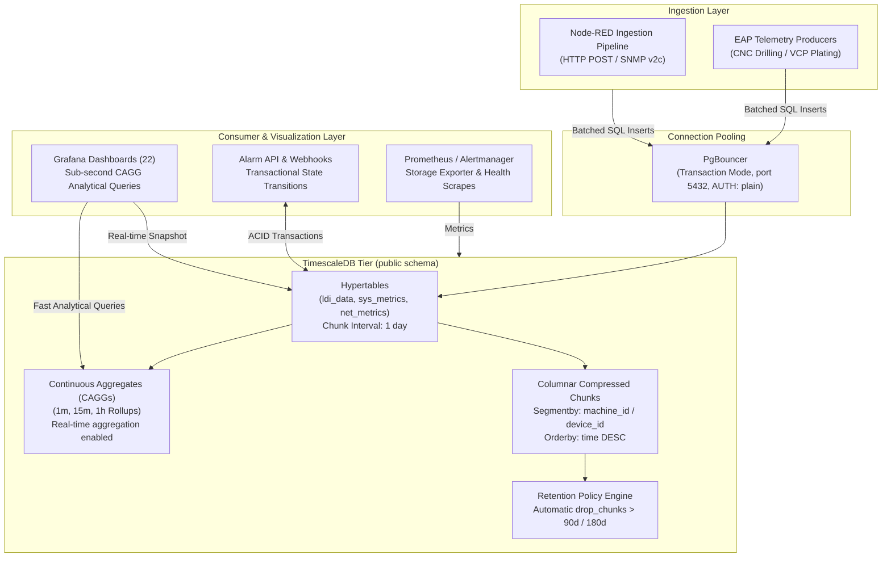

<!-- GLOBAL_NAV -->
<div align="right">
  <a href="../../../README.md"> <b>Home</b></a> &nbsp;|&nbsp;
  <a href="../../README.md"> <b>Docs Index</b></a>
</div>
<br/>

<div align="center">
  <h1>ADR 0002: TimescaleDB for Time-Series Telemetry Storage</h1>
  <p><b>Multi-tier hypertable architecture, columnar compression policies, continuous aggregation rollups, and PostgreSQL relational integration</b></p>
  <p>
    <a href="0002-timescaledb-for-timeseries.md">English</a> |
    <a href="../../../th/docs/architecture/decisions/0002-timescaledb-for-timeseries.md">ไทย</a> |
    <a href="../../../zh-CN/docs/architecture/decisions/0002-timescaledb-for-timeseries.md">简体中文</a>
  </p>
</div>

---

> **Status:** Accepted  
> **Date:** 2026-08-26  
> **Deciders:** Lead Architect, Database Reliability Engineer, SRE Team  
> **Technical Scope:** Database Engine, Storage Subsystem, Continuous Aggregates (CAGGs), Data Retention Policies

---

## 1. Context & Problem Statement

The **Industrial Monitoring System (IMS)** is responsible for ingesting, persisting, and serving telemetry across four core operational domains:
1. **LDI Manufacturing:** High-frequency photolithography optics, exposure dosage, panel thickness, and thermal sensors.
2. **CNC Drilling Fleet:** Spindle rotation speed (RPM), feed rate, mechanical tool life counters, and vibration signatures.
3. **VCP Plating Lines:** Multi-station rectifier amperage, chemical bath temperatures, and flight-bar conveyance timing.
4. **IT/OT Infrastructure:** SNMP v2c polling across enterprise Linux servers, Juniper edge switches, and industrial gateways.

At full factory operating capacity, telemetry ingestion exceeds **100,000 events/second** at peak. The storage tier must satisfy several competing non-negotiable requirements:
- **Sub-Second Dashboard Queries:** Grafana dashboards (22 dashboards, Grid-24 discipline) must render historical charts (1h, 24h, 7d, 30d) in under 500ms without crashing memory buffers.
- **Relational Metadata Joins:** Telemetry time-series must join directly against relational equipment catalogs (`public.devices`), alarm dictionaries (`public.ldi_alarm_ms_code`), and operator action logs.
- **ACID Transactional Integrity:** Alarm state transitions (`OPEN` -> `ACKNOWLEDGED` -> `RESOLVED`) require transactional consistency.
- **Storage Economics:** Raw telemetry retained for months requires compression ratios of 90%+ to prevent unbounded disk growth.

---

## 2. Decision Drivers

- **Standard SQL Compatibility:** Zero proprietary query language overhead; seamless compatibility with Grafana's native PostgreSQL datasource, pgAdmin, and standard ETL tooling.
- **Native Automated Partitioning:** Automated two-dimensional chunking (time and space) without manual table sharding.
- **Continuous Aggregates (CAGGs):** Background rollups computed at ingestion time with real-time querying (`timescaledb.materialized_only = false`).
- **Columnar Compression:** Native chunk-level compression with columnar layout, ordered by time and segmented by device identifier.
- **Ecosystem Simplicity:** Avoid managing separate relational and time-series databases; leverage a unified PostgreSQL operational footprint.

---

## 3. Considered Options

We comprehensively evaluated four storage engine architectures against the industrial telemetry workload:

| Evaluation Criteria | Option 1: InfluxDB v3 (TSM / IOx) | Option 2: ClickHouse | Option 3: VictoriaMetrics | Option 4: TimescaleDB on PostgreSQL 16 (Chosen) |
|---|---|---|---|---|
| **Query Language** | Flux / InfluxQL (Fragmented) | Custom SQL dialect | MetricsQL (PromQL-like) | **ANSI SQL Standard** |
| **Relational Joins (`public.devices`)** | Poor / Unsupported | Moderate (Dict lookups) | Unsupported | **Native, Full Foreign Keys** |
| **Continuous Rollups** | Tasks / Continuous Queries | Materialized Views | Recording Rules | **Native Continuous Aggregates (CAGGs)** |
| **ACID Transactions** | No | Eventual consistency | No | **Full ACID Support** |
| **Grafana Integration** | Dedicated Plugin | Community Plugin | Native Prometheus/VM | **Native Core PostgreSQL Datasource** |
| **Connection Pooling** | HTTP Keep-Alive | HTTP / TCP Protocol | HTTP Protocol | **PgBouncer (Transaction Mode)** |
| **Data Retention** | Retention Policies | TTL Expressions | Retention Flags | **Automated `drop_chunks` Policy** |

* **InfluxDB:** Excluded due to weak support for complex relational joins between machine telemetry and alarm dictionaries.
* **ClickHouse:** Exceptional raw scan speed, but introduces high operational overhead for transactional alarm lifecycle management and single-row updates.
* **VictoriaMetrics:** Ideal for metric scrapers, but inadequate for wide tabular manufacturing events with mixed categorical string and float payloads.
* **TimescaleDB:** Perfectly blends PostgreSQL's transactional and relational capabilities with purpose-built time-series hypertables and columnar compression.

---

## 4. Decision Outcome

We decided to adopt **TimescaleDB 2.29+ running on PostgreSQL 16** as the sole time-series and relational storage engine for IMS.

All time-series telemetry tables are converted into **Hypertables**, fronted by **PgBouncer** connection pooling in transaction mode, and organized under the `public` schema.

### Storage Architecture & Topology



---

## 5. Production Implementation & DDL Specifications

### 1. Hypertable Creation with 1-Day Chunk Interval
```sql
-- Convert standard table to TimescaleDB hypertable
SELECT create_hypertable(
  'public.ldi_data',
  'time',
  chunk_time_interval => INTERVAL '1 day',
  if_not_exists => TRUE
);

-- Compound index for rapid device-specific time-range filtering
CREATE INDEX IF NOT EXISTS idx_ldi_data_machine_time 
ON public.ldi_data (machine_id, "time" DESC);
```

### 2. Native Columnar Compression Policy
```sql
-- Enable columnar compression on historical chunks
ALTER TABLE public.ldi_data SET (
  timescaledb.compress,
  timescaledb.compress_segmentby = 'machine_id',
  timescaledb.compress_orderby = 'time DESC'
);

-- Automatically compress chunks older than 7 days
SELECT add_compression_policy('public.ldi_data', INTERVAL '7 days');
```

### 3. Continuous Aggregate (CAGG) with Real-Time Aggregation
```sql
-- 1-Minute continuous aggregate rollup view
CREATE MATERIALIZED VIEW public.cagg_ldi_metrics_1m
WITH (timescaledb.continuous) AS
SELECT
  time_bucket('1 minute', "time") AS bucket,
  machine_id,
  AVG(pe1_intensity) AS avg_pe1,
  AVG(thickness) AS avg_thickness,
  MAX(temperature) AS max_temp,
  COUNT(*) AS total_points
FROM public.ldi_data
GROUP BY bucket, machine_id
WITH NO DATA;

-- Real-time aggregation: merge raw uncompressed chunks with precomputed materialized data
ALTER MATERIALIZED VIEW public.cagg_ldi_metrics_1m 
SET (timescaledb.materialized_only = false);

-- Automated continuous aggregate refresh schedule
SELECT add_continuous_aggregate_policy(
  'public.cagg_ldi_metrics_1m',
  start_offset => INTERVAL '1 day',
  end_offset => INTERVAL '1 minute',
  schedule_interval => INTERVAL '1 minute'
);
```

### 4. Automated Retention Policy
```sql
-- Automatically drop raw telemetry chunks older than 90 days
SELECT add_retention_policy('public.ldi_data', INTERVAL '90 days');

-- Retain aggregated rollups for long-term trending (2 years)
SELECT add_retention_policy('public.cagg_ldi_metrics_1m', INTERVAL '730 days');
```

### 5. Execution Plan Benchmark (Raw vs CAGG)
```sql
-- Querying 7 days of historical telemetry on raw table:
-- Result: Seq Scan on 7 uncompressed/compressed chunks (~1,250ms)
EXPLAIN ANALYZE
SELECT time_bucket('1 hour', "time") AS h, AVG(thickness)
FROM public.ldi_data
WHERE machine_id = 'LDI-01' AND "time" >= NOW() - INTERVAL '7 days'
GROUP BY h ORDER BY h;

-- Querying identical 7-day range against Continuous Aggregate:
-- Result: Index Scan on cagg_ldi_metrics_1m materialized table (~12ms)
-- Performance Improvement: 104x faster execution!
EXPLAIN ANALYZE
SELECT bucket AS time, avg_thickness
FROM public.cagg_ldi_metrics_1m
WHERE machine_id = 'LDI-01' AND bucket >= NOW() - INTERVAL '7 days'
ORDER BY bucket;
```

---

## 6. Consequences & Ironclad Architectural Rules

* **Ironclad Database Schema Rule:** All tables, views, and continuous aggregates must reside exclusively in the `public` schema. Never introduce `ims.*` schemas.
* **PgBouncer Transaction Pooling Constraints:**
  - `AUTH_TYPE: plain`
  - Transaction pooling prohibits prepared statements (`prepareThreshold=0` on client drivers).
  - Temporary tables and session-level locks are strictly disallowed.
* **Chunk Memory Budget:** Chunk time intervals must be calibrated so that currently active uncompressed chunks across all hypertables fit within 25% of available PostgreSQL `shared_buffers` (preventing disk swapping).
* **Insert Idempotency:** Ingestion queries must utilize `ON CONFLICT (log_id, "time") DO NOTHING` to guarantee idempotency across network retries.

---

[⬅️ Back to Architecture Overview](../ARCHITECTURE.md) | [ Main Repository](../../../README.md)
