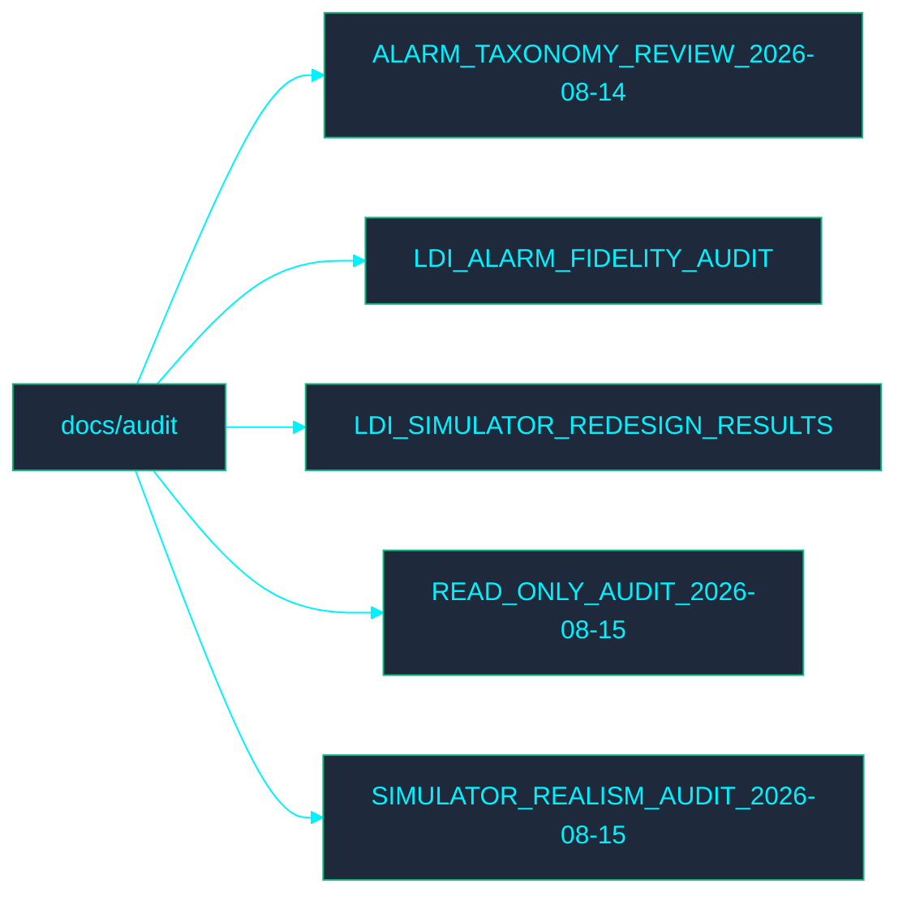

<!-- GLOBAL_NAV -->

  <a href="../../README.md"> <b>Home</b></a> &nbsp;|&nbsp;
  <a href="../../docs/README.md"> <b>Docs Index</b></a>

 

#  审计文档 (Audit Documentation)

欢迎来到 **Audit** 目录。本节包含与 IMS 审计流程相关的文档。

## ️ 目录映射 (Directory Map)

##  文件索引 (File Index)

- [ALARM_TAXONOMY_REVIEW_2026-08-14.md](ALARM_TAXONOMY_REVIEW_2026-08-14.md)
- [LDI_ALARM_FIDELITY_AUDIT.md](LDI_ALARM_FIDELITY_AUDIT.md)
- [LDI_SIMULATOR_REDESIGN_RESULTS.md](LDI_SIMULATOR_REDESIGN_RESULTS.md)
- [READ_ONLY_AUDIT_2026-08-15.md](READ_ONLY_AUDIT_2026-08-15.md)
- [SIMULATOR_REALISM_AUDIT_2026-08-15.md](SIMULATOR_REALISM_AUDIT_2026-08-15.md)
