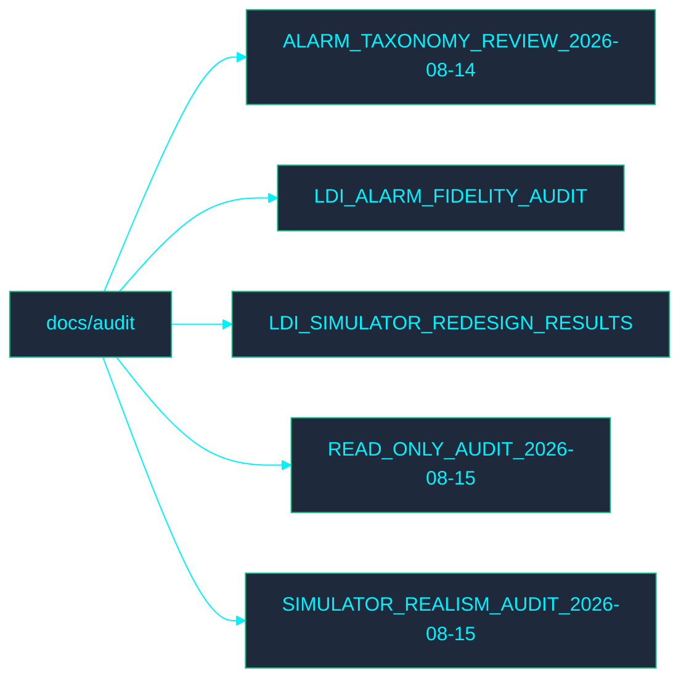

<!-- GLOBAL_NAV -->

  <a href="../../README.md"> <b>Home</b></a> &nbsp;|&nbsp;
  <a href="../../docs/README.md"> <b>Docs Index</b></a>

 

# 📁 Audit Documentation

Welcome to the **Audit** directory. This section contains documentation related to IMS audit processes.

## 🗺️ Directory Map

## 📄 File Index

- [ALARM_TAXONOMY_REVIEW_2026-08-14.md](ALARM_TAXONOMY_REVIEW_2026-08-14.md)
- [LDI_ALARM_FIDELITY_AUDIT.md](LDI_ALARM_FIDELITY_AUDIT.md)
- [LDI_SIMULATOR_REDESIGN_RESULTS.md](LDI_SIMULATOR_REDESIGN_RESULTS.md)
- [READ_ONLY_AUDIT_2026-08-15.md](READ_ONLY_AUDIT_2026-08-15.md)
- [SIMULATOR_REALISM_AUDIT_2026-08-15.md](SIMULATOR_REALISM_AUDIT_2026-08-15.md)
