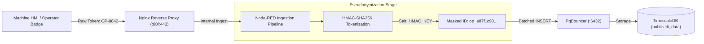

<!-- GLOBAL_NAV -->
<div align="right">
  <a href="../../README.md"> <b>Home</b></a> &nbsp;|&nbsp;
  <a href="../README.md"> <b>Docs Index</b></a>
</div>
<br/>

<div align="center">
  <h1>IMS Industrial Data Governance, Compliance & Privacy Policy</h1>
  <p><b>Data classification, regulatory compliance (IEC 62443, ISO 27001, PDPA), PII pseudonymization, TimescaleDB retention policies, and Role-Based Access Control (RBAC)</b></p>
  <p>
    <a href="DATA_GOVERNANCE.md">English</a> |
    <a href="../../th/docs/data/DATA_GOVERNANCE.md">ไทย</a> |
    <a href="../../zh-CN/docs/data/DATA_GOVERNANCE.md">简体中文</a>
  </p>
</div>

---

## 1. Executive Summary & Governance Scope

The Industrial Monitoring System (IMS) processes telemetry from high-precision manufacturing equipment (Laser Direct Imaging, CNC mechanical drills, Vertical Continuous Plating lines) and enterprise IT/OT network infrastructure. This governance policy establishes mandatory controls for data classification, retention lifecycles, cryptographic protection, personal data de-identification, and role-based access control across all ingestion pipelines, storage engines, and visualization layers.

All data handling complies with:
- **IEC 62443-3-3**: Industrial communication networks – Network and system security (Zones, Conduits, and Data Integrity).
- **ISO/IEC 27001:2022**: Information security, cybersecurity, and privacy protection (Access Control A.9, Cryptography A.10, Operations Security A.12).
- **Thailand Personal Data Protection Act (PDPA B.E. 2562)**: De-identification and pseudonymization of operator identifiers and workstation personnel logs.

---

## 2. Four-Tier Data Classification Matrix

Every data asset within IMS is cataloged under one of four security tiers:

| Security Tier | Data Description & Examples | Primary Storage Engine | Encryption Requirements | Default Retention Period | Access Clearance |
|:--------------|:----------------------------|:-----------------------|:------------------------|:-------------------------|:-----------------|
| **Tier 1: Public** | System architecture diagrams, public schema definitions, open-source API documentation, metric ontology definitions. | Git repository (`docs/`) | Plaintext (Public read) | Permanent / Git versioned | Anonymous / Open |
| **Tier 2: Internal** | Aggregate telemetry (15m, 1h CAGGs), Grafana dashboard layouts, alert rule definitions, container health metrics (`sys_metrics`). | TimescaleDB (`public`), Prometheus TSDB | TLS 1.3 in transit, AES-256 at rest | 2 Years | Authenticated Staff / Engineers |
| **Tier 3: Confidential** | Raw LDI telemetry (`ldi_data`), CNC spindle vibrations (`machine_event`), chemical bath concentrations (`vcp_upp`), switch port counters (`net_metrics`). | TimescaleDB hypertables, PgBouncer pooler | TLS 1.3 in transit, Volume encryption | 90 Days (Raw chunks) | Production Engineers / Data Analysts |
| **Tier 4: Restricted (PII)** | Machine operator badge IDs, shift technician notes, internal static IP topology maps, administrative database credentials. | Secret stores (`.env`), Scrubber pipeline | TLS 1.3 + HMAC-SHA256 salted hash | 30 Days (Pseudonymized) | System Administrators only |

---

## 3. PII Pseudonymization & De-Identification Architecture

To prevent compliance violations under PDPA and GDPR, employee badge numbers and operator identities captured at machine HMIs are never stored in raw plaintext inside time-series hypertables.



### Ingestion Pipeline Masking Implementation (Node.js)

In Node-RED ingestion functions, PII masking is executed synchronously in-memory with zero heap allocation leaks:

```javascript
// Node-RED Function Node: De-identify Operator Token
const crypto = global.get('crypto') || require('crypto');
const hmacKey = process.env.PII_HMAC_SALT || 'default-ims-secure-salt-2026';

function maskOperatorId(rawOperator) {
  if (!rawOperator || typeof rawOperator !== 'string') {
    return 'ANON-OPERATOR';
  }
  // Generate deterministic 12-character pseudonym
  const hash = crypto.createHmac('sha256', hmacKey)
                     .update(rawOperator.trim().toUpperCase())
                     .digest('hex');
  return `op_${hash.substring(0, 12)}`;
}

// Transform payload before batching into database buffer
if (msg.payload && msg.payload.operator_id) {
  msg.payload.operator_id = maskOperatorId(msg.payload.operator_id);
}

return msg;
```

---

## 4. TimescaleDB Data Retention & Chunk Lifecycle Policies

TimescaleDB partitions time-series tables into discrete underlying chunks. Retention and compression policies are enforced automatically by the TimescaleDB background job scheduler, eliminating manual vacuum overhead.

```
Raw Telemetry (0 - 7 Days)
  └── Uncompressed Chunks (1-hour / 1-day intervals)
      └── Query Target: Real-time monitoring & high-resolution root cause analysis

Compressed Historical (7 - 90 Days)
  └── Columnar Compressed Chunks (90%+ disk compression ratio)
      └── Query Target: Batch analytics & weekly trend audits

Continuous Aggregates (90 Days - 2 Years)
  └── Materialized Views (15m, 1h buckets)
      └── Query Target: Long-term executive KPI dashboards & capacity forecasting

Data Pruning (> 90 Days Raw / > 2 Years CAGGs)
  └── Automated drop_chunks() execution
```

### Automated Hypertable Retention SQL DDL

```sql
-- Connect to factory telemetry database (public schema only)
\c factory_telemetry;

-- 1. Enable Columnar Compression after 7 days
ALTER TABLE public.ldi_data SET (
  timescaledb.compress,
  timescaledb.compress_segmentby = 'eqp_id, process',
  timescaledb.compress_orderby = 'time DESC'
);

SELECT add_compression_policy('public.ldi_data', INTERVAL '7 days');

-- 2. Drop raw chunks older than 90 days
SELECT add_retention_policy('public.ldi_data', INTERVAL '90 days');

-- 3. Configure retention policies for Continuous Aggregates
SELECT add_retention_policy('public.ldi_data_1m', INTERVAL '14 days');
SELECT add_retention_policy('public.ldi_data_15m', INTERVAL '90 days');
SELECT add_retention_policy('public.ldi_data_1h', INTERVAL '2 years');
SELECT add_retention_policy('public.sys_metrics_1h', INTERVAL '2 years');
SELECT add_retention_policy('public.net_metrics_1h', INTERVAL '2 years');
```

### Manual Chunk Inspection and Maintenance Queries

```sql
-- Inspect active chunks, compression status, and physical size
SELECT
  chunk_name,
  hypertable_name,
  range_start,
  range_end,
  is_compressed,
  pg_size_pretty(before_compression_total_bytes) AS uncompressed_size,
  pg_size_pretty(after_compression_total_bytes) AS compressed_size
FROM timescaledb_information.chunks
WHERE hypertable_name = 'ldi_data'
ORDER BY range_start DESC
LIMIT 10;

-- Manually drop chunks older than 90 days if emergency disk space recovery is required
SELECT drop_chunks('public.ldi_data', older_than => NOW() - INTERVAL '90 days');
```

---

## 5. Role-Based Access Control (RBAC) & Database DDL

Access privileges follow the Principle of Least Privilege (PoLP). All application access routes through PgBouncer in transaction pooling mode.

> [!IMPORTANT]
> **Ironclad Architectural Rule**: All tables, views, and Continuous Aggregates reside in the `public` schema. Never create or grant permissions on an `ims` schema.

### Role Definition Matrix

| Role Name | Granted Permissions | Intended Client / Service | Direct Shell Access |
|:----------|:---------------------|:--------------------------|:--------------------|
| `ims_readonly` | `SELECT` on all tables & views in `public` | Grafana data source, Redash, Metabase | No (PgBouncer only) |
| `ims_ingest` | `INSERT`, `SELECT` on hypertables in `public` | Node-RED ingestion pipeline | No (PgBouncer only) |
| `ims_analyst` | `SELECT`, `CREATE TEMP` in `public` | Data science exploratory notebooks | No (PgBouncer only) |
| `ims_admin` | `ALL PRIVILEGES` on database and schema | Database migration scripts, DBA | Yes (Authorized bastion host) |

### PostgreSQL User & Permission DDL

```sql
-- 1. Create Application Roles
CREATE ROLE ims_readonly WITH LOGIN PASSWORD 'CHANGE_IN_PRODUCTION_ENV';
CREATE ROLE ims_ingest WITH LOGIN PASSWORD 'CHANGE_IN_PRODUCTION_ENV';
CREATE ROLE ims_analyst WITH LOGIN PASSWORD 'CHANGE_IN_PRODUCTION_ENV';

-- 2. Revoke public default privileges
REVOKE CREATE ON SCHEMA public FROM PUBLIC;

-- 3. Grant Ingestion Pipeline Permissions (Least Privilege)
GRANT CONNECT ON DATABASE factory_telemetry TO ims_ingest;
GRANT USAGE ON SCHEMA public TO ims_ingest;
GRANT INSERT, SELECT ON TABLE public.ldi_data TO ims_ingest;
GRANT INSERT, SELECT ON TABLE public.sys_metrics TO ims_ingest;
GRANT INSERT, SELECT ON TABLE public.net_metrics TO ims_ingest;

-- 4. Grant Read-Only Reporting Permissions (Grafana)
GRANT CONNECT ON DATABASE factory_telemetry TO ims_readonly;
GRANT USAGE ON SCHEMA public TO ims_readonly;
GRANT SELECT ON ALL TABLES IN SCHEMA public TO ims_readonly;
ALTER DEFAULT PRIVILEGES IN SCHEMA public GRANT SELECT ON TABLES TO ims_readonly;

-- 5. Restrict connection limits to prevent connection pool starvation
ALTER ROLE ims_readonly CONNECTION LIMIT 30;
ALTER ROLE ims_ingest CONNECTION LIMIT 20;
```

---

## 6. Audit Logging & Verification Commands

All administrative operations and connection activities are logged via PgBouncer and PostgreSQL server logs:

```bash
# Verify active PgBouncer client and server connections
docker exec -it ims-pgbouncer psql -p 6432 -U postgres -c "SHOW CLIENTS;"
docker exec -it ims-pgbouncer psql -p 6432 -U postgres -c "SHOW POOLS;"

# Verify TimescaleDB scheduled job execution status
docker exec -it ims-timescaledb psql -U postgres -d factory_telemetry -c "
SELECT
  job_id,
  application_name,
  schedule_interval,
  last_run_started_at,
  last_successful_finish,
  last_run_status
FROM timescaledb_information.jobs
ORDER BY job_id;
"
```
