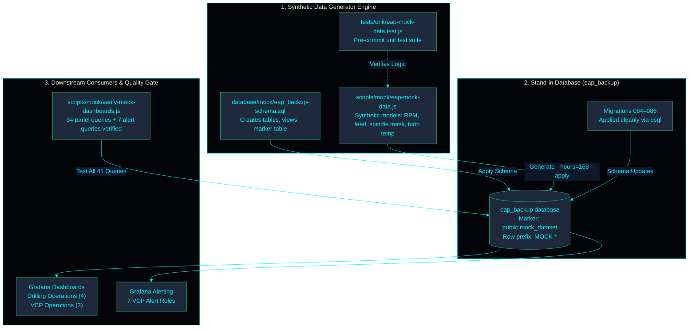

<!-- GLOBAL_NAV -->
<div align="right">
  <a href="../../README.md"> <b>Home</b></a> &nbsp;|&nbsp;
  <a href="../README.md"> <b>Docs Index</b></a>
</div>
<br/>

<div align="center">
  <h1>Synthetic Drilling & VCP Operational Data Architecture</h1>
  <p><b>Isolated stand-in database generator, rule-based synthetic telemetry, migration boundaries, and dashboard verification</b></p>
  <p>
    <a href="MOCK_DATA.md">English</a> |
    <a href="../../th/docs/data/MOCK_DATA.md">ไทย</a> |
    <a href="../../zh-CN/docs/data/MOCK_DATA.md">简体中文</a>
  </p>
</div>

---

The drilling and VCP dashboards read the `eap_backup` database. On the plant server that database is a restore of factory data, and it is not in git. This page shows how to build a stand-in `eap_backup` from generated data, so the drilling folder, the VCP folder, the VCP alert rules and migrations 084–086 all run with no factory data.

---

## 1. Mock Data Pipeline & Verification Topology



---

## 2. Core Components

| Component | Repository Path | Functional Role |
|---|---|---|
| **Schema Definition** | `database/mock/eap_backup-schema.sql` | Instantiates tables and views required by drilling/VCP dashboards, alert rules, and migrations 084–086. |
| **Data Generator** | `scripts/mock/eap-mock-data.js` | Generates realistic synthetic drilling cycle events and VCP plating telemetry. |
| **Query Verifier** | `scripts/mock/verify-mock-dashboards.js` | Executes every drilling/VCP dashboard panel query and alert rule; validates returned row counts. |
| **Unit Test Suite** | `tests/unit/eap-mock-data.test.js` | Validates generator logic and data shapes in memory without database dependency (runs in CI). |

Every value is synthetic: machine counts, setpoints, recipes, panel sizes, lot codes, and alarm messages. None of it is derived from real factory operations.

The generator preserves the exact data shapes that the dashboards parse:
- Event codes and message formats.
- Equipment ID shapes (`-VCP` suffix for plating lines).
- Swapped bath tags (`preset_<bath>` is the measured reading, `actual_<bath>` is the target setpoint).
- Recipe identity: $\text{plating\_time} \times \text{line\_speed} = 54$.
- Triggered / Reset alarm pairs.

---

## 3. Operational Safety & Isolation

- **Production Guard:** The schema script aborts immediately if executed against a database containing `machine_event` or `vcp_upp` without the `public.mock_dataset` marker table, preventing accidental overwrites of restored plant databases.
- **Transactional Safety:** `--apply` runs within a single atomic transaction and validates the marker table before inserting records.
- **Scoped Cleanup:** Every generated record carries an identifier prefixed with `MOCK-`. Running `--undo --apply` safely purges only generated rows.

---

## 4. Execution on an Empty Stack

When `eap_backup` does not yet exist on a fresh installation, run the following commands from the repository root:

```bash
docker exec -i ims-timescaledb sh -c 'psql -U "$POSTGRES_USER" -d postgres -c "CREATE DATABASE eap_backup"'
docker exec -i ims-timescaledb sh -c 'psql -U "$POSTGRES_USER" -d eap_backup -v ON_ERROR_STOP=1' < database/mock/eap_backup-schema.sql
for m in 084 085 086; do
  docker exec -i ims-timescaledb sh -c 'psql -U "$POSTGRES_USER" -d "$POSTGRES_DB" -v ON_ERROR_STOP=1' < database/migrations/$m-*.sql
done
node scripts/mock/eap-mock-data.js --hours=168 --apply   # 7 days of operational data
```

---

## 5. Execution in a Disposable Container

To verify the complete mock pipeline without modifying the active development stack:

```bash
docker run -d --name ims-mock-verify -e POSTGRES_PASSWORD=mockonly -e POSTGRES_DB=ims timescale/timescaledb:2.29.2-pg16
docker exec ims-mock-verify psql -U postgres -d ims -c "CREATE DATABASE eap_backup"
docker exec -i ims-mock-verify psql -U postgres -d eap_backup -v ON_ERROR_STOP=1 < database/mock/eap_backup-schema.sql
for m in 084 085 086; do 
  docker exec -i ims-mock-verify psql -U postgres -d ims -v ON_ERROR_STOP=1 < database/migrations/$m-*.sql
done
node scripts/mock/eap-mock-data.js --hours=168 --apply --container=ims-mock-verify --psql-user=postgres
node scripts/mock/verify-mock-dashboards.js --container=ims-mock-verify --psql-user=postgres
docker rm -f ims-mock-verify
```

---

## 6. Generator Options & CLI Flags

| Flag | Default | Description |
|---|---|---|
| `--hours=N` | `24` | Historical window duration ending at current timestamp. |
| `--seed=N` | `20260928` | Deterministic random seed for reproducible datasets. |
| `--drilling=N` | `12` | Number of simulated drilling machines (range: 3–200). |
| `--incidents` | `false` | Injects deliberate anomalies into the last 35 minutes to trigger all 7 VCP alert rules. |
| `--apply` | `false` | Commits generated rows directly to database. Without `--apply`, output prints to file. |
| `--undo` | `false` | When paired with `--apply`, deletes all records prefixed with `MOCK-`. |
| `--container` | `ims-timescaledb` | Target Docker container name. |

---

## 7. Verified Test Results

Evidence recorded against TimescaleDB 2.29.2-pg16:
- Schema and migrations 084, 085, and 086 apply cleanly with zero errors.
- **Healthy Baseline (168 hours):** 41 queries executed with **0 errors**. All 34 dashboard panel queries return valid data, and all 7 alert breach queries return 0 rows (plant healthy).
- **Incident Injection (`--incidents`):** All 7 VCP alert rules fire positive breaches in the final 35-minute window.

---

[⬅️ Back to Telemetry Ontology](TELEMETRY_ONTOLOGY.md) | [ Main Repository](../../README.md)
