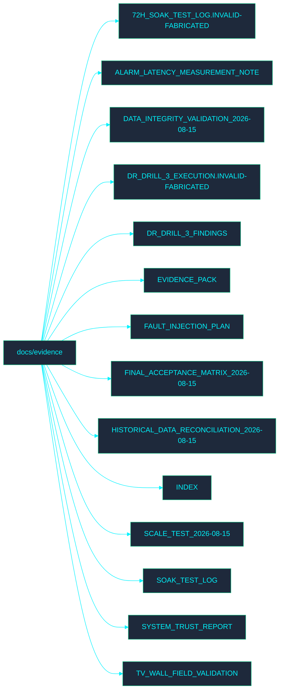

# 📁 Evidence Documentation

Welcome to the **Evidence** directory. This section contains documentation related to IMS evidence processes.

## 🗺️ Directory Map

## 📄 File Index

- [72H_SOAK_TEST_LOG.INVALID-FABRICATED.md](72H_SOAK_TEST_LOG.INVALID-FABRICATED.md)
- [ALARM_LATENCY_MEASUREMENT_NOTE.md](ALARM_LATENCY_MEASUREMENT_NOTE.md)
- [DATA_INTEGRITY_VALIDATION_2026-08-15.md](DATA_INTEGRITY_VALIDATION_2026-08-15.md)
- [DR_DRILL_3_EXECUTION.INVALID-FABRICATED.md](DR_DRILL_3_EXECUTION.INVALID-FABRICATED.md)
- [DR_DRILL_3_FINDINGS.md](DR_DRILL_3_FINDINGS.md)
- [EVIDENCE_PACK.md](EVIDENCE_PACK.md)
- [FAULT_INJECTION_PLAN.md](FAULT_INJECTION_PLAN.md)
- [FINAL_ACCEPTANCE_MATRIX_2026-08-15.md](FINAL_ACCEPTANCE_MATRIX_2026-08-15.md)
- [HISTORICAL_DATA_RECONCILIATION_2026-08-15.md](HISTORICAL_DATA_RECONCILIATION_2026-08-15.md)
- [INDEX.md](INDEX.md)
- [SCALE_TEST_2026-08-15.md](SCALE_TEST_2026-08-15.md)
- [SOAK_TEST_LOG.md](SOAK_TEST_LOG.md)
- [SYSTEM_TRUST_REPORT.md](SYSTEM_TRUST_REPORT.md)
- [TV_WALL_FIELD_VALIDATION.md](TV_WALL_FIELD_VALIDATION.md)
