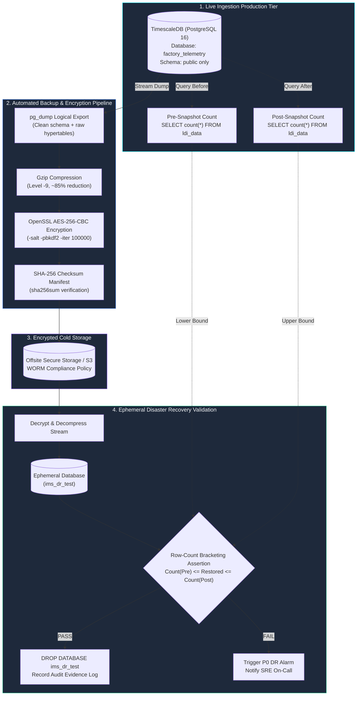

<!-- GLOBAL_NAV -->
<div align="right">
  <a href="../../README.md"> <b>Home</b></a> &nbsp;|&nbsp;
  <a href="../README.md"> <b>Docs Index</b></a>
</div>
<br/>

<div align="center">
  <h1>IMS Database Backup, Restore & Verification Procedures</h1>
  <p><b>Enterprise pg_dump pipelines, AES-256 encrypted storage, ephemeral row-count bracketing validation, and Point-In-Time Recovery (PITR)</b></p>
  <p>
    <a href="BACKUP_RESTORE.md">English</a> |
    <a href="../../th/docs/operations/BACKUP_RESTORE.md">ไทย</a> |
    <a href="../../zh-CN/docs/operations/BACKUP_RESTORE.md">简体中文</a>
  </p>
</div>

---

> **Audience:** SRE / Operations, Database Engineers, Security Auditors  
> **Recovery Targets:** Recovery Time Objective (RTO) < 15 minutes \| Recovery Point Objective (RPO) < 1 hour  
> **Compliance Alignment:** ISO 27001 A.12.3 (Information Backup), IEC 62443-4-2 (Data Integrity)  
> **Provenance:** Based on verified runs of `scripts/dr-test.sh` on the production stack with real data and live ingestion.

---

## 1. Backup & Recovery Architecture



---

## 2. Production Backup Procedure

The standard production backup exports the complete relational schema and raw hypertable records. It leverages continuous stream compression and symmetric AES-256-CBC encryption to guarantee security at rest.

### Automated Backup Script (`scripts/backup-production.sh`)

```bash
#!/usr/bin/env bash
set -euo pipefail

# Configuration
BACKUP_DIR="/var/backups/ims"
TIMESTAMP=$(date -u +"%Y%m%d_%H%M%SZ")
BACKUP_FILE="${BACKUP_DIR}/ims_backup_${TIMESTAMP}.sql.gz.enc"
CHECKSUM_FILE="${BACKUP_FILE}.sha256"
CONTAINER_NAME="ims-timescaledb"
DB_NAME="${POSTGRES_DB:-factory_telemetry}"
DB_USER="${POSTGRES_USER:-postgres}"

mkdir -p "${BACKUP_DIR}"

echo "==> [1/4] Recording pre-snapshot row count..."
PRE_COUNT=$(docker exec "${CONTAINER_NAME}" psql -U "${DB_USER}" -d "${DB_NAME}" -tAc "SELECT count(*) FROM public.ldi_data;")

echo "==> [2/4] Executing pg_dump with Gzip compression and AES-256 encryption..."
# Circular FK warnings on timescaledb_information catalogs are harmless and expected
docker exec "${CONTAINER_NAME}" pg_dump -U "${DB_USER}" -d "${DB_NAME}"   --format=plain   --no-owner   --no-privileges   | gzip -9   | openssl enc -aes-256-cbc -salt -pbkdf2 -iter 100000 -out "${BACKUP_FILE}" -pass env:BACKUP_ENCRYPTION_KEY

echo "==> [3/4] Recording post-snapshot row count..."
POST_COUNT=$(docker exec "${CONTAINER_NAME}" psql -U "${DB_USER}" -d "${DB_NAME}" -tAc "SELECT count(*) FROM public.ldi_data;")

echo "==> [4/4] Generating SHA-256 checksum..."
sha256sum "${BACKUP_FILE}" > "${CHECKSUM_FILE}"

echo "=========================================================="
echo "Backup Completed Successfully!"
echo "File:     ${BACKUP_FILE}"
echo "Size:     $(du -h "${BACKUP_FILE}" | cut -f1)"
echo "Checksum: $(cat "${CHECKSUM_FILE}")"
echo "Bracket:  ${PRE_COUNT} <= Restored <= ${POST_COUNT}"
echo "=========================================================="
```

---

## 3. Ephemeral Restore & Verification Protocol

Because IMS is a **live high-frequency telemetry ingestion engine**, exact point-in-time equality checks between backup and active database will fail. The system enforces **Row-Count Bracketing**: the restored row count must fall within the inclusive interval $[Count_{	ext{pre}}, Count_{	ext{post}}]$.

### Verification Script Execution

To run an automated verification drill without touching live production data:

```bash
# Execute automated backup-restore drill via DR test suite
./scripts/dr-test.sh backup-restore
```

### Manual Verification Workflow

```bash
# 1. Verify SHA-256 integrity
sha256sum -c "${BACKUP_FILE}.sha256"

# 2. Spin up ephemeral validation database
docker exec ims-timescaledb psql -U "$POSTGRES_USER" -d postgres -c "CREATE DATABASE ims_dr_test;"

# 3. Decrypt, decompress, and restore into ephemeral database
openssl enc -d -aes-256-cbc -pbkdf2 -iter 100000 -in "${BACKUP_FILE}" -pass env:BACKUP_ENCRYPTION_KEY   | gunzip   | docker exec -i ims-timescaledb psql -U "$POSTGRES_USER" -d ims_dr_test -v ON_ERROR_STOP=1

# 4. Execute row-count validation query
RESTORED_COUNT=$(docker exec ims-timescaledb psql -U "$POSTGRES_USER" -d ims_dr_test -tAc "SELECT count(*) FROM public.ldi_data;")

echo "Restored Count: ${RESTORED_COUNT}"
# Assert: PRE_COUNT <= RESTORED_COUNT <= POST_COUNT

# 5. Clean teardown of ephemeral test database
docker exec ims-timescaledb psql -U "$POSTGRES_USER" -d postgres -c "DROP DATABASE ims_dr_test;"
```

---

## 4. Post-Restore Continuous Aggregate Refresh

TimescaleDB Continuous Aggregates (CAGGs) store schema definitions in the dump, but the underlying materialized view data is repopulated asynchronously. Following a disaster recovery restore, execute the following SQL to force an immediate refresh:

```sql
-- Connect to restored database
\c factory_telemetry;

-- Force immediate refresh of 1-minute continuous aggregate rollup
CALL refresh_continuous_aggregate('public.cagg_ldi_metrics_1m', NULL, NULL);

-- Force immediate refresh of 1-hour analytical aggregate
CALL refresh_continuous_aggregate('public.cagg_ldi_hourly', NULL, NULL);

-- Verify hypertable chunk restoration and compression status
SELECT 
  hypertable_name,
  num_chunks,
  compressed_chunks
FROM timescaledb_information.hypertables
WHERE hypertable_schema = 'public';
```

---

## 5. Point-in-Time Recovery (PITR) & WAL Archiving

For mission-critical production environments requiring zero data loss (RPO < 5 minutes), Point-in-Time Recovery (PITR) must be enabled via Write-Ahead Log (WAL) archiving.

### PostgreSQL Configuration (`postgresql.conf`)
```ini
# WAL Archiving Configuration
wal_level = replica
archive_mode = on
archive_command = 'test ! -f /var/lib/postgresql/wal_archive/%f && cp %p /var/lib/postgresql/wal_archive/%f'
archive_timeout = 300
```

### Point-in-Time Recovery Execution Procedure
1. Stop the database container: `docker compose stop timescaledb`
2. Restore the latest base backup into the data directory.
3. Place a `recovery.signal` trigger file in the PostgreSQL data directory.
4. Append recovery configuration to `postgresql.conf`:
   ```ini
   restore_command = 'cp /var/lib/postgresql/wal_archive/%f %p'
   recovery_target_time = '2026-09-28 12:00:00 UTC'
   recovery_target_action = 'promote'
   ```
5. Start `timescaledb`: PostgreSQL will replay WAL files up to the target timestamp and automatically promote to read-write mode.

---

## 6. Disaster Recovery Checklist

- [ ] Verify SHA-256 checksum of the target backup file.
- [ ] Confirm no orphaned PgBouncer client transactions remain connected.
- [ ] Validate that all database objects reside strictly in the `public` schema.
- [ ] Execute `refresh_continuous_aggregate` across all CAGGs.
- [ ] Verify Grafana dashboard connectivity at `http://localhost:3000`.
- [ ] Confirm active telemetry ingestion rate via Prometheus `rate(ims_telemetry_ingested_total[1m])`.

---

[⬅️ Back to Operations Runbook](../operations-runbook.md) | [ Main Repository](../../README.md)
