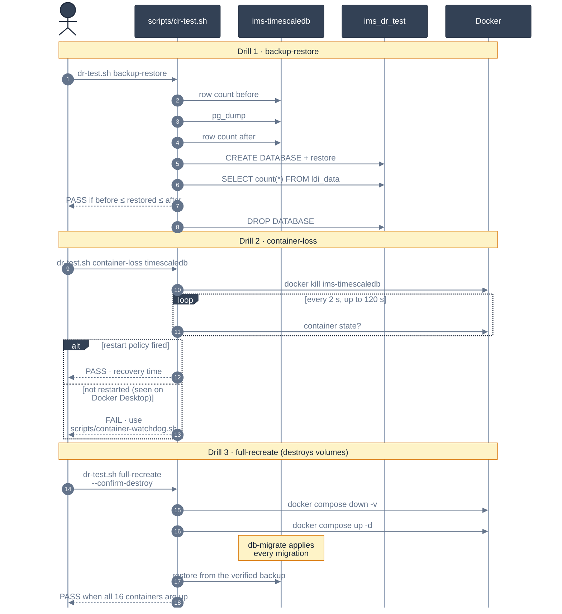

<!-- GLOBAL_NAV -->
<div align="right">
  <a href="../../README.md"> <b>Home</b></a> &nbsp;|&nbsp;
  <a href="../README.md"> <b>Docs Index</b></a>
</div>
<br/>

<div align="center">
  <h1>IMS Disaster Recovery (DR) Test Plan & Verification Drills</h1>
  <p><b>Automated recovery verification, backup validation, container loss self-healing, and full-stack rebuild drills</b></p>
  <p>
    <a href="DR_TEST_PLAN.md">English</a> |
    <a href="../../th/docs/operations/DR_TEST_PLAN.md">ไทย</a> |
    <a href="../../zh-CN/docs/operations/DR_TEST_PLAN.md">简体中文</a>
  </p>
</div>

---

> **Audience:** SRE / Operations, DevOps Engineers, Quality Assurance, Audit & Compliance  
> **Recovery Targets:** Recovery Time Objective (RTO) < 15 minutes \| Recovery Point Objective (RPO) < 1 hour \| Maximum Tolerable Downtime (MTD) < 2 hours  
> **Test Execution Framework:** Modeled after `scripts/dr-test.sh` and `scripts/soak-test-report.sh`. Executes real commands against the active container stack, capturing real timestamps and telemetry evidence without mocked outputs.

---

## 1. Disaster Recovery Lifecycle & Drill Sequences



---

## 2. Drill 1 — Backup / Restore Verification

### Objective
Verify that the production database can be fully dumped and restored into a separate verification database without halting live ingestion or causing record corruption.

### Execution Command
```bash
./scripts/dr-test.sh backup-restore
```

### Verification Criteria & Pass Rules
1. **Zero Impact on Production:** The live database `ims` must remain completely unaffected.
2. **Row-Count Bracketing:** A naive exact equality check (`restored_count == live_count`) will fail in a live manufacturing monitoring platform because incoming telemetry packets continue landing during the snapshot. The drill queries `SELECT count(*) FROM public.ldi_data;` immediately before and immediately after the snapshot:
   $$\text{Count}_{\text{pre}} \le \text{Count}_{\text{restored}} \le \text{Count}_{\text{post}}$$
3. **Automated Teardown:** The throwaway `ims_dr_test` database must be cleanly dropped after row counts are verified.

---

## 3. Drill 2 — Single-Container-Loss Recovery

### Objective
Validate system resilience against unexpected container crashes, kernel out-of-memory (OOM) kills, or underlying host process termination.

### Execution Command
```bash
# Test TimescaleDB container crash recovery
./scripts/dr-test.sh container-loss timescaledb

# Test Node-RED ingestion pipeline container crash recovery
./scripts/dr-test.sh container-loss node-red
```

### Verification Criteria & Pass Rules
1. **Process Termination:** The container is abruptly terminated via `docker kill` (SIGKILL / Exit 137).
2. **Self-Healing Watchdog:** Docker daemon's `restart: unless-stopped` policy must automatically restart the container.
3. **Health Check Convergence:** The container must achieve `running` and pass Docker health checks (`healthy`) within **120 seconds**.
4. **Connection Pool Re-establishment:** Upstream ingestion services (Node-RED's `pg.Pool` connection watchdog) must reconnect automatically without manual intervention.

---

## 4. Drill 3 — Full-Stack Cold Recreate

### Objective
Simulate a catastrophic bare-metal failure requiring a 100% ground-up rebuild of all containers, networks, volumes, schema migrations, and telemetry data.

> [!WARNING]
> **Destructive Operation:** Drill 3 completely destroys all Docker named volumes (`timescaledb_data`, `prometheus_data`, `alertmanager_data`, `grafana_data`). It requires the explicit flag `--confirm-destroy` and must only be executed in disposable staging environments.

### Execution Command
```bash
./scripts/dr-test.sh full-recreate --confirm-destroy
```

### Verification Criteria & Pass Rules
1. **Clean Slate Volume Wipe:** `docker compose down -v` executes cleanly, unmounting all volumes.
2. **Deterministic Migration Application:** `database/migrations/` (013 through 086) must execute sequentially in clean dependency order.
3. **Raw Data Restoration:** Telemetry records from Drill 1 are restored after schema instantiation, preventing circular foreign key conflicts on TimescaleDB continuous aggregate metadata.
4. **Stack Health & Service Readiness:** `timescaledb` reaches `healthy`, migrations complete with 0 pending/failed, raw tables are restored, and gated services (`node-red`, `proxy`, `alarm-api`) reach `running` state.

---

## 5. Disaster Recovery Testing Cadence & Governance

| Drill Type | Frequency | Target Environment | Ownership | Evidence Storage |
|---|---|---|---|---|
| **Drill 1 (Backup/Restore)** | **Monthly** (Automated CI) | Staging / Pre-prod | Database Reliability Engineer | `scripts/dr-test-reports/` |
| **Drill 2 (Container Loss)** | **Quarterly** | Non-Production Staging | SRE On-Call Lead | Incident Review Log |
| **Drill 3 (Full Stack Rebuild)** | **Bi-Annually** | Isolated Lab Environment | Lead Infrastructure Architect | SRE Postmortem Records |

---

## 6. Related Documentation

- `docs/operations/BACKUP_RESTORE.md` — What the backup scripts do today, how to verify a restore, and the encryption and PITR steps that are not shipped yet.
- `docs/operations/INCIDENT_RESPONSE.md` — On-call escalation playbooks and incident response procedures.
- `docs/architecture/DATA_RETENTION.md` — Columnar compression intervals and data retention policies.
- `docs/sre/SLO_DEFINITIONS.md` — Service level objectives and error budget allocation.

---

[⬅️ Back to Operations Runbook](../operations-runbook.md) | [ Main Repository](../../README.md)
