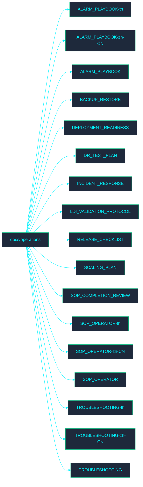

# 📁 Operations Documentation

Welcome to the **Operations** directory. This section contains documentation related to IMS operations processes.

## 🗺️ Directory Map

## 📄 File Index

- [ALARM_PLAYBOOK-th.md](ALARM_PLAYBOOK-th.md)
- [ALARM_PLAYBOOK-zh-CN.md](ALARM_PLAYBOOK-zh-CN.md)
- [ALARM_PLAYBOOK.md](ALARM_PLAYBOOK.md)
- [BACKUP_RESTORE.md](BACKUP_RESTORE.md)
- [DEPLOYMENT_READINESS.md](DEPLOYMENT_READINESS.md)
- [DR_TEST_PLAN.md](DR_TEST_PLAN.md)
- [INCIDENT_RESPONSE.md](INCIDENT_RESPONSE.md)
- [LDI_VALIDATION_PROTOCOL.md](LDI_VALIDATION_PROTOCOL.md)
- [RELEASE_CHECKLIST.md](RELEASE_CHECKLIST.md)
- [SCALING_PLAN.md](SCALING_PLAN.md)
- [SOP_COMPLETION_REVIEW.md](SOP_COMPLETION_REVIEW.md)
- [SOP_OPERATOR-th.md](SOP_OPERATOR-th.md)
- [SOP_OPERATOR-zh-CN.md](SOP_OPERATOR-zh-CN.md)
- [SOP_OPERATOR.md](SOP_OPERATOR.md)
- [TROUBLESHOOTING-th.md](TROUBLESHOOTING-th.md)
- [TROUBLESHOOTING-zh-CN.md](TROUBLESHOOTING-zh-CN.md)
- [TROUBLESHOOTING.md](TROUBLESHOOTING.md)
