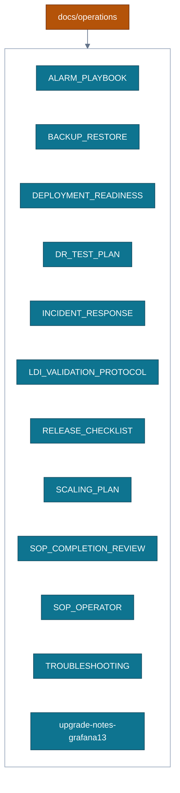

<!-- GLOBAL_NAV -->

  <a href="../../README.md"> <b>Home</b></a> &nbsp;|&nbsp;
  <a href="../README.md"> <b>Docs Index</b></a>

 

#  Operations Documentation

Welcome to the **Operations** directory. This section contains documentation related to IMS operations processes.

##  Directory Map

```mermaid
%%{init: {"flowchart": {"nodeSpacing": 20, "rankSpacing": 32, "padding": 10, "wrappingWidth": 150, "curve": "basis"}, "sequence": {"wrap": true, "width": 170, "actorMargin": 36, "boxMargin": 8, "noteMargin": 8, "messageMargin": 30, "mirrorActors": false}, "state": {"padding": 6}, "theme": "base", "themeVariables": {"fontFamily": "Inter, Segoe UI, Helvetica, Arial, sans-serif", "fontSize": "14px", "primaryColor": "#334155", "primaryTextColor": "#ffffff", "primaryBorderColor": "#1e293b", "lineColor": "#64748b", "textColor": "#64748b", "secondaryColor": "#475569", "tertiaryColor": "#f1f5f9", "clusterBkg": "transparent", "clusterBorder": "#94a3b8", "titleColor": "#64748b", "edgeLabelBackground": "#475569", "nodeTextColor": "#ffffff", "noteBkgColor": "#fef3c7", "noteTextColor": "#1e293b", "noteBorderColor": "#d97706", "actorBkg": "#334155", "actorTextColor": "#ffffff", "actorBorder": "#1e293b", "actorLineColor": "#94a3b8", "signalColor": "#64748b", "signalTextColor": "#64748b", "labelBoxBkgColor": "#334155", "labelBoxBorderColor": "#1e293b", "labelTextColor": "#ffffff", "loopTextColor": "#64748b", "activationBkgColor": "#e2e8f0", "sequenceNumberColor": "#ffffff", "stateLabelColor": "#ffffff", "compositeBackground": "transparent", "transitionColor": "#64748b", "transitionLabelColor": "#64748b"}}}%%
flowchart TB
  accTitle: Files in docs/operations
  accDescr: The 12 documents in docs/operations, listed alphabetically in columns.
  ROOT["docs/operations"]:::store
  subgraph C0[" "]
    direction TB
    F0["ALARM_PLAYBOOK"]:::flow
    F1["BACKUP_RESTORE"]:::flow
    F2["DEPLOYMENT_READINESS"]:::flow
    F3["DR_TEST_PLAN"]:::flow
    F4["INCIDENT_RESPONSE"]:::flow
    F5["LDI_VALIDATION_PROTOCOL"]:::flow
    F6["RELEASE_CHECKLIST"]:::flow
    F7["SCALING_PLAN"]:::flow
    F8["SOP_COMPLETION_REVIEW"]:::flow
    F9["SOP_OPERATOR"]:::flow
    F10["TROUBLESHOOTING"]:::flow
    F11["upgrade-notes-grafana13"]:::flow
    F0 ~~~ F1
    F1 ~~~ F2
    F2 ~~~ F3
    F3 ~~~ F4
    F4 ~~~ F5
    F5 ~~~ F6
    F6 ~~~ F7
    F7 ~~~ F8
    F8 ~~~ F9
    F9 ~~~ F10
    F10 ~~~ F11
  end
  ROOT --> C0
  style C0 fill:transparent,stroke:#94a3b8
  classDef actor fill:#475569,stroke:#1e293b,color:#ffffff,stroke-width:1px
  classDef ext fill:#57534e,stroke:#292524,color:#ffffff,stroke-width:1px
  classDef ingress fill:#1d4ed8,stroke:#1e3a8a,color:#ffffff,stroke-width:1px
  classDef app fill:#0f766e,stroke:#134e4a,color:#ffffff,stroke-width:1px
  classDef flow fill:#0e7490,stroke:#164e63,color:#ffffff,stroke-width:1px
  classDef store fill:#b45309,stroke:#78350f,color:#ffffff,stroke-width:1px
  classDef viz fill:#4338ca,stroke:#312e81,color:#ffffff,stroke-width:1px
  classDef obs fill:#6d28d9,stroke:#4c1d95,color:#ffffff,stroke-width:1px
  classDef notify fill:#b91c1c,stroke:#7f1d1d,color:#ffffff,stroke-width:1px
  classDef future fill:#f8fafc,stroke:#94a3b8,color:#475569,stroke-width:1px,stroke-dasharray:4 3
```

##  File Index

- [ALARM_PLAYBOOK.md](ALARM_PLAYBOOK.md)
- [BACKUP_RESTORE.md](BACKUP_RESTORE.md)
- [DEPLOYMENT_READINESS.md](DEPLOYMENT_READINESS.md)
- [DR_TEST_PLAN.md](DR_TEST_PLAN.md)
- [INCIDENT_RESPONSE.md](INCIDENT_RESPONSE.md)
- [LDI_VALIDATION_PROTOCOL.md](LDI_VALIDATION_PROTOCOL.md)
- [RELEASE_CHECKLIST.md](RELEASE_CHECKLIST.md)
- [SCALING_PLAN.md](SCALING_PLAN.md)
- [SOP_COMPLETION_REVIEW.md](SOP_COMPLETION_REVIEW.md)
- [SOP_OPERATOR.md](SOP_OPERATOR.md)
- [TROUBLESHOOTING.md](TROUBLESHOOTING.md)
- [upgrade-notes-grafana13.md](upgrade-notes-grafana13.md)
