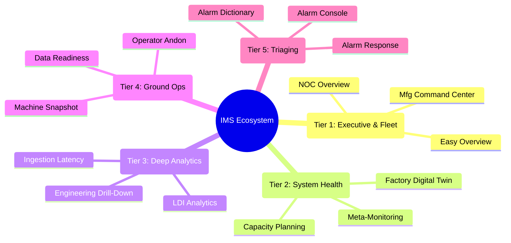

<!-- GLOBAL_NAV -->

  <a href="../../README.md"> <b>Home</b></a> &nbsp;|&nbsp;
  <a href="../README.md"> <b>Docs Index</b></a>

 

#  IMS Dashboard Ecosystem: Macro-to-Micro Architecture

**Industrial Monitoring System (IMS)** utilizes a **15-dashboard "Cyberpunk HUD" ecosystem** designed to completely eliminate alarm fatigue and bridge the gap between enterprise IT and physical Operational Technology (OT).

This document serves as the master catalog, structurally organized by **Altitude (Macro to Micro)**—ensuring the right data reaches the right persona at the exact moment of decision.

---

## 🗺️ Ecosystem Topology

> [!TIP]
> **Performance Architecture:** None of these dashboards query raw telemetry for timeframes exceeding 24 hours. They are explicitly powered by **TimescaleDB Continuous Aggregates (CAGGs)**, guaranteeing sub-second load times regardless of query depth or user concurrency. All dashboards conform to the **Grid-24 Discipline**.

---

##  Tier 1: Executive & Fleet Command (30,000 ft - MACRO)

_**Goal**: Instant glance-value for business leaders. Focuses on holistic health, up/down states, and overarching OEE._
**Audience**: C-Level Executives, Plant Managers, NOC Commanders

| Dashboard | Description | Preview |
|-----------|-------------|---------|
| **IMS NOC Overview** | Unified Fleet Health Score (0-100), Top 10 critical node leaderboards, and anomaly timeline. |  |
| **LDI Manufacturing** | Real-time Overall Equipment Effectiveness (OEE), physical yield rates, and production bottlenecks. |  |
| **IMS Easy Overview** | Simplified business-level KPI tracking. Global system uptime and gross manufacturing output. |  |

---

##  Tier 2: System Health & Predictability (10,000 ft)

_**Goal**: Predictive Operations (AIOps). Fixing problems days before they manifest as outages._
**Audience**: IT Directors, Maintenance Planners, SREs

| Dashboard | Description | Preview |
|-----------|-------------|---------|
| **Capacity Planning** | Predictive forecasting. Linear regression lines calculating exact "days until 100% capacity". |  |
| **Meta-Monitoring** | "Monitoring the monitor." Ingestion pipeline throughput, SNMP states, and query budgets. |  |
| **Factory Digital Twin** | Real-time physical proxy of the PCB production floor. Spatial mapping of machine states. | *(Requires specialized 3D plugin)* |

---

##  Tier 3: Engineering & Deep Analytics (1,000 ft)

_**Goal**: Root cause correlation between IT infrastructure limits and OT manufacturing yields._
**Audience**: SysAdmins, Process Engineers, Data Scientists

| Dashboard | Description | Preview |
|-----------|-------------|---------|
| **Engineering Drill-Down** | Context-switching micro-metrics. Z-Score Anomaly Detection against 24h rolling baselines. |  |
| **LDI Analytics** | Deep process engineering. Correlates OT factors (temperature fluctuations) against PCB yield defects. |  |
| **Ingestion Latency** | Measures the exact propagation delay between a sensor ping and PostgreSQL commit (PgBouncer). | *(CAGG aggregation active)* |

---

##  Tier 4: Tactical Operations (Ground Level)

_**Goal**: Binary, zero-latency decision making for the personnel operating the physical hardware._
**Audience**: Floor Operators, Line Supervisors, Quality Inspectors

| Dashboard | Description | Preview |
|-----------|-------------|---------|
| **Operator Andon** | Ultra-simplified, high-contrast status board. Pure Red/Green visual cues. If red, stop the line. |  |
| **Machine Snapshot** | Live heartbeat of a single machine. Current recipe loaded, laser power, sensor readouts. |  |
| **Data Readiness** | Data integrity verification. Tracks null values, schema corruption, and sensor offline states. |  |

---

##  Tier 5: Incident Management & Resolution (Sub-Surface - MICRO)

_**Goal**: Triaging, acknowledging, and permanently resolving anomalies using standardized playbooks._
**Audience**: L1/L2 Support Teams, Incident Commanders

| Dashboard | Description | Target Flow |
|-----------|-------------|-------------|
| **LDI Alarm Console** | Active alarm queues, grouping of correlated anomalies, real-time triage. | `Alertmanager -> Console` |
| **LDI Alarm Response** | Post-mortem tracking. SLA compliance, MTTR, escalation frequencies. | `Console -> Resolution` |
| **LDI Alarm Dictionary** | Definitive mapping system linking hex codes to human-readable playbooks. | `Database -> Playbook` |

> [!IMPORTANT]
> **Data Integrity Constraint:** Any dashboard displaying aggregated data (Tiers 1-3) MUST pull exclusively from Continuous Aggregates. Only Tier 4 and 5 dashboards are authorized to query raw telemetry tables.
