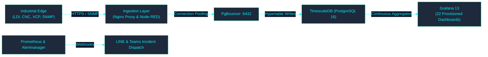

<!-- GLOBAL_NAV -->
<div align="right">
  <a href="../../README.md"> <b>Home</b></a> &nbsp;|&nbsp;
  <a href="../README.md"> <b>Docs Index</b></a>
</div>
<br/>

<div align="center">
  <h1>IMS Engineering Onboarding Guide</h1>
  <p><b>Comprehensive operational walkthrough, architecture orientation, and troubleshooting workflows for engineers</b></p>
  <p>
    <a href="ONBOARDING.md">English</a> |
    <a href="../../th/docs/product/ONBOARDING.md">ไทย</a> |
    <a href="../../zh-CN/docs/product/ONBOARDING.md">简体中文</a>
  </p>
</div>

---

## 1. Welcome & Orientation

Welcome to the **Industrial Monitoring System (IMS)** engineering team. IMS is a mission-critical telemetry platform designed for high-precision industrial PCB manufacturing lines (Laser Direct Imaging / LDI), CNC drilling machinery, and Vertical Continuous Plating (VCP) facilities.

### Architecture Overview



---

## 2. Day-1 Developer Setup

To get your local development environment operational in under 5 minutes:

### Prerequisites

- **Docker Desktop** / Docker Engine (Compose v2 supported)
- **Node.js** (v18 or v20 LTS)
- **Make** (or run equivalent scripts via PowerShell on Windows)

### First-Time Initialization

```bash
# 1. Clone repository
git clone https://github.com/PATTANAKORN025/IMS.git
cd IMS

# 2. Configure environment
cp .env.example .env
# Edit .env and replace default passwords with secure local values

# 3. Verify toolchain prerequisites
make doctor

# 4. Start all 16 containers with mock data
make up

# 5. Verify system health and container states
make verify
```

Once running, navigate to `http://localhost:3000` to access the Grafana portal.

---

## 3. Core Operational Workflows

### Incident Triage & Drill-Down

When a manufacturing excursion or infrastructure alert fires:

1. **NOC Overview (`/d/ims-noc-overview`)**:
   - Inspect the aggregate plant telemetry for thermal, scan speed, or registration outliers.
   - Click any highlighted metric to follow the Grafana Data Link directly to the equipment drill-down.
2. **LDI Command Center & SPC (`/d/ims-ldi-fleet-command-center`)**:
   - Filter by `$machine_id` (e.g., `LDI-01` through `LDI-10`).
   - Analyze process capability indices ($C_p, C_{pk}$) and rolling 3-sigma Z-scores calculated dynamically over TimescaleDB Continuous Aggregates.
3. **Alarm Console (`/d/ims-ldi-alarm-console`)**:
   - Review open alarms logged into `public.ldi_alarm_lifecycle`.
   - Operators acknowledge active alarms; engineers resolve alarms with mandatory root cause analysis notes via `ims-alarm-api`.

---

## 4. Engineering Standards & Guardrails

- **Zero-Risk Pipeline Rule**: Never modify `nodered_data/flows.json` directly. Source split flows reside in `nodered_data/flows/*.json`. Run `make deploy-flows` to concatenate and deploy.
- **Database Schema**: All application tables and hypertables reside strictly within the `public` schema.
- **Pre-Commit Gate**: Always run `make check` (or `node scripts/pre-commit.js`) prior to opening a PR. All unit tests, linters, and verification checks must pass cleanly.

For deeper technical deep-dives, consult the [Docs Index](../README.md).
