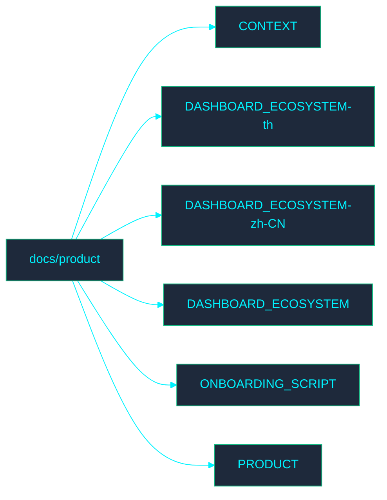

<!-- GLOBAL_NAV -->

  <a href="../../README.md"> <b>Home</b></a> &nbsp;|&nbsp;
  <a href="../README.md"> <b>Docs Index</b></a>

 

#  Product Documentation

Welcome to the **Product** directory. This section contains documentation related to IMS product processes.

## ️ Directory Map

##  File Index

- [CONTEXT.md](CONTEXT.md)
- [DASHBOARD_ECOSYSTEM-th.md](../../th/docs/product/DASHBOARD_ECOSYSTEM.md)
- [DASHBOARD_ECOSYSTEM-zh-CN.md](../../zh-CN/docs/product/DASHBOARD_ECOSYSTEM.md)
- [DASHBOARD_ECOSYSTEM.md](DASHBOARD_ECOSYSTEM.md)
- [ONBOARDING_SCRIPT.md](ONBOARDING_SCRIPT.md)
- [PRODUCT.md](PRODUCT.md)
