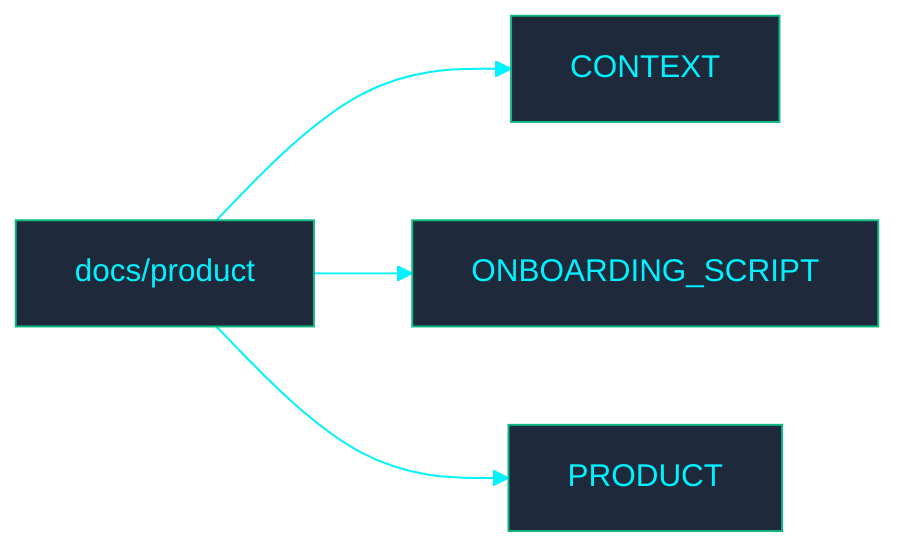

# 📁 Product Documentation

Welcome to the **Product** directory. This section contains documentation related to IMS product processes.

## 🗺️ Directory Map

## 📄 File Index

- [CONTEXT.md](CONTEXT.md)
- [ONBOARDING_SCRIPT.md](ONBOARDING_SCRIPT.md)
- [PRODUCT.md](PRODUCT.md)
