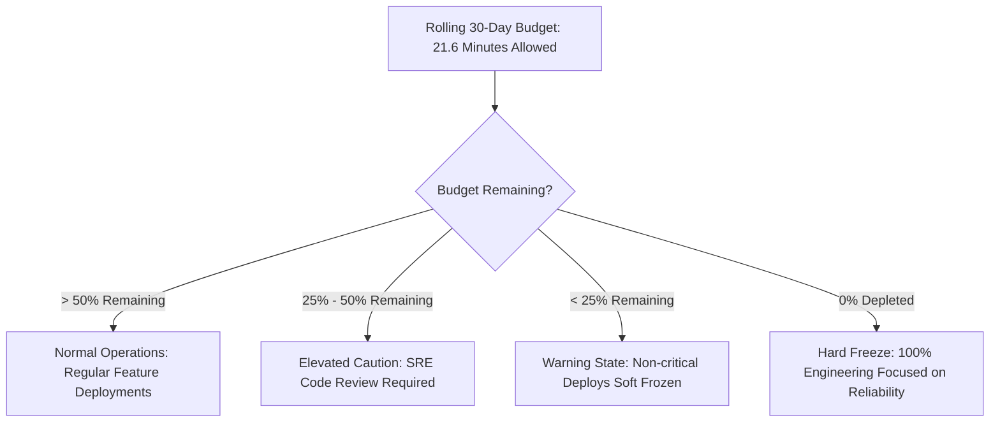

<!-- GLOBAL_NAV -->
<div align="right">
  <a href="../../README.md"> <b>Home</b></a> &nbsp;|&nbsp;
  <a href="../README.md"> <b>Docs Index</b></a>
</div>
<br/>

<div align="center">
  <h1>IMS Site Reliability Engineering (SRE): SLI & SLO Definitions</h1>
  <p><b>Service Level Indicators (SLIs), Service Level Objectives (SLOs), PromQL equations, multi-window burn-rate alerts, and Error Budget freeze policies</b></p>
  <p>
    <a href="SLO_DEFINITIONS.md">English</a> |
    <a href="../../th/docs/sre/SLO_DEFINITIONS.md">ไทย</a> |
    <a href="../../zh-CN/docs/sre/SLO_DEFINITIONS.md">简体中文</a>
  </p>
</div>

---

## 1. SRE Core Principles & The 4 Golden Signals

The Industrial Monitoring System (IMS) functions as the nerve center for PCB manufacturing telemetry and mission-critical network infrastructure. SRE targets follow Google SRE best practices, operationalized through the **Four Golden Signals**:

```
┌─────────────────┐   ┌─────────────────┐   ┌─────────────────┐   ┌─────────────────┐
│     Latency     │   │     Traffic     │   │     Errors      │   │   Saturation    │
│ Time to process │   │ Ingest requests │   │ Rate of failed  │   │ Connection pool │
│   telemetry     │   │   & SNMP polls  │   │ writes & alerts │   │ & CPU/RAM load  │
└─────────────────┘   └─────────────────┘   └─────────────────┘   └─────────────────┘
```

- **Latency**: The time taken to receive, transform, persist, and visualize industrial metrics.
- **Traffic**: Ingestion throughput measured in telemetry payloads per second and SNMP polled OIDs per cycle.
- **Errors**: Rate of rejected HTTP payloads (4xx/5xx), database insertion timeouts, and dropped SNMP packets.
- **Saturation**: Fraction of database connection pool (PgBouncer), memory consumption, and disk I/O utilized.

---

## 2. SLI and SLO Master Specification Matrix

All objectives are evaluated across a rolling 30-day compliance window ($43,200\text{ minutes}$):

| Service Domain | Metric / Indicator (SLI) | Target Objective (SLO) | 30-Day Error Budget | Measurement Method |
|:---------------|:-------------------------|:-----------------------|:--------------------|:-------------------|
| **Ingestion Availability** | Successful HTTP responses (`200 OK`) on `/ldi-telemetry` & `/api/v1/alarms` | **$\ge 99.95\%$** | $21.6\text{ minutes}$ downtime | Synthetic Blackbox Probes |
| **Pipeline Latency** | Time from payload receipt at Nginx to storage commit in TimescaleDB | **$P_{99} < 2.0\text{s}$** | $1\%$ outlier requests | Ingestion timestamp delta |
| **Dashboard Query UX** | Execution duration of Grafana queries against 15m & 1h Continuous Aggregates | **$P_{95} < 1.0\text{s}$<br/>$P_{99} < 3.0\text{s}$** | $5\%$ queries $> 1.0\text{s}$ | Grafana datasource metrics |
| **Critical Alarm Delivery** | Time from condition threshold breach to LINE / Teams webhook dispatch | **$P_{99.9} < 5.0\text{s}$** | $0.1\%$ delayed notifications | Alertmanager dispatch timer |
| **SNMP Polling Completeness**| Successful OID polls across Linux servers and Juniper switches | **$\ge 99.0\%$** | $1.0\%$ missing or timed out OIDs | Node-RED SNMP Walker stats |

---

## 3. Mathematical Equations & PromQL SLI Queries

### 1. Ingestion Endpoint Availability SLI

$$\text{SLI}_{\text{avail}} = \frac{\sum \text{HTTP Requests with Status } 2xx}{\sum \text{Total HTTP Ingestion Requests}} \times 100\%$$

```promql
# 30-day rolling availability percentage for LDI ingestion endpoint
(
  sum(increase(nginx_http_requests_total{status=~"2.."}[30d]))
  /
  sum(increase(nginx_http_requests_total[30d]))
) * 100
```

### 2. Ingestion Pipeline 99th Percentile Latency SLI

$$\text{SLI}_{\text{latency}} = \text{Quantile}_{0.99}\left(\text{Duration}_{\text{received}} \to \text{Duration}_{\text{persisted}}\right)$$

```promql
# 99th percentile ingestion latency over 5-minute rolling window
histogram_quantile(0.99,
  sum(rate(ims_pipeline_duration_seconds_bucket[5m])) by (le)
)
```

### 3. Grafana Dashboard Query 95th Percentile Latency SLI

```promql
# 95th percentile database query execution duration in seconds
histogram_quantile(0.95,
  sum(rate(grafana_datasource_request_duration_seconds_bucket{datasource="factory_telemetry"}[5m])) by (le)
)
```

### 4. SNMP Polling Completion Rate SLI

```promql
# Percentage of successful SNMP sweeps across 60-second cycles
(
  sum(rate(node_red_snmp_polls_success_total[5m]))
  /
  sum(rate(node_red_snmp_polls_attempted_total[5m]))
) * 100
```

---

## 4. Multi-Window Multi-Burn-Rate Alerting Architecture

To balance rapid alert response against alert fatigue, IMS implements Google SRE multi-window burn-rate alerts. The burn rate represents the rate at which the 30-day error budget is being consumed:

```
Burn Rate 1.0x  ───> Consumes 100% budget over exactly 30 days (No urgent action)
Burn Rate 6.0x  ───> Consumes 5% budget in 6 hours (Urgent: High Priority Ticket)
Burn Rate 14.4x ───> Consumes 2% budget in 1 hour (Critical: Immediate Pager / Callout)
```

### Alert Burn-Rate Matrix

| Alert Level | Burn Rate Factor | Budget Consumed | Long Window | Short Window | Action & Notification Channel |
|:------------|:-----------------|:----------------|:------------|:-------------|:------------------------------|
| **CRITICAL (Page)** | $14.4\times$ | $2.0\%$ | 1 Hour | 5 Minutes | LINE On-Call Pager + Sirens |
| **HIGH (Ticket)** | $6.0\times$ | $5.0\%$ | 6 Hours | 30 Minutes | MS Teams High-Priority Ticket |
| **MEDIUM (Backlog)**| $1.0\times$ | $10.0\%$ | 3 Days | 6 Hours | SRE Weekly Sprint Backlog |

### Prometheus Rule Definition (`prometheus/rules/slo_burn_rate.yml`)

```yaml
groups:
  - name: slo_ingestion_burn_rate
    rules:
      - alert: IngestionErrorBudgetBurningFast
        expr: |
          (
            sum(rate(nginx_http_requests_total{status=~"5.."}[1h]))
            /
            sum(rate(nginx_http_requests_total[1h]))
          ) > (1 - 0.9995) * 14.4
          and
          (
            sum(rate(nginx_http_requests_total{status=~"5.."}[5m]))
            /
            sum(rate(nginx_http_requests_total[5m]))
          ) > (1 - 0.9995) * 14.4
        for: 2m
        labels:
          severity: critical
          tier: tier1
        annotations:
          summary: "LDI Ingestion burning error budget at 14.4x rate (1h window)"
          description: "High error rate has consumed >2% of the monthly error budget in the last hour."
```

---

## 5. Error Budget Policy & Deployment Freeze Framework

The Error Budget is the shared agreement between engineering, SRE, and manufacturing plant operations. When budget is healthy, product teams innovate and deploy features quickly; when exhausted, reliability takes absolute priority.



### Escalation Tiers

1. **Green Status ($>50\%$ Budget Available)**: Standard CI/CD automated deployments permitted.
2. **Yellow Status ($25\% - 50\%$ Budget Available)**:
   - SRE Lead approval required on any Node-RED flow changes.
   - Non-critical database migrations delayed until next maintenance window.
3. **Orange Status ($<25\%$ Budget Available)**:
   - Feature deployments soft frozen; only bug fixes permitted.
   - Performance testing mandatory on staging before merge.
4. **Red Status (100% Budget Depleted / Overdrawn)**:
   - **Hard Deployment Freeze**: No feature PRs may be merged to `main`.
   - 100% engineering effort reassigned to resilience, query optimization, and hardware recovery.
   - Mandatory post-mortem (PMR) published within 48 hours.

---

## 6. Live SLI Inspection via CLI

Engineers can inspect current SLI health directly from Prometheus using cURL:

```bash
# Query current 1-hour error rate against ingestion endpoint
curl -s -G "http://localhost:9090/api/v1/query" \
  --data-urlencode 'query=(sum(rate(nginx_http_requests_total{status=~"5.."}[1h])) / sum(rate(nginx_http_requests_total[1h]))) * 100' \
  | jq '.data.result[] | {metric: .metric, current_error_rate_pct: .value[1]}'

# Query 99th percentile pipeline ingestion latency
curl -s -G "http://localhost:9090/api/v1/query" \
  --data-urlencode 'query=histogram_quantile(0.99, sum(rate(ims_pipeline_duration_seconds_bucket[5m])) by (le))' \
  | jq '.data.result[] | {p99_latency_seconds: .value[1]}'
```
