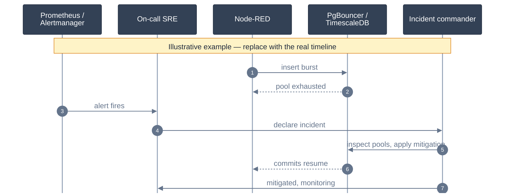
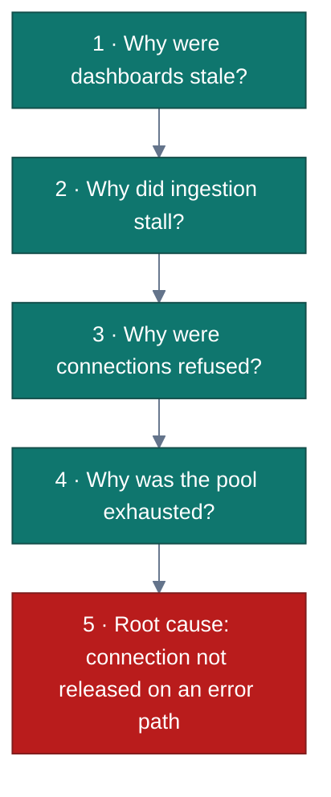

<!-- GLOBAL_NAV -->
<div align="right">
  <a href="../../../README.md"> <b>Home</b></a> &nbsp;|&nbsp;
  <a href="../../README.md"> <b>Docs Index</b></a>
</div>
<br/>

<div align="center">
  <h1>Enterprise Blameless Post-Mortem & Incident Review Template</h1>
  <p><b>Standardized root-cause analysis, timeline reconstruction, SLO error budget impact, and corrective action governance</b></p>
  <p>
    <a href="TEMPLATE.md">English</a> |
    <a href="../../../th/docs/sre/postmortems/TEMPLATE.md">ไทย</a> |
    <a href="../../../zh-CN/docs/sre/postmortems/TEMPLATE.md">简体中文</a>
  </p>
</div>

---

> **Post-Mortem Philosophy:**  
> We operate under a strict **Blameless Culture** (Google SRE / Etsy standard). We assume every engineer acted in good faith with the best information available at the time. Post-mortems investigate **systemic vulnerabilities, architectural boundaries, automation failures, and operational tooling**, never individual human error.

---

## 1. Incident Overview & Metadata

| Incident Attribute | Value |
|---|---|
| **Incident Title** | `[INC-YYYYMMDD-SEVX] Short Descriptive Incident Title` |
| **Severity Level** | **SEV-1** (Critical Outage) \| **SEV-2** (Major Degradation) \| **SEV-3** (Minor Incident) |
| **Incident Date** | `YYYY-MM-DD` |
| **Incident Commander** | `@incident-commander` |
| **Lead SRE / Investigator** | `@sre-lead` |
| **Communication Lead** | `@comms-lead` |
| **Impacted Services** | `ims-timescaledb`, `ims-node-red`, `ims-pgbouncer`, `ims-grafana` |
| **Current Status** | `[ Draft | Review In Progress | Approved & Action Items Active | Closed ]` |

---

## 2. Executive Summary & Impact Analysis

### Executive Summary
*(Provide a concise, 2-to-3 paragraph summary detailing what failed, the immediate trigger, the blast radius, and how recovery was achieved.)*

### Business & Operational Impact
* **Total Incident Duration:** `XX hours YY minutes`
* **Telemetry Downtime / Data Blackout:** `XX minutes`
* **Dropped / Unbuffered Ingestion Events:** `~X,XXX events`
* **Affected Equipment Lines:** `[e.g., LDI Photolithography Lines 1–4, CNC Drilling Spindles 01–12]`
* **SLO Error Budget Consumption:**
  - Ingestion Availability SLO (99.9% monthly): Consumed **XX.X%** of 30-day budget.
  - Query Latency SLO (P95 < 500ms): Consumed **YY.Y%** of budget.

$$\text{Error Budget Burn Rate} = \frac{\text{Observed Error Rate}}{\text{Allowed Error Rate}} = \frac{1 - \text{SLI}}{1 - \text{SLO}}$$

---

## 3. Incident Lifecycle Metrics

```text
Detection (TTD)      Acknowledgement (TTA)      Mitigation (TTM)      Full Resolution (TTR)
    [ 4 min ] ------------ [ 2 min ] ------------- [ 18 min ] ------------ [ 35 min ]
```

* **Time to Detect (TTD):** `4 minutes` (From fault onset to automated Alertmanager firing)
* **Time to Acknowledge (TTA):** `2 minutes` (From alert dispatch to on-call engineer triage)
* **Time to Mitigate (TTM):** `18 minutes` (From triage to system stabilization / traffic bypass)
* **Time to Resolve (TTR):** `35 minutes` (From triage to permanent fix deployment and queue flush)

---

## 4. Incident Timeline & Sequence Flow

All timestamps must be recorded in **UTC and Indochina Time (ICT / UTC+7)**.



### Detailed Event Log
* `14:02 ICT (07:02 UTC)` — Ingestion batch burst commences following machine network reconnect.
* `14:04 ICT (07:04 UTC)` — `ims-pgbouncer` client connections hit configured ceiling (`max_client_conn`).
* `14:06 ICT (07:06 UTC)` — Prometheus triggers `HighIngestionLatency` warning to Alertmanager.
* `14:08 ICT (07:08 UTC)` — On-call SRE acknowledges alert and opens incident command channel.
* `14:15 ICT (07:15 UTC)` — SRE discovers unindexed query causing slow transaction holding connection slots.
* `14:24 ICT (07:24 UTC)` — Emergency pool scaling applied via `docker exec ims-pgbouncer kill -HUP 1`.
* `14:39 ICT (07:39 UTC)` — Queue fully flushed; end-to-end ingestion latency stabilizes at 180ms.

---

## 5. Root Cause Analysis (5 Whys)



1. **Why did Grafana dashboards display stale telemetry?**  
   The real-time panels were not receiving new rows from `public.ldi_data`.
2. **Why was telemetry stalled in Node-RED?**  
   The Node-RED ingestion pipeline was backpressuring due to database insert timeouts.
3. **Why was PgBouncer rejecting database connections?**  
   The active client connection count hit the hard limit of `default_pool_size`.
4. **Why did the client connection pool exhaust?**  
   Connections were held open indefinitely during upstream network retries.
5. **Why were connections held open indefinitely (Root Cause)?**  
   An error-handling code path in the custom Node-RED database wrapper failed to call `client.release()` upon HTTP client socket abort.

---

## 6. Diagnostic Telemetry & PromQL Queries

The following queries were utilized during active triage to diagnose the failure:

```promql
# 1. Pipeline freshness: seconds since the last successful flush
time() - max(ims_pipeline_last_flush_timestamp_seconds)

# 2. Insert failure ratio (no PgBouncer exporter is deployed; use SHOW POOLS for pool state)
sum(rate(ims_pipeline_inserts_failed_total[5m])) / clamp_min(sum(rate(ims_pipeline_inserts_total[5m])), 1e-9)

# 3. Buffer overflows (records dropped before insert)
sum(rate(ims_pipeline_buffer_overflows_total[5m]))
```

```sql
-- Database Active Transaction Inspection
SELECT pid, now() - xact_start AS duration, query, state
FROM pg_stat_activity
WHERE state != 'idle' AND query NOT LIKE '%pg_stat_activity%'
ORDER BY duration DESC
LIMIT 10;
```

---

## 7. Lessons Learned & Retrospective

### What Went Well
* Automated Prometheus alerting fired within 4 minutes of threshold violation.
* Health check watchdogs prevented memory corruption in `ims-timescaledb`.
* Blameless coordination between OT plant engineering and IT/SRE teams.

### What Went Wrong
* Runbook lacked explicit command syntax for hot-reloading PgBouncer configuration without container restart.
* Node-RED connection pool error-handling branch lacked automated unit test coverage.

### Where We Got Lucky
* Incident occurred during scheduled shift changeover; zero finished PCB panels were discarded.
* Secondary network interface prevented complete gateway disconnection.

---

## 8. Preventative & Corrective Action Items

| Item ID | Category | Action Item Description | Priority | Owner | Target Date | Verification Ticket |
|---|---|---|---|---|---|---|
| **ACT-01** | **Prevent** | Fix connection release in Node-RED error handler and add regression unit test | `P0` | `@engineer-dev` | `YYYY-MM-DD` | `PR #XXX` |
| **ACT-02** | **Detect** | Add Prometheus alert rule for PgBouncer pool saturation (`waiting_clients > 10`) | `P1` | `@sre-lead` | `YYYY-MM-DD` | `ISSUE-YYY` |
| **ACT-03** | **Mitigate** | Document PgBouncer hot-reload procedure (`RELOAD` / `kill -HUP`) in Incident Playbook | `P1` | `@sre-lead` | `YYYY-MM-DD` | `DOCS-ZZZ` |
| **ACT-04** | **Process** | Conduct DR chaos drill simulating pool exhaustion across all 4 machine domains | `P2` | `@qa-team` | `YYYY-MM-DD` | `DR-TEST-AAA` |

---

[⬅️ Back to SRE Index](../SLO_DEFINITIONS.md) | [ Main Repository](../../../README.md)
