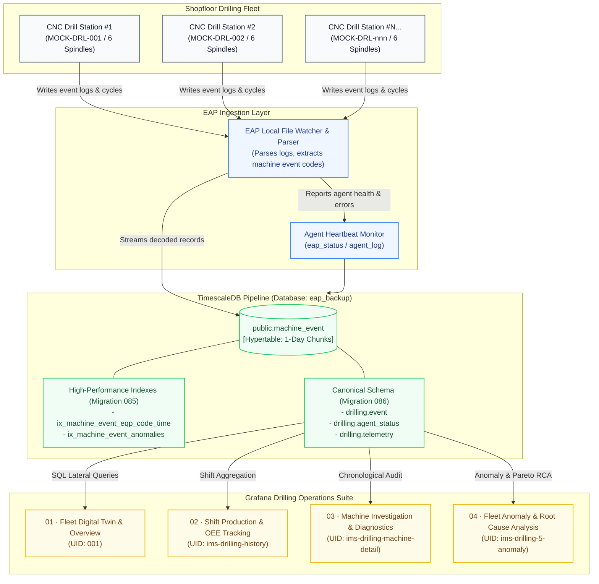
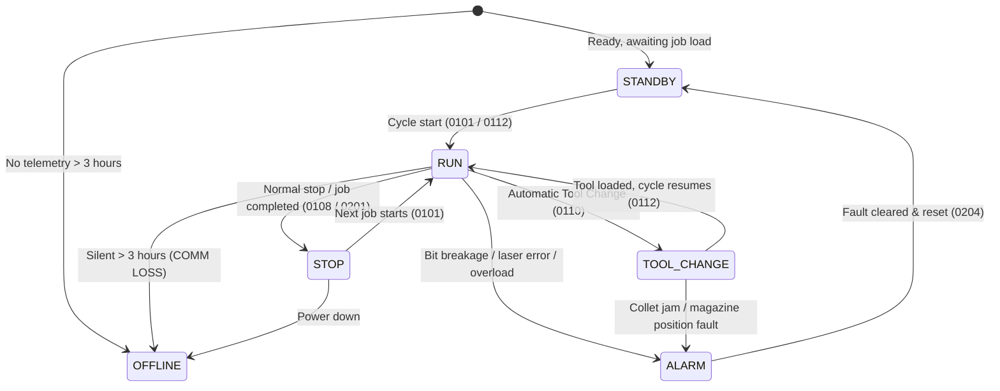
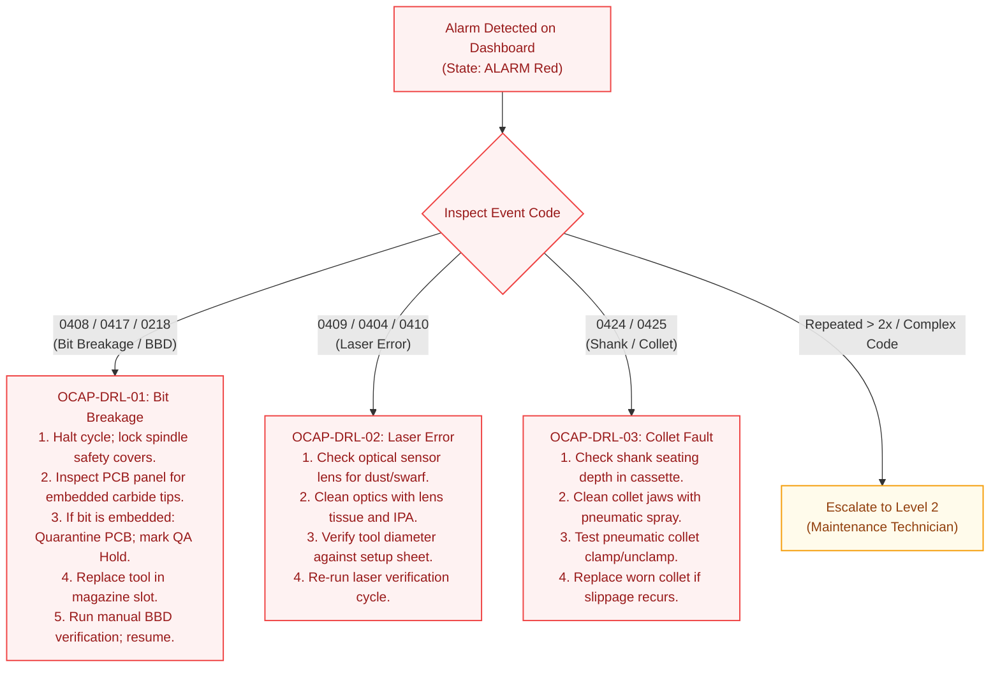
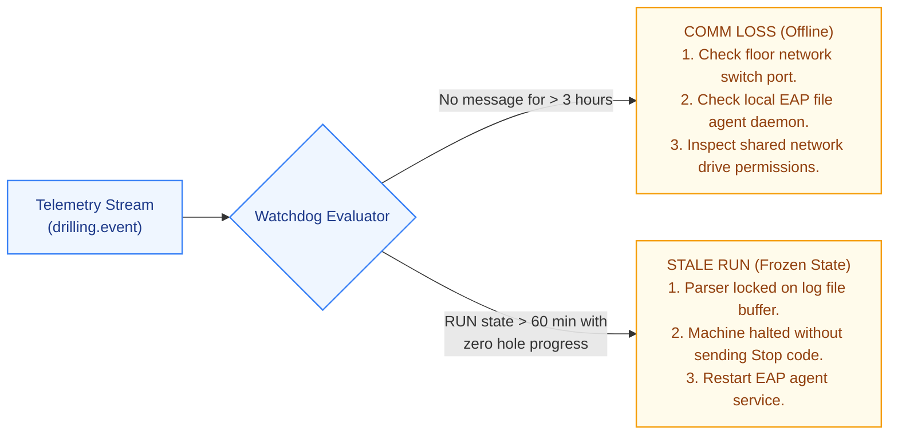

<!-- GLOBAL_NAV -->
<div align="right">
  <a href="../../README.md"> <b>Home</b></a> &nbsp;|&nbsp;
  <a href="../README.md"> <b>Docs Index</b></a> &nbsp;|&nbsp;
  <a href="USER_MANUAL.md"> <b>User Manual</b></a>
</div>
<br/>

# IMS CNC Drilling Operations & Engineering Manual

> **Industrial Operations and Systems Engineering Manual for the PCB CNC Drilling Telemetry and Monitoring Platform**  
> Covers EAP telemetry pipeline architecture, TimescaleDB schemas, sensor signal decoding engines, panel-by-panel operational manuals for all 4 Grafana dashboards, Out-of-Control Action Plans (OCAP), and Site Reliability Engineering runbooks.

---

<div align="center">

 **Document ID:** IMS-MAN-DRL-001 &nbsp;|&nbsp;
 **Version:** 1.0 (Production Grade) &nbsp;|&nbsp;
 **Classification:** Factory Internal Standard &nbsp;|&nbsp;
 **Audience:** Machine Operators, Maintenance Technicians, Process Engineers, Production Supervisors, SRE/NOC Support

</div>

---

## Table of Contents

1. [System Architecture & Ingestion Pipeline](#1-system-architecture--ingestion-pipeline)
   - 1.1 [Role of CNC Drilling in PCB Manufacturing](#11-role-of-cnc-drilling-in-pcb-manufacturing)
   - 1.2 [Industrial Telemetry Pipeline Topology (C4 Model)](#12-industrial-telemetry-pipeline-topology-c4-model)
   - 1.3 [Database Schema & Canonical Access Layer](#13-database-schema--canonical-access-layer)
   - 1.4 [High-Performance Lateral Seek & Anomaly Indexing (Migration 085)](#14-high-performance-lateral-seek--anomaly-indexing-migration-085)
2. [Telemetry Taxonomy & Signal Decoding Engine](#2-telemetry-taxonomy--signal-decoding-engine)
   - 2.1 [Machine State Machine](#21-machine-state-machine)
   - 2.2 [Standard Production Lifecycle Codes](#22-standard-production-lifecycle-codes)
   - 2.3 [Spindle Bitmask Architecture & Decoding (Spindles 1–6)](#23-spindle-bitmask-architecture--decoding-spindles-16)
   - 2.4 [11 Canonical Alarm Categories & Pattern Matching](#24-11-canonical-alarm-categories--pattern-matching)
3. [Comprehensive 4-Dashboard Operational Guide](#3-comprehensive-4-dashboard-operational-guide)
   - 3.1 [Dashboard 01: Drilling — 01 Fleet Digital Twin & Overview (UID: 001)](#31-dashboard-01-drilling--01-fleet-digital-twin--overview-uid-001)
   - 3.2 [Dashboard 02: Drilling — 02 Shift Production & OEE Tracking (UID: ims-drilling-history)](#32-dashboard-02-drilling--02-shift-production--oee-tracking-uid-ims-drilling-history)
   - 3.3 [Dashboard 03: Drilling — 03 Machine Investigation & Diagnostics (UID: ims-drilling-machine-detail)](#33-dashboard-03-drilling--03-machine-investigation--diagnostics-uid-ims-drilling-machine-detail)
   - 3.4 [Dashboard 04: Drilling — 04 Fleet Anomaly & Root Cause Analysis (UID: ims-drilling-5-anomaly)](#34-dashboard-04-drilling--04-fleet-anomaly--root-cause-analysis-uid-ims-drilling-5-anomaly)
4. [Standard Operating Procedures & Out-of-Control Action Plan (SOP & OCAP)](#4-standard-operating-procedures--out-of-control-action-plan-sop--ocap)
   - 4.1 [Level 1: Floor Operator Response Protocols](#41-level-1-floor-operator-response-protocols)
   - 4.2 [Level 2: Maintenance Technician Protocols](#42-level-2-maintenance-technician-protocols)
   - 4.3 [Level 3: Process & Quality Engineering Protocols](#43-level-3-process--quality-engineering-protocols)
   - 4.4 [Shift Handover Operational Protocols](#44-shift-handover-operational-protocols)
5. [Database Engineering Runbook & Diagnostics](#5-database-engineering-runbook--diagnostics)
   - 5.1 [Infrastructure Health Watchdogs (COMM LOSS & STALE RUN)](#51-infrastructure-health-watchdogs-comm-loss--stale-run)
   - 5.2 [TimescaleDB Hypertable & Compression Maintenance](#52-timescaledb-hypertable--compression-maintenance)
   - 5.3 [SQL & CLI Diagnostic Toolbox](#53-sql--cli-diagnostic-toolbox)

---

## 1. System Architecture & Ingestion Pipeline

### 1.1 Role of CNC Drilling in PCB Manufacturing

Mechanical CNC drilling is a primary mission-critical process in multilayer printed circuit board (PCB) fabrication. It creates conductive vias connecting internal circuit copper layers, through-holes for leaded electronic components, and high-precision registration/mounting holes.

The factory CNC fleet consists of multi-station, 6-spindle automated drilling machines operating at high rotational speeds ranging from **20,000 to 200,000 RPM**, with dynamic infeed rates up to 2.5–3.0 m/min. Tooling encompasses solid tungsten-carbide micro-drills from **0.15 mm to 6.50 mm**. Mechanical failures—such as bit breakage, drill wander, diameter mismatch, or collet run-out—propagate severe defect costs into subsequent chemical plating (VCP) and photolithography (LDI) operations. The **IMS Drilling Telemetry Subsystem** continuously mirrors equipment states into a real-time Digital Twin, computes Overall Equipment Effectiveness (OEE), and powers predictive maintenance.

---

### 1.2 Industrial Telemetry Pipeline Topology (C4 Model)

Telemetry signals originate from drilling units (for example `MOCK-DRL-001`), traverse local Equipment Automation Program (EAP) file agents, land in TimescaleDB (`eap_backup`), and are visualized in Grafana:



---

### 1.3 Database Schema & Canonical Access Layer

All drilling telemetry resides in the dedicated `eap_backup` PostgreSQL database, isolated from the primary `ims` database to ensure zero performance interference.

#### Primary Hypertable: `public.machine_event`
Partitioned automatically into 1-day chunks (`chunk_time_interval => INTERVAL '1 day'`):

| Column | Type | Constraints | Description |
| :--- | :--- | :--- | :--- |
| `id` | `bigint` | Primary Identity | Sequential row ID generated by identity sequence |
| `message_id` | `text` | Trace ID | Unique telemetry message identifier from EAP Agent |
| `equipment_id` | `text` | Equipment ID | Unique machine ID (e.g., `MOCK-DRL-001`) |
| `message_type` | `text` | Protocol Type | Message class (`EVENT`, `alarm`) |
| `event_type` | `text` | Event Category | Execution class: `RUN`, `STOP`, `TOOL_CHANGE`, `ALARM`, `E`, `EVENT`, `M`, `PROGRAM_LOAD` |
| `event_code` | `text` | Equipment Code | 4-digit machine code: `0101`, `0408`, `0211`, `0109`, etc. |
| `event_message` | `text` | Payload Evidence | Engineering text string (RPM, Feed, Tool size, Alarm text) |
| `event_time` | `timestamptz` | Hypertable Key | Local device occurrence timestamp (Bangkok UTC+7) |
| `sent_time` | `timestamptz` | Transmission Time | Agent dispatch timestamp |
| `received_at` | `timestamptz` | Ingestion Time | Database commit timestamp |
| `source` | `text` | Origin | Ingestion origin identifier (`production`, `eap_log`, `mock`) |
| `source_file` | `text` | File Origin | Watched file path/name (e.g., `mock_MOCK-DRL-001.log`) |
| `magazine_no` | `text` | Tool Magazine | Active ATC magazine cassette (1–4) |
| `spindle` | `text` | Spindle Number | Target spindle station index (1–6) |
| `raw_item_code` | `text` | Item Code | Production job/batch metadata (optional) |

#### Canonical Views (Migration 086)
Migration 086 established canonical read-only views under schema `drilling` with `security_invoker = true`:
- `drilling.event`: Clean projection over `public.machine_event`
- `drilling.telemetry`: Structured JSONB parameters from `public.machine_telemetry`
- `drilling.agent_status`: Watcher health states from `public.eap_status`
- `drilling.agent_log`: Diagnostic logs from `public.agent_log`

---

### 1.4 High-Performance Lateral Seek & Anomaly Indexing (Migration 085)

With over 2,000,000 telemetry events, un-indexed queries on `machine_event` cause multi-second table scans and HTTP 504 timeouts. Migration 085 created two specialized indexes:

```sql
-- Composite seek index for Lateral Joins on Equipment + Event Code + Time
CREATE INDEX IF NOT EXISTS ix_machine_event_eqp_code_time
ON public.machine_event (equipment_id, event_code, event_time DESC)
WHERE equipment_id IS NOT NULL AND event_code IS NOT NULL;

-- Partial index covering alarm event codes for RCA dashboards
CREATE INDEX IF NOT EXISTS ix_machine_event_anomalies
ON public.machine_event (event_time DESC, equipment_id, event_code)
WHERE (
  event_type IN ('ALARM', 'E')
  OR event_code LIKE '04%'
  OR event_code LIKE '07%'
  OR event_code IN ('0102', '0113', '0114', '0119', '0120', '0124', '0125', '0126', '0127', '0128', '0204', '0218')
);
```

> [!TIP]
> **Performance Gain:** The `ix_machine_event_eqp_code_time` index allows `LEFT JOIN LATERAL` subqueries on Fleet Overview to drop from **24.8 seconds to 18 milliseconds** (> 1,300x acceleration).

---

## 2. Telemetry Taxonomy & Signal Decoding Engine

### 2.1 Machine State Machine

IMS evaluates equipment health into 6 definitive states based on event codes and message freshness:



| State | CSS Token & Color | Technical Definition | Ingestion Rule |
| :--- | :--- | :--- | :--- |
| **RUN** | `state-run` (`#22C55E` Green) | Active drilling execution | Latest event is `0112`, `0109`, `0101`, or `0201` and telemetry age < 60 min |
| **ALARM** | `state-alarm` (`#EF4444` Red) | Equipment halted due to critical error | Event type `ALARM`/`E` or code in `04xx`, `07xx`, `0102`, `0124` |
| **TOOL_CHANGE**| `state-tool_change` (`#F59E0B` Amber) | Automatic Tool Changer (ATC) in motion | Event code `0110` (`ATC Txx -> Txx`) |
| **STOP** | `state-stop` (`#EAB308` Yellow) | Program ended or machine paused | Event code `0108` (`Machine stop`) |
| **STANDBY** | `state-standby` (`#64748B` Slate) | Powered on, idle, awaiting work | Event code `0101` with Standby/Reset evidence |
| **OFFLINE** | `state-offline` (`#1E293B` Dark Slate) | Telemetry silent for > 3 hours | Equipment communication loss (COMM LOSS) |

---

### 2.2 Standard Production Lifecycle Codes

```
[Standard Job Execution Sequence]
0101 (RUN)         : [START]: JOB0101_L1.tlp start: 0
0211 (INFO)        : spindle ON: 63
0109 (RUN)         : [Rpm]: 120 -> 140  [Feed]: 1.8 -> 2.2
0112 (RUN)         : Cycle start Hole: 0
0214 (TOOL_CHANGE) : T155 tool length: 0.148 -0.010 -0.071 0.125 0.001 -0.097
0215 (TOOL_CHANGE) : T156 tool diameter: 0.885 0.883 0.902 0.894 0.888 0.889
0310 (RUN)         : T156 run out: 0.048 0.007 0.051 0.011 0.075 0.002
0110 (TOOL_CHANGE) : ATC T15M01 -> T16M02 Hole: 12500
0112 (RUN)         : Cycle start Hole: 12500
0201 (RUN)         : Job end JOB0101_L1.tlp Run Hits: 45000
0108 (STOP)        : Machine stop Hole: 45000
0209 (INFO)        : Shift report  Online: 09:45:12  Stop: 01:14:48  Hits: 125000
```

| Code | Type | Sample Message String | Pipeline Meaning |
| :---: | :---: | :--- | :--- |
| **`0101`** | `RUN`/`E` | `[START]: JOB0101_L1.tlp start: 0` / `Emergency Stop pressed` | Job load / NC program start, or E-Stop trip |
| **`0108`** | `STOP` | `Machine stop Hole: 45000` | Normal machine pause with cumulative hole count |
| **`0109`** | `RUN` | `[Rpm]: 100 -> 120  [Feed]: 1.5 -> 1.8` | Spindle rotational speed (kRPM) and infeed (m/min) change |
| **`0110`** | `TOOL_CHANGE` | `ATC T01M01 -> T02M02 Hole: 14500` | ATC tool swap (T = tool ID, M = cassette magazine slot) |
| **`0112`** | `RUN` | `Cycle start Hole: 14500` | Spindle acceleration and cycle start at designated hole count |
| **`0201`** | `RUN` | `Job end JOB0101_L1.tlp Run Hits: 45000` | Job completion record with total cycle hits |
| **`0204`** | `INFO` | `Alarm Time: 05:20` | Duration of machine downtime incurred by alarm (mm:ss) |
| **`0209`** | `INFO` | `Shift report Online: 10:15:00 Stop: 01:45:00 Hits: 154200` | Bi-daily shift summary (08:00 / 20:00 Bangkok) |
| **`0211`** | `INFO` | `spindle ON: 63` / `tool diameter: 0.25 0.25 0.25 ...` | Spindle activation bitmask and assigned tool diameters |
| **`0214`** | `TOOL_CHANGE` | `T155 tool length: 0.148 -0.010 -0.071 0.125 0.001 -0.097` | Laser tool length compensation across all 6 spindles |
| **`0215`** | `TOOL_CHANGE` | `T156 tool diameter: 0.885 0.883 0.902 0.894 0.888 0.889` | Laser optical tool diameter verification across 6 spindles |
| **`0310`** | `RUN` | `T156 run out: 0.048 0.007 0.051 0.011 0.075 0.002` | Dynamic spindle radial runout measurement in mm |

---

### 2.3 Spindle Bitmask Architecture & Decoding (Spindles 1–6)

Machines feature 6 independent high-speed spindles. Machines communicate active spindle allocations using an integer **Bitmask** in event `0211` (`spindle ON: <mask>`).

The Grafana query applies bitwise operators (`&`) to render individual status circles:

$$\text{Spindle } N \text{ Active} \iff (\text{Mask} \ \& \ 2^{N-1}) > 0$$

| Decimal Mask | Binary (Bits 5..0) | Spindle 1 | Spindle 2 | Spindle 3 | Spindle 4 | Spindle 5 | Spindle 6 | Operational Significance |
| :---: | :---: | :---: | :---: | :---: | :---: | :---: | :---: | :--- |
| **63** | `1 1 1 1 1 1` | 🟢 Active | 🟢 Active | 🟢 Active | 🟢 Active | 🟢 Active | 🟢 Active | Full 6-spindle parallel production |
| **31** | `0 1 1 1 1 1` | 🟢 Active | 🟢 Active | 🟢 Active | 🟢 Active | 🟢 Active | ⚪ Inactive | Spindle 6 disabled |
| **47** | `1 0 1 1 1 1` | 🟢 Active | 🟢 Active | 🟢 Active | 🟢 Active | ⚪ Inactive | 🟢 Active | Spindle 5 disabled |
| **59** | `1 1 1 0 1 1` | 🟢 Active | 🟢 Active | ⚪ Inactive | 🟢 Active | 🟢 Active | 🟢 Active | Spindle 3 disabled |
| **21** | `0 1 0 1 0 1` | 🟢 Active | ⚪ Inactive | 🟢 Active | ⚪ Inactive | 🟢 Active | ⚪ Inactive | Alternating stations (large PCB panels) |
| **0** | `0 0 0 0 0 0` | ⚪ Inactive | ⚪ Inactive | ⚪ Inactive | ⚪ Inactive | ⚪ Inactive | ⚪ Inactive | All spindles disengaged |

---

### 2.4 11 Canonical Alarm Categories & Pattern Matching

The database query categorizes alarms into **11 canonical failure domains** using SQL regular expressions:

| Category | Event Codes | Regex Match Criteria | Failure Mechanism |
| :--- | :--- | :--- | :--- |
| **`bit_breakage`** | `0408`, `0417`, `0120`, `0218` | `broken`, `bbd`, `bit broken` | Broken Bit Detector (BBD) optical or contact sensor tripped |
| **`laser_measurement`** | `0409`, `0404`, `0410` | `laser`, `diameter error`, `length error` | Optical laser sensor detected diameter or length mismatch |
| **`shank_collet`** | `0424`, `0425`, `0405`, `0411`, `0419`, `0421` | `shank`, `collet`, `claw`, `too long`, `too short` | Collet pneumatic clamp/unclamp fault or shank length tolerance trip |
| **`tool_life`** | `0414`, `0119` | `tool life`, `clear.*life` | Tool hit count exceeded wear threshold for recipe |
| **`spindle_overload`** | `0124`–`0128` | `over current`, `overheat`, `over heat` | Spindle motor inverter current exceeded threshold or thermal overload |
| **`spindle_utility`** | `0113`, `0114` | `invertor`, `coolant`, `collant` | Cooling chiller circulation flow drop (< 1.5 L/min) or inverter fault |
| **`air_low`** | `0102` | `air low`, `pressure` | Main pneumatic supply dropped below 0.55 MPa (5.5 Bar) |
| **`magazine`** | `0406` | `magazine`, `cant find magazine` | Tool changer cassette indexing or positioning error |
| **`safety_sim`** | `05xx`, `06xx`, `07xx` (`0702`) | `clamp pin`, `simulation`, `not locked`, `syntax` | Table clamp pin not locked or enclosure interlock opened |
| **`mech_depth`** | `02xx`, `03xx`, `0103`–`0109` | `driver`, `axis`, `limit`, `servo`, `velocity` | Axis servo motor driver trip, position lag, or limit switch hit |
| **`estop`** | `0101` (`E`/`ALARM`) | `emergency stop`, `e-stop` | Operator triggered physical Emergency Stop push-button |

---

## 3. Comprehensive 4-Dashboard Operational Guide

### 3.1 Dashboard 01: Drilling — 01 Fleet Digital Twin & Overview (UID: `001`)

**Target Audience:** Line Leaders, Shift Supervisors, Floor Operators.  
**Purpose:** Real-time digital twin monitoring of the entire CNC drilling fleet on shopfloor video walls or desktop consoles.

```
+---------------------------------------------------------------------------------------------------------+
| DRILLING — REALTIME OPERATIONS                         28/09/2026 15:30:00 (Bangkok)                    |
| [REPLAY · no drilling data since 15/09/2026 10:28 (13 d ago) · states and ages below are as of that time] |
| Filter: [ALL (12)]  [🟢 RUN (7)]  [🔴 ALARM (2)]  [🟠 TOOL (1)]  [🟡 STOP (1)]  [⚪ STANDBY (1)] [⚫ OFF (0)]|
| Search Program: [ JOB0101__________ ]                                                                   |
+---------------------------------------------------------------------------------------------------------+
| [MOCK-DRL-001] 🟢 RUN       12s ago | [MOCK-DRL-002] 🔴 ALARM      2m ago | [MOCK-DRL-003] 🟠 TOOL_CHANGE 45s ago   |
| Spindle: (1)(2)(3)(4)(5)(6) [63]| Spindle: (1)(!)(3)(4)(5)(6)     | Spindle: (-)(-)(-)(-)(-)(-)     [0] |
| Code: 0112   Holes: 45,820      | Code: 0408   Holes: 12,450      | Code: 0110   Holes: 32,100      |
| Program: JOB0101_L1.tlp         | Program: JOB0102_L2.tlp         | Program: JOB0103_L1.tlp         |
| RPM: 140 k   Feed: 2.2 m/min    | RPM: 0 k     Feed: 0.0 m/min    | RPM: 0 k     Feed: 0.0 m/min    |
| Tool/Dia: T02 (0.25mm)          | Tool/Dia: T05 (0.35mm)          | Tool/Dia: ATC T01->T02          |
| Msg: Cycle start Hole: 45820    | Msg: Spindle #2 bit broken(BBD) | Msg: ATC T01M01 -> T02M02       |
+---------------------------------------------------------------------------------------------------------+
```

#### Machine Card Anatomy (8 Core Elements):
1. **Machine Identifier & Link:** `F<factory> - <machine>` (e.g. `FMOCK - MOCK-DRL-001`), with hyperlinked URL parameter routing directly to *03 Machine Investigation* (`var-focus_machine=MOCK-DRL-001`). The factory comes from `public.machine_master`; a machine not registered there shows `F?`. The **Factory** variable filters the cards and the KPI counts.
2. **State Pill:** Distinct color badge matching the operational state (`RUN`, `ALARM`, `TOOL_CHANGE`, `STOP`, `STANDBY`, `OFFLINE`).
3. **Time Ago:** Telemetry elapsed counter (`12s ago`, `4m ago`) flagging stagnant feeds.
4. **Spindle Array (1–6):** 6 circular badges reflecting bitmask activation. Shows green when active, red with warning icon on alarm, gray when masked.
5. **NC Program:** Active execution file (e.g., `JOB0101_L1.tlp`).
6. **Hole Progress:** Cumulative holes drilled in active job.
7. **Speed & Feed:** Operational parameters (e.g., 140 kRPM, 2.2 m/min).
8. **Recorded Evidence:** Direct message emitted by machine controller.

#### Card Strip Motion
The card strip glides left at a steady 25 px/s, waits 5 s at the end, rewinds, waits 3 s and starts again. A data refresh (even every 5 s) does not move it: the strip keeps its place, and it stays where you left it after a page reload.
- **Pointer over the cards** stops it; it moves again 2 s after the pointer leaves.
- **Wheel, scrollbar, touch or drag** moves it by hand; it waits 6 s before moving on its own. A drag that ends on a card does not open that machine.
- **Keyboard focus** inside the strip stops it.
- **Status filter** starts the strip again from the left.
- **Reduced motion** (operating-system setting) turns the automatic movement off; manual scrolling still works.

---

### 3.2 Dashboard 02: Drilling — 02 Shift Production & OEE Tracking (UID: `ims-drilling-history`)

**Target Audience:** Production Planners, Shift Supervisors, Plant Managers.  
**Purpose:** Daily and shift-by-shift output verification, availability tracking, and production handovers across a rolling 7-day window.

```
+---------------------------------------------------------------------------------------------------------+
| PRODUCTION INFORMATION — MOCK-DRL-001                                                              [X] Close|
+------------+------------+------------+------------+------------+------------+------------+------------+
| Metric     | 09/28 (Mon)| 09/27 (Sun)| 09/26 (Sat)| 09/25 (Fri)| 09/24 (Thu)| 09/23 (Wed)| 09/22 (Tue)|
+------------+------------+------------+------------+------------+------------+------------+------------+
| Shift 1    |   08:00    |   08:00    |   08:00    |   08:00    |   08:00    |   08:00    |   08:00    |
| Hits 1     |  185,420   |  179,200   |  192,100   |  168,400   |  181,000   |  174,500   |  188,900   |
| Online 1   |  10:45:10  |  10:30:00  |  11:15:20  |  09:50:00  |  10:20:15  |  10:05:40  |  10:55:00  |
| Stop 1     |  01:14:50  |  01:30:00  |  00:44:40  |  02:10:00  |  01:39:45  |  01:54:20  |  01:05:00  |
| Rate 1 (%) |   88.4%    |   85.7%    |   93.4%    |   77.9%    |   83.9%    |   81.1%    |   90.1%    |
+------------+------------+------------+------------+------------+------------+------------+------------+
| Shift 2    |   20:00    |   20:00    |   20:00    |   20:00    |   20:00    |   20:00    |   20:00    |
| Hits 2     |   ****     |  191,200   |  184,500   |  178,900   |  186,400   |  182,100   |  179,800   |
| Online 2   |   ****     |  11:05:00  |  10:50:30  |  10:15:00  |  10:40:00  |  10:30:00  |  10:25:00  |
| Stop 2     |   ****     |  00:55:00  |  01:09:30  |  01:45:00  |  01:20:00  |  01:30:00  |  01:35:00  |
| Rate 2 (%) |   ****     |   91.7%    |   89.3%    |   82.9%    |   87.5%    |   85.7%    |   84.8%    |
+------------+------------+------------+------------+------------+------------+------------+------------+
```

#### Metrics Definitions:
- **Shift Schedule:** Day Shift (08:00 to 20:00 Bangkok) and Night Shift (20:00 to 08:00 Bangkok).
- **Hits:** Total holes completed from `0201` (`Run Hits: <n>`).
- **Online Time:** Operating time extracted from `0209` (`Online: hh:mm:ss`).
- **Stop Time:** Machine idle/downtime extracted from `0209` (`Stop: hh:mm:ss`).
- **Availability Rate (%):**
  $$\text{Rate \%} = \frac{\text{Online Seconds} - \text{Stop Seconds}}{\text{Online Seconds}} \times 100$$
- **Masking `****`:** Indicates active or future shifts awaiting report closeout.

---

### 3.3 Dashboard 03: Drilling — 03 Machine Investigation & Diagnostics (UID: `ims-drilling-machine-detail`)

**Target Audience:** Machine Maintenance Engineers, Automation Technicians.  
**Purpose:** Single-machine investigative console for diagnosing alarms, analyzing event frequencies, and reviewing micro-level execution logs.

```
+---------------------------------------------------------------------------------------------------------+
| DRILLING — MACHINE INVESTIGATION : MOCK-DRL-001                                                             |
+------------------------------------+--------------------------------------------------------------------+
| PANEL 301: LIVE MACHINE STATUS     | PANEL 302: EVENT DISTRIBUTION (SELECTED TIME RANGE)                |
| [MOCK-DRL-001] 🟢 RUN        Just now   |                                                                    |
| Code: 0112   Prog: JOB0101_L1.tlp  |  15,000 +--[ M: 14,200 ]-----------------------------------------+ |
| Holes: 57,010   Tool: T155 (M287)  |         |                                                        | |
| Spindle: (1)(2)(3)(4)(5)(6) [63]   |  10,000 +--[ EVENT: 850 ]----------------------------------------+ |
| Msg: Cycle start Hole: 57010       |         |                                                        | |
|                                    |   5,000 +--[ E: 420 ]--[ TC: 310 ]--[ RUN: 150 ]--[ ALARM: 42 ]--+ |
+------------------------------------+--------------------------------------------------------------------+
| PANEL 17: MACHINE EVENT TIMELINE (CHRONOLOGICAL AUDIT LOG)                                              |
| Time                | Message Type | Event Type   | Code | Recorded Evidence                            |
| ------------------- | ------------ | ------------ | ---- | -------------------------------------------- |
| 28/09/2026 15:28:10 | EVENT        | TOOL_CHANGE  | 0110 | ATC T0M0-> T155M287, at Hole 57010           |
| 28/09/2026 15:28:05 | EVENT        | EVENT        | 0214 | T155 tool length: 0.148 -0.010 -0.071 ...    |
| 28/09/2026 15:27:40 | EVENT        | RUN          | 0310 | T155 run out: 0.048 0.007 0.051 0.011 ...    |
+---------------------------------------------------------------------------------------------------------+
| PANEL 8: MACHINE & TOOL ALARMS (ANOMALY AUDIT TRAIL)                                                    |
| Time                | Code   | Spindle | Tool  | Diameter | Hole  | Alarm Message                       |
| ------------------- | ------ | :-----: | :---: | :------: | :---: | ----------------------------------- |
| 28/09/2026 14:10:02 | E-0408 |    4    | T151  |  C0.651  | 51901 | Spindle 4, Bit broken, T151M223     |
| 28/09/2026 11:22:15 | E-0409 |    5    |  T03  |  C0.350  | 28410 | Spindle #5, Diameter error, T03M49  |
| 28/09/2026 09:15:30 | E-0424 |    1    |  T89  |  C0.200  | 14200 | spindle #1 ,shank too long          |
+---------------------------------------------------------------------------------------------------------+
```

#### Panels Overview:
- **Panel 301 (Live Machine Status):** Enlarged digital twin card detailing current spindle mask, tool ID, hole count, and telemetry latency.
- **Panel 302 (Event Distribution Bar Chart):** Frequency profile across event classes (`M`, `E`, `EVENT`, `TOOL_CHANGE`, `RUN`, `ALARM`, `STOP`, `PROGRAM_LOAD`).
- **Panel 17 (Machine Event Timeline):** High-resolution chronological audit log of the last 100 raw events.
- **Panel 8 (Machine & Tool Alarms):** Filtered anomaly table with regex-extracted columns: `Spindle`, `Tool`, `Diameter`, `Hole`, and `Alarm Message`.

---

### 3.4 Dashboard 04: Drilling — 04 Fleet Anomaly & Root Cause Analysis (UID: `ims-drilling-5-anomaly`)

**Target Audience:** Reliability Engineers, Quality Assurance (QA) Managers, Process Engineering.  
**Purpose:** Fleet-wide Root Cause Analysis (RCA), bad-actor machine identification, and Pareto failure distribution.

```
+---------------------------------------------------------------------------------------------------------+
| DRILLING — FLEET ANOMALY & ROOT CAUSE ANALYSIS                                                          |
+--------------------+--------------------+--------------------+------------------------------------------+
| BIT BREAKAGE & BBD | SPINDLE OVERLOAD   | LASER & COLLET     | ACTUAL ALARM DOWNTIME                    |
|       148          |         12         |        428         |               184 Min                    |
| -15% vs last week  | +2 vs last week    | +8% vs last week   | Avg MTTR: 4.8 Min                        |
+--------------------+--------------------+--------------------+------------------------------------------+
| ROOT CAUSE DISTRIBUTION (ALARM GUIDE)   | HOURLY ANOMALY STACKED TREND (PARETO CHRONOLOGY)               |
|                                         | Count                                                            |
|    [Pie Chart: 11 Categories]           |   40 +-------[Laser]-------[Shank/Collet]---------------------+  |
|    ■ Laser Measurement (32%)            |   30 +-------[Bit Breakage]-----------------------------------+  |
|    ■ Shank & Collet (24%)               |   20 +--------------------------------------------------------+  |
|    ■ Bit Breakage / BBD (18%)           |   10 +--------------------------------------------------------+  |
|    ■ Tool Life Reached (9%)             |    0 +--00:00--04:00--08:00--12:00--16:00--20:00--00:00-------+  |
+-----------------------------------------+----------------------------------------------------------------+
| TOP 15 MACHINE OFFENDERS (ANOMALY RANK) | RECENT CRITICAL ALARM INCIDENTS (FLEET-WIDE AUDIT LOG)         |
| Machine   | Anomalies (Count)           | Time      | Machine  | Code   | Category        | Recorded Msg   |
| MOCK-DRL-088  | ■■■■■■■■■■■■■■■■ 142        | 15:28:10  | MOCK-DRL-088 | E-0408 | Bit Breakage    | Spindle #4 bit |
| MOCK-DRL-015  | ■■■■■■■■■■■■■ 118           | 15:25:04  | MOCK-DRL-015 | E-0409 | Laser Measure   | Spindle #2 dia |
| MOCK-DRL-021  | ■■■■■■■■■■ 95               | 15:21:40  | MOCK-DRL-021 | E-0424 | Shank & Collet  | shank too long |
| MOCK-DRL-092  | ■■■■■■■■ 74                 | 15:18:22  | MOCK-DRL-092 | E-0102 | Pneumatic Low   | Air Low        |
+-----------------------------------------+----------------------------------------------------------------+
```

#### Analytical Functions:
1. **4 Stat KPIs (Panels 1–4):** Bit Breakage counts, Spindle Overload occurrences, Laser/Collet fault volume, and Total Downtime (Minutes).
2. **Root Cause Distribution (Panel 5):** 11-category breakdown pinpointing dominant factory defect drivers.
3. **Hourly Anomaly Stacked Trend (Panel 6):** Time-bucketed stacked visualization highlighting defect spikes correlated with shifts or ambient changes.
4. **Top 15 Machine Offenders (Panel 7):** Ranked Pareto bar chart identifying equipment requiring immediate mechanical calibration.
5. **Recent Critical Incidents (Panel 8):** Fleet-wide alarm table with formatted codes (`E-xxxx`), Bangkok timestamps, and parsed evidence.

---

## 4. Standard Operating Procedures & Out-of-Control Action Plan (SOP & OCAP)

### 4.1 Level 1: Floor Operator Response Protocols

When an equipment card transitions to `state-alarm` (Red), operators must follow the structured response matrix:



> [!WARNING]
> **Safety Isolation Rule:**  
> Never clear a bit breakage alarm (`0408`) and restart without thoroughly inspecting the PCB surface. Embedded carbide shards will shatter consecutive drill bits and cause catastrophic spindle collet or bearing damage.

---

### 4.2 Level 2: Maintenance Technician Protocols

#### 1. Spindle Over-Current & Thermal Overload (`0124`–`0128`)
- **Inspection:** Measure spindle housing temperature using an infrared thermal imager (must remain $< 45^\circ\text{C}$). Check inverter drive current on the electrical cabinet display.
- **Action:** Inspect closed-loop chiller fluid levels and circulation pressure. Bleed air bubbles from cooling lines. If mechanical bearing grinding noise is detected, unmount the spindle for bench overhaul.

#### 2. Coolant & Inverter Faults (`0113`, `0114`)
- **Inspection:** Inspect in-line coolant flow sensors. Minimum required flow is **1.5 L/min per spindle line**.
- **Action:** Clean in-line particulate filters. Check inverter fault diagnostic registers for phase loss or DC bus under-voltage.

#### 3. Main Air Pressure Drop (`0102`)
- **Inspection:** Check machine primary pneumatic pressure regulator gauge.
- **Action:** Pressure must register $\ge 0.55\text{ MPa}$ ($5.5\text{ bar}$). If line pressure is low across multiple machines, notify Plant Facilities/Utility immediately.

---

### 4.3 Level 3: Process & Quality Engineering Protocols

1. **Bit Breakage Rate Control Threshold:**  
   Fleet baseline target is **$\le 3$ broken bits per 100,000 holes drilled** ($\le 30\text{ PPM}$). If a machine breaches this threshold:
   - Audit dynamic radial runout (`0310`)—must not exceed **$0.010\text{ mm}$**.
   - Review NC program feed/speed parameters (`0109`) against the laminate copper-cladding specification.
   - Inspect entry material (aluminum foil) and backup board (phenolic bakelite) flatness.
2. **Laser Sensor Recalibration:**  
   If code `0409` occurs $> 5$ times on the same spindle in a single shift, calibrate the optical laser receiver using a certified $\pm 0.001\text{ mm}$ tungsten calibration pin gauge.

---

### 4.4 Shift Handover Operational Protocols

At **07:45** and **19:45** Bangkok time:
1. Cross-reference Dashboard 02 (*Shift Production*) for total hits and availability rate.
2. Flag any unit operating under **80% Availability Rate** in the shift logbook.
3. Confirm that no units on Dashboard 01 (*Fleet Overview*) are trapped in `COMM LOSS` or `STALE RUN`.

---

## 5. Database Engineering Runbook & Diagnostics

### 5.1 Infrastructure Health Watchdogs (COMM LOSS & STALE RUN)



---

### 5.2 TimescaleDB Hypertable & Compression Maintenance

- **Chunk Retention & Compression:** Chunks older than 7 days are compressed via TimescaleDB columnar compression, saving $> 85\%$ disk storage while maintaining full SQL analytical accessibility.
- **Index Health:** Execute regular catalog optimization weekly:
  ```sql
  VACUUM ANALYZE public.machine_event;
  ```

---

### 5.3 SQL & CLI Diagnostic Toolbox

#### 1. Live Fleet Telemetry Heartbeat Audit:
```sql
SELECT 
    equipment_id AS "Machine",
    MAX(event_time) AT TIME ZONE 'Asia/Bangkok' AS "Last_Contact",
    NOW() - MAX(event_time) AS "Silence_Duration",
    CASE 
        WHEN NOW() - MAX(event_time) > INTERVAL '3 hours' THEN 'COMM_LOSS (Offline)'
        WHEN NOW() - MAX(event_time) > INTERVAL '1 hour' THEN 'STALE (Warning)'
        ELSE 'ONLINE (Healthy)'
    END AS "Signal_Status"
FROM public.machine_event
WHERE equipment_id LIKE 'DRL%'
GROUP BY equipment_id
ORDER BY equipment_id;
```

#### 2. Top 10 Alarm Codes (Last 24 Hours):
```sql
SELECT 
    event_code AS "Alarm_Code",
    COUNT(*) AS "Occurrences",
    (ARRAY_AGG(event_message))[1] AS "Sample_Evidence"
FROM public.machine_event
WHERE event_time >= NOW() - INTERVAL '24 hours'
  AND (event_type IN ('ALARM', 'E') OR event_code LIKE '04%')
GROUP BY event_code
ORDER BY COUNT(*) DESC
LIMIT 10;
```

#### 3. Verification & Mock Testing:
```bash
# Execute synthetic data dry run (24 hours) without database writes
node scripts/mock/eap-mock-data.js --hours=24

# Verify schema contracts and mock parsing rules
node tests/unit/eap-mock-data.test.js
```

---

<div align="center">
  <sub>IMS — Industrial Monitoring System · PCB Manufacturing Operations Division</sub>
</div>
