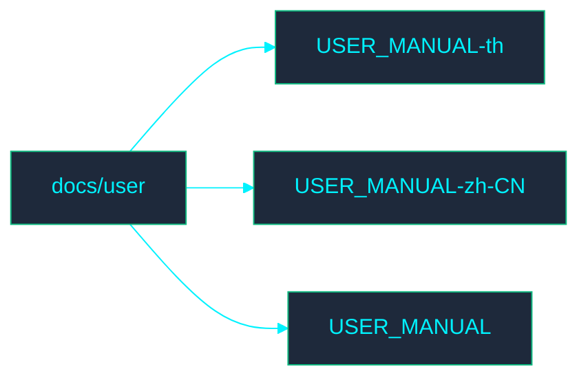

<!-- GLOBAL_NAV -->

  <a href="../../README.md"> <b>Home</b></a> &nbsp;|&nbsp;
  <a href="../../docs/README.md"> <b>Docs Index</b></a>

 

#  เอกสารสำหรับผู้ใช้

ยินดีต้อนรับสู่ไดเรกทอรี **User** (ผู้ใช้) ส่วนนี้ประกอบด้วยเอกสารที่เกี่ยวข้องกับกระบวนการผู้ใช้ของ IMS

## ️ แผนผังไดเรกทอรี

##  ดัชนีไฟล์

- [USER_MANUAL-th.md](USER_MANUAL-th.md)
- [USER_MANUAL-zh-CN.md](USER_MANUAL-zh-CN.md)
- [USER_MANUAL.md](USER_MANUAL.md)
