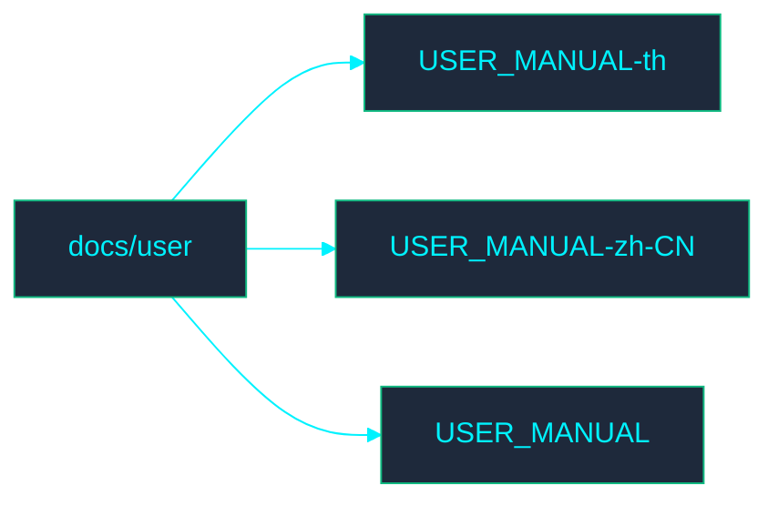

# 📁 User Documentation

Welcome to the **User** directory. This section contains documentation related to IMS user processes.

## 🗺️ Directory Map

## 📄 File Index

- [USER_MANUAL-th.md](USER_MANUAL-th.md)
- [USER_MANUAL-zh-CN.md](USER_MANUAL-zh-CN.md)
- [USER_MANUAL.md](USER_MANUAL.md)
