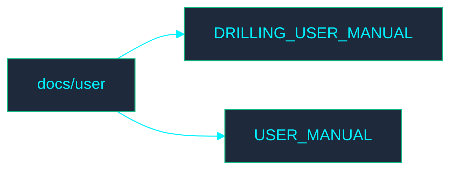

<!-- GLOBAL_NAV -->

  <a href="../../README.md"> <b>Home</b></a> &nbsp;|&nbsp;
  <a href="../README.md"> <b>Docs Index</b></a>

 

#  User Documentation

Welcome to the **User** directory. This section contains documentation related to IMS user processes.

##  Directory Map

```mermaid
%%{init: {'theme': 'base', 'themeVariables': { 'primaryColor': '#1e293b', 'primaryTextColor': '#00F2FE', 'primaryBorderColor': '#10B981', 'lineColor': '#00F2FE', 'secondaryColor': '#0f172a', 'tertiaryColor': '#0f172a', 'clusterBkg': '#030407', 'clusterBorder': '#00F2FE'}}}%%
flowchart LR
  ROOT["docs/user"]
  ROOT --> F0["DRILLING_USER_MANUAL"]
  ROOT --> F1["USER_MANUAL"]
```

##  File Index

- [DRILLING_USER_MANUAL.md](DRILLING_USER_MANUAL.md)
- [USER_MANUAL.md](USER_MANUAL.md)
