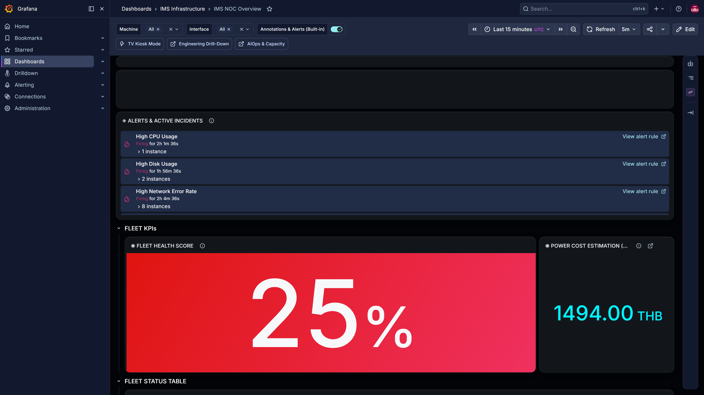
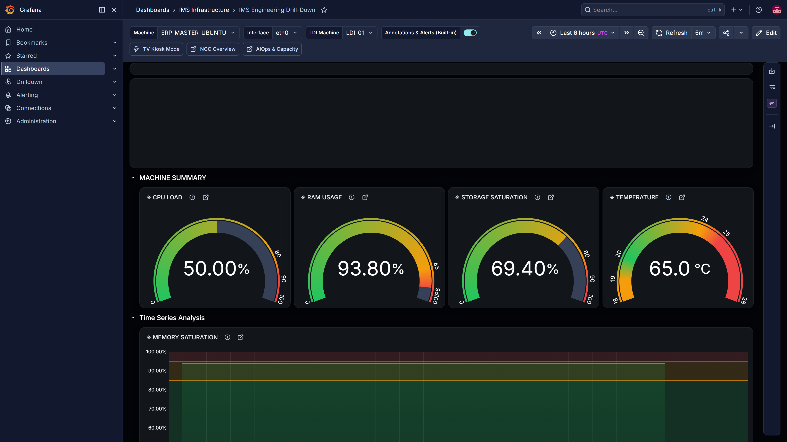

<!-- GLOBAL_NAV -->
<div align="right">
  <a href="../../README.md"> <b>Home</b></a> &nbsp;|&nbsp;
  <a href="../README.md"> <b>Docs Index</b></a>
</div>
<br/>

# IMS — User Manual

> **User Guide for IT Support and NOC Team**
> Details procedures for interpreting dashboards, analyzing metrics, and executing alert responses.

---

<div align="center">

 **Manual:** User Guide
 **Version:** 1.2
 **Audience:** IT Support

</div>

---

## Table of Contents

1. [Getting Started](#getting-started)
2. [Grafana Dashboard Guide](#grafana-dashboard-guide)
3. [Reading Metrics](#reading-metrics)
4. [Alert Response Procedures](#alert-response-procedures)
5. [Common Operations](#common-operations)
6. [Troubleshooting](#troubleshooting)
7. [Quick Reference](#quick-reference)

---

## Getting Started

### Accessing the System

Users reach everything through the nginx front door on port 3000 of the IMS host. The other ports below are bound to `127.0.0.1` and are for administrators working on the host itself.

| Service | URL | Sign-in |
| --- | --- | --- |
| **Grafana dashboards** | `http://<ims-host>:3000/` | Your Grafana account (ask the administrator). Sign-up and anonymous access are disabled. |
| **Factory Twin 3D** | `http://<ims-host>:3000/factory-twin-3d/` | Same Grafana session |
| **Node-RED editor** | `http://127.0.0.1:1880` (on the host only) | Node-RED admin account |
| **Prometheus** | `http://127.0.0.1:9090` (on the host only) | — |
| **Alertmanager** | `http://127.0.0.1:9093` (on the host only) | — |

### Dashboard Overview

Grafana provisions 22 dashboards in four folders:

```text
 IMS Dashboards
├── 01 · Drilling Operations (CNC drilling fleet)
│ ├── Fleet Digital Twin & Overview — Live state of every drilling machine: run, stop, tool change, alarm, offline
│ ├── Shift Production & OEE — Day and night shift hits, online and stop time per machine, 7 days
│ ├── Machine Investigation — One machine's live status, event mix, event timeline and tool alarms
│ └── Fleet Anomaly & Root Cause — Alarm categories, top offenders, bit breakage and spindle overload trends
├── 02 · Lithography Operations — LDI (PCB laser direct imaging fleet)
│ ├── Easy Overview        — Zero-config whole-fleet glance, no filters to set
│ ├── LDI Manufacturing    — Command Center: executive KPIs + machine telemetry + alarm stream
│ ├── LDI Operator Andon   — Factory-floor kiosk, read-only, zero-scroll at 1920×1080 and above
│ ├── LDI Alarm Console    — Interactive Acknowledge/Resolve workflow, companion to the read-only Andon board
│ ├── LDI Alarm Response   — MTTA/MTTR from the real alarm lifecycle
│ ├── LDI Alarm Dictionary — Reference lookup: vendor alarm definitions + recent occurrences
│ ├── LDI Engineering Analytics — Cpk/SPC ranking, RCA Truth Test, PE/JE distributions
│ ├── LDI Machine Snapshot — Click any alarm/log to inspect the exact millisecond
│ ├── LDI Factory Digital Twin — Canvas floor view of the reporting LDI machines by zone
│ └── LDI Data Readiness   — Self-auditing data-quality dashboard (coverage %, gaps)
├── 03 · Platform Infrastructure & NOC (servers/network)
│ ├── NOC Overview        — Fleet envelope for servers (infrastructure only; LDI lives below)
│ ├── Engineering Drill-Down — Per-server deep dive: CPU/RAM/disk/temperature/network, plus LDI quality scatter
│ ├── AIOps & Capacity    — Days-until-full forecasts and Z-Score anomaly detection
│ ├── Meta-Monitoring     — The pipeline's own health (rows/sec, batch success, retry queue, circuit breakers)
│ └── Ingestion Latency   — Real source-to-database latency, read-only
└── 04 · Plating Operations (VCP plating lines)
 ├── Fleet Overview & Process Analytics — State hours, bath and current deviation, recipe compliance per lot
 ├── Operations Console — Live line status, current and voltage per station, bath temperatures, alarm log
 └── Real-Time Wall — Full-screen live status of every line for the plating floor
```

The drilling and VCP dashboards read the `eap_backup` database. Without plant data they are empty; see [Synthetic Drilling and VCP Data](../data/MOCK_DATA.md).

The complete, generated list with panel counts is the [Dashboard Inventory](../architecture/DASHBOARD_INVENTORY.md).

---

## Grafana Dashboard Guide

### 1. NOC Overview Dashboard

**Purpose**: High-level overview intended for executives and the NOC team.



### 2. Server Health Metrics (NOC Overview / Engineering Drill-Down)

**Purpose**: Health overview of all servers. These panels are spread across the **NOC Overview** (fleet envelope) and **Engineering Drill-Down** (per-server) dashboards; they are not a standalone dashboard.

| Panel | Metric | Colour bands on the panel |
| --- | --- | --- |
| **CPU Load** | `cpu_load_percent` | green < 80 %, amber 80–90 %, red ≥ 90 % |
| **RAM Usage / Saturation** | `ram_used_mb / ram_total_mb` | green < 85 %, amber 85–95 %, red ≥ 95 % |
| **Storage Saturation** | `disk_used_gb / disk_total_gb` | green < 80 %, amber 80–90 %, red ≥ 90 % |
| **Network Bandwidth** | `rx_mbps`, `tx_mbps` per interface | trend lines, no bands |
| **Temperature** | `temp_c` | green 20–24 °C, amber within 1 °C outside that range, red below 19 °C or from 25 °C |

### 3. Engineering Drill-Down Dashboard

**Purpose**: Detailed analytical deep dive per individual server for engineers.



**LDI Quality Scatter — tolerance zone:**

The scatter plots PE against JE per minute (µm), with a ±10 µm tolerance band:

| Zone | Colour | Meaning |
| --- | --- | --- |
| Inside ±10 µm | green band | Normal — the laser head is within tolerance |
| Outside ±10 µm | outside the band | Quality risk — inspect the laser head |

**Instructions:**

- Points inside the green band mean PCB quality is within the accepted tolerance.
- Points outside the band call for an inspection of the laser head.
- Cross-check with the **LDI Throughput & Process Efficiency** panel to see whether production rate is also affected.

### 4. AIOps & Capacity Dashboard

**Purpose**: Resource capacity forecasting to support infrastructure planning.

| Panel | What it shows | Use case |
| --- | --- | --- |
| **Days Until Full (Resource Battery)** | Remaining days for disk, RAM and CPU at the current trend | Prioritise upgrades |
| **Disk Usage Trend + Linear Regression Forecast** | Predicted disk-full date | Plan storage expansion |
| **CPU / RAM Load Trend (30-day average)** | Long-term consumption trend | Plan server and RAM upgrades |
| **CPU / Temperature Z-Score Anomaly (3σ)** | Deviations beyond three standard deviations | Spot unusual behaviour early |

### 5. Easy Overview Dashboard

**Purpose**: Rapid overview of the entire LDI fleet requiring zero configuration — no template variables, no filters; everything is visible on load.

Every metric on this dashboard comes from the same shared views and functions the other dashboards use (`v_ldi_machine_latest_full`, `v_ldi_alarm_context`, `f_ldi_yield_pct`, `v_machine_spc_fleet`), so its numbers match the rest of the system — there are no isolated one-off queries.

### 6. LDI Manufacturing Command Center

**Purpose**: Primary operational dashboard for the LDI line, organised as a 4-layer RCA view.

| Layer | Content |
| --- | --- |
| **Executive HUD** | Yield %, Running machines, Fleet Status, Avg Cpk, Fleet Availability, Critical Alarms |
| **Machine Telemetry** | Temperature/Humidity compliance, Scan Speed/Air Vacuum, Thickness/Resist Dosage, Scale X/Y |
| **Production Context** | Live production table (Machine/Job/Part/Layer/Progress), Board Traceability, Calculated Time per Board |
| **Alarm Stream** | Recent Alarm Events (last 50), Top Correlated Alarms (24h, RCA) |

Deep-dive rows (Production & Compliance, Process Metrics, Analytics & SPC, System Alarms, RCA Fleet Summary, Cycle Time & Traceability) are collapsed by default — click a row header to expand. The first glance is the executive KPI strip only.

### 7. LDI Operator Andon Board

**Purpose**: Factory-floor kiosk display — ISA-101 style, touch-free and read-only. Supported display resolutions are **1920×1080 and above**, where the board fits without scrolling; 1280×720 is not supported (the layout overflows).

Shows Fleet Availability, Active Critical/Major Alarms, Environmental Compliance, Machines Running, per-machine status tiles, a pipeline heartbeat, Temperature (22 ± 2 °C) and Humidity (55 ± 5 %) compliance timelines, and the **Action Queue** of Critical/Major alarms from the last 5 minutes. Acknowledge and Resolve happen on the **LDI Alarm Console**, not on the Andon board.

### 8. LDI Engineering Analytics & SPC

**Purpose**: In-depth analysis for engineers — Cpk/SPC ranking, RCA Truth Test, and PE/JE distributions.

| Section | Content |
| --- | --- |
| **Environmental** | Temperature vs Humidity, synchronised across all machines |
| **SPC Control Charts** | Thickness control chart (mean ± 3σ), Scale X/Y control chart |
| **Variation Analysis** | PE/JE standard deviation by machine, PE/JE error distribution (box plot) |
| **RCA / Alarm Correlation** | RCA Truth Test — Lift/Confidence by alarm category (Thermal/Humidity/Vacuum/etc.) |

### 9. LDI Machine Snapshot

**Purpose**: Millisecond-level machine state, opened by clicking through from the Process Timeline or from alarm and log tables on other dashboards.

Shows job context, physical variables, PE alignment, Cpk, and alarms close in time to the selected event — built for pinpoint incident investigation rather than overviews.

### 10. LDI Data Readiness

**Purpose**: Self-auditing data-quality dashboard that reads only real PostgreSQL rows, with no simulated input.

Use it to detect board-key duplication, check coverage %, and confirm the match rate against the alarm master before trusting the numbers on the primary dashboards.

### 11. Alarm Console, Alarm Response and Alarm Dictionary

- **Alarm Console** — the only interactive dashboard: Acknowledge and Resolve write real state to `public.ldi_alarm_lifecycle` through `alarm-api`.
- **Alarm Response (MTTA/MTTR)** — how quickly alarms are acknowledged and resolved, computed from that lifecycle table.
- **Alarm Dictionary** — the vendor definition of any alarm code plus its recent occurrences; opened from the Alarm Code links on other dashboards.

---

## Reading Metrics

### CPU Metrics

| Metric | Unit | Panel colour | Alert rule |
| --- | --- | --- | --- |
| `cpu_load_percent` | % | green < 80, amber 80–90, red ≥ 90 | **High CPU Usage** — 5-minute average > 85 % for 5 min (warning) |
| `cpu_cores` | count | — | — |

**Instructions:**

- **Average CPU** — mean across all cores for the selected time range.
- **Peak CPU** — the maximum recorded value (may be a transient spike).
- **CPU per core** — shows which core carries the load.

**Example:**

```text
Machine: server-01
CPU Load: 86% (amber band, High CPU Usage alert pending)
├── Core 1: 95%
├── Core 2: 70%
├── Core 3: 88%
└── Core 4: 91%
→ Cores 1, 3 and 4 are under heavy load; investigate running processes.
```

### Memory Metrics

| Metric | Unit | Panel colour | Alert rule |
| --- | --- | --- | --- |
| `ram_used_mb` | MB | — | — |
| `ram_total_mb` | MB | — | — |
| **Usage %** | % | green < 85, amber 85–95, red ≥ 95 | **High RAM Usage** — > 90 % for 5 min (warning) |

**Instructions:**

- **Usage %** = `(ram_used_mb / ram_total_mb) × 100`
- **Available** = `ram_total_mb - ram_used_mb`
- High memory usage is not a problem in itself — Linux uses free memory for caching.

### Network Metrics

| Metric | Unit | Description |
| --- | --- | --- |
| `rx_mbps` | Mbps | Incoming traffic |
| `tx_mbps` | Mbps | Outgoing traffic |
| `net_rx_errors` | count | Receive errors (hardware/driver issue) |
| `net_rx_drops` | count | Dropped packets (buffer overflow) |
| `net_if_status` | 1/2 | 1 = UP, 2 = DOWN |

**Instructions:**

- **Bandwidth utilisation** = `(rx_mbps / link_speed) × 100`
- **Error rate** = `net_rx_errors / total_packets × 100`
- **Interface DOWN** = a disconnected cable or a disabled switch port. Related alert rules: **Interface Down** (critical), **High Network Error Rate** (warning), **Network Packet Drops** (critical), **Bandwidth Saturation Forecast** (warning).

**Example:**

**Machine:** `server-01`

| Interface | RX Mbps | TX Mbps | Errors | Drops | Status |
| --- | --- | --- | --- | --- | --- |
| eth0 | 1200 | 850 | 0 | 0 | UP |
| wlan0 | 320 | 180 | 0 | 12 | UP |

→ *wlan0 shows 12 dropped packets — check the wireless signal.*

### Disk Metrics

| Metric | Unit | Panel colour | Alert rule |
| --- | --- | --- | --- |
| `disk_used_gb` | GB | — | — |
| `disk_total_gb` | GB | — | — |
| **Usage %** | % | green < 80, amber 80–90, red ≥ 90 | **High Disk Usage** — > 90 % for 10 min (critical) |

**Instructions:**

- **Usage %** = `(disk_used_gb / disk_total_gb) × 100`
- **Free space** = `disk_total_gb - disk_used_gb`

### Temperature Metrics

| Metric | Unit | Panel colour | Alert rule |
| --- | --- | --- | --- |
| `temp_c` | °C | green 20–24, amber within 1 °C outside, red < 19 or ≥ 25 | **High Temperature** — maximum > 80 °C for 5 min (critical) |

**Instructions:**

- **Average temperature** — mean reading.
- **Maximum temperature** — the peak recorded.
- **Z-Score anomaly** — the AIOps rows flag readings more than 3σ from the recent baseline (**Temperature Z-Score Anomaly**, warning).

---

## Alert Response Procedures

### Alert Severity Levels

Alert rules live in two places: Grafana-managed rules for machine and LDI conditions (`monitoring/grafana/provisioning/alerting/`) and Prometheus rules for the platform itself (`monitoring/prometheus/rules/ims-alerts.yml`).

| Level | Colour | Target response time | Examples |
| --- | --- | --- | --- |
| **Critical** | Red | Immediate (< 15 minutes) | Interface Down, High Disk Usage, High Temperature, LDI Machine Offline (Stale), `ServiceDown`, `PipelineDataStalled` |
| **Warning** | Amber | Prompt (< 1 hour) | High CPU Usage, High RAM Usage, Z-Score anomalies, `PipelineHighErrorRate`, `CircuitBreakerOpen` |

### Incident Response Playbook

#### Scenario 1: Interface Down (Critical)

```text
Symptoms:
- Alert: Interface Down on server-01
- Network panels show "No Data"
- Other machines still reporting

Investigation Steps:
1. SSH to server-01 → check network cable
2. Check switch port status
3. Run: ip link show eth0
4. Check if interface is UP

Resolution:
- Reseat network cable
- Check switch configuration
- Restart network service: systemctl restart networking
- Verify: ping gateway

Escalation:
- If physical cable is fine → contact network team
- If switch port is down → contact data center team
```

#### Scenario 2: High CPU Usage (Warning)

```text
Symptoms:
- Alert: High CPU Usage on server-01
- CPU panels showing > 85%
- System may be slow

Investigation Steps:
1. SSH to server-01
2. Run: top -bn1 | head -20
3. Identify top CPU-consuming processes
4. Check if scheduled job is running

Resolution:
- If legitimate workload → monitor, no action needed
- If rogue process → kill or renice
- If OOM → add swap or increase RAM

Escalation:
- If persistent > 1 hour → check with application team
- If affecting other services → consider scaling
```

#### Scenario 3: High Disk Usage (Critical)

```text
Symptoms:
- Alert: High Disk Usage on server-01
- Disk panels showing > 90%

Investigation Steps:
1. SSH to server-01
2. Run: df -h
3. Run: du -sh /* | sort -rh | head -10
4. Identify large files/directories

Resolution:
- Clean logs: journalctl --vacuum-size=500M
- Remove old backups: find /backup -mtime +30 -delete
- Compress large files: gzip largefile.log
- Archive to cold storage

Escalation:
- If disk usage continues → plan storage expansion
- If critical (> 95%) → immediate cleanup required
```

#### Scenario 4: ServiceDown (Critical)

```text
Symptoms:
- Alert: ServiceDown on server-01
- Blackbox probe failing
- Application may be unreachable

Investigation Steps:
1. Check service status: systemctl status <service>
2. Check service logs: journalctl -u <service> -n 50
3. Check port binding: ss -tlnp | grep <port>
4. Check firewall: iptables -L -n

Resolution:
- Restart service: systemctl restart <service>
- Check configuration: <service> -t (test config)
- Verify firewall rules
- Check dependent services

Escalation:
- If service won't start → check application logs
- If port conflict → identify conflicting process
- If system-level issue → contact system admin
```

#### Scenario 5: PipelineDataStalled (Critical)

```text
Symptoms:
- Alert: PipelineDataStalled (named TelemetryGap in older documents)
- No successful database inserts for 3+ minutes
- Dashboards stop updating for every machine

Investigation Steps:
1. Check Node-RED logs: docker compose logs --tail=50 node-red
2. Check PgBouncer and TimescaleDB: docker compose ps pgbouncer timescaledb
3. Check the SNMP simulator (demo stacks): docker compose ps snmpsim
4. Check that the device is registered in public.devices

Resolution:
- If snmpsim down → docker compose restart snmpsim
- If Node-RED error → check flow JSON syntax
- If machine not in registry → add it to public.devices

Escalation:
- If persistent → check SNMP community string
- If new machine → verify MIB compatibility
```

---

## Common Operations

### Check System Status

```bash
# View all containers
docker compose ps

# Check Node-RED logs
docker compose logs --tail=20 node-red

# Check Prometheus targets
docker compose exec prometheus wget -qO- "http://localhost:9090/api/v1/targets"

# Check active alerts
docker compose exec prometheus wget -qO- "http://localhost:9090/api/v1/alerts"
```

### Query Database Directly

```bash
# Recent telemetry (last 5 minutes)
docker compose exec timescaledb psql -U ims_admin -d ims -c \
 "SELECT device_id, time, cpu_load_percent, temp_c
 FROM public.sys_metrics
 WHERE time > NOW() - INTERVAL '5 minutes'
 ORDER BY time DESC LIMIT 10;"

# Check interface metrics
docker compose exec timescaledb psql -U ims_admin -d ims -c \
 "SELECT device_id, iface_name, rx_mbps, tx_mbps
 FROM public.net_metrics
 ORDER BY time DESC LIMIT 1;"
```

### Restart Services

```bash
# Restart Node-RED (after flow changes)
docker compose restart node-red

# Reload Prometheus rules without a restart (see the Admin Manual first)
curl -X POST http://localhost:9090/-/reload

# Restart the core services (no data loss)
make restart
```

---

## Troubleshooting

### Common Issues

| Symptom | Possible cause | Solution |
| --- | --- | --- |
| **"No Data" on all panels** | Node-RED or PgBouncer not running | `docker compose restart node-red pgbouncer` |
| **"No Data" on one machine** | Machine not in the registry | Add it to `public.devices` (see the Admin Manual) |
| **Alertmanager restarting** | Config YAML syntax error | Check `docker compose logs alertmanager` |
| **All blackbox targets DOWN** | Wrong service name in config | Use `blackbox-exporter:9115` |
| **Grafana shows stale data** | Dashboard not refreshed | Hard refresh: Ctrl+Shift+R |
| **High memory usage** | Memory growth in Node-RED | Check `docker stats ims-node-red` |
| **Database connection refused** | PgBouncer down | `docker compose restart pgbouncer` |

### Log Locations

| Service | Command | What to look for |
| --- | --- | --- |
| **Node-RED** | `docker compose logs node-red` | `Started flows`, `TypeError`, `ETIMEOUT` |
| **TimescaleDB** | `docker compose logs timescaledb` | `connection refused`, `authentication failed` |
| **Prometheus** | `docker compose logs prometheus` | `failed to check config`, `target down` |
| **Alertmanager** | `docker compose logs alertmanager` | `Loading configuration file failed` |
| **Grafana** | `docker compose logs grafana` | `Failed to look up user`, `dashboard not found` |
| **nginx front door** | `docker compose logs proxy` | `502`, `upstream`, `auth_request` |

### Quick Diagnostics Script

```bash
# Run all health checks at once
echo "=== Containers ==="
docker compose ps --format "table {{.Name}}\t{{.Status}}"

echo "=== Data Flow ==="
docker compose exec timescaledb psql -U ims_admin -d ims -c \
 "SELECT device_id, COUNT(*) as rows, MAX(time) as latest
 FROM public.sys_metrics
 WHERE time > NOW() - INTERVAL '5 minutes'
 GROUP BY device_id;"

echo "=== Alerts ==="
docker compose exec prometheus wget -qO- "http://localhost:9090/api/v1/alerts" 2>&1 | \
 python -c "import sys,json; d=json.load(sys.stdin); print(f'{len(d[\"data\"][\"alerts\"])} active alerts')"
```

---

## Quick Reference

### Keyboard Shortcuts (Grafana)

Press `?` in Grafana to see the full list for your version.

| Shortcut | Action |
| --- | --- |
| `?` | Show all keyboard shortcuts |
| `Ctrl+K` / `Cmd+K` | Search and command palette |
| `Ctrl+S` | Save dashboard (editors only) |
| `d r` | Refresh all panels |
| `d k` | Toggle kiosk mode |
| `t z` | Zoom out the time range |
| `Esc` | Exit panel view or close a drawer |

### Colour Coding Reference

| State | Colour | Token |
| --- | --- | --- |
| Healthy | Green | `#22C55E` |
| Warning | Amber | `#F59E0B` |
| Critical | Red | `#EF4444` |

Panels show the numeric value alongside the colour, so a state can be read without relying on colour alone.

### Alert Channels

| Audience | Channel | Delivery |
| --- | --- | --- |
| **NOC team** | LINE group | LINE Messaging API (needs `LINE_CHANNEL_ACCESS_TOKEN` and `LINE_USER_ID`) |
| **System administrators** | Microsoft Teams | Incoming webhook (needs `TEAMS_WEBHOOK_URL`) |
| **Management** | E-mail | Not configured |

---

<div align="center">

**IMS User Manual — Version 1.2 (verified against `main`, 2026-09-26)**

_For IT Support & NOC Team_

</div>
