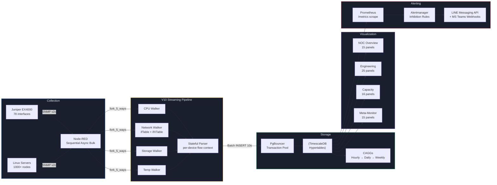

<!-- GLOBAL_NAV -->
<div align="right">
  <a href="README.md"> <b>หน้าหลัก</b></a> &nbsp;|&nbsp;
  <a href="docs/README.md"> <b>ดัชนีเอกสาร</b></a>
</div>
<br/>

<div align="center">
  <br/>
  <a href="https://github.com/PATTANAKORN025/IMS">
    
  </a>
  <br/><br/>
   &nbsp;&nbsp;&nbsp;&nbsp;
   &nbsp;&nbsp;&nbsp;&nbsp;
   &nbsp;&nbsp;&nbsp;&nbsp;
   &nbsp;&nbsp;&nbsp;&nbsp;
   &nbsp;&nbsp;&nbsp;&nbsp;
   &nbsp;&nbsp;&nbsp;&nbsp;
  
  <br/>
  <br/>
</div>

<h1 align="center">Industrial Monitoring System (IMS)</h1>

<div align="center">
 <strong>การวัดและส่งข้อมูลทางไกล (Telemetry) ในการผลิตที่แม่นยำสูง และการควบคุมกระบวนการทางสถิติ</strong>
</div>

<br/>

> **กลุ่มเป้าหมาย:** ชุมชนโอเพนซอร์ส, ผู้ประเมินระบบ, วิศวกรติดตั้งระบบ
> **วัตถุประสงค์:** จุดเริ่มต้นหลักในการทำความเข้าใจโค้ดเบสของ IMS, อธิบายขีดความสามารถ, สถาปัตยกรรม และขั้นตอนการติดตั้ง
> **ที่มา:** สถาปัตยกรรมและขีดความสามารถได้รับการปรับปรุงและตรวจสอบเทียบกับระบบจริง ณ วันที่ 2026-08-10

<div align="center">
  
  <br/>
  <br/>
  <a href="https://git.io/typing-svg"></a>
</div>

<div align="center">
  <a href="#quick-start"></a>
  <a href="../LICENSE"></a>
  <a href="https://www.docker.com/"></a>
  <a href="https://grafana.com/"></a>
  <a href="https://nodered.org/"></a>
  <a href="https://www.timescale.com/"></a>
  <br>
  <a href="#quick-start"></a>
  <a href="#quick-start"></a>
  <a href="../data-generators"></a>
</div>

## ⚡ เริ่มต้นด่วน (Quick Start ใน 3 นาที)

```bash
# 1. โคลน Repository
git clone https://github.com/PATTANAKORN025/IMS.git
cd IMS

# 2. เปิดระบบจำลองสัญญาณและการทำงานทั้งหมด
make up

# 3. ตรวจสอบสถานะและเข้าสู่แดชบอร์ด
make verify
# Grafana: http://localhost:3000 (admin / change-me-please)
```

*สำหรับการนำไปใช้จริงบน Production ดูเพิ่มเติมที่ [Deployment Readiness](../docs/operations/DEPLOYMENT_READINESS.md)*

<br/>

<div align="center" justify-content="space-between">
  <a href="docs/architecture/IMS_PLATFORM_BOOK.md"></a>
  <a href="docs/architecture/ARCHITECTURE.md"></a>
</div>

<br/>

## ภาพรวมระบบ

**IMS (Industrial Monitoring System)** เชื่อมช่องว่างระหว่างการผลิตที่มีความแม่นยำสูงและระบบไอทีขององค์กร เป็นแพลตฟอร์มตรวจสอบข้อมูลทางไกล (telemetry) ที่สร้างขึ้นบน Node-RED, TimescaleDB, และ Grafana ซึ่งผสานตัวชี้วัดโครงสร้างพื้นฐานด้าน IT เข้ากับข้อมูล OT (Operational Technology) ลงในที่จัดเก็บที่ใช้ PostgreSQL เป็นฐานข้อมูลแบบรวมศูนย์

**ความเป็นจริงในโรงงาน (OT):** ในการผลิต PCB ขั้นสูง เครื่อง Laser Direct Imaging (LDI) ต้องการการตัดสินใจโดยไม่มีความหน่วง (zero-latency) การเปลี่ยนแปลงอุณหภูมิเลเซอร์หรือความดันสุญญากาศอาจทำให้เกิดข้อผิดพลาดในการลงทะเบียนได้ทันที สร้างเศษซากที่มีราคาแพง ผู้ปฏิบัติงานต้องการบอร์ด Andon ที่แบ่งแยกด้วยสีในทันที เพื่อหยุดสายการผลิตเมื่อขีดจำกัด Statistical Process Control (SPC) (เช่น Cpk) ลดลงต่ำกว่าเกณฑ์ที่ยอมรับได้

**การหลอมรวม (IT/OT):** IMS มอบการมองเห็นนี้โดยผสมผสานความเข้มงวดด้านไอทีแบบดั้งเดิมเข้ากับความเป็นจริงด้าน OT จะตรวจสอบสถานภาพของโหนดโครงสร้างพื้นฐานกว่า 1,000+ โหนด (เซิร์ฟเวอร์, สวิตช์เครือข่าย, ความหน่วงในการรับข้อมูล) เคียงข้างไปกับข้อมูล telemetry ของเครื่อง LDI เมื่อการจัดแนว LDI ล้มเหลว วิศวกรสามารถเชื่อมโยงกับการร่วงลงของเครือข่ายหรือ CPU เซิร์ฟเวอร์ที่พุ่งสูงขึ้นได้ทันทีโดยใช้มุมมองเดียวกัน

**สถาปัตยกรรม (IT):** ภายใต้ระบบ ประสิทธิภาพถูกขับเคลื่อนโดยไพพ์ไลน์แบบ stateful ของ Node-RED ที่จัดการการรับข้อมูลแบบอะซิงโครนัสและ PgBouncer ที่จัดการ connection pooling ส่วน TimescaleDB รับหน้าที่หนัก—คำนวณเบสไลน์ 3&sigma; แบบหมุนเวียน (Z-Scores) และการรวมข้อมูลต่อเนื่องแบบเรียลไทม์ ทำให้มั่นใจว่า Grafana สามารถแสดงผลแดชบอร์ดในระดับเสี้ยววินาที แม้จะสอบถามข้อมูล telemetry ย้อนหลังหลายล้านแถว


<table style="border:none; border-collapse:collapse; width:100%;">

<tr>
<td align="center" style="border:none; padding:8px; width:33%;">
 <br/>
 <sub><b>NOC Overview</b> — ขอบเขตสถานภาพของกลุ่มอุปกรณ์</sub>
</td>
<td align="center" style="border:none; padding:8px; width:33%;">
 <br/>
 <sub><b>Engineering Drill-Down</b> — การวินิจฉัยรายเครื่อง</sub>
</td>
<td align="center" style="border:none; padding:8px; width:33%;">
 <br/>
 <sub><b>Capacity Planning</b> — การคาดการณ์เชิงทำนาย</sub>
</td>
</tr>
<tr>
<td align="center" style="border:none; padding:8px; width:33%;">
 <br/>
 <sub><b>LDI Manufacturing</b> — ศูนย์บัญชาการ</sub>
</td>
<td align="center" style="border:none; padding:8px; width:33%;">
 <br/>
 <sub><b>LDI Andon Board</b> — มุมมองผู้ปฏิบัติงานในโรงงาน</sub>
</td>
<td align="center" style="border:none; padding:8px; width:33%;">
 <br/>
 <sub><b>LDI Engineering</b> — การวิเคราะห์ Yield & SPC</sub>
</td>
</tr>
</table>

>  **สำรวจระบบนิเวศ:** ดู [คู่มือสถาปัตยกรรมระดับมหภาคถึงระดับจุลภาคที่มีแดชบอร์ด 15 อัน](docs/product/DASHBOARD_ECOSYSTEM.md) เพื่อเจาะลึกว่า IMS สามารถปรับขยายจากตัวชี้วัดธุรกิจระดับ C-Level ลงไปยังข้อมูลการวินิจฉัยระดับเซนเซอร์ได้อย่างไร

<br/>

---

## ความสามารถหลัก

<table>
<tr>
<td align="center" width="33%">
 <h3>การนำเข้าข้อมูล (Telemetry Ingestion)</h3>
 Node-RED walkers แบบคู่ขนานใช้การร้องขอข้อมูล SNMP แบบ sequential bulk และ HTTP endpoints ซึ่งบันทึกข้อมูลลงใน TimescaleDB ผ่าน PgBouncer transaction pooling.<br/><br/>
 **ตรวจสอบแล้ว:** [nodered-ingestion-20260813.txt](../docs/evidence/runtime/nodered-ingestion-20260813.txt)
</td>
<td align="center" width="33%">
 <h3>การควบคุมกระบวนการทางสถิติ (SPC)</h3>
 ตัวชี้วัด SPC แบบเรียลไทม์ (Cpk) และค่าพื้นฐาน 3&sigma; แบบหมุนเวียน (Z-Score ตรวจจับความผิดปกติ) ประเมินที่ระดับฐานข้อมูลสำหรับการแจ้งเตือนล่วงหน้า
</td>
<td align="center" width="33%">
 <h3>การรวมข้อมูลอย่างต่อเนื่อง (CAGG)</h3>
 การรวบรวมข้อมูลรายชั่วโมง, รายวัน และรายสัปดาห์จะคำนวณโดยอัตโนมัติด้วย TimescaleDB เพื่อรักษาเวลาในการเรนเดอร์ Grafana ให้น้อยกว่าหนึ่งวินาทีครอบคลุมช่วงเวลาที่กว้างขวาง<br/><br/>
 **ตรวจสอบแล้ว:** [cagg-policies-20260813.txt](../docs/evidence/runtime/cagg-policies-20260813.txt)
</td>
</tr>
</table>

<br/>

---

## เริ่มต้นใช้งานด่วน (สองเส้นทาง)

> [!NOTE]
> **ขอบเขตการจำลอง:** ทั้งสองเส้นทางจะรันชุดคำสั่ง IMS ในเครื่อง (local) โดยใช้เครื่องมือจำลองข้อมูล SNMP/HTTP ในตัว (`ims-snmpsim`) ระบบนี้ **ไม่ได้** เชื่อมต่อกับอุปกรณ์ในโรงงานจริงหรืออุปกรณ์เครือข่ายภายนอก โปรแกรมจำลองจะสร้างข้อมูลทางไกลและลำดับการแจ้งเตือนที่สมจริงและมีขอบเขตเพื่อใช้ในการตรวจสอบ

เลือกเส้นทางของคุณตามบทบาทและสิ่งที่คุณต้องการ:

### เส้นทาง A: ทัวร์สำหรับผู้ประเมิน (UI & Workflow)

_ออกแบบมาสำหรับผู้จัดการ, นักรีวิว UI/UX, และผู้ประเมินระบบที่ต้องการเห็นแดชบอร์ดทำงานจริง_

```bash
git clone https://github.com/PATTANAKORN025/IMS.git
cd IMS
cp .env.example .env
make up      # docker compose up -d (เริ่มระบบพร้อมโปรแกรมจำลอง)
sleep 40 && make verify
open http://localhost:3000
```

> **สิ่งที่จะพบ:** การจำลองอย่างนุ่มนวล (~10-15 แถว/นาที) ช่วยให้คุณคลิกดูศูนย์บัญชาการการผลิต LDI (LDI Manufacturing Command Center), ดูบอร์ด Operator Andon และดูกราฟความสามารถ Cpk แบบเรียลไทม์
> **ตรวจสอบแล้ว:** `docker compose ps` วันที่ 2026-08-13, จัดเก็บใน [`docs/evidence/runtime/compose-ps-20260813.txt`](../docs/evidence/runtime/compose-ps-20260813.txt)

### เส้นทาง B: พื้นที่พิสูจน์ประสิทธิภาพ (Stress Test)

_ออกแบบมาสำหรับ SREs, DBAs, และสถาปนิกที่ต้องการตรวจสอบประสิทธิภาพที่แท้จริงของระบบภายใต้โหลด IT/OT ขั้นรุนแรง_

```bash
git clone https://github.com/PATTANAKORN025/IMS.git
cd IMS
cp .env.example .env
make up-prod   # เปิดระบบด้วยการจัดสรรทรัพยากรระดับโปรดักชัน
make test-load # รันเฟรมเวิร์กการทดสอบโหลด K6
```

> **สิ่งที่จะพบ:** เฟรมเวิร์ก K6 จะจำลองสภาพแวดล้อมโครงสร้างพื้นฐาน 1,000 โหนด โดยกระหน่ำยิงข้อมูลไปยังจุดรับข้อมูลของ Node-RED และทดสอบขีดจำกัดการรวมข้อมูลต่อเนื่องของ TimescaleDB คุณสามารถตรวจสอบความหน่วงในการรับข้อมูลและคิวของ PgBouncer ได้สดๆ บนแดชบอร์ด `IMS Meta-Monitoring`

<details>
<summary><b>ข้อจำกัดที่ทราบ & การกำหนดค่าแบบแมนนวล</b></summary>

- Nginx reverse-proxy ถูกตั้งค่าสำหรับ `localhost` และจำเป็นต้องติดตั้งใบรับรองด้วยตนเองสำหรับสภาพแวดล้อมโปรดักชัน
- การรวม Grafana Alertmanager (LINE/Teams) จะล้มเหลวแบบเงียบๆ จนกว่าจะระบุโทเค็นที่ชัดเจนในไฟล์ `.env`

</details>

### การตรวจสอบและหลักฐาน

การอ้างอิงสถาปัตยกรรมแต่ละข้อมีหลักฐานสนับสนุนจากการผสานรวมอย่างต่อเนื่องหรือสคริปต์การทดสอบที่ชัดเจน สำหรับผลลัพธ์การทดสอบโหลด, หลักฐานการถดถอยของการมองเห็น (visual regression), และการตรวจสอบความถูกต้องของการกู้คืนระบบ (disaster recovery) โปรดดูที่ **[ดัชนีหลักฐาน](docs/evidence/INDEX.md)**

<details>
<summary><b>คำสั่งที่มีให้</b></summary>

| คำสั่ง                     | คำอธิบาย                                                     |
| -------------------------- | ------------------------------------------------------------ |
| `make up`                  | เริ่มบริการทั้งหมด (โหมดพัฒนาพร้อม SNMP simulator)           |
| `make down`                | หยุดบริการทั้งหมด                                            |
| `make verify`              | ตรวจสอบสถานะระบบทั้งหมด (containers, DB, pipeline, alerts)   |
| `make test-unit`           | รันการทดสอบหน่วย (18 parser + counter tests)                 |
| `make test-load`           | รันการทดสอบโหลดของไพพ์ไลน์ด้วย K6 (50→200 VUs)               |
| `make test-visual`         | จับภาพสกรีนช็อตแดชบอร์ดด้วย Playwright                       |
| `make validate-dashboards` | ตรวจสอบ JSON แดชบอร์ดเพื่อหาความทับซ้อนของ grid + hex ขัดข้อง |
| `make backup`              | สำรองฐานข้อมูล                                               |

</details>

---

## สถาปัตยกรรม



<details>
<summary><b>การไหลของข้อมูล — ทีละขั้นตอน</b></summary>

1. **Collection** — Node-RED แตกสาขา 4 walkers สำหรับสวิตช์เครือข่าย (CPU, Storage, Network, Temp) และ 5 สำหรับเซิร์ฟเวอร์ (+LDI) ทุกๆ 10 วินาที ระบบฐานข้อมูลอุปกรณ์ถูกโหลดจาก `public.devices` ทุก 5 นาที
2. **Walking** — รวบรวมข้อมูลด้วย sequential async bulk (`session.subtree` พร้อม `maxRepetitions: 50`) การใช้ช่องสัญญาณ UDP เดียวขจัดปัญหาแพ็กเก็ตสูญหายระดับสวิตช์ ระบบตัดวงจร (Circuit breaker) จะทำงานหลังล้มเหลว 2 ครั้ง พร้อมตรวจสอบด้วย HALF_OPEN อัตโนมัติ
3. **Parsing** — `sre_parser` รักษาสถานะแบบรายอุปกรณ์ใน flow context (`dev_state_<deviceId>`), บัฟเฟอร์แถวข้อมูลใน `batch_buf_<deviceId>` การเต้นของหัวใจออฟไลน์ (`_walker: "offline"`) จะตั้งค่าพารามิเตอร์เป็นศูนย์ทันทีเมื่ออุปกรณ์ล้มเหลว
4. **Storage** — การชะล้างข้อมูลเป็นอิสระผ่าน Timer: ข้อมูลแต่ละประเภท (sys/net/ldi) จะถูกแทรกต่อเมื่อบัฟเฟอร์มีข้อมูลเท่านั้น หาก walker ล้มเหลวบางส่วนก็จะไม่กระทบกับการเขียนข้อมูลประเภทอื่นๆ
5. **Continuous Aggregation** — CAGGs รายชั่วโมงรีเฟรชทุก 30 นาที CAGGs รายวัน/รายสัปดาห์รวบรวมจากรายชั่วโมง ระยะเวลาเก็บรักษาในระบบ (ถูกตรวจสอบกับฐานข้อมูลที่รันอยู่, ไม่ใช่ประวัติการ migration -- ดู `docs/architecture/DATA_RETENTION.md` สำหรับความคลาดเคลื่อนที่อธิบายไว้ระหว่างสองสิ่งนี้): ข้อมูลดิบ `sys_metrics`/`net_metrics`/`ldi_metrics` เก็บ 30 วัน, `ldi_data` 180 วัน, และข้อมูลรวบรวมรายชั่วโมงเก็บ 2 ปี
6. **Visualization** — 15 แดชบอร์ด ครอบคลุม 2 โดเมน: 5 ฝั่งโครงสร้างพื้นฐาน (NOC Overview, Engineering Drill-Down, AIOps & Capacity, Meta-Monitoring, Ingestion Latency) + 10 ฝั่งการผลิต (Easy Overview, LDI Manufacturing, Operator Andon, Alarm Console, Alarm Dictionary, Alarm Response (MTTA/MTTR), Engineering Analytics & SPC, Machine Snapshot, Data Readiness, Factory Digital Twin)
7. **Alerting** — Prometheus กวาดข้อมูล `/metrics`, Alertmanager นำทางไปยัง LINE Messaging API + MS Teams พร้อมลิงก์ runbook (การส่งจริงจำเป็นต้องใช้ข้อมูลรับรองที่กำหนดค่าโดยผู้ปฏิบัติงาน ซึ่งจะไม่มีให้ตามการออกแบบ) การแจ้งเตือนความผิดปกติด้วย Z-Score ทำผ่าน Grafana SQL บน TimescaleDB

</details>

<details>
<summary><b>สถาปัตยกรรมแดชบอร์ด</b></summary>

15 แดชบอร์ด — 5 ฝั่งโครงสร้างพื้นฐาน, 10 ฝั่งการผลิต (`monitoring/grafana/dashboards/{infrastructure,manufacturing}/`, ถูกจัดเตรียมในโฟลเดอร์ Grafana ที่แยกกัน — ดู **[Ownership](docs/architecture/OWNERSHIP.md)** สำหรับขอบเขตของโดเมน) ตารางสมบูรณ์พร้อมจำนวนพาเนลและคำอธิบาย: **[Dashboard Inventory](docs/architecture/DASHBOARD_INVENTORY.md)** — สร้างโดยอัตโนมัติจาก JSON ของแดชบอร์ดเอง (`node scripts/generate-dashboard-inventory.js`), ตรวจสอบด้วย CI ดังนั้นมันจะไม่สามารถเปลี่ยนไปจากแดชบอร์ดจริงได้อย่างเงียบๆ เหมือนตารางที่พิมพ์ด้วยมือ

**Design System:** Cyberpunk HUD — พื้นหลัง `#030407`, จานสี Tailwind (`#10B981` แข็งแรง, `#F59E0B` คำเตือน, `#EF4444` วิกฤต, `#3B82F6` เน้นย้ำ), แบบอักษร Roboto Mono สำหรับค่าสถิติ, พาเนลโปร่งแสงแบบกระจก, โครงร่าง Grid-24 ที่ไม่ทับซ้อนกัน

</details>

---

## จอแสดงผลติดผนัง NOC

```bash
export GRAFANA_API_KEY="your-admin-api-key"
./scripts/create-playlist.sh http://localhost:3000 "$GRAFANA_API_KEY" 30
open "http://localhost:3000/playlists/play/1?kiosk=tv&autofitpanels"
```

| โหมด         | URL                       | การใช้งาน                                                             |
| ------------ | ------------------------- | --------------------------------------------------------------------- |
| **TV Kiosk** | `?kiosk=tv&autofitpanels` | จอแสดงผลติดผนัง NOC — ซ่อนองค์ประกอบแผงควบคุมทั้งหมด, ปรับพาเนลให้พอดี |
| **Clean**    | `?kiosk`                  | โหมดการนำเสนอ — ซ่อนแถบด้านข้าง + แถบนำทางด้านบน                      |
| **Embedded** | `?kiosk=1`                | ฝังผ่าน iframe — ซ่อนทุกอย่าง                                         |

---

<details>
<summary><b>Tech Stack (เครื่องมือเทคโนโลยี)</b></summary>

| ชั้นระบบ (Layer)  | เทคโนโลยี                 | จุดประสงค์                                                                            |
| ----------------- | ------------------------- | ------------------------------------------------------------------------------------- |
| **Orchestration** | Docker Compose            | ชุดคอนเทนเนอร์ 7 บริการที่มีระบบโอเวอร์เลย์สำหรับ dev/prod                            |
| **Collection**    | Node-RED + net-snmp       | ร้องขอข้อมูล SNMP แบบ sequential async bulk, walker คู่ขนานแบบ 5 threads              |
| **Database**      | TimescaleDB (PostgreSQL)  | Hypertables ที่มี CAGGs, บีบอัดข้อมูล 90% หลัง 7 วัน                                  |
| **Visualization** | Grafana 13.1.1            | 15 แดชบอร์ด (5 โครงสร้างพื้นฐาน + 10 การผลิต), ไทม์ไลน์สถานะของความผิดปกติ            |
| **Alerting**      | Prometheus + Alertmanager | ดึงตัวชี้วัด, กฎการระงับการแจ้งเตือน, LINE Messaging API + MS Teams webhooks          |
| **Load Testing**  | K6                        | การทดสอบความเครียดของไพพ์ไลน์ (50→200 VUs), เกณฑ์ p95<500ms                           |
| **SLA Probing**   | Blackbox Exporter         | ตรวจสอบ HTTP/TCP/ICMP endpoints                                                       |

</details>

<details>
<summary><b>เค้าโครงฐานข้อมูล (Database Schema)</b></summary>

- `devices` — ระบบทะเบียนอุปกรณ์, แหล่งข้อมูลกลางสำหรับทั้งโครงสร้างพื้นฐานที่วัดผ่าน SNMP และเครื่อง LDI (`device_type`)
- `sys_metrics` / `net_metrics` — ข้อมูลทางไกลโครงสร้างพื้นฐาน (CPU/RAM/disk/temp, การรับส่งข้อมูล RX/TX ต่ออินเทอร์เฟซ), hypertables
- `ldi_metrics` — ข้อมูลรุ่นเก่าด้านผลผลิตการผลิต/PE/JE/ความชื้น/พลังงาน/การสั่นสะเทือน, hypertable
- `ldi_data` / `ldi_alarm_log` — ข้อมูล V2 ที่เตรียมการ (normalized) + การแจ้งเตือน, เข้าร่วมการวิเคราะห์ RCA แบบเหตุการณ์ที่ตรงเป๊ะผ่าน `related_log_id`, hypertables
- `sys_hourly` / `net_hourly` / `ldi_hourly` / `ldi_data_1m` / `ldi_data_15m` / `ldi_data_1h` / `ldi_data_hourly` — การรวมข้อมูลต่อเนื่อง (continuous aggregates)
- `v_machine_spc_fleet` / `v_ldi_rca_recent_window` / `v_ldi_rca_truth_test` — materialized views, รีเฟรชทุกๆ 60 วินาที

จำนวนคอลัมน์ที่แน่นอน, รายชื่อ view/CAGG ทั้งหมด, และจำนวนการ migration ที่ทำเสร็จสมบูรณ์: **[Database Schema Inventory](docs/architecture/DATABASE_SCHEMA.md)** — สร้างอัตโนมัติจาก `information_schema` + `timescaledb_information.*` (`node scripts/generate-schema-inventory.js`), ตรวจสอบด้วย CI ต่อฐานข้อมูลที่กำลังทำงานอยู่

</details>

<details>
<summary><b>โครงสร้างโปรเจกต์</b></summary>

```text
IMS/
├── monitoring/grafana/        # แดชบอร์ด Grafana + provisioning
│  ├── dashboards/          #  10 ไฟล์ JSON สำหรับแดชบอร์ด (source of truth)
│  └── library-panels/        #  พาเนลส่วนกลาง (Fleet Health Score)
├── nodered_data/           # เครื่องยนต์ Node-RED pipeline
│  ├── flows/             #  ingestion.json + alerting.json (ต้นฉบับ)
│  ├── lib/              #  circuit-breaker.js, parser, units.js
│  └── settings.js          #  functionGlobalContext, auth config
├── postgres/             # การสร้างฐานข้อมูลเริ่มต้น
│  └── init/             #  001-init-timescaledb.sql (schema + views)
├── database/migrations/        #  57 ไฟล์ migration ตามลำดับ (013-082, ข้าม/เก็บถาวรบางตัวเลข), ใช้โดย db-migrate
├── tests/               # ชุดทดสอบ
│  ├── k6/              #  การทดสอบความเครียด K6
│  ├── unit/             #  ทดสอบ Parser & counter unit
│  └── playwright/          #  จับภาพสกรีนช็อต + ตรวจสอบภาพเปรียบเทียบ
├── scripts/              # สคริปต์การทำงาน
│  ├── create-playlist.sh       #  สร้าง playlist หน้าจอ NOC
│  ├── generate-showcase.sh      #  สร้างสกรีนช็อตแดชบอร์ด
│  ├── snmp-discover.js        #  ค้นหา SNMP OID ขององค์กร
│  └── build-flows.js         #  รวม nodered_data/flows/*.json → flows.json (ใช้โดย CI ด้วย)
├── assets/              # สกรีนช็อตแดชบอร์ด (สร้างโดยอัตโนมัติ)
├── docs/               # สถาปัตยกรรม, ระบบการออกแบบ, การแก้ปัญหา
│  ├── architecture/         #  ARCHITECTURE.md, GRAFANA_DESIGN_SYSTEM.md
│  ├── operations/          #  TROUBLESHOOTING.md, SCALING_PLAN.md
│  ├── audits/            #  รายงานการตรวจสอบและสรุปข้อบกพร่อง
│  └── product/            #  PRODUCT.md, ONBOARDING_SCRIPT.md
└── .mimocode/skills/         # 24 สคริปต์ (skills) แบบกำหนดเองสำหรับการอัตโนมัติของ DevOps
```

</details>

---

## เอกสารอ้างอิงและชุมชน

<div align="center">

###  ผู้บริหาร & กลยุทธ์ทางธุรกิจ

|                                 เอกสาร                                 | คำอธิบาย                                                                       |
| :----------------------------------------------------------------------: | ------------------------------------------------------------------------------ |
|     [**คุณค่าทางธุรกิจและ ROI**](docs/business/BUSINESS_VALUE_ROI.md)      | บทสรุปสำหรับผู้บริหาร, การลดต้นทุน, การลด MTTR, และผลกระทบเชิงกลยุทธ์          |
| [**แพลตฟอร์มบุ๊ก (เริ่มที่นี่)**](docs/architecture/IMS_PLATFORM_BOOK.md) | ศูนย์กลางนำทางสำหรับเอกสารประกอบทั้งหมด, อภิธานศัพท์                           |
|              [**บริบทผลิตภัณฑ์**](docs/product/PRODUCT.md)              | วัตถุประสงค์ของผลิตภัณฑ์, กลุ่มเป้าหมาย, และจุดยืนทางการตลาด                   |

###  การผลิต & ข่าวกรอง LDI

|                                       เอกสาร                                        | คำอธิบาย                                                                       |
| :-----------------------------------------------------------------------------------: | ------------------------------------------------------------------------------ |
| [**แผนแพลตฟอร์มการผลิต**](docs/architecture/IMS_MANUFACTURING_PLATFORM_V2.md) | การแยกโดเมน Infra/manufacturing, แผนทดสอบความถูกต้อง/การแช่ข้อมูล/กู้คืนระบบ   |
|         [**โดเมนการผลิต**](docs/architecture/MANUFACTURING_DOMAIN.md)         | รูปแบบ LDI schema/dashboard และขั้นตอนการเริ่มต้นใช้งาน                        |
|                [**คู่มือ LDI SPC**](docs/architecture/LDI_SPC_GUIDE.md)                | วิธีการควบคุมความสามารถกระบวนการ (Cpk) และสูตร                                 |
|                [**คู่มือ LDI RCA**](docs/architecture/LDI_RCA_GUIDE.md)                | วิธีการหาความสัมพันธ์ของต้นเหตุ (Lift/Confidence)                              |
|       [**โปรโตคอลตรวจสอบความถูกต้อง LDI**](docs/operations/LDI_VALIDATION_PROTOCOL.md)       | ขั้นตอนการลงนามอนุมัติผลิตจริง 4 ระยะ                                          |

###  สถาปัตยกรรมหลัก & ความปลอดภัย

|                                 เอกสาร                                 | คำอธิบาย                                                    |
| :----------------------------------------------------------------------: | ----------------------------------------------------------- |
|          [**สถาปัตยกรรม**](docs/architecture/ARCHITECTURE.md)           | บริบทระบบ, ADRs, สถาปัตยกรรมแบบสตรีมมิ่ง, กลยุทธ์ CAGG      |
|   [**สถาปัตยกรรมแบบรูปภาพ**](docs/architecture/ARCHITECTURE_DIAGRAM.md)   | แผนภาพรูปแบบ C4 Mermaid Model และกระแสการทำงาน              |
|             [**การไหลของข้อมูล**](docs/architecture/DATA_FLOW.md)              | แผนภาพไพพ์ไลน์แบบ End-to-end, ห่วงโซ่รวม CAGG ในความเป็นจริง |
|       [**โครงสร้างฐานข้อมูล**](docs/architecture/DATABASE_SCHEMA.md)        | ข้อมูลอ้างอิงตาราง/คอลัมน์/view (สร้างอัตโนมัติและผ่าน CI)  |
|        [**โมเดลความปลอดภัย**](docs/architecture/SECURITY_MODEL.md)         | ขอบเขตความไว้วางใจ, การตรวจสอบสิทธิ์ของอะแดปเตอร์, และ RBAC |
| [**การผสานรวมอุปกรณ์ (EAP)**](docs/architecture/EAP_ARCHITECTURE.md) | สัญญาอแดปเตอร์ SNMP, HTTP/JSON, และ SECS/GEM                 |
|             [**ความเป็นเจ้าของ**](docs/architecture/OWNERSHIP.md)              | การบังคับใช้ขอบเขตโดเมนผ่าน `CODEOWNERS`                    |
|     [**ระบบการออกแบบ**](docs/architecture/GRAFANA_DESIGN_SYSTEM.md)      | จานสีตามความหมาย, ตัวพิมพ์, เกณฑ์สัญญาต่างๆ                 |
|   [**สินค้าคงคลังแดชบอร์ด**](docs/architecture/DASHBOARD_INVENTORY.md)    | ตารางแดชบอร์ดและแผงที่สร้างโดยอัตโนมัติ (ผ่าน CI)           |

### การดำเนินงาน & SRE Playbooks

|                               เอกสาร                                | คำอธิบาย                                                        |
| :-------------------------------------------------------------------: | --------------------------------------------------------------- |
|              [**คู่มือผู้ใช้**](docs/user/USER_MANUAL.md)              | คู่มือแดชบอร์ด, การอ้างอิงตัวชี้วัด, playbook การตอบสนองการแจ้งเตือน |
|            [**คู่มือผู้ดูแลระบบ**](docs/admin/ADMIN_MANUAL.md)             | การจัดการ Container, การลงทะเบียนอุปกรณ์, migration, ข้อมูลสำรอง |
|          [**SOP ผู้ปฏิบัติงาน**](docs/operations/SOP_OPERATOR.md)          | ขั้นตอนปฏิบัติมาตรฐานสำหรับพนักงานในโรงงาน / Level 1 NOC        |
|   [**การแก้ไขปัญหา & สัญญาณเตือน**](docs/operations/ALARM_PLAYBOOK.md)   | คู่มือแก้ไขโค้ดการแจ้งเตือนและการแก้ไขปัญหา                     |
|     [**การตอบสนองต่อเหตุการณ์**](docs/operations/INCIDENT_RESPONSE.md)     | เฟรมเวิร์กความรุนแรง + ตัวอย่างเหตุการณ์จริงที่พบ               |
| [**คู่มือความรุนแรงของสัญญาเตือน**](docs/architecture/ALARM_SEVERITY_GUIDE.md) | ระดับความรุนแรง 4 ระดับ, ขอบเขต ISA-18.2                        |
|       [**สำรองข้อมูล & กู้คืน**](docs/operations/BACKUP_RESTORE.md)       | หลักฐานทดสอบจาก dr-test.sh, ขั้นตอนปฏิบัติ, และข้อควรระวัง      |
|          [**แผนทดสอบ DR**](docs/operations/DR_TEST_PLAN.md)          | แผนการซ้อมทดสอบกู้คืนระบบจากภัยพิบัติ 3 ขั้นตอน                 |
|       [**การเก็บรักษาข้อมูล**](docs/architecture/DATA_RETENTION.md)       | นโยบายการเก็บรักษาข้อมูล/บีบอัดข้อมูลแบบสด                     |
|     [**รายการตรวจสอบรีลีส**](docs/operations/RELEASE_CHECKLIST.md)     | สิ่งที่ควรตรวจสอบก่อนปล่อยระบบเวอร์ชันใหม่                      |
|       [**การแก้ไขปัญหา**](docs/operations/TROUBLESHOOTING.md)       | ปัญหาที่พบบ่อย, คำสั่งดีบัก, ขั้นตอนกู้คืนระบบ                  |

###  ชุมชน & ข้อมูลอ้างอิง

|                             เอกสาร                             | คำอธิบาย                                                  |
| :--------------------------------------------------------------: | --------------------------------------------------------- |
| [**สคริปต์วิดีโอเริ่มต้นใช้งาน**](docs/product/ONBOARDING_SCRIPT.md) | สตอรี่บอร์ดและคู่มือสำหรับการบันทึก GIFs/วิดีโอสอนเริ่มต้นใช้งาน |
|               [**การมีส่วนร่วม**](CONTRIBUTING.md)                | เวิร์กโฟลว์การพัฒนา, การตั้งชื่อสาขา, ข้อตกลงการคอมมิต          |
|            [**จรรยาบรรณ**](CODE_OF_CONDUCT.md)             | มาตรฐานชุมชนและการบังคับใช้                               |
|                [**นโยบายความปลอดภัย**](SECURITY.md)                | การรายงานช่องโหว่                                         |
|      [**รายงานบั๊ก**](.github/ISSUE_TEMPLATE/bug_report.md)      | รายงานจุดบกพร่องหรือการถดถอย                              |
| [**ขอฟีเจอร์**](.github/ISSUE_TEMPLATE/feature_request.md) | แนะนำฟีเจอร์ใหม่                                          |

</div>

---

<div align="center">

**สร้างด้วยความแม่นยำ ออกแบบมาเพื่ออัปไทม์ (uptime)**

[MIT License](../LICENSE) — 2026 ผู้ร่วมให้ข้อมูลของ IMS

</div>
