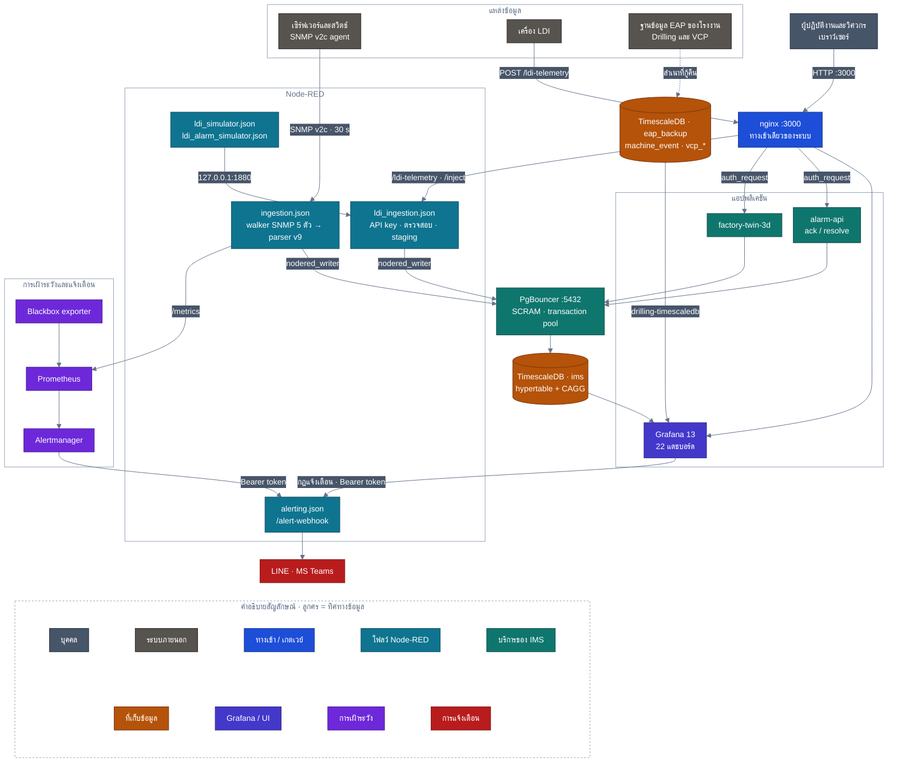

<!-- GLOBAL_NAV -->
<div align="right">
  <a href="README.md"> <b>หน้าหลัก</b></a> &nbsp;|&nbsp;
  <a href="docs/README.md"> <b>ดัชนีเอกสาร</b></a>
</div>
<br/>

<div align="center">
  <br/>
  <a href="https://github.com/PATTANAKORN025/IMS">
    
  </a>
  <br/><br/>
   &nbsp;&nbsp;&nbsp;&nbsp;
   &nbsp;&nbsp;&nbsp;&nbsp;
   &nbsp;&nbsp;&nbsp;&nbsp;
   &nbsp;&nbsp;&nbsp;&nbsp;
   &nbsp;&nbsp;&nbsp;&nbsp;
   &nbsp;&nbsp;&nbsp;&nbsp;
  
  <br/>
  <br/>
</div>

<h1 align="center">Industrial Monitoring System (IMS)</h1>

<div align="center">
 <p>
  <a href="../README.md"> <b>English</b></a> |
  <a href="README.md"> <b>ไทย</b></a> |
  <a href="../zh-CN/README.md"> <b>简体中文</b></a>
 </p>
</div>

<div align="center">
 <strong>ระบบ Telemetry สำหรับการผลิตที่ต้องการความแม่นยำสูง และการควบคุมกระบวนการเชิงสถิติ (SPC)</strong>
</div>

<br/>

> **ผู้อ่าน:** ชุมชนโอเพนซอร์ส ผู้ประเมินระบบ และวิศวกรผู้ติดตั้งระบบ
> **วัตถุประสงค์:** จุดเริ่มต้นหลักของโค้ดเบส IMS สรุปความสามารถ สถาปัตยกรรม และขั้นตอนการติดตั้ง
> **ที่มาของข้อมูล:** สถาปัตยกรรม เวอร์ชัน และคำสั่งทั้งหมดตรวจทานใหม่เทียบกับ repository (`main` หลังรวม PR #22/#23) เมื่อ 2026-09-26 ลิงก์หลักฐานขณะรันระบบระบุวันที่เก็บข้อมูลของตัวเอง

<div align="center">
  
  <br/>
  <br/>
  <a href="https://git.io/typing-svg"></a>
</div>

<div align="center">
  <a href="#เริ่มต้นใช้งานด่วน-สองเส้นทาง"></a>
  <a href="../LICENSE"></a>
  <a href="https://www.docker.com/"></a>
  <a href="https://grafana.com/"></a>
  <a href="https://nodered.org/"></a>
  <a href="https://www.timescale.com/"></a>
  <br>
  <a href="#การตรวจสอบและหลักฐาน"></a>
  <a href="#เริ่มต้นใช้งานด่วน-สองเส้นทาง"></a>
  <a href="../data-generators"></a>
</div>

<br/>

<div align="center" justify-content="space-between">
  <a href="docs/architecture/IMS_PLATFORM_BOOK.md"></a>
  <a href="docs/architecture/ARCHITECTURE.md"></a>
</div>

<br/>

## ภาพรวมระบบ

**IMS (Industrial Monitoring System)** เชื่อมงานผลิตที่ต้องการความแม่นยำสูงเข้ากับระบบไอทีขององค์กร เป็นแพลตฟอร์มเฝ้าระวังข้อมูล telemetry ที่สร้างบน Node-RED, TimescaleDB และ Grafana โดยรวมตัวชี้วัดโครงสร้างพื้นฐานไอทีกับข้อมูล OT (Operational Technology) ไว้ในฐานข้อมูล PostgreSQL ชุดเดียว

**สภาพจริงในโรงงาน (OT):** ในการผลิต PCB ขั้นสูง เครื่อง Laser Direct Imaging (LDI) ต้องตัดสินใจได้ทันที อุณหภูมิเลเซอร์หรือแรงดูดสุญญากาศที่เปลี่ยนเพียงเล็กน้อยก็ทำให้ลายวงจรวางตำแหน่งคลาดเคลื่อน (registration error) และเกิดของเสียราคาสูงได้ทันที ผู้ปฏิบัติงานจึงต้องการบอร์ด Andon ที่แยกสถานะด้วยสีอย่างชัดเจน เพื่อหยุดไลน์ผลิตเมื่อค่าควบคุมกระบวนการเชิงสถิติ (SPC) เช่น Cpk ต่ำกว่าเกณฑ์ที่ยอมรับได้

**การหลอมรวม IT/OT:** IMS ให้มุมมองดังกล่าวโดยนำวินัยงานไอทีมาใช้กับบริบทของ OT ระบบเฝ้าระวังสุขภาพโครงสร้างพื้นฐาน (เซิร์ฟเวอร์ สวิตช์เครือข่าย และความหน่วงของการรับข้อมูล) ควบคู่กับ telemetry ของเครื่อง LDI และเส้นทางรับข้อมูลผ่านการทดสอบโหลดด้วย K6 กับกลุ่มเครื่องจำลอง (ค่าเริ่มต้น 100 เซิร์ฟเวอร์ ปรับได้) เมื่อการจัดตำแหน่งของ LDI ผิดปกติ วิศวกรจึงเทียบกับเหตุเครือข่ายขัดข้องหรือ CPU เซิร์ฟเวอร์พุ่งสูงได้ทันทีบนหน้าจอเดียวกัน

**สถาปัตยกรรม (IT):** ประสิทธิภาพมาจากไปป์ไลน์ Node-RED แบบ stateful ที่รับข้อมูลแบบอะซิงโครนัส และ PgBouncer ที่ทำ connection pooling ส่วน TimescaleDB รับงานหนัก ทั้งคำนวณ baseline 3&sigma; แบบเลื่อนหน้าต่าง (Z-Score) และ Continuous Aggregates ทำให้ Grafana แสดงแดชบอร์ดได้ในระดับต่ำกว่าวินาที แม้ต้องค้นข้อมูลย้อนหลังหลายล้านแถว


<table style="border:none; border-collapse:collapse; width:100%;">

<tr>
<td align="center" style="border:none; padding:8px; width:33%;">
 <br/>
 <sub><b>NOC Overview</b> — ภาพรวมสุขภาพของกลุ่มเครื่อง</sub>
</td>
<td align="center" style="border:none; padding:8px; width:33%;">
 <br/>
 <sub><b>Engineering Drill-Down</b> — วินิจฉัยรายเครื่อง</sub>
</td>
<td align="center" style="border:none; padding:8px; width:33%;">
 <br/>
 <sub><b>Capacity Planning</b> — พยากรณ์ความจุ</sub>
</td>
</tr>
<tr>
<td align="center" style="border:none; padding:8px; width:33%;">
 <br/>
 <sub><b>LDI Manufacturing</b> — ศูนย์บัญชาการการผลิต</sub>
</td>
<td align="center" style="border:none; padding:8px; width:33%;">
 <br/>
 <sub><b>LDI Andon Board</b> — มุมมองผู้ปฏิบัติงานหน้าไลน์</sub>
</td>
<td align="center" style="border:none; padding:8px; width:33%;">
 <br/>
 <sub><b>LDI Engineering</b> — วิเคราะห์ Yield และ SPC</sub>
</td>
</tr>
</table>

>  **สำรวจภาพรวมทั้งระบบ:** อ่าน [คู่มือสถาปัตยกรรมแดชบอร์ด 22 ชุด ตั้งแต่ระดับภาพรวมถึงระดับรายละเอียด](docs/product/DASHBOARD_ECOSYSTEM.md) เพื่อดูว่า IMS ไล่จากตัวชี้วัดธุรกิจระดับผู้บริหารลงไปถึงข้อมูลวินิจฉัยระดับเซนเซอร์ครอบคลุม 4 โดเมนปฏิบัติการ (โครงสร้างพื้นฐาน, LDI, งานเจาะ CNC, งานชุบ VCP) อย่างไร

<br/>

---

## ความสามารถหลัก

<table>
<tr>
<td align="center" width="33%">
 <h3>การรับข้อมูล (Telemetry Ingestion)</h3>
 walker ของ Node-RED ทำงานขนานกัน ดึงข้อมูล SNMP แบบ bulk ตามลำดับ และรับข้อมูลผ่าน HTTP endpoint แล้วบันทึกลง TimescaleDB ผ่าน transaction pooling ของ PgBouncer<br/><br/>
 **หลักฐาน:** [nodered-ingestion-20260813.txt](../docs/evidence/runtime/nodered-ingestion-20260813.txt)
</td>
<td align="center" width="33%">
 <h3>การควบคุมกระบวนการเชิงสถิติ (SPC)</h3>
 ตัวชี้วัด SPC แบบเรียลไทม์ (Cpk) และ baseline 3&sigma; แบบเลื่อนหน้าต่าง (ตรวจจับความผิดปกติด้วย Z-Score) คำนวณในระดับฐานข้อมูล เพื่อแจ้งเตือนล่วงหน้า
</td>
<td align="center" width="33%">
 <h3>Continuous Aggregates</h3>
 TimescaleDB สรุปข้อมูลต่อเนื่อง (1 นาที, 15 นาที, 1 ชั่วโมง) โดยอัตโนมัติ ทำให้ Grafana แสดงผลได้ในระดับต่ำกว่าวินาทีแม้เลือกช่วงเวลากว้าง<br/><br/>
 **หลักฐาน:** [cagg-policies-20260813.txt](../docs/evidence/runtime/cagg-policies-20260813.txt)
</td>
</tr>
</table>

<br/>

---

## เริ่มต้นใช้งานด่วน (สองเส้นทาง)

> [!NOTE]
> **ขอบเขตของตัวจำลอง:** ทั้งสองเส้นทางรัน IMS บนเครื่องของคุณด้วยตัวจำลองข้อมูล SNMP/HTTP ในตัว (`ims-snmpsim`) และ **ไม่** เชื่อมต่อกับเครื่องจักรจริงหรืออุปกรณ์เครือข่ายภายนอก ตัวจำลองสร้าง telemetry และลำดับ alarm ที่สมจริงภายในขอบเขตที่กำหนด สำหรับใช้ตรวจสอบระบบ

เลือกเส้นทางตามบทบาทและเป้าหมายของคุณ:

### เส้นทาง A: ทัวร์สำหรับผู้ประเมิน (UI และ Workflow)

_สำหรับผู้จัดการ ผู้รีวิว UI/UX และผู้ประเมินระบบที่ต้องการเห็นแดชบอร์ดทำงานจริง_

```bash
git clone https://github.com/PATTANAKORN025/IMS.git
cd IMS
cp .env.example .env   # จากนั้นเปลี่ยนค่าลับทุกค่าก่อนเริ่มระบบครั้งแรก (ดูด้านล่าง)
make up                # build-flows + docker compose up -d (ครบ 16 service รวมตัวจำลอง)
sleep 40 && make verify
# เปิด http://localhost:3000 (ประตูหน้า nginx; Grafana ไม่ได้เปิดพอร์ตออกโดยตรง)
```

> [!WARNING]
> ค่าใน `.env.example` เป็นข้อมูลสาธารณะ ก่อนเริ่มระบบบนเครื่องใดก็ตามที่ไม่ใช่เครื่องทดลองชั่วคราว ให้สร้างค่าใหม่สำหรับรหัสผ่าน token และ key ทุกตัวใน `.env` (`POSTGRES_PASSWORD`, `GRAFANA_ADMIN_PASSWORD`, `GRAFANA_DB_PASSWORD`, `ALARM_API_DB_PASSWORD`, `INGEST_API_KEY`, `ALERT_WEBHOOK_TOKEN`, `NODE_RED_CREDENTIAL_SECRET`, `NODE_RED_ADMIN_PASSWORD_HASH`, `PGADMIN_DEFAULT_PASSWORD`, `GRAFANA_RENDERER_TOKEN`) ดูรายละเอียดที่ [SECURITY.md](SECURITY.md)

> **สิ่งที่จะได้เห็น:** ข้อมูลจำลองไหลเข้าอย่างเบา ๆ (~10–15 แถว/นาที) พอให้คลิกดู LDI Manufacturing Command Center, Operator Andon Board และกราฟ Cpk แบบเรียลไทม์ได้
> **หลักฐาน:** `docker compose ps` เมื่อ 2026-08-13 เก็บไว้ที่ [`docs/evidence/runtime/compose-ps-20260813.txt`](../docs/evidence/runtime/compose-ps-20260813.txt)

### เส้นทาง B: สนามพิสูจน์ประสิทธิภาพ (Stress Test)

_สำหรับ SRE, DBA และสถาปนิกระบบที่ต้องการตรวจสอบประสิทธิภาพจริงของระบบภายใต้โหลด IT/OT สูง_

```bash
git clone https://github.com/PATTANAKORN025/IMS.git
cd IMS
cp .env.example .env   # เปลี่ยนค่าลับทุกค่าก่อน
make up-prod           # compose หลัก + ข้อจำกัดทรัพยากรจาก docker-compose.prod.yaml
make test-load         # k6 run tests/k6/pipeline-stress.js (ต้องติดตั้ง k6 ไว้ใน PATH)
```

> **สิ่งที่จะได้เห็น:** K6 เพิ่มจำนวนเซิร์ฟเวอร์จำลองแบบไล่ระดับ (ค่าเริ่มต้น `TARGET_SERVERS=100` ตั้งค่า environment variable นี้เพื่อเพิ่มขนาด) ยิงเข้า ingestion endpoint ของ Node-RED โดยมีเกณฑ์ผ่านคือ อัตรา `pipeline_success` > 95 % และ `e2e_duration` p95 < 10 วินาที ระหว่างทดสอบดูความหน่วงของการรับข้อมูลและคิวของ PgBouncer ได้สดบนแดชบอร์ด `IMS Meta-Monitoring`

### แนวทาง C: ตัวอย่างโค้ดการเชื่อมต่อ API และ Telemetry (Code Examples)

_ออกแบบมาสำหรับวิศวกรเชื่อมต่อระบบ (Integration Engineers) และนักพัฒนาที่ต้องการเชื่อมต่อเครื่องจักรในโรงงาน, MES ภายนอก หรือสคริปต์อัตโนมัติ_

#### 1. ส่งข้อมูล Telemetry ของเครื่องจักร LDI ผ่าน HTTP POST
ส่งข้อมูลอนุกรมเวลา (Time-series) เข้าสู่ไปป์ไลน์ Node-RED โดยตรงผ่าน Nginx reverse proxy:

```bash
curl -X POST http://localhost:3000/ldi-telemetry \
  -H "Content-Type: application/json" \
  -H "X-API-Key: ${INGEST_API_KEY}" \
  -d '[{
    "time": "2026-09-28T04:00:00Z",
    "factory": "F1",
    "process": "LDI",
    "eqp_id": "LDI-01",
    "mo": "MO-001234",
    "fpn": "PN-5678",
    "layer_name": "L1",
    "resist_dosage": 45.5,
    "scale_x": 1.002,
    "scale_y": 0.998,
    "temperature": 24.5,
    "humidity": 45.0,
    "scan_speed": 120.0,
    "air_vacuum": -15.2,
    "thickness": 1.2,
    "board_no": 1,
    "total_board": 100,
    "total_time": 450.5,
    "state": true,
    "pe_1": 1.1,
    "je_1": 2.2,
    "log_id": "LOG-10001"
  }]'
```

#### 2. เวิร์กโฟลว์จัดการสถานะการแจ้งเตือน (Acknowledge & Resolve)
เรียกใช้งานเซอร์วิส `alarm-api` เพื่อเปลี่ยนสถานะของการแจ้งเตือนที่เกิดขึ้นในโรงงาน (`public.ldi_alarm_lifecycle`):

```bash
# ขั้นตอนที่ 1: รับทราบการแจ้งเตือน (เปลี่ยนสถานะ OPEN -> ACKNOWLEDGED ผ่าน Nginx Proxy)
# ตัวตนของผู้เรียกจะถูกดึงจาก Grafana session cookie โดยอัตโนมัติ
curl -X POST http://localhost:3000/alarm-api/alarms/ack \
  -H "Content-Type: application/json" \
  -H "Cookie: grafana_session=YOUR_SESSION_COOKIE" \
  -d '{
    "logdate_ms": 1790568000000,
    "logid": "LOG-10001"
  }'

# ขั้นตอนที่ 2: ปิดจบและแก้ไขปัญหาการแจ้งเตือน (เปลี่ยนสถานะ ACKNOWLEDGED -> RESOLVED)
curl -X POST http://localhost:3000/alarm-api/alarms/resolve \
  -H "Content-Type: application/json" \
  -H "Cookie: grafana_session=YOUR_SESSION_COOKIE" \
  -d '{
    "logdate_ms": 1790568000000,
    "logid": "LOG-10001",
    "resolution_note": "เปลี่ยนไส้กรองนิวแมติกและตรวจสอบแรงดันลมดูดให้อยู่ในสเปกเรียบร้อย"
  }'
```

#### 3. สร้างข้อมูลจำลองสังเคราะห์สำหรับงานเจาะ CNC และงานชุบ VCP
เติมฐานข้อมูล `eap_backup` ด้วยข้อมูลจำลองสังเคราะห์ที่สมจริง เพื่อทดสอบแดชบอร์ดงานเจาะและงานชุบ VCP โดยไม่ต้องใช้ข้อมูลจริงของโรงงาน:

```bash
# สร้างข้อมูลการทำงานสังเคราะห์ย้อนหลัง 7 วัน (168 ชั่วโมง)
node scripts/mock/eap-mock-data.js --hours=168 --apply

# ตรวจสอบการรันคิวรีและจำนวนแถวข้อมูลของทุกพาเนลในแดชบอร์ด
node scripts/mock/verify-mock-dashboards.js --container=ims-timescaledb --psql-user=ims_admin
```

#### 4. คิวรี Continuous Aggregates บน TimescaleDB (การวิเคราะห์ความเร็วสูง)
ตัวอย่างคำสั่ง SQL ดึงข้อมูลสถิติที่ประมวลผลล่วงหน้าแบบ Sub-second ด้วย CAGG จากข้อมูลประวัติศาสตร์นับล้านแถว:

```sql
-- คิวรีข้อมูลสรุปทุก 15 นาทีสำหรับสมรรถนะของเครื่องจักรในสายการผลิต
SELECT
  bucket AS "time",
  eqp_id AS machine_id,
  ROUND(avg_temperature::numeric, 2) AS temperature,
  ROUND(avg_scan_speed::numeric, 2) AS scan_speed
FROM public.ldi_data_15m
WHERE eqp_id = 'LDI-01'
  AND bucket > NOW() - INTERVAL '24 hours'
ORDER BY bucket ASC;
```

<details>
<summary><b>ข้อจำกัดที่ทราบและการตั้งค่าด้วยตนเอง</b></summary>

- ประตูหน้า nginx ใช้ HTTP ธรรมดา (`${GRAFANA_PORT:-3000}` บนเครื่อง host และพอร์ต 80 ในคอนเทนเนอร์) ต้องเพิ่ม TLS termination ก่อนใช้งานจริง
- Alertmanager จะไม่ส่งข้อความไป LINE/Teams จนกว่าจะกำหนด `LINE_CHANNEL_ACCESS_TOKEN`, `LINE_USER_ID` และ `TEAMS_WEBHOOK_URL` ใน `.env`
- `pgadmin` เผยแพร่ที่ `127.0.0.1:5050` (เฉพาะ localhost เท่านั้น ปลอดภัย)
- Makefile ใช้ shell ผสมกัน: `backup`, `restore`, `test-load`, `snapshot-flows` และ `deploy-flows` ต้องใช้ POSIX shell (บน Windows ใช้ Git Bash) ส่วน `doctor` ใช้การ redirect แบบ cmd

</details>

### การตรวจสอบและหลักฐาน

ข้อกล่าวอ้างด้านสถาปัตยกรรมมีสคริปต์ทดสอบและไฟล์หลักฐานที่ระบุวันที่รองรับ `.github/workflows/ci.yml` รันการตรวจชุดเดียวกับ `node scripts/pre-commit.js` พร้อม gitleaks, การตรวจ compose และการ lint ของ Prometheus เมื่อ repository ใช้งาน GitHub Actions ได้ ผลทดสอบโหลด หลักฐาน visual regression และผลซ้อมกู้คืนระบบ (disaster recovery) ดูได้ที่ **[ดัชนีหลักฐาน](docs/evidence/INDEX.md)**

<details>
<summary><b>คำสั่งที่ใช้ได้</b></summary>

| คำสั่ง | คำอธิบาย |
| --- | --- |
| `make help` | แสดงรายการเป้าหมาย Makefile ทั้งหมด |
| `make doctor` | ตรวจสิ่งที่ต้องติดตั้งไว้ก่อน (docker, compose, node) |
| `make check` | รันชุดตรวจสอบก่อนคอมมิตแบบเต็ม (`pre-commit.js`) |
| `make check-env` | ตรวจสอบตัวแปรที่จำเป็นใน .env และตรวจการรั่วไหลของ secret |
| `make up` | build flows แล้วเริ่มครบ 16 service (รวมตัวจำลอง) |
| `make up-prod` | เหมือน `make up` แต่ใช้ overlay ทรัพยากรจาก `docker-compose.prod.yaml` |
| `make down` / `make restart` | หยุดทั้ง stack / รีสตาร์ต node-red, grafana, alertmanager, prometheus |
| `make logs` | ติดตาม log ของ Node-RED |
| `make verify` | ตรวจสุขภาพทั้งระบบ (คอนเทนเนอร์ ฐานข้อมูล ไปป์ไลน์ การแจ้งเตือน) |
| `make build-flows` / `make validate-flows` | รวม `nodered_data/flows/*.json` เป็น `flows.json` / ตรวจว่าไฟล์ถูกต้อง |
| `make snapshot-flows` / `make deploy-flows` | สำรอง `flows.json` / ส่ง flow ที่แยกไฟล์ไว้ขึ้น Node-RED |
| `make test-unit` | ชุด unit test ทั้งหมดใน tests/unit/ |
| `make test-load` | stress test ไปป์ไลน์ด้วย K6 (`TARGET_SERVERS` ค่าเริ่มต้น 100) |
| `make test-visual` / `make test-visual-ldi` | regression ภาพหน้าจอแดชบอร์ดด้วย Playwright |
| `make validate-dashboards` | ค้นหารหัสสี hex ที่เสียหายใน JSON ของแดชบอร์ด |
| `make backup` / `make restore FILE=<path>` | dump / restore ฐานข้อมูล |

ชุดตรวจก่อน commit ฉบับเต็ม (unit test ทั้งหมด, linter ใน `tests/lint/`, การตรวจ JSON ของแดชบอร์ดและ flow) รันด้วย `node scripts/pre-commit.js`

</details>

---

## สถาปัตยกรรม


```mermaid
%%{init: {"flowchart": {"nodeSpacing": 20, "rankSpacing": 32, "padding": 10, "wrappingWidth": 150, "curve": "basis"}, "sequence": {"wrap": true, "width": 170, "actorMargin": 36, "boxMargin": 8, "noteMargin": 8, "messageMargin": 30, "mirrorActors": false}, "state": {"padding": 6}, "theme": "base", "themeVariables": {"fontFamily": "Inter, Segoe UI, Helvetica, Arial, sans-serif", "fontSize": "14px", "primaryColor": "#334155", "primaryTextColor": "#ffffff", "primaryBorderColor": "#1e293b", "lineColor": "#64748b", "textColor": "#64748b", "secondaryColor": "#475569", "tertiaryColor": "#f1f5f9", "clusterBkg": "transparent", "clusterBorder": "#94a3b8", "titleColor": "#64748b", "edgeLabelBackground": "#475569", "nodeTextColor": "#ffffff", "noteBkgColor": "#fef3c7", "noteTextColor": "#1e293b", "noteBorderColor": "#d97706", "actorBkg": "#334155", "actorTextColor": "#ffffff", "actorBorder": "#1e293b", "actorLineColor": "#94a3b8", "signalColor": "#64748b", "signalTextColor": "#64748b", "labelBoxBkgColor": "#334155", "labelBoxBorderColor": "#1e293b", "labelTextColor": "#ffffff", "loopTextColor": "#64748b", "activationBkgColor": "#e2e8f0", "sequenceNumberColor": "#ffffff", "stateLabelColor": "#ffffff", "compositeBackground": "transparent", "transitionColor": "#64748b", "transitionLabelColor": "#64748b"}}}%%
flowchart TB
  accTitle: ภาพรวมระบบ IMS
  accDescr: ข้อมูลจากอุปกรณ์ SNMP เครื่อง LDI และฐานข้อมูล EAP ของโรงงาน ผ่าน nginx และ Node-RED เข้าสู่ TimescaleDB แสดงผลใน Grafana 22 แดชบอร์ด และการแจ้งเตือนส่งถึง LINE และ Teams ผ่าน Node-RED

  subgraph SRC["แหล่งข้อมูล"]
    SNMPDEV["เซิร์ฟเวอร์และสวิตช์<br/>SNMP v2c agent"]:::ext
    LDIM["เครื่อง LDI"]:::ext
    EAPSRC["ฐานข้อมูล EAP ของโรงงาน<br/>Drilling และ VCP"]:::ext
  end

  USERS["ผู้ปฏิบัติงานและวิศวกร<br/>เบราว์เซอร์"]:::actor
  PROXY["nginx :3000<br/>ทางเข้าเดียวของระบบ"]:::ingress

  subgraph NR["Node-RED"]
    NR_LDI["ldi_ingestion.json<br/>API key · ตรวจสอบ · staging"]:::flow
    NR_SIM["ldi_simulator.json<br/>ldi_alarm_simulator.json"]:::flow
    NR_SNMP["ingestion.json<br/>walker SNMP 5 ตัว → parser v9"]:::flow
    NR_ALERT["alerting.json<br/>/alert-webhook"]:::flow
  end

  PGB["PgBouncer :5432<br/>SCRAM · transaction pool"]:::app
  TSDB[("TimescaleDB · ims<br/>hypertable + CAGG")]:::store
  EAPDB[("TimescaleDB · eap_backup<br/>machine_event · vcp_*")]:::store

  subgraph APPS["แอปพลิเคชัน"]
    GRAF["Grafana 13<br/>22 แดชบอร์ด"]:::viz
    ALARM["alarm-api<br/>ack / resolve"]:::app
    TWIN["factory-twin-3d"]:::app
  end

  subgraph MON["การเฝ้าระวังและแจ้งเตือน"]
    PROM["Prometheus"]:::obs
    BBOX["Blackbox exporter"]:::obs
    AM["Alertmanager"]:::obs
  end
  NOTIFY["LINE · MS Teams"]:::notify

  SNMPDEV -->|"SNMP v2c · 30 s"| NR_SNMP
  LDIM -->|"POST /ldi-telemetry"| PROXY
  PROXY -->|"/ldi-telemetry · /inject"| NR_LDI
  NR_SIM -->|"127.0.0.1:1880"| NR_LDI
  NR_SNMP -->|"nodered_writer"| PGB
  NR_LDI -->|"nodered_writer"| PGB
  PGB --> TSDB
  EAPSRC -.->|"สำเนาที่กู้คืน"| EAPDB
  USERS -->|"HTTP :3000"| PROXY
  PROXY --> GRAF
  PROXY -->|"auth_request"| ALARM
  PROXY -->|"auth_request"| TWIN
  TSDB --> GRAF
  EAPDB -->|"drilling-timescaledb"| GRAF
  ALARM --> PGB
  TWIN --> PGB
  NR_SNMP -->|"/metrics"| PROM
  BBOX --> PROM
  PROM --> AM
  AM -->|"Bearer token"| NR_ALERT
  GRAF -->|"กฎแจ้งเตือน · Bearer token"| NR_ALERT
  NR_ALERT --> NOTIFY

  subgraph LEGEND["คำอธิบายสัญลักษณ์ · ลูกศร = ทิศทางข้อมูล"]
    direction TB
    subgraph LEGEND_0[" "]
      direction LR
      LG_actor["บุคคล"]:::actor ~~~ LG_ext["ระบบภายนอก"]:::ext ~~~ LG_ingress["ทางเข้า / เกตเวย์"]:::ingress ~~~ LG_flow["โฟลว์ Node-RED"]:::flow ~~~ LG_app["บริการของ IMS"]:::app
    end
    subgraph LEGEND_1[" "]
      direction LR
      LG_store["ที่เก็บข้อมูล"]:::store ~~~ LG_viz["Grafana / UI"]:::viz ~~~ LG_obs["การเฝ้าระวัง"]:::obs ~~~ LG_notify["การแจ้งเตือน"]:::notify
    end
    LEGEND_0 ~~~ LEGEND_1
  end
  NOTIFY ~~~ LEGEND
  style LEGEND fill:transparent,stroke:#94a3b8,stroke-dasharray:3 3
  style LEGEND_0 fill:transparent,stroke:transparent
  style LEGEND_1 fill:transparent,stroke:transparent
  classDef actor fill:#475569,stroke:#1e293b,color:#ffffff,stroke-width:1px
  classDef ext fill:#57534e,stroke:#292524,color:#ffffff,stroke-width:1px
  classDef ingress fill:#1d4ed8,stroke:#1e3a8a,color:#ffffff,stroke-width:1px
  classDef app fill:#0f766e,stroke:#134e4a,color:#ffffff,stroke-width:1px
  classDef flow fill:#0e7490,stroke:#164e63,color:#ffffff,stroke-width:1px
  classDef store fill:#b45309,stroke:#78350f,color:#ffffff,stroke-width:1px
  classDef viz fill:#4338ca,stroke:#312e81,color:#ffffff,stroke-width:1px
  classDef obs fill:#6d28d9,stroke:#4c1d95,color:#ffffff,stroke-width:1px
  classDef notify fill:#b91c1c,stroke:#7f1d1d,color:#ffffff,stroke-width:1px
  classDef future fill:#f8fafc,stroke:#94a3b8,color:#475569,stroke-width:1px,stroke-dasharray:4 3
```

<details>
<summary><b>การไหลของข้อมูลทีละขั้น</b></summary>

1. **การเก็บข้อมูล** — ทุก 30 วินาที (`Poll Fleet (30s)`) Node-RED แตก walker 4 ตัวสำหรับสวิตช์เครือข่าย (CPU, Storage, Network, Temp) และ 5 ตัวสำหรับเซิร์ฟเวอร์ (เพิ่ม LDI) โหลดทะเบียนอุปกรณ์จาก `public.devices` ใหม่ทุก 5 นาที เครื่อง LDI ยังส่ง JSON เข้า `POST /ldi-telemetry` ผ่าน nginx โดยยืนยันตัวตนด้วย `INGEST_API_KEY`
2. **การ walk** — walk แบบ bulk อะซิงโครนัสทีละขั้น (`session.subtree` ด้วย `maxRepetitions: 50`) ใช้ UDP socket เดียวเพื่อไม่ให้สวิตช์ทิ้งแพ็กเก็ต circuit breaker จะตัดวงจรเมื่อผิดพลาด 2 ครั้ง และทดลองใหม่อัตโนมัติในสถานะ HALF_OPEN
3. **การแยกวิเคราะห์ (parsing)** — `sre_parser` เก็บสถานะรายอุปกรณ์ไว้ใน flow context (`dev_state_<deviceId>`) และพักแถวข้อมูลไว้ใน `batch_buf_<deviceId>` heartbeat สถานะออฟไลน์ (`_walker: "offline"`) จะตั้งค่าตัวชี้วัดทั้งหมดเป็นศูนย์ทันทีเมื่ออุปกรณ์ล้มเหลว
4. **การจัดเก็บ** — flush แยกอิสระตามตัวจับเวลา: ตารางแต่ละประเภท (sys/net/ldi) จะ insert ก็ต่อเมื่อบัฟเฟอร์ของตัวเองมีข้อมูล walker ที่ล้มเหลวบางตัวจึงไม่ขวางการเขียนข้อมูลส่วนอื่น
5. **Continuous Aggregation** — นโยบาย refresh ของ TimescaleDB ทำงานครอบคลุม 7 continuous aggregates (`ldi_data_1m`, `ldi_data_15m`, `ldi_data_1h`, `ldi_data_hourly`, `sys_hourly`, `net_hourly`, `ldi_hourly`) ดู [Data Flow](docs/architecture/DATA_FLOW.md) ระยะเก็บข้อมูลจริง (ตรวจกับฐานข้อมูลที่รันอยู่ ดู `docs/architecture/DATA_RETENTION.md`): raw `sys_metrics`/`net_metrics`/`ldi_metrics` 30 วัน, `ldi_data` 180 วัน, `ldi_data_1h` และ `ldi_data_hourly` 2 ปี (ทั้งนี้ continuous aggregates 3 ตัวตระกูล `*_hourly` ยังไม่มีนโยบายลบข้อมูลอัตโนมัติ)
6. **การแสดงผล** — 22 แดชบอร์ดในสี่โฟลเดอร์ของ Grafana: 01 งานเจาะ (4 ชุด: ภาพรวมกลุ่มเครื่อง, ผลผลิตรายกะ, การตรวจสอบรายเครื่อง, ความผิดปกติและสาเหตุราก), 02 LDI (10 ชุด: ภาพรวมผู้บริหาร, Andon สำหรับผู้ปฏิบัติงาน, Digital Twin ของโรงงาน, ศูนย์บัญชาการกลุ่มเครื่อง, Snapshot รายเครื่อง, วิเคราะห์วิศวกรรมและ SPC, คอนโซลแจ้งเตือน, การตอบสนองแจ้งเตือน MTTA/MTTR, พจนานุกรมแจ้งเตือน, ความพร้อมของข้อมูล), 03 แพลตฟอร์มและ NOC (5 ชุด: ภาพรวม NOC, Engineering Drill-Down, AIOps Capacity, Ingestion Latency, Meta-Monitoring), 04 งานชุบ VCP (3 ชุด: ภาพรวมกลุ่มสาย, คอนโซลปฏิบัติการ, จอแสดงผลเรียลไทม์)
7. **การแจ้งเตือน** — Prometheus scrape `/metrics` แล้ว Alertmanager ส่งต่อไป LINE Messaging API และ MS Teams พร้อมลิงก์ runbook (การส่งจริงต้องให้ผู้ดูแลกำหนด credential เอง โดยตั้งใจไม่ใส่มาให้) ความผิดปกติแบบ Z-Score คำนวณด้วย SQL ของ Grafana บน TimescaleDB

</details>

<details>
<summary><b>สถาปัตยกรรมแดชบอร์ด</b></summary>

22 แดชบอร์ด — งานเจาะ 4 ชุด การผลิต LDI 10 ชุด โครงสร้างพื้นฐาน 5 ชุด และงานชุบ VCP 3 ชุด (`monitoring/grafana/dashboards/{drilling,manufacturing,infrastructure,vcp}/` provision แยกโฟลเดอร์ละหนึ่งโดเมนใน Grafana — ขอบเขตโดเมนดูที่ **[Ownership](docs/architecture/OWNERSHIP.md)**) แดชบอร์ดงานเจาะและ VCP อ่านฐานข้อมูล `eap_backup` ผ่าน data source `drilling-timescaledb` หากไม่มีข้อมูลโรงงาน ให้โหลด **[ข้อมูลสังเคราะห์](docs/data/MOCK_DATA.md)** ตารางเต็มพร้อมจำนวน panel และคำอธิบายอยู่ที่ **[Dashboard Inventory](docs/architecture/DASHBOARD_INVENTORY.md)** ซึ่งสร้างอัตโนมัติจาก JSON ของแดชบอร์ด (`node scripts/generate-dashboard-inventory.js`) และตรวจใน CI จึงไม่คลาดจากแดชบอร์ดจริงแบบตารางที่พิมพ์เอง

**Design System:** Cyberpunk HUD — พื้นหลัง `#030407`, จานสี Tailwind (`#22C55E` ปกติ, `#F59E0B` เตือน, `#EF4444` วิกฤต, `#00F2FE` ข้อมูลทั่วไป, `#3B82F6` สีเน้น — token ที่อนุมัติใน [GRAFANA_DESIGN_SYSTEM.md](docs/architecture/GRAFANA_DESIGN_SYSTEM.md) §2.1), ตัวเลขสถิติใช้ Roboto Mono, panel แบบ glassmorphism, layout Grid-24 ไม่ซ้อนทับกัน

</details>

---

## จอแสดงผล NOC (Wall Display)

สร้าง playlist ที่ **Dashboards → Playlists** แล้วเริ่มเล่นจากหน้า playlist โดย Grafana 13 จะเปิดทุกแดชบอร์ดในโหมด kiosk ส่วน `scripts/create-playlist.sh` ช่วยทำขั้นตอนนี้อัตโนมัติ แต่ยังเรียก playlist API แบบเดิมที่อ้างอิงด้วย id จึงควรตรวจซ้ำทุกครั้งที่อัปเกรด Grafana

| โหมด | พารามิเตอร์ URL | การใช้งาน |
| --- | --- | --- |
| **Kiosk** | `?kiosk` | จอแสดงผล — ซ่อนแถบนำทาง |
| **Kiosk + fit** | `?kiosk&autofitpanels` | จอแสดงผล — ปรับขนาด panel ให้พอดีความสูงจอด้วย |
| **Operator Andon** | `/d/ims-ldi-operator-andon?kiosk` | บอร์ดหน้าไลน์แบบอ่านอย่างเดียว งานที่ต้องกดโต้ตอบให้ทำบน Alarm Console |

ใช้ `kiosk`: โหมด TV แบบเดิม (`kiosk=tv`) ไม่ใช่ตัวเลือก kiosk ของ Grafana 13 (ลิงก์ในแดชบอร์ดบางชุดของ repository นี้ยังใช้ค่านี้อยู่)

---

<details>
<summary><b>เทคโนโลยีที่ใช้</b></summary>

| ชั้น | เทคโนโลยี | หน้าที่ |
| --- | --- | --- |
| **Orchestration** | Docker Compose | stack 16 service (`docker-compose.yaml`) + overlay ทรัพยากรสำหรับ production |
| **การเก็บข้อมูล** | Node-RED + net-snmp | walk SNMP แบบ bulk อะซิงโครนัสทีละขั้น, walker ขนาน 5 เธรด |
| **ฐานข้อมูล** | TimescaleDB 2.29 (PostgreSQL 16) + PgBouncer 1.25 | Hypertables, rollup แบบ CAGG, การบีบอัดแบบ native, นโยบายระยะเก็บข้อมูล |
| **การแสดงผล** | Grafana 13.1.2 + image renderer | 22 แดชบอร์ด (งานเจาะ 4 + LDI 10 + โครงสร้างพื้นฐาน 5 + VCP 3) |
| **การแจ้งเตือน** | Prometheus + Alertmanager | scrape ตัวชี้วัด, inhibition rules, LINE Messaging API + MS Teams webhooks |
| **ทดสอบโหลด** | K6 | stress test ไปป์ไลน์, เกณฑ์ success > 95 %, e2e p95 < 10 วินาที |
| **Services** | Node.js 22 (Express) | `alarm-api` (เส้นทางเขียน acknowledge/resolve), `factory-twin-3d` (ดิจิทัลทวินชั้น 1) |
| **ประตูหน้า** | nginx 1.31 | เปิดพอร์ต UI เพียงพอร์ตเดียว; route แบบ same-origin ไปยัง Grafana, alarm-api, twin และช่องรับข้อมูลของ Node-RED |
| **SLA Probing** | Blackbox Exporter | เฝ้าระวัง endpoint แบบ HTTP/TCP/ICMP |

</details>

<details>
<summary><b>โครงสร้างฐานข้อมูล</b></summary>

- `devices` — ทะเบียนอุปกรณ์ แหล่งข้อมูลจริงหนึ่งเดียวทั้งของอุปกรณ์โครงสร้างพื้นฐานที่ poll ด้วย SNMP และเครื่อง LDI (`device_type`)
- `sys_metrics` / `net_metrics` — telemetry ของโครงสร้างพื้นฐาน (CPU/RAM/disk/อุณหภูมิ, RX/TX ราย interface) เป็น hypertable
- `ldi_metrics` — ข้อมูลการผลิตแบบเดิม (throughput/PE/JE/ความชื้น/กำลังไฟ/การสั่นสะเทือน) เป็น hypertable
- `ldi_data` / `ldi_alarm_log` — telemetry และ alarm ของ LDI แบบ normalize (V2) เชื่อมเหตุการณ์เพื่อทำ RCA แบบตรงตัวด้วย `related_log_id` เป็น hypertable
- `sys_hourly` / `net_hourly` / `ldi_hourly` / `ldi_data_1m` / `ldi_data_15m` / `ldi_data_1h` / `ldi_data_hourly` — continuous aggregates
- `v_machine_spc_fleet` / `v_ldi_rca_recent_window` / `v_ldi_rca_truth_test` — materialized views ที่ refresh ทุก 60 วินาที

จำนวนคอลัมน์ที่แน่นอน รายการ view/CAGG ทั้งหมด และจำนวน migration ที่ apply แล้ว ดูที่ **[Database Schema Inventory](docs/architecture/DATABASE_SCHEMA.md)** ซึ่งสร้างอัตโนมัติจาก `information_schema` + `timescaledb_information.*` (`node scripts/generate-schema-inventory.js`) และตรวจใน CI เทียบกับฐานข้อมูลจริง

</details>

<details>
<summary><b>โครงสร้างโปรเจกต์</b></summary>

```text
IMS/
├── docker-compose.yaml         # 16 service; docker-compose.prod.yaml เพิ่มข้อจำกัดทรัพยากร
├── proxy/nginx.conf            # ประตูหน้าเพียงทางเดียว (Grafana, alarm-api, twin, ช่องรับข้อมูล LDI)
├── monitoring/
│  ├── grafana/
│  │  ├── dashboards/{drilling,manufacturing,infrastructure,vcp}/  # แดชบอร์ดที่ provision 4 + 10 + 5 + 3 ชุด (ต้นฉบับจริง)
│  │  ├── library-panels/        # library panel ที่ใช้ร่วมกัน (Fleet Health Score)
│  │  └── provisioning/, grafana.ini
│  ├── prometheus/, alertmanager/, blackbox/, snmpsim/
├── nodered_data/
│  ├── flows/                  # ไฟล์ flow แยก 5 ไฟล์ (ต้นฉบับ); flows.json เป็นผลจากการ build
│  ├── lib/                    # circuit-breaker.js, parser.js, snmp-normalize.js, units.js
│  └── settings.js
├── postgres/init/              # SQL bootstrap ตอนบูตครั้งแรก + สคริปต์รหัสผ่าน grafana
├── database/migrations/        # migration แบบเดินหน้าอย่างเดียวตามลำดับเลข (สูงสุด 091) apply โดย db-migrate
├── services/
│  ├── alarm-api/              # เส้นทางเขียน acknowledge/resolve (Express + pg)
│  └── factory-twin-3d/        # ดิจิทัลทวินชั้น 1 (Express, lib/*.js + ตัวแสดงผลใน public/)
├── tests/                      # unit/ + lint/ (ไม่ต้องใช้ infrastructure), e2e/, smoke/, playwright/, k6/, ...
├── scripts/                    # build-flows.js, migrate-entrypoint.sh, verify-deployment.*, backup/restore, generators
├── assets/                     # ภาพหน้าจอและแบนเนอร์ของ README
├── docs/                       # เอกสารภาษาอังกฤษ: architecture/, operations/, user/, admin/, audit/, evidence/, ...
├── th/, zh-CN/                 # เอกสารฉบับภาษาไทยและภาษาจีนตัวย่อ
└── .agents/skills/             # agent skills สำหรับเครื่องมือ AI
```

</details>

---

## เอกสารและชุมชน

<div align="center">

###  ผู้บริหารและกลยุทธ์ธุรกิจ

| เอกสาร | คำอธิบาย |
| :---: | --- |
| [**คุณค่าทางธุรกิจและ ROI**](docs/business/BUSINESS_VALUE_ROI.md) | บทสรุปผู้บริหาร การลดต้นทุน การลด MTTR และผลเชิงกลยุทธ์ |
| [**Platform Book (เริ่มที่นี่)**](docs/architecture/IMS_PLATFORM_BOOK.md) | ศูนย์กลางนำทางของเอกสารทั้งชุด พร้อมอภิธานศัพท์ |
| [**บริบทผลิตภัณฑ์**](docs/product/PRODUCT.md) | วัตถุประสงค์ของผลิตภัณฑ์ กลุ่มผู้ใช้ และตำแหน่งทางการตลาด |

###  การผลิตและข้อมูลเชิงลึกของ LDI

| เอกสาร | คำอธิบาย |
| :---: | --- |
| [**แผนแพลตฟอร์มการผลิต**](docs/architecture/IMS_MANUFACTURING_PLATFORM_V2.md) | การแยกโดเมนโครงสร้างพื้นฐาน/การผลิต และแผน validation/soak/DR |
| [**โดเมนการผลิต**](docs/architecture/MANUFACTURING_DOMAIN.md) | รูปแบบ schema/แดชบอร์ดของ LDI และขั้นตอนเพิ่มเครื่องใหม่ |
| [**คู่มือ LDI SPC**](docs/architecture/LDI_SPC_GUIDE.md) | วิธีวัดความสามารถของกระบวนการ (Cpk) และสูตรคำนวณ |
| [**คู่มือ LDI RCA**](docs/architecture/LDI_RCA_GUIDE.md) | วิธีหาความสัมพันธ์ของสาเหตุราก (Lift/Confidence) |
| [**โปรโตคอลตรวจรับ LDI**](docs/operations/LDI_VALIDATION_PROTOCOL.md) | ขั้นตอนอนุมัติใช้งานจริง 4 ระยะ |

###  สถาปัตยกรรมหลักและความปลอดภัย

| เอกสาร | คำอธิบาย |
| :---: | --- |
| [**สถาปัตยกรรม**](docs/architecture/ARCHITECTURE.md) | บริบทระบบ, ADR, สถาปัตยกรรมสตรีมมิง, กลยุทธ์ CAGG |
| [**แผนภาพสถาปัตยกรรม**](docs/architecture/ARCHITECTURE_DIAGRAM.md) | แผนภาพ C4 และ sequence ด้วย Mermaid |
| [**การไหลของข้อมูล**](docs/architecture/DATA_FLOW.md) | แผนภาพไปป์ไลน์ตั้งแต่ต้นจนจบ และห่วงโซ่ rollup ของ CAGG ที่ใช้จริง |
| [**โครงสร้างฐานข้อมูล**](docs/architecture/DATABASE_SCHEMA.md) | ข้อมูลอ้างอิงตาราง/คอลัมน์/view ที่สร้างอัตโนมัติ (ตรวจใน CI) |
| [**โมเดลความปลอดภัย**](docs/architecture/SECURITY_MODEL.md) | ขอบเขตความเชื่อถือ การยืนยันตัวตนราย adapter และ RBAC |
| [**การเชื่อมต่ออุปกรณ์ (EAP)**](docs/architecture/EAP_ARCHITECTURE.md) | สัญญาของ adapter แบบ SNMP, HTTP/JSON และ SECS/GEM |
| [**ความเป็นเจ้าของ**](docs/architecture/OWNERSHIP.md) | ขอบเขตโดเมนที่บังคับผ่าน `CODEOWNERS` |
| [**Design System**](docs/architecture/GRAFANA_DESIGN_SYSTEM.md) | จานสีตามความหมาย ตัวอักษร และสัญญาเรื่อง threshold |
| [**Dashboard Inventory**](docs/architecture/DASHBOARD_INVENTORY.md) | ตารางแดชบอร์ด/จำนวน panel ที่สร้างอัตโนมัติ (ตรวจใน CI) |
| [**ข้อมูลสังเคราะห์ (Mock Data)**](docs/data/MOCK_DATA.md) | ชุดตัวสร้างข้อมูลสังเคราะห์สำหรับการตรวจสอบงานเจาะและ VCP |

### Playbook สำหรับงานปฏิบัติการและ SRE

| เอกสาร | คำอธิบาย |
| :---: | --- |
| [**คู่มือผู้ใช้**](docs/user/USER_MANUAL.md) | คู่มือแดชบอร์ด ความหมายตัวชี้วัด และ playbook รับมือการแจ้งเตือน |
| [**คู่มือผู้ดูแลระบบ**](docs/admin/ADMIN_MANUAL.md) | การจัดการคอนเทนเนอร์ การลงทะเบียนอุปกรณ์ migration การสำรอง/กู้คืน |
| [**SOP ผู้ปฏิบัติงาน**](docs/operations/SOP_OPERATOR.md) | ขั้นตอนปฏิบัติมาตรฐานสำหรับหน้างานโรงงาน / NOC ระดับ 1 |
| [**การแก้ปัญหาและ Alarm**](docs/operations/ALARM_PLAYBOOK.md) | playbook แก้รหัส alarm และแก้ปัญหา |
| [**การรับมือเหตุการณ์**](docs/operations/INCIDENT_RESPONSE.md) | กรอบระดับความรุนแรง พร้อมตัวอย่างเหตุการณ์จริง |
| [**คู่มือระดับความรุนแรงของ Alarm**](docs/architecture/ALARM_SEVERITY_GUIDE.md) | ระดับความรุนแรง 4 ระดับ ขอบเขตตาม ISA-18.2 |
| [**สำรองและกู้คืนข้อมูล**](docs/operations/BACKUP_RESTORE.md) | หลักฐานจริงจาก dr-test.sh ขั้นตอน และข้อควรระวัง |
| [**แผนทดสอบ DR**](docs/operations/DR_TEST_PLAN.md) | แผนซ้อมกู้คืนระบบ 3 รายการ |
| [**ระยะเก็บข้อมูล**](docs/architecture/DATA_RETENTION.md) | นโยบายระยะเก็บและการบีบอัดข้อมูลที่ใช้จริง |
| [**รายการตรวจก่อนออก Release**](docs/operations/RELEASE_CHECKLIST.md) | สิ่งที่ต้องตรวจก่อนติด tag release |
| [**การแก้ไขปัญหา**](docs/operations/TROUBLESHOOTING.md) | ปัญหาที่พบบ่อย คำสั่ง debug และขั้นตอนกู้คืน |
| [**Runbook งานปฏิบัติการ**](docs/operations-runbook.md) | คำสั่งดูแล stack และกู้คืนระบบประจำวัน |
| [**คู่มือผู้ปฏิบัติงาน Factory Twin**](docs/architecture/FACTORY_TWIN_OPERATOR_GUIDE.md) | วิธีอ่านดิจิทัลทวินชั้น 1 และสถานะหลักฐานของข้อมูล |
| [**ความพร้อมใช้งานจริง**](PRODUCTION-READINESS.md) | สถานะ release gate และความเสี่ยงที่ยังเปิดอยู่ |

###  ชุมชนและข้อมูลอ้างอิง

| เอกสาร | คำอธิบาย |
| :---: | --- |
| [**สคริปต์วิดีโอแนะนำการใช้งาน**](docs/product/ONBOARDING_SCRIPT.md) | สตอรีบอร์ดและแนวทางบันทึก GIF/วิดีโอแนะนำการใช้งาน |
| [**แนวทางการมีส่วนร่วม**](CONTRIBUTING.md) | ขั้นตอนพัฒนา การตั้งชื่อ branch และรูปแบบ commit |
| [**จรรยาบรรณ**](CODE_OF_CONDUCT.md) | มาตรฐานของชุมชนและการบังคับใช้ |
| [**นโยบายความปลอดภัย**](SECURITY.md) | การรายงานช่องโหว่ |
| [**บันทึกการเปลี่ยนแปลง**](CHANGELOG.md) | ประวัติ release และการรวมโค้ด |
| [**รายงานบั๊ก**](.github/ISSUE_TEMPLATE/bug_report.md) | รายงานข้อบกพร่องหรือ regression |
| [**ขอฟีเจอร์**](.github/ISSUE_TEMPLATE/feature_request.md) | เสนอฟีเจอร์ใหม่ |

</div>

---

<div align="center">

**สร้างด้วยความแม่นยำ ออกแบบเพื่อความพร้อมใช้งานต่อเนื่อง**

[MIT License](../LICENSE) — 2026 ผู้ร่วมพัฒนา IMS

</div>
